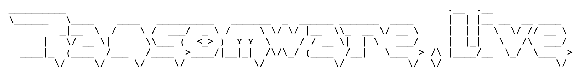

>[Ransomware.live](https://ransomware.live) is originally a fork of [ransomwatch](https://github.com/joshhighet/ransomwatch) and inspired by [ransomlook](https://github.com/RansomLook/RansomLook). 
>[Ransomware.live](https://ransomware.live) is a ransomware leak site monitoring tool. It will scrape all of the entries on various ransomware leak sites and published them.

## 🔭 Sources 

### Internal 

You can find all ransomware victims in **json** format [here](https://data.ransomware.live/posts.json) or in **CSV** format [here](https://www.ransomware.live/posts.csv).

### External

- [ransomwhe.re](https://ransomwhe.re/) for the crypto wallet information 
- [Zscaler ThreatLabz](https://github.com/threatlabz/ransomware_notes) for the ransomware notes
- [Valéry Rieß-Marchive](https://twitter.com/ValeryMarchive) for the information about [cyberattacks](https://github.com/Casualtek/Cyberwatch/) and the [negotiation chats](https://github.com/Casualtek/Ransomchats)
- [Malpedia](https://malpedia.caad.fkie.fraunhofer.de/) for the Ransomware description
- [CERT Orange Cyberdefense](https://www.orangecyberdefense.com/) for the Ransomware map 

## ⚙️ API

An API is available for `ransomware.live`'s data

You can find more information about it : [here](https://api.ransomware.live/apidocs)

## ❤️ Support 

If you want to support ransomware.live :

## 🗞️ They talk about ransomware.live

Find [articles](press.md) about `ransomware.live`

## 👓 Feed RSS 

You can follow `ransomware.live` from its [RSS Feed](https://ransomware.live/rss.xml)

## 📜 License

ransomwatch is [licensed](https://github.com/jmousqueton/ransomware.live/blob/main/LICENSE) under [unlicense.org](https://unlicense.org/)

## 👨🏼‍💼 About me 

I'm **Julien Mousqueton**

- I'm **CTO** in Cyber Security 🛡 
- I'm a **lecturer** 🎓 in Cyber Security @ [Ecole 2600](https://www.ecole2600.com) 🏴‍☠️
- I'm a **blogger** ✍🏻 at [julien.io](https://julien.io) in french 🇫🇷 

You can find more in [my resume](https://cv.julien.io) in English (also available in [French](https://cv.julien.io/fr) / aussi disponible en [français](https://cv.julien.io/fr))

👉🏻 **I'm currently open to job offers and excited to explore new opportunities.** ***Don't hesitate to get in touch.***

## 📫 Contact me

You can contact me using the [following form](https://www.ransomware.live/contact.html). 

## 🤩 Credits

- [Josh Highet](https://github.com/joshhighet) for the original [ransomwatch](https://github.com/joshhighet/ransomwatch) project. 
- [Ransomlook](https://github.com/RansomLook/Ransomlook) for ideas of new features included in [Ransomware.live](https://www.ransomware.live).
- [Valéry Rieß-Marchive](https://twitter.com/ValeryMarchive) for ideas and his involvement in the cyber community.