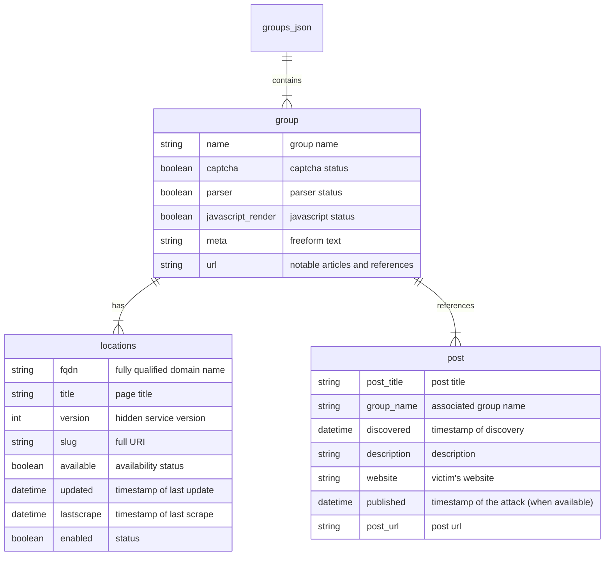

# Datamap 🗺️ 

> Datamap for ransomware.live project

```mermaid
erDiagram
    groups_json ||--|{ group : contains
    group {
        string name "group name"
        boolean captcha "captcha status"
        boolean parser "parser status"
        boolean javascript_render "javascript status"
        string meta "freeform text"
        string url "notable articles and references"
    }
    group ||--|{ locations : has
    locations {
        string fqdn "fully qualified domain name"
        string title "page title"
        int version "hidden service version"
        string slug "full URI"
        boolean available "availability status"
        datetime updated "timestamp of last update"
        datetime lastscrape "timestamp of last scrape"
        boolean enabled "status"
    }
    group ||--|{ post : references
    post {
        string post_title "post title"
        string group_name "associated group name"
        datetime discovered "timestamp of discovery"
	string description "description" 
	string website "victim's website" 
	datetime published "timestamp of the attack (when available)"
	string post_url "post url" 
    }
```
