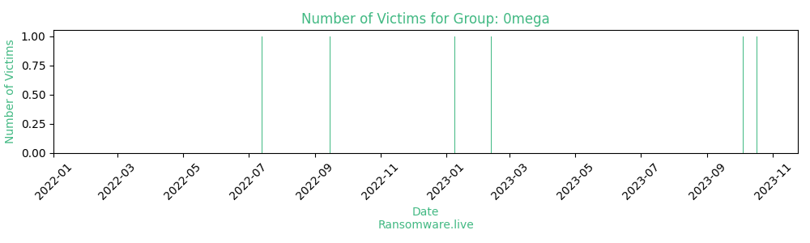

# Profiles for ransomware group : **0mega**

### URLs
| Title | Available | Last visit | fqdn | Screenshot 
|---|---|---|---|---|
| 0mega - Blog | 🟢 | 24/11/2023 12:00 | `http://omegalock5zxwbhswbisc42o2q2i54vdulyvtqqbudqousisjgc7j7yd.onion` | <a href="https://images.ransomware.live/screenshots/omegalock5zxwbhswbisc42o2q2i54vdulyvtqqbudqousisjgc7j7yd-onion.png" target=_blank>📸</a> | 
| 0mega - Blog | 🟢 | 24/11/2023 12:00 | `http://0mega.cc` | <a href="https://images.ransomware.live/screenshots/0mega-cc.png" target=_blank>📸</a> | 

### Total Attacks Over Time

### Victims

> 6 victims found

| victim | date | Description | Screenshot | 
|---|---|---|---|
| [`Rotorcraft Leasing Company`](https://google.com/search?q=Rotorcraft+Leasing+Company) | 17/10/2023 | Helicopter support, pilot training, fueling service, maintenance |   |
| [`US Liner Company & American Made LLC`](https://google.com/search?q=US+Liner+Company+%26+American+Made+LLC) | 04/10/2023 | Industrial engineering, manufacturing, advanced materials, thermoplastic composite solutions |   |
| [`Aviacode (GeBBS)`](https://google.com/search?q=Aviacode+%28GeBBS%29) | 12/02/2023 | Medical coding, outsourced coding, auditing & consulting |   |
| [`Aviacode`](https://google.com/search?q=Aviacode) | 09/01/2023 | Medical coding, outsourced coding, auditing & consulting |   |
| [`Nextlabs`](https://google.com/search?q=Nextlabs) | 15/09/2022 | Business services, security software & IT services, risk management software  |   |
| [`Maxey Moverley`](https://google.com/search?q=Maxey+Moverley) | 14/07/2022 | Electronics repair & refurbishment, technical service, CCTV |   |

Last update : _Friday 24/11/2023 13.15 (UTC)_
