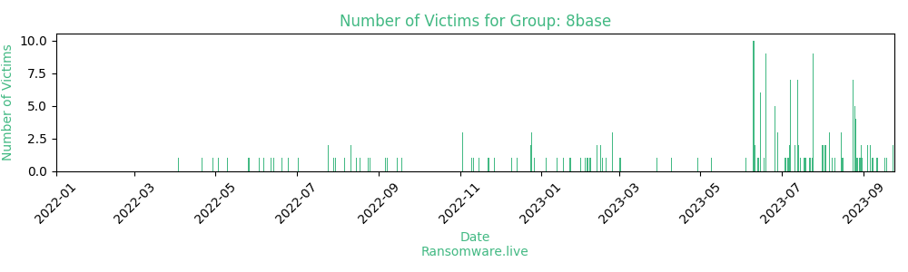

# Profiles for ransomware group : **8base**

### External analysis
- https://blogs.vmware.com/security/2023/06/8base-ransomware-a-heavy-hitting-player.html

🔎 `ransomware.live`has an active  parser for indexing 8base's victims

### URLs
| Title | Available | Last visit | fqdn | Screenshot 
|---|---|---|---|---|
| Home | 🟢 | 07/08/2023 12:02 | `http://basemmnnqwxevlymli5bs36o5ynti55xojzvn246spahniugwkff2pad.onion` | <a href="https://images.ransomware.live/screenshots/basemmnnqwxevlymli5bs36o5ynti55xojzvn246spahniugwkff2pad-onion.png" target=_blank>📸</a> | 

### Ransom note
* [📝 1 ransom note](notes/8base)

### Total Attacks Over Time

### Posts

> 151 victims found

| post | date | Description | Screenshot | 
|---|---|---|---|
| [`SatCom Marketing`](https://google.com/search?q=SatCom+Marketing) | 06/08/2023 | SatCom Marketing, LLC SatCom Marketing built its reputation as a leading teleservices provider to the cable/broadband industry. SatCom specializes in outbound sales, inbound sales, customer service calls, survey work and lead generation for business and consumer markets. We have deep experience in marketing and selling voice, video and data products. In addition, we have a wealth of experience in upselling ancillary products like internet speed upgrades, DVR service, digital tiers and premium channels. Our mission is to deliver quality sales and meaningful customer interactions for our clients to help them meet their business goals and ROI objectives. SatCom is a sales organization, focused on delivering quality sales and the highest close rates in the industry. We believe in a consultative sales approach which means tailoring our presentations to the needs of the customer. SatCom was founded with the idea that quality is the cornerstone of our business.http://www.satcommarketing.com/ | <a href="https://images.ransomware.live/screenshots/posts/0e9b2aeba3140d072bdb88522ed45e2e.png" target=_blank>📸</a> |
| [`Oregon Sports Medicine`](https://google.com/search?q=Oregon+Sports+Medicine) | 06/08/2023 | The goal of the skilled orthopedic team at Sports Medicine Oregon in Tigard and Wilsonville, Oregon, is to restore your active lifestyle. Serving all ages and levels of athletes, from the weekend warrior to the professional player, individuals receive the highest quality orthopedic care available. The practice has served the Northwest communities for more than 24 years, and Sports Medicine Oregon has been the go-to medical team for the Timbers even before they were a Major League Soccer team. The doctors take pride in providing comprehensive care at the offices, which feature on-site X-rays, outpatient physical therapy, and an adjoining surgery center. The practice specializes in sports injuries, including Achilles tendon injuries along with hip, knee, elbow, shoulder, foot, and hand injuries. Trust the practice with your ACL reconstruction, rotator cuff repair, or treatment for arthritis, hammertoe and foot fractures. Even if your injury isn’t directly related to sports, the team can help. The thorough, compassionate care provided by the specially-trained physicians is second to none. Make an appointment for a consultation today by calling and speaking with a friendly staff member or use the online tool to schedule.https://www.sportsmedicineoregon.com | <a href="https://images.ransomware.live/screenshots/posts/cf7699d12e9bbc88cdcd8a77ab8a78b1.png" target=_blank>📸</a> |
| [`Delaney Browne Recruitment`](https://google.com/search?q=Delaney+Browne+Recruitment) | 06/08/2023 | Delaney Browne Appointments is a recruitment agency serving companies and candidates in Buckinghamshire and Berkshire. We are based in Reading. Since 1999 our dedicated team of fully qualified consultants and support staff have been specialising in temporary and permanent placements within the office sector, from director level to junior support and across a broad spectrum of industry sectorshttps://www.delaneybrowne.co.uk/ | <a href="https://images.ransomware.live/screenshots/posts/8713227178c72385fd52409c70b3db1f.png" target=_blank>📸</a> |
| [`Rossman Realty Group, inc.`](https://google.com/search?q=Rossman+Realty+Group%2C+inc.) | 03/08/2023 | See all the Southwest FL Homes and Condos for Sale or Rent - up to 72 hours before they appear on Zillow! We also offer property management services! Rossman Realty Group, Inc has a large inventory of Fannie Mae listings and the expertise to help you acquire one! Whether you are searching for your first home, your dream or vacation home, REO or foreclosure, investment property, commercial property, full time annual or seasonal vacation rentals, Gulf Access homes or vacant lots, you have found the right place!https://www.rossmanrentals.com/https://www.rossmanhomes.com/ | <a href="https://images.ransomware.live/screenshots/posts/4a1d44339727864642eb16862c938a24.png" target=_blank>📸</a> |
| [`RevZero, Inc`](https://google.com/search?q=RevZero%2C+Inc) | 03/08/2023 | We focus on medical device contract manufacturing, 5-axis milling & medical device machining as per the client’s needs and requirements. Visit our website now! RevZero, Inc. is an Agile Medical Device Manufucatring company. Capabilities include Swiss screw, wire EDM, EDM hole drilling, CNCl milling and turning, and cleaning and citric passivation for rapid prototyping and volume manufacturing requirementshttps://www.revzeroinc.com/ | <a href="https://images.ransomware.live/screenshots/posts/311fd51645ac92b6ea00454c2fdfcc22.png" target=_blank>📸</a> |
| [`Jacklett Construction LLC`](https://google.com/search?q=Jacklett+Construction+LLC) | 01/08/2023 | The team at Jacklett Construction has experience in both residential and commercial site development.  Your project is never just another job.  We strive to produce a quality product while developing long term relationships with our clients.  Jacklett Construction relies on decades of experience and utilizes the latest technology to deliver a product that exceeds expectations.https://jacklett.com/ | <a href="https://images.ransomware.live/screenshots/posts/c185c54eea1b90452c4b12ff8be83f6a.png" target=_blank>📸</a> |
| [`MBS Equipment TTI`](https://google.com/search?q=MBS+Equipment+TTI) | 01/08/2023 | MBS Equipment Company, a division of The MBS Group, offers the world's largest inventory of lighting, grip and expendables. Our technologically advanced solutions and sustainable energy alternatives can change the content producers create. The MBS Group is the world's premier studio operator and studio production services companyhttps://the-mbsgroup.com/services/ | <a href="https://images.ransomware.live/screenshots/posts/fbf7d647e3f480b33e3249516061c0b0.png" target=_blank>📸</a> |
| [`BoomData  Data & Analytics Consultancy`](https://google.com/search?q=BoomData+%7C+Data+%26+Analytics+Consultancy) | 25/07/2023 | BOOMDATA - Microsoft Data & Analytics Specialists The data journey isn't always easy so having the right people to help navigate this journey is important in delivering success. BOOMDATA are a purely Microsoft focussed, data and analytics end-to-end consulting firm and certified Microsoft Data & AI Azure Solutions Partner based in Australia. Combining thinking and delivery, we support mid to large sized businesses with senior teams across the region offering advisory, scoping, design, delivery and training services in the areas of data management, data governance, business intelligence, reporting and analytics. We're here to help by being easy to work with, knowing our stuff, taking the time to get to know your business, and by being responsive and flexible to work in the way that best suits you. | <a href="https://images.ransomware.live/screenshots/posts/868f72ffff84f5bb3a5ef41a293864f6.png" target=_blank>📸</a> |
| [`CROWD`](https://google.com/search?q=CROWD) | 25/07/2023 | Talent Agency for Advertisement, Fashion, Cinema, TV and Events.Casting Studio. | <a href="https://images.ransomware.live/screenshots/posts/6c9b60ebc34bccd74cb07fc11d9d9484.png" target=_blank>📸</a> |
| [`DV8 Technology Group`](https://google.com/search?q=DV8+Technology+Group) | 25/07/2023 | DV8 Technology Group (DV8) is fledging information and communications technology (ICT) giant that is small enough to be flexible and nimble but operates at a scale that allows it to offer cost-effective cutting-edge solutions. DV8 Technology Group (DV8) is fledging information and communications technology (ICT) giant that is small enough to be flexible and nimble but operates at a scale that allows it to offer cost-effective cutting-edge solutions. The optimal scale of our business enables us to undercut the competition, which mainly comprises multinational ICT behemoths, while offering the same quality – and often superior – products and services | <a href="https://images.ransomware.live/screenshots/posts/507b9bb65fef8927416d91ddcb2804f0.png" target=_blank>📸</a> |
| [`FANSIPAN CONSTRUCTION CONSULTANTS CO.,LTD`](https://google.com/search?q=FANSIPAN+CONSTRUCTION+CONSULTANTS+CO.%2CLTD) | 25/07/2023 | Fansipan Construction Consultants Company Limited with the legal representative -Director Mr., Huynh Thanh Sang was granted Business Registration Certificate No. 0312364637 dated July 10, 2013 issued by Department of Planning and Investment of Ho Chi Minh City. Fansipan Construction Consultants Company Limited is a civil and construction company that provides the best quality products, the best quality services on time at a reasonable price as well as help both contractor and clients own a lot of successful project | <a href="https://images.ransomware.live/screenshots/posts/5564a846b73a4fd804d01609f65a9274.png" target=_blank>📸</a> |
| [`Institut Mensalus S.L.`](https://google.com/search?q=Institut+Mensalus+S.L.) | 25/07/2023 | We are a multidisciplinary team with more than 30 professionals from Psychology, Psychiatry, Neuropsychology, Educational Psychology and Speech Therapy. More than 30 years of experience guarantee our services. Our services are divided into 4 main areas: ASSISTANCE AND TREATMENT: We offer a wide variety of treatments designed individually for each person, as well as advice or one-off consultations. The psychiatry and psychology teams of the Center work in a coordinated way in order to make a joint diagnostic assessment. | <a href="https://images.ransomware.live/screenshots/posts/1e14b3a7b4d7a39c72c7294824d9e3ce.png" target=_blank>📸</a> |
| [`Miranda Brokerage`](https://google.com/search?q=Miranda+Brokerage) | 25/07/2023 | We are a dedicated US Customs Broker that provides our clients with an effective and personalized customer service because we clearly understand that service is the product that we offer which is based on compliance, technology and personalized service. | <a href="https://images.ransomware.live/screenshots/posts/01caf5c1fba1284aabb07c7c51d15d26.png" target=_blank>📸</a> |
| [`Spectra Industrial`](https://google.com/search?q=Spectra+Industrial) | 25/07/2023 | Spectra Industrial commenced operations in 2010 specialising in importation and distribution of forklifts, generator sets, PPE, solar products and heavy equipment,including trucks and earthmoving machinery. The company grew quickly and expanded from its Port Moresby base opening Lae branch in 2011.The range and brands supported have increased rapidly with Spectra now having taken a position as a leading supplier for its key categories in the PNG marketplace.Hang Cha forklifts are now the leading brand and commonplace through out the country. Guardian Gensets are recognised as being a quality Cummins powered diesel generator and represent quality and value. Windsor, Winchester and Riggers brands are synonymous with quality and durability in the safety footwear and clothing categories and as always represent real value without compromising on quality.Spectra strives to be top of mind when customers seek value. Value in the sticker price but also in the after sales service as provided by our dedicated Spectra teams situated in both Lae or POM.Spectra Hire division was introduced in 2012 and is now a leader in both short and long term hire for an extensive range of equipment. We encourage our clients to invest their capex Kina in profit generating pursuits and leave the mundane and time consuming aspects of fleet maintenance management to us.COMPETITIVE RESPONSIVE COMMITTED is the mantra engrained into every Spectra employee from their induction. Each understands that our growth will come through delivering value. | <a href="https://images.ransomware.live/screenshots/posts/36100907c7bc8c86d7118138687d27cb.png" target=_blank>📸</a> |
| [`BoomData Data and Analytics Consultancy`](https://google.com/search?q=BoomData+%7CData+and+Analytics+Consultancy) | 25/07/2023 | BOOMDATA - Microsoft Data & Analytics Specialists The data journey isn't always easy so having the right people to help navigate this journey is important in delivering success. BOOMDATA are a purely Microsoft focussed, data and analytics end-to-end consulting firm and certified Microsoft Data & AI Azure Solutions Partner based in Australia. Combining thinking and delivery, we support mid to large sized businesses with senior teams across the region offering advisory, scoping, design, delivery and training services in the areas of data management, data governance, business intelligence, reporting and analytics. We're here to help by being easy to work with, knowing our stuff, taking the time to get to know your business, and by being responsive and flexible to work in the way that best suits you. | <a href="https://images.ransomware.live/screenshots/posts/868f72ffff84f5bb3a5ef41a293864f6.png" target=_blank>📸</a> |
| [`Kersey  CO`](https://google.com/search?q=Kersey++CO) | 25/07/2023 | TOWN OF KERSEY, COLORADO | <a href="https://images.ransomware.live/screenshots/posts/9588071a61281a02043d3a6045ca6519.png" target=_blank>📸</a> |
| [`EJM Engineered Systems`](https://google.com/search?q=EJM+Engineered+Systems) | 24/07/2023 | We are refrigeration contractors and experts in air conditioning and commercial refrigeration uk. our engineers are here to provide a quality service. EJM Engineered Systems Ltd was founded in 1980 with the intent to provide high quality industrial refrigeration installations at realistic prices. We pride ourselves for our levels of professionalism and integrity, and our clients know we are always on hand to offer advice and support when they need it. Our industrial activities are complemented by our Commercial Refrigeration, Air Conditioning, Ventilation, and Service & Maintenance departments. This allows us to provide comprehensive solutions for all your refrigeration needs. As an independent company, we are able to provide all of our clients with individual and personal care. The needs of our clients are at the forefront of everything we do, and, as we are truly independent, we are not tied into any Manufacturer, and can therefore always choose the equipment to your specific project specification and budget. We carry out work throughout the UK, and our repeat clients are proof of our dedication and commitment to each and every project we carry out. We believe all projects are best completed with co-operation and teamwork between all involved, and this philosophy has resulted in satisfied clients coming back to use our services time and time again. In an ever-changing and demanding world, we are completing projects repeatedly on time and budgethttps://ejmrefrigeration.co.uk/ | <a href="https://images.ransomware.live/screenshots/posts/31b1e8bc43866ec75c8d98c59198f491.png" target=_blank>📸</a> |
| [`Exbon Development, Inc`](https://google.com/search?q=Exbon+Development%2C+Inc) | 23/07/2023 | Exbon Development, Inc. has been recognized as one of the nation's top builders and developers that provide full construction services to Federal, State and Municipal government entities as well as commercial clients since its foundation in 2004. We have earned our way to the top of the industry by keeping promises to our clients and staying absolutely true to the principles that our founder established from the beginning. With an approach that emphasizes teamwork and pursuit of excellence in every project, Exbon Development, Inc. provides premier construction services across a diverse spectrum of trades and specialties including planning, program management, preconstruction, general contracting, construction management (CM), design-build and turn-key development. Exbon takes great pride in having successfully catered to the region's most distinguished and demanding clientele and knowing that such accomplishments set us apart from the rest. We are very fortunate to have backlogs of projects on hand and more are planned for the coming years. Every qualified candidate is encouraged to apply and have an opportunity to grow with us | <a href="https://images.ransomware.live/screenshots/posts/2bc9f9253ae92284323dc2117846ada3.png" target=_blank>📸</a> |
| [`Chan and Associates`](https://google.com/search?q=Chan+and+Associates) | 22/07/2023 | The CPAs at Chan & Associates have provided clients with reliable accounting services in Victoria since 1991, including payroll. Chan & Associates is committed to providing its expertise to help ensure to meet accounting needshttp://chanandassociates.ca/ | <a href="https://images.ransomware.live/screenshots/posts/b14b2a076a8ce31f46aa2918f88efe0d.png" target=_blank>📸</a> |
| [`Anesco Ltd`](https://google.com/search?q=Anesco+Ltd) | 19/07/2023 | Anesco is a market leader in renewable energy and energy efficiency. We develop, design, construct, operate, maintain and optimise high performing grid scale renewable energy assets. Our mission is to accelerate the transition to a sustainable, low-carbon future by enabling investment in renewables, storage and energy efficiency. Since being founded in 2010, we have grown to become one of the UK's largest providers of large scale solar and battery storage technologies and we continue to expand our presence in Europe, with the opening of subsidiaries in the Netherlands and Germany. To date, we have designed and built more than 144 solar farms and energy storage facilities, while our operations and maintenance team has over 24,000 assets under management. As a leading managing agent for the government's ECO scheme, we are also proud to have helped raised more than 350,000 people out of fuel poverty. To find out more, including about opportunities to join our growing team, visit www.anesco.co.uk | <a href="https://images.ransomware.live/screenshots/posts/e1244db2ec18db02b212b1be8cc84183.png" target=_blank>📸</a> |
| [`CashCall, Inc.`](https://google.com/search?q=CashCall%2C+Inc.) | 18/07/2023 | CashCall - Personal Loans Founded in 2003 and headquartered in Orange, California, CashCall Inc. is among the nation's premier lenders. The company employs leading experts with an unparalleled drive and dedication to exceptional customer service. CashCall is driven to remain at the forefront of innovative technology that streamlines loan operations. This combined with their dynamic team of experts makes the loan process for customers simple, fast, and hassle-free. Cashcall personal loans division offers unsecured loans to qualified borrowers who typically use the loans for one-time purchases and debt consolidation. These loans are processed entirely over the internet, phone, and fax. Funds are wired into the borrower's checking account in as little as 4 hours. | <a href="https://images.ransomware.live/screenshots/posts/17f0af137b4175bbcf0c5dd5dbf58509.png" target=_blank>📸</a> |
| [`Venture Drilling Supply`](https://google.com/search?q=Venture+Drilling+Supply) | 15/07/2023 | Venture drilling supply is the largest water well, mining, and geothermal distributor and service provider in the nation. Our commitment is to keep you drilling. Venture Drilling Supply provides professional sales, distribution, and service throughout Texas, Oklahoma, Arkansas, Missouri and Kansas for the drilling industry's'​ top manufacturers. | <a href="https://images.ransomware.live/screenshots/posts/dee9a5977905c6b8c3e909b985c96a4c.png" target=_blank>📸</a> |
| [`Info Salons`](https://google.com/search?q=Info+Salons) | 14/07/2023 | Many people will ask why we are called Info Salons? Does it have anything to do with haircuts? This is related to our CEO Ms. Jo-Anne Kelleway's work experience in a French exhibition registration management company. The word "salons" refers to exhibitions in French. So Info Salons literally means information technology applied to exhibitions.Info Salons was established in Australia in 1990. At that time, Australia's convention and exhibition industry began to boom with the opening of the new Sydney Convention and Exhibition Center on the edge of Darling Harbour. Australia needs a professional data collection company to professionalize the convention and exhibition industry. Info Salons provided registration solutions for 10 shows in its first year. | <a href="https://images.ransomware.live/screenshots/posts/faf136f50ee55e4865920fca5498f5fb.png" target=_blank>📸</a> |
| [`CPA Advisors Group`](https://google.com/search?q=CPA+Advisors+Group) | 14/07/2023 | Our accounting firm was formed with a single principle in mind: to provide the highest level of personalized client service possible. Simply put, we care about each and every one of our clients.  If you would like to develop a relationship with an accountant that will know your name, get to know ours.Our full-service accounting firm is well established and is ready to serve you. Since our inception, we have grown continuously by providing a wide-array of professional services. Let us know how we can serve you. We’re here to help. | <a href="https://images.ransomware.live/screenshots/posts/b67249a704460a452423a2709f9042a5.png" target=_blank>📸</a> |
| [`BTU`](https://google.com/search?q=BTU) | 13/07/2023 | BTU is an Argentine company dedicated to the development and execution of engineering, construction, mounting and start-up projects, mainly in the Energy, Oil & Gas and Railway System Infrastructure sectors.We have provided integral services throughout the country for over 30 years, in public and private sector, delivering constant technical and entrepreneurial development. As a result of our expertise, we are one of Argentina’s leading engineering and highly complex construction company. | <a href="https://images.ransomware.live/screenshots/posts/e0dd4a6f31f4ee62de54d4b7a7cb13c3.png" target=_blank>📸</a> |
| [`ANL Packaging`](https://google.com/search?q=ANL+Packaging) | 13/07/2023 | ANL Packaging makes your product uniqueANL Packaging specializes in bespoke thermoformed packaging in line with the customers’ needs. In doing so, ANL Packaging supports the individuality of the customers’ products.ANL Packaging specializes in bespoke thermoformed plastic packaging. Our custom-made packaging solutions can be found in both food and non-food markets, but we also have a standard range. | <a href="https://images.ransomware.live/screenshots/posts/77a6df17193f57d2f9b33d8cff206f59.png" target=_blank>📸</a> |
| [`Dental One Craigieburn`](https://google.com/search?q=Dental+One+Craigieburn) | 13/07/2023 | Dental One was created to make Dentistry more affordable and accessible in Australia, starting with our home state of Victoria.Cost has long been sighted as the number one reason people avoid visiting the dentist. At Dental One we aim to remove this obstacle and usher in a new wave of Affordable Dental Care for all. You can expect the same quality and professional treatment from our Dentists as you would anywhere else. We are focused on providing the best outcome for our patients and ensuring only the best long-term treatment options are followed. At Dental One we aim to usher in a new wave of Affordable Dental Care for all. We are focused on providing the best outcome for our patients and ensuring only the best long-term treatment options are followed. | <a href="https://images.ransomware.live/screenshots/posts/7114925b40f7b912d4582e9d15ac48d5.png" target=_blank>📸</a> |
| [`Jadranka Group`](https://google.com/search?q=Jadranka+Group) | 13/07/2023 | Since its founding, Jadranka has been the largest company on the islands of Cres and Lošinj. It also employs the largest number of inhabitants of these islands and is the main driver of the development of this area. Jadranka has grown into a recognizable and respected company with a 70-year-old business tradition, which, according to business results, can certainly be ranked among the top companies in the hospitality and tourism industry.During February 2014, Jadranka d.d. went through the process of ownership change and thus the company Beta ulaganja d.o.o. based in Zagreb became 100% owner of Jadranka's shares. Croatian owners of Beta ulaganja are officially recorded in the Register of Beneficial Owners. | <a href="https://images.ransomware.live/screenshots/posts/b61391d94ab42a105b8c3237d443b2cf.png" target=_blank>📸</a> |
| [`Quikcard Solutions Inc.`](https://google.com/search?q=Quikcard+Solutions+Inc.) | 13/07/2023 | QSi has been providing consulting services for over 20 years. QSi has worked with a select group of clients who possess an ardent desire for growth and realize that the recruitment of key talent is critical. Our experience and specialization translates into a clearer understanding of client needs and a shortened recruitment cycle.With Quikcard, businesses can have a benefits plan that's flexible and offers dental, medical, vision, and group travel insurance. Quikcard has been supporting Canadian businesses for over 30 years. | <a href="https://images.ransomware.live/screenshots/posts/6a7ec8cc1a5f95099a72bed101471abe.png" target=_blank>📸</a> |
| [`The Traffic Tech`](https://google.com/search?q=The+Traffic+Tech) | 13/07/2023 | The Traffic Tech Gull is an award winning ISO certified total solutions provider of integrated systems in traffic management. intelligent transportation, parking management, security, communications and truck weigh stations. Founded in 2000, Traffic Tech Experience in Tratic Engineering, integrating systems to meet customized needs using the most advanced technologies available in the market, Over the past twenty (20) years, Taffic Tech has developed com engineering, system integration, contracting and service capabilities, that helped earn Trafic Tech a leading role in the balds of specialization throughout the Gulf regions. Our scope includes design, system integration equipment supply installation, commissioning, operation, and after-sales service. | <a href="https://images.ransomware.live/screenshots/posts/4325a8d935b9d3d542ed9b9499b9dce9.png" target=_blank>📸</a> |
| [`Telepizza`](https://google.com/search?q=Telepizza) | 13/07/2023 | Telepizza was founded in Madrid in 1987 as a family business with a clear drive for innovation and a constant focus on the quality of its products. Being in this way a pioneer in the delivery of quality food to home. In 1992, the company opened its first factory and began its international expansion.Telepizza's focus of work is occupied by irresistible and unique pizzas. Prepared with the utmost attention to detail and a rigorous selection of fresh and natural ingredients. His secret is known. Mass. Made with love and by hand.In addition, through Telepizza's communication platform, Let's spend more time together, we become a global brand with a unique meaning throughout the world. | <a href="https://images.ransomware.live/screenshots/posts/1632988ad5382f25c2d3ba68afd41f82.png" target=_blank>📸</a> |
| [`Weitkamp · Hirsch and Kollegen Steuerberatungsgesellschaft mbH`](https://google.com/search?q=Weitkamp+%C2%B7+Hirsch+and+Kollegen+Steuerberatungsgesellschaft+mbH) | 11/07/2023 | Tax adviceCompetence and thoroughness are very important in our law firm. We train ourselves and our employees regularly so that we can always provide you with comprehensive support and advice in the following areas, for example.For optimal preparation, we need the following form to be filled out by you. Welcome! | <a href="https://images.ransomware.live/screenshots/posts/4e7b4a26682bdbdfcb195c8535963698.png" target=_blank>📸</a> |
| [`Pesquera Diamante S.A.`](https://google.com/search?q=Pesquera+Diamante+S.A.) | 11/07/2023 | We strive to meet the nutritional needs of the Peruvian and global market by supplying proteins and marine products with the assurance of a process that meets the highest quality standards in the processing of fishmeal and fish oil, canned food, fresh and frozen products. products.Demand, efficiency and innovation are the three main characteristics that represent our essence and have been our flag since 1986, setting a successful and flawless trajectory in the fishing sector.We are always striving to achieve new goals, focus on new challenges and reinvent ourselves with every action for the benefit of our customers, employees, shareholders, the environment and society as a whole. | <a href="https://images.ransomware.live/screenshots/posts/138847851365646ebbc78fd6e24d510b.png" target=_blank>📸</a> |
| [`Cabra Consulting Ltd`](https://google.com/search?q=Cabra+Consulting+Ltd) | 08/07/2023 | Cabra Enterprises Ltd was founded in 1980 with Cabra Consulting Ltd. as a division of same. In 2010 Cabra Consulting Ltd was spun up as a stand-alone entity from Cabra Enterprises.Cabra’s corporate goals have never changed with a commitment to supply quality professional geological services to the petroleum industry. Cabra has a solid team of geologists with diverse backgrounds and is able to supply services in all aspects of wellsite geology whether they are field, operational or geosteering services. | <a href="https://images.ransomware.live/screenshots/posts/e367fef31f9bf30bd81a46f884eab0f7.png" target=_blank>📸</a> |
| [`Motor Components, LLC`](https://google.com/search?q=Motor+Components%2C+LLC) | 08/07/2023 | We attacked this company 06.07.2023www.facet-purolator.comCompany internal documentsContact list with information about partners and clientsEmployee Data BaseChecks, invoicesFinancial indicators and balance sheetOfficial letters, faxesShipment information in different countriesConfidential data about employees and their salariesIT infrastructure with detailed network map and access | <a href="https://images.ransomware.live/screenshots/posts/5e45b75fe7e36f5e17b7aa10f7385326.png" target=_blank>📸</a> |
| [`Citelis Mobility`](https://google.com/search?q=Citelis+Mobility) | 08/07/2023 | Our engine is the satisfaction of our clients in each visit to our agencies, we work every day to give the best service at each point of sale, care for your vehicle and we accompany you in every step you take to select your travel companion. | <a href="https://images.ransomware.live/screenshots/posts/20f5a1eaab95499c442d2ead012433d8.png" target=_blank>📸</a> |
| [`Advanced Fiberglass Industries`](https://google.com/search?q=Advanced+Fiberglass+Industries) | 08/07/2023 | Advanced Fiberglass Industries is a UAE-based manufacturer of advanced composite offering an unrivaled quality of finished composite products and turnkey solutions provided based on the development of the latest technology advancements used in composite construction. Advanced Fiberglass Industries being one of the first entities globally to procure adaptive molding in the year 2018.Headquartered in Dubai, our Al Quoz 2 Industrial Area facility encompasses at 6500m² with highly experience technical staff and operators. We have a Climate controlled and Safety Compliant Cleanroom, Paint Booth, Post Curing oven, and Sandblasting facilities onsite. Moreover, in molding and CNC milling, we have an in-house 7axis KUKA milling robot machine and adaptive molding technology. | <a href="https://images.ransomware.live/screenshots/posts/e5c9cda2d3465f025f14c363996b4bf0.png" target=_blank>📸</a> |
| [`Danbury Public Schools`](https://google.com/search?q=Danbury+Public+Schools) | 08/07/2023 | Danbury Public Schools is one of the fastest-growing school districts in Connecticut. Our teachers and staff educate more than 12,000 students, preparing them to succeed in higher education, work, and life. Our students and faculty members represent a rich blend of diversity and dozens of heritages. | <a href="https://images.ransomware.live/screenshots/posts/de554497b7c4a8852479ef74707a8b23.png" target=_blank>📸</a> |
| [`Kansas medical center LLC`](https://google.com/search?q=Kansas+medical+center+LLC) | 08/07/2023 | Kansas Medical Center is a fully physician owned hospital. In addition to our owners, we have many doctors on staff that cover a wide array of specialties.Through the dedicated service of physicians and staff practicing in a state of the art facility with the most advanced integrated equipment and information technology, the Kansas Medical Center brings comprehensive health care of the highest caliber to patients in Andover, and the communities throughout Kansas. | <a href="https://images.ransomware.live/screenshots/posts/1643f4a7b6996ca2805525895ea54234.png" target=_blank>📸</a> |
| [`Weitkamp · Hirsch & Kollegen Steuerberatungsgesellschaft mbH`](https://google.com/search?q=Weitkamp+%C2%B7+Hirsch+%26+Kollegen+Steuerberatungsgesellschaft+mbH) | 08/07/2023 | Tax adviceCompetence and thoroughness are very important in our law firm. We train ourselves and our employees regularly so that we can always provide you with comprehensive support and advice in the following areas, for example.For optimal preparation, we need the following form to be filled out by you. Welcome! | <a href="https://images.ransomware.live/screenshots/posts/4e7b4a26682bdbdfcb195c8535963698.png" target=_blank>📸</a> |
| [`ROBERT L BAYLESS PRODUCER LLC`](https://google.com/search?q=ROBERT+L+BAYLESS+PRODUCER+LLC) | 07/07/2023 | Robert L. Bayless, Producer LLC is a privately owned oil and natural gas company engaged in exploration and production activities in the southern and central Rocky Mountain Region with offices in Denver, Colorado and Farmington, New Mexico | <a href="https://images.ransomware.live/screenshots/posts/27407de7bce8c8f3dcc55c3b194e0453.png" target=_blank>📸</a> |
| [`New Century Advisors, LLC`](https://google.com/search?q=New+Century+Advisors%2C+LLC) | 07/07/2023 | Since its founding in 2002, New Century Advisors has partnered with its clients to develop and execute customized strategies to meet their unique needs including core, inflation-linked, short duration, multi asset and equity strategies.New Century Advisors prides itself in seeking to deliver superior risk-adjusted returns with a high touch client service approach. New Century Advisors' clients represent prestigious public funds, corporations, endowments, foundations, healthcare systems and insurance companies.New Century Advisors is entirely employee owned and its principals have worked together for over 10 years | <a href="https://images.ransomware.live/screenshots/posts/673ce998a4829f4dbef2e55e3c8bd8b4.png" target=_blank>📸</a> |
| [`KIRWIN FRYDAY MEDCALF Lawyers LLP`](https://google.com/search?q=KIRWIN+FRYDAY+MEDCALF+Lawyers+LLP) | 06/07/2023 | The company provide a full range of services in real estate law including residential and commercial sales, purchases and mortgages. The firm also provides comprehensive services in the corporate commercial area including incorporation of businesses, both large and small, acquisition and sales of small businesses and generally assisting our clientele to grow and prosper | <a href="https://images.ransomware.live/screenshots/posts/80ca455d3f0b034728bc7cc9c161b8d5.png" target=_blank>📸</a> |
| [`Polanglo`](https://google.com/search?q=Polanglo) | 04/07/2023 | Polanglo SP. z O.o. is a network of bookstores and wholesalers operating since 1991 with an educational and language profile. Thanks to the dynamic development, we have been appreciated by the largest university publishing house in the world – Oxford University Press. The Oxford University Press authorities have granted us the exclusive right to import our English Language Teaching materials into Poland, and we make every effort to make Oxford University Press language publications available throughout Poland.https://www.polanglo.pl/ | <a href="https://images.ransomware.live/screenshots/posts/47f5b8576a2a7cc7ef42da07244dd1ec.png" target=_blank>📸</a> |
| [`CON-STRUCT`](https://google.com/search?q=CON-STRUCT) | 28/06/2023 | Con-struct, Inc. proudly serves all heavy construction needs in Central Iowa, including Ames, Story County, Marshall County, and surrounding areas.https://constructiowa.com | <a href="https://images.ransomware.live/screenshots/posts/dc9c2b0dc8773ef8794e93ebcc8c3aeb.png" target=_blank>📸</a> |
| [`PORTERROOFING`](https://google.com/search?q=PORTERROOFING) | 28/06/2023 | "Porter Roofing has blueprinted an innovative culture throughout our company, placing special emphasis on the welfare and safety of everyone involved with any roofing project we undertake. We have provided OSHA’s 40-hour safety program and CPR training for all of our key employees so that every crew is staffed with at least one safety team leader. Although our safety program exceeds roofing industry standards, we continually seek ways to implement new ideas and procedures.As our reputation continues to grow on a national scale, we realize that it is based on our past roofing projects. Therefore, we raise the bar for exceptional performance, job by job, year by year. We pledge our full support toward the successful completion of our clients’ roofing projects, and we will perform our services in your best interest with a great effort to maintain your trust and good will."http://www.porter-roofing.com/ | <a href="https://images.ransomware.live/screenshots/posts/2b00ba508c6f025d29c09750b2327756.png" target=_blank>📸</a> |
| [`ISPE Connecting Pharmaceutical Knowledge`](https://google.com/search?q=ISPE+Connecting+Pharmaceutical+Knowledge) | 28/06/2023 | ISPE, the International Society for Pharmaceutical Engineering, is the world's largest not-for-profit association serving its Members through leading scientific, technical and regulatory advancement throughout the entire pharmaceutical lifecycle. The 20,000 Members of ISPE are building solutions in the development and manufacture of safe and effective pharmaceutical and biologic medicines and medical delivery devices in more than 90 countries around the world. Founded in 1980, ISPE has its worldwide headquarters in Bethesda, Maryland, USA and the Operations and Training Center in Tampa, Florida, USA | <a href="https://images.ransomware.live/screenshots/posts/9f67d5f0e49b672919fe9a91785f0abf.png" target=_blank>📸</a> |
| [`PNEUMAX`](https://google.com/search?q=PNEUMAX) | 26/06/2023 | PNEUMAX France has been located since 1993 on an area of 4000 m2 in the northern industrial zone of SELESTAT. It covers the territory of France, as well as French-speaking countries.The recent acquisition of numerically controlled machines has increased production capacity due to guaranteed service and quality.Design bureaus, machine builders for industry, assembly lines, robotics and manufacturing are industries interested in their products and services.The wide range of PNEUMAX products makes it one of the market leaders.https://pneumaxspa.com/pneumax-fr/ | <a href="https://images.ransomware.live/screenshots/posts/c3d62d852444710cb0704291933f933d.png" target=_blank>📸</a> |
| [`LEGALILAVORO`](https://google.com/search?q=LEGALILAVORO) | 26/06/2023 | Legalilavoro was born out of a federation of ten law firms already known for the history and specific experience of their founders and groups of young professionals coordinated by them: in total, about 70 lawyers working in the field of labor law, assembled today on the basis of elements of divisions that define its strong identity.Their mission is to offer employees of any locality the opportunity to find legal services and consultations of the highest quality.https://www.legalilavoro.it/ | <a href="https://images.ransomware.live/screenshots/posts/adc8fd991ce087ae9f73c490e09bb95e.png" target=_blank>📸</a> |
| [`Lysander Shipping`](https://google.com/search?q=Lysander+Shipping) | 26/06/2023 | Regularly exceptional for over 25 yearsLysander Shipping area is a well-established project forwarder, at the heart of everything we do is customer service, reliability and honesty. Your cargo for us is not just another booking, it is a matter of pride. We treat each shipment with the utmost care and attention that we know our customers require.https://www.lysandershipping.com/ | <a href="https://images.ransomware.live/screenshots/posts/6d11d6b592c26e04908f1052faa59db6.png" target=_blank>📸</a> |
| [`CLEAR MEDI HEALTHCARE`](https://google.com/search?q=CLEAR+MEDI+HEALTHCARE) | 26/06/2023 | ClearMedi Healthcare is a joint venture initiative of KOS S.P.A. Italy and Clear view Healthcare India.Manage comprehensive clinical servicesClearMedi Healthcare is a fast-growing medical services organization providing excellent medical treatments across India. With more than 4 independent super-specialized hospitals in Delhi, North Carolina, and the Mysore region of India, and 15 partner hospitals specializing in oncology and tertiary care, ClearMedi Healthcare aims to become a leading healthcare organization and also serve underserved segments of society.https://clearmedi.in/ | <a href="https://images.ransomware.live/screenshots/posts/f124a83a2b591f0b4edfde45e5b7b426.png" target=_blank>📸</a> |
| [`JOB-SA BETON J.O.B SA`](https://google.com/search?q=JOB-SA+BETON+J.O.B+SA) | 26/06/2023 | The company is specializing in the production of ready-mixed concrete for both personal needs and factory construction volumes. Address: 8, R. Jean-Jacques Rousseau Street, Imm. Appendix Rousseau 3.1 TUNIS MONPLAISIRhttp://www.made-in-tunisia.net/vitrine/contact.php?tc1=lK2Rm6iThttp://job-beton.com/ | <a href="https://images.ransomware.live/screenshots/posts/4cdb4fc9c3fa40286e5e71c0e10120c0.png" target=_blank>📸</a> |
| [`PORTBLUE`](https://google.com/search?q=PORTBLUE) | 19/06/2023 | Port Blue Hotel Group is a chain of boutique hotels in ideal places to relax. Nevertheless, they do not know how to store personal data, especially the passports of their clients.https://www.portbluehotels.com/en/ | <a href="https://images.ransomware.live/screenshots/posts/8625ab65ac359ed57858c28588a4ec04.png" target=_blank>📸</a> |
| [`LOONGSON`](https://google.com/search?q=LOONGSON) | 19/06/2023 | Loongson Technology keeps pace with international trends in the field of IT and focuses on the development of the industry and the construction of systems based on independent innovations. Until now, we have mastered the basic computing technologies in the field of designing the architecture of the processor instruction set (ISA) (LoongArch®), the IP core of the processor and the operating system. Based on this, they strive to create an independent and open hardware and software ecosystem and information industry system to provide independently developed, secure and reliable processors to meet national strategic needs, as well as high-performance, low-cost processors and basic software and hardware solutions to stimulate innovative development. But they could not protect their confidential data.https://www.loongson.cn/EN | <a href="https://images.ransomware.live/screenshots/posts/334107d00fdfa022ec0da00530e52992.png" target=_blank>📸</a> |
| [`Futura Agronegócios`](https://google.com/search?q=Futura+Agroneg%C3%B3cios) | 19/06/2023 | Futura Agronegócio, founded in 2003, has completed 17 years of work in the market, specializes in the integration of products and servicesThey work in the sales of agricultural protectors / seeds / foliar nutrition and fertilizers;Futura Agronegocios, headquartered in Araguari/MG, has 8 business units and 1 industrial seed processing center located in the mining triangle and Southwest of Goiano.https://futuraagro.com.br/ | <a href="https://images.ransomware.live/screenshots/posts/69957d559abc5bb066d7ebdfafb5643f.png" target=_blank>📸</a> |
| [`BLUESAGE`](https://google.com/search?q=BLUESAGE) | 19/06/2023 | The "Blue Sage" is an indigenous Texas wildflower that is a hardy and upright plant able to survive in drought conditions. Like our namesake, we are set up to thrive in all varieties of investing environments. We are by nature generalists and seek to invest across a diverse range of industries.https://www.bluesage.com/ | <a href="https://images.ransomware.live/screenshots/posts/4e5123a1aa9b0270b027ce541ed45798.png" target=_blank>📸</a> |
| [`PrintGlobe, Inc.`](https://google.com/search?q=PrintGlobe%2C+Inc.) | 19/06/2023 | Custom Printed Personalized Promotional Items and Products by PrintGlobe. Since 1995 PrintGlobe has been Your One Stop Shop for Wholesale, Custom Merchandise such as Promotional Items, Personalized Products and more. We are a Full Service Supplier of all Things Custom Printed. Learn More Today. PrintGlobe was founded in Austin, Texas in April 1995 as a small graphic design and printing company. www.printglobe.com | <a href="https://images.ransomware.live/screenshots/posts/653dc0eab2ec5f47eb528c8a29eb2c8c.png" target=_blank>📸</a> |
| [`TARLE LAW, P.C.`](https://google.com/search?q=TARLE+LAW%2C+P.C.) | 19/06/2023 | Tarle Law is widely sought throughout CA and TX in a diverse range of industries, including construction defect, insurance defense and more. Tarle Law provides experienced litigation representation throughout Southern California and Central Texas.https://www.tarlelaw.com/ | <a href="https://images.ransomware.live/screenshots/posts/d7a4657fc571b633a5b6c1a1cfc15966.png" target=_blank>📸</a> |
| [`Texas Hotel and Lodging Association`](https://google.com/search?q=Texas+Hotel+and+Lodging+Association) | 19/06/2023 | Texas Hotel & Lodging AssociationTHLA is a nonprofit hotel trade association representing every aspect of the lodging industry across Texas. Learn about the benefits of being a member today! Representing over 5,000 members from the largest convention center hotels to the smallest B&Bs, the Texas Hotel & Lodging Association is the largest state lodging association in the nation. Advocating for and serving the Texas lodging industry since 1903. Governmental affairs representation, legal services lodging properties, website listings, endorsed vendor programs, and more. https://texaslodging.com/ | <a href="https://images.ransomware.live/screenshots/posts/2976a4965f3eb5ae76a284d22daa90eb.png" target=_blank>📸</a> |
| [`Onsupport Corporation`](https://google.com/search?q=Onsupport+Corporation) | 19/06/2023 | Onsupport CorporationProviding IT solutions since 1992, we strategize with clients to define the earth needs and give them a competitive edge in their industry. Free consultations. On support help small and mid-sized companies manage technology. On support provides: Managed Network Services, Hosting Services, and Application/Web Development Services. Whether On support is managing your network, or you are utilizing On support's hosted virtual network, On support allows you focus on what you do best - running your company. On support is made up of a top-notch team of industry professionals serving Central Texas forever 19 years.onsupport.com | <a href="https://images.ransomware.live/screenshots/posts/8a363157cfe261fead1db75f6390babe.png" target=_blank>📸</a> |
| [`The Akin Law LLC`](https://google.com/search?q=The+Akin+Law+LLC) | 19/06/2023 | The Akin Law Firm provides services for virtually every legal need that your business may encounter. Our practice areas include: • Entity structuring and formation • Contract negotiation and preparation • Real estate transactions • Financing, including debt and equity • Employment and contractor matters • Trademarks and copyrights • Intellectual property transactions and licensing • Acquisitions • Business sales • Business litigation including trials, mediations, arbitrations, and appealshttp://theakinfirm.com/ | <a href="https://images.ransomware.live/screenshots/posts/03076275729319a57dc2bec463d453b9.png" target=_blank>📸</a> |
| [`CYBERFREIGHT SYSTEMS MARITIMES INC.`](https://google.com/search?q=CYBERFREIGHT+SYSTEMS+MARITIMES+INC.) | 18/06/2023 | Cyberfreight Maritimes Inc., is a Canadian transportation and logistics management company. We have over 100 years of transportation knowledge and a worldwide network of offices.To provide the most reliable, expeditious and economical means of transportation to exporters and importers without compromise, thus participating in their growth. | <a href="https://images.ransomware.live/screenshots/posts/99b2a192f2b451d2e482f6d3a5a228ab.png" target=_blank>📸</a> |
| [`San Luis Obispo County Office of Education`](https://google.com/search?q=San+Luis+Obispo+County+Office+of+Education) | 15/06/2023 | The San Luis Obispo County Office of Education promotes student success by supporting local school districts, providing specialized student services, and providing districtwide leadership and advocacy for all children.https://www.slocoe.org/ | <a href="https://images.ransomware.live/screenshots/posts/d59c832503ff120c324e7922b692ab02.png" target=_blank>📸</a> |
| [`Studio Legale Ranchino`](https://google.com/search?q=Studio+Legale+Ranchino) | 15/06/2023 | Ranchino Law Firm is a professional association with offices in Rome and Milan, specializing in the management, out-of-court and judicial proceedings and assessment (due diligence) of non-performing loans and illiquid payments, as well as in banking, finance, bankruptcy law, real estate and financial lease.https://www.studioranchino.com/ | <a href="https://images.ransomware.live/screenshots/posts/970a9a6ed93ff4766ddd78d5e1459c8d.png" target=_blank>📸</a> |
| [`Ligas Gerais Industria E Comercio`](https://google.com/search?q=Ligas+Gerais+Industria+E+Comercio) | 15/06/2023 | Ligas Gerais Industria E Comercio specializes in the processing and marketing of metallic Silicon, ferrosilicon, special alloys and inputs for non-ferrous metallurgy, steelmaking and refractories, in addition, the new unit, located in São João Del Rei is specially designed for the production of high purity metallic silicon and ferroalloyshttp://www.ligasgerais.com.br/ | <a href="https://images.ransomware.live/screenshots/posts/b6472ea0f05b5943e1cd20363f9fba4a.png" target=_blank>📸</a> |
| [`Stone Fox Ventures`](https://google.com/search?q=Stone+Fox+Ventures) | 15/06/2023 | StoneFox Ventures is a boutique private investment company that acquires, structures, manages and develops mid-level manufacturing, distribution and service companies. With a dual focus on modernization investments and acquisition and growth strategies, SFV recognizes the best opportunity for shareholders to generate significant returns.https://stonefoxventures.com/ | <a href="https://images.ransomware.live/screenshots/posts/5d0a224c89c48eee2a463056a256e924.png" target=_blank>📸</a> |
| [`Hornbill`](https://google.com/search?q=Hornbill) | 15/06/2023 | Hornbill is the workflow app everyone can use—across your whole organization Hornbill is an innovator of cloud-based business collaboration technology and applications that engage teams, optimise operations and deliver better customer experiences. Our new collaborative Services Management application combines 2 decades of ITSM experience with a powerful, innovative collaboration platform, allowing teams to connect anywhere, anytime, in any language. Hornbills software supports customers at thousands of commercial and governmental sites worldwidehttps://www.hornbill.com/ | <a href="https://images.ransomware.live/screenshots/posts/971c6bc470474a0a086fffcf4f3f6dd9.png" target=_blank>📸</a> |
| [`DANIEL C. HARRIS, O.D`](https://google.com/search?q=DANIEL+C.+HARRIS%2C+O.D) | 15/06/2023 | Dr. Tim Harris received his Doctor of Optometry degree from Ferris State University College of Optometry in 1991. During his four-year optometry curriculum, he performed clinical rotations at the Duane Waters Correctional Facility and the Battle Creek Veterans Administration Hospital, where his training focused on diagnosis and treatment of ocular disease. His specialty areas include diagnosis and treatment of glaucoma, dry eye, contact lenses and family vision care.https://harriseyecareofdavison.com/ | <a href="https://images.ransomware.live/screenshots/posts/54c145ff3c8a53d5d47f3cf47b216052.png" target=_blank>📸</a> |
| [`Law Society of South Africa`](https://google.com/search?q=Law+Society+of+South+Africa) | 14/06/2023 | Law Society of South Africahttps://www.lssa.org.za/about-us/Attorneys and advocates in South Africa are registered with the Legal Practice Council in terms of the Legal Practice Act 28 of 2014. Since 1998 the Law Society of South Africa (LSSA) has represented the attorneys’ profession.The LSSA brings together the Black Lawyers Association, the National Association of Democratic Lawyers and provincial attorneys’ associations,  in representing the attorneys’ profession in South Africa.There are currently some 27 200 practising attorneys and 7 000 candidate attorneys in South Africa. Attorneys are officers of the court and are registered on the roll of attorneys at the Legal Practice Council. | <a href="https://images.ransomware.live/screenshots/posts/a889bb547e49941505bae2d8c557542f.png" target=_blank>📸</a> |
| [`Jeff Wyler Automotive Family, Inc.`](https://google.com/search?q=Jeff+Wyler+Automotive+Family%2C+Inc.) | 13/06/2023 | When you're looking for a new car or need to have your car serviced, come visit Jeff Wyler, one of the top rated car dealers in Ohio, Kentucky, and Indiana.  Whether you are looking to buy a new or used vehicle in Cincinnati, Dayton, Columbus or Louisville, need to have service completed on your vehicle, need auto parts and accessories, or body work that needs attention... You can trust your decision when you choose any one of our Jeff Wyler Dealerships. Our dealership reviews and testimonials attest to our long standing reputation, and we invite you to join the Jeff Wyler Family dealerships.https://wyler.com/ | <a href="https://images.ransomware.live/screenshots/posts/849060e7d9c61a9b0a31ea2afe6dbc1f.png" target=_blank>📸</a> |
| [`Transprensa`](https://google.com/search?q=Transprensa) | 11/06/2023 | Transprensa Transport Company has become another interesting job. Engaged in the collection, dispatch and distribution of goods with guaranteed delivery. The VALLE PRESS S.A. S CONVEYOR COMPANY, dedicated to ensuring the safety and happiness of Colombians for more than six decades, remains one of the 700 most successful companies in Valle del Caucahttps://transprensa.com/ | <a href="https://images.ransomware.live/screenshots/posts/4cc8552ba5ec50f1911cdf033556d3a8.png" target=_blank>📸</a> |
| [`Law Offices of Sergio J. Siderman`](https://google.com/search?q=Law+Offices+of+Sergio+J.+Siderman) | 11/06/2023 | This Law Office of Sergio G. has  become our goal. They receive the highest quality legal representation  for those who wish to obtain citizenship in connection with the content.  Their team of immigration attorneys get the Citizen's Vision ("Green  Card"), resolve issues with the Department of Homeland Security, and  have access to the services you need to make your dream goals come true.https://sidermanlaw.com/ | <a href="https://images.ransomware.live/screenshots/posts/4e7b3b475fcee9065888155954471406.png" target=_blank>📸</a> |
| [`Ampla Divisórias`](https://google.com/search?q=Ampla+Divis%C3%B3rias) | 10/06/2023 | “Ampla Divisórias enchanted us with its experience, professionalism and efficiency! It is a company that values quality and excellence in service provision, in the products supplied, in customer service and after sales, with experienced, dedicated and helpful professionals!”In the market for over 30 years, Ampla is recognized for its dividers and differentiated solutions for corporate environments.Ampla's strategic focus is on excellence in production and finishing, combined with the guarantee of a competitive price and strict compliance with the delivery deadline.https://www.ampladivisorias.com.br/ | <a href="https://images.ransomware.live/screenshots/posts/b38e04e790755002c5060ab002767ff3.png" target=_blank>📸</a> |
| [`RJP MEDICAL LTDA`](https://google.com/search?q=RJP+MEDICAL+LTDA) | 10/06/2023 | We were attracted by the Premier Hospital Dia, dedicated exclusively to plastic surgery, which combines modern equipment, qualified specialists and typical accommodation from the best hotels. It is there that ROBERTO JUNQUEIRA POLIZZI performs most of his procedures.The facility's infrastructure includes five operating rooms, 2 beds for semi-intensive therapy, nine suites and six small apartments for low-stay operations.https://robertopolizzi.com.br/ | <a href="https://images.ransomware.live/screenshots/posts/b53bea5804b0b22c577fa5e019368865.png" target=_blank>📸</a> |
| [`SINTTEL`](https://google.com/search?q=SINTTEL) | 10/06/2023 | The SINTTEL trade union was worked out by us, as it has a percentage of unions that still remains above the average in Brazil, taking into account several professional categories. Proof of your authority among the workers. After all, they are the ones who produce SINTTEL and keep its history.https://sinttelmg.org.br/ | <a href="https://images.ransomware.live/screenshots/posts/db3d3ab5711fcfd9239697d56d5a3bfd.png" target=_blank>📸</a> |
| [`CLONARTE`](https://google.com/search?q=CLONARTE) | 10/06/2023 | Clonarte is a printing company operating since 2005 in the segment of a printing house specializing in digital technologies, as well as printing outsourcing. Having experience in servicing corporate clients, Clonarte can meet specific and individual requirements either in its printing fleet or by outsourcing from the client himself through equipment rental.http://www.clonarte.com.br/ | <a href="https://images.ransomware.live/screenshots/posts/7527efbe62f18aaa9f0712e18f7e5050.png" target=_blank>📸</a> |
| [`PREMIER HOSPITAL DIA`](https://google.com/search?q=PREMIER+HOSPITAL+DIA) | 10/06/2023 | Premier Hospital came under attack. Premier was opened in November 2016 with a differentiated concept of providing high-quality hospital care in the segment of planned operations. The hospital meets high standards of service, offers differentiated services, as well as well-being, safety and humanized carei https://www.premierhospitaldia.com.br/ | <a href="https://images.ransomware.live/screenshots/posts/e77b9eeee6d96d1b58d6499656ffc67d.png" target=_blank>📸</a> |
| [`TECHCERT`](https://google.com/search?q=TECHCERT) | 10/06/2023 | Techcert has distinguished itself by its vulnerability, but has been specializing in innovative solutions for the educational market for 18 years. Recommended applications with digital certification in Academic routines, Digitization and Digital Diploma!https://techcert.com.br/ | <a href="https://images.ransomware.live/screenshots/posts/cd6167368dd4d1941bb79980593b30d7.png" target=_blank>📸</a> |
| [`LUZBOA S.A`](https://google.com/search?q=LUZBOA+S.A) | 10/06/2023 | LUZBOA S.A | <a href="https://images.ransomware.live/screenshots/posts/3da061462b7d285a75e1e34b1f2e3107.png" target=_blank>📸</a> |
| [`Defesa da Classe Trabalhadora (Declatra)`](https://google.com/search?q=Defesa+da+Classe+Trabalhadora+%28Declatra%29) | 10/06/2023 | Defesa da Classe Trabalhadora (Declatra) has become one of the objects of our interest. They specialize in labor law and trade union legislation for the protection of workers, practiced since 1982 in Parana and since 1993 in Minas Gerais, their offices are expanding the scope of their activities to better meet the interests of clients.Keeping the values and principles unchanged, we intend to serve employees not only in terms of labor legislation, but also in all aspects of social rights.The intention (and obligations) is to guarantee customers the high quality of the services provided, demonstrated in the daily practice of labor law, as well as to extend it to other branches of law (Social Security, consumer and civil).https://www.declatra.adv.br/ | <a href="https://images.ransomware.live/screenshots/posts/9bd72e42a9f80e394ac4793200f41503.png" target=_blank>📸</a> |
| [`CEMAF PARTICIPACOES E ADMINISTRACAO DE BENS LTDA`](https://google.com/search?q=CEMAF+PARTICIPACOES+E+ADMINISTRACAO+DE+BENS+LTDA) | 10/06/2023 | Cemaf Participacoes e Administração de Bens LTD are contractors engaged in diverse work ranging from trade to geological exploration activities.http://cnpj.info/Cemaf-Participacoes-e-Administracao-de-Bens-Ltda | <a href="https://images.ransomware.live/screenshots/posts/be0d9d5d0cd7f96b284171267cb84f81.png" target=_blank>📸</a> |
| [`MAXIMUM PRIME ALIMENTOS EIRELI`](https://google.com/search?q=MAXIMUM+PRIME+ALIMENTOS+EIRELI) | 10/06/2023 | The company MAXIMUM PRIME ALIMENTOS EIRELI founded on 12/22/2020 , is located in the city of Belo Horizonte in the state of Minas Gerais. The main activity, according to the Federal Tax Service, is wholesale trade in slaughtered poultry and derivatives. | <a href="https://images.ransomware.live/screenshots/posts/6129f0c8f94dcb89de86c652d4427e54.png" target=_blank>📸</a> |
| [`Bibliotheek Gouda`](https://google.com/search?q=Bibliotheek+Gouda) | 04/06/2023 | The Gouda library is more than just a library. We are a complete network of involved and enthusiastic people and initiatives. Everything we do is about sharing, exchanging and working together. We are an enterprising organization, hospitable, alert to new developments and willing to experiment. And everything must have added value for the city in which we are anchored. That makes us the nicest library in the Netherlands.https://www.bibliotheekgouda.nl/ | <a href="https://images.ransomware.live/screenshots/posts/207529fae8e99408440c453a5ca5f88d.png" target=_blank>📸</a> |
| [`APIQROO`](https://google.com/search?q=APIQROO) | 09/05/2023 | The Integral Port Administration of Quintana Roo S.A. of C.V. was constituted on March 17, 1994 before Notary No. 8 Lic. Fernando A. Cuevas Pérez, as a company with majority state participation, integrating with a majority partner that is the Government of the Free and Sovereign State of Quintana Roo, as well as with minority partners that are, the Municipalities of Othón P. Blanco, Cozumel, Isla Mujeres, Benito Juárez and Solidaridad, of the State of Quintana Roo.https://www.apiqroo.com.mx/rh@apiqroo.com.mx | <a href="https://images.ransomware.live/screenshots/posts/d7e58d62dc87288f2360d588c15650a7.png" target=_blank>📸</a> |
| [`Good Oil Company`](https://google.com/search?q=Good+Oil+Company) | 29/04/2023 | https://goodoilcompany.com/contactGood Oil Company was founded by Don O. Good Sr. in 1941. When Don Sr. retired, his two sons, Don and Dean, assumed operation of the company. Based out of Monterey, Indiana, the company was involved mainly in the sale and delivery of petroleum products to farm and home heat customers. Don became a Standard Oil/Amoco jobber and continued to grow his business until his retirement in 1978. In 1980, they relocated the business to its current office in Winamac.(574) 946-4863+1 805-279-8265+1 574-225-1543 | <a href="https://images.ransomware.live/screenshots/posts/2accb29d106d4aebb35a55f61e674953.png" target=_blank>📸</a> |
| [`Malkasian Accountancy`](https://google.com/search?q=Malkasian+Accountancy) | 09/04/2023 | Malkasian Accountancy is a local, family-owned company specializing in tax preparation and bookkeeping services for Sacramento small businesses.As Sacramento's largest independent accounting and bookkeeping firm, Malkasian Accountancy is dedicated to providing local small business-owners with the expert financial support and advice to grow their companies.https://malkasian.com/ 916.971.9315 / 1-800-598-964 | <a href="https://images.ransomware.live/screenshots/posts/8fd9ce3606a7ec5a9744eec64b2e7c65.png" target=_blank>📸</a> |
| [`SiComputer is a leader in the Italian information technology.`](https://google.com/search?q=SiComputer+is+a+leader+in+the+Italian+information+technology.) | 29/03/2023 | SiComputer is fully geared to the way computers can improve the lives of those who use them: people are at the center of our work.+39 0545 33355https://sicomputer.com/Via della Dogana, 8/248022 Lugo (RA) ItalyP. IVA IT 01250880398info@sicomputer.it | <a href="https://images.ransomware.live/screenshots/posts/5db9143908f86bdf5701b35e71dca5ad.png" target=_blank>📸</a> |
| [`Asbestos-Inspections-Solution-Management`](https://google.com/search?q=Asbestos-Inspections-Solution-Management) | 02/03/2023 | EMS are qualified and experienced asbestos consultants, able to undertake asbestos reinspection surveys and manage portfolios on behalf of clients.https://www.a-i-s-m.net/ | <a href="https://images.ransomware.live/screenshots/posts/28cb7dddc0d69fa99c33ad0cb0e129cf.png" target=_blank>📸</a> |
| [`Just us lawyers`](https://google.com/search?q=Just+us+lawyers) | 01/03/2023 | Just Us Lawyers has an efficient team dedicated to helping you deal with the challenges our legal system imposes in a complex world.We solve any legal issuesreception@justuslaw.comTelephone: 07 3369 7145PO Box 120, Red Hill QLD 4059 | <a href="https://images.ransomware.live/screenshots/posts/434d86239c7f28cdca1a9a48e9ec7caf.png" target=_blank>📸</a> |
| [`Csc Baixo Sul Assessoria e Consultoria Empresarial e Contabil LTDA`](https://google.com/search?q=Csc+Baixo+Sul+Assessoria+e+Consultoria+Empresarial+e+Contabil+LTDA) | 24/02/2023 | http://www.csconline.com.br/csconline/ The mission of CSC is to deliver quality work through a comprehensive risk analysis, seeking to identify critical points in the transactional activity and planning of its clients, proposing improvements that can increase the synergy between processes and business performance.Avenida Professor Magalhães Neto, 1.450Edifício Millenium Empresarial, Sala 507, Pituba41.810-012 Salvador BA Brasil(71) 3036-9001 | <a href="https://images.ransomware.live/screenshots/posts/48b40bc90823aacf943a088f5339ff02.png" target=_blank>📸</a> |
| [`Artconta - Contabilidade e. Assistência Fiscal`](https://google.com/search?q=Artconta+-+Contabilidade+e.+Assist%C3%AAncia+Fiscal) | 24/02/2023 | https://www.artconta.com.br/https://www.facebook.com/artconta/?locale=pt_BRArtconta - Contabilidade e. Assistência FiscalAccountants | <a href="https://images.ransomware.live/screenshots/posts/8dc9b888f9a827a4697298423d66efd4.png" target=_blank>📸</a> |
| [`CONTASS`](https://google.com/search?q=CONTASS) | 24/02/2023 | http://contassconsultoria.com.br/Accounting and consultingfor public administrationmunicipal secretaries, directors and civil servants to developresponsible management, taking into account the principles inherent in public administrationtelefone(38) 3218 5900Rua Tupis, Nº 437 - 2º andar,B. Melo - Montes Claros - Minas GeraisCep 39401-068telefonecontass@contassconsultoria.com.br | <a href="https://images.ransomware.live/screenshots/posts/f19cb862daa5eda1fe41616971c8dd7d.png" target=_blank>📸</a> |
| [`Ellard-Willson Engineering Ltd`](https://google.com/search?q=Ellard-Willson+Engineering+Ltd) | 19/02/2023 | Ellard-Willson Engineering LtdAddress:260 Town Centre Blvd, Markham, ON L3R 8H8Phone:(905) 940-3100Fax:(905) 940-2139 | <a href="https://images.ransomware.live/screenshots/posts/a6bad255cf568042a49745f74d011f9d.png" target=_blank>📸</a> |
| [`General de Alimentos Nisa C.A. (GENICA)`](https://google.com/search?q=General+de+Alimentos+Nisa+C.A.+%28GENICA%29) | 16/02/2023 | It is a national company, founded on February 3, 1993, originally born as a company dedicated to the import and marketing of food.ricardo.mora@outlook.com ricardomorahernandez@gmail.com rich_zero71@hotmail.com danielmh_23@hotmail.com info.sistemas@genica.com vemaurenvega_9@hotmail.com oswaldomora_endara@hotmail.com mining.mora@outlook.com +58-261-4203100 | <a href="https://images.ransomware.live/screenshots/posts/a226f19bf44813fa4ffa2af591724d0f.png" target=_blank>📸</a> |
| [`M Metzler & Associates`](https://google.com/search?q=M+Metzler+%26+Associates) | 15/02/2023 | M Metzler & Associates is a Accountant located at 11080 Artesia Blvd E, Cerritos, California  90703, US.The business is listed under accountant category. | <a href="https://images.ransomware.live/screenshots/posts/df4dcc1fa0467ce7be702e0567bc005c.png" target=_blank>📸</a> |
| [`Zenex`](https://google.com/search?q=Zenex) | 15/02/2023 | We are a national manufacturer of liquid chemicals, aerosols, hand soaps, wipes, and custom formulations. We supply distributors around the world with quality products, value, and a commitment to customer service. Take a look at our latest catalog and see just the surface of our capibilities.https://www.zenexint.com/https://chemsafeint.com/Chemsafe International1 Zenex CircleCleveland, OH 44146Fax: +1(440) 786-7233+1 (440) 786-7000 | <a href="https://images.ransomware.live/screenshots/posts/1292291a6d13f309b2dc7551ace004fb.png" target=_blank>📸</a> |
| [`Lake Cable`](https://google.com/search?q=Lake+Cable) | 12/02/2023 | We’re an industry leader because we put our customers first, manufacturing reliable, highly-engineered cable solutions to your exact specifications and requirements. That includes Industrial, Utility, Custom OEM and Broadcast quality cable, all proudly made in the USA.We also focus on innovation, making our cable using cell manufacturing, grouping the entire insulating, cabling, jacketing and packaging process together. This breakthrough, flexible approach unites people, equipment and process in one location, improving quality and efficiency. Whatever your need, our team of Design Engineers and Material Specialists are here to help.https://www.lakecable.com/888.518.8086 | <a href="https://images.ransomware.live/screenshots/posts/6314115987671ddec0ad3a135b81434f.png" target=_blank>📸</a> |
| [`Midway Ford`](https://google.com/search?q=Midway+Ford) | 12/02/2023 | Here at Midway Ford, we’ve been your trusted Ford dealership in Midland for over 50 years. We pride ourselves on offering the finest selection of New Ford cars for sale, as well as a wide range of well-maintained Used Cars and Demo Ford vehicles. 326 Great Eastern Highway, Midland WA 6056 (08) 9274 4444 | <a href="https://images.ransomware.live/screenshots/posts/a95c8b5d51ef0c6fde0a27aae3a498c2.png" target=_blank>📸</a> |
| [`Thayer Academy`](https://google.com/search?q=Thayer+Academy) | 07/02/2023 | Thayer Academy embraces community as a core value and sees diversity, equity, and inclusion as essential to the Academy’s mission. From student organizations and activities to faculty development to our academic curriculum, Thayer seeks an affirming and supportive culture which promotes diversity in all its forms.https://www.thayer.org/admissions/why-thayer745 Washington Street, Braintree, MA 02184781.843.3580 | <a href="https://images.ransomware.live/screenshots/posts/ad5e42177475b3216913b2e4d6432511.png" target=_blank>📸</a> |
| [`HELPHONE`](https://google.com/search?q=HELPHONE) | 05/02/2023 | HELPHONE is a technology and customer service value-added company. Flexibility is one of our pillars and also one of the most valued by the companies that work with us. With our extensive market experience, we have the knowledge and methodology to help our clients.HELPHONE OFICINA PRINCIPALCalle María Viscarret, 1 Entreplanta31013 – Artica – (Navarra)T. 902 107 348 – 948 01 01 01CIF: B31790108 | <a href="https://images.ransomware.live/screenshots/posts/6671fe071e1e71c7007471a65b072663.png" target=_blank>📸</a> |
| [`SITARA`](https://google.com/search?q=SITARA) | 03/02/2023 | SCIL was incorporated in 1981 and began producing caustic soda in 1985, initially at a rate of 30 metric tones Caustic a day. The plant’s capacity was gradually increased over years to current level of 610 metric tons a day.In addition, various by-product facilities have been added and expanded from time to time to cope with growing demand. Company entered into Textile Spinning Business in 1995. Its specialty chemicals and export division was established in 2001. | <a href="https://images.ransomware.live/screenshots/posts/f4428bc18b0e6908ea29e5df2dfda264.png" target=_blank>📸</a> |
| [`Veal and Prasad`](https://google.com/search?q=Veal+and+Prasad) | 31/01/2023 | Veal and Prasad are a professional accounting and taxation practice located in Hillcrest QLDhttps://www.vealandprasad.com.au/Phone: (07) 3809 2055Fax: (07) 3809 2748Email: jitco@powerup.com.auAddress: Level 1 / 20 Johnson Road Hillcrest QLD 4118Postal Address: PO BOX 30 Browns Plains 4118 | <a href="https://images.ransomware.live/screenshots/posts/fbe8ffcef1cd1f0668dc65ca2ddf66e9.png" target=_blank>📸</a> |
| [`COMPAGNIE REGIONALE D'ALIMENTS (COREAL)`](https://google.com/search?q=COMPAGNIE+REGIONALE+D%27ALIMENTS+%28COREAL%29) | 23/01/2023 | Operating in the livestock (poultry, pig and ruminant) business since 1947, our family business is committed to continuing and sustaining its development as an independent and innovative challenger to serve the entrepreneurial farmers of tomorrow and to serve responsible and competitive sectors.https://www.michel-nutrition.fr/frGroup Michel / JYM Nutrition6 parc de Brocéliande - 35760 SAINT GRÉGOIRETel : 02 23 25 09 71 - Fax : 02 23 25 21 52 - societe@jym-nutrition.fr | <a href="https://images.ransomware.live/screenshots/posts/3cf3c5b94b6a69779753e9a607c60404.png" target=_blank>📸</a> |
| [`Immobilienmakler in Oldenburg`](https://google.com/search?q=Immobilienmakler+in+Oldenburg) | 18/01/2023 | WE at Immobilienpartner Claussen are at your side in all areas. With a property management of currently more than 3500 units - in the Oldenburg area as well as on Wangerooge and Norderney, with an average of more than 200 apartment rentals per year and numerous successful sales of apartments, private and commercial buildings, we have a maximum of experience, competence and quality.Get to know us better on a tour of our homepage.https://immobilienpartner-claussen.de/Telefon: 0441-9 49 87-0Telefax: 0441-9 49 87-29E-Mail: info@immobilienpartner-claussen.de | <a href="https://images.ransomware.live/screenshots/posts/e37a7608ddf1a5405260bc709a546fa1.png" target=_blank>📸</a> |
| [`IMASA`](https://google.com/search?q=IMASA) | 13/01/2023 | INDUSTRYfood manufacturer; Margarine; oil; highly hydrogenatedhttps://imasa.com.mx/ | <a href="https://images.ransomware.live/screenshots/posts/92cc8e3335089c19df46c85faa4fff0e.png" target=_blank>📸</a> |
| [`MRO SUPPORT, INC`](https://google.com/search?q=MRO+SUPPORT%2C+INC) | 05/01/2023 | MRO SUPPORT, INC. is your top source for aviation parts such as Aircraft Engines, Engine Stands, GSE etc.wayneq@mrosupport.netjohnw@mrosupport.netjackw@mrosupport.netlukew@mrosupport.net✆ 5617057339 | <a href="https://images.ransomware.live/screenshots/posts/d716444d993fa10c53d7162957ad5611.png" target=_blank>📸</a> |
| [`Richard W. Fuller CPA`](https://google.com/search?q=Richard+W.+Fuller+CPA) | 27/12/2022 | At Richard W. Fuller CPA we work with clients throughout the Capital District and the North Country to help them achieve their goals by listening to their concerns and simplifying the complexities of taxation and finances. We strive to provide our clients personalized, friendly and timely service in the hometown tradition.https://rickfullercpa.com/79 Warren StreetSuite 1CGlens Falls, NY 12801 PHONE(518) 636-5166 FAX(518) 636-5585 | <a href="https://images.ransomware.live/screenshots/posts/0950841d314a1b0b64df01b760c966d9.png" target=_blank>📸</a> |
| [`La Canastería`](https://google.com/search?q=La+Canaster%C3%ADa) | 25/12/2022 | La Canastería is a leading company in the national market, with more than twenty years of experience; specializing in high-quality gifts, aimed at both the corporate market and the specialized public. more than 3,000 bottles of wine where without a doubt you can find the best variety and selection of wines in the country; in addition to the best selection of Piscos.https://lacanasteria.com/ventas@lacanasteria.com955 366 294989 234 049 | <a href="https://images.ransomware.live/screenshots/posts/0f1143d2083b985a9a84660cb495ae1a.png" target=_blank>📸</a> |
| [`Neighborhood Progress Fund`](https://google.com/search?q=Neighborhood+Progress+Fund) | 25/12/2022 | Neighborhood Progress Fund is a nonprofit group that offers small business loans and business development services to entrepreneurs and businesses in distressed communities. We’ve served the Greater Philadelphia Area for twenty years to help stimulate economic growth throughout the region.https://npfp.org/Liberty Square, West Tower1300 W. Lehigh Ave, Suite 100Philadelphia, PA 19132215-232-0516 (office) 215-232-0519 (fax)contact@npfp.org | <a href="https://images.ransomware.live/screenshots/posts/3e87fd130e11b1bf3ece8dfd75cccf6d.png" target=_blank>📸</a> |
| [`Print Globe`](https://google.com/search?q=Print+Globe) | 25/12/2022 | PrintGlobe is your one stop shop for wholesale, custom merchandise! Founded in 1995 with the goal of becoming America’s custom promotional product and business printing superstore, we are a full service supplier of all things custom printed. Whether you’re looking for event giveaways, personalized party supplies, or unique corporate gifts, we have you covered! From office essentials like printed pens and embossed padfolios, to wholesale promotional items such as custom coasters, personalized napkins, or reusable tote bags, we strive to deliver perfectly printed items on time and under budget! Whether you already have a design in mind and your own artwork, or you need us to create something special for you, our easy to use online system and team of friendly and knowledgeable account mangers make ordering custom products a breeze! With our extensive catalog and quality printing capabilities, you are sure to find just the thing you need to make your next event, giveaway, or marketing campaign a success!(844) 863-0537https://www.printglobe.com/contact | <a href="https://images.ransomware.live/screenshots/posts/341e34f751a55a374c78864e4d773b6c.png" target=_blank>📸</a> |
| [`China Export & Credit Insurance Corporation`](https://google.com/search?q=China+Export+%26+Credit+Insurance+Corporation) | 24/12/2022 | China Export & Credit Insurance Corporation (hereinafter referred to as "SINOSURE") is a state-funded and policy-oriented insurance company established and supported by the state to promote China's foreign economic and trade development and cooperation. As an independent legal person, SINOSURE was officially launched and put into operation on December 18, 2001, whose service network now covers the whole country.https://www.sinosure.com.cn/en/Sinosure/Profile/index.shtmlyewu@sino-assistance.com | <a href="https://images.ransomware.live/screenshots/posts/f60f6d9ed2dcce995b3196e6eb4b3fd4.png" target=_blank>📸</a> |
| [`Conklin Benham`](https://google.com/search?q=Conklin+Benham) | 24/12/2022 | For well over a half-century, Conklin Benham has maintained a sterling reputation in defense litigation. Areas of representation include negligence, workers' compensation, employment law, commercial litigation, appellate law and others. https://conklinbenham.com/ wnoeske@conklinbenham.com walter.noeske@gmail.comd labadie@conklinbenham.com labadie@conklinbenham.com rdanforth@hanover.com mikebrenton@brentonlaw.com | <a href="https://images.ransomware.live/screenshots/posts/07115be9f14c6dcad1168e745d08a7c7.png" target=_blank>📸</a> |
| [`FORMA ESPACOS IMOBILIARIOS LTDA`](https://google.com/search?q=FORMA+ESPACOS+IMOBILIARIOS+LTDA) | 14/12/2022 | FORMA ESPAÇOS IMOBILIARIOS, a company with 16 years of experience in the Rio Grande do Sul market, based on the determination and trust of its partners, is active as a builder and developer in Serra Gaucha - Rio Grande do Sul. It combines a quality format and knowledge of the local market with the desire to always carry out innovative projects with a high level of execution and service.ATENDIMENTO@FORMAESPACOS.COM.BRTELEPHONE: 54 3055.4040WHATSAPP: 54 9 9164.5935 | <a href="https://images.ransomware.live/screenshots/posts/3e3bf2091cdbe96a0d4f83d43f78fcdd.png" target=_blank>📸</a> |
| [`Ayers Mechanical Group`](https://google.com/search?q=Ayers+Mechanical+Group) | 10/12/2022 | Ayers Mechanical Group has been providing fast, dependable heating, air conditioning and plumbing service for commercial, industrial and residential customers in Van Wert, Ohio since 1984. You’ll receive attentive service from a professional, knowledgeable staff. We have a full fleet of experienced technicians and are here for you 24 hours day/7 days a week.222 N. Market StreetVan Wert, OH  45891Phone: 419-238-5480 https://www.ayersmechanical.com/contact/ | <a href="https://images.ransomware.live/screenshots/posts/aaa1004896ce3bdf98e29b1690de0a0d.png" target=_blank>📸</a> |
| [`Colares Linhares`](https://google.com/search?q=Colares+Linhares) | 27/11/2022 | Construction companyhttps://clinhares.com.br/Tel..: (21) 3974-2250 | <a href="https://images.ransomware.live/screenshots/posts/17c9923f8eeba4d5ce796987322eb201.png" target=_blank>📸</a> |
| [`TTG Log`](https://google.com/search?q=TTG+Log) | 23/11/2022 | For more than 20 years in the "LPG - Liquefied Petroleum Gas" transport market, TTGLOG has become a reference in the road transport of dangerous products, introducing innovations in the market, establishing lasting relationships with its customers, valuing the reputation and ethics, the word reliability is preserved in its actions. Combining the wisdom of experience with a pioneering spirit and innate understanding with cutting-edge exploration, TTGLOG is present in 19 Brazilian states, plus the Federal District and two Mercosur countries, Argentina and Bolivia, providing services to the largest distribution companies of LPG from Brazil . TTGlog's achievements and innovations reflected an increasingly sophisticated transport  +55 19 3446-8620 | <a href="https://images.ransomware.live/screenshots/posts/736e438979e937d1b8b28b906047e322.png" target=_blank>📸</a> |
| [`SMYRNAPEDIATRICS`](https://google.com/search?q=SMYRNAPEDIATRICS) | 22/11/2022 | At Smyrna Pediatrics, we strive to help parents raise healthy, active, happy, and confident children. We answer each question thoughtfully, always focused on providing the best medical care possible. Whether your child is experiencing a runny nose, ear pain, persistent cough, or other symptoms, we offer treatmenthttps://www.smyrnapediatrics.com/741 President Pl # 210, Smyrna, TN 37167(615) 625-7780info@smyrnapediatrics.com | <a href="https://images.ransomware.live/screenshots/posts/6f6f3ab6f53dc44da1faab970c3d4048.png" target=_blank>📸</a> |
| [`ER of Dallas`](https://google.com/search?q=ER+of+Dallas) | 15/11/2022 | The ER of Dallas is a state-of-the-art medical facility that is able to handle most medical emergencies that are handled in a hospital ER. Our full-service ER is available 24/7 for emergency treatment without waiting in line. We are conveniently located on Frankford Road just off the Dallas North Freeway.(214) 613-6694    info@erofdallastx.com    (214) 613-6723https://erofdallastx.com/ | <a href="https://images.ransomware.live/screenshots/posts/9b62a7f2ff3a47f73587a8c5b3002596.png" target=_blank>📸</a> |
| [`Redwood Lab Services`](https://google.com/search?q=Redwood+Lab+Services) | 11/11/2022 | Redwood Lab Services is a patient driven, patient oriented, alternative neighborhood lab. We are committed to providing quality, affordable laboratory services to our customers and physicians using state of the art technology. While Redwood Lab Services is large enough to introduce new technology and advancement of laboratory testing, it is still small enough to provide the boutique level of service that our clients deserve. And with our accredited and professional staff, consider us an addition to your team.PHONE/FAX: 281-378-2116 | <a href="https://images.ransomware.live/screenshots/posts/e18380bb3cac7c7cb23cfdc265db55c9.png" target=_blank>📸</a> |
| [`NORTCON`](https://google.com/search?q=NORTCON) | 10/11/2022 | We provide services for the registration and legalization of companies operating in the field of labor and tax accounting / tax planning, as well as consulting in combination with accounting management for decision making.querogaseagua@hotmail.com tfgas@hotmail.com chamagaspaudarco@gmail.com | <a href="https://images.ransomware.live/screenshots/posts/037383bc49b07e6f451b449c75fc1c5c.png" target=_blank>📸</a> |
| [`Formax Credit UK`](https://google.com/search?q=Formax+Credit+UK) | 03/11/2022 | Formax Credit provides an effective and powerful way to manage your commercial facilities. https://www.formaxcredit.co.uk/ fabian.bennett@formaxprime.co.uk nicole.brown@formaxprime.co.uk kumar.vakil@formaxprime.co.uk admin@formaxmarket.co.uk | <a href="https://images.ransomware.live/screenshots/posts/8ce71a0abf7bb0e9e8adcd1a4079bc8f.png" target=_blank>📸</a> |
| [`Taylor Made Hose`](https://google.com/search?q=Taylor+Made+Hose) | 03/11/2022 | With 35 years of experience in hose distribution, resale, and custom makes for all sorts of needs, we can prove our quality in our products.We have supplied products for the US Military (Air Force), Local construction, and pretty much anyone that uses a hose for vehicles, machinery, and power washing equipment.We are your one stop shop for anything ‘Taylor Made” for your needs. Come on by and enjoy our friendly atmosphere, you will be amazed at the courtesy of our staff, even before we make that pot of coffee in the morning.https://taylormadehose.com/PH: (210) 520-4673FAX: (210) 681-8946 | <a href="https://images.ransomware.live/screenshots/posts/3c962efbfe463bf3b3d191975cd899b4.png" target=_blank>📸</a> |
| [`Grupo Rimet`](https://google.com/search?q=Grupo+Rimet) | 03/11/2022 | We are a solid organization, dedicated to forming and managing profitable strategic business units, generating value for shareholders, suppliers, customers and employees. Our vision is recognized at a global level as the most reliable and complete option for doing business. Our values: Faith, in the Lord Jesus Christ as the provider of wisdom in decision-making, honesty, in our daily activities, integrity, in decision-making, fairness, based on the principle that we are all equal within our company and responsibility, in the commitment acquired with our organization.https://gruporimet.com/index.html(+502) 2303-1900info@rimet.com.gt | <a href="https://images.ransomware.live/screenshots/posts/964f065ea3b2139f740fc5216796a113.png" target=_blank>📸</a> |
| [`Bronzino Engineering`](https://google.com/search?q=Bronzino+Engineering) | 18/09/2022 | Since 2003, Bronzino Engineering, P.C. has been providing the following services to developers and contractors:Foundation UnderpinningShoringGeotechnical ServicesStructuralDemolitionSpecial InspectionsExpert Testimonyhttp://bronzinoengineering.com/100-3 South Jersey Avenue, East Setauket, N.Y. 11733Contact us at: 631.751.8299Fax: 631.751.8599Email: admin@bronzinoengineering.com | <a href="https://images.ransomware.live/screenshots/posts/bc4cf2841d226452b57cbdbcf25b2ceb.png" target=_blank>📸</a> |
| [`Direct Cleaning Services`](https://google.com/search?q=Direct+Cleaning+Services) | 15/09/2022 | After working for a large independent cleaning company and with years of experience behind her, in 1999, Pauline Naylor decided to set up her own company, Direct Cleaning Services, in Sheffield.From day one, Pauline’s vision was to create a company that offered a tailored cleaning service to its clients, in order to suit the changing working environment that companies faced.   With a steady start, it didn’t take long for Direct Cleaning Services to soon flourish from a ‘one man band’ to employing over 50 cleaning operatives and administrative staff. https://www.directcleaningservicesltd.co.uk/about/ Sheffield 0114 358 6204 Rotherham 01709 230 152 Barnsley 01226 977 182 | <a href="https://images.ransomware.live/screenshots/posts/b3bd4a2f10ac9bef34cc8985eb3367ea.png" target=_blank>📸</a> |
| [`Semba`](https://google.com/search?q=Semba) | 07/09/2022 | The SEMBA cardboard factory is your specialist in the manufacture of corrugated cardboard packaging. It was created with the aim of expanding the offer on the local market and positioning itself as the first cardboard factory in the Indian Ocean.http://www.semba.mg/+ 261 33 04 631 55+ 261 33 04 631 57 | <a href="https://images.ransomware.live/screenshots/posts/3ecba59c3dac4ded7379266321b2f3d7.png" target=_blank>📸</a> |
| [`CST Medicina do Trabalho`](https://google.com/search?q=CST+Medicina+do+Trabalho) | 06/09/2022 | CST is an occupational medicine company with more than 30 years of experience and specialized service to various types of market throughout the country.We have a network of partners throughout Brazil, which allows us to meet the needs of your company and business, in Occupational Safety (PPP, PPRA, PCMAT, PGR, LTCAT, among others), consultations with specialists, Occupational clinical examinations (admission, dismissal, periodic, change of function and return to work), complete outsourced complementary examinations, including X-ray, available within our facilities.https://www.cstbh.com.br/comercial@cstbh.com.br(31) 3271-1119 | <a href="https://images.ransomware.live/screenshots/posts/5ce12e30d293ad8d7acf165e6e2e81f2.png" target=_blank>📸</a> |
| [`Clear Start Accountants`](https://google.com/search?q=Clear+Start+Accountants) | 25/08/2022 | Here at Clear Start Accountants, we pride ourselves on new-age accountancy. We understand our clients have busy working lives and using technology. We can serve our client needs using technology.https://clearstartaccountants.co.uk/ | <a href="https://images.ransomware.live/screenshots/posts/50036b338dbb6ae17ff1b1ba3c2e4839.png" target=_blank>📸</a> |
| [`Lerch Bates`](https://google.com/search?q=Lerch+Bates) | 24/08/2022 | Lerch Bates reduces time, money and risk at any point in a building’s lifecycle as a trusted technical advisor. As a firm of employee-owners, expect responsibility, service and performance in everything we do.https://www.lerchbates.com/877-711-1565 | <a href="https://images.ransomware.live/screenshots/posts/ca691af4c56632425d7457099cf2690c.png" target=_blank>📸</a> |
| [`Watex Solutions`](https://google.com/search?q=Watex+Solutions) | 18/08/2022 | The company was established with the aim of providing high quality products to its customers and is considered one of the leading companies in Egypt and Africa in the field of electromechanics.http://watexsolutions.com/en/info@watexsolutions.com | <a href="https://images.ransomware.live/screenshots/posts/cb50db076919496eff79f15b2e5f857f.png" target=_blank>📸</a> |
| [`FrameOne`](https://google.com/search?q=FrameOne) | 15/08/2022 | FrameOne is a high quality image studio for products and environments.Our images are personalized, unique and eye-catching, able to enhance the tone and voice of exceptional brands. Our work accompanies the history of our clients and the speed of their growthAll efforts are crowned with recognized know-how in rendering (3D). Such skills bring projects and products to life, even if they are at the design stage. https://frameone.com.br/en/ frameone@frameone.com.br +55 47 3633.6144‬ | <a href="https://images.ransomware.live/screenshots/posts/c8029d9b56bda08c9d80f4493cfb04e3.png" target=_blank>📸</a> |
| [`Constantino Contabilidade E Comunicacao`](https://google.com/search?q=Constantino+Contabilidade+E+Comunicacao) | 11/08/2022 | The company Constantino Contabilidade E Comunicacao, located in the Jereissati II neighborhood, in Maracanaú-CE, was founded in 2013. The main activity of the company is Accounting Activities. comercial@bezerraconstantino.com assistentedp@bezerraconstantino.com geovanamorais28@gmail.com robson@bezerraconstantino.com larabenigno22@icloud.com estagiofiscal@bezerraconstantino.com patyconstantino@icloud.com patricia@bezerraconstantino.com (85) 8898-3095 | <a href="https://images.ransomware.live/screenshots/posts/1830b1034aea822f6c660c1f2407be1b.png" target=_blank>📸</a> |
| [`DBT Druckluft`](https://google.com/search?q=DBT+Druckluft) | 11/08/2022 | In 1991, DBT Compressed Air and Construction Machinery GmbH was founded in Neuss and, after constant expansion, has now moved into its second new building in Korschenbroich.As one of the leading providers of compressed air systems of all sizes, we are the competent partner for large-scale industry and medium-sized companies. From the initial installation to the maintenance and repair.Tel 02182.69751-00Fax 02182.69751-29info(at)dbt-gmbh.de | <a href="https://images.ransomware.live/screenshots/posts/feaf4810ab7392d16adb1be644e21500.png" target=_blank>📸</a> |
| [`Brandao`](https://google.com/search?q=Brandao) | 06/08/2022 | Brandão e Endo is an Accounting company founded in 1999, our goal is to provide services and consultancy in Accounting, Tax Advisory, Human Resources, Legal, Corporate, and Paralegal.http://brandaoeendo.com.br/ | <a href="https://images.ransomware.live/screenshots/posts/9e879e2c6c835f256fb7bf9612928a8d.png" target=_blank>📸</a> |
| [`Grupo 2MGA`](https://google.com/search?q=Grupo+2MGA) | 30/07/2022 | Accounting, legal advice, virtual office and business management https://grupo-2mga.negocio.site/ silvania.costa@groupo2mga.com.br dpprocessos@grupo2mga.com.br emanuel.silva@grupo2mga.com.br carlos.fonseca@grupo2mga.com.br loren.braz@grupo2mga.com.br rachel.paz@grupo2mga.com.br | <a href="https://images.ransomware.live/screenshots/posts/23f96c8756b597b2df6f8b5c118b0642.png" target=_blank>📸</a> |
| [`Intermountain`](https://google.com/search?q=Intermountain) | 29/07/2022 | Intermountain Centers for Human Development, Inc., is an Arizona-based nonprofit healthcare system made up of a statewide family of subsidiary organizations that includes Behavioral Consultation Services Inc., Community Partners, Inc., Intermountain Academy, LLC, Intermountain Foster Care, LLC, Intermountain Health Center, Inc, Mental Health Resources, Inc and Pinal Hispanic Council Inc. The Intermountain family of organizations is known as Intermountain Centers.Intermountain Centers is recognized as a leader in the provision of integrated behavioral health and intensive welfare programs for children and adults. The organization’s wide spectrum of programs, each grounded in Applied Behavior Analysis (ABA) and Trauma Informed Behavioral Therapies, builds on individual and family strengths.https://www.intermountaincenters.org/ | <a href="https://images.ransomware.live/screenshots/posts/19c06e7c42ba3c762d56cb474521e925.png" target=_blank>📸</a> |
| [`SOVAC`](https://google.com/search?q=SOVAC) | 25/07/2022 | Since 1945, SOVAC has been your specialist supplier in Belgium not only for individual parts, but also for tools for heating installations in the Overijse region. SOVAC offers professionals who install heating systems everything they need: spare parts for oil or gas burners, accessories for central heating, non-standard appliances, maintenance or cleaning products, spare parts for burners, spare parts for boilers, etc.https://www.sovac.be/nl/verwarmings-installatie-overijseTel.: 02 672 20 62Fax: 02 673 93 92info@sovac.be | <a href="https://images.ransomware.live/screenshots/posts/6c9f8e341238307aa62eb87bce065271.png" target=_blank>📸</a> |
| [`Shipmate`](https://google.com/search?q=Shipmate) | 25/07/2022 | Since 1995, Shipmate is a trusted maritime software that provides Ship Owners, Ship Managers (main fleet, offshore and tugs), Crewing and Manning Agents (main fleet, shipyards) with tools to manage Crewing, Payroll, Crew Scheduling, Compliance Verifications, Vessel Maintenance and the Stores Management process. Every maritime organization requires an efficient marine software to manage their operations with perfection. The marine management system from SHIPMATE is a well-designed erp for shipping industry keeping in mind the challenges and issues faced by the shipping companies.https://sbntech.com/+91 9745767038+91 9820519260marketing@sbntech.comSUPPORT+91 9745767092support@sbntech.com+91 9388603716hrd@sbntech.com | <a href="https://images.ransomware.live/screenshots/posts/498ae53c535469eb078842874d256b5b.png" target=_blank>📸</a> |
| [`Moore Global`](https://google.com/search?q=Moore+Global) | 02/07/2022 | The Moore Global network traces its origins back to a small auditing, tax consulting and insolvency practice set up by Harold Moore and Albert Partridge in 1907. At Moore, our purpose is to help people thrive – our clients, our people and the communities they live and work in. We’re a global accounting and advisory family of over 34,000 people across 522 offices and 112 countries, connecting and collaborating to take care of your needs – local, national and international. https://www.moore-global.com dwirawan@moore.co.id swahyuningsih@moore.co.id dhendro@moore.co.id bulanawalia@moore.co.id admira@moore.co.id adyaning@moore.co.id aputranto@moore.co.id Aputranto@moore.co.id noura.prianty@gmail.com noura.prianty@gmail.co.id sbudiharja@moore.co.id Ltafrianingsih@moore.co.id ltafrianingsih@moore.co.id dhidayat@moore.co.id bmariana@moore.co.id rkurniawan@moore.co.id | <a href="https://images.ransomware.live/screenshots/posts/b9cd45ab733e1272cb6b9ca1e503d2ac.png" target=_blank>📸</a> |
| [`Innormax LLC`](https://google.com/search?q=Innormax+LLC) | 25/06/2022 | SAP Business ByDesign is a cloud-based business management platform that removes the burdensome effect of departmental silos and builds powerful, future-proof, multifunctional organizations.https://innormax.com/#Tel: 619-241-4100 | <a href="https://images.ransomware.live/screenshots/posts/203f60f98944c0a6c60fd0808317c27d.png" target=_blank>📸</a> |
| [`Irmler Rechtsanwälte`](https://google.com/search?q=Irmler+Rechtsanw%C3%A4lte) | 20/06/2022 | Specializes exclusively in architect law, public procurement law and private and public building law.We are represented in Mecklenburg-Western Pomerania and Schleswig-Holstein at locations in Schwerin and Lübeck.In particular, irmler.rechtsanwälte is active nationwide in supporting procurement procedures for awarding architect/planning services and architectural competitions.https://www.irmler.org/+49 385 / 593 600+49 451 / 3043752 | <a href="https://images.ransomware.live/screenshots/posts/b34e7bb6ab0c0a4ca569370321dcf78d.png" target=_blank>📸</a> |
| [`LebensWohnArt`](https://google.com/search?q=LebensWohnArt) | 14/06/2022 | We at the Lebens Wohn Art team have been working towards this goal since the opening of our first branch in Hamburg in 2003 for our clients.With each of our products, we want to decorate your home so that you can not only live in it, but also enjoy it.If you are looking for something special or individual that is not available on every corner, then you have come to the right place.https://www.lebenswohnart.de/Wohnmeile Halstenbek(bei Hamburg)Gärtnerstr.15025469 Halstenbek | <a href="https://images.ransomware.live/screenshots/posts/395e7875dac153454f7f26d73f82ac66.png" target=_blank>📸</a> |
| [`Butler and Gatz CPAs, LLC`](https://google.com/search?q=Butler+and+Gatz+CPAs%2C+LLC) | 12/06/2022 | Butler & Gatz CPAs, LLC, formerly known as John L. Gatz CPA, is a local CPA firm that has been serving the community for over 40 years. Our firm, led by Vincent Butler CPA, has over 90 years of combined experience working with the IRS. We guarantee the fast & discrete handling of all of your personal or business taskshttps://www.garlandcpa.com/ info@garlandcpa.com gatzcpa@gmail.com john@gatzcpa.com shc@gmail.com bookkeeping@garlandcpa.com Phone: (972) 271-5696 Fax: (972) 278-6262 Email: info@garlandcpa.com | <a href="https://images.ransomware.live/screenshots/posts/5705b44a9d70eea0fdbeb9ee7935883b.png" target=_blank>📸</a> |
| [`THE HARCOURTS FOUNDATION (AUSTRALIA) PTY LTD`](https://google.com/search?q=THE+HARCOURTS+FOUNDATION+%28AUSTRALIA%29+PTY+LTD) | 06/06/2022 | https://academyrealestatetraining.com/Join the hundreds of real estate professionals who list, lease and sell more property after attending one of our many training courses available in class and online | <a href="https://images.ransomware.live/screenshots/posts/384f40060824b54e4c4c0f386d51570c.png" target=_blank>📸</a> |
| [`AS Netz`](https://google.com/search?q=AS+Netz) | 03/06/2022 | AS Netz is a company that installs modern surveillance technologies in the form of cameras with which you can monitor your business, your production facilities or private premises. We have cameras that can be installed anywhere and provide HD quality filtered images.grundsteuer@alpha-schonlau.dekai.rehberg@alpha-schonlau.deAdresseAm Flugplatz 287734 BenningenDeutschlandTelefon01738943459E-Mailas.netz78@gmail.com | <a href="https://images.ransomware.live/screenshots/posts/cab6cb433da7fa590a1ec7e3bbeb487c.png" target=_blank>📸</a> |
| [`Meklas Group`](https://google.com/search?q=Meklas+Group) | 26/05/2022 | Meklas began producing air springs in Bursa in 1986, and today, with over 30 years of experience, keeps producing air springs along with vibration absorbers for heavy vehicles and trailer manufacturershttps://www.meklas.com/ bektas@mail.meklas.comt bektas@meklas.com muhsin.acar@mail.meklas.comm acar@meklas.com shipping@meklas.com balci@mail.meklas.coms balci@meklas.com kemal.demir@mail.meklas.com kdemir@meklas.comg okce@meklas.com akdeniz@mail.meklas.com alper@meklas.comt okay@mail.meklas.com atokay@meklas.com stekin@meklas.com hyas@meklas.com hasan.yas@mail.meklas.com salih@meklas.com aziz.tokay@mail.meklas.com hilal.basaran@mail.meklas.com hbasaran@meklas.com | <a href="https://images.ransomware.live/screenshots/posts/64402baa0fccb157e49fba6d8b261690.png" target=_blank>📸</a> |
| [`Concept Fasteners`](https://google.com/search?q=Concept+Fasteners) | 10/05/2022 | Concept Fasteners are dedicated to manufacturing & distributing the highest quality products suited to the industrial, Automotive, Rail and electronics industry.Fasteners, standoffs, Thumb Screws, Brass Inserts, Machined parts,Tee locks, Compression locks, Over centre Latches, Locks, Latches, Piano Hinge, Heavy Duty Drawer Slides, Gas Struts, Security Seals, Fine Thread Fasteners for Automotive applications, Self Clinching Machines, Latest Product are Safety bolts with indicators,NSW office for all your General Fasteners including Structural Fasteners for the Building Industry.https://conceptfasteners.com.au/ | <a href="https://images.ransomware.live/screenshots/posts/46b5d18d521dded3aeb7d7263bbda60f.png" target=_blank>📸</a> |
| [`MTS Office`](https://google.com/search?q=MTS+Office) | 03/05/2022 | MTS Office is the authorized Toshiba and Lexmark provider of Upstate SC. Founded in 1982, MTS leverages outstanding hardware and software products to provide our clients with customized solutions to fit their business. We provide expertise in discovering your needs and aligning them with the proper products. https://mtsoffice.com/support@mtsoffice.com864.224.9474 | <a href="https://images.ransomware.live/screenshots/posts/d71a45720c88c1f467de452f98c0f190.png" target=_blank>📸</a> |
| [`ESSPEE`](https://google.com/search?q=ESSPEE) | 29/04/2022 | Market leaders in the field of resistant materialshttps://www.esspee.co.uk/sales@esspee.com+44 (0) 1744 28304 | <a href="https://images.ransomware.live/screenshots/posts/58f31f09bcd31f92f338764185bd44fa.png" target=_blank>📸</a> |
| [`GIOTTO - COMÉRCIO DE VESTUÁRIO, UNIPESSOAL, LDA`](https://google.com/search?q=GIOTTO+-+COM%C3%89RCIO+DE+VESTU%C3%81RIO%2C+UNIPESSOAL%2C+LDA) | 21/04/2022 | GIOTTO - Comércio de Vestuário Unipessoal, Lda is part of the clothing, merchandise and merchandise wholesalers industry | <a href="https://images.ransomware.live/screenshots/posts/28e1910727593e24f7be92e173c6dac6.png" target=_blank>📸</a> |
| [`P1 Technical Services`](https://google.com/search?q=P1+Technical+Services) | 03/04/2022 | http://p1-tech.com/P1 Technical Services has been serving the commercial industry by providing expert design, installation, support and maintenance of low voltage infrastructures since 1984.P1 creates cost effective, single-source hardware and service solutions to meet our customer’s individual needs by applying our expertise in Network Design, Routing and Switching, Wireless, Local and Wide Area Networks, VOIP, Structured Cabling, Access Control, Sound Masking and Paging, Video Conferencing, IP Camera Systems, RFID Tracking, Audio Visual Systems, Patient Monitoring, Intercom and Telephone Entry Systems. | <a href="https://images.ransomware.live/screenshots/posts/2f95ec9dcc3607560250962db1fba9c2.png" target=_blank>📸</a> |

Last update : _Monday 07/08/2023 12.13 (UTC)_
