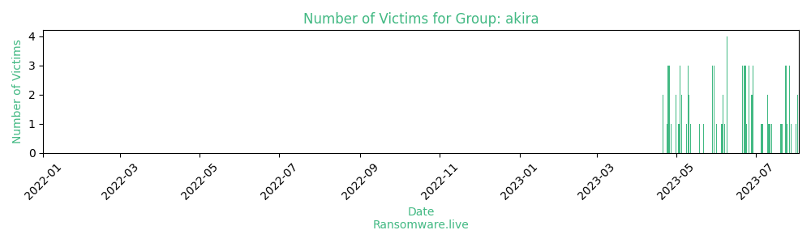

# Profiles for ransomware group : **akira**

### External analysis
- https://arcticwolf.com/resources/blog/conti-and-akira-chained-together/

- https://decoded.avast.io/threatresearch/decrypted-akira-ransomware/

- https://news.sophos.com/en-us/2023/05/09/akira-ransomware-is-bringin-88-back/

- https://twitter.com/MalGamy12/status/1651972583615602694

🔎 `ransomware.live`has an active  parser for indexing akira's victims

### URLs
| Title | Available | Last visit | fqdn | Screenshot 
|---|---|---|---|---|
| none | 🟢 | 24/09/2023 13:35 | `http://akiral2iz6a7qgd3ayp3l6yub7xx2uep76idk3u2kollpj5z3z636bad.onion` | <a href="https://images.ransomware.live/screenshots/akiral2iz6a7qgd3ayp3l6yub7xx2uep76idk3u2kollpj5z3z636bad-onion.png" target=_blank>📸</a> | 
| none | 🔴 | 01/05/2021 00:00 | `http://akiralkzxzq2dsrzsrvbr2xgbbu2wgsmxryd4csgfameg52n7efvr2id.onion` | ❌ | 

### Ransom note
* [📝 1 ransom note](notes/akira)

### Crypto wallets
* 💰 <a href="/#/crypto/akira.md">Crypto wallet(s) available</a>

### Negotiation chats

| Name | Link |
|---|---|
|20230529|  <a href="/#/negotiation/akira/20230529.html"> 💬 </a> |
|20230606|  <a href="/#/negotiation/akira/20230606.html"> 💬 </a> |
|20230616|  <a href="/#/negotiation/akira/20230616.html"> 💬 </a> |
|20230628|  <a href="/#/negotiation/akira/20230628.html"> 💬 </a> |
|20230707|  <a href="/#/negotiation/akira/20230707.html"> 💬 </a> |
|20230719|  <a href="/#/negotiation/akira/20230719.html"> 💬 </a> |
|20230722|  <a href="/#/negotiation/akira/20230722.html"> 💬 </a> |
|20230727|  <a href="/#/negotiation/akira/20230727.html"> 💬 </a> |
|20230728|  <a href="/#/negotiation/akira/20230728.html"> 💬 </a> |
|20230815|  <a href="/#/negotiation/akira/20230815.html"> 💬 </a> |

### Total Attacks Over Time

### Victims

> 113 victims found

| victim | date | Description | Screenshot | 
|---|---|---|---|
| [`CLX Logistics`](https://google.com/search?q=CLX+Logistics) | 22/09/2023 | CLX Logistics, LLC is a global 3PL provider of transportation management systems, managed services, supply chain consulting and intermodal transportation services for a broad base of industry verticals. We almost finished their data transportation and will upload 26GB of their data soon. Tons of business information: clients, personal information, a few confidential docs. We will update. |   |
| [`Glovis America`](https://google.com/search?q=Glovis+America) | 18/09/2023 | The company offers technical jobs, human resources support roles,safety supervisors and managers, or strategic management and leadership positions. 10 GB of data will be available for downloading here soon. Some projects info, personal employee documents, financial and accounting papers.  |   |
| [`Fuji Seal International (US branch)`](https://google.com/search?q=Fuji+Seal+International+%28US+branch%29) | 18/09/2023 | Fuji Seal Group provides shrink sleeve labels, self-adhesive labels, spouted pouches and label-application systems. The US branch of the company has been recently breached and the management refuses to negotiate. So we are informing you about the upcoming uploading of 30GB size data here. There are numerous confidential docs, contracts, agreements etc.  |   |
| [`American Steel & Aluminum`](https://google.com/search?q=American+Steel+%26+Aluminum) | 14/09/2023 | American Steel & Aluminum Co., Inc. was founded in 1967 with 3 employees, a small fabrication shop, and some big dreams for the future. Today they have 70 employees and 70Gb of data that will be uploaded here. There is much project information and financial docs. Employee information is also will be available.  |   |
| [`Accuride`](https://google.com/search?q=Accuride) | 12/09/2023 | Accuride, founded in 1986 and headquartered in Evansville, Indiana, manufactures and supplies vehicle components. Almost terabyte of files will be available for you. Of course there will be many interesting ones. For instance, engineering drawings and photo for TESLA, Mirelli and other sound names. Besides that many confidential documents, personal information of employees with private photo and docs, medical information etc. And finally there is muchinfo about clients and their orders and projects with detailed description (drawings, 3D models). Should I note tons of financialand accounting information? Wait for the release. |   |
| [`Energy One`](https://google.com/search?q=Energy+One) | 06/09/2023 | Energy One Limited provides various software products and services to wholesale energy, environmental, and carbon trading markets in the Asia-Pacific, the United Kingdom, and Europe. The company will provide you all with its 77GB data where you will find information on their projects with big business names, financial documents, contracts, and HR information as well. |   |
| [`New York & Company`](https://google.com/search?q=New+York+%26+Company) | 31/08/2023 | New York & Company is a leading specialty manufacturer and retailer of women's fashion apparel and accessories providing women with modern, wear to work solutions that are multi-functional at affordable prices. The company's website has a list of its best deals, with more to be added soon. But I wouldn't say it will be one of the best deals for them. They have broken off the dialog, and at this point we have no choice but to post their corporate fileshere for everyone to see. Stand by for the release.  |   |
| [`Children's Home of Wyoming Conference`](https://google.com/search?q=Children%27s+Home+of+Wyoming+Conference) | 31/08/2023 | The Children's Home is a family-centered agency with 16 programs,nearly 300 employees and more than 8 locations. CHWC offer six areas of assistance:Behavioral & Emotional Health, Therapeutic Intervention & Clinical Treatment, Leadership & Development, Physical Health & Wellness, Community Outreach & Civic Engagement, Academic Success & Career Readiness.More than 70Gb personal and company documentation data. |   |
| [`Rivers Casino`](https://google.com/search?q=Rivers+Casino) | 31/08/2023 | Rivers Casino is a casino and hotel, that in addition to gambling, offers promotions, dining and entertainment. This is our new client that seems to be offering soon its internal secrets. We willlet you know soon about the breach more detailed. There will be uploaded about 140Gb. |   |
| [`O'Brien Steel Service`](https://google.com/search?q=O%27Brien+Steel+Service) | 30/08/2023 | O’Brien Steel Service is stocked and equipped to service customers of all sizes, ranging from small job shops to the largest OEMs in the USA. More than 70 GB of data will be published soon, including:- Financial documents and reports for 22-23 years;- HR;- Projects;- Employment contracts and documents;- IT documents;- Administrative documents.And also: -Contacts.csv - 5069 lines Clietns data;-Customers.csv - 3596 lines of the Companies data; -Competitors.csv - 3470 lines Suppliers data.Wait for the release. |   |
| [`Renton School District`](https://google.com/search?q=Renton+School+District) | 30/08/2023 | Renton School District is a public school district serving Renton, Washington. 200Gb of Renton schools will be shared here soon. Business docs, projects information and personal information (e.g.medical staff). Wait for the release. |   |
| [`Jasper High School`](https://google.com/search?q=Jasper+High+School) | 28/08/2023 | Another one school that doesn't care about its students documents. More than 60Gb of data will be released here soon. Many confidential documents of students and employees and even some confidential files. Wait for the release. |   |
| [`Intertek`](https://google.com/search?q=Intertek) | 28/08/2023 | Intertek is an international provider of quality and safety services to a wide range of global and local industries. In the pack of more than 300Gb of data you can find all set of information: personal documents, business partners info, confidential agreementsand reports. There is also information about their US affiliate Professional Service Industries. |   |
| [`Penny Publications`](https://google.com/search?q=Penny+Publications) | 28/08/2023 | Penny Publications is recognized as North America’s leading puzzle magazine company and is dedicated to providing family-friendly puzzle entertainment of unsurpassed quality. We will make Penny Publications a bit more recognizable for people and upload the data we've taken from this company. 100 Gb will be available for downloading soon. Employee information, confidential documents and financial files can be found in the data as always. |   |
| [`Voss Enterprises, Divvies`](https://google.com/search?q=Voss+Enterprises%2C+Divvies) | 28/08/2023 | Voss Enterprises (real estate) and Divvies (retail) are two more companies with no hint of a desire to keep their company data safe. We'll post the files of both companies this week. |   |
| [`Cutler-Smith`](https://google.com/search?q=Cutler-Smith) | 28/08/2023 | Cutler-Smith, P.C. is a uniquely positioned to deliver big law firm results with the attention, service and efficiencies that onlya boutique law firm can provide. They've lost 50Gb of their clients' data that will be provided here in our blog within this week. |   |
| [`Edmonds School District`](https://google.com/search?q=Edmonds+School+District) | 24/08/2023 | Edmonds School District's 35 schools cover approximately 36 square miles within the communities of Brier, Edmonds, Lynnwood, Mountlake Terrace, Woodway and portions of unincorporated Snohomish County. Edmonds School District's data covers approximately 10GB ( sql file) on our server and seems not to be very interested in saving it. So we are ready to share it with everyone interested. I think you can imagine what data will be released: personal students documents, employees info, financials, accounting and much other. We are working on the release. |   |
| [`RIMSS`](https://google.com/search?q=RIMSS) | 17/08/2023 | RIMSS provides dealer support services to agricultural, truck, construction, and bus dealerships throughout the U.S. RIMSS is one of that companies who doesn't care when their corporate information is open to public. Why shouldn't we share it with people who are interested in such data? Wait for upload. |   |
| [`Camino Nuevo CharterAcademy`](https://google.com/search?q=Camino+Nuevo+CharterAcademy) | 17/08/2023 | Camino Nuevo Charter Academy educates students in a college preparatory program. We will be uploading their 75GB data shortly. Youwill find some personal information there: ssns, passports, and other business documents. Please expect it soon. |   |
| [`The Clifton Public Schools`](https://google.com/search?q=The+Clifton+Public+Schools) | 17/08/2023 | The Clifton Public Schools is a comprehensive community public school district that serves students in pre-kindergarten through twelfth grade. The leadership of this district has priced their school information too cheaply, which is the reason their internal information is here. As always, 60 GB of school documents with detailed personal information will be posted here.  |   |
| [`Cequint`](https://google.com/search?q=Cequint) | 16/08/2023 | Cequint Inc. provides caller identification (ID) solutions for mobile devices. 880 GB of data is what we got from their network. Alarge number of different documents. The most interesting in this case are the source codes and information about the company's projects. In addition, as you realize, there are a lot of personaland financial documents. Please wait for the release. |   |
| [`Tally Energy Services`](https://google.com/search?q=Tally+Energy+Services) | 16/08/2023 | Tally Energy Services is an integrated oilfield services company committed to helping our customers “make better wells.” We wantedto help these folks make their cyber defenses a little better, but we failed. Soon you're going to see 130GB of their data here. As always, there's a bunch of personal employee records with medical information and emergency contacts. Financial and incident reports are also prominently displayed. |   |
| [`Rite Technology`](https://google.com/search?q=Rite+Technology) | 11/08/2023 | Rite Technology company offers products including copiers, printers, HP products and Sharp Aquos white boards. We will share a zipwith their data of about 15 GB containing good HR data with passport and ssns information of employees. There are also interesting accidents information and business documentation. |   |
| [`The Belt Railway Company of Chicago`](https://google.com/search?q=The+Belt+Railway+Company+of+Chicago) | 10/08/2023 | The Belt Railway Company of Chicago has a strong safety foundation and history, and employees continuously strive for zero incidents. But there was an incident that caused 85 GB of their data appearing on our server. BRC management decided to stay silent with us so we will upload all their documents soon. |   |
| [`Optimum Technology`](https://google.com/search?q=Optimum+Technology) | 10/08/2023 | Optimum Technology is dedicated to developing solutions that helpkeep law enforcement and communities safe. They haven't developed any solutions for cyber security yet so we will share 77Gb of their data soon. SQLs, personal docs, and other business information.  |   |
| [`Boson`](https://google.com/search?q=Boson) | 10/08/2023 | Boson offers IT learning software to individuals, businesses, academic institutions and government entities around the world. We gained access to their network found some files there. We will upload the soon. |   |
| [`TIMECO`](https://google.com/search?q=TIMECO) | 09/08/2023 | Thousands of business owners use TIMECO to maximize their billable hours, eliminate time theft, decrease operating costs, and process payroll in minutes. As we've managed to penetrate to the network of this company, some of that businesses are at risk now. Currently, we working on gaining accesses to them. |   |
| [`Räddningstjänsten Västra Blekinge`](https://google.com/search?q=R%C3%A4ddningstj%C3%A4nsten+V%C3%A4stra+Blekinge) | 07/08/2023 | Räddningstjänsten Västra Blekinge is a sweden municipal association with three member municipalities: Karlshamn, Olofström and Sölvesborg. As these associations are not interested in saving theircitizens data, we will upload the everything we have on this company here soon. Please wait for an update. |   |
| [`Papel Prensa SA`](https://google.com/search?q=Papel+Prensa+SA) | 07/08/2023 | Papel Prensa SA is an Argentina-based company engaged in the manufacture of newsprint paper. Confidential contracts, agreements, personal employee information and other business docs. About 120GB. Please wait for the release. |   |
| [`Koury Engineering`](https://google.com/search?q=Koury+Engineering) | 04/08/2023 | Koury Engineering provides geotechnical engineering, material testing, and inspection services for residential and commercial construction projects throughout Southern California. More that 80GB of confidential contracts, agreements and NDAs, complete employeedata, projects information and much other documents will be uploaded later. All questions to messages section please. |   |
| [`Venture General Agency`](https://google.com/search?q=Venture+General+Agency) | 03/08/2023 | Venture General Agency, LLC (VGA) is a family run Texas based Managing General Agency. These guys are not very talkative. All the data we have from this company will be released here next week. Personal docs and customer information, contracts and payments details - everything will be shared. If you are interested in something specific, let us know in messages section. |   |
| [`Datawatch Systems`](https://google.com/search?q=Datawatch+Systems) | 03/08/2023 | Datawatch Systems experts work in partnership with you to design,install, and operate a security system to safeguard your facility. It's frustrating when one tries to save someone's property andbecome a victim for himself. We took from these experts 100  GB of data containing confidential agreements and contracts, personal documents, customers data and their projects details. Watch your data! Uploading is coming. |   |
| [`Guido`](https://google.com/search?q=Guido) | 02/08/2023 | Guido Companies is a privately held Commercial Construction and Building Materials firm. We hold 115 GB of their corporate data including HR, accounting, financials and so on and so forth. Feel free to check soon! |   |
| [`TGRWA `](https://google.com/search?q=TGRWA+) | 02/08/2023 | TGRWA is a structural engineering firm that specializes in new construction, renovation, and investigation services. All the information of employees, projects, financials, and business processesinformation will be released soon. |   |
| [`Parathon by JDA eHealth Systems`](https://google.com/search?q=Parathon+by+JDA+eHealth+Systems) | 01/08/2023 | Parathon is a full-scale healthcare Revenue Cycle Management dataintegrator. We're almost ready to share the  560GB of data we'vetaken from their network . Contracts, employee personal information, and confidential documents will be posted shortly. |   |
| [`Frost & Sullivan`](https://google.com/search?q=Frost+%26+Sullivan) | 28/07/2023 | Frost & Sullivan, the Growth Consulting Company, partners with clients to accelerate their growth. Planning is always not an easy process and sometimes leads to a failure. These guys underestimated their data and we suppose their clients won't be happy seeing news of this leak. Tons of contracts with big names of international businesses, personal documents including top management and more. >90GBs of data will be available soon. |   |
| [`Offutt Nord`](https://google.com/search?q=Offutt+Nord) | 27/07/2023 | Offutt Nord is a group of insurance attorneys that represent clients involved in general civil litigation statewide in many statesand regions. Their clients' information will be released soon here as always. There are about 70GB of personal documents, judicial processes and much other. |   |
| [`Morehead State University (MSU)`](https://google.com/search?q=Morehead+State+University+%28MSU%29) | 27/07/2023 | Morehead State University is a comprehensive public university with undergraduate and graduate programs, emerging doctoral programs, and an emphasis on regional engagement. This university underwent our attack and lost a lot of data. President Jay Morgan said "no personal data has been compromised" (https://www.wmky.org/news/2023-07-13/morehead-state-university-hit-by-cyber-attack). But that was only a matter of time. Since we haven't been contacted from their part, we will upload every file of this university we have. Complete personal information of students and employees, finance and marketing data will be available soon. |   |
| [`Handi Quilter`](https://google.com/search?q=Handi+Quilter) | 27/07/2023 | Handi Quilter is the worldwide leader and quilters’ choice for longarm machines for both stand-up and sit-down quilting. More than100GB of this company data will be available for downloading soon. They are not of those who want to keep their data confidentially, so we will share their business information with you. Source codes, contracts, financials... Wait for the release. |   |
| [`Becht Engineering`](https://google.com/search?q=Becht+Engineering) | 25/07/2023 | Becht provides technically excellent engineering solutions, plantservices, and software tools to our worldwide clients. This is the company a client will go to when they see their data in open access. All the information of employees, projects, financials, and business processes information will be released soon. |   |
| [`Charles & Colvard Ltd.`](https://google.com/search?q=Charles+%26+Colvard+Ltd.) | 24/07/2023 | Charles & Colvard, manufactures, markets, and distributes moissanite jewels and finished jewelry featuring moissanite worldwide. We are going to distribute all the date we have from them. Their brilliants will be available for downloading here in our blog soon. |   |
| [`SBM`](https://google.com/search?q=SBM) | 24/07/2023 | SBM is a soft service provider focused on developing empowered associates, standardized processes, management systems, and reporting tools that make your life easier. The management of this company hasn't been not very focused on developing communication with us, so we decided to report about the leak everyone who might be interested. Their data of more than 100GB size will be uploaded here withing this week. Passports, ndas, contracts, confidential agreements are about to be uploaded.  |   |
| [`El Milagro`](https://google.com/search?q=El+Milagro) | 24/07/2023 | El Milagro is a small (>150m rev) family-owned tortilla company that started in 1950 in the bustling city of Chicago, Illinois. There is a good volume of detailed personal information in the pack(interested are very welcomed in messages). Accounting and financial data are represented pretty well too.  |   |
| [`Yamaha Canada Music Ltd`](https://google.com/search?q=Yamaha+Canada+Music+Ltd) | 21/07/2023 | Yamaha Canada Music was set up in Winnipeg in 1969. The company owns and operates a corporate Yamaha Music School in Toronto. All national Yamaha programs are developed in conjunction with the Yamaha Music Foundation in Japan. The communication between Canada and Japan seems to be very poor so they cannot come to a solutionregarding the breach. We decided not to wait for them to realizewhat is happening and are going to upload their data here. Soon you will see a good amount of personal documents of employees andand contractors as well. Valid credit cards full info, medical information and tons of operational docs. More likely, everything will be uploaded next week. |   |
| [`Bright Future Electric, LLC `](https://google.com/search?q=Bright+Future+Electric%2C+LLC+) | 20/07/2023 | Bright Future Electric is a full service electrical contractor serving clients throughout the Southeast. We are going to shed somelight on their 50 Gb of data and show you a massive amount of financial docs with customers information. Besides that you can find there employee information and other operational documents. Coming soon. |   |
| [`Gerber ChildrenswearLLC`](https://google.com/search?q=Gerber+ChildrenswearLLC) | 13/07/2023 | Gerber Childrenswear LLC is a leading marketer of infant and toddler apparel and related products in the marketplace. Almost 0.5TBof data will be uploaded to our blog soon. So detailed business information is there: patents, trademarks, contracts with other business giants. Much to look through. |   |
| [`Schmidt Salzman & Moran, Ltd`](https://google.com/search?q=Schmidt+Salzman+%26+Moran%2C+Ltd) | 12/07/2023 | With 35 years of practice in real estate taxation, Schmidt Salzman & Moran, Ltd. aggressively pursues the lowest possible real estate taxes for its clients’ commercial, industrial and multi-unit residential properties. This company has not given us even the lowest price for their customers' personal information. If they don't need it, we are sure there are many of you who are interested.More that 70GB will be uploaded soon. |   |
| [`A123 Systems`](https://google.com/search?q=A123+Systems) | 11/07/2023 | A123 Systems, Inc. (Nasdaq:AONE) develops and manufactures advanced lithium ion batteries and battery systems for the transportation, electric grid services and commercial markets. We have more than 350GB of data from this company and will upload everything soon. You will find tons of confidential business information thereas well as detailed info of staff. Another stocks falling is coming. |   |
| [`Green Diamond Resource`](https://google.com/search?q=Green+Diamond+Resource) | 10/07/2023 | Green Diamond is a fifth-generation, family-owned forest productscompany that owns and manages working forests in nine states throughout the western and southern U.S. Working the forest for so long seems to have taken away the management of this company of their ability to communicate with people. They didn't utter a word for about two weeks after the hack.We found some interesting data on their network and are posting over 30GB of their business information, including personal information, here.  |   |
| [`Green Diamond`](https://google.com/search?q=Green+Diamond) | 10/07/2023 | Green Diamond is a fifth-generation, family-owned forest productscompany that owns and manages working forests in nine states throughout the western and southern U.S. Working the forest for so long seems to have taken away the management of this company of their ability to communicate with people. They didn't utter a word for about two weeks after the hack.We found some interesting data on their network and are posting over 30GB of their business information, including personal information, here.  |   |
| [`Hamre Schumann Mueller & Larson HSML`](https://google.com/search?q=Hamre+Schumann+Mueller+%26+Larson+HSML) | 10/07/2023 | HSML serves the intellectual property needs of a wide range of businesses and individuals from around the world. Their file base includes confidential documents, contracts, clients' personal information, and anything else you might need. 102 GB of their documents will soon be uploaded. |   |
| [`Pinnergy`](https://google.com/search?q=Pinnergy) | 06/07/2023 | Pinnergy is a diversified energy services company with a broad and comprehensive service offering for customers throughout Texas, Louisiana and New Mexico. We're almost ready to share the 55 GB of data we've taken from their network with them. Contracts, projects, employee personal information, and confidential documents will be posted shortly. |   |
| [`Murphy`](https://google.com/search?q=Murphy) | 05/07/2023 | Murphy is a family owned and operated business that manufactures and supplies a variety of engineered wood products such as softwood plywood, veneered hardwoods and panels. We did some work on their network and will show you what we got from there. Several dozen gigabytes of personal information, projects, contracts, personnel information, incidents. They don't seem very talkative for a company with a completely dead website. We'll put it all out there soon. |   |
| [`Nycon`](https://google.com/search?q=Nycon) | 29/06/2023 | Company Nycon has been in the business of advancing concrete for over 30 years. Their products provide a variety of solutions for customers varied needs, including crack control, corrosion resistance, flexural strength, and durability.  SSNs, home addresses, mail addresses, other companies private information and much more will be shared with our visitors here soon. |   |
| [`LCG company (URGENT!)`](https://google.com/search?q=LCG+company+%28URGENT%21%29) | 29/06/2023 | "We are currently experiencing a major IT outage which is impacting our trading platforms. Clients are unable to login or trade.Work to resolve the issue is ongoing.Currently we do not have an expected recovery time, but are doingeverything in our power to resume normal operations as quickly as possible." - stated LCG company. We want to bring some clarity here. First, the failure in the company's system occurred due to our activities. There will be no recovery at all. We blocked the entire internal infrastructure of the company and took a huge amount of sensitive information, whichwill soon be published on our blog. At this point, we must inform all users to withdraw all funds as soon as possible, since the owners of the company hide from you an incredible amount of information about fraudulent schemes, money laundering through an offshore company and much MUCH more. The management of the company should suffer a serious punishment shortly, which they are already trying in every possible way to delay. |   |
| [`Hospitality StaffingSolutions`](https://google.com/search?q=Hospitality+StaffingSolutions) | 29/06/2023 | Hospitality Staffing Solutions is a trusted partner of industry leaders across the country. Whether you're looking for a job in the hospitality industry or need services to grow your business, the HSS team is here to help. If you're a threat actor scouring thedark web for personal documents and business secrets, HSS is ready to help as well. These guys said they don't want their 1.31 TBof data, so we're ready to share it with you. Detailed employee and customer data will be uploaded to our blog soon.  |   |
| [`Wilcom`](https://google.com/search?q=Wilcom) | 28/06/2023 | Wilcom is an Australian computer software company. The Wilcom team is a group of passionate people deeply committed to their work.Their wide international team will soon be able to download their own documents in one place - on our blog. Lots of DLs, contracts, passports, non-disclosures and stuff. |   |
| [`Stoughton Trailers`](https://google.com/search?q=Stoughton+Trailers) | 28/06/2023 | Stoughton Trailers is a supplier of semi-truck trailers. This company designs, manufactures and markets a wide range of dependablesemi-truck trailers. We've gone through their not very dependable network and will show you what they hold inside their trailers.All corporate papers including personal will be unloaded here soon. |   |
| [`London Capital Group(LCG)`](https://google.com/search?q=London+Capital+Group%28LCG%29) | 26/06/2023 | London Capital Group (LCG) is a global online financial trading platform and multi-asset broker. We have studied this company fromthe inside and would not recommend it to anyone as their practices are not very clean. Their data will be available here soon andyou will see the mechanics of these brokers with your own eyes. Detailed personal information about their clients will also be posted. |   |
| [`Chariton Valley`](https://google.com/search?q=Chariton+Valley) | 26/06/2023 | Chariton Valley provides state-of-the-art telecommunications services to businesses and residents. Chariton Valley has a leading position in the state and in many other countries, offering a fiber-optic network to the premises of its subscribers. We can say that among our customers, this company is also leading the way. 3 TB of data and DB were taken from their servers. We will upload everything in the next few days. |   |
| [`Knights of Old Group`](https://google.com/search?q=Knights+of+Old+Group) | 26/06/2023 | The Knights of Old Group offers full-load, solo and multi-cargo shipping to all parts of the UK and the EU. Delivering freight when you're a knight is not as convenient. Perhaps knight's honor prevented them from contacting us to discuss their data we got fromtheir network. We will share their corporate information here. There is also a database with customers data. Everything will be uploaded soon. |   |
| [`The City of Nassau Bay`](https://google.com/search?q=The+City+of+Nassau+Bay) | 24/06/2023 | The City of Nassau Bay is an incomparable community at the leading edge of technology. But being on the edge is dangerous sometimes. As the city government says theydon't have evidences that the personal information hasbeen compromised. We are willing to provide some evidence of personal files in 45GB data we have for them to be sure. We have made the process of uploading company data as simple as possible for our users. All you need is any torrent client (like Vuze, Utorrent, qBittorrent or Transmission to use magnet links). You will find the torrentfile above.1. Open uTorrent, or any another torrent client.2. Add torrent file or paste the magnet URL to upload the data safely.3. Archives have no password.MAGNET URL: magnet:?xt=urn:btih |   |
| [`Galveston College`](https://google.com/search?q=Galveston+College) | 23/06/2023 | Galveston College provides residents of Galveston Island and the surrounding region with academic, workforce development, continuing education and community service programs. We decided to check and show you if you can protect yourself from cyber attacks on the island and realized you can't. Soon you'll see the results of our work with this client here. Much student detailed personal info. 99GB. |   |
| [`Perpetual Group`](https://google.com/search?q=Perpetual+Group) | 23/06/2023 | Perpetual Group is a diversified financial services company whichhas been serving Australians since 1886 when it was established as a trustee company by a group of businessmen. The information about the Australian this group served will soon be available in our blog for everyone. 700GB of databases with highly detailed business information in total. |   |
| [`The Akron-Summit County Public Library`](https://google.com/search?q=The+Akron-Summit+County+Public+Library) | 23/06/2023 | The Akron-Summit County Public Library is an organization dedicated to providing reading, learning and other opportunities and programs for members of the community. Soon there will be another opportunity for customers of this library and others who are interested: you will be able to review any staff document for free. Keep in mind that your documents may be there, too. This informationand the rest of the internal library will be available here shortly. |   |
| [`GC&E`](https://google.com/search?q=GC%26E) | 22/06/2023 | GC&E provides Information Technology (IT), security, and telecommunications solutions. GC&E also provides consultation, design, and implementation. Markets served are federal, state and local, K-12 and higher education, healthcare and commercial markets. We are going to show you how this company looks inside soon. Think twice before consulting with these professionals about cyber security. |   |
| [`DBSA hit by ransomware attack.`](https://google.com/search?q=DBSA+hit+by+ransomware+attack.) | 22/06/2023 | The Bank was attacked using Akira ransomware by an unknown actor without any permissions or approves from our side.We are ready to provide any assistance needed to help DBSA recover it's systems and would like to ask their representative to contact us anytime.We are currently conducting an internal investigation to ensure that DBSA information is not leaked. A bank representative will beprovided with all the details of the incident. |   |
| [`Refractron`](https://google.com/search?q=Refractron) | 22/06/2023 | Refractron has created resilient, innovative ceramic-based solutions since 1984, offering responsive customer service and accountability to maintain each client relationship with the best care possible. Their cyber security systems are not so resilient and innovative and that unfortunate fact caused their data will be uploaded to our blog these days. |   |
| [`Yokohama-oht (atgtire)`](https://google.com/search?q=Yokohama-oht+%28atgtire%29) | 21/06/2023 | Yokohama Off-Highway Tires America Inc is a company that operatesin the Automotive industry. A well-known name in tire business is going to share it's secrets in our blog. The data we took from them is of 1.3TB size will be available for you soon. |   |
| [`Café Soluble`](https://google.com/search?q=Caf%C3%A9+Soluble) | 21/06/2023 | Café Soluble is a Nicaraguan privately held company. They produceand market powdered nutritional beverages, cereals, soy-based products, roasted and ground coffee. This company has a modern distribution chain of products and is ready to distribute it's 330 GBof corporate data to our blog. Btw, they work with Nestle. So you can find something really interesting in their fails. |   |
| [`Habasit`](https://google.com/search?q=Habasit) | 21/06/2023 | Habasit is a manufacturer of timing and conveyor belts, includingfabric-based belts, plastic modular belts, and power transmission belts. They service the food, textile, wood, paper, postal, materials handling. Soon they will serve any interested individual in our blog conveying their corporate data to our blog. We hope their conveyors are strong enough for files of 470GB size. |   |
| [`The Adams County Communication Center orADCOM911`](https://google.com/search?q=The+Adams+County+Communication+Center+orADCOM911) | 09/06/2023 | The Adams County Communication Center, also known as ADCOM911, isa Dispatch Center located in Adams County, Colorado. To provide high-quality communication, dispatch, and data services to any who call on ADCOM for help. We are grateful to ADCOM for their high-quality services and for 40GB of their data and DBs with detailed information. Soon we will provide access to their data to any who is interested in. This organization has one of the best data services! |   |
| [`Ellis Patents `](https://google.com/search?q=Ellis+Patents+) | 09/06/2023 | Ellis Patents is a cable cleat manufacturer.  As a centre of excellence, the company designs complete cable cleat installations tailored to the project specific needs of customers, and deliver expertly engineered solutions every time. Unfortunately, the company representatives haven't shown a willingness to come to an agreement with us. You can wait for their corporate data publishing soon. |   |
| [`ACI Advanced Chemical Industries`](https://google.com/search?q=ACI+Advanced+Chemical+Industries) | 09/06/2023 | Advanced Chemical Industries, more commonly marketed and known asACI is a Bangladeshi pharmaceuticals and conglomorate company founded in 1973. The firm is headquartered in the thana of Tejgaon I/A, in Dhaka. ACI is one of the leading firms in the pharmaceuticals and chemical industry of Bangladesh. Unfortunately, the company leadership haven't shown nether willingness nor interest to cooperate, so you will be able to see the great amount of their corporate data soon. |   |
| [`Caruso`](https://google.com/search?q=Caruso) | 09/06/2023 | Caruso is a real estate development and hospitality company headquartered in LA. We almost ready to share their internal documentsthat include full employee data, very detailed accounting information, contracts, confidential documents and even funny incidentswith guests. |   |
| [`Harbro`](https://google.com/search?q=Harbro) | 07/06/2023 | Founded in 1977, Harbro is a company that operates multiple feed mills that supply animal feed to dairy, beef, sheep, pig, and poultry farmers. 60 GB of their corporate data will be available soon.  |   |
| [`WTI - Western Telematic`](https://google.com/search?q=WTI+-+Western+Telematic) | 06/06/2023 | Founded in 1964 by an engineer with a vision, WTI started with a desire to improve computer transmissions over phone lines and help corporations solve problems for the most advanced computing systems in the world. WTI has been at the forefront of the data communications and computer networking industries ever since the Carterfone decision. We will show you their Accounting, CEO docs, HR,Insurance, IT, NDAs, Product Testing, SALES and much more other information.  |   |
| [`Asakura Robinson`](https://google.com/search?q=Asakura+Robinson) | 06/06/2023 | Asakura Robinson is a planning, urban design, and landscape architecture firm which strengthens environments and positively impacts communities through innovation, engagement, stewardship, and anintegrated design process. If their IT guy keep on stalling, youwill see their internal secrets soon. |   |
| [`Malt Products`](https://google.com/search?q=Malt+Products) | 05/06/2023 | Founded in 1957, Malt Products Corporation is a family-owned business that produces and provides minimally processed, nutritious sweeteners for leading food and beverage manufacturers. We hold their accounting, financial and operational documentation, lots of passports, driver licenses and other personal information that we're happy to share with you shortly. Stay tuned. |   |
| [`Middlesex County Public Schools`](https://google.com/search?q=Middlesex+County+Public+Schools) | 01/06/2023 | MCPS has been identified as a “School Division of Innovation” fordesigning and implementing alternatives to traditional instructional practices and school structures that improve student learning and promote college and career readiness, and good citizenship.Unfortunately, the School have no worries about lost 543 GB of students and teachers personal information, school projects, financial info and so on and so forth. All of this will be available for download soon. |   |
| [`Lewis Young Robertson & Burningham`](https://google.com/search?q=Lewis+Young+Robertson+%26+Burningham) | 30/05/2023 | Lewis Young Robertson & Burningham is an independent, fully registered municipal financial advisor. As this firm played an active role as financial advisor and consultant to local governments in Utah, Wyoming, Idaho, Oregon, Washington, and American Samoa, youwill be able to take a look at the details of their cooperation and other corporate data of the Lewis Young firm here in our blog. |   |
| [`SK Life Science`](https://google.com/search?q=SK+Life+Science) | 30/05/2023 | SK Life Science is a subsidiary of SK Biopharmaceuticals, Co., Ltd., and a part of SK Group—a large conglomerate global corporation. SK Life Science is a CNS-focused pharmaceutical company. You will see their corporate data soon.  |   |
| [`The National Association of Home Builders`](https://google.com/search?q=The+National+Association+of+Home+Builders) | 30/05/2023 | The National Association of Home Builders represents the largest network of craftsmen, innovators and problem solvers dedicated tobuilding and enriching communities. "Building Homes, Enriching Communities, Changing Lives" is the motto of the company. They really change lives because of a neglecting attitude to their own security, so you will be able to do whatever you want with their clients, employees and others info soon. Stay tuned. |   |
| [`Computer InformationConcepts Inc`](https://google.com/search?q=Computer+InformationConcepts+Inc) | 29/05/2023 | Computer Information Concepts Inc provides information technologyservices. This guys are so strong so they refused to receive ourhelp and are trying to recover by themselves. We would like to wish them all the best. While their website is completely dead, wedecided to assist them a bit and to upload their data here. |   |
| [`Fersten Worldwide`](https://google.com/search?q=Fersten+Worldwide) | 29/05/2023 | Fersten Worldwide is a company that provides decorating services.We are interested how a company that claims "we develop revolutionary products and services going above and beyond the industry’sexpectations" cannot afford neither proper cybersecurity nor payto preserve corporate and customer information. Employees, competitors and anyone interested will soon be able to download Fersten's data here. |   |
| [`Brokers Trust Insurance Group`](https://google.com/search?q=Brokers+Trust+Insurance+Group) | 29/05/2023 | Brokers Trust is a family insurance company with eyes on the future. This highly experienced team provides expertise for both personal and business insurance coverage. And we, in our turn, will provide both personal and business customer information of this company in our blog soon, if we fail to agree with them. We want tounderline that the data is pretty much detailed. |   |
| [`Harmony Gold`](https://google.com/search?q=Harmony+Gold) | 22/05/2023 | Harmony Gold, a world-class gold mining and exploration company, has operations and assets in South Africa and Papua New Guinea. Harmony, which has more than 68 years' experience in the industry,is the second largest gold producer in South Africa and one of the largest data providers to dark web. Can you imagine what holdsa golden chest of 3,5 TB of data taken from gold miners? You will see soon. |   |
| [`Advantage Resourcing`](https://google.com/search?q=Advantage+Resourcing) | 19/05/2023 | Advantage Resourcing specializing in multiple human capital management services including contingent staffing, direct & permanent hire, on-site staffing management services, and others. This company lost its advantage as we obtained some of its resources and are ready to upload it here. Their contingent couldn't manage their network properly and lost 916gb including databases. |   |
| [`Schottenstein Property Group`](https://google.com/search?q=Schottenstein+Property+Group) | 12/05/2023 | Schottenstein Property Group is a real estate industry operator. This company owns dozens of GB of their partners' corporate and employee personal information and seem to manage it badly as you can see this message here. We don't think they are really interested in resolving this. We will upload all the data and provide youwith a link soon. |   |
| [`Gregory Poole Equipment Company`](https://google.com/search?q=Gregory+Poole+Equipment+Company) | 11/05/2023 | Gregory Poole Company was simple. This company as the executive CAT construction equipment dealer offers you access to it's data full of contracts, payment details, clients' information and projects of a variety of big names in the business.  |   |
| [`Ipleiria Student Branch`](https://google.com/search?q=Ipleiria+Student+Branch) | 11/05/2023 | Ipleiria Student Branch is a company that operates in the Education industry. We are sure the Leiria's Institute will be grateful to this company for spreading students' and other internal sensitive information to the darknet. We'll upload the data we have here soon as the organization doesn't care about it at all. |   |
| [`Novatech EngineeringConsultants`](https://google.com/search?q=Novatech+EngineeringConsultants) | 10/05/2023 | Novatech Engineering Consultants offers a wide range of engineering and planning services to a diverse client base across urban and rural eastern Ontario. Cyber protection of this company wasn't planned very well so we can suggest you to look inside a wide range of their data of ~ 30GB and take what is interested to you. Personal information of 100  professionals will be available for downloading soon. |   |
| [`Sun Windows`](https://google.com/search?q=Sun+Windows) | 10/05/2023 | Sun Windows is a manufacturer of windows and doors for the residential housing and light-commercial building industry. We've opened the doors of this company and had a fascinating trip through their network. We could share the details of the trip with everyoneinterested or help to arrange one. |   |
| [`Columbia Distributing`](https://google.com/search?q=Columbia+Distributing) | 10/05/2023 | Started in 1935 Columbia Distributing has distributed some of thebest-known brands in the beverage business. There won't be a joke about corporate data distribution. We want to inform you all only that such a giant will disclose his secrets here for you (withour assistance surely). He has a lot for you to dig in and you will be able to do it soon. |   |
| [`Mercer University`](https://google.com/search?q=Mercer+University) | 09/05/2023 | Their mission - to teach, to learn, to create, to to inspire, to empower and to serve. We would add to disclose. Recently they have fulfilled a data mission. A 'best value' of national universities value it's students and teachers personal and it will be available for downloading in our soon. Our offer with a relatively affordable for saving their internal data was denied.  |   |
| [`The Lab Consulting`](https://google.com/search?q=The+Lab+Consulting) | 05/05/2023 | The Lab Consulting is a management consulting focusing on non-technology improvements that was in 1993. Such companies like this one sometimes to be consulted too and as a result they become providers of someone's sensitive information. The Consulting data containing tons of their clients of various directions and their own employees will soon be uploaded here.  |   |
| [`The Perry Law Firm`](https://google.com/search?q=The+Perry+Law+Firm) | 05/05/2023 | The Perry Law Firm provides comprehensive legal to public and private clients in state and courts, administrative agencies and alternative forums. Many of the above mentioned clients and employees will be able to see and even download own documents here soon. We welcome everyone to for something interesting too as a lot of documents will be released.  |   |
| [`New World Travel, Inc.`](https://google.com/search?q=New+World+Travel%2C+Inc.) | 04/05/2023 | New World Travel, Inc. is a comprehensive receptive services provider for destinations throughout the USA and Canada. We have something in common withthis organization. We've provided receptive services for New World Travel internal documentation that includes, as you understand, great amount of personal information of both their clients and employees. We'll share soon! P.S. Look for a travel agency carefully. |   |
| [`The Mitchell Partnership`](https://google.com/search?q=The+Mitchell+Partnership) | 04/05/2023 | The Mitchell Partnership Inc is a mechanical building service consulting engineering practice that was founded in Toronto in 1958. Engineers being consulted in the company have no idea that confidential contracts with Mitchell Partnerships are not really confidential as well as personal information of Mitchells' own employees . Obtained documentation is very detailed and will be here soon. |   |
| [`Garcia Hamilton & Associates`](https://google.com/search?q=Garcia+Hamilton+%26+Associates) | 04/05/2023 | Garcia Hamilton & Associates is a firm of 29 employees that managers $11 billion. They work with high quality equity, fixed income and balanced assetsfor institutional and high net worth clients. Sound massive for 29 guys. And it is not surprisingly, when they lose over 150GB of their customers' financial information and their own corporate and personal data.  Everything is going to be uploaded soon. |   |
| [`The McGregor`](https://google.com/search?q=The+McGregor) | 03/05/2023 | The McGregor company specializes in supplying equipment, and consultation to ensure crops are for growers. This McGregor was unable to an attack and lost 362GB of data. The content the has supplied us will be available here soon. McGregor falls sometimes.  |   |
| [`BridgeValley Community & Technical`](https://google.com/search?q=BridgeValley+Community+%26+Technical) | 01/05/2023 | This college is a place of opportunity for a learner population provides access to quality as well as to its students personal information. offers leading-edge technology, innovative ideas, private information, financial documents and much We will assist the college in providing everyone is interested in their data with the access.  |   |
| [`BridgeValley Community & Technical College`](https://google.com/search?q=BridgeValley+Community+%26+Technical+College) | 01/05/2023 | This college is a place of opportunity for a diverse learner population provides access to quality education as well as to its students personal information. BridgeValley offers leading-edge technology, innovative ideas, students' private information, financial documents and much more. We will assist the college in providing everyone who is interested in their data with the access. |   |
| [`Fee, Smith & Sharp`](https://google.com/search?q=Fee%2C+Smith+%26+Sharp) | 27/04/2023 | The law firm of Fee, Smith & Sharp LLP was to effectively represent the needs of the firm's national and international clients in litigation regulatory matters. We must confess they do their perfectly. Recently, Smith & Sharp represented clients more widely then it usually agreed. We more than happy to help this company to share clients' private information here. Surely, Smith Sharp will open themselves too.  |   |
| [`Pak-Rite, Ltd.`](https://google.com/search?q=Pak-Rite%2C+Ltd.) | 26/04/2023 | Pak-Rite, Ltd. designs and fabricates custom plastic, and corrugated components. They can these components individually or integrate them our creative package designs. We'd like to that Pak-Rite company is going to provide their corporate and personal information to everyone is interested in it. We will share it here in a days.  |   |
| [`4LEAF, Inc`](https://google.com/search?q=4LEAF%2C+Inc) | 26/04/2023 | Founded in 2001, 4LEAF, Inc. is a engineering firm providing services throughout Western United States. They say they have track record of completing complex projects and assignments with both public and private clients. clients can thank 4LEAF for making their private public. Soon you will see those records in detail our blog and 4LEAF will face a new complex to complete.  |   |
| [`Family Day Care Services`](https://google.com/search?q=Family+Day+Care+Services) | 26/04/2023 | Family Day Care Services is a licensed home child in Toronto. They use evidence-based approaches in of our services to ensure we offer quality based on sound knowledge. If you see Family Day data post here, it means that not all services company provides are of great quality. Personal of their customers was not protected almost at and will be published on our blog soon. Their data turned out to be very interested as well. wait for the release.  |   |
| [`Rockbridge Capital`](https://google.com/search?q=Rockbridge+Capital) | 25/04/2023 | Rockbridge Capital is an investment adviser with the SEC and is headquartered in Columbus, Unfortunately, no one advised Rockbridge to in cyber security. This painful fact caused to lose much of business information: numerous contracts, projects, business contacts, detailed and personal employees information, confidential and so on and so forth. Almost 40 GB coming soon.  |   |
| [`Thompson Builders`](https://google.com/search?q=Thompson+Builders) | 25/04/2023 | Thompson Builders is a part of a group of that are comprised of an entrepreneurial spirited under the leadership of Rob Thompson. They real estate, land development, design services, management & skilled trades; all under one roof. the same roof an accident has happened recently a good amount of corporate data of these went away from them. You have a unique chance to home for Thompson's corporate data (accounting, information, business contracts and much other including personal data of their employees). They be free soon!  |   |
| [`Schottenstein Property Group Inc`](https://google.com/search?q=Schottenstein+Property+Group+Inc) | 25/04/2023 | Schottenstein Property Group Inc is a company operates in the Real Estate industry. The company interest in 80 retail properties in 23 states and corporate information of it's customers and that is now in our possession. Some of them are big and well-known. Personal information is also in this case. Schottenstein doesn't care much this data so you will be able to see it soon.  |   |
| [`Settlement Music School`](https://google.com/search?q=Settlement+Music+School) | 24/04/2023 | Settlement Music School was founded in 1908 as a of The College Settlement in Philadelphia. This doesn't seem to notice that many things relating security have changed since 1908. We've found documents with personal information in their net: teachers, parents, employees. Financial reports other numerous internal documents are also going be posted in this blog soon.  |   |
| [`Alliance Sports Group (THE PIONEER OF BLOG)`](https://google.com/search?q=Alliance+Sports+Group+%28THE+PIONEER+OF+BLOG%29) | 21/04/2023 | Alliance Sports Group is a designer, manufacturer distributor of innovative, high-quality products consumers love. We congratulate them - they have the pioneer of our blog! We're prepared to show their accounting, finance, legal, insurance, HR, operations and so on and so on - you will see the data they haven't managed to keep secure. Stay to a leak.  |   |
| [`Alliance Sports Group (THE PIONEER OF AKIRA BLOG)`](https://google.com/search?q=Alliance+Sports+Group+%28THE+PIONEER+OF+AKIRA+BLOG%29) | 21/04/2023 | Alliance Sports Group is a designer, manufacturer and distributor of innovative, high-quality products that consumers love. We congratulate them - they have become the pioneer of our blog! We're prepared to show you their accounting, finance, legal, insurance, HR, users, operations and so on and so on - you will see the brilliant data they haven't managed to keep secure. Stay tuned to a leak.   |   |

Last update : _Sunday 24/09/2023 14.39 (UTC)_
