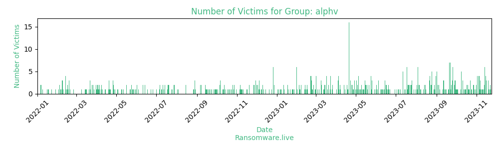

# Profiles for ransomware group : **alphv**

> ALPHV, also known as BlackCat or Noberus, is a ransomware family that is deployed as part of Ransomware as a Service (RaaS) operations. ALPHV is written in the Rust programming language and supports execution on Windows, Linux-based operating systems (Debian, Ubuntu, ReadyNAS, Synology), and VMWare ESXi. ALPHV is marketed as ALPHV on cybercrime forums, but is commonly called BlackCat by security researchers due to an icon of a black cat appearing on its leak site. ALPHV has been observed being deployed in ransomware attacks since November 18, 2021.ALPHV can be configured to encrypt files using either the AES or ChaCha20 algorithms. In order to maximize the amount of ransomed data, ALPHV can delete volume shadow copies, stop processes and services, and stop virtual machines on ESXi servers. ALPHV can self-propagate by using PsExec to remote execute itself on other hosts on the local network.

_`aka blackcat - fileserver `ihoqnxnvdwybrv6kiteiesjc3ic6du6axtv3arouxr6ddswrxa2wrbyd.onion``_

### External analysis
- https://therecord.media/alphv-blackcat-is-the-first-professional-ransomware-gang-to-use-rust/

- https://www.bleepingcomputer.com/news/security/alphv-blackcat-this-years-most-sophisticated-ransomware/

- https://securityaffairs.co/wordpress/126022/cyber-crime/inetum-hit-by-blackcat-ransomware.html

- https://symantec-enterprise-blogs.security.com/blogs/threat-intelligence/noberus-blackcat-alphv-rust-ransomware

🔎 `ransomware.live`has an active  parser for indexing alphv's victims

### URLs
| Title | Available | Last visit | fqdn | Screenshot 
|---|---|---|---|---|
|   | 🟢 | 03/08/2023 07:05 | `http://alphvmmm27o3abo3r2mlmjrpdmzle3rykajqc5xsj7j7ejksbpsa36ad.onion` | <a href="https://images.ransomware.live/screenshots/alphvmmm27o3abo3r2mlmjrpdmzle3rykajqc5xsj7j7ejksbpsa36ad-onion.png" target=_blank>📸</a> | 
| none | 🟢 | 03/08/2023 07:06 | `http://alphvmmm27o3abo3r2mlmjrpdmzle3rykajqc5xsj7j7ejksbpsa36ad.onion` | <a href="https://images.ransomware.live/screenshots/alphvmmm27o3abo3r2mlmjrpdmzle3rykajqc5xsj7j7ejksbpsa36ad-onion.png" target=_blank>📸</a> | 
| none | 🔴 | 01/05/2021 00:00 | `http://2cuqgeerjdba2rhdiviezodpu3lc4qz2sjf4qin6f7std2evleqlzjid.onion` | ❌ | 
|   | 🔴 | 07/06/2023 03:03 | `http://vqifktlreqpudvulhbzmc5gocbeawl67uvs2pttswemdorbnhaddohyd.onion` | <a href="https://images.ransomware.live/screenshots/vqifktlreqpudvulhbzmc5gocbeawl67uvs2pttswemdorbnhaddohyd-onion.png" target=_blank>📸</a> | 

### Ransom note
* [📝 4 ransom notes](notes/alphv)

### Total Attacks Over Time

### Posts

> 458 victims found

| post | date | Description | Screenshot | 
|---|---|---|---|
| [`Tempur Sealy International`](https://tempursealy.com) | 02/08/2023 | Tempur Sealy International, Inc. is an American manufacturer of mattresses and bedding products. It was formed when Tempur-Pedic International, a manufacturer of memory foam mattresses acquired its biggest competitor Sealy Corporation in 2012. | <a href="https://images.ransomware.live/screenshots/posts/f5a10cd663359f051dd5acae14cd1068.png" target=_blank>📸</a> |
| [`Helen F. Dalton Lawyers`](https://helendalton.com/) | 02/08/2023 | With over 25 years experience specializing in Personal Injury and Labor Law, the Law Offices of Helen F. Dalton and Associates has the experience and resources necessary to fight for you. | <a href="https://images.ransomware.live/screenshots/posts/0595d8c53b21999b9fbcf26bcc5fcc3d.png" target=_blank>📸</a> |
| [`KIMCO Staffing Service`](https://www.kimco.com) | 01/08/2023 | We have helped more than 212,000 people find employment since 1986. You can count on Kimco Staffing Services to connect you with top employers and guide you every step of the way in your job search. With more than 30 years of award-winning service, our specialty practices are:      Office Professionals     Contact Center/Customer Care     Accounting Operations     Technical Support     Industrial Staffing     Premier Partnership     Kimco Direct  | <a href="https://images.ransomware.live/screenshots/posts/5f9a09dbfd6a41d73a186e858330a371.png" target=_blank>📸</a> |
| [`Coachella Valley Collection Service`](https:\\www.cvcollection.com) | 29/07/2023 | Coachella Valley Collection Service provides debt collection services, including “medical, retail, commercial, judgment, and check debt collection.” In addition, CVCS “provides acknowledgement report, debtor activity report, monthly remittance statement, actuary report, and closure report” services | <a href="https://images.ransomware.live/screenshots/posts/827fd1b0e5484ad95665aed5c50dadd7.png" target=_blank>📸</a> |
| [`Azimut - Time of publication!`](https://www.azimut.it/) | 26/07/2023 | Founded in 1989, Azimut Holding is an independent Italian Group operating in the asset management sector | <a href="https://images.ransomware.live/screenshots/posts/c61060efb78f6a5a52433975da8b63ec.png" target=_blank>📸</a> |
| [`CF Assicurazioni`](https://www.cfassicurazioni.com/) | 26/07/2023 | CF Assicurazioni is an Italian insurance company. Has a wide client base. Ready to leak. | <a href="https://images.ransomware.live/screenshots/posts/4f97b537287ee13b20384e9aa32c265e.png" target=_blank>📸</a> |
| [`Globacom Limited`](https://www.gloworld.com) | 26/07/2023 | Globacom Limited, commonly known as Glo, is a Nigerian multinational telecommunications company with annual revenue about $1.3B. Network of this company has been breached and over 600Gb of data were leaked from there. Now we are offering top management of Gloworld and Mike Adenuga specially to contact us in next 3 days to protect this stolen data. In case if they will completely refuse to negotiate all data related to Gloworld will be exposed for free download. These data contains following information:   - payments  - financial data of your company  - financial data of your employees  - signed contracts and agreements  - employees personal data  - phone call records  - simcards registrations with abonent data  - phone calls detailed tracing of your all registered numbers  - full clients base with all data related   Management of Globacom Limited decided to hide this incident and not to inform both regulators and customers. Globacom's top management has last chance July 29rd, if they want to protect data of Globacom's business, partners and customers.   | <a href="https://images.ransomware.live/screenshots/posts/f4e4cbac6bc42a5c5231a144723d5dae.png" target=_blank>📸</a> |
| [`NEBRASKALAND`](https://www.nebraskaland.com) | 25/07/2023 | Nebraskaland, Inc. distributes and sells seafood and meat products to customers in New York metro area. It provides boxed beef, chicken, pork, lamb, veal, and various meats, as well as a range of frozen and processed foods | <a href="https://images.ransomware.live/screenshots/posts/346dbb8b41bd39d421fdd22cce9ab3b5.png" target=_blank>📸</a> |
| [`Republic.bz`](https:/republicsteel.com) | 25/07/2023 | !!!! | <a href="https://images.ransomware.live/screenshots/posts/3ada7e37a5b59626e48804b929f75400.png" target=_blank>📸</a> |
| [`Greenfiber`](https://greenfiber.com) | 24/07/2023 | All data published and available for downloading! Enjoy!  Greenfiber is a national manufacturer of cellulose insulation. Providing energy saving and cost effective insulation choices for the US and Canada. Greenfiber has the industry's leading cellulose insulation products | <a href="https://images.ransomware.live/screenshots/posts/7269b8cd0e1411613ce7e28d1a4ef06a.png" target=_blank>📸</a> |
| [`ITW Food Equipment Group`](https://www.itwfoodequipment.com) | 24/07/2023 | ALL DATA PUBLISHED AND AVAILABLE FOR DOWNLOADING!!! | <a href="https://images.ransomware.live/screenshots/posts/52000fb8e6c5d255ec70cbc9f00cc655.png" target=_blank>📸</a> |
| [`Kansas Joint & Spine Specialists`](https://www.kansasjointandspine.com) | 23/07/2023 | Founded in 1976, Kansas Joint & Spine Specialists, formerly Orthopaedic & Sports Medicine at Cypress, has been committed to delivering the exceptional bone, joint, and muscle care patients need to make today theirs. Our orthopaedic surgeons, doctors, and medical staff are dedicated to improving the lives of residents in Wichita, Scott City, El Dorado, Anthony, and the surrounding areas in Kansas as well as treating each patient with courtesy, respect, and compassion. | <a href="https://images.ransomware.live/screenshots/posts/51ae1f5e48305022a93e7f6803750236.png" target=_blank>📸</a> |
| [`THE COLLINS LAW FIRM`](https://www.collinslaw.com/) | 23/07/2023 | Top-Rated Naperville Personal Injury, Environmental, and Business Attorneys With the Courage to Take on Powerful Interests for You  When someone causes harm to you and your family, you need aggressive, knowledgeable lawyers in your corner. At The Collins Law Firm, we pride ourselves in our ability to take the fight to powerful interests that take advantage of you. It is our privilege as Naperville personal injury lawyers to represent the injured and deliver the justice each of our clients deserves.  Whether at our law firm in Naperville, Illinois, or in trial courts throughout the state and country, our attorneys can provide you with the aggressive legal representation you need. Contact us and arrange a free consultation if you are suffering due to:      Environmental contamination that is making you and your family sick, or damaging your property value     The wrongful death of a loved one     Injuries sustained due to a car accident, medical malpractice, defective product or other negligent conduct     The breach of a business contract | <a href="https://images.ransomware.live/screenshots/posts/2e732dea5bbe91e1c70a26d56de8a5db.png" target=_blank>📸</a> |
| [`Azimut.it`](https://www.azimut.it/) | 21/07/2023 | Founded in 1989, Azimut Holding is an independent Italian Group operating in the asset management sector | <a href="https://images.ransomware.live/screenshots/posts/908adb135bbd569d51701c3928b67644.png" target=_blank>📸</a> |
| [`Hirsch Bedner Associates`](https://hba.com) | 21/07/2023 | Hirsch Bedner Associates (HBA), founded in 1965 and headquartered in Santa Monica, California, is a hospitality design firm specializing in interior design | <a href="https://images.ransomware.live/screenshots/posts/d75a4ebac3e0f5f8b6354c5cdd07a49e.png" target=_blank>📸</a> |
| [`Cavanaugh, Biggs & Lemon PA, Attorneys at Law`](https://cavlem.com/) | 20/07/2023 | Cavanaugh, Biggs & Lemon offers a broad spectrum of legal services. From Appellate and Administrative Litigation to Worker's Compensation, we are here to serve our clients with legal counsel.  Our clients Alegria Living & Healthcare, Inc. Animal Clinic of North Topeka, P.A. Brier Payne Meade Insurance, Inc. Capitol Federal Savings Cavanaugh & Porter, P.A. Century/United Companies, Inc. Cook, Flatt & Strobel Engineers, P.A. Davin Electric, Inc. Family Pet Hospital, P.A. Fraternal Order of Police Legal Defense Plan Feuerborn Family Funeral Service, Inc. Gage Center Dental Group, P.A. Gray Insurance Highway Oil, Inc. Kansas National Education Association Kendall Construction, Inc. Kevin Brennan Family Funeral Home Kid Stuff Marketing, Inc. Lawrence Police Officers Association Linn Willow Creek Dairy LLC Luxury Lawn and Landscape, Inc. Medicalodges, Inc. Midland Contractors, Inc. Midwest Radiology Institute, P.A. Mystere Living & Healthcare, Inc. Oskaloosa Animal Clinic, P.A. Pheasant Run Ranch, LLC. Phoenix Home Care, Inc. Phoenix Home Care Illinois, Inc. Phoenix Healthcare Holdings, Inc. Plumbing by Carlson, Inc. Professional Law Enforcement Association Strathman Sales Company, Inc. United Fire Group West Ridge Animal Hospital, P.A.  | <a href="https://images.ransomware.live/screenshots/posts/12fdea3a3edc996fafc82d9e9cbd1c3e.png" target=_blank>📸</a> |
| [`Entegra`](https://www.entegrasolutions.com) | 20/07/2023 | Decades of Mechanical and Electrical Engineering, Design and Testing. Innovative smart pigging tools. An evolutionary Data Science practice. ENTEGRA’s technologies meet the real demands of pipeline operators around the world. It’s not just about getting ILI tools launched and through the pipeline. It’s about being able to accurately deliver state-of-the-art UHR imaging of the pipe 100% of the time. It’s about pipeline integrity.  | <a href="https://images.ransomware.live/screenshots/posts/97cbf94bf5523e5804f0562937ef2555.png" target=_blank>📸</a> |
| [`VOG`](https://www.vog.it/) | 19/07/2023 | VOG PRODUCTS is a producer of natural ingredients for the food and beverage industry. | <a href="https://images.ransomware.live/screenshots/posts/cc1f1c07ea6fb9d0eac19526499994c9.png" target=_blank>📸</a> |
| [`EA SMITH`](https://www.smith.no/) | 18/07/2023 | SmithStål Nord is a company that operates in the Building Materials industry. It employs 251-500 people and has $50M-$100M of revenue | <a href="https://images.ransomware.live/screenshots/posts/fb310591b712efa7c969cf4621a56072.png" target=_blank>📸</a> |
| [`The Estée Lauder Companies`](https://estee.com) | 18/07/2023 | The Estée Lauder Companies Inc. is an American multinational cosmetics company, a manufacturer and marketer of makeup, skincare, fragrance and hair care products, based in Midtown Manhattan, New York City. It is the second largest cosmetics company in the world after L'Oréal. | <a href="https://images.ransomware.live/screenshots/posts/28f46d39ed2975d92af01a987f66d18e.png" target=_blank>📸</a> |
| [`KUITS`](https://www.kuits.com/) | 18/07/2023 | About 3.45 TB data taken from youd main fail servers and has been downloaded. You have 3 days for contact with us to decide this pity mistake, which made your IT department, decide what to do in next step. If you prefer keep silence, we will start publicate data, most of it - citizens confidential documents. - Internal Company Data (Employees personal data, CV's, DL's, ID's, SSN's, Financial reports, Accounting data, Loans data, Insurance, Agreements and much more); of course it include absolutly and highly confidential data.  - Clients documentation (DL's, ID's, SSN's, Financial data, Credit cards information, Loans data, Agreements and much more); - Database include other commercial confidential data.    | <a href="https://images.ransomware.live/screenshots/posts/f2ce5bf5e146525b6d3f159d66185923.png" target=_blank>📸</a> |
| [`Ascendum Machinery`](https://ascendummachinery.com) | 18/07/2023 | All data available for downloading! Enjoy. Ascendum is the Volvo Construction Equipment dealer. Ascendum is one of the leading construction equipment dealers in the United States.  | <a href="https://images.ransomware.live/screenshots/posts/3cb88b89ba9489e93bbc5fedbfbac111.png" target=_blank>📸</a> |
| [`FIIG`](https://www.fiig.com.au/) | 18/07/2023 | ALL DATA AVAILABLE FOR DOWNLOADING!!! | <a href="https://images.ransomware.live/screenshots/posts/200455504342626f2d406947ca811b25.png" target=_blank>📸</a> |
| [`Robison Engineering`](http://robisonengineering.com) | 18/07/2023 | All data here. Enjoy.  Robison Engineering is a full service MEP design firm specializing in hotels and multi-unit residential facilities.  In support of this specialty, we have a division focused on restaurants, fast food, retail, and general TI design.  These specialties are a natural fit since most hotels and multi-unit residential projects include food, retail, and general TI on the main level. | <a href="https://images.ransomware.live/screenshots/posts/5a3766937a350c223d46160e3c4864a4.png" target=_blank>📸</a> |
| [`Baumschlager Hutter Partners - Business Information`](https://baumschlagerhutter.com/) | 16/07/2023 | some company that builds cabins | <a href="https://images.ransomware.live/screenshots/posts/3dd7c44e06d3e10e42ec73e84712e904.png" target=_blank>📸</a> |
| [`Chin Hin Group`](https://chinhingroup.com/) | 14/07/2023 | 80GB of the selected sensitive data   - financial statements - financial reports  - Confidential and NDA agreements  - Projects and intellectual property  And more | <a href="https://images.ransomware.live/screenshots/posts/0b00e0987cf5a052d1025868c6fed154.png" target=_blank>📸</a> |
| [`Maruchan Inc`](https://maruchan.com) | 12/07/2023 | The Maruchan ramen is a very popular brand of noodles in the United-States. The noodles are made in the United-States. Maruchan, one of the largest instant noodle brands internationally. | <a href="https://images.ransomware.live/screenshots/posts/eccbed3972bc90e73cd21d7cd54d176d.png" target=_blank>📸</a> |
| [`Amber Court 2020 was hacking A lot of customers' personal information was stolen`](https://www.ambercourtal.com) | 12/07/2023 | Who is Amber Court 2020  Since 1968, under the loving care and guidance of Alfred and Judith Schonberger, they set the standard for quality care and lifestyle for seniors, in a residential setting. This holistic approach for an individual’s well-being, physically, mentally and emotionally, is at the heart of the Amber Court Family experience.  Headquarters: 1155 E Jersey St, Elizabeth, New Jersey, 07201, United States Phone Number: (908) 352-9200 Website: www.ambercourtal.com Facebook: http://www.facebook.com/ambercourtal   | <a href="https://images.ransomware.live/screenshots/posts/f64c260d6c5cb6ba28bace5e130ad6d7.png" target=_blank>📸</a> |
| [`Algeibacom has a critical level of security on its network Customer and partner data is st`](https://www.algeiba.com) | 12/07/2023 | Who is Algeiba.com  Creating the best technology solutions to transform organizations around the globe has been our vision for more than 14 years. We started our journey standing out as the best infrastructure boutique in the Southern Cone. We incorporated new skills to create software of all kinds, as well as to get involved with business areas and secure them from any place and device with the mission of enabling our Clients to be successful.  Headquarters: 771 Paraná, Buenos Aires, Ciudad Autónoma de Buenos Aires, C1017AAO, Argentina Phone Number: +54 1139885519 Website: www.algeiba.com Linkedin: http://www.linkedin.com/company/algeiba-s-a- Facebook: http://www.facebook.com/algeibait Twitter: http://www.twitter.com/algeibasa | <a href="https://images.ransomware.live/screenshots/posts/1c6cd9925b82187a7abeefd5a4f9435b.png" target=_blank>📸</a> |
| [`Eastin Hotel Makkasan Bangkok was hacked Customers' financial and personal information has`](Website:%20https://www.eastinhotelsresidences.com/eastingrandsathornbangkok) | 12/07/2023 | Who is Eastin Hotel Makkasan Bangkok  Eastin Hotel Makkasan Bangkok is a company based out of Thailand.  Address: 1091/343 New Petchburi Road, Makkasan, Ratchathewi, Bangkok 10400, Thailand Phone: +66 2 651 7600 Website: https://www.eastinhotelsresidences.com/eastingrandsathornbangkok Twitter: https://twitter.com/EastinHotels Instagram: https://www.instagram.com/eastingrandsathorn Facebook: https://www.facebook.com/EastinGrandSathorn YouTube: https://youtu.be/e4JRglQefnw | <a href="https://images.ransomware.live/screenshots/posts/855c000e0fc56c0cf1102a5bcb5b0a04.png" target=_blank>📸</a> |
| [`Divgi-TTS was hacked Due to the extreme low level of security, a huge amount of confidenti`](https://www.divgi-tts.com) | 12/07/2023 |  Who is Divgi-TTS  Headquarters: 75 General Block Midc, Pune, Maharashtra, 411 026, India Phone Number: +91 2027302170 Website: www.divgi-tts.com Linkedin: http://www.linkedin.com/company/divgi-warner-private-limited  | <a href="https://images.ransomware.live/screenshots/posts/556e407231b166de8b3888187659bf77.png" target=_blank>📸</a> |
| [`Beverly Hills Plastic Surgery`](https://www.beverlyhillsplasticsurgery.com) | 08/07/2023 | Breast augmentation, rhinoplasty, and liposuction are some of the most sought-after cosmetic surgery procedures at Beverly Hills Plastic Surgery. Dr. David Kim and Dr. Eugene Kim have developed an impeccable reputation for their stunning, natural-looking results and high patient satisfaction. They pride themselves on providing honest advice and the highest standard of care, from your initial plastic surgery consultation to your post-operative appointments.  Our plastic surgeons have been serving the Los Angeles and Beverly Hills area for many years and take great pride in the work they do. Both of our surgeons are board certified by the American Board of Plastic Surgery. This is the only plastic surgery board recognized by the American Board of Medical Specialties. | <a href="https://images.ransomware.live/screenshots/posts/f109656320fa74dfcbfa4e48b6da2087.png" target=_blank>📸</a> |
| [`Bangladesh Krishi Bank`](https://www.krishibank.org.bd/) | 06/07/2023 | We are here to inform you about data breach which took place at the "Bangladesh Krishi Bank" network on June 21th 2023. As a result of this breach our team had downloaded over 170Gb of sensitive data from this network. Also we have encrypted all servers and data stored there. We have infiltrated Krishi Bank network and stayed there for 12 days, it was enough to study their documentation and download everything was needed.   Here is a quick scope of data we have downloaded:   - financial data (accounts, statements, payments, taxes, etc)  - employees data (emails, passports, labor papers, contracts, etc)  - sql backup dated 6/19/2023   Unfortunatelly, for "Bangladesh Krishi Bank" top management, they decided not to negotiate recovery of stolen data's.   We have placed a strong backdoor tools within Krishi Bank's network, so we can always return there and do whatever we want.   IT-management of this bank does not have enough qualification and skills to protect their data.   "All the contributors and investors who used to store their money at the Bangladesh Krishi Bank should withdraw their money within 7 days after this message being send, in case if they don't want to lost all their money." - this message will be send to all contacts and emails we will found in "Bangladesh Krishi Bank" documents, in case if "Bangladesh Krishi Bank" top-management will not contact us within 72 hours starting July 8th 2023.  | <a href="https://images.ransomware.live/screenshots/posts/1316b0d7d6dfccfaec66798ca6dd68f8.png" target=_blank>📸</a> |
| [`Main Street Title and Settlement Services LLC`](https://www.mainsttitle.com) | 05/07/2023 | MAIN STREET TITLE BEGAN IN 1988 WITH DOMINICK DECARLO AND 3 EMPLOYEES ON MAIN STREET IN HACKENSACK. Rates were high and searches were done manually at the courthouse. Every file was handled with care and individual attention to detail to ensure a smooth closing.  As the years progressed, our client base grew as well as our team. Processes were streamlined and our services expanded to include settlement, thus creating Main Street Title and Settlement in 2007.  With over 50 employees and growing, Main Street Title and Settlement has become one of the leading title insurance and settlement agencies in the New Jersey / New York Tristate Area. We continue to expand our service offerings and tools to be the best partners to our clients, near and far.  The Team at Main Street prides itself on service, integrity, education and innovation, stemming from the foundation Mr. DeCarlo set forth since the beginning. Today, our Executive Team continues to lead the agency in providing quality customer service to each and every client. In addition, they play an active role within the community, including involvement in fund-raisers for many local and regional charitable organizations. | <a href="https://images.ransomware.live/screenshots/posts/c168ba29031fbbcf584fc8c4df1b519e.png" target=_blank>📸</a> |
| [`Townsquare Media Inc`](https://townsquaremedia.com) | 03/07/2023 | Townsquare Media, Inc. is a community-focused digital media, digital marketing solutions and radio company. It owns and operates radio stations, digital and social properties and live events in small and mid-sized markets across the United States. | <a href="https://images.ransomware.live/screenshots/posts/f20008318dc35f4f6c7904fdd2b111cf.png" target=_blank>📸</a> |
| [`barts health nhs trust`](https://www.bartshealth.nhs.uk/) | 30/06/2023 | World-class clinical services Our group of hospitals provide a huge range of clinical services to people in east London and beyond. Over 2.5 million people look to our services to provide them with the healthcare they need.   | <a href="https://images.ransomware.live/screenshots/posts/22238681322e290cbc8b2684ee1314a4.png" target=_blank>📸</a> |
| [`National Institutional Facilitation Technologies (Pvt) Limited`](https://www.nift.pk/) | 22/06/2023 | National Institutional Facilitation Technologies (Pvt.) Limited. NIFT is the only Automated Cheque Clearing House and the prominent Payment System Operator in Pakistan. | <a href="https://images.ransomware.live/screenshots/posts/68d50c01a5d601f54234bfca35edfe86.png" target=_blank>📸</a> |
| [`Craig & Associates, LLC`](http://www.craigcpa.com/) | 21/06/2023 | Craig & Associates, LLC was incorporated August 1, 1980.  We have been serving individuals and businesses for over 40 years and offer a variety of services: income tax preparation, strategic tax planning, financial planning, estate planning, retirement planning, insurance planning, investment review, auditing & accounting services, recordkeeping & reports, payroll & sales tax services, pension & profit sharing plan services and incorporations & partnerships. We work with several types of businesses including Corporations, S-Corporations, Partnerships, Condominium Associations, Municipalities and Not-for-Profit Organizations.  | <a href="https://images.ransomware.live/screenshots/posts/ac47af93d36680115884a31eed5b2c62.png" target=_blank>📸</a> |
| [`COEX`](https://coex.com) | 20/06/2023 | Barin Architects is a creative and dynamic Montreal-based architectural firm with an established reputation for innovation, dedicated service, and the expertise and rigour of its seasoned architectural team.   Our multidisciplinary teams stand out for their participatory vision of development. We adapt to the needs of the people who inhabit the spaces we design. We create living environments in harmony with those who live in them. In this approach, harmony is both the process and the result. | <a href="https://images.ransomware.live/screenshots/posts/fbb1cb82c3605c8fd394c19973113479.png" target=_blank>📸</a> |
| [`Strait & Lamp Group`](https://straitandlamp.com) | 20/06/2023 | The Strait & Lamp Group is a leading supplier to the central Ohio building industry focused on providing individual attention to homebuilders, contractors and remodeling professionals. | <a href="https://images.ransomware.live/screenshots/posts/5282b9f5e975a5752f44bd34ef0e2c76.png" target=_blank>📸</a> |
| [`Mammoth Energy (NASDAQ: TUSK)`](https://mammothenergy.com) | 19/06/2023 | Energy At Mammoth Energy Services, our employees are our most valuable asset, and we are committed to providing an environment that promotes safety, health and wellbeing. | <a href="https://images.ransomware.live/screenshots/posts/bc27e039c29b297d06bddde79471ee07.png" target=_blank>📸</a> |
| [`The Dufresne Group - DSG - ASHLEY HOMESTORES`](https://dufresne.ca) | 18/06/2023 | The Dufresne Group (TDG) is a retailer of consumer goods. It offers furniture, appliances, home furnishings, and other products.  https://thedufresnegroup.ca https://dufresne.ca  Dufresne Spencer Group, LLC dba Ashley   Dufresne Furniture & Appliances  Furniture · Canada · 1,590 Employees    CEO MARK DUFRESNE  Mike Linton CFO & President, Shared Services & Dufresne Furniture & Appliances  Kevin Hook President, DSG Canada | <a href="https://images.ransomware.live/screenshots/posts/ba66662a804d14a975f07f6fe8c219c4.png" target=_blank>📸</a> |
| [`The Reddit Files`](https://reddit.com) | 17/06/2023 | Reddit is an American social news aggregation, content rating, and discussion website. Registered users submit content to the site such as links, text posts, images, and videos, which are then voted up or down by other members. Posts are organized by subject into user-created boards called "communities" or "subreddits". | <a href="https://images.ransomware.live/screenshots/posts/5a72a28274bc0665e9ee4d73a67749a3.png" target=_blank>📸</a> |
| [`Bauer Built`](https://www.bauerbuilt.com) | 17/06/2023 | All Data. | <a href="https://images.ransomware.live/screenshots/posts/bd1448069298bc9df2a6250c9586ff20.png" target=_blank>📸</a> |
| [`Creative Liquid Coatings`](https://www.creativeliquidcoatings.com) | 16/06/2023 | Founded in 1994, Creative Liquid Coatings operates as a full service supplier that streamlines the entire process beginning with product design, mold flow analysis, and feasibility studies, to advanced error proofing technology, assembly, and fully integrated secondary operations. The company has 3 plants located in the state and serves industries such as automotive, heavy truck, marine, powerspor ts, and structural medical furniture The company is headquartered in Kendallville, Indiana.   Headquarters 2620 Marion Dr, Kendallville, Indiana, 46755, United States  Phone Number (260) 349-1862  Website www.creativeliquidcoatings.com  Revenue $145.6M  -------------------------------------------------  Angle Advisors has announced that Creative Liquid Coatings Inc. (CLC) has acquired the assets of CK Technologies (CKT) from Cascade Engineering. Angle Advisors acted as the exclusive investment banking advisor to Cascade and CKT in completing this transaction.   CKT is one of few suppliers in North America for very-large, injection molded plastic panels and parts for commercial trucks and buses. Operating facilities in Ohio, North Carolina, and Texas, CKT provides vertically integrated services utilizing 16 injection molding presses, automated paint finishing lines, and advanced assembly capabilities.  Headquarters 1701 Magda Dr, Montpelier, Ohio, 43543, United States  Phone Number (419) 485-1110  Website www.cktech.biz  Revenue $114.2M  -------------------------------------------------  On July 30, Creative Liquid Coatings (CLC) acquired the major assets of McKechnie Vehicle Components (MVC) located in Nicholasville, Ky. and at 12117 C.R .Koon Highway in Newberry.  This transaction will expand CLC’s current footprint beyond Indiana and allow them to service customers across the United States. In addition, over 230 jobs have been saved and the future of these locations has been secured.  Headquarters 27087 Gratiot Ave Fl 2, Roseville, Michigan, 48066, United States  Phone Number (586) 491-2600  Website www.mvcusa.com  Revenue $116M  -------------------------------------------------  | <a href="https://images.ransomware.live/screenshots/posts/8d348cafb3531a38f3c0442ab0a46eb9.png" target=_blank>📸</a> |
| [`Badan Operasi Bersama Pt Bumi Siak Pusako Pertamina Hulu`](https://bobcpp.co.id) | 16/06/2023 | Data: http://i4utqt3qnrm2hxhvitunmj4b7777svzbzrc4ewig6j4g6g5zzqahz2qd.onion Badan Operasi Bersama Pt Bumi Siak Pusako Pertamina Hulu is a company that operates in the Retail industry. It employs 251-500 people and has $50M-$100M of revenue. The company is headquartered in Jakarta, Jakarta, Indonesia  bobcpp.co.id   Address:Menara Bank Danamon, 20 flrJl. Prof. Satrio - Mega Kuningan, Jakarta, Jakarta 12950, ID Category:il and Gas, Oil & Gas Exploration & Services, Energy, Utilities & Waste Treatment Web Rank: 18 Million SIC: 59, 594 NAICS: 45,453210 | <a href="https://images.ransomware.live/screenshots/posts/fb5ecdd59a55ab06776c456c96e4392b.png" target=_blank>📸</a> |
| [`Plott Corporation`](https://plott.co.jp) | 15/06/2023 | Plot Co., Ltd. is an IT vendor that creates next-generation secure inter-company communication with know-how since its establishment in 1968.  | <a href="https://images.ransomware.live/screenshots/posts/4465c8facea0d74d93dcd34f8df52286.png" target=_blank>📸</a> |
| [`Sonangol`](https://www.sonangol.co.ao/) | 15/06/2023 | A Sonangol — Sociedade Nacional de Combustíveis de Angola, E.P. — é a empresa estatal angolana do ramo petrolífero vocacionada para a exploração de hidrocarbonetos líquidos e gasosos no subsolo e na plataforma continental de Angola e responsável pela exploração, produção, fabricação, transporte e comercialização de hidrocarbonetos em Angola.  Operamos de maneira eficiente, segura, transparente e comprometida com a protecção ambiental, tendo por finalidade promover o desenvolvimento harmonioso do país e reforçando a utilização sustentável dos recursos nacionais de hidrocarbonetos. | <a href="https://images.ransomware.live/screenshots/posts/d518fec0c51d19b4d1da13d64f053227.png" target=_blank>📸</a> |
| [`Alpha Data`](https://www.alpha.ae) | 15/06/2023 | Alpha Data is one of the leading Digital Transformation providers & System Integrators in the Middle East. Established in 1981, the company has evolved from small beginnings to over 1500 professionals building ICT solutions for thousands of organizations.  The company is BS EN ISO 27001:2013 & ISO 9001:2008 management standard certified. We work with clients through a combination of deep-level understanding of their business needs, extensive technical knowledge, and highly capable delivery teams.  The company’s diverse portfolio of offerings includes new technologies that encompass Artificial Intelligence (AI), Mobility, Security, the Internet of Things (IoT), Big Data, and the Cloud—all designed to help customers in their transformation journey to the rapidly evolving digital economy. | <a href="https://images.ransomware.live/screenshots/posts/fbc5a72b57133e8da0095618e37e7111.png" target=_blank>📸</a> |
| [`New Horizons Medical`](https://www.newhorizonsmedical.org/) | 14/06/2023 | New Horizons Medical, PC founded in 2009, is a private physician group dedicated to providing the safe prescription of buprenorphine (Suboxone) to patients engaged in serious recovery efforts from opiate dependence. | <a href="https://images.ransomware.live/screenshots/posts/8968c5ad54387d8c486f8c7eb79da7ff.png" target=_blank>📸</a> |
| [`Automatic Systems - is a company with extremely low security of its network and products w`](https://%20www.automatic-systems.com) | 12/06/2023 | Who is Automatic Systems  Automatic Systems, one of the world leaders in the field of the secure access control, designs and manufactures equipment for pedestrian, vehicle, and passenger access.  Headquarters: 5 Ave Mercator, Wavre, Wallonia, 1300, Belgium Phone Number: +32 10230211 Website: www.automatic-systems.com Linkedin: http://www.linkedin.com/company/automatic-systems Facebook: http://www.facebook.com/418988701503587 Twitter: http://www.twitter.com/automaticsysuk | <a href="https://images.ransomware.live/screenshots/posts/895a09e00c73dbc19966a37fb78abff6.png" target=_blank>📸</a> |
| [`Krack Zapaterías`](https://www.krackonline.com/) | 11/06/2023 | Krack Zapaterías Sl is a company that operates in the Apparel & Fashion industry. It employs 251-500 people and has $50M-$100M of revenue | <a href="https://images.ransomware.live/screenshots/posts/d15af73fbb0f756bcb4ebbc0170d7bd1.png" target=_blank>📸</a> |
| [`Coca-Cola FEMSA`](https://coca-colafemsa.com) | 10/06/2023 | Coca-Cola FEMSA, S.A.B. de C.V., known as Coca-Cola FEMSA or KOF, is a Mexican multinational beverage company headquartered in Mexico City, Mexico. It is a subsidiary of FEMSA which owns 47.8% of its stock, with 27.8% held by wholly owned subsidiaries of The Coca-Cola Company and the remaining 25% listed publicly on the Mexican Stock Exchange (since 1993) and the New York Stock Exchange (since 1998). It is the largest franchise Coca-Cola bottler in the world, the company has operations in Latin America, although its largest and most profitable market is in Mexico. | <a href="https://images.ransomware.live/screenshots/posts/04f9cae31d31d713fccc1cd24ae8a94f.png" target=_blank>📸</a> |
| [`Silicon Valley Mechanical`](https://svminc.com/) | 09/06/2023 | Locally based San Jose firm, Silicon Valley Mechanical, is a full service mechanical contractor, specializing in design-build commercial HVAC, plumbing, and service / maintenance, including 24-hour emergency services. Our commitment to being industry experts, providing quality service, continuous improvement, and a collaborative culture has afforded us the ability to design and execute all our projects with the utmost success and quality.  With our 130,000 SF office and fabrication facility, our project teams are able to design, manufacture, and stage ductwork, piping, and pre-skidded equipment ready for delivery and installation. We are committed to excellence and constantly increasing efficiency by detailing and fabricating utilizing the latest 3D design and manufacturing technology; in turn allowing your project(s) to be completed within your schedule and budget. | <a href="https://images.ransomware.live/screenshots/posts/9db6fa7e3a8304e1cdcde968757e9a74.png" target=_blank>📸</a> |
| [`CASEPOINT pt2`](https://casepoint.com) | 08/06/2023 | Very sensitive data is uploaded. Here is Operation Blooming Onion information, Cellebrite report, agent and supervisor names and many more. Read full post to get more detailed info.  | <a href="https://images.ransomware.live/screenshots/posts/82b89d7c815a12b35c40b122000829cc.png" target=_blank>📸</a> |
| [`Stylish Fabric (stylishfabriccom)`](https://www.stylishfabric.com/) | 05/06/2023 | Stylish fabric online store is the source of the largest selection apparel and home decor fabrics. We stock lace fabrics, upholstery fabrics, drapery fabrics and offer discount and wholesale fabric prices | <a href="https://images.ransomware.live/screenshots/posts/8d6c7555910f520d04e42c5f76d72010.png" target=_blank>📸</a> |
| [`North West Paving Ltd`](https://www.northwestpaving.com/) | 05/06/2023 | North West Paving Ltd. is a progressive, growing company that has operated in the Edmonton area for 50 years. We provide gravel, asphalt and concrete services to Municipalities, General Contractors and Developers in our community and surrounding areas.  North West Paving Ltd. is proud to be a member of the Alberta Roadbuilders and Heavy Construction Association, The Edmonton Construction Association, and the Urban Development Institute.  At North West Paving Ltd. the goal of all management and staff is to provide our customers with quality workmanship at a reasonable price.  North West Paving Ltd. has some of the most knowledgeable and dedicated personnel in the industry.  At North West Paving Ltd, it is our Mission to protect the health and safety of our people, our assets, the public and the environment through the implementation of a health and safety culture that strives to eliminate unsafe conditions and to achieve our goal of zero loss.  North West Paving Ltd, will make every effort to promote and maintain a safe and healthy working environment with an emphasis on our employees making it home safely at the end of each day. | <a href="https://images.ransomware.live/screenshots/posts/bd544502bf73e7eb00adc0f43d4b89ff.png" target=_blank>📸</a> |
| [`D&K Group, Inc`](https://dkgroup.com) | 05/06/2023 | D&K Group, Inc. is a leading US manufacturer of quality print finishing solutions. All D&K products are made in the USA including thermal extrusion and pressure sensitive (cold) laminating films and adhesives, wide format and desktop laminators, automated one or two sided high-speed laminating systems, and much more. | <a href="https://images.ransomware.live/screenshots/posts/8d12969dc6ad3b576b44a12c0b33f9fe.png" target=_blank>📸</a> |
| [`Tension Corporation`](https://www.tension.com/) | 03/06/2023 | The Tension Corporation is a privately held and operated company based in Kansas City, Missouri, it is a global leader in envelope, printed product, packaging and packaging automation solutions. Tension manufactures billions of envelopes annually and their envelope and printed products division serve a variety of industries, including third-party billing, financial, insurance and direct marketing.  After a long negotiation process management of Tension Corporation offered only $55,000 to protect their sensitive data with total volume over 200gb which contains employee's personal data, company's financial data, plant's data, billing and engineering data, SQL-core and more. The price which has been asked for to protect their data was right for them, since Tension Corporation had such amount of money at their accounts.  | <a href="https://images.ransomware.live/screenshots/posts/a00a949769b35b53fc9824cec9b8dc8d.png" target=_blank>📸</a> |
| [`hwlebsworth`](https://hwlebsworth.com.au/) | 02/06/2023 | FISRT PART OF DATA 1.45TB IS PUBLISHING!!! | <a href="https://images.ransomware.live/screenshots/posts/cbad03d4a8f1172c5f1bab490f64b647.png" target=_blank>📸</a> |
| [`JPW Industries (jpwindustriescom)  Baileigh Industrial (baileighcom)  With SpaceX Data [`](https://jpwindustries.com) | 02/06/2023 | JPW Industries produces and sells tools and equipment for metalworking, woodworking, and welding.   Baileigh Industrial is a company that specializes in manufacturing and distributing metalworking and woodworking equipment. | <a href="https://images.ransomware.live/screenshots/posts/17bfcf6b04a6ec4d0a1abb9020cc7b8c.png" target=_blank>📸</a> |
| [`Brinkmann & Niemeijer Motoren`](https://www.brinkmann-niemeijer.nl) | 01/06/2023 | In addition, Brinkmann & Niemeijer has all facilities in-house for the testing of each and every component of a generating set, which provides the client with a top-notch support when it comes to technical perfection | <a href="https://images.ransomware.live/screenshots/posts/772c891a320fa23add24c0bb004efbe8.png" target=_blank>📸</a> |
| [`casepointcom (UPDATE)`](https://www.casepoint.com) | 30/05/2023 | We have over 2TB of very sensitive data, lawyers, SEC, DoD, FBI, Police and more. | <a href="https://images.ransomware.live/screenshots/posts/db4fac7fb5240763956e02672d1aef25.png" target=_blank>📸</a> |
| [`First Community Credit Union`](https://fccu.org/) | 26/05/2023 | ALL DATA AVAILABLE FOR DOWNLOADING!!! | <a href="https://images.ransomware.live/screenshots/posts/e8af8a48e7bd5da4791a6e423fa78ef0.png" target=_blank>📸</a> |
| [`Procurri`](https://www.procurri.com) | 26/05/2023 | Procurri is the only 100% channel focused company in our space that focuses exclusively on partnering with the channel to deliver lifecycle solutions not typically available from the traditional IT channel. Head offices Asia, Europe, USA, Canada. | <a href="https://images.ransomware.live/screenshots/posts/f892c0b2f6fd9725035217a1728e9442.png" target=_blank>📸</a> |
| [`wenntownsend`](https://wenntownsend.co.uk) | 26/05/2023 | At the beating heart of any healthy organisation you’ll find solid financial management. It doesn’t matter if you’re a large corporate, solopreneur or not-for-profit – you’ve got to make the numbers work. But achieving financial finesse isn’t easy, in fact the complexities of accounting, tax and regulation can make it feel like the odds are firmly stacked against you.  We believe all organisations should be able to master their accounts, and it’s our mission to help you do just that. You bring the problems, we’ll bring clarity, solutions and a straightforward approach.  Let’s get going. | <a href="https://images.ransomware.live/screenshots/posts/3c282a40a82130d426d26c91cef37321.png" target=_blank>📸</a> |
| [`Norton Healthcare`](https://nortonhealthcare.com) | 25/05/2023 | Norton Healthcare is a Kentucky health care system with more than 40 clinics and hospitals in and around Louisville, Kentucky. The hospital and health care system is the Louisville area's third largest private employer, located at more than 140 locations throughout Greater Louisville and Southern Indiana. The Louisville-based system includes six hospitals (one being in Madison, Indiana) with 1,993 licensed beds, eight outpatient centers, 18 Norton Immediate Care Centers, over 1,700 employees, over 1,500 employed medical providers, and approximately 2,000 total physicians on its medical staff.   According to Business First of Louisville, Norton Healthcare is the Louisville area's third largest employer, with more than 17,000 employees. Norton Healthcare employs some 4,000 nurses and has nearly 2,000 affiliated physicians. Additionally, Norton Healthcare has programs in place to support nursing students attending both public and private universities in Kentucky and Indiana.  Revenue : 2.6B USD | <a href="https://images.ransomware.live/screenshots/posts/37d93661b2260e48ce4f15be6cc523f1.png" target=_blank>📸</a> |
| [`The Middleton Group`](https://www.themiddletongroup.com/) | 24/05/2023 | The Middleton Group is the company tasked with delivering Memco, Inc. and MandM Poultry Equipment, Inc. to the industrial marketplace. Set up in the early 2000™s, its function was to market the synergies of Memco, Inc. and MandM.  | <a href="https://images.ransomware.live/screenshots/posts/3ebefa1c86cb7fa97effe97a713f5d60.png" target=_blank>📸</a> |
| [`HIGHLANDHOMES`](https://www.highlandhomes.com/) | 24/05/2023 | ALL 2.06 TB DOWNLOADED DATA IS PUBLISHED AND AVAILABLE FOR DOWNLOADING!!! | <a href="https://images.ransomware.live/screenshots/posts/149a0905d407eb67a18ada549844aa45.png" target=_blank>📸</a> |
| [`valleywomenshealth`](https://valleywomenshealth.com/) | 24/05/2023 | ALL DATA IS PUBLISHED AND AVAILABLE FOR DOWNLOADING!!! | <a href="https://images.ransomware.live/screenshots/posts/537297f03912112f8b9399cdee7ce391.png" target=_blank>📸</a> |
| [`Voxx Electronics - company, which has a huge number of vulnerabilities was hacked A large `](https://www.voxxelectronics.com) | 24/05/2023 | Who Voxx Electronics  Audiovox is a leading, global supplier of mobile and consumer electronics products and holds the #1 market share in RSE.  Headquarters: 150 Marcus Blvd, Hauppauge, New York, 11788, United States Phone Number: (631) 231-7750 Website: www.voxxelectronics.com | <a href="https://images.ransomware.live/screenshots/posts/3f43ced4112916bb400d58545ca62fcd.png" target=_blank>📸</a> |
| [`FajarPaper was hacked The most dangerous company to cooperate with in Indonesia may pose a`](https://www.fajarpaper.com) | 21/05/2023 | Who is FajarPaper  PT Fajar Surya Wisesa Tbk (FajarPaper) is a leading packaging paper manufacturer in Indonesia with an installed capacity over 1.5 million tons per year combined and a range of products which include Kraft Liner Board (KLB) and Corrugated Medium Paper (CMP) for carton-box packaging and Coated Duplex Board (CDB) for display packaging. FajarPaper was established as a limited liability company under the laws of Indonesia on February 29, 1988. FajarPaper has been listed on the Jakarta Stock Exchange since December 19, 1994. (FASW.JK). FajarPaper is a company of the future in terms of its forward-thinking approach to business, energy conservation and the environment. Not only does every FajarPaper product begin its life from recycled paper but also the company’s paper machines are powered by self-sufficient power plants.  Headquarters: 30 Jln Abdul Muis, Jakarta Pusat, 10160, Indonesia Phone Number: +62 213441316 Website: www.fajarpaper.com Stock Symbol: FASW Linkedin: http://www.linkedin.com/company/fajar-surya-wisesa-tbk-pt  | <a href="https://images.ransomware.live/screenshots/posts/a873b9a62f9fe195636cbb00902938e4.png" target=_blank>📸</a> |
| [`Reach Cooling Group was hacked A company whose cooperation is dangerous to your business h`](https://www.reachcooling.com) | 21/05/2023 |  Who is Reach Cooling Group  Reach is a privately held international organization with branches located in various countries around the world. The corporate headquarters is located in Miami, Florida, USA and the manufacturing facilities are located in Shanghai, China.   Headquarters: 625 E 10th Ave, Hialeah, Florida, 33010, United States Phone Number: (305) 863-6360 Website: www.reachcooling.com Linkedin: http://www.linkedin.com/company/reach-cooling-group Facebook: http://www.facebook.com/reachcooling Twitter: http://www.twitter.com/reachcooling | <a href="https://images.ransomware.live/screenshots/posts/44ea189a69efee24c2f6f341a7b6ed2a.png" target=_blank>📸</a> |
| [`It Works Global`](https://google.com/search?q=It+Works+Global) | 19/05/2023 |  | <a href="https://images.ransomware.live/screenshots/posts/cab718a36ffe0c23c85e83bb42238697.png" target=_blank>📸</a> |
| [`E4NET`](https://www.e4net.net) | 18/05/2023 | E4NET is a total localization solutions provider specializing in Asian localization covering all major Asian languages and other regional tiers. We have 25+ years of successful experience delivering a variety of major projects for global customers, such as IBM, SAP, Oracle, LG Electronics, Epic Games, Panasonic, and more. E4NET specializes in IT and life science but covers other industries such as patents, travel, fashion, games, finances, government, and automobiles. In addition, we are continuously developing and applying innovative, leading-edge technology such as MT throughout our production process, as well as providing associated services to maximize production/service efficiency. | <a href="https://images.ransomware.live/screenshots/posts/a688c45f8c2c8ab52519edb267770de1.png" target=_blank>📸</a> |
| [`TaslyUS`](https://www.taslyus.com/) | 18/05/2023 | Tasly Pharmaceuticals, Inc. (Tasly U.S.) is “Dedicated to a Healthier World.”  And our vision is that the world will change the way it takes and understands medicine.    Founded in 2006, and following years of research and development, Tasly U.S., based in Rockville, Maryland, is positioned to become a world-renowned innovator in pharmaceuticals, biologics, and nutraceuticals.  Among our key accomplishments to date:  T89 (Dantonic) has become the first herbal medicine-derived compound to complete an FDA Phase III global trial, yielding promising data.  Results indicate that T89’s pharmacological functionalities express clinically significant benefits, including improving blood circulation, boosting energy metabolism level, and reducing blood viscosity.  Tasly U.S. believes our initial success with T89 will pave the way for the broader use of herbal medication as an effective and safe alternative to synthesized chemical and biological treatments. | <a href="https://images.ransomware.live/screenshots/posts/e9ba61457c49a1061097f47c4a487c79.png" target=_blank>📸</a> |
| [`Group DIS leak 1/2`](https://www.group-dis.com) | 17/05/2023 | Provider of web hosting, cloud and managed services based in Lille, France. The company specializes in high-availability hosting and outsourcing of applications, high-traffic websites and information systems, enabling quality services for customers and allowing them to expand their offers without investment. | <a href="https://images.ransomware.live/screenshots/posts/a7207388a3923c16dd043acd3eafe27c.png" target=_blank>📸</a> |
| [`PM Medical Billing was hacking A company with multiple vulnerabilities in its network allo`](https://www.pmbiller.com) | 17/05/2023 | Who is PM Medical Billing  For over 20 years, P.M. Medical Billing Corp of Oyster Bay, New York has been the nation's leader in medical billing and practice management exclusively to all sub-specialties of ophthalmology and optometry.  Headquarters: 111 South St Ste 6, Oyster Bay, New York, 11771, United States Phone Number: (516) 922-9571 Website: www.pmbiller.com Facebook: http://www.facebook.com/pm-medical-billing-corp-160923807266011 | <a href="https://images.ransomware.live/screenshots/posts/18c09bb89336bd6b462f44026650d660.png" target=_blank>📸</a> |
| [`Sun Pharmaceutical Industries Ltd`](https://sunpharma.com) | 16/05/2023 | enjoy! | <a href="https://images.ransomware.live/screenshots/posts/7f0e10e8ba6b8837d7205aca572235f3.png" target=_blank>📸</a> |
| [`ORION`](https://www.orionworld.com) | 16/05/2023 | Orion Corporation  is a South Korean confectionery company, headquartered in Munbae-dong, Yongsan District, Seoul. The company is one of the three largest food companies in South Korea | <a href="https://images.ransomware.live/screenshots/posts/bba732c3da8b438fa0fb4681be116c46.png" target=_blank>📸</a> |
| [`PCS Wireless`](https://www.pcsww.com) | 15/05/2023 | Founded in 2001, PCS has grown from a wireless device reseller on Madison Avenue in New York, to the global leader in the secondary mobile device industry. That’s due to our founders, Ben and Praveen, whose vision for refurbished mobile devices has led them to expand into new countries and develop new products and services that have grown the market over time. As the secondary mobile market grew, so did we. | <a href="https://images.ransomware.live/screenshots/posts/ee87763219eb2f01cf6ac20ea93c3046.png" target=_blank>📸</a> |
| [`Group DIS (Direct Info Services)`](https://www.group-dis.com/) | 15/05/2023 | Provider of web hosting, cloud and managed services based in Lille, France. The company specializes in high-availability hosting and outsourcing of applications, high-traffic websites and information systems, enabling quality services for customers and allowing them to expand their offers without investment. | <a href="https://images.ransomware.live/screenshots/posts/8fc502511291ba89803d8f53ee51823b.png" target=_blank>📸</a> |
| [`QUORUMIS`](https://quoruminfotech.com/) | 15/05/2023 | Our aim at Quorum is to deliver integrated solutions that make day-to-day operations simple so dealerships can thrive. We want teams to be able to do more. Connect with more customers, retain more customers, sell more cars, and ultimately drive more revenue through the dealership.  To do this, we've modernized the dealership experience. We offer digital retail solutions that make the customer experience straightforward and stress-free.  With a Quorum solution, communications are fast and clear, opportunities are clearly visible, insights are readily available, and operations are optimized for success.  With deep roots in the automotive industry, we understand what dealers want from a DMS—exceptional service, experienced support, and innovative products that effectively respond to their needs.  We have close and collaborative relationships with our customers and we take great pride in the fact that dealerships across North America consider us partners, trusting us to provide them with the solutions and support they need.  | <a href="https://images.ransomware.live/screenshots/posts/035a161935ffeb13399e97b3dca1909d.png" target=_blank>📸</a> |
| [`Academy Mortgage Corporation`](https://academymortgage.com) | 14/05/2023 | Academy Mortgage is a family-owned mortgage company based in Draper, Utah, which was founded in 1988. Academy is a direct lender, meaning it handles all of its underwriting and funding in house. It offers both new purchase mortgages and refinance loans, originating more than $15.65 billion in loans in 2021.  Duane is the principal owner and founder of Academy Mortgage Corporation, a national mortgage banking firm with its headquarters in Draper, Utah. Duane started Academy Mortgage in 1988. Academy has over 350 branch offices across the country; and is licensed to originate loans in 49 states and the District of Columbia. | <a href="https://images.ransomware.live/screenshots/posts/b2e292062a9559b61c30f81ef5edc98c.png" target=_blank>📸</a> |
| [`AKRON Mquinas Agrcolas`](https://akron.com.ar/) | 13/05/2023 | In AKRON we produce and commercialize Self-Unloading Hoppers, Baggers and Extractors of Dry Grains, Coupled Hoppers for Seeds and Fertilizers, Forage Compaction Boxes, Organic Amendment Spreader, Vertical Mixer and Soil Leveling Shovels to efficiently support the tasks of Harvest, Post Harvest, Organic Fertilization and management of Conserved Forages | <a href="https://images.ransomware.live/screenshots/posts/d2345659b9729ba3fc3273e72b570aa1.png" target=_blank>📸</a> |
| [`Libyana was hacked A company with an enormous amount of vulnerabilities has allowed its cu`](https://www.libyana.ly) | 12/05/2023 | Who is Libyana  Headquarters: Abu Sita Next to the Equestrian Sq, Tripoli, Libya Phone Number: +218 213406555 Website: www.libyana.ly Linkedin: http://www.linkedin.com/company/libyana-mobile-phone Facebook: http://www.facebook.com/libyana.mobile.phone Twitter: http://www.twitter.com/libyanamobile | <a href="https://images.ransomware.live/screenshots/posts/3c27a682318d7b1491ce7a8fa887df79.png" target=_blank>📸</a> |
| [`ResultsCX  The result of many unknown breaches?`](https://results-cx.com) | 11/05/2023 | This company claims to offer "AI-Empowered Customer Experience Solutions," but perhaps they actually provide automated systems operated by individuals lacking critical thinking abilities. | <a href="https://images.ransomware.live/screenshots/posts/b591f790f52b9ef21886c206f9045c52.png" target=_blank>📸</a> |
| [`Essen Medical Associates`](https://essenhealthcare.com/) | 10/05/2023 | Essen Medical Associates PC is a company that operates in the Hospital & Health Care industry. It employs 101-250 people and has $5M-$10M of revenue. | <a href="https://images.ransomware.live/screenshots/posts/871e2ab3594d5c1241015ebcc4f1e2f1.png" target=_blank>📸</a> |
| [`Constellation Software Inc 2`](https://www.csisoftware.com/) | 10/05/2023 | Constellation Software is an international provider of market-leading software and services to a number of industries. Our mission is to acquire, manage and build market-leading software businesses that develop specialized, mission-critical software solutions to address the specific needs of our particular industries. | <a href="https://images.ransomware.live/screenshots/posts/c9364da0f77ead9307969fdcd6b572fa.png" target=_blank>📸</a> |
| [`Transformative Healthcare`](https://transformativehc.com) | 08/05/2023 | Transformative Healthcare is an innovator in providing Mobile Integrated Healthcare solutions.  | <a href="https://images.ransomware.live/screenshots/posts/0fdb56b5295fcfe2274097eb5101d5cc.png" target=_blank>📸</a> |
| [`Eagle Eye Produce`](https://www.eagleeyeproduce.com/) | 06/05/2023 | For over 20 years Eagle Eye Produce has been setting itself apart as an industry leader. Our team is committed to providing our valued customers with high-quality fresh produce, an unmatched customer service experience, at the fairest price. I want to personally thank you for your business and the opportunity for us to service your fresh produce needs. | <a href="https://images.ransomware.live/screenshots/posts/f6ca326118db26130fdd469046c7b5e5.png" target=_blank>📸</a> |
| [`Grupo Cativa was hacked Huge amounts of critical information have been stolen`](https://www.grupocativa.com.br) | 05/05/2023 | Who is Grupo Cativa  Headquarters: 320 Rua Hermann Ehlert, Pomerode, Sc, 89107000, Brazil Phone Number: +55 4733879999 Website: www.grupocativa.com.br   www.cativa.com.br Revenue: $354.8M | <a href="https://images.ransomware.live/screenshots/posts/9f5dc244198524ef1ad8d95d75a9040d.png" target=_blank>📸</a> |
| [`Axure Software Solutions - a company with an extremely low level of protection was hacked `](https://www.axure.com) | 05/05/2023 | Who is Axure Software Solutions  The Most Secure (NO!) UX Platform. Don't let security hold you back. Host, share, and gather feedback on your UX design projects and Axure RP files using our secure hosting platform, Axure Cloud for Business.  We implement security practices and tools to protect your information and data, from the system architecture to how we operate. Start building Axure UX prototypes today with a free 30-Day trial of Axure RP & host on our secure platform, Axure Cloud for Business.   Headquarters: 707 Broadway Ste 1600, San Diego, California, 92101, United States Phone Number: (619) 272-4489 Website: www.axure.com | <a href="https://images.ransomware.live/screenshots/posts/42c13d4d416121b8a9f36b4beec5f5a6.png" target=_blank>📸</a> |
| [`KKDICOID including companies AICC, JBI, TJFI (part of the kddicom holding company, whose d`](https://www.kddi.com) | 05/05/2023 | Who is KDDI  Headquarters: Garden Air Tower 3-10-10 iidabashi, Chiyoda-ku,, Tokyo, 102-8460, Japan Phone Number: +81 333470077 Website: www.kddi.com Linkedin: http://www.linkedin.com/company/kddi-corporation  | <a href="https://images.ransomware.live/screenshots/posts/f3655ca161825cc51b87e31f65607bf8.png" target=_blank>📸</a> |
| [`Coteccons Group was hacked One of the most insecure construction companies in Asia has lea`](https://www.coteccons.vn) | 05/05/2023 | Headquarters: 236-6 Dien Bien Phu Ward 17 St, Ho Chi Minh City, Ho Chi Minh City, Viet Nam Phone Number: +84 2835142255 Website: www.coteccons.vn Linkedin: http://www.linkedin.com/company/coteccons Facebook: http://www.facebook.com/coteccons.group Twitter: http://www.twitter.com/coteccons Stock Symbol: CTD | <a href="https://images.ransomware.live/screenshots/posts/fa34f858de98483fe6bc7ef5daf27a1e.png" target=_blank>📸</a> |
| [`Constellation Software Inc`](https://www.csisoftware.com/) | 04/05/2023 | Headquartered Toronto, Ontario, Constellation Software, Inc. is a holding company. The firm acquires, manages and builds vertical market software businesses | <a href="https://images.ransomware.live/screenshots/posts/9f0dcb109c0977c896e0b42c6304f82e.png" target=_blank>📸</a> |
| [`Willamette Falls`](https://www.wfpaperco.com/) | 04/05/2023 | - company's sensitive data (audit, payments, budgets. contacts, vendors, etc)  - employees sensitive data (contracts, contacts, address, payrolls, taxes, etc)  - plant data (blueprints, schemes. floorplans, mill data, etc)  | <a href="https://images.ransomware.live/screenshots/posts/c0fe87b3fbc1616fd00b5a6d980a3ef8.png" target=_blank>📸</a> |
| [`Aeco was hacked A lot of confidential customer data was stolen`](https://www.aecosensors.com) | 03/05/2023 | Who is Aeco  Design and Production of innovative sensor solutions for Industrial Automation.  Headquarters: 5 Via Giacomo Leopardi, Inzago, Mi, 20065, Italy Phone Number: +39 2954381 Website: www.aecosensors.com  | <a href="https://images.ransomware.live/screenshots/posts/8bc01cdda8126adec7c62d77cfef2625.png" target=_blank>📸</a> |
| [`American Foam & Packaging`](http://amfoaminc.com) | 02/05/2023 | About Us  American Foam & Packaging is a custom foam fabricator specializing in Polyethylene, Polyurethane (Ethers and Esters) and Expandable Polystyrene (EPS) foams. We have a dedicated team of designers, sales reps, customer service and production personnel ready to help meet your customer’s foam packaging needs. From concept to finished product, our designers can help you create new packaging for your customer’s products, reduce the size of their existing packaging or substitute their current packaging to a more environmentally friendly material.     We pride ourselves on servicing distributors and brokers exclusively since 1993. Our Sales Team will work with your buyers and sales reps on new quotes or with your end-users to create new packaging.  We will work with you in the way that is most convenient to your business needs. We consider ourselves a part of your team to help provide a cost effective and sustainable product that fits your customer’s entire packaging needs.   We have automated equipment that can quickly and economically fabricate your orders. We can cut, die cut and glue your orders on our automated equipment. Our investment in equipment will not only give you a competitive price, but also allows us to meet your customers rush order needs. We have built scalable production systems that will deliver your large orders in a timely manner.     American Foam & Packaging’s versatility of design allows us to design packaging for all major industries, including electronics, computers, tools, circuit boards, furniture, medical equipment, aerospace, cosmetics, telecommunications and all other industries utilizing foam packaging.  | <a href="https://images.ransomware.live/screenshots/posts/8dfdd7d1e6b1f0188c8e6c0182e78114.png" target=_blank>📸</a> |
| [`ambitco  finvestambitco Private Banking`](https://ambit.co) | 02/05/2023 | We have over 500gb of your data, you work with banks, aubank.in and many others, everyone will be aware of this leak.  We have all the data of your clients, those with whom you work, if you do not get in touch, we will put all these files in the public domain. | <a href="https://images.ransomware.live/screenshots/posts/589811d6bf2982cac281aee338dec0cb.png" target=_blank>📸</a> |
| [`EirMed Devices, part of TRELLEBORG`](https://eirmed-devices.com) | 02/05/2023 | EirMed is a leader in the design, engineering, manufacturing, assembly and packaging of medical devices. Their expertise is integrated into the creation of devices designed to improve patients' lives. Now EirMed part of TRELLEBORG. | <a href="https://images.ransomware.live/screenshots/posts/2344c7dc9b7bf8b06f2be9be47c17ede.png" target=_blank>📸</a> |
| [`Tony Clark Consulting`](https://www.tclarkconsulting.com/) | 01/05/2023 | Our proactive approach to information technology (IT) solutions and services gives our clients the freedom to focus on their business instead of worrying about fixing, maintaining or monitoring their network. TC Consulting'ss engineers have the advanced expertise to become our client’s trusted advisor, partner, and IT solutions provider, far beyond standard tech support. We’re qualified to assist with all phases of IT management, including procurement services and complex projects. | <a href="https://images.ransomware.live/screenshots/posts/5462555db16d1b29d9d8c198095b045f.png" target=_blank>📸</a> |
| [`Sherman Consulting Services`](https://www.scs.com/) | 29/04/2023 | Sherman Consulting Services is very passionate about what we do. We carefully evaluate each client’s unique business operation and technology used to determine ways to help them achieve smoother operation and better technology results. We manage every aspect of technology from life cycles to planned upgrades. Cloud computing is utilized to provide better functionality and seamless operation. We respond to your changing business needs—today and tomorrow. | <a href="https://images.ransomware.live/screenshots/posts/9daa3dcf5e5b412e2f60d8e39f46117a.png" target=_blank>📸</a> |
| [`KMC Savills`](https://kmcmaggroup.com/) | 29/04/2023 | KMC is an award-winning real estate services company. Headquartered in Bonifacio Global City, with over 150 employees involved directly in transactions for tenant representation, landlord representation, investments, and residential services.  UPDATE! | <a href="https://images.ransomware.live/screenshots/posts/5dff152df6000142fe1ebba8f93024b3.png" target=_blank>📸</a> |
| [`McDermott International, Ltd`](https://mcdermott.com) | 29/04/2023 | McDermott International, Ltd is a global provider of engineering and construction solutions to the energy industry. Operating in over 54 countries, McDermott's locally-focused and globally-integrated resources include more than 40,000 employees, a diversified fleet of specialty marine construction vessels and fabrication facilities around the world. Incorporated in Bermuda, it is headquartered in the Energy Corridor area of Houston, Texas.   | <a href="https://images.ransomware.live/screenshots/posts/0b6e43b073094d6a195c764059248e2b.png" target=_blank>📸</a> |
| [`Western Digital Chronicles II: The Weekly Descent into Oblivion`](https://westerndigital.com) | 28/04/2023 | Western Digital Corporation is an American computer drive manufacturer and data storage company, headquartered in San Jose, California. It designs, manufactures and sells data technology products, including data storage devices, data center systems and cloud storage services. | <a href="https://images.ransomware.live/screenshots/posts/44bfe33ad9a50612fa9aaa5b4e6ff0e3.png" target=_blank>📸</a> |
| [`e-Hazardcom and ArcWearcom (with data)`](https://e-hazard.com/) | 27/04/2023 | Arc Flash Safety Training, Studies, Audits and Services. | <a href="https://images.ransomware.live/screenshots/posts/b2a1684bae241c6efbcc44f2622fe2b8.png" target=_blank>📸</a> |
| [`accesscontrolsecuritycom`](https://accesscontrolsecurity.com/) | 26/04/2023 | Access Control Security has maintained a quarter century of commitment to assessing individual client needs and providing highly trained security guard and patrol services.  Our state-of-the-art accountability technology ensures exceptional reliability, enhanced performance and quality customer satisfaction. | <a href="https://images.ransomware.live/screenshots/posts/f6ce2227c6a82751a121cf604f1be3c0.png" target=_blank>📸</a> |
| [`Fundação Carlos Chagas`](https://www.fcc.org.br/) | 26/04/2023 | The FCC (Carlos Chagas Foundation) is a private, nonprofit institution that operates in two main areas: Assessment/Civil Service Exams/Selection Processes and Research and Education. Since it was founded 55 years ago, it has been recognized for its competence in conducting civil service exams, college admission tests, system evaluation and socio-educational research. | <a href="https://images.ransomware.live/screenshots/posts/5a02b194678675db128a4a6217de6676.png" target=_blank>📸</a> |
| [`BERNINA International AG`](https://bernina.com) | 25/04/2023 | BERNINA International AG has been one of the world's leading sewing and embroidery machine manufacturers for more than 125 years. The Swiss family-owned company's products are synonymous with innovation and precision. Above all, they are known for their durability. BERNINA sewing machines are used worldwide by people with a passion for sewing.  | <a href="https://images.ransomware.live/screenshots/posts/6f5b0ea7f79b572b149f6762809b02cd.png" target=_blank>📸</a> |
| [`Agensi Kaunseling dan Pengurusan Kredit (Credit Consulting and Management Agency of Malays`](https://akpk.org.my) | 25/04/2023 | Agensi Kaunseling dan Pengurusan Kredit provides consultation and management services in the field of credit. It offers services for debt management, credit restructuring, negotiations with creditors and other financial institutions. In addition, the company provides consultations on financial planning, investing and budget management. Agensi Kaunseling dan Pengurusan Kredit also conducts seminars and trainings on financial literacy for a wide audience. | <a href="https://images.ransomware.live/screenshots/posts/28dd75fb9fb8221bd4bf38d5415c5674.png" target=_blank>📸</a> |
| [`NETISGROUP HAS BEEN HACKED !!!`](https://netisgroup.net/) | 23/04/2023 | Headquarters Zone 4 Rue Du Canal Facing La Crs Ii Impasse Du Karting, Abidjan, Abidjan, Ivory Coast  Phone Number +225 77277102  Info.ma@netisgroup.net  Revenue 600M$  Introduction NETIS is a leader in the telecommunication and energy Industry, with over 13 years of experience in the design and development of high-performance network solutions.  From designing and building GSM, fiber optic, and energy network, to maintaining the existing infrastructure, we continue to act as a key partner for our clients by achieving exceptional performance, respecting deadlines, and guaranteeing the highest standards in quality and safety.  Today, we are operating in more than 15 subsidiaries actively providing Africa with the most innovative telecom solutions!  Where We Operate West-East Africa “We manage our business across 14 operating countries with high-growth markets and working on thousands of Sites on the West-East African region… We have a strong position in all our markets, and we aim to continue expanding our services to other markets of the West-East region of Africa in the future.”  For more information about our subsidiaries: | <a href="https://images.ransomware.live/screenshots/posts/e216dd4773a7a300f64165ebb4e5b6f8.png" target=_blank>📸</a> |
| [`ECCI`](https://www.ecci.com/) | 23/04/2023 |  Headquarters  13000 Cantrell Rd, Little Rock, Arkansas, 72223, United States  Phone Number (501) 975-8100  www.ecci.com undefined Revenue Revenue $5.9M   | <a href="https://images.ransomware.live/screenshots/posts/549c705ea35acffd84669ccbc8b793f3.png" target=_blank>📸</a> |
| [`MKU`](https://www.mku.com/en-gb/) | 23/04/2023 | MKU GmbH provides comprehensive solutions and complete project management for the protection of land, air and naval platforms, designed to protect these platforms from the impact of shock waves, shrapnel and bullets. It is a system engineering firm engaged in all aspects of the design, development, production of armor systems and their integration with platforms.  Kampweg 9 27419 Sittenst Germany tel:+49-4282-50810-11       +49-4282-50810-60 email:protection@mku.eu | <a href="https://images.ransomware.live/screenshots/posts/74eecde08fa8b6cf6d5a9cece7468f55.png" target=_blank>📸</a> |
| [`Daregal was hacked The most insecure retail company allowed a huge amount of confidential `](https://www.daregal.fr) | 21/04/2023 | Who is Daregal  Headquarters: 6 Blvd Du Marechal Joffre, Milly-la-Foret, Ile-de-France, 91490, France Phone Number:  +33 164982900 Website: www.daregal.fr Revenue: $116M Linkedin: http://www.linkedin.com/company/daregal Facebook: http://www.facebook.com/dargal-109044509183732 | <a href="https://images.ransomware.live/screenshots/posts/58f7bb42456797f3b6a9a7a10a556bde.png" target=_blank>📸</a> |
| [`Saville Row  - Grupo GTD was hacked A huge amount of personal information was stolen`](https://www.savillerow.cl) | 21/04/2023 | Who is Saville Row  Headquarters: 1-2 Carretera General San Martín N° 6900 Km 7, Colina, Santiago Metropolitan, Chile Phone Number: +56 223808200 Website: www.savillerow.cl Revenue: $14.4M Linkedin: http://www.linkedin.com/company/saville-row Facebook: http://www.facebook.com/savillerowofficial Twitter: http://www.twitter.com/savillerowgroup  ********  Who is Grupo Gtd  Headquarters: 920 Moneda Piso 11, Santiago, Rm, 832 0330, Chile Phone Number: +56 6009505000 Website: www.gtd.cl Revenue: $1B Linkedin: http://www.linkedin.com/company/gtdper Facebook: http://www.facebook.com/gtdchile Twitter: http://www.twitter.com/gtdchile  | <a href="https://images.ransomware.live/screenshots/posts/dce66d53597b0189edec156af27c55ac.png" target=_blank>📸</a> |
| [`Slade Shipping - The most insecure shipping company in the US has leaked a huge amount of `](https://www.sladeglobal.com) | 21/04/2023 | Who is Slade Shipping  Slade Shipping specializes in project cargo shipments to all worldwide destinations. Our experience and expertise include the handling of oversized cargo, time-pressing shipments and door delivery to unusual destinations.   Headquarters: 601 Penhorn Ave Unit#2, Secaucus, New Jersey, 07094, United States Phone Number: (201) 944-0303 Website: www.sladeglobal.com Revenue: $19.5M CEO at Slade Shipping: Glyn Vince Linkedin: http://www.linkedin.com/company/slade-shipping Facebook: http://www.facebook.com/sladeshippinginc | <a href="https://images.ransomware.live/screenshots/posts/547764642c648607b26565144db28ec2.png" target=_blank>📸</a> |
| [`Groupe ACTIVA was hacked The most unreliable insurance company in the world has once again`](https://www.group-activa.com) | 21/04/2023 | Who is Groupe ACTIVA  Created in 1998 by Africans, the ACTIVA Group was born from the desire to build a company operating in an Africa without borders, in compliance with international standards. In about twenty years, our group has become one of the leaders in insurance in Sub-Saharan Africa. We offer a full range of life and non-life insurance products and serve our clients according to the values that make up our identity. We position ourselves as a leader in innovation in our various markets. Over the next three years, our ambition is to consolidate our organic growth while remaining open to potential opportunities.  Headquarters: Rue Prince De Galles, Douala, 12970, Cameroon Phone Number: +237 233501300 Website: www.group-activa.com CEO at Groupe ACTIVA: Richard Lowe Linkedin: http://www.linkedin.com/company/activa-vie Facebook: http://www.facebook.com/myactiva | <a href="https://images.ransomware.live/screenshots/posts/dfe6821090ee80e90f59b5a22b271f1c.png" target=_blank>📸</a> |
| [`NAIVAS WAS HACKED A LARGE AMOUNT OF CONFIDENTIAL DATA HAS BEEN STOLEN`](https://www.naivas.co.ke) | 21/04/2023 | Who is Naivas  Our store is more than just another average online retailer. We sell not only top quality products, but give our customers a positive online shopping experience.  Headquarters: Sameer Industrial Park Rd C off Enterprise Rdkwa Reuben, Nairobi, Nairobi Area, Kenya Chief Operating Officer at Naivas: Willy Kimani Phone Number: +254 203506112 Website: www.naivas.co.ke Revenue: $333.7M Linkedin: http://www.linkedin.com/company/naivas-limited Facebook: http://www.facebook.com/naivassupermarkets Twitter: http://www.twitter.com/naivas_kenya | <a href="https://images.ransomware.live/screenshots/posts/2aae76a34102df9b7516e86fe477c842.png" target=_blank>📸</a> |
| [`Global Polymers was haked A massive amount of confidential information was stolen`](https://www.globalpolymerscorp.com) | 21/04/2023 | Who is Global Polymers  With 27 years of experience in plastics recycling, Global Polymers has the knowledge and expertise to help your company meet its goals in the area of social and environmental responsibility, carbon footprint reduction, and closed loop recycling.  Headquarters; 2101 Plantside Dr, Louisville, Kentucky, 40299, United States Phone Number: (502) 425-1133 Website: www.globalpolymerscorp.com Linkeidn: http://www.linkedin.com/company/global-polymers-llc Facebook: http://www.facebook.com/global-polymers-166225546883916   | <a href="https://images.ransomware.live/screenshots/posts/60e0e468a8077d3948e959ba686861e8.png" target=_blank>📸</a> |
| [`Classic Stripes Pvt and Astarc Group was hacked A huge amount of confidential data has bee`](https://www.classicstripes.com) | 21/04/2023 | Who is Classic Stripes Pvt  Leaders in providing integrated Surface Augmentation solutions. Classic Stripes (CS) is a flagship company of Astarc Group, offering Surface Augmentation Solutions to Automotive, Consumer Durables & Appliances industries across the globe for over 30 years. CS has 3 states of the art manufacturing facilities within India, having certifications such as IATF 16949:2016, ISO 14001: 2015, BS OHSAS 18001: 2007, VDA (Verband der Automobilindudtrie). All services from design development to manufacturing are done under one roof. CS continues to invest in next generation technologies and products for its customers. Classic Stripes product portfolio includes:  - OEM Decals - Printed Electronics (Thin, Flexible sensing & illumination solutions, touch interfaces) - Flexible 3D Badging - Domed Badging - Automotive Instrument Cluster 2D & 3D Dials - Fascia for Consumer Durable Industry - Digital Branding Solutions  Headquarters: 193 194 & 210 Nalasopara Road Village-Pelhar Taluka-vasai, Dist.-Palghar;, Maharashtra, 401208, India Phone Number: +91 2506631500 Website: www.classicstripes.com Revenue: $119.6M Linkedin: http://www.linkedin.com/company/classic-stripes-pvt.-ltd. Facebook: http://www.facebook.com/classicstripes  ***************************  Who is Astarc Group  In 1987, Astarc Group was founded. It began as a manufacturer of automotive graphics in India. Today, Astarc Group is a diversified group with businesses focused on Printing & Imaging Solutions, Infrastructure, Automobile & Electronic Solutions, Dairy & Agriculture, early stage investments and a lot more. These businesses are spread across the world with core focus in India, Africa, Middle East and US. Our Group is driven by innovation and technology and is committed to achieving leadership and excellence in each of its businesses. Over the last 30 years the group has built a reputation for integrity, dynamism and sustainable growth.  Headquarters: Astarc House 76-79 Makwana Ln Takpada off Andheri Kurla Rd Marol Andheri East, Mumbai, Maharashtra, India Phone Number: +91 2266793500 Website: www.astarc.com Revenue: $5.2M Linkedin: http://www.linkedin.com/company/10262563 Facebook: http://www.facebook.com/autographix.classicstripes Twitter: http://www.twitter.com/autographixcspl | <a href="https://images.ransomware.live/screenshots/posts/15ed1709f3e94c95979d2d21667e64e8.png" target=_blank>📸</a> |
| [`VOPAK WAS HACKED A LOT OF CRITICAL CONFIDENTIAL INFORMATION WAS STOLEN`](https://www.vopak.com) | 21/04/2023 | Who is Vopak  Headquarters: 10 Westerlaan, Rotterdam, South Holland, 3016 CK, Netherlands Phone Number: +31 104002911 Website: www.vopak.com Revenue: $1.3B Stock Symbol: VPK (Market cap 3.82B EUR) Linkedin: http://www.linkedin.com/company/vopak | <a href="https://images.ransomware.live/screenshots/posts/f6dca97650aa9d964cdcd78c15484564.png" target=_blank>📸</a> |
| [`Albert Ziegler - one of Germany's most insecure companies has leaked a huge amount of pers`](https://www.ziegler.de) | 21/04/2023 | Who is Albert Ziegler  Albert Ziegler GmbH is a company that operates in the Machinery industry  Headquarters: 28 Memminger St, Giengen, Baden-Wuerttemberg, 89537, Germany Phone Number: +49 73229510 Website: www.ziegler.de Revenue: $140.4M  | <a href="https://images.ransomware.live/screenshots/posts/09c1a18b19cf6a8ec5b778b09ec4ef39.png" target=_blank>📸</a> |
| [`Eastern Cape Gambling Board was hacked The most dangerous gambling company for cooperation`](https://www.ecgb.org.za) | 21/04/2023 | Who is Eastern Cape Gambling Board  Headquarters: Quenera Park Quenera Dr, East London, 5201, South Africa Phone Number: +27 437028300 Website: www.ecgb.org.za Linkedin: http://www.linkedin.com/company/eastern-cape-gambling-and-betting-board Facebook: http://www.facebook.com/ecgbb | <a href="https://images.ransomware.live/screenshots/posts/532f3e8894e798d456827ddbd17a5f5b.png" target=_blank>📸</a> |
| [`Banco Comercial do Huambo was hacked Africa's most insecure bank has leaked a huge amount `](https://www.bch.co.ao) | 21/04/2023 | Who is Banco Comercial do Huambo  Banco Comercial do Huambo is a company that operates in the Civic & Social Organization industry. The company is headquartered in Luanda.  Headquarters: Luanda, Angola Website: www.bch.co.ao Linkedin: http://www.linkedin.com/company/banco-comercial-do-huambo Facebook: http://www.facebook.com/banco-comercial-do-huambo-414013498695618  | <a href="https://images.ransomware.live/screenshots/posts/7596462bbabf95bef3c6b740dda47288.png" target=_blank>📸</a> |
| [`CA de Seguros La Occidental was hacked A huge amount of confidential data was stolen`](https://www.laoccidental.com) | 21/04/2023 | Who is CA de Seguros La Occidental  Headquarters: Zona Industrial La Urbina 6 Calle 9 Con Esq. De La Calle, Caracas, Capital, Venezuela Phone Number: +58 2122436689 Website: www.laoccidental.com Revenue: $155.8M  CA de Seguros La Occidental is a company that operates in the Insurance industry.  | <a href="https://images.ransomware.live/screenshots/posts/eb79e076bb5fd0025de04288e1c99bd4.png" target=_blank>📸</a> |
| [`JK Residential Services was hacked A lot of personal data was stolen`](https://www.jkrsi.com) | 21/04/2023 |  Who is JK Residential Services  J.K. Residential Services, Inc. (JKRSI) currently manages over 50 assets consisting of about 2,000 units throughout Southern California with a primary concentration in Los Angeles, San Fernando Valley, and the South Bay. The company creates and executes a definite business plan for each individual asset that it manages identifying key operational elements of the property that need improvement. Each asset generally has some economic or operational advantage over the competition in its specific sub-market.  JKRSI is backed by a team of skilled real estate professionals with a high degree of experience gained from their individual involvement in real estate. The professionals working within the organization have the vast and cumulative experience, knowledge, and skills to successfully determine what is required to transform an under-performing asset into a profitable piece of real estate. JKRSI has a very knowledgeable and experienced support staff that carried the company to where it is now and will continue to work towards the next level of success.   Headquarters: 2016 Riverside Dr, Los Angeles, California, 90039, United States Phone Number: (323) 669-9090 Website: www.jkrsi.com Linkedin: http://www.linkedin.com/company/j.k.-residential-services-inc. | <a href="https://images.ransomware.live/screenshots/posts/54d94a266697d4eec6f05731576071c4.png" target=_blank>📸</a> |
| [`Lisa Logística was hacked A great amount of critical information has been stolen`](https://www.lisalog.com.br) | 21/04/2023 | Who is Lisa Logística  Headquarters: Rodovia Br 101 Norte, Serra, Espirito Santo, 29160-000, Brazil Phone Number: +55 2740093950 Website: www.lisalog.com.br Revenue: $23.2M Linkedin: http://www.linkedin.com/company/l-i-s-a---log-stica-integrada-sulamericana-s-a Facebook: http://www.facebook.com/lisalogistica | <a href="https://images.ransomware.live/screenshots/posts/2d2e51b22d6fc1287c36e828cf9a832c.png" target=_blank>📸</a> |
| [`Sasacom - Malaysian most unsecured retailer was hacked and leaked a huge amount of confide`](https://www.sasa.com.my) | 21/04/2023 | Who is Sasa.com  Zhengzhou Sasha Electronic Commerce Co. Ltd is a company that operates in the Retail industry.  Headquarters: F Block B Mp Industrial Centre 18 Ka Yip St 8/, Chaiwan, Jiangsu, China Website: www.sasa.com.hk Revenue: $428.7M  | <a href="https://images.ransomware.live/screenshots/posts/c9e921bae8287b0e7bfd01a380e5cf00.png" target=_blank>📸</a> |
| [`Ruekert & Mielke`](https://ruekertmielke.com) | 21/04/2023 | Ruekert & Mielke, Inc. (R/M) is a 100% employee-owned civil engineering firm with more than 75 years of service to local communities and organizations. Our engineers, environmental specialists, agricultural experts, and technology consultants empower our clients to thrive by solving infrastructure challenges.   | <a href="https://images.ransomware.live/screenshots/posts/f3a56ae62df3c907a34e62f34193876b.png" target=_blank>📸</a> |
| [`Insurance Agency Marketing Services`](https://www.iamsinc.com/) | 19/04/2023 | Insurance Agency Marketing Services, Inc. was founded in 1986 with service to producers as the centerpiece. | <a href="https://images.ransomware.live/screenshots/posts/ab1765c6c45ddf2a244f3a08963f3dd1.png" target=_blank>📸</a> |
| [`7G Distributing`](https://www.7gdistributing.com) | 18/04/2023 | Formed in 2010, 7G Distributing is the result of a merger between Kirchoff Distributing and Dale Lee distributing companies. They represent and serve 317 different brands and 28 different suppliers over 14 countries. In 2014 | <a href="https://images.ransomware.live/screenshots/posts/cb368a43022b95b0e72114c69c086acc.png" target=_blank>📸</a> |
| [`Western Intelligence or Western Digital: The Fine Line Between Selling Drives and Espionag`](https://westerndigital.com) | 18/04/2023 | Western Digital Corporation is an American computer drive manufacturer and data storage company, headquartered in San Jose, California. It designs, manufactures and sells data technology products, including data storage devices, data center systems and cloud storage services. | <a href="https://images.ransomware.live/screenshots/posts/2d7d251e01f504f7e722c77266cf0c60.png" target=_blank>📸</a> |
| [`Leadway Assurance Company Limited`](https://www.leadway.com) | 15/04/2023 | Leadway Assurance Company Limited has been hacked. More than a thousand passports and more than 15 databases containing personal information about clients were stolen. | <a href="https://images.ransomware.live/screenshots/posts/671f95ff13eef5152a14c5eaa88fc3c8.png" target=_blank>📸</a> |
| [`SAFHOLLAND`](https://safholland.com) | 13/04/2023 | SAF-HOLLAND is one of the world's largest manufacturers of high-quality axles, suspension systems, fifth wheel couplings, landing legs and kingpins. SAF-HOLLAND products are known for their superior quality, reliability, long service life and cost efficiency. | <a href="https://images.ransomware.live/screenshots/posts/9f4dff8212e94df5542359273cb71768.png" target=_blank>📸</a> |
| [`Yucatan`](https://www.yucatan.gob.mx/) | 13/04/2023 | Yucatan city data | <a href="https://images.ransomware.live/screenshots/posts/8004d1875002705a3b16141d91668284.png" target=_blank>📸</a> |
| [`The Zalkin Law Firm PC`](https://www.zalkin.com/) | 08/04/2023 | The Zalkin Law Firm is one of the country’s premier sexual abuse and personal injury firms. Backed by a team of award-winning trial lawyers, we have achieved groundbreaking settlements and verdicts in high-profile sexual abuse and personal injury cases against some of the largest corporations and institutions in the nation.  Each attorney at The Zalkin Law Firm has devoted their career to upholding the rights of victims across the country. You have legal rights in cases where you have been harmed or damaged by another’s misconduct, and our attorneys have the experience and resources to help you navigate this difficult legal and personal journey. | <a href="https://images.ransomware.live/screenshots/posts/809b8e95f3ff5ea1ee81ea071b9755e7.png" target=_blank>📸</a> |
| [`coremain`](https://www.coremain.com) | 07/04/2023 |  120gb  data has been downloaded from company file servers | <a href="https://images.ransomware.live/screenshots/posts/1bf8ba954d02217ce87e2bf93292df57.png" target=_blank>📸</a> |
| [`b&h patterninc`](http://bh-pattern.com/services/) | 07/04/2023 | 7.52gb data has been downloaded from company file servers | <a href="https://images.ransomware.live/screenshots/posts/3c09d31b452df744a6a1b186a968db2b.png" target=_blank>📸</a> |
| [`quilts,inc`](https://www.quilts.com/) | 06/04/2023 | https://www.quilts.com/ | <a href="https://images.ransomware.live/screenshots/posts/3fc0c34b0b56260431879a4ea0778d77.png" target=_blank>📸</a> |
| [`PALM HILLS DEVELOPMENT`](https://www.palmhillsdevelopments.com/) | 05/04/2023 | Awfully low level of cybersecurity. | <a href="https://images.ransomware.live/screenshots/posts/5d2e2fc6ab31149d712cfa9ab92d265e.png" target=_blank>📸</a> |
| [`Noteboom - The Law Firm`](https://www.noteboom.com/) | 05/04/2023 | Noteboom—The Law Firm can provide you with an experienced Fort Worth personal injury attorney that is wholly dedicated to ensuring you get the right outcome for your personal injury claim. We have a lead private investigator who is on-staff, rather than contract. We have relationships with various experts, along with the ability to front expert fees and court costs.  When you add in our highly experienced legal team, it becomes clear why you should never leave your future to chance—or to a less experienced law firm. When you become a client, you will benefit from our extensive resources, and this can make the difference between a positive outcome and a less positive outcome. Contact Noteboom—The Law Firm today for a comprehensive consultation. | <a href="https://images.ransomware.live/screenshots/posts/4973677022bcc0f2f4c343d20343cbcb.png" target=_blank>📸</a> |
| [`UnitedLex`](https://unitedlex.com) | 05/04/2023 | "UnitedLex delivers unparalleled transformation for legal and business in the Digital Age. We are committed to excellence in every aspect of our client, employee, and community relationships." | <a href="https://images.ransomware.live/screenshots/posts/cebbc41bd88c7e32cd4ff4157e0c4035.png" target=_blank>📸</a> |
| [`Hull Property Group`](https://hullpg.com) | 05/04/2023 |  Our History     Hull Property Group is a full service retail real estate company headquartered in Augusta, Georgia. Founded in 1977 by James M. Hull, the company has grown to be one of the largest privately owned retail real estate companies in the United States with an owned portfolio in excess of 16 million square feet. Hull Property Group strives to facilitate a transformational improvement to the enclosed mall and surrounding retail node in communities across the United States. All company employees across departments and locations work to fulfill this mission.  | <a href="https://images.ransomware.live/screenshots/posts/4cbff1a9c14ebf2853dedf3d1f950656.png" target=_blank>📸</a> |
| [`The Sage Next`](https://thesagenext.com) | 04/04/2023 |  Authorized QuickBooks Solution Provider doesn't know how to secure tax data and trying to play with Kitty. If we don't see you soon we will upload clients backups with full QB/SAGE databases.  | <a href="https://images.ransomware.live/screenshots/posts/8f544a95220b7d3e3636153e136a33b0.png" target=_blank>📸</a> |
| [`Electronic SYSTEMS SpA`](https://www.electronicsystems.it/) | 04/04/2023 | Electronic Systems is a world leader in the production of cycle measurement, control and automation systems. It is constantly committed to improve its know-how and competences in the automation markets and to develop more modern measurement gauges and sensors in order to face the global market with ever greater impulsion. Its leading position is the result of a combination of state-of-the-art technology with an experienced research and development team enabling the Company to offer high-quality systems – absolutely essential for the safe and efficient management of the entire production process in the rubber and plastic industry.  Together with a highly-performing production plant in Momo, in the province of Novara, with a staff of 100 persons including highly-specialised engineers and technicians, Electric Systems has strategic Customer Service offices in Germany, France, Spain, China, Poland, Brazil, North and South America to provide fast and reliable on-site after-sales services.  Its positioning, the never-ending effort to increase the corporate expertise and competitiveness in the automation market as well as to develop the latest gauges and sensors in order to meet the requirements of the global market and the quality-oriented corporate policy have enabled Electric Systems to become one of the few Italian companies with a prominent position on the hard quality-focused German market, to fit about 90% of the rubber plants existing in China with its measurement systems and to reach an annual turnover exceeding 18 million Euros, as well as a yearly production capability of 2500 thickness measurement gauges.  The new technologies created by the R&D department has led to the registration of innovative patents for Beta sensor measurement systems and for air-sensor thickness measurement systems and the corporate quality policy has resulted in the certification of a Quality Management System and a Management System according to ISO 9001:2008.  The international corporate role is supported by the Company presence in the most important trade fairs and exhibitions, such as, Stretch & Shrink Film Cologne 2014, Specialty Packaging Films Asia 2014, ITEC Tire Manufacturing Akron 2014 and Chinaplast 2014 in Pudong, China. In 2013, Electronic Systems exhibited in Pack Expo in Las Vegas, NV, USA, ICE Europe in Munich, Multilayer Packfilms in Wien, Rubber Tech China, K 2013 in Düsserldorf, Stretch & Shrink Film in Cologne. Further back in time, it was present at “Plast” in Milan, “Equiplast” in Barcelona, “Europlast” in Paris, “Index” in Geneva, “Tire Expo” in Germany and “Rubbertech China” in China.  Eletronic Systems also actively attends many international events and conferences. On June 2014, our CEO, Mr. Stefano Trizzino, took part in the last edition of AMI’s 5th North American conference on Multilayer Packaging Films held in Chicago presenting a paper entitled “Measuring Thickness on line to reduce waste and save money during production of multilayer packaging film! Why measuring thickness online – how to save money reducing waste and complaints“. On 2013, the Company participated in many conferences: Polyethylene films 2013 in Daytona, PET in Milan, Blown + PET-PP-PLA rigid films in Bangkok, Multilayer packaging in Chicago, BOPP film 2013 in Singapore, Multilayer pack films in Wien and Flexible pack Middle East in Abu Dhabi, highlighting once again the corporate commitment to increase its expertise and worldwide relevance. | <a href="https://images.ransomware.live/screenshots/posts/473444e1aeabb0437286da70235141db.png" target=_blank>📸</a> |
| [`Dalumi Group`](https://www.dalumi.com/) | 04/04/2023 | Buy Directly from the Source Every diamond is a story in itself, full of history and fascination and love. The source and heritage of Dalumi diamonds are the ingredients of its inspiration. Heritage as knowledge Just as our diamonds can be traced back to their source, Dalumi’s legacy is inspired by family integrity. Beauty is in the eyes of the beholder But in diamonds, there is more than meets the eye  Since 1993, Dalumi has been a proud Sightholder of the world’s leading diamond company De Beers, attaining the opportunity to purchase their rough diamonds.   | <a href="https://images.ransomware.live/screenshots/posts/4bc617725a76a9d43f4ae644215feeb9.png" target=_blank>📸</a> |
| [`Mutual de Seguros de Chile`](https:\\www.mutualdeseguros.cl) | 02/04/2023 | Mutual de Seguros de Chile operates as an insurance company. The Company offers life, health and accidental insurance, and pension plan products and services. Mutual de Seguros de Chile serves clients in Chile.  Part1>  https://anonfiles.com/******/data2_7z | <a href="https://images.ransomware.live/screenshots/posts/f44cfd6730d2a9e6587a348528460e25.png" target=_blank>📸</a> |
| [`All4Labels`](https://all4labels.com) | 27/03/2023 | All4Labels has been a long-standing partner for major local and international companies in Europe, Latin America, Africa and China. Transforming the packaging industry — Becoming a global leader for Sustainable & Digital Packaging Solutions. Connecting brands & consumers with innovative and sustainable packaging solutions | <a href="https://images.ransomware.live/screenshots/posts/dacc9f282224c676d0c9141f2ebf0e28.png" target=_blank>📸</a> |
| [`Buffco Production, Inc`](https://www.buffcoproduction.com) | 27/03/2023 | ALL DATA IS PUBLISHED AND AVAILABLE FOR DOWNLOADING!!! | <a href="https://images.ransomware.live/screenshots/posts/e517694f8f279076b6816cfade859150.png" target=_blank>📸</a> |
| [`Rob Levine & Associates Lawyers`](https://roblevine.com/) | 26/03/2023 | Rob Levine and Associates arepersonal injury attorneys helping individuals who have been hurt in an accidentor who are disabled. The firm practices law and services Rhode Island, Massachusetts, and Connecticut on injury cases. | <a href="https://images.ransomware.live/screenshots/posts/1cba62a462f337c68e9ca19ac43ec6a2.png" target=_blank>📸</a> |
| [`Sun Global Media Usa Ltd`](https://www.sunglobal.com) | 24/03/2023 | Sun Global is a subsidiary of the SUN GROUP of Companies which has roots in manufacturing, and the automotive tyre industry dating  | <a href="https://images.ransomware.live/screenshots/posts/64aedc8856e2b8c80003d3f7e893b715.png" target=_blank>📸</a> |
| [`wbactc`](https://www.wbactc.org) | 24/03/2023 | The Wilkes Barre Area Career and Technical Center does not discriminate on the basis of race, color, national origin, sex, disability or age in its program or activities and provides equal access to all Groups.  For information on services, activities and/or accessibility, contact: Dr. Anthony Guariglia, Title IX Coordinator, at (570)822-4131, Wilkes Barre Area Career and Technical Center, 350 Jumper Road, Wilkes-Barre, Pa. 18705-0699. | <a href="https://images.ransomware.live/screenshots/posts/4b876d6b22e40abdb858bb3781dcfe9a.png" target=_blank>📸</a> |
| [`lclattorneyscom`](https://www.lclattorneys.com) | 24/03/2023 | Lake City Law Group provides the Inland Northwest with a full array of transactional and litigation solutions for individual and business clients. | <a href="https://images.ransomware.live/screenshots/posts/7b1473c97b287e1773e4cb7dd883c164.png" target=_blank>📸</a> |
| [`Teklas`](https://teklas.com/) | 24/03/2023 | One of the leading suppliers to the most prominent car manufacturers, with its 12 plants in 6 different countries. | <a href="https://images.ransomware.live/screenshots/posts/ae60621d84689e97aabe0ffd21514e0d.png" target=_blank>📸</a> |
| [`bluebirdnetwork`](https://bluebirdnetwork.com/) | 23/03/2023 | We’ve Been Networking For More Than 20 Years Bluebird Network provides world-class fiber internet and data transport to Carriers and Enterprises in Missouri, Illinois and the Midwest. We’ve been experts in communications infrastructure since 1999.  | <a href="https://images.ransomware.live/screenshots/posts/57cca1905b5f1a028fdfab5f4ec58d27.png" target=_blank>📸</a> |
| [`Kress`](http://www.kresscarrier.com) | 21/03/2023 | We are the world's leading manufacturer of specialty transport carriers-with machines operating worldwide in the metals/ material handling industry.  | <a href="https://images.ransomware.live/screenshots/posts/6b44b994f50b42d6c32ccecaf5de4a02.png" target=_blank>📸</a> |
| [`Coole Bevis Solicitors`](https://coolebevislaw.com/) | 21/03/2023 | ALL DATA PUBLISHED AND AVAILABLE FOR EVERYONE!!! | <a href="https://images.ransomware.live/screenshots/posts/8c0adff6d8c8b1871077c8e65d6c8486.png" target=_blank>📸</a> |
| [`Sunward Pharmaceutical (Sunward)`](https://sunwardpharma.com/) | 19/03/2023 | PHARMACEUTICAL COMPANY.  Starting with the manufacturing of pharmaceutical products of dosage forms such as liquids (for ingestion and external administration), creams, plain and coated tablets, and capsules, we are today one of the largest generic pharmaceutical manufacturers in Singapore. With factories in Malaysia and Thailand, we supply innovative drugs comprising of therapeutics and over-the-counter (OTC) medication, earning the trust of healthcare professionals and consumers globally. 11 Wan Lee Road, Singapore 627943 T: +65 6265 6022 (SG) E: enquiries@sunwardpharma.com | <a href="https://images.ransomware.live/screenshots/posts/8db19f708ba6afa8032798b6d5f33120.png" target=_blank>📸</a> |
| [`FABREGA MOLINO (fmmcompa)`](https://fmm.com.pa/) | 18/03/2023 | FABREGA MOLINO is a Panamanian firm specialized in the practice of law. The Firm stands out due to the depth of their legal knowledge and the excellence of their services. The Firm is composed of a team of specialized professionals in different branches of the law, committed to providing a reliable and efficient experience.  FABREGA MOLINO represents national and international corporations in various sectors of the economy.  The Firm also handles aviation, solar energy, mining, telecommunication, and health issues. | <a href="https://images.ransomware.live/screenshots/posts/8d8a62f301b164e3d4cc17e3254f712f.png" target=_blank>📸</a> |
| [`Kerber, Eck & Braeckel LLP`](https://kebcpa.com/) | 18/03/2023 | ALL DATA IS AVAILABLE FOR DOWNLOADING!!! | <a href="https://images.ransomware.live/screenshots/posts/b5c936c59bf7e5c8011c611d22afda2d.png" target=_blank>📸</a> |
| [`James Group`](https://www.jamesgroupintl.com) | 18/03/2023 | As a leading global provider of logistics, supply chain management and e-Commerce services, the James Group continues the quest to provide the most innovative and forward thinking solutions available anywhere in the world.  The James Group family of companies consists of businesses that provide high performing supply chain management and logistic solutions, real estate and support technology investments. | <a href="https://images.ransomware.live/screenshots/posts/7b83d8c3d233066f9f230f10c1575d1e.png" target=_blank>📸</a> |
| [`Collins Electrical`](https://collinsmn.com) | 18/03/2023 | Collins was established in St. Paul, Minnesota in 1948 to help meet the electrical construction demands of postwar America. Through the years, we’ve built customer relationships on a foundation of integrity and trust—a philosophy that has been the cornerstone of our company since its inception. Today, Collins has grown into a multimillion-dollar, full-service electrical and technology contracting company. | <a href="https://images.ransomware.live/screenshots/posts/2954948b3ff75c533118ae6b601eb212.png" target=_blank>📸</a> |
| [`Los Altos Foods`](https://losaltosfoods.com) | 15/03/2023 | Full dump disclosured. Customers export in meta folder. | <a href="https://images.ransomware.live/screenshots/posts/99af2d3072a88d0f10e149f97b6d5fae.png" target=_blank>📸</a> |
| [`npauctionscom (copartcom)`](https://npauctions.com) | 15/03/2023 | We exfiltrated all the sensitive data from 3 file servers and even the source code of all your developments from git repos. | <a href="https://images.ransomware.live/screenshots/posts/806e9bdc4998b4d8509a995e78d334b3.png" target=_blank>📸</a> |
| [`WALSHALBERT`](https://www.walshalbert.com) | 14/03/2023 | The Walsh & Albert Company was founded in 1982 by Pete Walsh, who holds both Mechanical Engineering and MBA degrees from the University of Texas. | <a href="https://images.ransomware.live/screenshots/posts/c23c8395722506fc78757e387dfef718.png" target=_blank>📸</a> |
| [`Ring: Security Systems`](https://ring.com) | 13/03/2023 | Ring: Security Systems, Cameras, Alarms, and Smart Home Automation | Ring New Battery Doorbell Plus Get the low down on down low. See it all-from people to packages in Head-to-Toe HD+ Video with Battery Doorbell Plus. Pre-Order New Video Doorbells See who's there from anywhere. | <a href="https://images.ransomware.live/screenshots/posts/486dc3a5740015c9e1c57fd089ed41eb.png" target=_blank>📸</a> |
| [`Guardian Capital`](https://guardian-capital.com/) | 10/03/2023 |   Guardian Capital is a privately held real estate development firm. For more than five decades, we have designed and developed residential communities with expansive amenities that provide residents with an exceptional lifestyle experience. We create tastefully curated residential communities with a focus on institutionally-sized, ground-up multifamily development projects in underserved markets.   1,800 UNITS OWNED AND OPERATED 500,000 SQ FT OF RETAIL Property UNDER MANAGMENT 2,500 RESIDENTIAL UNITS IN DEVELOPMENT 40,000 TOTAL HOMES BUILT SINCE INCEPTION 50 PROJECTS ACROSS 8 STATES   | <a href="https://images.ransomware.live/screenshots/posts/b05d3aa73ce2bbbb5539ebe5f3f1ed2a.png" target=_blank>📸</a> |
| [`Lehigh Valley Health Network 2`](https://www.lvhn.org) | 10/03/2023 | Lehigh Valley Health Network is a healthcare network based in the Allentown, Pennsylvania in the Lehigh Valley region of eastern Pennsylvania. The healthcare network serves eastern and northeastern Pennsylvania. Its flagship hospital is Lehigh Valley Hospital-Cedar Crest, located on Cedar Crest Boulevard in Allentown | <a href="https://images.ransomware.live/screenshots/posts/a9ac0a2c61f1fbddf52f44562ddcc5af.png" target=_blank>📸</a> |
| [`McEwan Fraser Legal`](https://www.mcewanfraserlegal.co.uk/) | 09/03/2023 | ALL DATA AVAILABLE FOR DOWNLOADING!!! | <a href="https://images.ransomware.live/screenshots/posts/7ac16108594dc8f5325a6d93fc8a9b0a.png" target=_blank>📸</a> |
| [`Optieng`](https://www.optieng.com/) | 09/03/2023 | Optieng provides both solutions and equipment that can respond to this need. We design and develop Mechanical Treatment Units. We supply and install complete sorting lines or specific equipment such as crushers, screens, waste separator, digesters, presses. | <a href="https://images.ransomware.live/screenshots/posts/09204d9a526047c92b3ac082897c07ec.png" target=_blank>📸</a> |
| [`Dancenter`](https://www.dancenter.co.uk) | 09/03/2023 | DanCenter A/S is one of the largest intermediaries of holiday homes in the Danish market. | <a href="https://images.ransomware.live/screenshots/posts/b47d58c311eb531de7a87cc3014a8657.png" target=_blank>📸</a> |
| [`Law Foundation of Silicon Valley`](https://lawfoundation.org) | 06/03/2023 | The Law Foundation of Silicon Valley uses innovative legal advocacy as a tool for social change. We work tirelessly to ensure that every person in our thriving region is granted the same rights and legal access. Every day, our attorneys, social workers and advocates craft inventive solutions to the life-changing legal issues facing low-income people in Silicon Valley.  Our mission is to advance the rights of under-represented individuals and families in our diverse community through legal services, strategic advocacy, and educational outreach. | <a href="https://images.ransomware.live/screenshots/posts/5e950fc8865837d3c43e4c48eeeaa921.png" target=_blank>📸</a> |
| [`Lehigh Valley Health Network`](https://www.lvhn.org) | 04/03/2023 | Founded in 1899, Lehigh Valley Health Network is a healthcare network based in Allentown, Pennsylvania. The healthcare network serves Pennsylvania and its flagship hospital is Lehigh Valley Hospital. | <a href="https://images.ransomware.live/screenshots/posts/aaf731b9c9020094ba76ca8b30cf461a.png" target=_blank>📸</a> |
| [`blackswanhealth`](https://www.blackswanhealth.com.au) | 02/03/2023 | Black Swan Health is an independent not-for-profit healthcare provider specialising in the design and delivery of safe and high-quality primary health, mental health and disability services and supports.  As leaders in our field, we deliver a comprehensive range of high quality, person-centred services provided by qualified and experienced health professionals. | <a href="https://images.ransomware.live/screenshots/posts/f475fe59164e56852753fe19a798a3f8.png" target=_blank>📸</a> |
| [`Welty Building Company`](https://thinkwelty.com/about/) | 02/03/2023 | 1.5TB including full clients info, confidential building drawings, engineering information "Build to Last" now public.  | <a href="https://images.ransomware.live/screenshots/posts/3354b4de9a7e1e4c97f2e926bd69706f.png" target=_blank>📸</a> |
| [`CMMG Inc`](https://cmmg.com/) | 02/03/2023 | MMG ® was established in 2002, when John, Jeff, Gretchen, and Stephanie Overstreet made the decision to create a quality AR rifle that can be afforded by everyone. Since that time, things have continued to get better and better. Although the nature of our business continues to evolve, one thing does not—our commitment to meet each and every morning to pray for God’s wisdom in managing the enormous responsibility that comes with this business. By His grace, we have grown every year! CMMG is constantly looking for new ways to improve our products, processes and company at large. Both our customer service and product lineup continue to be second to none, and all of our rifles and firearms parts are made in the United States from the best materials available. CMMG guarantees its products against defects in material or workmanship for the life of the product. CMMG Inc. will repair, replace or substitute any product(s) if a defect in material or workmanship is found.  | <a href="https://images.ransomware.live/screenshots/posts/67f3f40b11ad41dfacd4c45a2499df30.png" target=_blank>📸</a> |
| [`SkyFiber Networks`](https://skyfiberinternet.com/) | 02/03/2023 |   SkyFiber Internet is leading the way in hybrid fiber and fixed wireless internet service by giving our customers the most reliable, fastest Internet connection out there.  We look forward to providing you with the best Internet available. No one loves building networks more than we do.   | <a href="https://images.ransomware.live/screenshots/posts/2d3ab13aafdbec9ddc5d979b4f45c54b.png" target=_blank>📸</a> |
| [`Traffic Ticket Office`](https://www.trafficticketoffice.com/) | 01/03/2023 | Since 1993, the Traffic Ticket Office, has successfully been serving clients in Miami and South Florida with their civil and criminal traffic violations. Hundreds of thousands of cases have been handled by our experienced and reputable attorneys. We are able to offer our clients the benefits of saving time and money, preserving their driving rights and preventing the accumulation of points on their records. Most often, we have managed to do this without requiring a personal court appearance by the client. | <a href="https://images.ransomware.live/screenshots/posts/117dc056aade177129dba5cfc22ec3a6.png" target=_blank>📸</a> |
| [`Kimko Realty`](https://kimcorealty.com) | 28/02/2023 | Kimco Realty® (NYSE:KIM) is a real estate investment trust (REIT) headquartered in Jericho, N.Y. that is North America’s largest publicly traded owner and operator of open-air, grocery-anchored shopping centers, and a growing portfolio of mixed-use assets. The company’s portfolio is primarily concentrated in the first-ring suburbs of the top major metropolitan markets, including those in high-barrier-to-entry coastal markets and rapidly expanding Sun Belt cities, with a tenant mix focused on essential, necessity-based goods and services that drive multiple shopping trips per week. | <a href="https://images.ransomware.live/screenshots/posts/4bd04c85e775c1b4968862cbbbad60dd.png" target=_blank>📸</a> |
| [`INDIKA ENERGY GLOBAL`](https://www.indikaenergy.co.id) | 26/02/2023 | Over 15 Indonesian companies were hacked. | <a href="https://images.ransomware.live/screenshots/posts/fa91a65cc5ff9739265c132344092d88.png" target=_blank>📸</a> |
| [`thinkweltycom`](https://thinkwelty.com/) | 26/02/2023 | We are Welty Building Company and we Build to Last. Headquartered in Akron, Ohio and working nationally, Welty has been serving the construction needs of clients throughout Ohio for over 75 years. At Welty we bring an emotional intelligence to our work that is unlike anything else in the construction industry. Our approach is founded on a willingness to defy doing things the way they have always been done in favor of doing what is the smartest, most efficient, most sustainable and ultimately the most beneficial for our customer and the community they serve. We call it “Thinking Welty” and it means we are never afraid to do what is right. | <a href="https://images.ransomware.live/screenshots/posts/f70b8d714f6574bcf3c596271af8bfc4.png" target=_blank>📸</a> |
| [`Smarter Capital`](http://smartercapital.net) | 24/02/2023 | Smarter Capital is keen to spawn the next generation of technology companies and innovators. Smarter Capital collaborates with executives, mentors, other financial investors and industry particpants to create significant value. | <a href="https://images.ransomware.live/screenshots/posts/c69c09dd721103595ec6d4ea8bddaa27.png" target=_blank>📸</a> |
| [`The Keen Group`](https://www.thekeengroup.co.uk/) | 23/02/2023 | A little about us - The Keen Group provides a professional, licensed, hassle-free minicab & courier service across south London | <a href="https://images.ransomware.live/screenshots/posts/3d738d1e39f1e55d99421e68bef87b7e.png" target=_blank>📸</a> |
| [`Glovers Solicitors LLP`](https://www.glovers.co.uk) | 23/02/2023 | Glovers was founded as Glover & Co in Mayfair in 1932 by Sir Gerald Glover, a prominent and respected Central London property developer and solicitor.  We have since grown to become a modern and highly regarded, property-focused legal practice and are now based in Covent Garden.  Glovers is recognised by clients and independent legal directories as a genuinely partner-led law firm, with in- depth strengths in its chosen practice areas.  Our clients value not only our legal expertise, but also our dedicated work ethic and the commercial approach that we bring to negotiations and problem solving. We are, as a result, retained by a wide range of businesses – from well known restaurant and retail brands and major construction companies to specialist banks and lending institutions. | <a href="https://images.ransomware.live/screenshots/posts/adce221397fd0883e59423b5eefe532e.png" target=_blank>📸</a> |
| [`Empresa Distribuidora de Electricidad del Este, Revenue $6336M`](https://edeeste.com.do) | 23/02/2023 | Overview: Edeeste is an electricity distribution company. It offers commercial, industrial and business development, installment agreement, power change, circuit and supply status, concurrence consultation, net measurement program, and other services. --- Industries: Appliances, Electrical, and Electronics Manufacturing --- Type: Government Agency Private --- Company size: 1,001-5,000 employees --- Website: http://www.edeeste.com.do --- Locations: Santo Domingo Este, Santo Domingo HQ Dominican Republic Av. San Vicente de Paúl 321 --- Revenue: $633.6M --------- | <a href="https://images.ransomware.live/screenshots/posts/77ade15133417b120e328bea5cff93b8.png" target=_blank>📸</a> |
| [`Kendall Hunt Publishing`](https://kendallhunt.com) | 22/02/2023 | Founded in 1944, Kendall Hunt Publishing is a publisher of hands-on, inquiry-based science, mathematics, and gifted curricula for grades PreK-12. Their research and standards-based programs are available in both print and digital components that encompass students | <a href="https://images.ransomware.live/screenshots/posts/b771318dd013128951e25a9cd007791f.png" target=_blank>📸</a> |
| [`PRESTIGE MAINTENANCE USA WAS HACKED`](https://www.prestigeusa.net) | 22/02/2023 | Who is Prestige Maintenance USA  Prestige Maintenance USA, established in 1976 and headquartered in Plano, Texas, provides janitorial services that offer contract and project cleaning, general maintenance, window washing, carpet care, sanitation, and recycling services  Headquarters: 1808 10th St Ste 300, Plano, Texas, 75074, United States Phone Number: (972) 578-9801 Revenue: $472.4M Linkedin: http://www.linkedin.com/company/prestige-maintenance-usa Facebook: http://www.facebook.com/pmusa76 Twitter: http://www.twitter.com/prestige_m_usa | <a href="https://images.ransomware.live/screenshots/posts/d7de13e5a39ce3192768a78d35ed381f.png" target=_blank>📸</a> |
| [`EncinoEnergy`](https://www.encinoenergy.com/) | 22/02/2023 |   Encino Energy is one of the largest private natural gas and oil producers in the U.S. and a top 25 North American natural gas producer. While headquartered in Houston, our operations in the prolific Northern Utica Shale make us the largest oil producer in Ohio and the second-largest natural gas producer in the state.  But beyond our day-to-day operations, we are a company dedicated to our values of results, transparency, innovation, ownership, and sustainability. These foundational values guide our employees and make us who we are. Encino Energy’s proven management team is deeply committed to our people, and we are fully invested in the communities we call home.  Encino Energy is committed to doing the right things for the right reasons while never losing sight of safety and sustainability. We focus on the long-term, which means sustainable, safe, and environmentally conscious operations, and carefully managed risks. | <a href="https://images.ransomware.live/screenshots/posts/a8c567276d6bfae02c469f267d3ef7f2.png" target=_blank>📸</a> |
| [`City of Lakewood`](https://cityoflakewood.us/) | 22/02/2023 | Lakewood is a city in Pierce County, Washington, United States. The population was 63,612 at the 2020 census. | <a href="https://images.ransomware.live/screenshots/posts/1a9fffd3248e01bb0a4bb8bf1de0870b.png" target=_blank>📸</a> |
| [`FUTURE BUILDINGS WAS HACKED MORE THAN 150GB SENSETIVE DATA LEAKED`](https://www.futurebuildings.com) | 21/02/2023 | Who is Future Buildings  Future Buildings is a family owned and operated company that takes pride in providing customers with steel buildings  Home Improvement & Hardware Retail · Canada · 132 Employees   Headquarters: 1405 Denison St, Markham, Ontario, L3R 5V2, Canada Phone Number: (800) 668-5111 Revenue: $27.2M Linkedin: http://www.linkedin.com/company/future-buildings Facebook: http://www.facebook.com/futuresteelbuildings Twitter: http://www.twitter.com/futuresteel | <a href="https://images.ransomware.live/screenshots/posts/aafae329ec2073905fc48ab469b08b5c.png" target=_blank>📸</a> |
| [`Summit Brands`](https://summitbrands.com/) | 21/02/2023 | Summit Brands is a family-owned business started in 1958 and offers highly effective, sustainable, and innovative household cleaning products | <a href="https://images.ransomware.live/screenshots/posts/7ca27ba886b81c2b4cab08e81e6f395d.png" target=_blank>📸</a> |
| [`Markas`](https://www.markas.com/) | 21/02/2023 | Sice 1985, Markas has been synonymous with high quality, innovative facility services. The founder, Mario Kasslatter, has successfully established a wide range of services in order to provide each customer with a tailor-made facility servicesn. | <a href="https://images.ransomware.live/screenshots/posts/1b9bb786673ec24c052a85d7cb23cbbc.png" target=_blank>📸</a> |
| [`La Filipina`](https://www.lafilgroup.com/) | 21/02/2023 | La Filipina Group of Companies (the "Company") is committed to ensure that its business is conducted, in all respects and all the times, according to rigorous ethical, professional and legal standards, which prevail from time to time, in the industrial sectors. | <a href="https://images.ransomware.live/screenshots/posts/a52ac4e1597ebf53425deb155b9946c6.png" target=_blank>📸</a> |
| [`SINGLESOURCE`](https://singlesource.com) | 17/02/2023 | Single Source is a custom foodservice distribution company providing exceptional logistics management services to our customers, nationwide thru our network of ten distribution centers. | <a href="https://images.ransomware.live/screenshots/posts/69afcc51b76b9baa6ac7c18c8285324f.png" target=_blank>📸</a> |
| [`Wawasee Community School Corporation`](https://www.wawasee.k12.in.us) | 16/02/2023 | The Wawasee Community School Corporation works to create an academic, social, and physical environment that facilitates growth in each student. They are headquartered in Syracuse, Indiana | <a href="https://images.ransomware.live/screenshots/posts/84fbc89f48e088114fdd51c0e8a958ad.png" target=_blank>📸</a> |
| [`Cansew`](https://cansew.com) | 16/02/2023 | Cansew has been part of the fabric of life since 1924. When it comes time to place your orders, you will find that our more than 80 years of experience and our position as a leading supplier of threads and trim to the needletrade industry will serve your needs exce | <a href="https://images.ransomware.live/screenshots/posts/92d9dd64c7fb054f29c7ca554ff07806.png" target=_blank>📸</a> |
| [`Hengmei Optoelectronics Co,Ltd`](https://www.cnhmo.cn/) | 15/02/2023 | Hengmei Optoelectronics Co., Ltd. was established in May 2014, located in Kunshan Development Zone, Jiangsu Province, with a registered capital of 3.25278 billion yuan. At present, four production bases in Kunshan, Fuzhou, Hefei and Danyang have been established and planned, and the total annual production capacity of polarizers is planned to be 220 million square meters. It will become the world's leading polarizer manufacturer and provide high-quality panel factories in many countries and regions around the world. , Stable polarizer supply. Among them, Hengmei Kunshan factory has a total of two polarizer production lines. Line 1 has a width of 1.5M. It was officially mass-produced in January 2017, with a monthly production capacity of 1.8 million square meters. Line 2 has a width of 2.5M and began mass production in September 2019. , with a monthly production capacity of 3.2 million square meters. The two lines have achieved an annual production capacity of 60 million square meters. Hengmei Fuzhou factory has newly added two 2.6M ultra-wide polarizer production lines. It is planned to start mass production in Q4 of 2022. After full production, the two lines will have an annual production capacity of 90 million square meters. | <a href="https://images.ransomware.live/screenshots/posts/2f57cb39d90dbfd69f05d813510472e4.png" target=_blank>📸</a> |
| [`Leal Group`](https://www.lealgroup.mu/) | 14/02/2023 | The Leal Group is a diverse group of companies contributing to the economic development of Mauritius.During the last nine decades, the Leal Group has expanded into a wide range of industries including medical, consumer goods, automotive, information technology, engineering and tourism. The Leal Group is headquartered in Moka, Mauritius. | <a href="https://images.ransomware.live/screenshots/posts/bef026de9d95b1a226ee059c00936149.png" target=_blank>📸</a> |
| [`Banco Sol`](https://www.bancosol.ao) | 13/02/2023 | Banco Sol is a private Angolan bank founded 17 years ago. Headquartered in Luanda, Angola's capital, it's recognised as one of Africa's most successful financial institutions with 940,000 clients on its books and a staff of 1,642. With 180 branches throughout the country. | <a href="https://images.ransomware.live/screenshots/posts/96fa0df64aea88586096951d20ececf9.png" target=_blank>📸</a> |
| [`Vitas`](https://vitas.ps/) | 13/02/2023 |  Established in 1995, which is considered as one of the most important specialized programs of the Global Communities Foundation (formerly CHF International for Lending and Financial Services)  | <a href="https://images.ransomware.live/screenshots/posts/9e9e8c29111d532f8b3613ae96e69c4a.png" target=_blank>📸</a> |
| [`Cork Institute of Technology & Munster Technological University`](https://www.mtu.ie/) | 12/02/2023 | Selective data from Cork Institute of Technology & Munster Technological University includes but not limited to :  1)PII Data 2)Confidential Data 3)Financial Data 4)Students personal & medical data (scholarship details) 5)Staff data 6)Students notes & assessments  And more...  | <a href="https://images.ransomware.live/screenshots/posts/8d18bea401181890d33aa77e01671e0f.png" target=_blank>📸</a> |
| [`JReynolds`](https://jreynolds.com) | 07/02/2023 | J Reynolds & Co., Inc. headquarters is located in Saginaw, Texas. In its early years, the company provided high quality roofing services to local commercial properties. With experience and company growth, J Reynolds & Co., Inc., now specializes in commercial roofing and waterproofing—on a national level. We can provide high quality installations, repairs, and inspections on any building throughout the United States. At J Reynolds & Co., Inc., we offer these traditional commercial roofing solutions. But, we also offer sustainable solutions including solar panels and green roofs. We have installed green roofs in cities across the United States and can help you in the process of transitioning to a green roof.  With more than 100 years of combined experience, our staff is prepared for any climate, any repair, and any project you may have. Excellence is our standard—we finish our projects in a timely manner, remain within budget, and are committed to safety.  Having worked in this industry for many years, J Reynolds & Co., Inc., understands the need for advances in technology. Building envelope practices, materials, and applications have transformed over the last several decades. We pride ourselves on our continual training to provide you with the latest innovations in the roofing and waterproofing industry. | <a href="https://images.ransomware.live/screenshots/posts/a3a1019f290f970633e0c2894243e573.png" target=_blank>📸</a> |
| [`Menken Orlando`](https://www.menkenorlando.nl/) | 07/02/2023 | Menken Orlando is an internationally-operating, family-run company with a long tradition. We develop and supply innovative food concepts for retail and food service clients throughout Europe. These concepts can be supplied as a private label or as part of a Menken Orlando’s brand. | <a href="https://images.ransomware.live/screenshots/posts/3abf35a979622c01711c317c0063483d.png" target=_blank>📸</a> |
| [`El-Mohandes`](https://www.el-mohandes.com/) | 05/02/2023 | El Mohandes was established in 1998, in Janaklis, El-Behira Governorate, which is about 80 km away from Alexandria Port. The company has a total surface area of 80,000 Sqm and more than 1000 employees and workers serving in various functions and departments.  We are proud to be offering a wide scope of products and unique services to a large number of clients. This enabled El Mohandes to contribute to the growth and development of several industries in Egypt.  We provide a large variety of distinctive products and services, such as filling (bulk, IBC, drums, cans), mixing, and blending. We also provide technical support and some services especially tailored to several industries.  Our success story, providing outstanding professional services and products, is based on the hard work and dedication of our excellent management team, highly qualified and trained workers and employees in all fields, and a strong marketing network. We are also firmly committed to the highest standards of safety and security in our working environment.  All these factors enabled us to serve the needs of thousands of customers in Egypt, the Middle East, and Africa. However, the key to our success remains the desire of our customers to purchase our products to obtain the highest levels of quality at unbeatable prices. | <a href="https://images.ransomware.live/screenshots/posts/4e0a75632348b6fa51d892979435682c.png" target=_blank>📸</a> |
| [`Five Guys Enterprises, LLC`](https://fiveguys.com) | 04/02/2023 | Five Guys Enterprises, LLC is a food-chain | <a href="https://images.ransomware.live/screenshots/posts/058d13b50e1051ff7f4bda56df9de941.png" target=_blank>📸</a> |
| [`Portnoff Law Associates`](https://portnoffonline.com) | 04/02/2023 | Portnoff Law Associates, Ltd. is a law firm. Its practice includes collection of delinquent real estate taxes and municipal fees for Pennsylvania municipal governments, including municipalities, school districts and authorities. The firm was established in 1989  | <a href="https://images.ransomware.live/screenshots/posts/6fa0edf23d951d72651932228e040ddb.png" target=_blank>📸</a> |
| [`SOTO Consulting Engineers`](https://soto.com.au/) | 01/02/2023 | ALL DATA AVAILABLE FOR DOWNLOADING!!! | <a href="https://images.ransomware.live/screenshots/posts/3254d9f604f5bf1a9e56608c69eae4ff.png" target=_blank>📸</a> |
| [`Westmont Hospitality Group`](https://www.whg.com/) | 31/01/2023 | Westmont Hospitality Group was founded in 1975. This company provides aspects of hotel management, and other facility services. | <a href="https://images.ransomware.live/screenshots/posts/dc8eaaf2390331e0c8e1c42067aa1a3b.png" target=_blank>📸</a> |
| [`PARIC CORPORATION`](https://www.paric.com/) | 31/01/2023 | ALL DATA AVAILABLE FOR DOWNLOADING!!! | <a href="https://images.ransomware.live/screenshots/posts/82fb0573c63d54667864108ca701b102.png" target=_blank>📸</a> |
| [`Bregman Berbert Schwartz & Gilday`](https://www.bregmanlaw.com/) | 31/01/2023 | All data available for downloading now!!! | <a href="https://images.ransomware.live/screenshots/posts/540914928aba208386beb28a2b2ed24d.png" target=_blank>📸</a> |
| [`Stibbs & Co`](https://www.stibbsco.com/) | 31/01/2023 | All data available for downloading now!!! | <a href="https://images.ransomware.live/screenshots/posts/cda329128a4b9032421b5d7665d8babd.png" target=_blank>📸</a> |
| [`V3 Companies`](https://www.v3co.com) | 31/01/2023 | 2.4 TB data pack ia available for downloading!!! | <a href="https://images.ransomware.live/screenshots/posts/0dbf7ccb41a71681f71b620f21521c98.png" target=_blank>📸</a> |
| [`Vision Technologies`](https://www.visiontechnologies.com/) | 31/01/2023 | ALL DATA AVAILABLE FOR DOWNLOADING!!! | <a href="https://images.ransomware.live/screenshots/posts/45a0c0aa40b885017fa65b1073db68d6.png" target=_blank>📸</a> |
| [`Ultrabulk`](https://ultrabulk.com) | 27/01/2023 |   The Ultranav General Business Principles are the commitment that the company has undertaken with its stakeholders about how to conduct its business at all times, based on its values and corporate culture.  All Ultranav stakeholders, be they employees, customers, suppliers, the community or the competition, are invited to raise their doubts and/or make whistleblowing reports on the activities undertaken by our organisation.  All information reported will be treated in a confidential manner. The Ultranav Ethical Committee will critically evaluate all incoming reports and address issues according to our principles.  | <a href="https://images.ransomware.live/screenshots/posts/9df4e1bd46c5020f7da8605398aa478f.png" target=_blank>📸</a> |
| [`SOLAR INDUSTRIES INDIA WAS HACKED MORE THAN 2TB SECRET MILITARY DATA LEAKED`](https://www.solargroup.com) | 26/01/2023 | UPDATE !!! This company did not get in touch at the specified time. In 24 hours the bidding for the sale of all company data will open. Anyone interested in buying can write in TOX: 24B03A9DA9DA26336AF573D1DA2D67782C40975A64EFE2E118FE6209049E0F6E655980C89EAB57B  Who is Solar Industries India  Solar Industries India Limited is an explosives manufacturing company. The Company manufactures, supplies and exports industrial explosives and initiating systems.  Headquarters: Solar House 14 Kachimet Amravati Rd, Nagpur, Maharashtra, 440023, India  Phone Number +91 7126634555  Revenue: $504.6M  1,891 Employees   Stock Symbol: 532725  Linkedin: http://www.linkedin.com/company/symtech-solar-group  Facebook: http://www.facebook.com/solargroupnz  Twitter: http://www.twitter.com/mssl_solarWho is Solar Industries India  Solar Industries India Limited is an explosives manufacturing company. The Company manufactures, supplies and exports industrial explosives and initiating systems.  Headquarters: Solar House 14 Kachimet Amravati Rd, Nagpur, Maharashtra, 440023, India  Phone Number +91 7126634555  Revenue: $504.6M  1,891 Employees   Stock Symbol: 532725  Linkedin: http://www.linkedin.com/company/symtech-solar-group  Facebook: http://www.facebook.com/solargroupnz  Twitter: http://www.twitter.com/mssl_solar   | <a href="https://images.ransomware.live/screenshots/posts/db9ee3a0bfbab119a22e1d122bc538bb.png" target=_blank>📸</a> |
| [`Copper Mountain`](https://cumtn.com) | 25/01/2023 | Copper Mountain Mining Corporation is a TSX/ASX listed copper producer, developer and explorer. Copper Mountain’s flagship asset is the 75% owned Copper Mountain mine located in southern British Columbia near the town of Princeton. The Copper Mountain mine currently produces approximately 100 million pounds of copper equivalent per year with a planned expansion to increase production to approximately 140 million pounds of copper equivalent per year.  Copper Mountain trades on the Toronto Stock Exchange under the symbol “CMMC” and Australian Stock Exchange under the symbol “C6C” | <a href="https://images.ransomware.live/screenshots/posts/d2d09f9dc479e5f2d8415a13f39a00ed.png" target=_blank>📸</a> |
| [`CHARLES P VONDERHAAR CPA WAS HACKED MORE TNAH 50GB SENSETIVE DATA LEAKEDCHARLES P VONDERHA`](https://www.cpvcpa.com) | 24/01/2023 | Who is Charles P Vonderhaar Cpa  Headquarters 10001 Alliance Rd Ste 2, Cincinnati, Ohio, 45242, United States Phone Number (513) 563-0598 Fax: (513) 563-1605 Email: chuck@cpvcpa.com | <a href="https://images.ransomware.live/screenshots/posts/1e8c7c744167e433ebc021158d530290.png" target=_blank>📸</a> |
| [`IFPA`](https://www.ifpa.edu.br) | 21/01/2023 | The Federal Institute of Pará (IFPA) is a public educational institution, with 18 campuses, which offers technical, graduation and post-graduation courses. | <a href="https://images.ransomware.live/screenshots/posts/e6b2799d569b730cd8b45e8313ef9577.png" target=_blank>📸</a> |
| [`Pharmacare`](http://www.pharmacareservices.com/) | 18/01/2023 | At Pharmacare Services, we focus on solving problems, rather than working around them. Our core values of team-based leadership, solid relationships, and deep commitment to quality and service are why hospitals rely on PharmaCare Services. Our goal is to take your pharmacy beyond functional and work towards a well-managed and well-staffed | <a href="https://images.ransomware.live/screenshots/posts/8972cc1f28beb415a0bd9b21a516a371.png" target=_blank>📸</a> |
| [`Crescent Crown Distributing`](https://www.crescentcrown.com/) | 17/01/2023 | Crescent Crown sells and delivers more than 30 million cases annually throughout its distribution territories in Arizona and Louisiana. Crescent Crown Distributing is one of the largest distributors in the United States. | <a href="https://images.ransomware.live/screenshots/posts/8b5a06228ed16ddbea6d55d9e41802b9.png" target=_blank>📸</a> |
| [`NextGen`](https://www.nextgen.com) | 17/01/2023 | NextGen Healthcare provides customized solutions to fit the exact needs of ambulatory practices. Our solutions empower patients to take control of their health and enable clinicians to be more productive and engaged. | <a href="https://images.ransomware.live/screenshots/posts/f7a7a4bd7aa4784124a0aeb7ae6f8861.png" target=_blank>📸</a> |
| [`Fu Yu Corporation`](https://fuyucorp.com) | 12/01/2023 | Fu Yu Corporation Limited (“Fu Yu”) provides vertically-integrated services for the manufacture of precision plastic components and the fabrication of precision moulds and dies.  ​  Since its inception in 1978, Fu Yu has grown to become one of the largest manufacturers of high precision plastic parts and moulds in Asia. Today, the Group has established a strong presence in the region with manufacturing facilities located in Singapore, Malaysia and China.  ​  Leveraging on over 40 years of operating history, Fu Yu has built a broad and diversified customer base of blue chip companies in the printing and imaging, networking and communications, consumer, medical, automotive and power tool sectors. | <a href="https://images.ransomware.live/screenshots/posts/76d0b9cf6fae693708fd6bd1ba31ba49.png" target=_blank>📸</a> |
| [`TIME TECHNOPLAST LIMITED`](https://www.timetechnoplast.com) | 11/01/2023 | Time Technoplast engages in manufacturing and suppling of polymer packaging products. Time Technoplast was founded in 1992. | <a href="https://images.ransomware.live/screenshots/posts/1065423539df238f45df6cb2aaf02e4b.png" target=_blank>📸</a> |
| [`Liebra Permana`](https://www.liebrapermana.com) | 11/01/2023 | Liebra Permana PT was founded in 1999. The company's line of business includes the manufacturing of womens and childrens underwear. | <a href="https://images.ransomware.live/screenshots/posts/d713827a2b923feef207dfcb2cab9248.png" target=_blank>📸</a> |
| [`Koo Wee Rup Secondary College`](https://www.kwrsc.vic.edu.au/) | 08/01/2023 | Koo Wee Rup Secondary College prides itself on building guided pathways with a wholistic approach around student centred learning. KWRSC is a Year 7 to 12 inclusive college with just over 1100 students on one campus. | <a href="https://images.ransomware.live/screenshots/posts/23ea48aa98ace4ac3c2510bf2945b4cb.png" target=_blank>📸</a> |
| [`Fruttagel`](https://www.fruttagel.it/) | 07/01/2023 | Fruttagel was founded in 1994 when the Alfonsine plant in Ravenna was established. It combines the legacies of two important players working together in the field: Ala Frutta, a cooperative founded in the early 1960s, specializing in the processing of fresh fruit. | <a href="https://images.ransomware.live/screenshots/posts/f3870d4ef50e33bc55312c86365119a5.png" target=_blank>📸</a> |
| [`Pendulum Associates public website of data leak`](https://google.com/search?q=Pendulum+Associates+public+website+of+data+leak) | 06/01/2023 |  | <a href="https://images.ransomware.live/screenshots/posts/5b8d69b814410945620783844f0afd89.png" target=_blank>📸</a> |
| [`Grupo Estrategas EMM`](https://estrategas.com.mx) | 04/01/2023 | Grupo Estrategas S.A. de C.V es una empresa 100 % mexicana comprometida con el mercado asegurador mexicano y socialmente responsable con todos nuestros clientes, proveedores y empleados. | <a href="https://images.ransomware.live/screenshots/posts/ab166c30b42bd75f0d5f9507f2c431e6.png" target=_blank>📸</a> |
| [`Dental One`](https://dental1.com.au) | 02/01/2023 | Dental One are a caring team of dentists in Craigieburn, Templestowe and Epping North. Affordable options for all, NO GAP on all general dental! | <a href="https://images.ransomware.live/screenshots/posts/d22f5e9b89018513d55ffbdaea0cbc81.png" target=_blank>📸</a> |
| [`SUMITOMO BAKELITE USA`](https://sumibe.co.jp) | 28/12/2022 | Sumitomo Bakelite Company Limited, together with its subsidiaries, engages in the research and development, manufacture and sale of semiconductor materials | <a href="https://images.ransomware.live/screenshots/posts/7ec0e47eb16b60c0bde3f1bfeb3f83b8.png" target=_blank>📸</a> |
| [`JAKKS Pacific, Inc`](https://jakks.com) | 28/12/2022 | Corporate Overview JAKKS Pacific, Inc. is a multi-brand company that, since 1995, has been designing, developing, producing and marketing toys, leisure products and writing instruments for children and adults around the world. | <a href="https://images.ransomware.live/screenshots/posts/f854ce6799cd5c6176eea51e411e19a8.png" target=_blank>📸</a> |
| [`SSI Schäfer Shop`](https://www.ssi-schaefer.com/en-us) | 26/12/2022 | Since 1937, SSI SCHAEFER has been leading the way in storage and shelving solutions. Today, SSI SCHAEFER offers a complete line of automated material handling applications—including ASRS systems and warehouse management software. With automated storage and retrieval systems | <a href="https://images.ransomware.live/screenshots/posts/6ba18110c21c41736a831a696cfc5f7e.png" target=_blank>📸</a> |
| [`Meyer & Meyer Holding SE & Co KG`](%20https://www.meyermeyer.com%20) | 26/12/2022 | Founded in Germany, but at home across the globe: Meyer & Meyer is a partner with international expertise and a broad network extending to the most critical hubs of the fashion industry in the world. With our own locations in Bulgaria, Morocco, Macedonia, Poland, Romania and Tunisia, we operate close to production in Europe and North Africa. | <a href="https://images.ransomware.live/screenshots/posts/8ab93bb310f4cb9a7fb36371041e8d20.png" target=_blank>📸</a> |
| [`CR&R`](https://crrwasteservices.com) | 26/12/2022 | CR&R Incorporated will not share any personal financial information you provide (such as credit card information) with other companies. From time to time, this website may provide links to other websites. You should carefully review the privacy policies on those sites, they may differ from the CR&R Incorporated Privacy Policy. | <a href="https://images.ransomware.live/screenshots/posts/8292dd3ff13f8ad80537061ddcd4b208.png" target=_blank>📸</a> |
| [`FARMSCOM`](https://www.farms.com/) | 26/12/2022 | Farming has always been about managing information and effectively using technology for success. At Farms.com, we’re excited by the power and potential of new technology; we recognize that it is a significant enabler in the evolution of farming and agribusiness. Our goal is to strive to use technology to enable our customers to manage information to their advantage. We are continuously researching, developing and introducing technology innovations to enhance farming management efficiency and effectiveness. | <a href="https://images.ransomware.live/screenshots/posts/0291831d62f033f7a49ba9b62101108c.png" target=_blank>📸</a> |
| [`Empresas Públicas de Medellín`](https://www.epm.com.co) | 26/12/2022 | The bylaws in force for EPM E.S.P. are contained in Decision 12 of 1998, as amended by Decision 32 of 2006. It operates in the water (and sewerage), electricity and gas sectors. It is legally empowered to also act in the telecommunications and garbage collection sectors. | <a href="https://images.ransomware.live/screenshots/posts/41af55717c7932cb65a2c03a57f1567a.png" target=_blank>📸</a> |
| [`STRESSER ASSOCIATES CPA`](https://www.stressercpa.com/home) | 26/12/2022 | Want some tax returns from Georgia residents?  Want some passports or driver licenses?  Come grab them, its free!  We created a clearnet site with the stolen data.   http://streserecpa.com/  https://anonfiles.com/******/clientsdata1_zip | <a href="https://images.ransomware.live/screenshots/posts/3ba19a8f85d3efc472bc9a1108e832ab.png" target=_blank>📸</a> |
| [`ELOTECH - HACKED AND MORE THEN 100 GB DATA LEAKED!`](https://www.elotech.com.br) | 24/12/2022 | Company: elotech Headquarters: 14 Rua Giampero Monacci, Maringa, Parana, Brazil Phone Number: +55 4440093550  Elotech is the largest and best public administration system company in Paraná and one of the best in Brazil! | <a href="https://images.ransomware.live/screenshots/posts/46dd42bd9ae66e35784c60c2c12713c1.png" target=_blank>📸</a> |
| [`Protecmedia`](https://www.protecmedia.com/solutions/en) | 20/12/2022 | Our tools make up a complete solution that streamlines the management of creatives and facilitates the entire process of recruitment, production, planning and billing of editorial advertising in its entirety. | <a href="https://images.ransomware.live/screenshots/posts/cc71879bed8f4d5494cb1064d38b8803.png" target=_blank>📸</a> |
| [`Events DC`](https://eventsdc.com) | 15/12/2022 | Events DC, the official convention and sports authority for the District of Columbia, delivers premier event services and flexible venues across the nation's ca... | <a href="https://images.ransomware.live/screenshots/posts/bded238007b4460746e9c284ae0fa445.png" target=_blank>📸</a> |
| [`Schnee Berger`](https://schneeberger.com) | 12/12/2022 | SCHNEEBERGER serves original equipment manufacturers operating (OEM) in various industries worldwide - from machine tool, solar technology and semiconductor technology to electrical engineering and medical engineering and others. Linear bearings, profiled linear guideways, measuring systems, gear racks, slides, positioning systems and mineral casting are all part of SCHNEEBERGER's . | <a href="https://images.ransomware.live/screenshots/posts/dd052fd706f8475a69c6d49cdefdc3c1.png" target=_blank>📸</a> |
| [`dothousehealthorg`](https://dothousehealth.org) | 10/12/2022 | over 800 gigabytes of data | <a href="https://images.ransomware.live/screenshots/posts/0bb1930fe289b0cb42ea3e4113447737.png" target=_blank>📸</a> |
| [`Aeroproductsco`](https://aeroproductsco.com) | 10/12/2022 | APC is an ISO 9001:2015 certified manufacturer in addition to being an AS9100D certified aerospace provider. Our company is also a Boeing Gold Rated Supplier and SPRS Blue Rated Supplier. Our meticulous quality control system guarantees that every custom manufacturing project is performed precisely to all customer specifications. Simultaneously, we ensure all manufacturing materials conform to the contract requirements to guarantee product consistency. | <a href="https://images.ransomware.live/screenshots/posts/dce110e6a2e7ab0ff4356caf7221e1e1.png" target=_blank>📸</a> |
| [`TEIJIN AUTOMOTIVE TECHNOLOGIES`](https://www.teijin.com/) | 09/12/2022 | We respect and/or protect:      fair trade     accurate records, reports and documentation     timely, appropriate, and fair disclosure     intellectual property     personal data, and confidential information     whistle-blowing     security export control   We do not allow for:      anticompetitive behaviors, such as cartels     corruptions such as bribery     insider trading and market manipulation     money laundering and terrorism financing     dealing with antisocial forces  | <a href="https://images.ransomware.live/screenshots/posts/db12cbca8269416b27237a4290ad4385.png" target=_blank>📸</a> |
| [`Warren County Community College`](https://warren.edu/) | 08/12/2022 | College | <a href="https://images.ransomware.live/screenshots/posts/272f260a467930e218bfd7ee2218363a.png" target=_blank>📸</a> |
| [`Requena`](https://requena.es) | 06/12/2022 | Requena is a company that operates in the Government industry. Valencia, Spain.   | <a href="https://images.ransomware.live/screenshots/posts/3f1d699f56e8b49b883536f457b0402a.png" target=_blank>📸</a> |
| [`NCI CABLING INC`](https://www.ncicabling.com/) | 05/12/2022 | I Network Cabling Infrastructures, LLC was founded in Atlanta Georgia and diligently maintains an excellent reputation as being the premier communications and technology contractor. We provide the highest level of education and certifications for our project managers and technicians. NCI offers a superior degree of workmanship while maintaining high safety standards and a commitment to being on schedule. | <a href="https://images.ransomware.live/screenshots/posts/abfd563d53ab35955c837b439e7ea84a.png" target=_blank>📸</a> |
| [`Novak Law Offices`](https://novakjuris.com/) | 05/12/2022 | Novak Law Offices | <a href="https://images.ransomware.live/screenshots/posts/5970deb65413c3a1d75fd70950f5e107.png" target=_blank>📸</a> |
| [`Elias Motsoaledi Local Municiapality`](https://www.eliasmotsoaledi.gov.za) | 05/12/2022 | Elias Motsoaledi is a company that operates in the Government industry. | <a href="https://images.ransomware.live/screenshots/posts/786b21891dcab1bace1df19a37bb5270.png" target=_blank>📸</a> |
| [`moruga it`](https://morugait.com/) | 04/12/2022 | Moruga® is a technology company unlike any other. As both a Managed Services Provider and Telecommunications Master Agent we bring a perspective and caliber of expertise completely unique to the marketplace.  Learn more about how we can leverage Managed IT services, Carrier Technology and our Cybersecurity Solution: Cybhermetics® to customize a solution designed to meet both today’s requirements and tomorrow’s challenges. | <a href="https://images.ransomware.live/screenshots/posts/b0b4dee3103ede15c955d1855ae6ee78.png" target=_blank>📸</a> |
| [`Cappagh Contractors Construction (London) Ltd`](https://www.cappagh.co.uk/) | 03/12/2022 |  Cappagh House, Waterside Way, London SW17 0HB, United Kingdom  Cappagh are a progressive, professional organisation who are proud to serve the construction industry across the South. Focussed on providing a dependable, agile service for large clients across the Utility, Highway, Airside and Land Remediation sectors and delivering exceptional services for local residents and developers including Skips, Aggregates and Utility Connections. From the smallest of tasks to national infrastructure projects, our customers and clients can truly rely on us to deliver.  Clearnet links>    https://anonfiles.com/******/management-toerhcrops2_rar | <a href="https://images.ransomware.live/screenshots/posts/1ce72386feaa11b59f69127bc8e942ce.png" target=_blank>📸</a> |
| [`Philippine Economic Zone Authority (PEZA) pezagovph`](https://google.com/search?q=Philippine+Economic+Zone+Authority+%28PEZA%29+pezagovph) | 03/12/2022 |  | <a href="https://images.ransomware.live/screenshots/posts/2c32f2ae06ed276103f2b4f3137f9b93.png" target=_blank>📸</a> |
| [`pro office Büro + Wohnkultur GmbH`](https://google.com/search?q=pro+office+B%C3%BCro+%2B+Wohnkultur+GmbH) | 01/12/2022 |  | <a href="https://images.ransomware.live/screenshots/posts/5ce9f70255e7e397e0beea7b92afc018.png" target=_blank>📸</a> |
| [`Grupo NGN`](https://grupongn.com/) | 01/12/2022 | Grupo NGN has refused to protect their customers' data and access to their networks. This link (TOR) contains Grupo NGN's random files:  http://qojfcbvlumvzmiu4tyixawquk6bjiwv74aeaubxwtq7rmw4qq7sv2jad.onion/GRUPGN/  Auction ends Dec. 8 for all sensetive data of Grupo NGN and their customers, including - Access to multiple networks of Grupo NGN clients (with their networks secured, password changes will not help defend against an attack) - NDA documents and records of Grupo NGN customers' conversations - Personal data about employees and customers of Grupo NGN - Financial information of Grupo NGN and their clients that can be used for criminal purposes  To participate in an auction to purchase Grupo NGN and their customer data, you can email:  grupongndatasale@proton.me  GRUPONGN.COM HACKED. MORE THAN 200GB OF SENSITIVE DATA STOLEN. | <a href="https://images.ransomware.live/screenshots/posts/d8fe9c62e22effdbfa232c797ef59a04.png" target=_blank>📸</a> |
| [`LJ Hooker Palm Beach`](https://palmbeach.ljhooker.com.au/) | 30/11/2022 | Today, LJ Hooker is one of the largest real estate agency franchise groups in Australasia with over 700 franchises and 8,000 staff. We are proud of our history and proud to be THE number one real estate brand in Australia. | <a href="https://images.ransomware.live/screenshots/posts/c4491381efd9b7641066aebeff649c20.png" target=_blank>📸</a> |
| [`Shenzhen INVT Electric Co,Ltd`](https://invt.com.cn) | 30/11/2022 |   | <a href="https://images.ransomware.live/screenshots/posts/c750f3dbb98528611f9cea7c65486ac4.png" target=_blank>📸</a> |
| [`Jubilant`](https://www.jubilantfoodworks.com) | 30/11/2022 | Jubilant FoodWorks Limited is an Indian food service company based in Noida, Uttar Pradesh which holds the master franchise for Domino's Pizza in India, Nepal, Sri Lanka and Bangladesh, for Popeyes in India, Bangladesh, Nepal and Bhutan, and also for Dunkin' Donuts in India. The company also operates two homegrown restaurant brands called Ekdum! and Hong's Kitchen. Jubilant FoodWorks is a part of the Jubilant Bhartia Group, owned by Shyam Sunder Bhartia and Hari Bhartia | <a href="https://images.ransomware.live/screenshots/posts/e5ee1385f2781052dcc6d7e73718fc72.png" target=_blank>📸</a> |
| [`SEED CO LTD`](https://www.seed.co.jp) | 27/11/2022 | SEED CO LTD refused to protect the data of their company, employees and customers. This link (TOR) contains the random files of SEED CO LTD:  http://cs5c7mye7anrko6axmio5ebugh6gnqas4jbznf4po47i6gfuzuk4zeyd.onion/SEED/  Auction ends Dec. 9 for all sensetive data of SEED CO LTD and their customers, including - NDA engineering documents for various developments - Financial and personal information - Analytical and strategic documents from all divisions of the company  To participate in the auction to purchase SEED CO LTD data, you can email  seedcoltddatasale@proton.me  Headquarters: 113-8402 2-40-2 Hongo, Bunkyo-ku, Tokyo, Japan Phone Number: +81 338131111 Website: www.seed.co.jp Revenue: $213 Million Stock Symbol: 7743  SEED Co Ltd manufactures and supplies contact lenses, care products, spectacle frames, and other eye care products in Japan and internationally.  | <a href="https://images.ransomware.live/screenshots/posts/84d452ed4176ffc5a3bd47147eeb473e.png" target=_blank>📸</a> |
| [`ENPPI - HACKED AND MORE THEN 1100 GB DATA LEAKED!`](https://www.enppi.com/) | 27/11/2022 | Company: Enppi  Website: www.enppi.com Email: info@enppi.com Facebook: https://www.facebook.com/EnppiCo/ Headquarters: 1A Ahmed El-Zomor Street, 8thDistrict, Nasr City, Cairo, Egypt Phone Number: +202 22762137 Revenue: $1 Billion   Enppi if you don't contact us your data will be published soon.   | <a href="https://images.ransomware.live/screenshots/posts/9002c5e0c3ef3b9ac3946751c5d74437.png" target=_blank>📸</a> |
| [`Ta Chen Stainless Pipe Co, Ltd`](https://google.com/search?q=Ta+Chen+Stainless+Pipe+Co%2C+Ltd) | 20/11/2022 |  | <a href="https://images.ransomware.live/screenshots/posts/b6ba43bec65ae71661ac687a3777b39b.png" target=_blank>📸</a> |
| [`Nok Air`](https://nokair.com) | 20/11/2022 | We have stolen 500 GB of data, you have exactly one week to contact us, otherwise the data will be published! | <a href="https://images.ransomware.live/screenshots/posts/2b1e768f9c31d3c108c389e5562333ef.png" target=_blank>📸</a> |
| [`KlamoyaCasino`](https://klamoyacasino.com) | 17/11/2022 | Full pack of documents will be attached soon. SQL export contains players info with SSN. DL scans for KYC is attached.  | <a href="https://images.ransomware.live/screenshots/posts/d0c21813d60318089db69332c7800136.png" target=_blank>📸</a> |
| [`Comresearch`](http://comresearch.org/) | 16/11/2022 |   Community Research Foundation (CRF) is a 501(c)(3) not-for-profit corporation.  The organization has two primary purposes:      To design and operate programs focused on the treatment, education, and rehabilitation of individuals with mental health problems who may also have co-occurring substance use problems in a way that is culturally sensitive, and will promote recovery and decrease the stigma of mental illness and co-occurring substance use problems.                                                                                                                                                                                                      To conduct scientific research which is designed to assess the quality and appropriateness of services, and continue to discover and implement innovative ways of working toward the ultimate goal of recovery from mental illness and co-occurring substance use problems.  | <a href="https://images.ransomware.live/screenshots/posts/6a1219e9008b5307106558e384ec412e.png" target=_blank>📸</a> |
| [`Motionalcom`](https://motional.com) | 11/11/2022 | Motional.com source code | <a href="https://images.ransomware.live/screenshots/posts/563ca2603e414a0f03021a1ba46ccc8a.png" target=_blank>📸</a> |
| [`rjyoungcom`](https://rjyoung.com) | 09/11/2022 | FIRST 2 TB DATA ATTACHED. You have 3 days until last part will be public. Here is a lot of client info. Enjoy.  https://twitter.com/RJYoungCo | <a href="https://images.ransomware.live/screenshots/posts/8c58601b1a3ffec8a856be1803efa308.png" target=_blank>📸</a> |
| [`CENTRAL BANK OF GAMBIA HACKED 2 TB OF CRITICAL DATA WAS STOLEN`](https://HTTPS://CBG.GM) | 08/11/2022 | !!!UPDATE!!!  You can download some of the data at the link below (TOR). We are currently negotiating the sale of the rest of the data, if you want to participate in the auction and become a buyer of financial and personal data CBGM can write to this e-mail: gambiabankdatasales@protonmail.com  Bidding for the sale of data will end on December 7.  DATA LINK: http://ra4uys2f4pslov55oj23ckudpbmovj7brrqqnzwu25ux5ul62crbkryd.onion/CBG/  HTTPS://CBG.GM  CBG.GM is the central bank of The Gambia. Its name is abbreviated to CBG. The bank is located in Banjul and was established in 1971.  The mandate of the Central Bank of The Gambia in accordance with the CBG Act 2005 is as follows: . Achieve and maintain price stability; . Promote and maintain the stability of the currency of The Gambia; . Direct and regulate the financial, insurance, banking and currency system in the interest of the economic development of The Gambia; and . Encourage and promote sustainable economic development and the efficient utilization of the resources of The Gambia through the effective and efficient operation of a financial system.  | <a href="https://images.ransomware.live/screenshots/posts/7426ecb035453ba7a67f762a95c0c696.png" target=_blank>📸</a> |
| [`nobilityrcmcom / altapartnersllccom  /  MFASTcom / MSBSbiz sym / elitemedicalbillcom`](https://nobilityrcm.com) | 07/11/2022 | We unloaded about 1TB of data, all your most important data is there. | <a href="https://images.ransomware.live/screenshots/posts/737129c807ef57facac54880ed3210a8.png" target=_blank>📸</a> |
| [`CONFORAMA - HACKED AND MORE THEN 1TB DATA LEAKED!`](https://conforama.fr) | 06/11/2022 | Headquarters: 2 Rue Du Pont-neuf, Paris, Île-de-France, 75001, France Phone Number: +33 892010808 Website: www.conforama.fr Website: www.conforama.es Website: www.conforama.pt Revenue: $4 Billion | <a href="https://images.ransomware.live/screenshots/posts/165dbc86b0aab8dc7581a84cb597fa26.png" target=_blank>📸</a> |
| [`HUSSEY GAY BELL`](https://husseygaybell.com/) | 06/11/2022 | The essence of Hussey Gay Bell’s strength ​in design and delivery ​lies in the talented group of individuals who work tirelessly on our clients’ behalf. We are remarkably fortunate to have the most talented and dedicated professionals working here at Hussey Gay Bell. With talents ranging from engineering and architecture to surveying – coupled with our dedication to the firm’s core values of client service, innovation, initiation of ideas, collaboration, and the development of the most important aspect of the firm, our people – I have no doubt we can keep the firm growing and performing to the highest level of standards. As we do so, we will also continue our long and established history of professional and civic involvement working with dozens of civic and charitable organizations and serving on industry and community boards to improve the quality of life for the people in the communities we serve.  | <a href="https://images.ransomware.live/screenshots/posts/a7d77330eb041ac1d612b1046a4591b5.png" target=_blank>📸</a> |
| [`Network Communications Inc`](http://net-com.com/) | 05/11/2022 | Our years of experience enable us to take straightforward approach to solving our clients' most complex business challenges. We consultants work hand-in-hand with clients to improve business performance, maximize IT investment value, and create competitive advantage. We offer a wide range of expertise, including enterprise network design, business application outsourcing, and technology integration. We are determined to make your business run better in the most precise, sensible ways possible.   | <a href="https://images.ransomware.live/screenshots/posts/62f7fbf2d29ca85fa0c1dee711fea269.png" target=_blank>📸</a> |
| [`Bosselman Energy Inc`](https://www.bosselmanenergy.com) | 31/10/2022 | More than 900 gigabytes of  sensitive data on your network were DOWNLOADED.  Data includes: - Employees personal data, CVs, DL, SSN. - Complete network map including credentials for local and remote services. - Private financial information including: client's data, bills, budgets, annual reports, bank statements. - Manufacturing documents including: datagrams, schemas, drawings in solid works format - And more... | <a href="https://images.ransomware.live/screenshots/posts/843ee2593d125aebc09ee72225487f45.png" target=_blank>📸</a> |
| [`Kolas Law Firm`](https://www.kolaslaw.com/) | 28/10/2022 | Looking for a lawyer can be stressful.  Be sure the attorney you choose has documented experience to address your specific needs. I’ve been a licensed attorney in Indiana for 34 years with emphasis on real estate, tax sales, professional license defense, wills, estates and trusts, and business law.  | <a href="https://images.ransomware.live/screenshots/posts/df02a758b2e5443c77d1f0f8fc69c19c.png" target=_blank>📸</a> |
| [`Rankam China Manufacturing`](http://rankam.com/) | 28/10/2022 | Rankam offers almost 50 years of experience in the manufacturing business with a vast customer base in U.S.A., Canada and Europe. | <a href="https://images.ransomware.live/screenshots/posts/8ece187f547bea23296d67d4aaf8c9dd.png" target=_blank>📸</a> |
| [`SUMITOMO BAKELITE  sbna-inccom`](https://sbna-inc.com/) | 27/10/2022 | Among the various plastics, phenolic resin has the oldest history. It was developed by Dr. Leo H. Baekeland, an American of Belgian ancestry, in 1907 and he named that synthetic resin "Bakelite". In 1911, Sankyo Company (currently Daiichi Sankyo Co., Ltd.) was assigned the rights to execute the patents in Japan through the good offices of Dr. Jokichi Takamine, a close friend of Dr. Baekeland. Trial production of phenolic resin was started at the Shinagawa Plant of Sankyo Company. That was the origin of the Japan's plastics industry, and the name of our company came from this achievement.  In 1932, phenolic resin business of Sankyo Co., Ltd. was separated and formed Nippon Bakelite Co., Ltd. In 1955, Nippon Bakelite Co., Ltd. merged with Sumitomo Synthetic Resin Industries, Ltd. to found Sumitomo Bakelite Co., Ltd. As a pioneer in plastics, with our expertise in and up-to-date facilities for plastics, we have been always developing new technologies for use in various fields in order to contribute to establishing safe and comfortable living. | <a href="https://images.ransomware.live/screenshots/posts/91b6a98b281b08c58d0de6117d002785.png" target=_blank>📸</a> |
| [`Comando Conjunto de las Fuerzas Armadas Del Ecuador`](https://www.ccffaa.mil.ec) | 26/10/2022 | The armed forces are part of the public forces and have the stated mission of preserving the integrity and national sovereignty of the national territory. It also involves participating in the country's social and economic development and assisting in the maintenance of internal order. This military branch, since its inception, was established as one of the organs of homeland defense, consolidating itself throughout its existence as "the highest organ of planning, preparation and strategic conduct of military operations and of advising on military and war policies." | <a href="https://images.ransomware.live/screenshots/posts/4dd261b6740a3aeab55204b7db4118ee.png" target=_blank>📸</a> |
| [`GMM Grammy Public Company Limited`](https://gmmgrammy.com) | 26/10/2022 | Headquarters: 50 Gmm Grammy Pl Sukhumvit 21 Rd Asoke Klongtoeinuea, Wattana, Phra Nakhon Si Ayutthaya, 10110, Thailand Phone Number: +66 26699000 Website: www.gmmgrammy.com Revenue: $109 Million Stock Symbol: GRAMMY - https://classic.set.or.th/set/companyprofile.do?symbol=GRAMMY&ssoPageId=4&language=en&country=US | <a href="https://images.ransomware.live/screenshots/posts/7446c6179274f60fc1d17d5f8c06f4f7.png" target=_blank>📸</a> |
| [`unipilotoeduco`](https://unipiloto.edu.co) | 24/10/2022 | Over 300 gigabytes of data Data of students, teachers, administrators and much more.... | <a href="https://images.ransomware.live/screenshots/posts/b32a455cb8da3ee7ce82388e01ebfb0c.png" target=_blank>📸</a> |
| [`Mdaemon Technologies`](https://www.altn.com/) | 23/10/2022 | MDaemon Technologies, Ltd. is a privately held company that sells its products and services to a global customer base. | <a href="https://images.ransomware.live/screenshots/posts/03613b002c285677bcfa991b2f44d031.png" target=_blank>📸</a> |
| [`Egyptian Electric Cooperative Association`](https://www.eeca.coop) | 20/10/2022 |  Egyptian Electric Cooperative, currently headquartered in Murphysboro, Illinois, is a consumer-owned corporation that supplies electric power to members in portions of Jackson, Randolph, Perry, Williamson, and parts of St. Clair, Johnson, Union, Monroe, Franklin and Washington counties in southern Illinois. More than 15,000 households and businesses receive power from Egyptian Electric Cooperative. We are a distribution utility, meaning we do not generate our own electricity. We purchase our power from Southern Illinois Power Cooperative (SIPC) which is located south of Marion, Illinois, at Lake of Egypt. SIPC is a generating and transmission cooperative which is owned and controlled by the southern most rural electric cooperatives in the most southern region of Illinois, and that receive electricity from SIPC. Egyptian Electric is wholly owned by the people it serves, and is governed by nine board of directors, elected by members. Approximately 38 employees work for Egyptian Electric to serve its residential, commercial and industrial accounts.  To learn more, and view our by-laws, visit the New Members page. The Cooperative | <a href="https://images.ransomware.live/screenshots/posts/f3e2181426de6bd24ee5bb8291fd5a5b.png" target=_blank>📸</a> |
| [`Longhorn Investments`](https://www.longhorninvestments.com/) | 17/10/2022 | ALL 1 TB DATA AVAILABLE FOR DOWNLOADING! | <a href="https://images.ransomware.live/screenshots/posts/2411fc4b1d289ae5427f65e52da0bf9e.png" target=_blank>📸</a> |
| [`Events DC  eventsdccom`](https://eventsdc.com/) | 14/10/2022 | Events DC is the premier host of conventions, entertainment, sporting and cultural events in the nation’s capital. | <a href="https://images.ransomware.live/screenshots/posts/2f295690f70e720bbaf207af3773fa6d.png" target=_blank>📸</a> |
| [`RecordTV`](https://recordtv.r7.com/) | 13/10/2022 | formerly known as Rede Record, is a Brazilian free-to-air television network. It is currently the second largest commercial TV station in Brazil, and the 28th largest in the 2012 world ranking | <a href="https://images.ransomware.live/screenshots/posts/d3057f7faee31957bbfbbdf44fc4c76f.png" target=_blank>📸</a> |
| [`Jam Filled Entertainment`](https://www.jamfilled.com/) | 13/10/2022 | Jam Filled Entertainment is a Canadian animation studio based in Ottawa, Ontario with additional facilities in Toronto and Halifax and is a division of Boat Rocker Media. It is best known for animating Thomas & Friends between 2013 and 2020 and the Nickelodeon TV series, The Loud House | <a href="https://images.ransomware.live/screenshots/posts/9a7e75f9ca1e37e1faa69d8ac40e161c.png" target=_blank>📸</a> |
| [`Triten`](https://www.triten.com/) | 12/10/2022 | ALL DATA AVAILABLE FOR DOWNLOADING!!! | <a href="https://images.ransomware.live/screenshots/posts/03584932f959f2b0aa00c85044bd6d0a.png" target=_blank>📸</a> |
| [`Döhler HACKED! More then 800 GB sensitive data LEAKED!`](https://doehler.com) | 11/10/2022 | Headquarters: 7-9 Riedstrasse, Darmstadt, Hessen, 64295, Germany Phone Number: +49 61513060 Website: www.doehler.com Revenue: $2 Billion  | <a href="https://images.ransomware.live/screenshots/posts/679852a6507cda804787572648b1a573.png" target=_blank>📸</a> |
| [`The Hibbert Group`](https://hibbertnet.com) | 10/10/2022 | We are a full service provider of Integrated Marketing Solutions, including International Fulfillment, Database & MCM, and Professional Services. At Hibbert we recognize the importance and complexity involved in planning omnichannel marketing campaigns. Our rich history includes unparalleled experience in matching a client’s extensive market planning with tailored solutions that deliver the industry’s most reliable and effective results. We also offer our clients the highest quality of comprehensive marketing services available. Our advanced technological solutions consistently support our clients’ customer relationship management strategies no matter how demanding. We are a proven industry service provider ready to take on your toughest marketing challenges. The Moonan family has owned Hibbert since the 1930s. Their fervent commitment to customers and our employees continues today. | <a href="https://images.ransomware.live/screenshots/posts/04525dab8c24b0a3ea34871aa97fd561.png" target=_blank>📸</a> |
| [`Notos Com`](https://www.notoscom.gr/en) | 07/10/2022 | Over the years, through a number of mergers & acquisitions, Notos Com has emerged to be one of the most important players in the Greek market. Notos Com Holdings focuses its operational business in the retail & wholesale of Apparel, Footwear and Cosmetics. Its core activity is the management of a major number of powerful International Brands with extensive market penetration both locally and globally. | <a href="https://images.ransomware.live/screenshots/posts/12a94e5a228fc6970ba256ceb509ec85.png" target=_blank>📸</a> |
| [`Deutsche Saatveredelung AG`](https://www.dsv-saaten.de/) | 07/10/2022 | Deutsche Saatveredelung AG engages in seed breeding, production, advisory services and sales of grasses. | <a href="https://images.ransomware.live/screenshots/posts/48399f00290e1bf83998ff208650ac06.png" target=_blank>📸</a> |
| [`Home Dynamix`](http://www.homedynamix.com/) | 07/10/2022 | Home Dynamix's core philosophy is centered on designing and manufacturing high quality home textile products including area rugs, scatter rugs, kitchen and bath rugs, bedding and more. With three plus decades in the floor covering business, Home Dynamix has distinguished itself as a trendsetter with the keen ability to tap into what the consumer is looking for. | <a href="https://images.ransomware.live/screenshots/posts/eec6a416b6e889cff1b2bc43f3cfb60b.png" target=_blank>📸</a> |
| [`Pinnacle Incorporated`](https://www.pinnacle.co.nz/) | 06/10/2022 | The Pinnacle group is a primary care pioneer – and we’re proud of that. We’re inquisitive, innovative and evolve with purpose – we’re proud to be constantly pushing the boundaries. We know a strong health system centres around high quality primary care and community services that are continually developing and evolving to meet local need. We play our part by ensuring the right resources and capacity are in place so our patients and our network can thrive. | <a href="https://images.ransomware.live/screenshots/posts/0b9244be9e794c56d6b44404f3f79b97.png" target=_blank>📸</a> |
| [`Knoll`](https://www.knoll.com) | 06/10/2022 | Knoll, a subsidiary MillerKnoll, Inc., is an American design firm that produces office systems, seating, files and storage, tables and desks, textiles, and accessories for the office, home, and higher education settings. The company manufactures home furniture by Ludwig Mies van der Rohe, Harry Bertoia, Florence Knoll, Frank Gehry, Charles Gwathmey, Maya Lin, and Eero Saarinen under the company's KnollStudio division. | <a href="https://images.ransomware.live/screenshots/posts/b4f8c84e00f2967049b723234a17c108.png" target=_blank>📸</a> |
| [`Clarion Communication Management Ltd`](https://clarioncomms.com/) | 03/10/2022 | The Clarion Group brings together a team of people with a shared passion for technology – and the advantages it can bring to Business. We have spent nearly 20 years building up and maintaining a detailed understanding of the evolving ICT landscape and are keen to share this. We believe in educating our Customers as to the pros and cons of different solutions rather than simply foisting these upon them, allowing for a more informed and consultative decision-making process. | <a href="https://images.ransomware.live/screenshots/posts/c4cb4b71970aafe6ee4dea925e2fbf42.png" target=_blank>📸</a> |
| [`Simex Defence Inc`](https://simexdefence.com/) | 01/10/2022 | Simex Defence is a Canadian provider of defence-related procurement and distribution services working for the Canadian military and other countries alongside private warlords, serving the customers’ needs in aerospace, land, and marine applications.  It has the scale, know-how, resources, and relationships to deliver the broadest range of defence products as well as manage complex manufacturing requirements for the defence industry.  Founded in 1994, Simex has quickly grown to become a major distributor of military parts with the largest proprietary database of suppliers and partners. After a long history of reliability, partnership, and quality control, it has become a trusted provider of procurement and distribution services to the defence industry. | <a href="https://images.ransomware.live/screenshots/posts/5a420d0060b5a0694969cd4249fab69f.png" target=_blank>📸</a> |
| [`Bilthoven Biologicals`](https://www.bbio.nl/en/) | 30/09/2022 | Bilthoven Biologicals (BBio) is recognised worldwide for its polio vaccines. The company was formed following the privatisation of the production activities of the Netherlands Vaccine Institute (NVI). In 2012, the world's largest vaccine manufacturer acquired these activities. | <a href="https://images.ransomware.live/screenshots/posts/5f4ccd87db5e7da1d83ebf3e7a6c96d1.png" target=_blank>📸</a> |
| [`Midwest Petroleum`](https://www.midwestpetro.com) | 29/09/2022 | Founded in 1946 and headquartered in Manchester, Missouri. Midwest Petroleum operates corporate-run gasoline and convenience food stores | <a href="https://images.ransomware.live/screenshots/posts/e8d88d9fe31513cff2a7e50a89a35f21.png" target=_blank>📸</a> |
| [`NJVC [ post has been updated ]`](https://njvc.com/) | 28/09/2022 | Formed in 2000 to meet the needs of the intelligence and defense communities, NJVC provides innovative IT solutions. | <a href="https://images.ransomware.live/screenshots/posts/f20edac20548dba1c0d82652f5ef34f9.png" target=_blank>📸</a> |
| [`ID-ware`](https://id-ware.com) | 27/09/2022 | Manage access for those who need access, no matter where.  We offer solutions using our enterprise software platform for the management of access and permissions, smart cards, contractors and visitors in a secure, smart and cost effective way. | <a href="https://images.ransomware.live/screenshots/posts/0e8a85d2ee84d84350de2abc234aa521.png" target=_blank>📸</a> |
| [`ASSOCIATED RETAILERS LIMITED HACKED MORE THEN 500G SENSITIVE DATA LEAKED`](https://arl.com.au) | 24/09/2022 | Headquarters: 5 Kingston Town Close, Oakleigh, Victoria, 3166, Australia Phone Number:+61 394298266  | <a href="https://images.ransomware.live/screenshots/posts/69060e69625abb42ccd55ba7166f006c.png" target=_blank>📸</a> |
| [`SolarCraft`](https://solarcraft.com/) | 22/09/2022 | The North Bay’s Leading Solar provider for over 35 years, SolarCraft provides Solar and Clean Energy Solutions that deliver the highest financial and environmental benefits possible to our clients.  SolarCraft is proud to be 100% Employee-Owned, ensuring that customers can expect excellent products and service from people who are fully committed to our company, our clients, our partners and our community. | <a href="https://images.ransomware.live/screenshots/posts/b82e1e5d9471ceaa0bc0deff4cbaee0f.png" target=_blank>📸</a> |
| [`Circles of Care`](http://circlesofcare.org/) | 20/09/2022 | Caring For Your Health. We are proud to provide the most comprehensive, highest quality behavioral healthcare services. | <a href="https://images.ransomware.live/screenshots/posts/8eb117a86c554d63a78bc4c07524ff07.png" target=_blank>📸</a> |
| [`CARITAS`](https://www.caritas.de) | 19/09/2022 | The "Deutscher Caritasverband" (German Caritas Association) was founded in 1897. It gave rise to all other Caritas organisations worldwide. In 1916, the Catholic Bishops Conference of Germany declared it officially as the social wing of the Catholic Church in Germany. | <a href="https://images.ransomware.live/screenshots/posts/c7ebfee244b3141111063b149ce972b4.png" target=_blank>📸</a> |
| [`trisupplyhomecom`](https://www.trisupplyhome.com) | 17/09/2022 | More than 300 gigabytes of files, personal data of employees and suppliers, accounting and the entire history of the company, enjoy! | <a href="https://images.ransomware.live/screenshots/posts/1fc10e769c20961d564360a8c2d14864.png" target=_blank>📸</a> |
| [`Boyes Turner LLP`](https://www.boyesturner.com/) | 16/09/2022 | WE WILL PUBLISH FIRST PART OF THEY DATA SEP 23 Boyes Turner are a regional UK law firm with an impressive international reach. The expertise of our teams is considerable, spanning both  corporate world, technology and private clients. | <a href="https://images.ransomware.live/screenshots/posts/b61e33c3b9c80f2790651ce274647f88.png" target=_blank>📸</a> |
| [`( POST HAS BEEN UPDATED 1400GB LEAK AVAILABLE ) County Suffolk and contractors`](https://www.suffolkcountyny.gov/) | 15/09/2022 | Suffolk County is the geographically largest of Long Island's four counties and the second-largest of the 62 counties in the State of New York.  Suffolk County government employs 2,001-5,000 people and has $1B-$5B of revenue  | <a href="https://images.ransomware.live/screenshots/posts/06412c948bada43e311a276951d6e2e7.png" target=_blank>📸</a> |
| [`HAYAT GROUP`](https://hayat.com) | 14/09/2022 | Hayat Holding, whose foundations were laid in 1937, is a global player today with its 41 companies operating in different industries, including Hayat in the fast moving consumer goods sector, Kastamonu Entegre in the wood-based panel sector, and Limaş in the port management sector, with a workforce of over 17,000 people. We deliver 49 Turkish brands produced with advanced technologies in 36 production facilities in 12 countries to millions of consumers worldwide. As Hayat Holding, we carry out all our operations based on respect for people, society, and the environment. We take our global sustainability approach as a guide for our works, especially for those in the field of the continuity of our financial and operational successes, followed by reputation management, product quality and safety, environmentally friendly production, efficient resource use, recycling, diffusion of the innovation culture, occupational health and safety, fair competition and ethical values, equality of opportunity, local employment, and support for social projects. Our vision of globalization and our understanding of sustainable growth help us continue our investments at full speed to provide benefits for generations in Turkey and across the world. | <a href="https://images.ransomware.live/screenshots/posts/6434fa0f15153e2089fc2f950fd38088.png" target=_blank>📸</a> |
| [`Artic Building Services`](https://www.articbuildingservices.com/) | 14/09/2022 | ALL DATA AVAILABLE FOR DOWNLOADING! | <a href="https://images.ransomware.live/screenshots/posts/e26695af095ef2a1ba0439be6c55df77.png" target=_blank>📸</a> |
| [`The Checker Transportation Group`](https://www.thecheckergroup.com) | 08/09/2022 | Freight & Logistics Services · Canada · 2,390 Employees | <a href="https://images.ransomware.live/screenshots/posts/f74307db187f866eb1f3f50364dfcf95.png" target=_blank>📸</a> |
| [`Tri-Supply`](https://www.trisupplyhome.com) | 08/09/2022 | Tri-Supply is a family owned and locally operated building supplier founded in 1958.  | <a href="https://images.ransomware.live/screenshots/posts/299e4794e34d4e8ccf3f57a85fd8d1bc.png" target=_blank>📸</a> |
| [`PCSupport`](https://www.pcsupport.co.nz/) | 06/09/2022 | PC Support Christchurch is an onsite full-service computer support business. Operating in Canterbury since 2010, we are proudly 100% Kiwi owned and operated! Our highly trained, friendly technicians come to you.  | <a href="https://images.ransomware.live/screenshots/posts/b00a4a4b596dcb44e84f3b21adee8c04.png" target=_blank>📸</a> |
| [`Fiveninefive`](https://www.fiveninefive.com) | 06/09/2022 | Cast aluminum & magnesium products. Light metal components make projects lighter, more modern, safer, more robust, more sustainable | <a href="https://images.ransomware.live/screenshots/posts/71534e80b76b093b7d513eb2d7ff68ea.png" target=_blank>📸</a> |
| [`GHT CORP`](https://ghtcorp.com/) | 30/08/2022 | GHT was created to guarantee the future of the producing and commercializing companies whose objective is to supply the flowers demanded by the US and other markets in the quantity, quality, and with timeliness required. Having that objective, GHT supports the floriculture sector from the beginning to the end | <a href="https://images.ransomware.live/screenshots/posts/c846b2be3a9ad761ad86ca711b618a64.png" target=_blank>📸</a> |
| [`Josef Saller Services eK - Saller Bau`](https://www.saller-bau.com/) | 29/08/2022 | Saller Bau GmbH is a company that operates in the Real Estate industry.  | <a href="https://images.ransomware.live/screenshots/posts/17ccd856cb9bbbff33a78c1ca1ee31f8.png" target=_blank>📸</a> |
| [`Laferté`](https://www.laferte.com/) | 29/08/2022 | Founded in 1960, Laferté Renovation Center is one of the most important renovation centers in Quebec. | <a href="https://images.ransomware.live/screenshots/posts/a50020ce6871356e173fc356e3fb48a7.png" target=_blank>📸</a> |
| [`Justman Packaging & Display Information`](https://www.justmanpackaging.com/) | 29/08/2022 | Justman Packaging & Display - designs and distributes packaging and point of purchase display solutions. The Company offers printed and foil embossed folding cartons, brown boxes, and display solutions. Justman Packaging & Display operates in the State of California. | <a href="https://images.ransomware.live/screenshots/posts/781436e1e7b7862a7a74a377b24c0067.png" target=_blank>📸</a> |
| [`GSE - Gestore Servizi Energetici`](https://google.com/search?q=GSE+-+Gestore+Servizi+Energetici) | 27/08/2022 |  | <a href="https://images.ransomware.live/screenshots/posts/5adf2f16119822311ea815794465c109.png" target=_blank>📸</a> |
| [`Accelya`](https://w3.accelya.com/) | 15/08/2022 | We deliver change in the air transport industry at speed and scale, combining a commitment to ongoing innovation with a solid track record. | <a href="https://images.ransomware.live/screenshots/posts/8e254e3b8acd2607d6c48a9026832f61.png" target=_blank>📸</a> |
| [`Hometrust Mortgage Company`](https://www.hometrust.com/) | 15/08/2022 | ALL DATA AVAILABLE FOR DOWNLOADING!!! | <a href="https://images.ransomware.live/screenshots/posts/9023b2ec656c3f4915b1d22c0be77795.png" target=_blank>📸</a> |
| [`AD Consulting Group`](https://adcgroup.com) | 04/08/2022 | Consulting, solutions and flexible services for digital transformation | <a href="https://images.ransomware.live/screenshots/posts/93cac818776563de72a5bd13924c2335.png" target=_blank>📸</a> |
| [`MarioSinacola`](https://www.mariosinacola.com/) | 02/08/2022 | Mario Sinacola & Sons, Excavating, Inc. is a dynamic, family-owned firm that has built a reputation for excellence, creative problem solving and superior performance. We have the state-of-the-art equipment, talented people, financial stability and skills to handle a wide variety of projects. With the ability to draw upon internal resources to self-perform most of our work we can provide turnkey solutions on jobs both big and small to maximize our client’s returns. | <a href="https://images.ransomware.live/screenshots/posts/f55827ebc71beed20d2c9d75bbf10d6d.png" target=_blank>📸</a> |
| [`Creos Luxembourg`](https://www.creos-net.lu) | 29/07/2022 | Creos Luxembourg S.A. owns and manages electricity networks and natural gas pipelines in the Grand Duchy of Luxembourg. In this capacity, the company plans, constructs and maintains high, medium and low-voltage electricity networks and high, medium and low-pressure natural gas pipelines, which it owns or which it is responsible for managing.  | <a href="https://images.ransomware.live/screenshots/posts/988507a97afe8e8045aa6911a15f1bab.png" target=_blank>📸</a> |
| [`Nelsonslaw LLP`](https://www.nelsonslaw.co.uk/) | 29/07/2022 | ALL DATA AVAILABLE FOR DOWNLOADING!!! | <a href="https://images.ransomware.live/screenshots/posts/ab11af6ba954d34026c34ac1bc0f8716.png" target=_blank>📸</a> |
| [`tnqcoin`](https://www.tnq.co.in) | 28/07/2022 | more than 300 gigabytes, accounting, personal data of employees, data of partners and much more... AVAILABLE FOR DOWNLOAD! | <a href="https://images.ransomware.live/screenshots/posts/d6d34e3468650ea5f15fda1c5d47e5fe.png" target=_blank>📸</a> |
| [`herccombr`](https://herc.com.br/) | 28/07/2022 | All bookkeeping, employee data and much more! AVAILABLE FOR DOWNLOAD!  | <a href="https://images.ransomware.live/screenshots/posts/05f44db29e85dbfd628dfb5e6a90f353.png" target=_blank>📸</a> |
| [`JOHN A BODZIAK ARCHITECT AIA`](https://johnabodziakarchitect.com/) | 26/07/2022 | John A. Bodziak Architect AIA provides a complete line of architectural services for large or small scale construction projects and is recognized for reliable technical expertise and design excellence. Our qualified team of professional architects, engineers and administrative professionals has successfully managed a diverse range of residential and commercial building projects in the St. Petersburg region with outstanding results. | <a href="https://images.ransomware.live/screenshots/posts/7e133568ecbadcc93df8ef7bfc764884.png" target=_blank>📸</a> |
| [`Holland CPA`](https://www.hollandcpa.cc/) | 24/07/2022 | ALL DATA AVAILABLE FOR DOWNLOADING!!! | <a href="https://images.ransomware.live/screenshots/posts/a673e6972d77f693324641cbfaff53f0.png" target=_blank>📸</a> |
| [`HANDLER Bau GmbH`](https://handler-group.com/) | 20/07/2022 | Address: Walter Handler-Straße 1, 2853 Leitenviertel, Austria | <a href="https://images.ransomware.live/screenshots/posts/13e8ca042adc2b64c3d627c9cbf363fb.png" target=_blank>📸</a> |
| [`OGLETREE`](http://ogletreecorp.com/) | 20/07/2022 | For over 60 years Ogletree's, Inc has specialized in metal and equipment fabrication spanning a multitude of industries. Our diversity and experience is a testament to our quality, service and ability to take on any project that you might have. Ogletree's provides superior quality and workmanship with the ability to work with carbon steel, stainless steel, aluminum and bronze. Our commitment to our clients is to form a partnership on every project, regardless of the size. Innovation, teamwork and customer service are qualities that are synonymous with the Ogletree's name. | <a href="https://images.ransomware.live/screenshots/posts/6873138c6bdcab6c42de8b0272b5ae5b.png" target=_blank>📸</a> |
| [`Continental Management`](https://continentalmgt.com/) | 19/07/2022 | ALL DATA AVAILABLE FOR DOWNLOADING!!! | <a href="https://images.ransomware.live/screenshots/posts/6779fde9934f6a4e90d927a183eac3c7.png" target=_blank>📸</a> |
| [`Reed Pope Law`](https://www.reedpope.ca/) | 19/07/2022 | ALL DATA AVAILABLE FOR DOWNLOADING!!! | <a href="https://images.ransomware.live/screenshots/posts/3c49e54cd3a23a825531cb39cc360fad.png" target=_blank>📸</a> |
| [`KKJM Lawfirm`](https://kkjmlawfirm.com/) | 18/07/2022 | ALL DATA AVAILABLE FOR DOWNLOADING!!! | <a href="https://images.ransomware.live/screenshots/posts/e07f1fd70e09ad80a1af15c9960afa5d.png" target=_blank>📸</a> |
| [`Unisuper SA`](https://supermercadoslatorre.com) | 14/07/2022 | Supermarket operator in Guatemala, under the concepts La Torre Econo super. Company with aggressive growth plans and with a national presence. | <a href="https://images.ransomware.live/screenshots/posts/af88d040eb3c0fbb175fe2f91dc1f2a2.png" target=_blank>📸</a> |
| [`Duda Farm Fresh Foods  A Duda & Sons , Inc  Duda  A Duda & Sons  Duda Farm Fresh Foods Inc`](https://www.duda.com) | 14/07/2022 | Founded in 1926, A. Duda & Sons, Inc. grows, ships, and markets produce and sod. Their headquarters is located in Oviedo, Florida..... | <a href="https://images.ransomware.live/screenshots/posts/d333aed908d6beaeb2c98b255640a79d.png" target=_blank>📸</a> |
| [`dudacom`](https://google.com/search?q=dudacom) | 13/07/2022 |  | <a href="https://images.ransomware.live/screenshots/posts/d03e660501bbccb841555c713de28400.png" target=_blank>📸</a> |
| [`Hydraelectric`](https://hydraelectric.com) | 11/07/2022 | Since 1948, the aerospace industry has relied on Hydra-Electric to design and manufacture sensors and switches that are critical to aircraft systems because of our focus on innovation, quality, accuracy and reliability. | <a href="https://images.ransomware.live/screenshots/posts/c7314027b99029bf76ad26ac303ad9cd.png" target=_blank>📸</a> |
| [`Bandai Namco`](https://bandainamcoent.com) | 11/07/2022 | Bandai Namco Entertainment Inc. is a Japanese multinational video game publisher headquartered in Minato-ku, Tokyo. Its international branches, Bandai Namco Entertainment America and Bandai Namco Entertainment Europe, are respectively headquartered in Irvine, California and Lyon, France. | <a href="https://images.ransomware.live/screenshots/posts/b2b70de718d46f098ea21fd3b21fd72b.png" target=_blank>📸</a> |
| [`COUNT+CARE  ENTEGADE`](https://countandcare.com) | 10/07/2022 | COUNT+CARE GmbH is an information technology and services company  | <a href="https://images.ransomware.live/screenshots/posts/99922c108b096f8def1a4a7a6f721981.png" target=_blank>📸</a> |
| [`Chen Moore and Associates`](https://www.chenmoore.com/) | 09/07/2022 | At CMA, we best describe ourselves, our approach, and our priorities with these five words: Leadership, Excellence, Philanthropy, Community and Culture. CMA embraces the history and legacy of the firm set by Dr. Ben Chen, P.E., BCEE and is empowered by the vision set by its leadership team, led by President Peter M. Moore, P.E., F.ASCE, FACEC. The firm continues to grow by striving for excellence in design, innovation, project management, and quality. | <a href="https://images.ransomware.live/screenshots/posts/c2ce154fa90fb76a190906e479d89f77.png" target=_blank>📸</a> |
| [`Podhurst Orseck`](https://www.podhurst.com/) | 07/07/2022 | Podhurst Orseck was founded in 1967 by determined young lawyers Aaron Podhurst and Robert Orseck as a litigation and appellate law practice. Quickly recognized by fellow practitioners and jurists for their skillful and relentless pursuit of client justice, the firm’s trial and appellate attorneys have earned a global reputation for its tort litigation involving aviation, complex commercial and class action, white collar defense, and personal injury. | <a href="https://images.ransomware.live/screenshots/posts/c3957fdf30be2b75dc0940be2d6985ad.png" target=_blank>📸</a> |
| [`The Royal Commission for Riyadh City (RCRC)`](http://www.rcrc.gov.sa) | 07/07/2022 | The Royal Commission for Riyadh City is responsible for the overall planning and development of the Riyadh city in the fields of urban, demographic, economic, developmental, social, cultural, environmental, transport, infrastructure, and digital infrastructure. It also provides the city's needs for public services and facilities. | <a href="https://images.ransomware.live/screenshots/posts/842c1c2e915ebbfc7585c0eeb9469d5b.png" target=_blank>📸</a> |
| [`Dusit D2 Kenz Hotel Dubai`](https://www.dusit.com/dusitd2-dubai/) | 06/07/2022 | Cozy and comfortable Dubai Hotel, Choose from 237 guest rooms and suites at dusitD2 kenz and find high-quality comfort and modern design combined. Each stylish space offers fittings and features to suit business and leisure travellers. Hope the business will continue well with clear reputation after good cooperation with us.  | <a href="https://images.ransomware.live/screenshots/posts/9cf51a399524ae755154f16295fcf659.png" target=_blank>📸</a> |
| [`adlerdisplaycom  Adler Display`](https://google.com/search?q=adlerdisplaycom+%7C+Adler+Display) | 01/07/2022 |  | <a href="https://images.ransomware.live/screenshots/posts/0acb181ba7b10e2a82a202de03d85589.png" target=_blank>📸</a> |
| [`HANSA KONTAKT`](http://www.hansa-kontakt.hu/) | 26/06/2022 | A CBA mindennapi sikeres működését hazai regionális központok biztosítják. A régiók feladata: nagykereskedelmi raktárt üzemeltessenek és területükön gondoskodjanak a hálózat üzletszámának gyarapításáról, azok koordinálásáról információval történő ellátásával. A Hansa-Kontakt Kft. ezen regionális központok közül az egyik. A területünkhöz kapcsolódó CBA boltok kiszolgálása mellett lehetőséget kínálunk a CBA Üzletlánchoz való csatlakozáshoz is. | <a href="https://images.ransomware.live/screenshots/posts/4cb351085a309a447d6b423870e1e66a.png" target=_blank>📸</a> |
| [`nutiscom`](https://nutis.com) | 23/06/2022 | Nutis provides full-service print, point-of-purchase, and visual merchandising solutions.  We have 2.5TB of confidential company data. Company financial reports, projects, customer and employee information, and much more. | <a href="https://images.ransomware.live/screenshots/posts/ac1cb3106f19a2618b20e1b14653d486.png" target=_blank>📸</a> |
| [`Matco Electric`](https://matcoelectric.com) | 18/06/2022 | Matco Electric Corporation is an electrical technologies firm that has served the needs of its customers for over 50 years. Matco’s only geographical limitations are those of its customers.  As a growing company, our personal touch and team approach remain a top priority. We believe that our personal service is largely responsible for our average sales volume of $53 million for the last ten years | <a href="https://images.ransomware.live/screenshots/posts/d18420bf9767c62b6c682744aeaff7fb.png" target=_blank>📸</a> |
| [`Plainedge Public Schools`](https://www.plainedgeschools.org/) | 14/06/2022 | Plainedge School District is a school district. It consists of elementary school, middle school, and high school. The school headquartered in Massapequa, New York.Revenue: $84 Million | <a href="https://images.ransomware.live/screenshots/posts/322ece557f6abd756cd2d2b5fd394132.png" target=_blank>📸</a> |
| [`theallisoncom`](https://theallison.com) | 14/06/2022 | 1500 ++ SSN of employees as well as customer data and all accounting 112GB  DATA:http://vqifktlreqpudvulhbzmc5gocbeawl67uvs2pttswemdorbnhaddohyd.onion/data Site with SSN DOB EMAIL  https://theallison.xyz | <a href="https://images.ransomware.live/screenshots/posts/f8b69672359452acf008134052278897.png" target=_blank>📸</a> |
| [`The University of Pisa`](http://unipi.xyz/) | 11/06/2022 | The University of Pisa offers the greatest number of Summer and Winter Schools in all of Italy, with 32 courses offered in all subject areas, a record that has allowed it to be included amongst the "Study Abroad" destinations. | <a href="https://images.ransomware.live/screenshots/posts/87f4f6a7e838a1b9d5c57724937b3fc4.png" target=_blank>📸</a> |
| [`vanderpol's`](https://www.vanderpolseggs.com/) | 11/06/2022 | EggSolutions Vanderpol's is a family owned and operated egg processor dedicated to the development and delivery of innovative, functional egg solutions. | <a href="https://images.ransomware.live/screenshots/posts/3ece3fd47b41cd0491def16bf01594fe.png" target=_blank>📸</a> |
| [`Purvis Industries`](https://purvisindustries.com) | 04/06/2022 | purvisPurvis Industries is organized into 12 business units that cover a complete industrial product offering. This structure allows individual teams within our organization to focus on specific products and services, becoming experts in their respective fields. | <a href="https://images.ransomware.live/screenshots/posts/b8b89f7b0bc0dca8c87e425897aee457.png" target=_blank>📸</a> |
| [`eivp-parisfr`](https://eivp-paris.fr) | 02/06/2022 | Founded in 1959, the Ecole Supérieure d'Engineering de la Cité de Paris is the only engineering school specializing in urban engineering. EIVP is the highest public school under the patronage of the Paris City Hall. | <a href="https://images.ransomware.live/screenshots/posts/b83e1608903e42bc946a5e80c2d53a26.png" target=_blank>📸</a> |
| [`Alexandria (LA)`](https://www.cityofalexandriala.com/%20) | 02/06/2022 | Sweet City of Alexandria.  UPD: 06/03/22   UPD: for https://www.kalb.com/   UPD: 06/04/22   UPD: 06/06/22   UPD: 06/14/22 | <a href="https://images.ransomware.live/screenshots/posts/d3df6b7c9fe3d8156e917d5a8a16ffed.png" target=_blank>📸</a> |
| [`AMS-Gruppe`](https://www.ams-gruppe.de/en/) | 31/05/2022 | AMS is a leasing company that cooperates with other lessors in the area of car leasing (“double-deck leasing”) in order to promote the mobility change with new leasing concepts. We advise you in questions concerning company mobility and salary conversion or motivation leasing. The contract solution we have developed for cars, bicycles, e-bikes as well as IT equipment including tablets and smartphones simplifies motivation leasing because we divide the rights and obligations of a lessee between employer and employee. | <a href="https://images.ransomware.live/screenshots/posts/b770aeb54401770a039a776afed7faec.png" target=_blank>📸</a> |
| [`Whitehall (OH)`](https://www.whitehall-oh.us/) | 30/05/2022 | Sweet City of Whitehall  UPD: 5/31/22 UPD: 6/01/22 UPD: 6/02/22 UPD: 7/14/22 | <a href="https://images.ransomware.live/screenshots/posts/43f7b33846becac3b18d38d2d08fd5e4.png" target=_blank>📸</a> |
| [`M+A Partners`](https://www.mapartners.co.uk/) | 27/05/2022 | At M+A Partners, our focus is to bring together professional accounts, audit and tax expertise with practical, forward-looking advice that adds value. With a history that stretches back over 100 years, we are a partnership founded on a team of experienced individuals; each one working to offer the right guidance for our clients. We set ourselves apart by focusing on your current needs and future ambitions – it is here that our advice takes shape, adapting to your different requirements.  | <a href="https://images.ransomware.live/screenshots/posts/d1bb032b254938abc4128814f7ad6062.png" target=_blank>📸</a> |
| [`Klasner Solomon & Partners Chartered Professional Accountants`](http://www.klasnerandsolomon.com/) | 26/05/2022 | We at KSP believe in the value of relationships. We view every client relationship like a partnership, and truly believe that our success is a result of your success. We are committed to providing close, personal attention to our clients. We take pride in giving you the assurance that the assistance you receive comes from years of advanced training, technical experience and financial acumen. Our continual investment of time and resources in professional continuing education, state-of-the-art computer technology and extensive business relationships is indicative of our commitment to excellence. | <a href="https://images.ransomware.live/screenshots/posts/96c47352d13633d5aac79c75e11f4d9f.png" target=_blank>📸</a> |
| [`Imagen Television`](https://www.imagen.com.mx/) | 24/05/2022 | FULL DUMP ATTACHED | <a href="https://images.ransomware.live/screenshots/posts/fc75078e47dac36dc68ca8d073579c9f.png" target=_blank>📸</a> |
| [`GREEN MOUNTAIN ELECTRIC SUPPLY (gmescom)`](https://gmes.com) | 24/05/2022 | Green Mountain Electric Supply, Inc. provides innovative and renewable energy solutions. We support this effort through a commitment to highly trained staff, changes in technology, new products, and strong partnerships with customers and vendors. Our goal is to lead the industry in advancement and to deliver excellent service with honesty, integrity, and urgency. | <a href="https://images.ransomware.live/screenshots/posts/f05272461c3a1cbb94445b77f88a1734.png" target=_blank>📸</a> |
| [`Land Kärnten`](https://www.ktn.gv.at/) | 23/05/2022 | Karnten is divided into eight districts and 132 municipalities. There are 562,089 people living in Karnten. | <a href="https://images.ransomware.live/screenshots/posts/c6bb6a7d2906a88b559953c4fdf140e9.png" target=_blank>📸</a> |
| [`SYSOL`](https://www.sysol.net/) | 22/05/2022 | SYSOL is a company dedicated to provide solutions for your present and future networking, security and computers needs, using cutting-edge technology products and delivering high quality services. At present time we are focusing into specialized areas to serve different markets, offering an integrated solution to address your special requirements, ensuring the success of your project. Our commitment as a company is to provide the highest quality engineering and reliable services in order to develop a long-time relationship, anticipating the needs of our clients. | <a href="https://images.ransomware.live/screenshots/posts/64abf290919aca60a03aefbafa2fb9fe.png" target=_blank>📸</a> |
| [`Tecnopack`](https://www.tecnopackspa.it/en/) | 17/05/2022 | Tecno Pack Spa Soggetta a direzione e coordinamento di DUALCI S.R.L. Via Lago di Albano, 76 36015 Schio (VI) - ITALY Tel. +39.0445.575661 Fax. +39.0445.575672 comm@tecnopackspa.it P.IVA IT02492110248 R.E.A. N.234940 C.F. e Reg.Imp.: 02492110248 Cap.Soc. € 120.000 i.v. | <a href="https://images.ransomware.live/screenshots/posts/7326f1085722dc86ba6c74531a74a675.png" target=_blank>📸</a> |
| [`Boom Logistics (boomlogisticscomau)`](https://boomlogistics.com.au) | 17/05/2022 | At BOOM, we deliver lifting solutions, with scale and precision, every time. BOOM offers a complete project service across all sectors across Australia. We provide project assurance to free up your key resources and help you concentrate on your core business activities.  We see every project as an opportunity to innovate and find better ways of doing things, saving money and time. Our promise is to deliver above customer expectations every day with exceptional service and skill.  We can help support you to build new bridges, construct and install wind farms, maintain your heavy plant and equipment on your mine site, optimise your existing infrastructure or handle everyday maintenance across your rail and telecommunications network. | <a href="https://images.ransomware.live/screenshots/posts/67911abf65e6c8b7263724d311a65490.png" target=_blank>📸</a> |
| [`YCUA`](https://www.ycua.org/) | 12/05/2022 | The Ypsilanti Community Utilities Authority (YCUA) provides water and wastewater services to the Ypsilanti area. Water and/or wastewater services are provided to the City of Ypsilanti, Charter Township of Ypsilanti, Pittsfield Township, Augusta Township, Sumpter Township and Superior Township. YCUA contracts with the Western Townships Utilities Authority (WTUA) to provide wastewater treatment services for the Townships of Canton, Northville, and Plymouth. | <a href="https://images.ransomware.live/screenshots/posts/2542ffa2eda55e77758de059e8aa209b.png" target=_blank>📸</a> |
| [`Campbell & Partners Consulting`](https://www.campbellandpartners.com/) | 10/05/2022 | About CPC With 20 years industry-specific experience, Chairman Rick Campbell launched Campbell and Partners Consulting (CPC) in 2015 with a vision to provide an unparalleled level of industry expertise combined with dynamic customer service that exceeds client expectations whilst meeting the global corporate need for bespoke vendor-independent complete print solutions. Commencing operations in Melbourne, Australia, CPC now has offices in Sydney, Auckland, Chicago, New York and London. With a team of industry and market specialists, we provide dedicated support and project partnership to a rapidly growing list of diverse global customers requiring enterprise-level solutions. | <a href="https://images.ransomware.live/screenshots/posts/4eb31b2406021d34c9d43b44f7dc3d8c.png" target=_blank>📸</a> |
| [`The People's Federal Credit Union  tpfcucom`](https://tpfcu.com) | 09/05/2022 | We successfully exfiltrated 95 GB of sensitive date of The People's Federal Credit Union: billings, financial invoices, documents, reports and etc.  | <a href="https://images.ransomware.live/screenshots/posts/4ac58c3021284f8c7741ee15b5d57807.png" target=_blank>📸</a> |
| [`Horwitz Law, Horwitz & Associates`](https://www.horwitzlaw.com/) | 04/05/2022 | Horwitz Law, Horwitz & Associates was hacked. All data was downloaded from they Network. There is a lot private and sensitive information, like a clients DOB, SSN, Personal data, Medical records, law cases. Law cases about drug addicts, home abuse, car accidents and many others. If you are a client of that firm - we are glad to inform you, what from now - your personal data is unsafe and can be public or sold out on dark market. We have all info about all clients, workers and partners of that firm, this is a few proofs:  | <a href="https://images.ransomware.live/screenshots/posts/9e396cdb354a78c817b33721ef7d5b79.png" target=_blank>📸</a> |
| [`BRITISH LINK KUWAIT`](https://blk.com.kw/) | 03/05/2022 | British Link Kuwait - Engineering, Logistics, Aluminium & Commercial | <a href="https://images.ransomware.live/screenshots/posts/78f9ff28f8457ad4360093aa3810def6.png" target=_blank>📸</a> |
| [`Innotec, Corp`](https://www.innotecgroup.com) | 29/04/2022 | Advanced design, engineering and manufacturing of innovative LED lighting and technology for the automotive, tractor, outdoor, and retail lighting markets. | <a href="https://images.ransomware.live/screenshots/posts/7ca36bffac2c0723e425efb9250cc613.png" target=_blank>📸</a> |
| [`Municipio de Quito`](https://quito.gob.ec) | 28/04/2022 | Municipality of the Metropolitan District of Quito. It complies with the legislative task for the approval of ordinances, resolutions and agreements in the Metropolitan District of Quito. | <a href="https://images.ransomware.live/screenshots/posts/6c9dda5b7793c2340357d201b291f2e6.png" target=_blank>📸</a> |
| [`Phoenix/Packaging Inc`](https://phoenixpackagingpa.com) | 27/04/2022 | Phoenix/Packaging is a custom manufacturer, as well as a distributor. | <a href="https://images.ransomware.live/screenshots/posts/b1408d6cdadb1110e4a5a00339c10c91.png" target=_blank>📸</a> |
| [`Davis Law Group, PC`](https://dlgva.com) | 27/04/2022 | Davis Law Group was founded in 1989 by Doug Davis. | <a href="https://images.ransomware.live/screenshots/posts/d5bf08ab6257985836886e0ecba33824.png" target=_blank>📸</a> |
| [`j-w-andersoncom`](https://www.jwanderson.com/ru) | 26/04/2022 | JW Anderson LTD is the company which no one should work with- or for-, because of their lowest IT security level. | <a href="https://images.ransomware.live/screenshots/posts/09e6360315d90fcb34290bf30a9db86c.png" target=_blank>📸</a> |
| [`FRISAcom`](https://www.frisa.com/en/welcome) | 26/04/2022 | Hello Frisa! We want to inform you that we start upload your data to our blog! Everyday that you ignoring us we will add files. Also every your client will know that you company not protected, not reliable. You will lose money and your dear customers. | <a href="https://images.ransomware.live/screenshots/posts/561a2f8b937ebf5b321acd6a7e50d205.png" target=_blank>📸</a> |
| [`Richardson & Pullen, PC`](https://www.richardsonandpullen.com) | 26/04/2022 | 90 GB data has been downloaded from company file servers, including:  Internal Company Data (Employees personal data, CV's, DL's, ID's, SSN's, Financial reports, Accounting data, Loans data, Agreements and much more); Clients documentation (DL's, ID's, SSN's, Financial data, Credit cardsinformation, Loans data, Agreements and much more); Complete network map including credentials for local and remote services; And more… | <a href="https://images.ransomware.live/screenshots/posts/a605705645aa517b42a9e43270ba4bd9.png" target=_blank>📸</a> |
| [`Calvetti Ferguson`](https://calvettiferguson.com/) | 22/04/2022 | FIRST AND SECOND DATA PACK 350GB NOW AVAILABLE FOR DOWNLOADING, ENJOY!!! | <a href="https://images.ransomware.live/screenshots/posts/0ffafefd154aa7f4d94235e844bf0919.png" target=_blank>📸</a> |
| [`Alliant Physical Therapy DATA`](https://google.com/search?q=Alliant+Physical+Therapy+DATA) | 21/04/2022 |  | <a href="https://images.ransomware.live/screenshots/posts/02f24cf9a1d63a71de7ce2102ccecf67.png" target=_blank>📸</a> |
| [`DC ADVISORY`](https://www.dcadvisory.com/) | 20/04/2022 | FIRST DATA PACK, 63 GB CLIENTS DOCUMENTS. | <a href="https://images.ransomware.live/screenshots/posts/b2aeca72d7009d580cea675319060fc3.png" target=_blank>📸</a> |
| [`Trace Midstream`](https://google.com/search?q=Trace+Midstream) | 20/04/2022 |  | <a href="https://images.ransomware.live/screenshots/posts/ad8bf85bbcb7bec7b077c7b87ea52ae3.png" target=_blank>📸</a> |
| [`North View Escrow Corp`](https://google.com/search?q=North+View+Escrow+Corp) | 20/04/2022 |  | <a href="https://images.ransomware.live/screenshots/posts/32942b44381a9e135dbf2618a6cfd334.png" target=_blank>📸</a> |
| [`secovacom  Secova Inc`](https://google.com/search?q=secovacom+%7C+Secova+Inc) | 19/04/2022 |  | <a href="https://images.ransomware.live/screenshots/posts/32aac813a771f5088c824660d00683e6.png" target=_blank>📸</a> |
| [`Monteleone & McCrory, LLP`](https://google.com/search?q=Monteleone+%26+McCrory%2C+LLP) | 15/04/2022 |  | <a href="https://images.ransomware.live/screenshots/posts/0a9acd2c6e33df776b088f648d5d2aad.png" target=_blank>📸</a> |
| [`eNoah it solutions`](https://google.com/search?q=eNoah+it+solutions) | 14/04/2022 |  | <a href="https://images.ransomware.live/screenshots/posts/dc09b6bbac6b00d568fbad509cc65bd4.png" target=_blank>📸</a> |
| [`Barakat Travel and Private Jet was Hacked`](https://google.com/search?q=Barakat+Travel+and+Private+Jet+was+Hacked) | 10/04/2022 |  | <a href="https://images.ransomware.live/screenshots/posts/c4ae4c996592208721d7de516fcf2210.png" target=_blank>📸</a> |
| [`wallyedgarcom  Wally Edgar Chevrolet`](https://google.com/search?q=wallyedgarcom+%7C+Wally+Edgar+Chevrolet) | 09/04/2022 |  | <a href="https://images.ransomware.live/screenshots/posts/b75fba61e8460911aeabfefdda32008c.png" target=_blank>📸</a> |
| [`tgscomar`](https://google.com/search?q=tgscomar) | 09/04/2022 |  | <a href="https://images.ransomware.live/screenshots/posts/1f4271362c74c2286a1e9594c4ef65af.png" target=_blank>📸</a> |
| [`Florida International University (wwwfiuedu)`](https://google.com/search?q=Florida+International+University+%28wwwfiuedu%29) | 08/04/2022 |  | <a href="https://images.ransomware.live/screenshots/posts/b54bae1f5ac3eba7eb9ec08a031cd2b5.png" target=_blank>📸</a> |
| [`North Carolina A&T State University (wwwncatedu)`](https://google.com/search?q=North+Carolina+A%26T+State+University+%28wwwncatedu%29) | 06/04/2022 |  | <a href="https://images.ransomware.live/screenshots/posts/5a8f6f839a646587a4239a7f01f2a560.png" target=_blank>📸</a> |
| [`bet9jacom  goldbetit`](https://google.com/search?q=bet9jacom+%7C+goldbetit) | 06/04/2022 |  | <a href="https://images.ransomware.live/screenshots/posts/eefb8abff82cf030c4c7ed41ca51734e.png" target=_blank>📸</a> |
| [`Enoah Isolutions`](https://google.com/search?q=Enoah+Isolutions) | 05/04/2022 |  | <a href="https://images.ransomware.live/screenshots/posts/8517cb8899d8324180fbc659bc37ee46.png" target=_blank>📸</a> |
| [`wwwinnotecgroupcom`](https://google.com/search?q=wwwinnotecgroupcom) | 04/04/2022 |  | <a href="https://images.ransomware.live/screenshots/posts/96d1f493a9c259fdb90ec46d537ac32b.png" target=_blank>📸</a> |
| [`NECSUM TRISON`](https://google.com/search?q=NECSUM+TRISON) | 03/04/2022 |  | <a href="https://images.ransomware.live/screenshots/posts/ed157193cf7f9197ffc4f181011e9e8a.png" target=_blank>📸</a> |
| [`NECSUM`](https://google.com/search?q=NECSUM) | 03/04/2022 |  | <a href="https://images.ransomware.live/screenshots/posts/141c47956acb8ddc228fecd9881c7632.png" target=_blank>📸</a> |
| [`Favoris Holding AG (favoris-agch)`](https://google.com/search?q=Favoris+Holding+AG+%28favoris-agch%29) | 02/04/2022 |  | <a href="https://images.ransomware.live/screenshots/posts/bda9c15f5e295fe1fcfa3e6887df179b.png" target=_blank>📸</a> |
| [`WKPZ Law`](https://google.com/search?q=WKPZ+Law) | 01/04/2022 |  | <a href="https://images.ransomware.live/screenshots/posts/21fe9717bbf63a8ea746726f4b59160c.png" target=_blank>📸</a> |
| [`SSW Consulting`](https://google.com/search?q=SSW+Consulting) | 31/03/2022 |  | <a href="https://images.ransomware.live/screenshots/posts/b61775bbb2303f61492c895e6874cf95.png" target=_blank>📸</a> |
| [`Dober`](https://google.com/search?q=Dober) | 31/03/2022 |  | <a href="https://images.ransomware.live/screenshots/posts/3629386ddee2521499c9e7070a334a0d.png" target=_blank>📸</a> |
| [`Rudsak Inc  rudsakcom`](https://google.com/search?q=Rudsak+Inc+%7C+rudsakcom) | 28/03/2022 |  | <a href="https://images.ransomware.live/screenshots/posts/be398be7e8fd9c49e12dafab2b61472c.png" target=_blank>📸</a> |
| [`DC Solutions FR&Switzerland (dcsolutionch)`](https://google.com/search?q=DC+Solutions+FR%26Switzerland+%28dcsolutionch%29) | 27/03/2022 |  | <a href="https://images.ransomware.live/screenshots/posts/c0ada0b6d8eccfa9df0ba32f9dec4ae3.png" target=_blank>📸</a> |
| [`CASTGROUPCOMBR`](https://google.com/search?q=CASTGROUPCOMBR) | 27/03/2022 |  | <a href="https://images.ransomware.live/screenshots/posts/618cfdd4ae5097fb0de66c34f7db1873.png" target=_blank>📸</a> |
| [`VOYAGER DISTRIBUTING COMPANY PTY LTD`](https://google.com/search?q=VOYAGER+DISTRIBUTING+COMPANY+PTY+LTD) | 25/03/2022 |  | <a href="https://images.ransomware.live/screenshots/posts/b1f6b09396641739c2285cc4c7f2987b.png" target=_blank>📸</a> |
| [`Relationships Australia`](https://google.com/search?q=Relationships+Australia) | 25/03/2022 |  | <a href="https://images.ransomware.live/screenshots/posts/77b867a68a2f86dc7bff7b4569dcbf1c.png" target=_blank>📸</a> |
| [`LW Group`](https://google.com/search?q=LW+Group) | 23/03/2022 |  | <a href="https://images.ransomware.live/screenshots/posts/b421f801894344b8853d4ccd62e3d739.png" target=_blank>📸</a> |
| [`inibsacom  inibsadentalcom  inibsanet 2TB FULL DATA`](https://google.com/search?q=inibsacom+%7C+inibsadentalcom+%7C+inibsanet+2TB+FULL+DATA) | 22/03/2022 |  | <a href="https://images.ransomware.live/screenshots/posts/b9d1bf2c6001bbcda39b1dae92b230d7.png" target=_blank>📸</a> |
| [`Maintainco Inc  maintaincocom  starliftcom`](https://google.com/search?q=Maintainco+Inc+%7C+maintaincocom+%7C+starliftcom) | 22/03/2022 |  | <a href="https://images.ransomware.live/screenshots/posts/68b492947e539b4b3e432f6a398c28d8.png" target=_blank>📸</a> |
| [`KELLY,REMMEL&ZIMMERMAN first part`](https://google.com/search?q=KELLY%2CREMMEL%26ZIMMERMAN+first+part) | 22/03/2022 |  | <a href="https://images.ransomware.live/screenshots/posts/ee596a28b5937abcb8793a54030a0563.png" target=_blank>📸</a> |
| [`Bradsby Group  bradsbygroupcom`](https://google.com/search?q=Bradsby+Group+%7C+bradsbygroupcom) | 21/03/2022 |  | <a href="https://images.ransomware.live/screenshots/posts/4870cc7d51ed28d574b9422afea513c5.png" target=_blank>📸</a> |
| [`unapeninternal`](https://google.com/search?q=unapeninternal) | 17/03/2022 |  | <a href="https://images.ransomware.live/screenshots/posts/31b43bf2b4df9472a8a18ee831b4d110.png" target=_blank>📸</a> |
| [`MTB`](https://google.com/search?q=MTB) | 16/03/2022 |  | <a href="https://images.ransomware.live/screenshots/posts/dedcc47122ae6ae870ad429f04d00206.png" target=_blank>📸</a> |
| [`Bullfrog International  bullfrogspascom`](https://google.com/search?q=Bullfrog+International+%7C+bullfrogspascom) | 15/03/2022 |  | <a href="https://images.ransomware.live/screenshots/posts/709f6458181d81909d46dda93cd98f94.png" target=_blank>📸</a> |
| [`Noble Oil  nobleoilcom`](https://google.com/search?q=Noble+Oil+%7C+nobleoilcom) | 09/03/2022 |  | <a href="https://images.ransomware.live/screenshots/posts/2c7612f72573e6de93f4f3016cbcd150.png" target=_blank>📸</a> |
| [`GEMS Education  gemseducationcom`](https://google.com/search?q=GEMS+Education+%7C+gemseducationcom) | 25/02/2022 |  | <a href="https://images.ransomware.live/screenshots/posts/53e85d82afee29bb0107b7367aec3b22.png" target=_blank>📸</a> |
| [`JinkoSolarcom (NYSE: JKS)`](https://google.com/search?q=JinkoSolarcom+%28NYSE%3A+JKS%29) | 20/02/2022 |  | <a href="https://images.ransomware.live/screenshots/posts/c2b627d1f71e39056b95f61cdc0222be.png" target=_blank>📸</a> |
| [`Quantel Medical  quantel-medicalcom`](https://google.com/search?q=Quantel+Medical+%7C+quantel-medicalcom) | 18/02/2022 |  | <a href="https://images.ransomware.live/screenshots/posts/3514ab27e2f6ee4e9b5559e2512bdebc.png" target=_blank>📸</a> |
| [`IKPT`](https://google.com/search?q=IKPT) | 18/02/2022 |  | <a href="https://images.ransomware.live/screenshots/posts/9176dd94e15e1bfa058bb8f97a0d72e5.png" target=_blank>📸</a> |
| [`Phyllis Browning Company  phyllisbrowningcom`](https://google.com/search?q=Phyllis+Browning+Company+%7C+phyllisbrowningcom) | 18/02/2022 |  | <a href="https://images.ransomware.live/screenshots/posts/6abd59c6e33a59834e248f6f96ac5dee.png" target=_blank>📸</a> |
| [`threesixtysourcingcom`](https://google.com/search?q=threesixtysourcingcom) | 17/02/2022 |  | <a href="https://images.ransomware.live/screenshots/posts/d444f3af615bac1dd76898556fe7ec82.png" target=_blank>📸</a> |
| [`Southwark Metal Manufacturing Co     southwarkmetalcom`](https://google.com/search?q=Southwark+Metal+Manufacturing+Co++%7C+++southwarkmetalcom) | 16/02/2022 |  | <a href="https://images.ransomware.live/screenshots/posts/1f7d49377a5f57d44db21066554211e1.png" target=_blank>📸</a> |
| [`HyLife`](https://google.com/search?q=HyLife) | 16/02/2022 |  | <a href="https://images.ransomware.live/screenshots/posts/d8678b970119c1574387c3769fe0d591.png" target=_blank>📸</a> |
| [`Swissport`](https://google.com/search?q=Swissport) | 15/02/2022 |   |   |
| [`ecostampa.it`](https://google.com/search?q=ecostampa.it) | 14/02/2022 |   |   |
| [`Medical Staff  medicalstaff.com.au`](https://google.com/search?q=Medical+Staff+%7C+medicalstaff.com.au) | 13/02/2022 |   |   |
| [`Scherr Legate  scherrlegate.com`](https://google.com/search?q=Scherr+Legate+%7C+scherrlegate.com) | 13/02/2022 |   |   |
| [`NorthEast Coverages  northeastcoverages.com`](https://google.com/search?q=NorthEast+Coverages+%7C+northeastcoverages.com) | 13/02/2022 |   |   |
| [`Quantel Medical  quantel-medical.com`](https://google.com/search?q=Quantel+Medical+%7C+quantel-medical.com) | 13/02/2022 |   |   |
| [`NorthEast Coverages  northeastcoveragescom`](https://google.com/search?q=NorthEast+Coverages+%7C+northeastcoveragescom) | 09/02/2022 |  | <a href="https://images.ransomware.live/screenshots/posts/db3ab00870c2f47da6510880235ae6ad.png" target=_blank>📸</a> |
| [`bishopeye.com`](https://google.com/search?q=bishopeye.com) | 08/02/2022 |   |   |
| [`chemtech.net`](https://google.com/search?q=chemtech.net) | 08/02/2022 |   |   |
| [`Scherr Legate  scherrlegatecom`](https://google.com/search?q=Scherr+Legate+%7C+scherrlegatecom) | 08/02/2022 |  | <a href="https://images.ransomware.live/screenshots/posts/6a03b63d7f3e56645dfab169551759f2.png" target=_blank>📸</a> |
| [`maketherightcall.com hk-callcentre`](https://google.com/search?q=maketherightcall.com+hk-callcentre) | 06/02/2022 |   |   |
| [`Albany Bank and Trust Company - albanybank.com`](https://google.com/search?q=Albany+Bank+and+Trust+Company+-+albanybank.com) | 05/02/2022 |   |   |
| [`Royal Laser`](https://google.com/search?q=Royal+Laser) | 04/02/2022 |   |   |
| [`mainland.com.hk`](https://google.com/search?q=mainland.com.hk) | 04/02/2022 |   |   |
| [`CGT S.p.A. - cgt.it`](https://google.com/search?q=CGT+S.p.A.+-+cgt.it) | 02/02/2022 |   |   |
| [`themisautomation.com`](https://google.com/search?q=themisautomation.com) | 29/01/2022 |   |   |
| [`ipec.ro`](https://google.com/search?q=ipec.ro) | 23/01/2022 |   |   |
| [`Brookson Group  brooksonone.co.uk`](https://google.com/search?q=Brookson+Group+%7C+brooksonone.co.uk) | 18/01/2022 |   |   |
| [`Moncler`](https://google.com/search?q=Moncler) | 17/01/2022 |   |   |
| [`Redbadge`](https://google.com/search?q=Redbadge) | 16/01/2022 |   |   |
| [`Detroit Stoker`](https://google.com/search?q=Detroit+Stoker) | 09/01/2022 |   |   |
| [`Ballester Hermanos  ballesterhermanos.com`](https://google.com/search?q=Ballester+Hermanos+%7C+ballesterhermanos.com) | 07/01/2022 |   |   |
| [`The Grand Bahama Port Authority`](https://google.com/search?q=The+Grand+Bahama+Port+Authority) | 07/01/2022 |   |   |
| [`D.F. Chase  dfchase.com`](https://google.com/search?q=D.F.+Chase+%7C+dfchase.com) | 06/01/2022 |   |   |
| [`FrenchGourmet`](https://google.com/search?q=FrenchGourmet) | 06/01/2022 |   |   |
| [`CED Group`](https://google.com/search?q=CED+Group) | 01/01/2022 |   |   |
| [`NanoFocus - nanofocus.com`](https://google.com/search?q=NanoFocus+-+nanofocus.com) | 01/01/2022 |   |   |
| [`Centaris.com`](https://google.com/search?q=Centaris.com) | 30/12/2021 |   |   |
| [`New City Commercial Corporation (NCCC)`](https://google.com/search?q=New+City+Commercial+Corporation+%28NCCC%29) | 30/12/2021 |   |   |
| [`van Eupen Logistik - vaneupen.com`](https://google.com/search?q=van+Eupen+Logistik+-+vaneupen.com) | 30/12/2021 |   |   |
| [`Buffers USA  buffersusa.com`](https://google.com/search?q=Buffers+USA+%7C+buffersusa.com) | 30/12/2021 |   |   |
| [`Hunter Douglas  hunterdouglas.com.au`](https://google.com/search?q=Hunter+Douglas+%7C+hunterdouglas.com.au) | 30/12/2021 |   |   |
| [`Douglas Shaw & Associates  douglasshaw.com`](https://google.com/search?q=Douglas+Shaw+%26+Associates+%7C+douglasshaw.com) | 30/12/2021 |   |   |
| [`Solaris Management Consultants  solaris-mci.com`](https://google.com/search?q=Solaris+Management+Consultants+%7C+solaris-mci.com) | 30/12/2021 |   |   |
| [`Unified Technologies  unified-team.com`](https://google.com/search?q=Unified+Technologies+%7C+unified-team.com) | 30/12/2021 |   |   |
| [`Uriach - www.uriach.com`](https://google.com/search?q=Uriach+-+www.uriach.com) | 30/12/2021 |   |   |
| [`SNOP GROUP`](https://google.com/search?q=SNOP+GROUP) | 30/12/2021 |   |   |
| [`Strataworldwide.com`](https://google.com/search?q=Strataworldwide.com) | 18/12/2021 |   |   |
| [`RCMS`](https://google.com/search?q=RCMS) | 18/12/2021 |   |   |
| [`SVA Jean Rozé - sva-jeanroze.fr`](https://google.com/search?q=SVA+Jean+Roz%C3%A9+-+sva-jeanroze.fr) | 09/09/2021 |   |   |

Last update : _Thursday 03/08/2023 07.07 (UTC)_
