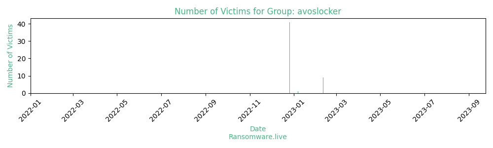

# Profiles for ransomware group : **avoslocker**

> 

_`captcha prevents indexing`_

### External analysis
- https://blog.cyble.com/2021/07/23/deep-dive-analysis-avoslocker-ransomware

- https://blog.malwarebytes.com/threat-intelligence/2021/07/avoslocker-enters-the-ransomware-scene-asks-for-partners

- previous parser: c2VkIC1uIC1lICdzL14uKmFyaWEtaGlkZGVuPSJ0cnVlIj48XC9pPiAvL3AnIHNvdXJjZS9hdm9zbG9ja2VyLSouaHRtbCB8IGN1dCAtZCAiPCIgLWYx

- previous parser: ZWdyZXAgLW8gJ3RpdGxlPSIoW1s6YWxudW06XV18IHxcLikrIicgc291cmNlL2F2b3Nsb2NrZXItKi5odG1sIHwgY3V0IC1kICciJyAtZjI=

🔎 `ransomware.live`has an active  parser for indexing avoslocker's victims

### URLs
| Title | Available | Last visit | fqdn | Screenshot 
|---|---|---|---|---|
| DDOS Protection | 🔴 | 08/07/2023 00:10 | `http://avosqxh72b5ia23dl5fgwcpndkctuzqvh2iefk5imp3pi5gfhel5klad.onion` | <a href="https://images.ransomware.live/screenshots/avosqxh72b5ia23dl5fgwcpndkctuzqvh2iefk5imp3pi5gfhel5klad-onion.png" target=_blank>📸</a> | 
| AvosLocker | 🟢 | 07/08/2023 12:08 | `http://avosjon4pfh3y7ew3jdwz6ofw7lljcxlbk7hcxxmnxlh5kvf2akcqjad.onion` | <a href="https://images.ransomware.live/screenshots/avosjon4pfh3y7ew3jdwz6ofw7lljcxlbk7hcxxmnxlh5kvf2akcqjad-onion.png" target=_blank>📸</a> | 

### Ransom note
* [📝 1 ransom note](notes/avoslocker)

### Crypto wallets
* 💰 <a href="/#/crypto/avoslocker.md">Crypto wallet(s) available</a>

### Total Attacks Over Time

### Posts

> 71 victims found

| post | date | Description | Screenshot | 
|---|---|---|---|
| [`Cambian Group`](https://google.com/search?q=Cambian+Group) | 11/02/2023 | Includes data from Care Tech Holdings PLC (parent holding company, caretech-uk.com) & ByTheBridge.co.uk & Cambian Group. A billion dollar mega-corporation and British orphans, what could go wrong? |   |
| [`Memtech Acoustical`](https://google.com/search?q=Memtech+Acoustical) | 11/02/2023 | Memtech Acoustical is your 'one-stop' source for acoustic services, noise control and acoustic material installation. There is no need to coordinate consultants, order materials and arrange for installation. Memtech does it all. Memtech Acoustical Industrial, Commercial, and Acoustic Noise Control Solutions |   |
| [`Global Mining Products`](https://google.com/search?q=Global+Mining+Products) | 11/02/2023 | Global Mining's Product Catalog is available for download. MINExpo 2012 Please Visit Global Mining Products Inc at MINExpo 2012 Booth No. 9144 Service and Repair Facilities 3 Location To Serve You Better Global Mining - USA Ph: 775-778-3410 Fax: 775-778-3418 Global Mining - Canada Ph: 604-538-0058 Fax: 604-541-2850 PT GloMinPro Indonesia |   |
| [`Buckeye Packaging`](https://google.com/search?q=Buckeye+Packaging) | 11/02/2023 | Buckeye Packaging offers high-quality custom packaging solutions in a variety of substrates, delivered with outstanding customer service and terrible network security. 50 GB customer data will be released |   |
| [`Wesco Turf`](https://google.com/search?q=Wesco+Turf) | 11/02/2023 | Finance, HR, Corporate files present in data leak          We are an exclusive provider for Toro, Club Car, Bernhard, Salsco, Harper, Ventrac, and MCI-Flowtronex and Watertronics Pump Stations in Florida and Southern Georgia. Since 1987 Wesco Turf has been the golf, grounds, and irrigation market leader. We are a worldwide provider of the highest quality used golf course equipment. Wesco has been honored multiple times as Toro’s North American Distributor of Excellence. |   |
| [`CannonDesign`](https://google.com/search?q=CannonDesign) | 11/02/2023 | Employees: 1,100 - Revenue: $279.8M -  Site: www.cannondesign.com     Exfiltrated: 5.7 TB     Wasting our time will result in your data being leaked. Over 5 TB corporate and client files will be released          CEO:           "Entity": "US",           "SSN - US": "367725265",           "Last Name": "Lukanic",           "First Name": "Bradley",           "Nickname": "Brad",           "Street Address": "6619 Braeburn Pkwy",           "City": "Bethesda",           "State/Prov": "MD",           "Zip Code": "20817",           "Birth Date": "02/15/1971",          CFO:           "Entity": "US",           "SSN - US": "078564382",           "Last Name": "Carlino",           "First Name": "David",           "Nickname": "Dave",           "Street Address": "5411 Via Del Sole",           "City": "Williamsville",           "State/Prov": "NY",           "Zip Code": "14221",           "Birth Date": "07/29/1961",          VP:           "Entity": "US",           "SSN - US": "121683252",           "Last Name": "Schopp",           "First Name": "Carolyn",           "Nickname": "Carolyn",           "Street Address": "3621 W River Road",           "City": "Grand Island",           "State/Prov": "NY",           "Zip Code": "14072",           "Birth Date": "10/09/1975", |   |
| [`Schandy`](https://google.com/search?q=Schandy) | 11/02/2023 | We have more than 100GB Data(Employers Data,CVs,Passports,HR,Confidential files...) |   |
| [`Ultralife Corporation`](https://google.com/search?q=Ultralife+Corporation) | 11/02/2023 | Publicly traded stock as ULBI. Client information, design, manufacture, financial, accounting, HR and more.     Address: 2000 Technology Pkwy, Newark, NY 14513, United States     Phone: +1 315 332 7100 |   |
| [`Hamilton Parker`](https://google.com/search?q=Hamilton+Parker) | 11/02/2023 | 1865 LEONARD AVENUE     COLUMBUS, OH 43219     614-358-7800 |   |
| [`Corporate Interiors Inc`](https://google.com/search?q=Corporate+Interiors+Inc) | 07/01/2023 | Corporate Interiors - Steelcase office furniture - Delaware and Philadelphia Contact Us 1-800-690-9101 |   |
| [`LW Group`](https://google.com/search?q=LW+Group) | 26/12/2022 | LW Group now represents eight (8) luxury automobile brands operating at nine (9) locations within the Boston, MA and New Hampshire markets. |   |
| [`Keyano College`](https://google.com/search?q=Keyano+College) | 26/12/2022 | Founded in 1965 and based in Fort McMurray, Canada, Keyano College is a community college meeting both the training and skills acquisition needs of industry.          Headquarters:     8115 Franklin Ave, Fort McMurray, Alberta, T9H 2H7, Canada          Phone Number:     (780) 791-4800 |   |
| [`McKenzie Health System`](https://google.com/search?q=McKenzie+Health+System) | 26/12/2022 | McKenzie Health System (MHS) is a not-for-profit medical and surgical hospital in Sandusky, Mich., with nine clinics in the surrounding region. |   |
| [`Avamere Family of Companies`](https://google.com/search?q=Avamere+Family+of+Companies) | 26/12/2022 | Founded in 1995 and headquartered in Wilsonville, Oregon, Avamere Family of Companies is a group of healthcare organizations and systems. |   |
| [`Yildiz Entegre USA`](https://google.com/search?q=Yildiz+Entegre+USA) | 26/12/2022 | https://www.zoominfo.com/c/yldz-entegre/355492210     https://www.dnb.com/business-directory/company-profiles.yildizlar_yatirim_holding_anonim_sirketi.5db0188dbc06caa3c959161dce6ad867.html     NEWS about ~$200,000,000 investments by Company: Yıldızlar Yatırım Holding. Source: https://www.enkocaeli.com/haber/9845649/yildizlar-yatirim-holdinge-saldiri-iddiasi     We should provide Bank Investigations and refer to The Central Bank of the Republic of Turkey, Federal Reserve etc     List of Holding's affiliated group companies:     1- İstanbul Gübre Sanayi Anonim Şirketi     2- Yıldız Entegre Ağaç San ve Tic AŞ,     3- İGSAŞ Tarımsal Ürünler AŞ,     4- İGSAŞ Sigorta ve Aracılık Hizmetleri AŞ,     5- Yıldız Demir Çelik Sanayi AŞ,     6- YLDZ Laboratuvar Hiz Tic AŞ,     7- Yıldızlar Deniz İşletmeciliği AŞ,     8- YYH Yıldız Enerji Tedarik ve Toptan Satış AŞ,     9- Yıldız Entegre USA INC.,     10- Yıldız Entegre Romania SA,     11- Yıldız Chem SRL,     12- Yıldız Logistica SRL,     13- Yıldız Entegre Russia OOO,     14- Yıldız Entegre Adriya DOO     This leak contains most of Strictly_Confidential files with file extensions: .doc / .xls / .xlsx / .pdf / .msg / etc |   |
| [`CMHA National`](https://google.com/search?q=CMHA+National) | 26/12/2022 | The Canadian Mental Health Association provides mental health services and support. The Association offers advocacy, education, research, and services to person... |   |
| [`Chimbusco`](https://google.com/search?q=Chimbusco) | 26/12/2022 | Established in 1972, CHIMBUSCO has since reformed with two major shareholders namely, PetroChina and COSCO Group engaging in marine fuel supply of bunker oil, marine lubricants and fresh water as well as trading, blending, transportation and storage of oil products. CHIMBUSCO operates over 50 major ports and 30 branch offices in China, with an operational fleet of over 100 barges. |   |
| [`LPA Design`](https://google.com/search?q=LPA+Design) | 26/12/2022 | LPA Design is an electronics R&D consulting company with engineering expertise in printed circuit board design, RF communications and antenna optimization, and remote sensors. LPA Desing developed the PocketWizard™ line of photography products. |   |
| [`Public Employees Credit Union`](https://google.com/search?q=Public+Employees+Credit+Union) | 26/12/2022 | We have confidential files belonging to all 29000 members including Name, Address, SSN, Telephone, Email, Credit Cards, Loan Applications, IRS Documents. Include small sample. |   |
| [`TPI Corporation`](https://google.com/search?q=TPI+Corporation) | 26/12/2022 | Data Stolen: ~1TB of confidential data were NDA-agreemtents, email-bases, private conversations .msg, financial statements, IRS, confidential business information, engineering projects, legal statements, accounting statements etc. We uploaded small size of Stolen data in TPI-Part1.zip archive for public review:     2022-03-31 TPI Financial STMTS.pdf     2021-08-30 IRS CP216F Notice.pdf     2021-03-31 Mutual NDA - Hearn TPIFostoria Corporation v1.0 (Executed).pdf     2021-03-31 Headliner NVH Project.msg     2020-07-10 Mission National Ins. Co, 2020 Distribution.pdf     2020-03-16 Oliver's of Oregon Bankruptcy.pdf     2019-02-22 ProcessHeat - Project Thermo Countersigned CA - TPI.pdf     2019-02-15 TPICorpFostoriaProcessEquipment&CustomPaperTubesouthwest-Mutual Non-disclosure Agreement.msg     2013-04-15 Federal Mogul Mutual Confidentiality Agreement.pdf     2012-12-21 Emitted Energy Corp Mutual Non-Disclosure Agreement.pdf     Peter Wang Contact Info.pdf |   |
| [`CHRISTUS Health`](https://google.com/search?q=CHRISTUS+Health) | 26/12/2022 | Founded in 1999, CHRISTUS Health an international Catholic, faith-based, not-for-profit health system, is headquartered in the Dallas area. |   |
| [`BLUME GLOBAL INC`](https://google.com/search?q=BLUME+GLOBAL+INC) | 26/12/2022 | BLUME GLOBAL INC     BLUME GLOBAL INDIA PRIVATE LTD     BLUME GLOBAL HONG KONG LIMITED     Data Stolen: Proprietary & Confidential, Strictly Confidential NDA agreemtents signed by DocuSign with: J.P. Morgan Securities LLC, Mitsui & Co (mitsui.com) Signatory Mariko Tsuchida(Deputy General Manager), Yara International ASA Signatory Loredana Nistor(IT Sourcing Manager), Dell Inc. Signatory Lisa Woo(Legal Counsel, Legal Strategy and Operations), Hewlett Packard Enterprise Company Signatory Kim Masone(VP Global Logistics Operations), Desarrollo Logístico, S.A., FAIRMOUNT PARTNERS, CITIGROUP GLOBAL MARKETS INC. Signatory Eric Burns(Managing Director), MARLIN MANAGEMENT COMPANY LLC Signatory Ryan Laurin(Managing Director), GI PARTNERS ACQUISITIONS LLC, LiveSource Inc., Röhlig blue-net GmbH, REZ1 Cisco NDA etc + email-bases, private conversations .msg, financial statement etc. We uploaded small size of Stolen data in Blumeglobal_Part1.zip archive. |   |
| [`CPA Mutual Insurance Company`](https://google.com/search?q=CPA+Mutual+Insurance+Company) | 26/12/2022 | Cyber Insurance policy leaked in sample.           At CPA Mutual, our mission is to provide a quality and lasting solution to the professional liability needs of accountants. We bring added value to our member firms by continually striving to exceed their expectations and helping them manage and prevent risks. |   |
| [`Livingston`](https://google.com/search?q=Livingston) | 26/12/2022 | Livingston is a quality source for rental of all Test Equipment and Equipment Management Services with local offices in all major countries. |   |
| [`CR2`](https://google.com/search?q=CR2) | 26/12/2022 | CR2 is an Irish-owned banking software company which provides mobile, internet and ATM financial service technology to more than 100 retail banks across Africa, the Middle East and Asia. Headquartered in Dublin, Ireland, the company has offices in Dubai, London, Cairo, Amman, Bengaluru, Lagos, Johannesburg, Singapore and Perth. Its customers include ANZ, Barclays, Standard Chartered, Botswana Savings Bank, Jordanian Bank al Etihad,pan-African bank Orabank, and Nigeria’s Access Bank plc and Diamond Bank.           500 GB+ Data includes:     - Sources to all products ever developed including BankWorld, BankWorld POS & ATM.     - Financials     - HR documents     - Accounting files     - Sensitive information on more than 100 banks worldwide          Sample includes the compressed 500 MB large file list and a couple random files for proof, shareholders e-mail list, all active directory users with their names, titles, phone numbers, and e-mails. (28.8 MB compressed) |   |
| [`Bechstein`](https://google.com/search?q=Bechstein) | 26/12/2022 | Top quality since 1853: the C. Bechstein name is synonymous with exquisite grand and upright pianos made in Germany. |   |
| [`Montmorency College`](https://google.com/search?q=Montmorency+College) | 26/12/2022 | Cyberattack at Collège Montmorency: ~8TB personal data has been compromised by AVOSLOCKER.     Board of Directors should contact with us immediately to avoid the full leak on our blog.     News and facts about Cyberattack:     https://www.lapresse.ca/actualites/education/2022-05-21/cyberattaque-au-college-montmorency/la-direction-evoque-un-possible-vol-de-donnees-personnelles.php     https://thecanadian.news/cyberattack-at-college-montmorency-personal-data-has-been-compromised/     https://www.academica.ca/top-ten/cyberattacks-strike-coll%C3%A8ge-montmorency-us-institution     https://oicanadian.com/college-montmorency-victim-of-an-alleged-cyberattack/     https://www.spamchronicles.com/college-montmorency-victim-of-a-cyber-attack/     https://actualnewsmagazine.com/english/cyberattack-at-montmorency-college-the-management-evokes-a-possible-theft-of-personal-data/ |   |
| [`Transform Data Into Insight`](https://google.com/search?q=Transform+Data+Into+Insight) | 26/12/2022 | More Than 50GB Important DATA Stolen Will be Publish |   |
| [`Garnica Plywood`](https://google.com/search?q=Garnica+Plywood) | 26/12/2022 | WILL LEAK ALL DATA SEPTEMBER 1, SAMPLE INCLUDE CONTACT     At Garnica, we offer a wide range of plantation species; we boast different kinds of wood for construction, mobility, furniture, DIY projects and much more. Discover them here. Architecture and materials 21-07-2022 How is plywood manufactured step by step Our commitment to excellence in the plywood production process is reflected in each step. |   |
| [`Casa International`](https://google.com/search?q=Casa+International) | 26/12/2022 | European furniture retailer operating in multiple countries |   |
| [`WBSCHOOLS`](https://google.com/search?q=WBSCHOOLS) | 26/12/2022 | Employee info leak |   |
| [`Los Alamos Nature Center`](https://google.com/search?q=Los+Alamos+Nature+Center) | 26/12/2022 | As a financial cooperative, Los Alamos Schools Credit Union provides financial products and services to members featuring more attractive rates and...     All data will be leaked in the next post update. |   |
| [`Mount Vernon Mills`](https://google.com/search?q=Mount+Vernon+Mills) | 26/12/2022 | stablished in 1947 and headquartered in Mauldin, South Carolina, Mount Vernon Mills is a textiles manufacturer, producing chemicals, textiles, and... |   |
| [`Khoemacau Copper Mining`](https://google.com/search?q=Khoemacau+Copper+Mining) | 26/12/2022 | ALL Active Directory domain hashes leaked!!! Format:     kcm.local\tshiamo.molefe:::13506d75610047a00e0b7692e81f70b2:::     kcm.local\mpho.losike:::923a3103e0e13ab8014c9a8354c6337f:::     kcm.local\roy.basson:::27f0e2227d44e6b2ac122c25350efd4c:::     kcm.local\marius.ungerer:::ba1a5281df2eba76948e8c68aaa9211c:::     kcm.local\helga.hugo:::c67c2209034b9537cc07083d842e9f65:::     kcm.local\FortiEMS-svc:::975020171cada4be8e8fb655fcf49e4f:::     kcm.local\tobokani.mosetlha:::0f9437d2c04e53cf4930a1b7cd50659a:::     kcm.local\nikiwe.mahlasela:::83bcee313b6b3bb5d5cd1434128c92e6:::     kcm.local\mooketsi.rantape:::e9923a513a6ee1fb4e08251da13993b2:::     kcm.local\kuairani.hengari:::3ff04097c34204839ec416b3c1399b8b:::          The Khoemacau copper project is an underground mine being developed by American private equity firm Cupric Canyon Capital's subsidiary Khoemacau Copper Mining in Botswana. Khoemacau Copper signed a $565m project funding package deal with Cupric Canyon Capital for the development of the high-grade Khoemacau copper project in February 2019. |   |
| [`The Brigantine`](https://google.com/search?q=The+Brigantine) | 26/12/2022 | The Brigantine Restaurants are a San Diego favorite for fresh seafood, steaks and chops, friendly and knowledgeable services, and inviting facilities. |   |
| [`SCAD EDU`](https://google.com/search?q=SCAD+EDU) | 26/12/2022 | 1 database, filelist, all email/phone leaked in sample! Everything leak in 2 week     Savannah College of Art and Design (SCAD) is a private nonprofit art school with locations in Savannah, Georgia; Atlanta, Georgia; and Lacoste, France.          Founded in 1978 to provide degrees in programs not yet offered in the southeast of the United States, the university now operates two locations in Georgia, a degree-granting online education program, and a study abroad location in Lacoste, France. The university enrolls more than 14,000 students from across the United States and around the world with international students comprising up to 17 percent of the student population.[3] SCAD is accredited by the Southern Association of Colleges and Schools Commission on Colleges and other professional accrediting bodies. |   |
| [`Truckslogic`](https://google.com/search?q=Truckslogic) | 26/12/2022 | Documents include Legal, Financials, passports, licenses          Truckslogic Optimiza la logística de tu empresa. Queremos hacer tu vida y la de tu empresa más fácil, ofrecemos un servicio personalizado, flexible y con la experiencia de más de 15 años en el mercado.          Colombia     Carrera 12A #78-35, Piso 2, Bogotá.          República Dominicana     Calle Euclides Morillo 58, Diamond Mall - Local 81. Santo Domingo          Guatemala     Calzada Roosevelt 51-25, Ciudad de Guatemala. CP: 01057          Panamá     International Business Park Edificio 3825. local 107, planta baja Panamá Pacífico |   |
| [`TeladanPrima Argo Group`](https://google.com/search?q=TeladanPrima+Argo+Group) | 26/12/2022 | 750GB+ of stolen data include contracts, confidential , intellectual property data, and more |   |
| [`Sunland Asphalt And Construction`](https://google.com/search?q=Sunland+Asphalt+And+Construction) | 26/12/2022 | Human Resources, Projects, Documents, and more. If Sunland Asphalt refuses to pay the ransom, every data will be published to the public. |   |
| [`Stratford University`](https://google.com/search?q=Stratford+University) | 26/12/2022 | samples of:          Confidential agreements      Military personnel (white house service members) related files     taxation data |   |
| [`Xybion`](https://google.com/search?q=Xybion) | 26/12/2022 | Xybion's Emidence TM platform satisfies our current and evolving future needs with the unique adoption technique of "Your Process - Your Way", Joseph F. Molloy Vice President, Workforce Safety. We wanted to go paperless without impacting our existing business processes. It was a smooth transition for our users thanks to Labwise XD. |   |
| [`Our Lady of Lake University`](https://google.com/search?q=Our+Lady+of+Lake+University) | 26/12/2022 | Our Lady of the Lake University, founded in 1895 by the Congregation of Divine Providence, is a coeducational institution.     - DB     - Health     - Finance     - Admissions     - IT     - HR     And many of more... |   |
| [`Paul Smiths College`](https://google.com/search?q=Paul+Smiths+College) | 26/12/2022 | At Paul Smith's College, it's about the experience. We are the only four-year institution offering broad-based higher education in the Adirondacks. Our programs... |   |
| [`Northwest University`](https://google.com/search?q=Northwest+University) | 26/12/2022 | Confidential, taxation, and financial data |   |
| [`Emtec Inc`](https://google.com/search?q=Emtec+Inc) | 26/12/2022 | Global IT company with terrible IT security. How can Emtec secure clients when they don't secure their own network?          MISRA SUNIL SSN:050-66-2655 Email:Sunil.Misra@emtecinc.com     JOHNSON	RICK SSN:252-33-1704 Email:Rick.Johnson@emtecinc.com     DESAI DINESH SSN:516-74-2061 Email:Dinesh.Desai@emtecinc.com     CHANDLER GREGORY SSN:220-02-8854 Email:Gregory.Chandler@emtecinc.com     BALLINGER VICKI SSN:208-46-9296 Email:Vicki.Ballinger@emtecinc.com |   |
| [`American International Industry`](https://google.com/search?q=American+International+Industry) | 26/12/2022 | The leading manufacturer and distributor of innovative, quality beauty and skin care products for men and women. With 45 years of industry experience.The leading manufacturer and distributor of innovative, quality beauty and skin care products for men and women. With 45 years of industry experience. |   |
| [`Zeus Scientific Inc`](https://google.com/search?q=Zeus+Scientific+Inc) | 26/12/2022 | https://www.zeusscientific.com/about Zeus Scientific, Inc. manufactures clinical diagnostic solutions. The Company offers flexible solutions for autoimmune and infectious disease testing. AvosLocker team publishes the first part of exfiltrated files from Zeus Scientific Servers, NDA contracts etc |   |
| [`Hughes Systems Industrial`](https://google.com/search?q=Hughes+Systems+Industrial) | 26/12/2022 | All company projects includes drawings, contracts, and all details     employees social security number 401K plans     company financial data includes bank accounts information, and taxation reports      and more |   |
| [`DLS Motors`](https://google.com/search?q=DLS+Motors) | 26/12/2022 | We downloaded 50GB of internal files from DLS Motors. -- Just 83 years ago, the company Sobera S.A. entered the Paraguayan market, bringing new business opportunities, new projects, new sources of employment and contributing to the sustained economic growth of our country. |   |
| [`Cosmopoint College`](https://google.com/search?q=Cosmopoint+College) | 26/12/2022 | We downloaded about 80 gigabytes of internal school documents, including teacher and student contact information, student loan contracts, internal school financial documents, etc |   |
| [`ALVAC SA`](https://google.com/search?q=ALVAC+SA) | 26/12/2022 | Website - https://alvac.es     Company name: ALVAC S.A.     Companies System Administrator trying to hide the cyberattack on the ALVAC S.A. servers. Vídeos confidenciales https://vimeo.com/752214614     AvosLocker team is ready to leak more files on the blog, publish video-files and attack networks again. We should agree with you to decrypt your networks and remove all ALVAC S.A. exfiltrated files from AvosLocker team servers.     https://twitter.com/PedroFe12181764/status/1575117531957846017     https://twitter.com/search?q=%40alvac&src=typed_query&f=live |   |
| [`Memory Express`](https://google.com/search?q=Memory+Express) | 26/09/2021 |   |   |
| [`Huali Industrial Group`](https://google.com/search?q=Huali+Industrial+Group) | 25/09/2021 |   |   |
| [`Whitefish River First Nation`](https://google.com/search?q=Whitefish+River+First+Nation) | 25/09/2021 |   |   |
| [`Unified Technologies`](https://google.com/search?q=Unified+Technologies) | 25/09/2021 |   |   |
| [`Amphenol Canada`](https://google.com/search?q=Amphenol+Canada) | 25/09/2021 |   |   |
| [`Pacific City Bank`](https://google.com/search?q=Pacific+City+Bank) | 04/09/2021 |   |   |
| [`Moorfields NHS UK & Dubai`](https://google.com/search?q=Moorfields+NHS+UK+%26+Dubai) | 01/09/2021 |   |   |
| [`Potter Concrete`](https://google.com/search?q=Potter+Concrete) | 01/09/2021 |   |   |
| [`Master Chemical`](https://google.com/search?q=Master+Chemical) | 29/08/2021 |   |   |
| [`Artas Holding / Artas Insaat`](https://google.com/search?q=Artas+Holding+%2F+Artas+Insaat) | 28/08/2021 |   |   |
| [`Coghlin Electrical Contractors`](https://google.com/search?q=Coghlin+Electrical+Contractors) | 28/08/2021 |   |   |
| [`Home in Brussels`](https://google.com/search?q=Home+in+Brussels) | 28/08/2021 |   |   |
| [`On logistics Services Algeciras, S.L`](https://google.com/search?q=On+logistics+Services+Algeciras%2C+S.L) | 28/08/2021 |   |   |
| [`Gimmler Gruppe`](https://google.com/search?q=Gimmler+Gruppe) | 19/08/2021 |   |   |
| [`SoftwareDesign Consulting Group`](https://google.com/search?q=SoftwareDesign+Consulting+Group) | 19/08/2021 |   |   |
| [`Mauck & Baker`](https://google.com/search?q=Mauck+%26+Baker) | 05/08/2021 |   |   |
| [`Geneva, Ohio`](https://google.com/search?q=Geneva%2C+Ohio) | 18/06/2021 |   |   |
| [`Heller Injury Lawyers`](https://google.com/search?q=Heller+Injury+Lawyers) | 13/06/2021 |   |   |
| [`Arabian Cargo Group`](https://google.com/search?q=Arabian+Cargo+Group) | 13/06/2021 |   |   |
| [`AvosLocker is officially online!`](https://google.com/search?q=AvosLocker+is+officially+online%21) | 01/01/2021 |   |   |

Last update : _Monday 07/08/2023 12.13 (UTC)_
