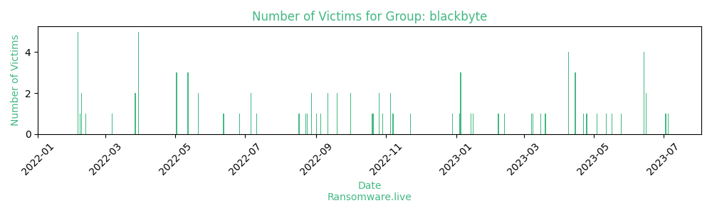

# Profiles for ransomware group : **blackbyte**

> Ransomware. Uses dropper written in JavaScript to deploy a .NET payload.

### External analysis
- https://blog.cluster25.duskrise.com/2023/05/22/back-in-black-blackbyte-nt

- https://blog.talosintelligence.com/2022/05/the-blackbyte-ransomware-group-is.html

- https://de.darktrace.com/blog/detecting-the-unknown-revealing-uncategorised-ransomware-using-darktrace

- https://media.kasperskycontenthub.com/wp-content/uploads/sites/43/2022/06/23093553/Common-TTPs-of-the-modern-ransomware_low-res.pdf

- https://news.sophos.com/en-us/2022/10/04/blackbyte-ransomware-returns/

- https://redcanary.com/blog/blackbyte-ransomware/

- https://research.nccgroup.com/2022/07/13/climbing-mount-everest-black-byte-bytes-back/

- https://securelist.com/modern-ransomware-groups-ttps/106824/

- https://therecord.media/san-francisco-49ers-confirm-ransomware-attack/

- https://twitter.com/splinter_code/status/1628057204954652674

🔎 `ransomware.live`has an active  parser for indexing blackbyte's victims

### URLs
| Title | Available | Last visit | fqdn | Screenshot 
|---|---|---|---|---|
| none | 🔴 | 01/05/2021 00:00 | `http://6iaj3efye3q62xjgfxyegrufhewxew7yt4scxjd45tlfafyja6q4ctqd.onion` | ❌ | 
| BlackByte BLOG | 🔴 | 30/12/2021 09:14 | `http://f5uzduboq4fa2xkjloprmctk7ve3dm46ff7aniis66cbekakvksxgeqd.onion` | ❌ | 
| BlackByte BLOG | 🔴 | 28/03/2022 11:17 | `http://dlyo7r3n4qy5fzv4645nddjwarj7wjdd6wzckomcyc7akskkxp4glcad.onion` | ❌ | 
| BlackByte BLOG | 🔴 | 24/04/2022 20:21 | `http://fl3xpz5bmgzxy4fmebhgsbycgnz24uosp3u4g33oiln627qq3gyw37ad.onion` | ❌ | 
| BlackByte BLOG | 🔴 | 12/07/2022 20:09 | `http://ce6roic2ykdjunyzazsxmjpz5wsar4pflpoqzntyww5c2eskcp7dq4yd.onion` | ❌ | 
| BB Auction | 🟢 | 24/09/2023 13:42 | `http://jbeg2dct2zhku6c2vwnpxtm2psnjo2xnqvvpoiiwr5hxnc6wrp3uhnad.onion` | <a href="https://images.ransomware.live/screenshots/jbeg2dct2zhku6c2vwnpxtm2psnjo2xnqvvpoiiwr5hxnc6wrp3uhnad-onion.png" target=_blank>📸</a> | 

### Ransom note
* [📝 4 ransom notes](notes/blackbyte)

### Total Attacks Over Time

### Victims

> 130 victims found

| victim | date | Description | Screenshot | 
|---|---|---|---|
| [`Hoteles Xcaret`](https://www.xcaret.com/) | 18/09/2023 | Hoteles Xcaret offers the best lodging experiences in Riviera Maya. Our hotels have been designed to satisfy and exceed the demands of different kinds of travelers, from parents wishing to surprise their kids with the best family vacations, to private and sustainable experiences collectors who wish for an incredible journey as a couple. |   |
| [`Alps Alpine`](https://www.alpsalpine.com/) | 11/09/2023 | Alps Alpine, a leading manufacturer of electronic components and automotive infotainment systems, has brought the world numerous “First 1” and “Number 1” products since its founding in 1948. The Alps Alpine Group currently operates 110 bases in 26 countries and regions, supplying roughly 40,000 different products and solutions to around 2,000 companies worldwide. In January 2019, Alps Electric Co., Ltd. and Alpine Electronics, Inc. integrated their businesses to embark on a new era as Alps Alpine Co., Ltd. Serving a diverse range of markets encompassing an automotive industry currently undergoing major transformation, the mobile and consumer electronics domains, through to energy, healthcare and industry markets, Alps Alpine will combine and build on core device technology established over many years in three areas – human-machine interfaces, SENSORING™ and connectivity – along with system design and software development capabilities to innovate value that brings comfort to and enriches the lives of people everywhere. |   |
| [`Kirby Risk`](https://www.kirbyrisk.com/) | 09/09/2023 | Since 1926, Kirby Risk has remained committed to the concept of sacrificial service by going above and beyond what it takes to provide you with the right products and services at the right time, to the right place, at the right cost—working hard every day to MAKE IT HAPPEN!Today, Kirby Risk is still known by our customers as a dependable resource dedicated to solving their problems with the more than 40 locations throughout Indiana, Illinois, Ohio and Georgia. Our skilled and experienced team members are available around the clock to meet your electrical product and service needs. We represent over 2,000 manufacturers and carry more than 90,000 top-quality products. |   |
| [`FOCUS Business Solutions`](https://focus-solutions.net/) | 07/09/2023 | FOCUS was founded in 1998 with the simple vision of delivering great cost savings and compliance services to importers and exporters at a fair price. Clients engage us to manage their compliance and duty savings programs within their limited budgets. Being highly responsive and flexible to meet the unique business and compliance needs of each of our clients is why clients have stayed with us for 25 years. We deliver the highest quality customs management and compliance services to our clients. |   |
| [`Chambersburg Area School District`](https://www.casdonline.org/) | 07/09/2023 | The Chambersburg Area School District covers 250 square miles in Franklin County, Pennsylvania, near the center of the Cumberland Valley. More than 61,000 people live in the district, which is composed of the Borough of Chambersburg, Greene, Hamilton, Letterkenny, and Lurgan townships, and most of Guilford Township. The Chambersburg Area School District has a rich and important history. We are fortunate to have almost 10,000 students of many different backgrounds and nations of origin. Just in the past several years, our English Language Learners have increased from approximately 500 to 1000 students or 10% of our student population. |   |
| [`Smead`](https://www.smead.com/) | 06/09/2023 | Smead Manufacturing keeps its customers' offices organized. Accordingly, the company makes more than 5,000 paper filing products that are sold in office supply stores nationwide. Smead's product assortment includes folders (hanging, tabbed, and expandable), labels, fasteners, and binder and report covers. The firm also supplies open and secure shelving systems.The company was founded in 1906 by Charles Smead. After the founder's death, Smead Manufacturing was purchased by employee P. A. Hoffman, whose granddaughter, Sharon Hoffman Avent, is president and CEO today. |   |
| [`Ontellus`](https://www.ontellus.com/) | 24/08/2023 | Established in 1975, and rebranded in 2017 Ontellus provides internet-based record retrieving and billing services. Their headquarters are located in Houston, Texas |   |
| [`Avalign Technologies`](https://www.avalign.com/) | 05/07/2023 | valign designs, manufactures, and delivers the highest quality, precision-machined tools and implants for a wide variety of surgical and medical specialties around the world. From proprietary implant coatings to German-made instruments, Avalign is a leading full-service manufacturer known for consistent and sophisticated production and supply chain management. |   |
| [`Brett Martin`](https://www.brettmartin.com/) | 03/07/2023 | Established in 1958, Brett Martin is a global player supplying specialist plastic products for the construction, fabrication, and, print and display sectors worldwide. The company’s product portfolio includes an impressive range of plastic sheets, factory engineered rooflight systems, and, plumbing and drainage systems. |   |
| [`Kisco Senior Living`](https://www.kiscoseniorliving.com/) | 16/06/2023 | Kisco Senior Living was founded in 1990. This company provides elderly care services in the form of assisted and independent community living. |   |
| [`Multistack`](https://www.multistack.com/) | 16/06/2023 | At Multistack, we recognize and respect the importance of providing HVAC solutions that promote energy and water efficiency, utilize the best refrigerant choices available, and embrace the transition from fossil fuels to electrification.Water and air-cooled MagLev® chiller platforms achieve superb efficiency across their full range of operation. Our unique MagLev chiller design and unrivalled Transitional Efficiency? chiller control algorithms deliver outstanding part-load performance at all condenser-water or ambient temperature conditions.  MagLev also offers refrigerant choices recognized worldwide safer for the environment: R1234ze, R-513, and R515B.Our modular product’s design allows you the freedom to use just enough energy to meet your current needs, while offering you the flexibility of incorporating additional modules as your operations grow. Minimizing embodied energy is an important design focus and we pride ourselves that our modular chillers deliver the industry’s highest cooling and heating output per pound. If you’re looking to cool and heat your building with as little environmental impact as possible, look no further than Multistack! |   |
| [`NEBRASKALAND`](https://www.nebraskaland.com/) | 14/06/2023 | Nebraskaland, Inc. distributes and sells seafood and meat products to customers in New York metro area. It provides boxed beef, chicken, pork, lamb, veal, and various meats, as well as a range of frozen and processed foods. |   |
| [`The Texwipe`](https://www.texwipe.com/) | 14/06/2023 | Founded in 1964, Texwipe is a company that specializes in manufacturing cleanroom products. The company is headquartered in Kernersville, North Carolina. |   |
| [`YAMAHA CORPORATION OF AMERICA`](https://usa.yamaha.com) | 14/06/2023 | Yamaha Corporation of America manufactures a complete line of musical instruments, professional audio products, customer-driven support products and computer based products targeted to both the amateur and professional markets. |   |
| [`Fiege Sp. z o.o.`](https://global.fiege.com/nl/country/poland/) | 14/06/2023 | Fiege Sp. z o.o. is a company based in Poland, with its head office in Warsaw. The enterprise operates in the Other Support Activities for Transportation industry. The company was established on January 10, 2002. It currently has a total number of 798 (2017) employees. |   |
| [`City of Augusta`](https://www.augustaga.gov/) | 25/05/2023 | The City of Augusta, GA, headquartered in Augusta, and established in 1736, is a consolidated city-county located on the central-eastern border of the state of Georgia within the Fall Line section. The city lies across the Savannah River from South Carolina |   |
| [`Magic-Aire`](https://www.magicaire.com/) | 17/05/2023 | Magic Aire is an independent Manufacturer of Heating, Ventilation and Air Conditioning (HVAC) components, fan coils, air handlers and unit ventilators. Our Company sets the industry benchmarks for on-time delivery, ease of doing business and lowest warranty rates. |   |
| [`Sterling Solutions`](https://www.sterlingsolutions.co.uk/) | 12/05/2023 | We are Sterling, a full service creative and production agency, who think about things a little differently.We have 25 years of experience creating complete and compelling communications, brand and marketing solutions from under one roof. By offering each touch-point of excellence in-house, as part of a truly integrated creative and production service, we can offer not only quality and value, but also speed, innovation and cost savings that most other providers can’t.So, whatever you need, even if you’re not sure what that is, we’re here to help.We help bring our clients’ brands, visions and aspirations to life. |   |
| [`PRESS-SERVICE Monitoring Mediów`](https://psmm.pl/) | 04/05/2023 | PRESS-SERVICE Monitoring Mediów is a company that operates in the Security and Investigations industry. It employs 101-250 people and has 25M-50M of revenue. The company is headquartered in Warsaw, Masovian Voivodeship, Poland. |   |
| [`Dacotah Paper`](https://www.dacotahpaper.com/) | 25/04/2023 | Dacotah Paper Co., doing business as Range Paper Bemidji Paper & Janitorial Supply, operates as a wholesale distributor of foodservice disposables, glassware products, janitorial/sanitary maintenance products, lighting/electrical products, office supplies. |   |
| [`Easy Automation`](https://www.easy-automation.com/) | 22/04/2023 | Easy Automation Inc. (EAI) based in Welcome, Minnesota, specializes in serving the feed automation needs of commercial and farm customers. EAI designs, manufactures, and markets computerized mill automation systems, feed manufacturing equipment. |   |
| [`Esperanza Viva Jóvenes de México`](https://www.evmexico.org/) | 15/04/2023 | Esperanza Viva Jóvenes de México is a company that operates in the Civic & Social Organization industry. It employs 11-20 people and has 5M-10M of revenue. |   |
| [`Gulliver International`](https://www.glv.co.jp/) | 15/04/2023 | Gulliver International is a Japan-based company that operates in three business segments. The Pre-owned Car Sale segment purchases pre-owned cars from general customers and sells purchased cars to corporate clients though auctions around Japan and GAO. |   |
| [`Saobacdau Technologies Group`](https://www.saobacdau.vn/) | 15/04/2023 | S-IMS specialized in providing solutions or data integration. SaoBacDau Group acquired 99 % of Netpro Co., Ltd. To expand business operations into IT training and testing. |   |
| [`Creation Baumann`](https://www.creationbaumann.com/) | 09/04/2023 | Through years of growth and change, one thing has always remained: our passion for fabrics. Création Baumann is an independent family-run business focusing on long-term objectives. We treasure our independence and leverage it to create more value for our customers |   |
| [`Crown Grinding & Machining`](https://www.crowngrinding.com/) | 09/04/2023 | Crown Grinding and Machining has been providing quality material and service since 1999. Our modern facility and experienced operators are capable of meeting your custom steel needs. We specialize in surface grinding and milling as well as steel supply. |   |
| [`Cementos Bio-Bio`](https://www.cbb.cl/) | 09/04/2023 | Cementos Bio Bio S.A. manufactures and sells cement in Chile and internationally. It provides clinker, pozzolana, gypsum, pozzolanic portland, and other cement; and concrete products for housing, buildings, pavement, infrastructure, and mining projects. |   |
| [`City of Collegedale`](https://www.collegedaletn.gov/) | 09/04/2023 | With a 2020 population of over 11,000 Collegedale is situated in eastern Hamilton County 15 minutes east of downtown Chattanooga, along the Interstate 75 corridor. Located adjacent to the Enterprise South Industrial mega site, the city lies at the center of a larger five-mile trade area that encompasses nearly 30,000 households. Between 2000 and 2010, the city’s population grew 27%, making Collegedale the fastest growing municipality in Hamilton County. |   |
| [`Kelly Group`](https://www.kelly.co.uk/) | 20/03/2023 | Kelly Group has been at the forefront of the telecommunications industry for more than 35 years, installing the very first customer cable television service on 17th September 1985.Established to support the emerging UK cable television market, Kelly Group has grown and diversified to meet the needs of our clients and their customers. |   |
| [`Etex Communications`](https://www.etex.net/) | 16/03/2023 | The Company’s rich heritage and continued desire to bring the very best communications services and technology to subscribers is evidenced by the evolutions of the network from open wire strung along fence posts and outhouses to the digital fiber optic network in place today.Etex Telephone Cooperative boasts a service territory of 710 square miles of rural East Texas. Customers within this service area are given the opportunity to purchase local, long distance, digital TV and internet (dial-up and DSL) services at rates comparable to those found in urban areas around the state. Deployment of fiber in the loop further enhances our ability to offer other broadband services. |   |
| [`Falcon Holdings`](https://www.falconholdings.com/) | 09/03/2023 | Falcon created the management company of professionals to provide operational expertise and administrative services to a wide range of companies. It serves clients with a level of commitment that is first class in the industry. Implementation of many programs in the company are designed to promote a diverse work force and helping employees excel. Khan is a true example of someone who has taken advantage of the opportunities available and created value to the clients, employees and investors. |   |
| [`Wagner CAT`](https://wagnerequipment.com/) | 08/03/2023 | Since 1976, Wagner has been selling and renting quality Cat machines used in heavy construction, building construction, mining, waste handling, paving, municipal and governmental applications, forestry and more. |   |
| [`Inland Group`](https://inlandgroup.aero/) | 12/02/2023 | The Inland Group of Companies is a multi-national collective of premier aviation services providers. Each company is highly specialized in their field of expertise with proven track records of providing safe, efficient, and cost-effective aviation services.Integrated Deicing Services (IDS)Aircraft Deicing and Anti-icing Services.Inland Technologies International/Canada (Inland)Aviation Environmental Services.Quantem Aviation Services (QAS)Ground Handling and Terminal Services. |   |
| [`Penn Power Group`](https://pennpowergroup.com/) | 07/02/2023 | Our ServicesLeveraging our OEM expertise and 50+ years of experience, we provide comprehensive fleet services at our 13 service centers and 100 mobile vehicles that come to you.  From traditional shop services and maintenance management to mobile fleet services and emergency roadside assistance, we handle it all. |   |
| [`ARC`](https://www.e-arc.com/) | 16/01/2023 | ARC is committed to delighting its customers with document imaging and graphic production services that help visual communication professionals do what they do best.We provide world-class service to more than 90,000 customers, including some of the biggest brands in the world. Our people work side-by-side with professionals from the most renowned companies in Hollywood, prestigious and demanding retail outlets, as well as facility managers of some of the biggest school districts in the country who use visual communication to educate their students and staff on health and safety in public areas.No matter where you look, you’ll find us striving for excellence in design and construction, education, healthcare, marketing, manufacturing, technology, sports, and hospitality. |   |
| [`K2 Sports`](https://k2sports.com/) | 14/01/2023 | About K2 Sports: Our mission is to create the most innovative tools for our consumers to provide the best experiences, push the sports, and strengthen the culture. K2 was born in 1962 as America’s ski company on Vashon Island in Washington State’s Puget Sound. Renamed in 2003 as K2 Sports and now based in Seattle, the company today is an international portfolio of world-renowned brands recognized as leaders in the innovation, marketing, and quality of our products and services. Driven by a passion for our sports and enthusiasts, we make alpine skis, snowboards, snowshoes, in-line skates, and Nordic ski equipment, apparel, and accessories. |   |
| [`Ellison Technologies`](https://www.ellisontechnologies.com/) | 05/01/2023 | Ellison Technologies is a provider of advanced machining solutions to North American metal-cutting manufacturers and their global affiliates.As a family of companies we are committed to the survival and growth of the American manufacturing industry.  Independent offices provide us a local market focus and the flexibility to advocate the needs of each of our valued customers.Our priority is to introduce technologies that strengthen our customers’ ability to compete in the markets they serve.  Whether the solution involves a stand alone machine, multi-process equipment, or an integrated manufacturing system with robotic automation, our goal remains the same; to optimize throughput and quality at the lowest per-part manufacturing cost. |   |
| [`Hayward`](https://www.hayward-pool.com/) | 05/01/2023 | Come on in... The water is Hayward.At Hayward®, we're more than just equipment. Our objective is to make your pool experience worry and hassle-free. That's why our equipment is engineered to last and work smart at keeping your pool sparkling clean and trouble free.For over 80-years, we've been helping pool owners enjoy the pleasures of pool ownership by manufacturing cutting edge, technologically advanced pool equipment worldwide. We strive to ensure that your Totally Hayward™ System operates at maximum efficiency all season long. Our goal is that at the end of the day, your only concern is to turn your equipment on and off. Whether you are trying to create the perfect backyard environment, reduce operating and maintenance costs through the ease of wireless controls, Hayward is your single source solution. Our products include a complete line of technologically advanced pumps, filters, heaters, heat pumps, automatic pool cleaners, lighting, controls and salt chlorine generators—high-quality components engineered to work together to keep your pool at its best.Hayward aims to take the worry out of pool ownership by developing products that are efficient, require little maintenance and add value to your investment. |   |
| [`Kansas City Homes`](https://kansascityhomes.com/) | 05/01/2023 | From our earliest days in Kansas City, we have remained brokerage leaders in the real estate industry by developing relationships with our clients and our communities. The Better Homes and Gardens® Real Estate brand was built upon a passion for the home. Sellers benefit from this well-known brand through the exposure generated by millions of home searches online and the inherent trust of the iconic brand. |   |
| [`CAPMC`](https://maderacap.org/) | 04/01/2023 | Community Action Partnership of Madera County (CAPMC). Since it was incorporated in 1965, CAPMC has been making a positive difference in our county. CAPMC is committed to improving the social well-being and economic capacity of low to moderate-income individuals and families, as well as providing opportunities to achieve economic independence. |   |
| [`CPTM`](http://www.cptm.sp.gov.br/) | 29/12/2022 | The São Paulo Metropolitan Train Company is a commuter rail system owned by the Secretariat of Urban Transportation of the State of São Paulo. It was created in 1992 with the merger of several railways in Greater São Paulo, Brazil. |   |
| [`lapiamontesa`](https://lapiamontesa.com/) | 22/11/2022 | n a property greater than 39,000 square meters, with more than 21,000 square meters of covered facilities and with a staff that exceeds 600 employees and another 250 indirect collaborators, throughout the country, La Piamontesa SA is a of the industries that occupies the ranking of the first leading companies in the sector of cold meats in Argentina.In its modern facilities in the town of Brinkmann - San Justo Department, Córdoba province, more than 18,000 tons of pork are processed annually, reaching an annual production of more than 24,000 tons of finished product.The main activity of La Piamontesa SA is the production of cold cuts, sausages and the like, fulfilling the integral production cycle that includes: |   |
| [`ALTEK`](https://google.com/search?q=ALTEK) | 07/11/2022 |   |   |
| [`PETERSON & HANSON`](https://www.phbygg.se/) | 05/11/2022 | WE ARE PETERSON & HANSON BYGGNADS ABWith environment, competence and well-being at the top of the agenda, we perform construction services in Halland and the surrounding area for satisfied and returning customers.We have been in the industry since 1963 and are one of Halland's largest construction companies. |   |
| [`Broto Legal`](https://brotolegal.com.br/) | 05/11/2022 | Broto Legal was founded in the 1970s and engages in the commercialization of rice, beans, potatoes, onions and corn for the region of Campinas, Brazil. |   |
| [`Asahi Group`](https://www.asahigroup.com.hk/) | 29/10/2022 | Asahi Group Company Limited was founded in the 1970s in Hong Kong. For more than 40 years, we have worked hand in hand with our partners and have built a reputation for not only meeting their requirements, but also exceeding their expectations. Being family-owned allows us to enjoy a high degree of flexibility and provide customized services and innovative solutions to our partners.Our work at the Asahi Group is fueled by a competitive spirit and the active innovative genes that reside in every team member. As our founder always said, “We are manufacturing for the future.”Asahi Group leverages its capabilities to stay at the cutting-edge of the industry. Our dedicated engineering and research team continuously develops new technologies and solutions, with an aim to manufacture the unmanufactured in a cost-effective way. That is why we had started with precision metal manufacturing and later expanded to total metal solutions which includes both functional and cosmetic metal solutions. |   |
| [`CCLint`](https://www.cclint.com/) | 26/10/2022 | Welcome to CCL. Our reputation has been built by providing the ideal solution for every project we undertake, using specialised engineering techniques, wherever we are in the world.Backed by over 80 years of experience, and sites on five continents, our expertise has helped create iconic construction projects across the globe. CCL’s customers know they can trust our experts to deliver innovation and quality, with attention to detail and an eye for the bigger picture. |   |
| [`Municipio de Chihuahua`](https://www.municipiochihuahua.gob.mx/) | 26/10/2022 | The Municipality of Chihuahua is a local government in the northern Mexican state of Chihuahua that looks to serve the local community |   |
| [`UNE`](https://www.une.edu.pe/) | 21/10/2022 | History of the UNEThe history of the National University of Education dates back to July 6, 1822, when the Liberator Don José de San Martín, by Supreme Decree, created the first Normal School for Preceptors, a date that gave rise to the celebration of Teacher's Day.Officially inaugurated two months later, it began its fruitful and eventful life as a forger of tutors for the first years of independent Peru. Its first Director was the English citizen Diego Thompson, who introduced the educational model called the Lancasterian System in the preparation of teachers. According to this system, the most advanced students became monitors and contributed through practice in the classroom to the best training of their classmates. |   |
| [`Pitman Family Farms`](https://pitmanfarms.com/) | 20/10/2022 | Mary’s Free Range Chickens is proud to be family owned and operated since 1954.  Mary's sons, David and Ben Pitman, are third-generation Pitman farmers who lead the company today. David and Ben have been taught by their father, Rick, who learned from his father, Don, about the importance of animal husbandry and our responsibility to ensure the welfare of animals |   |
| [`Swiss American`](https://swissam.net/) | 01/10/2022 | Cheese engages all the senses. We believe that an amazing specialty food deserves an equally compelling label. Swiss American educates the public on the unique conditions that make the world’s best cheeses, starting with in-store packaging, informative displays, and engaging promotions. From private label to control brands, our artists bring their passion for cheese to everything we create; inviting hungry people everywhere to join us in the world of specialty cheeses. |   |
| [`Almoayed ICT`](http://almoayedgroup.com/) | 01/10/2022 | Almoayed ICT is an Information Technology (IT) and Telecommunications (Telecom) solution provider, headquartered in the Kingdom of Bahrain. We are committed towards providing the highest quality of services and solutions to our clients and have Sales & Support offices throughout the Middle East and Africa. We are strengthening our existing core competencies as well as investing in the development of new capabilities to meet new requirements. We are investing heavily in our employees, internal processes and business systems so that we can be better prepared to serve our customers needs.Almoayed Group was established in 1982 by Mr. Nabeel Almoayed with the following vision in mind:To become a truly global IT and Telecommunications Solutions Provider - committed to best value services and solutions. This vision has come to be the sole objective of the Group, with associate of the Group working towards the goal to provide better products, efficient solutions flawless support to their respective customers |   |
| [`Biggest News`](https://www.newvision.co.ug/) | 19/09/2022 | Biggest News Source for News in Uganda and the East African Region ,Breaking news in Uganda and Daily news and the latest from Uganda |   |
| [`South Pacific Inc`](https://southpacificinc.ph/) | 19/09/2022 | South Pacific Inc. (SPI) is a 100% Filipino-owned company engaged in the downstream business of LPG industry.Situated in an ideal and strategic location in Calaca, Batangas, SPI’s large storage capacity and ample draft of jetty makes it capable of receiving refrigerated cargoes from Very Large Gas Carriers (VLGC) which gives the company the most competitive gas cost in the country.SPI, alongside its stakeholders, commits to continuously provide quality LPG products and to render the most efficient service to its customers in fulfillment of its Vision.Geared towards amplifying its business, SPI is continuously making progressive efforts through expanding and establishing its network. To date, SPI also operates and maintains its terminal in Mandaue, Cebu and San Simon, Pampanga. |   |
| [`Davin Industries Ltd`](http://www.davin.co.nz/) | 11/09/2022 | Since starting business in 1962, Davin Industries has earned an enviable reputation as an industry leader in precision sheetmetal fabrication and contract batch manufacturing.Operating from one of New Zealand's best-equipped sheetmetal fabrication facilities, Davin combines state-of-the-art production technology with craftsmanship to complete assignments ranging from prototypes through to volume production runs. The Christchurch facility is registered to ISO9001 and applies quality management principles from receipt of order through to delivery of finished goods. |   |
| [`TIB Development Bank`](https://www.tib.co.tz/) | 11/09/2022 | TIB Development Bank Limited was established in November 1970 initially by the Parliamentary Act, the Tanzania Investment Bank Act of 1970 with the main purpose of financing development with emphasis on industrialization of the country. TIB was able to fulfil its mandate with notable success in the setting up of textile, leather, paper and other processing industries until the macroeconomic instabilities of the 1980s when the country’s economy deteriorated.The economic reforms of the 1990s highlighted the lack of long term funding as it was not offered by any of the commercial and financial institutions operating the country at the time. The Government therefore re-designated TIB as a Development Finance Institution (DFI) in 2005. The bank has completed the process of transformation into a DFI with an engagement focus centred primarily on infrastructure, industrialization (agro-processing, mining, and general manufacturing) oil and gas and services sector. |   |
| [`Speed-Buster`](http://chiptuning.shop/) | 05/09/2022 | The headquarters is located in Sinzig/Rhine, where about 30 employees can rely on more than two decades of experience and can therefore assure a competent handling of our daily and future business. With more than 1.000 m2 office space and 1.500 m2 warehouse space, our headquarters also comprise our own development department as well as a highly modern production line, on which the tuning boxes are produced according to EC-Directives.Speed-Buster® sells its tuning boxes globally in more than 50 countries with high success and in high quantities. Our clients know and appreciate that the label made in Germany is a guarantee for sophisticated and high-quality products. As a support, local distributor bases are established all around the globe. Contrary to the current tendency amongst many of our competitors, SPEED-BUSTER has decided to solely produce in Germany. This allows us to intervene in a focused manner at any time of the manufacturing process and to continuously enhance our products. The loyalty of our customers has confirmed this decision time and again. |   |
| [`Alan Smith`](http://alansmithpools.com/) | 01/09/2022 | Alan Smith Pool Plastering, Inc. has been a swimming pool contractor, and an active member of the Orange County community, for over 30 years. As a Southern California pool specialist, we have completed tens of thousands of renovation and new construction projects over the years for homeowners, developers, builders, and landscape architects. In addition to the renovation and new construction of pools, in late 2007 we launched a new division of the company devoted to backyard renovation. We can now provide you with the same quality and management oversight for your entire backyard design and landscaping project that built our reputation. |   |
| [`Torin Drive`](http://www.torindrive.com/) | 28/08/2022 | Torin Drive, the specialized manufacturer of the elevator traction machines, the lift components, the compressor airends, the construction elevator speed reducers, other drive equipment and high quality castings, launched its production of elevator traction machines in 1985.As Key High-tech Enterprise of State Torch Plan, we have world class factory with R&D test tower and the advanced equipment. Torin Drive aims at the diversified needs of clients and the various regional lift markets to develop the products in accordance with the diverse criterions, such as Asia Series, Europe Series, and North America Series, etc. Each day, more than 1，200，000 units of Torin Drive elevator traction machines are running simultaneously in the buildings throughout the globe. TORIN DRIVE strives for the most excellent elevator components production group with the intention of providing the personalized supporting and all-round service for the clients. |   |
| [`Grande Stevens`](http://grandestevens.it/eng/) | 28/08/2022 | Grande Stevens Law Firm, which bears the name of its founder, Franzo Grande Stevens, has provided legal assistance, both transactional and in litigation proceedings, in the areas of civil, commercial and corporate law for over fifty years. The lawyers of the Firm operate on the basis of the principles set out in the Firm's Policy with the goal of being considered by the clients as trusted counsel. |   |
| [`GMX`](https://google.com/search?q=GMX) | 24/08/2022 |   |   |
| [`Apex`](https://google.com/search?q=Apex) | 23/08/2022 |   |   |
| [`Apex Capital Corp`](https://google.com/search?q=Apex+Capital+Corp) | 17/08/2022 |   |   |
| [`PSA`](https://google.com/search?q=PSA) | 11/07/2022 |   |   |
| [`Gatewayrehab`](https://google.com/search?q=Gatewayrehab) | 06/07/2022 |   |   |
| [`Lamoille Health`](https://google.com/search?q=Lamoille+Health) | 06/07/2022 |   |   |
| [`Napa Valley College`](https://google.com/search?q=Napa+Valley+College) | 26/06/2022 |   |   |
| [`Opal`](https://google.com/search?q=Opal) | 12/06/2022 |   |   |
| [`Grupo Pavisa`](https://google.com/search?q=Grupo+Pavisa) | 21/05/2022 |   |   |
| [`Contraloría General de la República`](https://google.com/search?q=Contralor%C3%ADa+General+de+la+Rep%C3%BAblica) | 21/05/2022 |   |   |
| [`xydias.gr`](https://google.com/search?q=xydias.gr) | 12/05/2022 |   |   |
| [`usu.org.au`](https://google.com/search?q=usu.org.au) | 12/05/2022 |   |   |
| [`ats-insubria.it`](https://google.com/search?q=ats-insubria.it) | 12/05/2022 |   |   |
| [`FRANSABANK`](https://google.com/search?q=FRANSABANK) | 02/05/2022 |   |   |
| [`M+R SPEDAG GROUP`](https://google.com/search?q=M%2BR+SPEDAG+GROUP) | 02/05/2022 |   |   |
| [`SOGEGROSS SPA`](https://google.com/search?q=SOGEGROSS+SPA) | 02/05/2022 |   |   |
| [`London College of Beauty Therapy`](https://google.com/search?q=London+College+of+Beauty+Therapy) | 30/03/2022 |   |   |
| [`Autumn Transport`](https://google.com/search?q=Autumn+Transport) | 30/03/2022 |   |   |
| [`MZ Architects`](https://google.com/search?q=MZ+Architects) | 30/03/2022 |   |   |
| [`Credit Risk Management Canada`](https://google.com/search?q=Credit+Risk+Management+Canada) | 30/03/2022 |   |   |
| [`GEBE`](https://google.com/search?q=GEBE) | 30/03/2022 |   |   |
| [`Diamond Pet Foods`](https://google.com/search?q=Diamond+Pet+Foods) | 27/03/2022 |   |   |
| [`h1{`](https://google.com/search?q=h1%7B) | 27/03/2022 |   |   |
| [`INVIMA`](https://google.com/search?q=INVIMA) | 07/03/2022 |   |   |
| [`San Francisco 49ers`](https://google.com/search?q=San+Francisco+49ers) | 12/02/2022 |   |   |
| [`Aeronamic`](https://google.com/search?q=Aeronamic) | 08/02/2022 |   |   |
| [`Venture Machine & Tool, Inc.`](https://google.com/search?q=Venture+Machine+%26+Tool%2C+Inc.) | 08/02/2022 |   |   |
| [`Prince Jewellery & Watch Co., Ltd.`](https://google.com/search?q=Prince+Jewellery+%26+Watch+Co.%2C+Ltd.) | 07/02/2022 |   |   |
| [`Bud Griffin and Associates`](https://google.com/search?q=Bud+Griffin+and+Associates) | 05/02/2022 |   |   |
| [`Petrolimex`](https://google.com/search?q=Petrolimex) | 05/02/2022 |   |   |
| [`Rector Hayden Realtors`](https://google.com/search?q=Rector+Hayden+Realtors) | 05/02/2022 |   |   |
| [`Taylor and Martin`](https://google.com/search?q=Taylor+and+Martin) | 05/02/2022 |   |   |
| [`Argonaut Gold`](https://google.com/search?q=Argonaut+Gold) | 05/02/2022 |   |   |
| [`Kangean Energy Indonesia`](https://google.com/search?q=Kangean+Energy+Indonesia) | 19/12/2021 |   |   |
| [`Dental Health Products`](https://google.com/search?q=Dental+Health+Products) | 19/12/2021 |   |   |
| [`P&R ENTERPRISES`](https://google.com/search?q=P%26R+ENTERPRISES) | 09/12/2021 |   |   |
| [`Unique Home Solutions`](https://google.com/search?q=Unique+Home+Solutions) | 09/12/2021 |   |   |
| [`Quanticate`](https://google.com/search?q=Quanticate) | 09/12/2021 |   |   |
| [`Bemis Associates`](https://google.com/search?q=Bemis+Associates) | 06/12/2021 |   |   |
| [`Karges-Faulconbridge, Inc.`](https://google.com/search?q=Karges-Faulconbridge%2C+Inc.) | 30/11/2021 |   |   |
| [`MOTOR VEHICLE ACCIDENT FUND PENSION FUND`](https://google.com/search?q=MOTOR+VEHICLE+ACCIDENT+FUND+PENSION+FUND) | 30/11/2021 |   |   |
| [`Koltepatil`](https://google.com/search?q=Koltepatil) | 30/11/2021 |   |   |
| [`Goodwill of Central and Coastal Virginia, Inc.`](https://google.com/search?q=Goodwill+of+Central+and+Coastal+Virginia%2C+Inc.) | 23/11/2021 |   |   |
| [`INOXPA`](https://google.com/search?q=INOXPA) | 23/11/2021 |   |   |
| [`Canada West Land`](https://google.com/search?q=Canada+West+Land) | 15/11/2021 |   |   |
| [`Emery Jensen Distribution`](https://google.com/search?q=Emery+Jensen+Distribution) | 15/11/2021 |   |   |
| [`Purifoy Chevrolet Co.`](https://google.com/search?q=Purifoy+Chevrolet+Co.) | 15/11/2021 |   |   |
| [`Williams & Rowe Company, Inc.`](https://google.com/search?q=Williams+%26+Rowe+Company%2C+Inc.) | 15/11/2021 |   |   |
| [`Visage Imaging`](https://google.com/search?q=Visage+Imaging) | 13/11/2021 |   |   |
| [`ASPECT STUDIOS ASIA PTY LTD`](https://google.com/search?q=ASPECT+STUDIOS+ASIA+PTY+LTD) | 13/11/2021 |   |   |
| [`The Glass House`](https://google.com/search?q=The+Glass+House) | 13/11/2021 |   |   |
| [`Regence Footwear`](https://google.com/search?q=Regence+Footwear) | 03/11/2021 |   |   |
| [`Napili Kai Foundation Gallery`](https://google.com/search?q=Napili+Kai+Foundation+Gallery) | 31/10/2021 |   |   |
| [`H Hotels Collection`](https://google.com/search?q=H+Hotels+Collection) | 28/10/2021 |   |   |
| [`MINT Investments`](https://google.com/search?q=MINT+Investments) | 25/10/2021 |   |   |
| [`DiGioia Gray & Associates, LLC`](https://google.com/search?q=DiGioia+Gray+%26+Associates%2C+LLC) | 23/10/2021 |   |   |
| [`GENERALE PREFABBRICATI SPA`](https://google.com/search?q=GENERALE+PREFABBRICATI+SPA) | 19/10/2021 |   |   |
| [`Medical Designs`](https://google.com/search?q=Medical+Designs) | 15/10/2021 |   |   |
| [`Statcomm`](https://google.com/search?q=Statcomm) | 15/10/2021 |   |   |
| [`Distribuidora de Industrias Nacionales`](https://google.com/search?q=Distribuidora+de+Industrias+Nacionales) | 12/10/2021 |   |   |
| [`Tom Lange Company, Inc.`](https://google.com/search?q=Tom+Lange+Company%2C+Inc.) | 04/10/2021 |   |   |
| [`Farmers Cooperative Elevator`](https://google.com/search?q=Farmers+Cooperative+Elevator) | 04/10/2021 |   |   |
| [`Aluflexpack`](https://google.com/search?q=Aluflexpack) | 04/10/2021 |   |   |
| [`Clay County Clerk`](https://google.com/search?q=Clay+County+Clerk) | 04/10/2021 |   |   |
| [`AZA chili`](https://google.com/search?q=AZA+chili) | 04/10/2021 |   |   |
| [`BOSCA S.p.A`](https://google.com/search?q=BOSCA+S.p.A) | 04/10/2021 |   |   |
| [`The Plastic Forming Company`](https://google.com/search?q=The+Plastic+Forming+Company) | 04/10/2021 |   |   |
| [`GEO-Alpinbau`](https://google.com/search?q=GEO-Alpinbau) | 04/10/2021 |   |   |
| [`Goss Dodge Chrysler Ram Jeep`](https://google.com/search?q=Goss+Dodge+Chrysler+Ram+Jeep) | 04/10/2021 |   |   |
| [`Matic Transport`](https://google.com/search?q=Matic+Transport) | 04/10/2021 |   |   |

Last update : _Sunday 24/09/2023 14.39 (UTC)_
