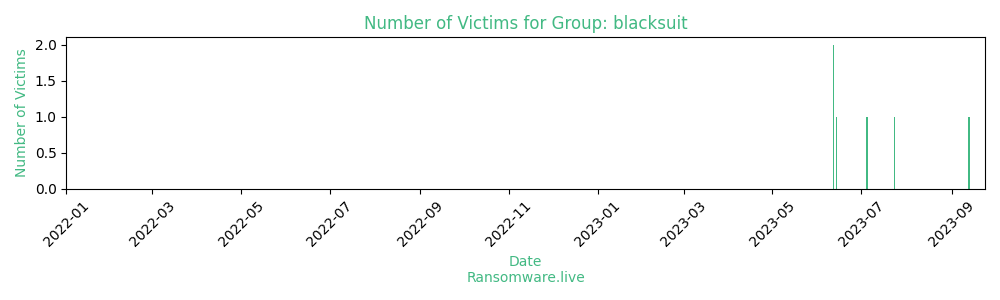

# Profiles for ransomware group : **blacksuit**

> According to Trend Micro, this ransomware has significant code overlap with Royal Ransomware.

🔎 `ransomware.live`has an active  parser for indexing blacksuit's victims

### URLs
| Title | Available | Last visit | fqdn | Screenshot 
|---|---|---|---|---|
| Black Suit | 🟢 | 03/08/2023 06:12 | `http://weg7sdx54bevnvulapqu6bpzwztryeflq3s23tegbmnhkbpqz637f2yd.onion` | <a href="https://images.ransomware.live/screenshots/weg7sdx54bevnvulapqu6bpzwztryeflq3s23tegbmnhkbpqz637f2yd-onion.png" target=_blank>📸</a> | 

### Ransom note
* [📝 1 ransom note](notes/blacksuit)

### Total Attacks Over Time

### Posts

> 5 victims found

| post | date | Description | Screenshot | 
|---|---|---|---|
| [`IT Luggage`](https://www.zoominfo.com/c/it-luggage-ltd/356677571) | 24/07/2023 | IT luggage was established in London in 1985 as Landor Ltd., designing quality luggage suitable for business and leisure needs. We were the first U.K. luggage company to begin importing from China, enabling us to offer affordable, quality luggage without compromisi | <a href="https://images.ransomware.live/screenshots/posts/79e2ef63262e684220cf22bd2c9d9e6b.png" target=_blank>📸</a> |
| [`ZooTampa at Lowry Park`](http://zootampa.org) | 05/07/2023 | Voted Tampa’s Best Family Attraction and 11-time winner of TripAdvisor Travelers’ Choice Award, ZooTampa offers unforgettable adventures for all ages. Enjoy an amazing, lush tropical setting with naturalistic habitats that provide up-close connections with animals from around the world. | <a href="https://images.ransomware.live/screenshots/posts/f090d9baf5a35d54e51fa131fe4c437c.png" target=_blank>📸</a> |
| [`Venture Logistics`](http://venturelogistics.com) | 14/06/2023 |  | <a href="https://images.ransomware.live/screenshots/posts/908d3249d10cd2ab9e8eb7a62e86e51d.png" target=_blank>📸</a> |
| [`Stant`](https://www.stant.com) | 12/06/2023 | Founded in 1898 and headquartered in Connersville, Indiana, Stant Corporation is a global supplier of vapor management systems, fuel delivery systems, thermal management systems and engineering services. | <a href="https://images.ransomware.live/screenshots/posts/e2aac258c883f381dcc22a877ee2493c.png" target=_blank>📸</a> |
| [`MARJAM Supply company`](https://marjam.com/) | 12/06/2023 | Founded in 1979, Marjam Supply started with the purchase of a warehouse in Greenpoint, Brooklyn and a few thousand dollars in assets. | <a href="https://images.ransomware.live/screenshots/posts/f65f3dd7ad35d45825352920dbaa027d.png" target=_blank>📸</a> |

Last update : _Thursday 03/08/2023 07.07 (UTC)_
