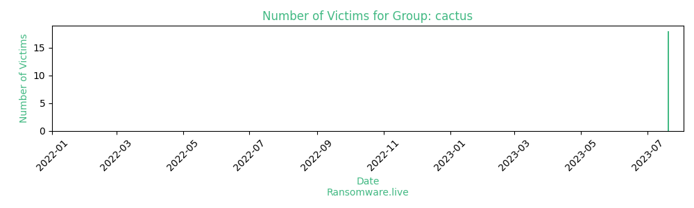

# Profiles for ransomware group : **cactus**

### URLs
| Title | Available | Last visit | fqdn | Screenshot 
|---|---|---|---|---|
| none | 🟢 | 24/09/2023 13:43 | `http://cactusbloguuodvqjmnzlwetjlpj6aggc6iocwhuupb47laukux7ckid.onion` | ❌ | 

### Ransom note
* [📝 4 ransom notes](notes/cactus)

### Total Attacks Over Time

### Victims

> 47 victims found

| victim | date | Description | Screenshot | 
|---|---|---|---|
| [`DM Civil`](https://google.com/search?q=DM+Civil) | 21/09/2023 | DM Civil provides tailored, sustainable civil contracting solutions to many of Australia’s leading companies. A privately owned company established in 1976 by Reg Toohey, Tony Spanjers and his late brother Eric Spanjers. Since then, we have grown to be one of Western Australia’s most trusted and respected civil contractors. We offer a diverse range of civil construction capabilities: • Water Infrastructure • Pipelines • Land Development • Trenchless technology • Mining Infrastructure • Trencher Hire & Services We consistently align ourselves with industry best practice and guarantee the delivery of client focussed construction solutions. |   |
| [`Bacon Universal`](https://google.com/search?q=Bacon+Universal) | 20/09/2023 | Bacon Universal Company, Inc. has proudly served Hawaii's Construction Industry for more than 60 years. | <a href="https://images.ransomware.live/screenshots/posts/608238e5d2c551a99806d873b8922b03.png" target=_blank>📸</a> |
| [`Spuncast`](https://google.com/search?q=Spuncast) | 20/09/2023 | Spuncast, Inc was founded in 1976 and is headquartered in Watertown, Wisconsin. The company provides centrifugal castings and offers stainless steel tubing products, such as hydraulic cylinders. | <a href="https://images.ransomware.live/screenshots/posts/b96db0c497ee5ce65b98784d2e5032e9.png" target=_blank>📸</a> |
| [`Peacock Bros`](https://google.com/search?q=Peacock+Bros) | 19/09/2023 | Peacock Bros. Pty Ltd, Australian-owned and operated since 1888, has grown into one of the ANZ region’s largest providers of Data Management and Printing Solutions with branches in Melbourne, Sydney, Brisbane, Perth, Adelaide and Auckland. Manufacturers of high quality barcode and colour labels, we also work with the best technology brands to provide exceptional products, solutions and support for all your supply chain needs: - Barcode labels, Tags and Colour Labels - Thermal Printing, Ribbons & Applicator Systems - ID Card Services - Scanning & Mobile Computing - Wireless Infrastructure & Networking Solutions - Customized Software Solutions - Project Management & Engineering - Authorized Service & Support. | <a href="https://images.ransomware.live/screenshots/posts/65b1caa2397cf3f73676ab93386bdfc5.png" target=_blank>📸</a> |
| [`Wardlaw Claims Service`](https://google.com/search?q=Wardlaw+Claims+Service) | 11/09/2023 | Wardlaw Claims Service is an industry-leading claims management and risk solutions firm founded in 1965. Today, we remain one of the largest privately held IA firms in the industry. No large conglomerates here! Our clients experience personalized services tailored to the nature of their risk management needs. Our services range from Daily & Catastrophe Field Adjusting in Residential and Commercial Property to Desk Adjusting, Auto Appraisal, Casualty & Liability, Emergency Services Invoice Reviews and more. We use industry leading claims technology to best serve our clients and their policyholders with INTEGRITY, ACCURACY & EXCELLENCE. | <a href="https://images.ransomware.live/screenshots/posts/3fb7b7eb68a988825ba6d8282e91a472.png" target=_blank>📸</a> |
| [`Levine Bagade Han`](https://google.com/search?q=Levine+Bagade+Han) | 11/09/2023 | Levine Bagade Han LLP is an intellectual property law practice in Palo Alto, CA. We work closely with fast-moving clients who care about their intellectual property. Though we have experience in other areas, we focus on IP. Strategy, invention disclosure management, patent prosecution, portfolio management, due diligence (client and investor based), licensing, litigation strategy… We help you with IP strategy that matches your company's business objectives. We use our experience to guide clients through IP mazes and minefields. At our core, we strive to create a client-centered practice that is unique to the intellectual property legal field. |   |
| [`Leekes`](https://google.com/search?q=Leekes) | 11/09/2023 | Retailer of homeware and home furnishing products. The company is a family owned chain of home department stores selling furniture and accessories plus conservatories, orangeries, windows, doors, kitchen and bathroom products through online and offline stores in South Wales, United Kingdom. |   |
| [`My Insurance Broker`](https://google.com/search?q=My+Insurance+Broker) | 11/09/2023 | Founded in 2008, My Insurance Broker is a Canadian community-dedicated brokerage. | <a href="https://images.ransomware.live/screenshots/posts/78e05a26fc6987c75c17a233f2f7e3d4.png" target=_blank>📸</a> |
| [`Unimarketing`](https://google.com/search?q=Unimarketing) | 11/09/2023 | Unimarketing is a company that operates in the Information Technology and Services industry. It employs 21-50 people and has $10M-$25M of revenue. The company is headquartered in Chicoutimi, Quebec, Canada. | <a href="https://images.ransomware.live/screenshots/posts/5e3bf450168ef9a020b33785d128b259.png" target=_blank>📸</a> |
| [`Geo Tek`](https://google.com/search?q=Geo+Tek) | 08/09/2023 | Incorporated in 1997, GeoTek is a full service consulting engineering firm specializing in geotechnical engineering, construction materials testing, special inspections, and environmental consulting. GeoTek is founded on the principal of providing strong business partnerships with clients by demonstrating a committed passion for those who demand technical advice and responsive customer service that adds value to the client's project. |   |
| [`Custom Powder Systems`](https://google.com/search?q=Custom+Powder+Systems) | 08/09/2023 | Custom Powder Systems is actually a containment company, so as a containment company, we offer many different solutions for customers. |   |
| [`JSS Almonds`](https://google.com/search?q=JSS+Almonds) | 08/09/2023 | JSS Almonds is a grower and processor of whole and natural California Almonds. Our facility specializes in shelled and inshell almonds. JSS Almonds serves over 15000 acres and specializes in natural, whole, and brown skin almond processing. |   |
| [`atWork Office Furniture`](https://google.com/search?q=atWork+Office+Furniture) | 08/09/2023 | atWork offers wide selection of office furniture, design services, installation. |   |
| [`BRiC Partnership`](https://google.com/search?q=BRiC+Partnership) | 08/09/2023 | BRiC is a consulting engineering firm with offices located in Belleville, Illinois; Evansville, Indiana; Springfield, Illinois; and Kirkwood, Missouri. While the four principals have been providing engineering services since the 1980's, BRiC Partnership was formed in 2002. |   |
| [`TORMAX USA`](https://google.com/search?q=TORMAX+USA) | 07/09/2023 | TORMAX USA Inc. is committed to providing exceptional services with highly qualified technical advisers and service technicians on automatic door systems since 1997. | <a href="https://images.ransomware.live/screenshots/posts/e3bfd5826d58d62e02f66021ee1cff14.png" target=_blank>📸</a> |
| [`West Craft Manufacturing`](https://google.com/search?q=West+Craft+Manufacturing) | 07/09/2023 | West Craft Manufacturing Inc. is an industry leader in the production of custom hydraulic cylinders and pneumatic cylinders for a diverse range of industries. We are specialized in designing and manufacturing custom hydraulic cylinders as per your specifications. | <a href="https://images.ransomware.live/screenshots/posts/f73c1af808902916e1fa67c75cbf75b5.png" target=_blank>📸</a> |
| [`Trimaran Capital Partners`](https://google.com/search?q=Trimaran+Capital+Partners) | 07/09/2023 | Led by Managing Partners Jay R. Bloom and Dean C. Kehler and Managing Director Michael G. Maselli, Trimaran Capital Partners ("Trimaran") is a private New York-based investment firm based in New York founded in 1998. | <a href="https://images.ransomware.live/screenshots/posts/238af2dfbcec327d3794caf9b22e2113.png" target=_blank>📸</a> |
| [`Specialised Management Services`](https://google.com/search?q=Specialised+Management+Services) | 07/09/2023 | Specialised Management Services Ltd (SMS) was formed in 1999 predominately as a service and support company to the oil and gas industry. |   |
| [`Maxxd Trailers`](https://google.com/search?q=Maxxd+Trailers) | 05/09/2023 | MAXXD is a subsidiary of Maxey Trailers Mfg. Inc., a Texas company in business since 1999. The company began as a one man shop and has grown to an operation of 70 employees who produce 5,000 trailers annually for clients across the U.S. and Canada. | <a href="https://images.ransomware.live/screenshots/posts/29efecfd493aa3ec47ccfa27f10b2124.png" target=_blank>📸</a> |
| [`MINEMAN Systems`](https://google.com/search?q=MINEMAN+Systems) | 05/09/2023 | MINEMAN IS THE TRUSTED INDUSTRY STANDARD FOR THE MARKETING OF CONCENTRATES AND METALS FROM MINING. | <a href="https://images.ransomware.live/screenshots/posts/2984c90c6187b7cd081038e2b973fb47.png" target=_blank>📸</a> |
| [`Promotrans`](https://google.com/search?q=Promotrans) | 05/09/2023 | Promotrans is a company that operates in the Professional Training & Coaching industry. It employs 251-500 people and has $25M-$50M of revenue. The company is headquartered in Paris, Île-de-france, France. | <a href="https://images.ransomware.live/screenshots/posts/89db54bd030758565d4e51109d6af1ea.png" target=_blank>📸</a> |
| [`Seymours`](https://google.com/search?q=Seymours) | 05/09/2023 | Surrey estate agents Seymours have six offices in Surrey located in Ripley, Guildford, Burpham, Woking and West Byfleet, one being a specialist letting & management operation dealing with properties for sale | <a href="https://images.ransomware.live/screenshots/posts/ed0edd9cd8f89ada237a92eb3c0a446b.png" target=_blank>📸</a> |
| [`Marfrig Global Foods`](https://google.com/search?q=Marfrig+Global+Foods) | 05/09/2023 | Established in 2000, Marfrig Global Foods processes beef products. They have processing locations in various countries and regions. | <a href="https://images.ransomware.live/screenshots/posts/72f1ee3c2319a4a78cd8dc8e7a9bbb90.png" target=_blank>📸</a> |
| [`Barsco`](https://google.com/search?q=Barsco) | 05/09/2023 | Texas located Heating, Ventilation, Air Conditioning, and Refrigeration wholesale supplier. Since 1934 and under many names Barsco has been atop the HVAC/R industry. Centered in Dallas, Barsco operates across the North, East, and Central Texas frontiers. | <a href="https://images.ransomware.live/screenshots/posts/2d9e9a68b416348388b6deca67486a19.png" target=_blank>📸</a> |
| [`Foroni SPA`](https://google.com/search?q=Foroni+SPA) | 05/09/2023 | Foroni S.p.A. is a fully integrated manufacturer of Nickel based and Specialty alloys in a wide range of chemistries for a variety of industrial applications. | <a href="https://images.ransomware.live/screenshots/posts/a2bd9c6e6c2a84cb981fa921db539153.png" target=_blank>📸</a> |
| [`Hornsyld Købmandsgaard`](https://google.com/search?q=Hornsyld+K%C3%B8bmandsgaard) | 05/09/2023 | Hornsyld Købmandsgaard is a company that operates in the Farming industry. It employs 21-50 people and has $10M-$25M of revenue. The company is headquartered in Hornsyld, Region Midtjylland, Denmark. | <a href="https://images.ransomware.live/screenshots/posts/4829919aa9b6719788d8cda9ca734546.png" target=_blank>📸</a> |
| [`Lagarde Meregnani`](https://google.com/search?q=Lagarde+Meregnani) | 05/09/2023 | Lagarde Meregnani. BUILDING FINISHING COMPANY. Lagarde Meregnani works on new construction or renovation sites in painting and decoration, floor coverings and wall coverings, facade renovation, exterior insulation, tiles and earthenware, etc.Whether it concerns construction sites for professionals or private individuals, Lagarde Meregnani manages all trades and thus coordinates interventions as well as possible, in the Grand Est and throughout France. | <a href="https://images.ransomware.live/screenshots/posts/10339ce63e7ef5ccd293659dd9a0d420.png" target=_blank>📸</a> |
| [`Balcan`](https://google.com/search?q=Balcan) | 04/09/2023 | Founded in 1967 and headquartered in Montreal, Canada, Balcan is a manufacturer and distributor of technical films and flexible packaging. |   |
| [`Barco Uniforms`](https://google.com/search?q=Barco+Uniforms) | 04/09/2023 | Founded in 1929, Barco Uniforms is a leader of design innovation in the premium professional apparel industry, offering award-winning premium uniforms that elevate and honor the individuals in the healthcare, enterprise, and food service industries. |   |
| [`Alberto Couto Alves`](https://google.com/search?q=Alberto+Couto+Alves) | 20/07/2023 | ACA Engenharia & Construção operates in a wide range of areas from Roads and Infrastructures, Buildings to the production of Bituminous mixtures, Concrete and Aggregates. | <a href="https://images.ransomware.live/screenshots/posts/c9346411d5cdf5b4608c70cd0d015ab1.png" target=_blank>📸</a> |
| [`Agoravita`](https://google.com/search?q=Agoravita) | 20/07/2023 | Since 1999, Agoravita has supported companies in their infrastructure projects and IT services, digital communications, software development and training, which form the basis of their digital transition. | <a href="https://images.ransomware.live/screenshots/posts/53dc49d194917a72d42385ca06b3afb7.png" target=_blank>📸</a> |
| [`American Meteorological Society`](https://google.com/search?q=American+Meteorological+Society) | 20/07/2023 | The American Meteorological Society, founded in 1919, is a global community committed to advancing weather, water, and climate science and service. | <a href="https://images.ransomware.live/screenshots/posts/07af8a671830108bc3aece0abb4d1ff5.png" target=_blank>📸</a> |
| [`Biocair International`](https://google.com/search?q=Biocair+International) | 20/07/2023 | Biocair is a global GDP logistics specialist with over 35 years of experience in the pharmaceutical, biotechnology and life sciences sectors. | <a href="https://images.ransomware.live/screenshots/posts/4951bf0409f6a43e4ebb52039856b9e8.png" target=_blank>📸</a> |
| [`Confartigianato Federimpresa FC`](https://google.com/search?q=Confartigianato+Federimpresa+FC) | 20/07/2023 | Confartigianato Federimpresa FC is a company that operates in the Financial Services industry. | <a href="https://images.ransomware.live/screenshots/posts/e5dfa88b91bfd237607c5b02f1a54987.png" target=_blank>📸</a> |
| [`ScanSource`](https://google.com/search?q=ScanSource) | 20/07/2023 | Founded in 1992, ScanSource, Inc is an international distributor of technology products and solutions, focusing on point-of-sale (POS), payments, barcode, physical security, unified communications and collaboration, cloud and telecom services. | <a href="https://images.ransomware.live/screenshots/posts/ffabc016b43a44f0a2a0445b8778b2bb.png" target=_blank>📸</a> |
| [`CWS`](https://google.com/search?q=CWS) | 20/07/2023 | CWS Srl is a company that operates in the Information Technology and Services industry. | <a href="https://images.ransomware.live/screenshots/posts/c358ad7e0facba5059283df4a098ac24.png" target=_blank>📸</a> |
| [`Hawa Sliding Solutions`](https://google.com/search?q=Hawa+Sliding+Solutions) | 20/07/2023 | Hawa AG has been producing sliding solutions for creative building culture for more than 50 years. It is well-known as a premium provider of sliding fitting systems for equipment, room partitioning, shop fronts and facades. | <a href="https://images.ransomware.live/screenshots/posts/6aef8385504d22078dc0d374a4dfe7a8.png" target=_blank>📸</a> |
| [`Imagination`](https://google.com/search?q=Imagination) | 20/07/2023 | Imagination is an independent experience company with 12 offices worldwide. We specialise in designing experiences which change how people feel, think and act. | <a href="https://images.ransomware.live/screenshots/posts/34be205b1c152860750ce61c4ffb2b23.png" target=_blank>📸</a> |
| [`Italkraft`](https://google.com/search?q=Italkraft) | 20/07/2023 | Headquartered in Miami, Florida, we provide our customers with Italian Design kitchen, bathroom and closet cabinetry of the highest standard and style. | <a href="https://images.ransomware.live/screenshots/posts/e69fda414c6a458226576c1830d581a0.png" target=_blank>📸</a> |
| [`Michigan Production Machining`](https://google.com/search?q=Michigan+Production+Machining) | 20/07/2023 | Michigan Production Machining, Inc. manufactures induction heat treating supplies. The company offers precision machined ferrous and non-ferrous forgings and castings to the automotive industry. Michigan Production Machining operates in the United States. | <a href="https://images.ransomware.live/screenshots/posts/b7dd192d0646e81f7c0a819f61fa1ac7.png" target=_blank>📸</a> |
| [`Novobit`](https://google.com/search?q=Novobit) | 20/07/2023 | Novobit AG is a well-established and fully independent company that develops and manufactures a wide range of fiber optic products for the global market. | <a href="https://images.ransomware.live/screenshots/posts/0a8a23c0680baee48f09e1ec5080ff1e.png" target=_blank>📸</a> |
| [`Artemide`](https://google.com/search?q=Artemide) | 20/07/2023 | Artemide, headquartered in Lombardy, Italy, is a company that specializes in the design, manufacturing, and retail of residential light fixtures. | <a href="https://images.ransomware.live/screenshots/posts/3e3ab375877edae36f57d82d15c332b7.png" target=_blank>📸</a> |
| [`Reyes Automotive Group`](https://google.com/search?q=Reyes+Automotive+Group) | 20/07/2023 | Reyes Automotive Group is a minority owned Joint Venture (or JV) that is comprised of two companies with a combined 120 years of manufacturing experience. | <a href="https://images.ransomware.live/screenshots/posts/55d7f587747751676680020087b795e3.png" target=_blank>📸</a> |
| [`Rotomail Italia SpA`](https://google.com/search?q=Rotomail+Italia+SpA) | 20/07/2023 | Rotomail Italia SpA is a company that operates in the Printing industry. | <a href="https://images.ransomware.live/screenshots/posts/6242a64b7f4a5c22ab54c6c294282ce5.png" target=_blank>📸</a> |
| [`Phoenix Taxis`](https://google.com/search?q=Phoenix+Taxis) | 20/07/2023 | Phoenix Taxis are Northumberland's largest taxi company, operating a service throughout the North East dedicated to quality vehicles and reliable customer service. | <a href="https://images.ransomware.live/screenshots/posts/6c8834b01831352e62f5cd112d151246.png" target=_blank>📸</a> |
| [`Wasserstrom`](https://google.com/search?q=Wasserstrom) | 20/07/2023 | The Wasserstrom Company, headquartered in Columbus, Ohio and founded in 1902, is a restaurant supplier and distributor of foodservice supplies and equipment. They sell products, such as kitchen supplies and catering supplies, from industry manufacturers. | <a href="https://images.ransomware.live/screenshots/posts/c93bb3d26ea1e3aa3d35b6bb36bdb48b.png" target=_blank>📸</a> |
| [`Americold`](https://google.com/search?q=Americold) | 20/07/2023 | AmeriCold Logistics LLC is a major temperature controlled warehousing and transportation company based in Atlanta, Georgia, United States. It is in the business of modern commercialized temperature-controlled warehousing for the storage of perishable goods. | <a href="https://images.ransomware.live/screenshots/posts/7777154a61827285123726a25cc3f9ae.png" target=_blank>📸</a> |

Last update : _Sunday 24/09/2023 14.39 (UTC)_
