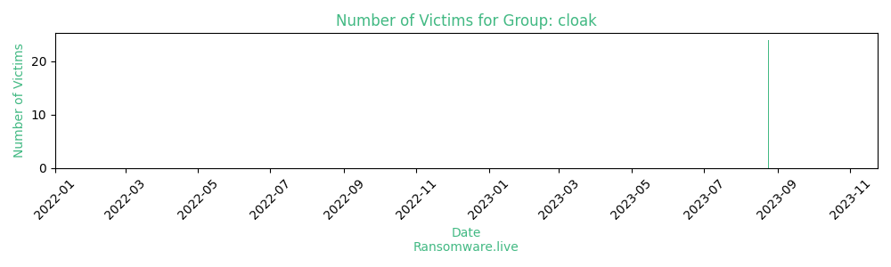

# Profiles for ransomware group : **cloak**

### URLs
| Title | Available | Last visit | fqdn | Screenshot 
|---|---|---|---|---|
| 403 Forbidden | 🟢 | 24/11/2023 12:12 | `http://cloak7jpvcb73rtx2ff7kaw2kholu7bdiivxpzbhlny4ybz75dpxckqd.onion` | <a href="https://images.ransomware.live/screenshots/cloak7jpvcb73rtx2ff7kaw2kholu7bdiivxpzbhlny4ybz75dpxckqd-onion.png" target=_blank>📸</a> | 

### Ransom note
* [📝 1 ransom note](notes/cloak)

### Technique Set

* 🛠️ A technique set is [available](https://app.tidalcyber.com/share/techniqueset/0848f2b1-01c7-4322-b60c-57699d5dabae) from [Tidal Cyber](https://www.tidalcyber.com/)

### Total Attacks Over Time

### Victims

> 24 victims found

| victim | date | Description | Screenshot | 
|---|---|---|---|
| [`Arus-gmbh`](https://google.com/search?q=Arus-gmbh) | 24/08/2023 | Country: germany |   |
| [`Sportlab-srl`](https://google.com/search?q=Sportlab-srl) | 24/08/2023 | Country: italia |   |
| [`BONI-PASSAU.DE`](https://google.com/search?q=BONI-PASSAU.DE) | 24/08/2023 | Country: germany |   |
| [`lusis-avocats.com`](https://google.com/search?q=lusis-avocats.com) | 24/08/2023 | Country: france |   |
| [`werk33.com`](https://google.com/search?q=werk33.com) | 24/08/2023 | Country: germany |   |
| [`GRIDINSTALLERS.com`](https://google.com/search?q=GRIDINSTALLERS.com) | 24/08/2023 | Country: holland |   |
| [`surapon.com`](https://google.com/search?q=surapon.com) | 24/08/2023 | Country: Thailand |   |
| [`mps-24.com`](https://google.com/search?q=mps-24.com) | 24/08/2023 | Country: germany |   |
| [`gruppomoba.com`](https://google.com/search?q=gruppomoba.com) | 24/08/2023 | Country: italia |   |
| [`stshcpa.com.tw`](https://google.com/search?q=stshcpa.com.tw) | 24/08/2023 | Country: taiwan |   |
| [`ihopmexico.com`](https://google.com/search?q=ihopmexico.com) | 24/08/2023 | Country: Mexico |   |
| [`Nicer technology`](https://google.com/search?q=Nicer+technology) | 24/08/2023 | Country: taiwan |   |
| [`binhamoodah.ae`](https://google.com/search?q=binhamoodah.ae) | 24/08/2023 | Country: Saud Arabia |   |
| [`first-resources-ltd`](https://google.com/search?q=first-resources-ltd) | 24/08/2023 | country: Indonesia |   |
| [`Sbs-Berlin`](https://google.com/search?q=Sbs-Berlin) | 24/08/2023 | Country: germany |   |
| [`imtmro.com`](https://google.com/search?q=imtmro.com) | 24/08/2023 | Country: USA |   |
| [`INCOBEC`](https://google.com/search?q=INCOBEC) | 24/08/2023 | Country: Canada |   |
| [`still95.it`](https://google.com/search?q=still95.it) | 24/08/2023 | Country: italia |   |
| [`gsh-cargo.com`](https://google.com/search?q=gsh-cargo.com) | 24/08/2023 | Country: UAE |   |
| [`flamewarestudios.com`](https://google.com/search?q=flamewarestudios.com) | 24/08/2023 | Country: United Kingdom |   |
| [`ALEZZELPOWER.com`](https://google.com/search?q=ALEZZELPOWER.com) | 24/08/2023 | Country: Bahrain |   |
| [`Notaires.fr`](https://google.com/search?q=Notaires.fr) | 24/08/2023 | Country: France | <a href="https://images.ransomware.live/screenshots/posts/a1d8efa0cee28ed70d93a68dbfebdddf.png" target=_blank>📸</a> |
| [`Sonabhy.bf`](https://google.com/search?q=Sonabhy.bf) | 24/08/2023 | Country: Burkina Faso | <a href="https://images.ransomware.live/screenshots/posts/cec65448716e33bf5591611a288e819d.png" target=_blank>📸</a> |
| [`KVFCU.ORG`](https://google.com/search?q=KVFCU.ORG) | 24/08/2023 | Country: USA | <a href="https://images.ransomware.live/screenshots/posts/a783d60cc847ec15e21a7a8c0fc84780.png" target=_blank>📸</a> |

Last update : _Friday 24/11/2023 13.15 (UTC)_
