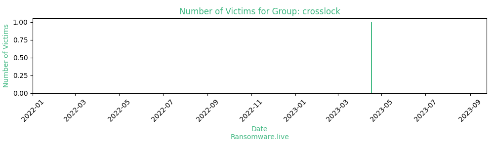

# Profiles for ransomware group : **crosslock**

### External analysis
- https://twitter.com/1ZRR4H/status/1648232869809078273

🔎 `ransomware.live`has an active  parser for indexing crosslock's victims

### URLs
| Title | Available | Last visit | fqdn | Screenshot 
|---|---|---|---|---|
| Cross Lock - Data leak | 🔴 | 27/07/2023 21:16 | `http://crosslock5cwfljbw4v37zuzq4talxxhyavjm2lufmjwgbpfjdsh56yd.onion` | <a href="https://images.ransomware.live/screenshots/crosslock5cwfljbw4v37zuzq4talxxhyavjm2lufmjwgbpfjdsh56yd-onion.png" target=_blank>📸</a> | 

### Total Attacks Over Time

### Victims

> 1 victim found

| victim | date | Description | Screenshot | 
|---|---|---|---|
| [`validcertificadora.com.br`](https://google.com/search?q=validcertificadora.com.br) | 17/04/2023 | VALID Certificadora Digital Ltda is a company that operates in the Farming industry. It employs 501-1,000 people and has $100M-$250M of revenue. The company is headquartered in São Paulo, Sp, Braz... | <a href="https://images.ransomware.live/screenshots/posts/06bcbdd07e365a2f1108be72bc10a348.png" target=_blank>📸</a> |

Last update : _Friday 24/11/2023 13.15 (UTC)_
