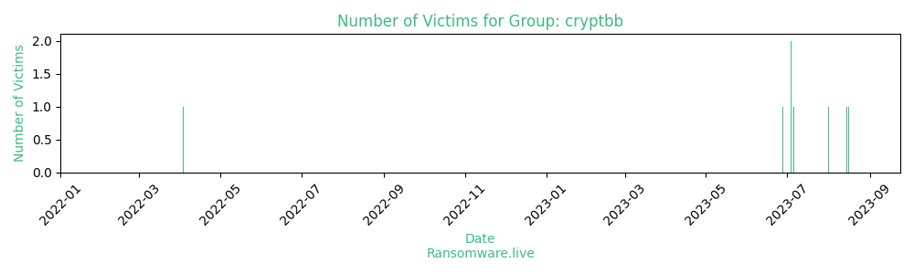

# Profiles for ransomware group : **cryptbb**

### URLs
| Title | Available | Last visit | fqdn | Screenshot 
|---|---|---|---|---|
| Home | 🔴 | 20/09/2023 03:17 | `http://crypuglupv3bsqnbt5ruu5lgwrwoaojscwhuoccbmbzmcidft5kiccqd.onion` | <a href="https://images.ransomware.live/screenshots/crypuglupv3bsqnbt5ruu5lgwrwoaojscwhuoccbmbzmcidft5kiccqd-onion.png" target=_blank>📸</a> | 

### Total Attacks Over Time

### Victims

> 8 victims found

| victim | date | Description | Screenshot | 
|---|---|---|---|
| [`ToyotaLift Northeast`](https://google.com/search?q=ToyotaLift+Northeast) | 16/08/2023 | Offering forklifts, aerial work platforms, lift trucks, & material handling equipment by Toyota industrial equipment, Raymond, Skyjack, Genie, JLG, Clark. ToyotaLift Northeast is the best place to find high-quality new and used lift trucks. We are a full service material handling equipment dealership at all seven of our locations (PA, NJ, DE, MD and NY) offering forklift sales, service, parts, rental, OSHA forklift training and safety education. Our goal is to provide services that matches the high quality standards of the Toyota forklift products; services that will be unmatched in the greater Philadelphia, New Jersey, New York, Delaware and Maryland areaswww.toyotaliftne.com | <a href="https://images.ransomware.live/screenshots/posts/32a7c34b73636953bedeefaf5b84cfc9.png" target=_blank>📸</a> |
| [`Aspect Structural Engineers`](https://google.com/search?q=Aspect+Structural+Engineers) | 15/08/2023 | Creativity I Excellence I Pragmatism. We are problem solvers and purveyors of thoughtful design for structures big and small. Aspect provides state-of-the-art structural engineering service with the personalized attention that comes from being a small, young firm. We aim to innovate, while always staying mindful of project schedules and budgets. Prefabrication & modular construction are important tools in helping to achieve these objectives. We are experienced with the constraints involved, and know first hand of the design intricacies, and advantages, these types of systems can represent. We also believe that when appropriate, structure = architecture. A holistic approach to building design can gain efficiencies on all fronts, creating structure that doubles as ductwork, structure that conceals sprinkler pipes and structure that is meant to be seenhttps://aspectengineers.com/ | <a href="https://images.ransomware.live/screenshots/posts/4e90027b945c9b39ce76abfe0024f577.png" target=_blank>📸</a> |
| [`Danbury Public Schools`](https://google.com/search?q=Danbury+Public+Schools) | 01/08/2023 | Danbury Public Schools is a school district headquartered in Danbury, Connecticut. In 2006 Eddie Davis retired from being superintendent. Salvatore Pascarella succeeded Davis that year.https://www.danbury.k12.ct.us/ | <a href="https://images.ransomware.live/screenshots/posts/ef8956b82976fed8d76a2462131e6e3e.png" target=_blank>📸</a> |
| [`KIRWIN FRYDAY MEDCALF Lawyers LLP`](https://google.com/search?q=KIRWIN+FRYDAY+MEDCALF+Lawyers+LLP) | 06/07/2023 | The company provide a full range of services in real estate law including residential and commercial sales, purchases and mortgages. The firm also provides comprehensive services in the corporate commercial area including incorporation of businesses, both large and small, acquisition and sales of small businesses and generally assisting our clientele to grow and prosper | <a href="https://images.ransomware.live/screenshots/posts/80ca455d3f0b034728bc7cc9c161b8d5.png" target=_blank>📸</a> |
| [`Jeff Wyler Automotive Family, Inc.`](https://google.com/search?q=Jeff+Wyler+Automotive+Family%2C+Inc.) | 04/07/2023 | When you're looking for a new car or need to have your car serviced, come visit Jeff Wyler, one of the top rated car dealers in Ohio, Kentucky, and Indiana.  Whether you are looking to buy a new or used vehicle in Cincinnati, Dayton, Columbus or Louisville, need to have service completed on your vehicle, need auto parts and accessories, or body work that needs attention... You can trust your decision when you choose any one of our Jeff Wyler Dealerships. Our dealership reviews and testimonials attest to our long standing reputation, and we invite you to join the Jeff Wyler Family dealerships.https://wyler.com/ | <a href="https://images.ransomware.live/screenshots/posts/849060e7d9c61a9b0a31ea2afe6dbc1f.png" target=_blank>📸</a> |
| [`Polanglo`](https://google.com/search?q=Polanglo) | 04/07/2023 | Polanglo SP. z O.o. is a network of bookstores and wholesalers operating since 1991 with an educational and language profile. Thanks to the dynamic development, we have been appreciated by the largest university publishing house in the world – Oxford University Press. The Oxford University Press authorities have granted us the exclusive right to import our English Language Teaching materials into Poland, and we make every effort to make Oxford University Press language publications available throughout Poland.https://www.polanglo.pl/ | <a href="https://images.ransomware.live/screenshots/posts/47f5b8576a2a7cc7ef42da07244dd1ec.png" target=_blank>📸</a> |
| [`CON-STRUCT`](https://google.com/search?q=CON-STRUCT) | 28/06/2023 | Con-struct, Inc. proudly serves all heavy construction needs in Central Iowa, including Ames, Story County, Marshall County, and surrounding areas.https://constructiowa.com | <a href="https://images.ransomware.live/screenshots/posts/dc9c2b0dc8773ef8794e93ebcc8c3aeb.png" target=_blank>📸</a> |
| [`P1 Technical Services`](https://google.com/search?q=P1+Technical+Services) | 03/04/2022 | http://p1-tech.com/P1 Technical Services has been serving the commercial industry by providing expert design, installation, support and maintenance of low voltage infrastructures since 1984.P1 creates cost effective, single-source hardware and service solutions to meet our customer’s individual needs by applying our expertise in Network Design, Routing and Switching, Wireless, Local and Wide Area Networks, VOIP, Structured Cabling, Access Control, Sound Masking and Paging, Video Conferencing, IP Camera Systems, RFID Tracking, Audio Visual Systems, Patient Monitoring, Intercom and Telephone Entry Systems. | <a href="https://images.ransomware.live/screenshots/posts/2f95ec9dcc3607560250962db1fba9c2.png" target=_blank>📸</a> |

Last update : _Friday 24/11/2023 13.15 (UTC)_
