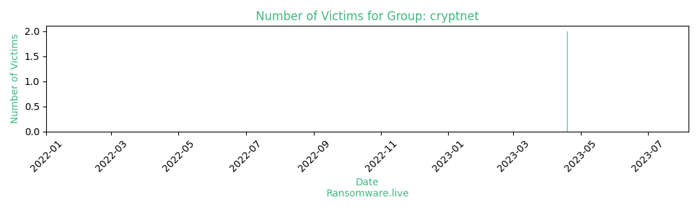

# Profiles for ransomware group : **cryptnet**

>  According to OALabs, this ransomware has the following features: * Files are encrypted with AES CBC using a generated 256 bit key and IV.* The generated AES keys are encrypted using a hard coded RSA key and appended to the encrypted files.

🔎 `ransomware.live`has an active  parser for indexing cryptnet's victims

### URLs
| Title | Available | Last visit | fqdn | Screenshot 
|---|---|---|---|---|
| CryptNet RECOVERY | 🟢 | 03/08/2023 06:17 | `http://cryptr3fmuv4di5uiczofjuypopr63x2gltlsvhur2ump4ebru2xd3yd.onion` | <a href="https://images.ransomware.live/screenshots/cryptr3fmuv4di5uiczofjuypopr63x2gltlsvhur2ump4ebru2xd3yd-onion.png" target=_blank>📸</a> | 
| CryptNet NEWS | 🟢 | 03/08/2023 06:17 | `http://blog6zw62uijolee7e6aqqnqaszs3ckr5iphzdzsazgrpvtqtjwqryid.onion` | <a href="https://images.ransomware.live/screenshots/blog6zw62uijolee7e6aqqnqaszs3ckr5iphzdzsazgrpvtqtjwqryid-onion.png" target=_blank>📸</a> | 

### Ransom note
* [📝 1 ransom note](notes/cryptnet)

### Total Attacks Over Time

### Posts

> 2 victims found

| post | date | Description | Screenshot | 
|---|---|---|---|
| [`Export Hub`](https://www.exporthub.com) | 19/04/2023 | ExportHub Ltd. is committed to safeguarding its users' privacy. We request all our users to read the following 'privacy policy' to understand how their personal & business information will be treated, as they make full use of our services to their benefit. This policy is applicable only to the entire network of marketplaces operated by EH and not by any other company. ExportHub's primary goal in collecting personal or public information is to provide the user with a customized experience on our network of sites. This includes personalized services, interactive communication and other services, most of which are completely free and remaining are paid. Business information is used to display the user's business listing or product offerings across our network to fetch maximum business opportunities for the user....  | <a href="https://images.ransomware.live/screenshots/posts/b9f12263753747e28509440b3277b07a.png" target=_blank>📸</a> |
| [`Urban Import`](https://www.urbanimport.com) | 19/04/2023 | Urban Import was established in 2001 by fellow automotive enthusiasts to provide customers with an unrivaled selection of top quality aftermarket automotive parts. After cementing our presence as an eBay Power Seller, we launched our first online retail site carrying some of the top performance brands of the time. As the aftermarket performance industry began to boom, Urban Import focused on expanding its lineup by securing exclusive distributorship of the D2 Racing brand in North America....  | <a href="https://images.ransomware.live/screenshots/posts/45025a1d5bcf2c57c42b81226e81d134.png" target=_blank>📸</a> |

Last update : _Thursday 03/08/2023 07.07 (UTC)_
