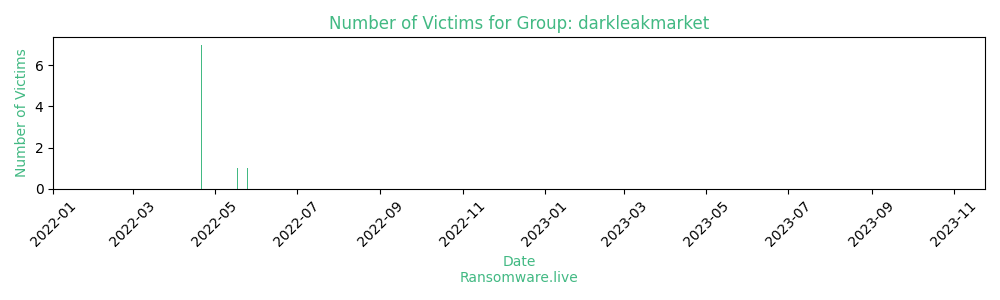

# Profiles for ransomware group : **darkleakmarket**

_`marketplace - not a ransomware group, reputation questionable`_

### URLs
| Title | Available | Last visit | fqdn | Screenshot 
|---|---|---|---|---|
| Dark Leak Market | 🔴 | 07/10/2021 16:14 | `http://54rdhzjzc4ids4u4wata4zr4ywfon5wpz2ml4q3avelgadpvmdal2vqd.onion` | ❌ | 
| Anonymous marketplace - guaranted secure escrow sy | 🟢 | 24/09/2023 13:51 | `http://aby6efzmp7jzbwgidgqc6ghxi2vwpo6d7eaood5xuoxutrfofsmzcjqd.onion` | <a href="https://images.ransomware.live/screenshots/aby6efzmp7jzbwgidgqc6ghxi2vwpo6d7eaood5xuoxutrfofsmzcjqd-onion.png" target=_blank>📸</a> | 
| Anonymous marketplace - guaranted secure escrow sy | 🟢 | 24/09/2023 13:52 | `http://darklmmmfuonklpy6s3tmvk5mrcdi7iapaw6eka45esmoryiiuug6aid.onion` | <a href="https://images.ransomware.live/screenshots/darklmmmfuonklpy6s3tmvk5mrcdi7iapaw6eka45esmoryiiuug6aid-onion.png" target=_blank>📸</a> | 
| Dark Leak Market | 🔴 | 11/07/2023 12:25 | `http://darkleakyqmv62eweqwy4dnhaijg4m4dkburo73pzuqfdumcntqdokyd.onion` | <a href="https://images.ransomware.live/screenshots/darkleakyqmv62eweqwy4dnhaijg4m4dkburo73pzuqfdumcntqdokyd-onion.png" target=_blank>📸</a> | 

### Total Attacks Over Time

### Victims

> 39 victims found

| victim | date | Description | Screenshot | 
|---|---|---|---|
| [`Huge iCloud Nudes Leak`](https://google.com/search?q=Huge+iCloud+Nudes+Leak) | 25/05/2022 |   |   |
| [`Xplay Data Leak`](https://google.com/search?q=Xplay+Data+Leak) | 18/05/2022 |   |   |
| [`DDC Data Leak`](https://google.com/search?q=DDC+Data+Leak) | 21/04/2022 |   |   |
| [`Panasonic data breach`](https://google.com/search?q=Panasonic+data+breach) | 21/04/2022 |   |   |
| [`Volvo data breach`](https://google.com/search?q=Volvo+data+breach) | 21/04/2022 |   |   |
| [`UKG Kronos Data Leak`](https://google.com/search?q=UKG+Kronos+Data+Leak) | 21/04/2022 |   |   |
| [`T Mobile Data Leak Dec-2021`](https://google.com/search?q=T+Mobile+Data+Leak+Dec-2021) | 21/04/2022 |   |   |
| [`US Cellular data leak Dec-2021`](https://google.com/search?q=US+Cellular+data+leak+Dec-2021) | 21/04/2022 |   |   |
| [`Major indian cryptocurrency Data Leak`](https://google.com/search?q=Major+indian+cryptocurrency+Data+Leak) | 21/04/2022 |   |   |
| [`Indian Aadhar data & software.`](https://google.com/search?q=Indian+Aadhar+data+%26+software.) | 07/10/2021 |   |   |
| [`Epik Domain registrar and web host`](https://google.com/search?q=Epik+Domain+registrar+and+web+host) | 07/10/2021 |   |   |
| [`Syniverse Data Leak`](https://google.com/search?q=Syniverse+Data+Leak) | 07/10/2021 |   |   |
| [`Gigabyte Data Leak`](https://google.com/search?q=Gigabyte+Data+Leak) | 24/09/2021 |   |   |
| [`American Bank Systems INC Data Leak`](https://google.com/search?q=American+Bank+Systems+INC+Data+Leak) | 09/09/2021 |   |   |
| [`Solar Winds Data Leak`](https://google.com/search?q=Solar+Winds+Data+Leak) | 09/09/2021 |   |   |
| [`IDFC Bank Confidential Data Leak`](https://google.com/search?q=IDFC+Bank+Confidential+Data+Leak) | 09/09/2021 |   |   |
| [`Bigbasket.com De-Hashed data leaked sql db`](https://google.com/search?q=Bigbasket.com+De-Hashed+data+leaked+sql+db) | 09/09/2021 |   |   |
| [`Beacon Health Solutions LLC Data`](https://google.com/search?q=Beacon+Health+Solutions+LLC+Data) | 09/09/2021 |   |   |
| [`Jazz Mobile Pakistan Data Dump`](https://google.com/search?q=Jazz+Mobile+Pakistan+Data+Dump) | 09/09/2021 |   |   |
| [`2480000 Airtel India Customers Data`](https://google.com/search?q=2480000+Airtel+India+Customers+Data) | 09/09/2021 |   |   |
| [`Indiabulls SQL and Documents Leak`](https://google.com/search?q=Indiabulls+SQL+and+Documents+Leak) | 09/09/2021 |   |   |
| [`True Caller Indian Data Leak`](https://google.com/search?q=True+Caller+Indian+Data+Leak) | 09/09/2021 |   |   |
| [`533 Million facebook Users Data`](https://google.com/search?q=533+Million+facebook+Users+Data) | 09/09/2021 |   |   |
| [`Prime Minister of India Data`](https://google.com/search?q=Prime+Minister+of+India+Data) | 09/09/2021 |   |   |
| [`Acer.com Leaked Data 100% Fresh`](https://google.com/search?q=Acer.com+Leaked+Data+100%25+Fresh) | 09/09/2021 |   |   |
| [`Summit Credit Union Big Data Leak`](https://google.com/search?q=Summit+Credit+Union+Big+Data+Leak) | 09/09/2021 |   |   |
| [`Mobikwik Leaked Data`](https://google.com/search?q=Mobikwik+Leaked+Data) | 09/09/2021 |   |   |
| [`Astoria Company LLC data`](https://google.com/search?q=Astoria+Company+LLC+data) | 09/09/2021 |   |   |
| [`SBI YONO APP DATABASE`](https://google.com/search?q=SBI+YONO+APP+DATABASE) | 09/09/2021 |   |   |
| [`Upstox.com Huge Data`](https://google.com/search?q=Upstox.com+Huge+Data) | 09/09/2021 |   |   |
| [`Tata Communications Huge Data`](https://google.com/search?q=Tata+Communications+Huge+Data) | 09/09/2021 |   |   |
| [`Dominos India Database Leak`](https://google.com/search?q=Dominos+India+Database+Leak) | 09/09/2021 |   |   |
| [`AirIndia breach information of 4.5 million custome`](https://google.com/search?q=AirIndia+breach+information+of+4.5+million+custome) | 09/09/2021 |   |   |
| [`ADATA corporation Leak`](https://google.com/search?q=ADATA+corporation+Leak) | 09/09/2021 |   |   |
| [`Cognyte Data Leak`](https://google.com/search?q=Cognyte+Data+Leak) | 09/09/2021 |   |   |
| [`DreamHost Data Leak`](https://google.com/search?q=DreamHost+Data+Leak) | 09/09/2021 |   |   |
| [`Pine Labs Data Leak`](https://google.com/search?q=Pine+Labs+Data+Leak) | 09/09/2021 |   |   |
| [`AT&T Database Leak`](https://google.com/search?q=AT%26T+Database+Leak) | 09/09/2021 |   |   |
| [`Liquid Global liquid.com`](https://google.com/search?q=Liquid+Global+liquid.com) | 09/09/2021 |   |   |

Last update : _Sunday 24/09/2023 14.39 (UTC)_
