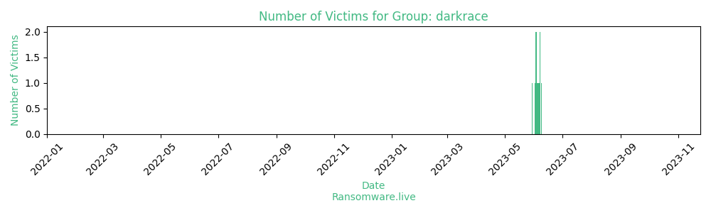

# Profiles for ransomware group : **darkrace**

🔎 `ransomware.live`has an active  parser for indexing darkrace's victims

### URLs
| Title | Available | Last visit | fqdn | Screenshot 
|---|---|---|---|---|
| Darkrace blog | 🔴 | 20/06/2023 23:24 | `http://wkrlpub5k52rjigwxfm6m7ogid55kamgc5azxlq7zjgaopv33tgx2sqd.onion` | <a href="https://images.ransomware.live/screenshots/wkrlpub5k52rjigwxfm6m7ogid55kamgc5azxlq7zjgaopv33tgx2sqd-onion.png" target=_blank>📸</a> | 

### Total Attacks Over Time

### Posts

> 10 victims found

| post | date | Description | Screenshot | 
|---|---|---|---|
| [`marstrand.se`](https://google.com/search?q=marstrand.se) | 09/06/2023 | Längst ut i väster, där skärgården tar slut och havet tar vid, ligger Marstrand. Seglarstaden och badorten Marstrand är inte utan anledning en storfavorit för alla besökare. Här finns kajen med båtar av alla slag, mysiga hus vid bilfria gator, topprestauranger och caféer, sol och salta bad, musik och skådespel. På toppen av ön tronar Carlstens fästning. Efter en kort färjetur över sundet befinner du dig på själva Marstrandsön, med en levande närvaro från en svunnen tid, blandat med trendiga seglarjackor. På Marstrand finner man både krogliv och stilla lugn beroende på när man besöker ön. Med sina mysiga kvarter, små gränder och prång, sin dominerande fästning och havsutsikt vart man än vänder sig, väcker ön starka känslor. Längs bryggorna i Sveriges största gästhamn ligger båtarna tätt och med GKSS Match Cup Sweden första veckan i juli är Marstrand definitivt seglingens huvudstad i Sverige. | <a href="https://images.ransomware.live/screenshots/posts/e4268348ff38e917668800ba0900b0fb.png" target=_blank>📸</a> |
| [`vaud-promotion`](https://google.com/search?q=vaud-promotion) | 07/06/2023 | L’Association Vaud Promotion a pour but d’accroître la notoriété, la compétitivité et l’attractivité du canton de Vaud au moyen de la marque VAUD+ dont elle promeut les valeurs. Elle entend réaliser son but en collaboration avec les acteurs économiques, régions et institutions participant à la promotion du canton de Vaud, à travers les activités, produits et services qui en font le succès, qu’ils soient économiques, académiques, touristiques, culturels, sportifs, issus du terroir vaudois et gastronomiques.A cet effet, elle anime une communauté d’acteurs multisectoriels vaudois qui incarnent et véhiculent les valeurs de la marque VAUD+. | <a href="https://images.ransomware.live/screenshots/posts/4573da0aa93abb757a449ba130b198a0.png" target=_blank>📸</a> |
| [`COOPERATIVETECH`](https://google.com/search?q=COOPERATIVETECH) | 07/06/2023 | Cooperative Technologies delivers proven, industry specific standards-based software that helps organizations cut operational overhead costs and improve customer service. Platform-independent customizable software solutions keep carriers in charge of their funds, reducing risk while staying on top of industry trends. Insurance and financial carriers depend upon our list bill reconciliation and 1035 exchange solutions. | <a href="https://images.ransomware.live/screenshots/posts/4256f7fef36bb5601da70926f3eb61c2.png" target=_blank>📸</a> |
| [`PICPLUS.COM`](https://google.com/search?q=PICPLUS.COM) | 06/06/2023 | Pictures Plus and O'Roke Photography have over 50 years of combined experience providing School, Sports, Event & Portrait photography services in the Quad-State area. We are members of the PSPA (Professional School Photographers Association) as well as PMA (Photo Marketing Associates) and have a long history of community involvement and support.  We have designed a hassle-free picture day, providing multiple photography stations to make your day run faster. We are staffed with trained and qualified personnel to ensure accuracy, quality and efficiency leading up to and on picture day. Our Customer Service cares about each and every customer. We stand by our friendly, home-town service and 100% Satisfaction Guarantee. | <a href="https://images.ransomware.live/screenshots/posts/40caaedb55bb1aadb11aca1f1a9c8bc9.png" target=_blank>📸</a> |
| [`rzepeckimroczkowski`](https://google.com/search?q=rzepeckimroczkowski) | 05/06/2023 | Rzepecki Mroczkowski Sp. Z o.o. - z grupą Volkswagen związani jesteśmy od 1991, jako autoryzowany dealer marki Volkswagen oraz Volkswagen Samochody Dostawcze. Siedziba Spółki zlokalizowana jest w Poznaniu przy ulicy Wiatracznej 5. W tej samej lokalizacji prowadzimy również autoryzowany serwis i sprzedaż oryginalnych części zamiennych dla marek: Volkswagen, Volkswagen Samochody Dostawcze, Audi oraz Skoda. | <a href="https://images.ransomware.live/screenshots/posts/7ae769f241448a18b003277fe9f9e821.png" target=_blank>📸</a> |
| [`hep global GmbH`](https://google.com/search?q=hep+global+GmbH) | 04/06/2023 | A partner for everything to do with solar energy. That’s hep. Since 2008. We develop, build, operate and finance solar parks. World-wide. For energy production that can do more than supply electricity. The large-scale photovoltaic facilities we have developed have a capacity of around 1,310 MW peak. From our sites in Germany, Japan and the USA we operate 18 solar projects ourselves. Our active pipeline for future projects comprises around 5,300 MW peak. (The number of solar parks in operation are up to date. All the other figures are updated every six months.) | <a href="https://images.ransomware.live/screenshots/posts/d92a193b480d5837c625307aeb11968c.png" target=_blank>📸</a> |
| [`PESSI`](https://google.com/search?q=PESSI) | 03/06/2023 | PESSI is committed to provide services and benefits to workers and their dependents in close partnership with the employers. By bringing transparency and ensuring fairness to its business processes, PESSI's noble task of providing comprehensive medical coverage and a number of cash benefits to its secured clientele comprising of downtrodden workers and their dependents including parents is expected to significantly enhance the coverage and scope of its services. PESSI is indeed a partner in enhancing productivity of businesses by providing security and peace of mind to workers. May Allah give us strength to standby our commitments. | <a href="https://images.ransomware.live/screenshots/posts/7ba73da49ed2a67ceb03f78f89159b6b.png" target=_blank>📸</a> |
| [`PLURISERVICE`](https://google.com/search?q=PLURISERVICE) | 03/06/2023 | Pluriservice Spa nasce nel 1986, è leader nel settore Auto ID (codice a barre). Produce e commercializza un’ampia gamma di prodotti tecnologicamente avanzati e innovativi. È distributore in esclusiva per il territorio nazionale di alcuni dei brand più riconosciuti a livello mondiale nel settore Auto ID. È proprietaria dei brand PLUS e APIX e produce soluzioni software con Storm Open Solutions, la software house nata nel 2001, depositaria nello sviluppo e rinnovo delle suite E2K per i settori hospitality e retail, con oltre 5000 clienti attivi. Pluriservice Solutions è il system integrator del gruppo che nel 2006 ha raggiunto 6 Mln di fatturato con i contratti di locazione attivi. Raining Labels nasce nel 2005 e si occupa di realizzare etichette adesive standard e personalizzate, ad oggi ha realizzato oltre 5 milioni di m2 di etichette. La Proget Sistem Italia è dedicata alla progettazione e ingegnerizzazione dei sistemi di etichettatura e stampa. | <a href="https://images.ransomware.live/screenshots/posts/459a659eee9eb06f0cd9517c8ceb3ed1.png" target=_blank>📸</a> |
| [`CONATECO`](https://google.com/search?q=CONATECO) | 02/06/2023 | CO.NA.TE.CO. ( Consorzio Napoletano Terminal Containers ), è stato fondato nel 1995. Oggi è il più grande Terminal nel porto di Napoli e il quarto in Italia. La favorevole posizione geografica nel cuore del Mediterraneo, pone il porto di Napoli e, in particolare, il Terminal CO.NA.TE.CO., nel bel mezzo delle rotte commerciali internazionali, in modo da rappresentare uno dei principali collegamenti tra Nord e Sud Europa. | <a href="https://images.ransomware.live/screenshots/posts/c7523fcb92c510b72652762471305580.png" target=_blank>📸</a> |
| [`ERT`](https://google.com/search?q=ERT) | 30/05/2023 | ERT is a Portuguese multinational company with its core business on the manufacture of automotive interior components. Our headquarters are located in São João da Madeira, at the heart of one Portugal’s automotive industry cluster. | <a href="https://images.ransomware.live/screenshots/posts/3f6e636b049f1e7b4734f811aaa21869.png" target=_blank>📸</a> |

Last update : _Monday 07/08/2023 12.13 (UTC)_
