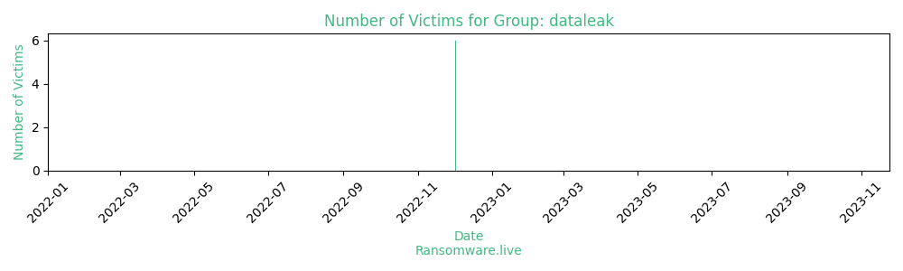

# Profiles for ransomware group : **dataleak**

### URLs
| Title | Available | Last visit | fqdn | Screenshot 
|---|---|---|---|---|
| DataLeak | 🔴 | 22/02/2023 12:58 | `http://woqjumaahi662ka26jzxyx7fznbp4kg3bsjar4b52tqkxgm2pylcjlad.onion` | <a href="https://images.ransomware.live/screenshots/woqjumaahi662ka26jzxyx7fznbp4kg3bsjar4b52tqkxgm2pylcjlad-onion.png" target=_blank>📸</a> | 

### Ransom note
* [📝 2 ransom notes](notes/dataleak)

### Total Attacks Over Time

### Victims

> 6 victims found

| victim | date | Description | Screenshot | 
|---|---|---|---|
| [`nissin.com.br Disclose the compressed package password`](https://google.com/search?q=nissin.com.br+Disclose+the+compressed+package+password) | 02/12/2022 |   |   |
| [`rkw-group.com Disclose the compressed package password`](https://google.com/search?q=rkw-group.com+Disclose+the+compressed+package+password) | 02/12/2022 |   |   |
| [`ni*usa.com`](https://google.com/search?q=ni%2Ausa.com) | 02/12/2022 |   |   |
| [`wiesauplast.de`](https://google.com/search?q=wiesauplast.de) | 02/12/2022 |   |   |
| [`grantweber.com`](https://google.com/search?q=grantweber.com) | 02/12/2022 |   |   |
| [`The Beacon Insurance Company Limited`](https://google.com/search?q=The+Beacon+Insurance+Company+Limited) | 02/12/2022 |   |   |

Last update : _Friday 24/11/2023 13.15 (UTC)_
