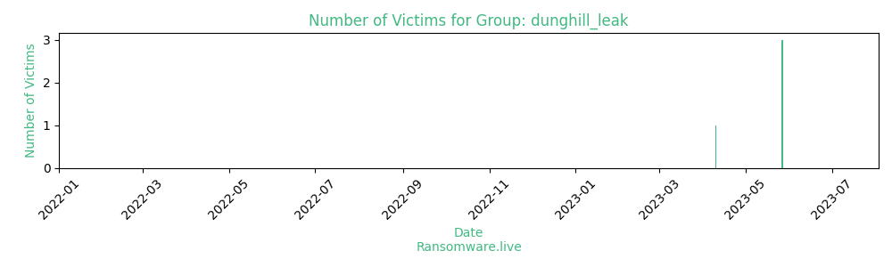

# Profiles for ransomware group : **dunghill_leak**

### URLs
| Title | Available | Last visit | fqdn | Screenshot 
|---|---|---|---|---|
| 404 Not Found | 🟢 | 07/08/2023 11:24 | `http://p66slxmtum2ox4jpayco6ai3qfehd5urgrs4oximjzklxcol264driqd.onion` | <a href="https://images.ransomware.live/screenshots/p66slxmtum2ox4jpayco6ai3qfehd5urgrs4oximjzklxcol264driqd-onion.png" target=_blank>📸</a> | 

### Total Attacks Over Time

### Posts

> 4 victims found

| post | date | Description | Screenshot | 
|---|---|---|---|
| [`Sysco Corporation`](https://google.com/search?q=Sysco+Corporation) | 27/05/2023 | Sysco Corporation is an American multinational corporation involved in marketing and distributing food products, smallwares, kitchen equipment and tabletop items to restaurants, healthcare and educational facilities, hospitality businesses like hotels and inns, and wholesale to other companies that provide foodservice. Sysco is the world's largest broadline food distributor; it has more than 600,000 clients in a wide array of fields. Management consulting is also an integral part of their services. The company operates approximately 330 distribution facilities worldwide; providing service to over 90 countries. | <a href="https://images.ransomware.live/screenshots/posts/ad8a2bba091e6d15c568167e62c78eac.png" target=_blank>📸</a> |
| [`Gentex Corporation`](https://google.com/search?q=Gentex+Corporation) | 27/05/2023 | Gentex Corporation is an American electronics and technology company that develops, designs and manufactures automatic-dimming rear-view mirrors, camera-based driver assistance systems, and other equipment for the global automotive industry. They produce dimmable aircraft windows for the commercial, business and general aviation markets. In addition, the company produces photoelectric smoke detectors, signaling devices, and the HomeLink Wireless Control System for the North American fire protection market. The company's customers are GM, Ford, BMW, Mercedes, Tesla, Airbus, Audi, Toyota, Mazda, Nissan, Honda, Porshe, Bentley and so on. | <a href="https://images.ransomware.live/screenshots/posts/fd3a25cf96e3641c9deaa6ed7cf95b15.png" target=_blank>📸</a> |
| [`ANDRADE GUTIERREZ & ZAGOPE`](https://google.com/search?q=ANDRADE+GUTIERREZ+%26+ZAGOPE) | 27/05/2023 | ANDRADE GUTIERREZ is a Brazilian private multinational conglomerate headquartered in Belo Horizonte. As of 2013, Andrade Gutierrez is the second largest construction company in Brazil with branches in 44 countries and a net income of 8 billion BRL. In the engineering segment, AG operates in the construction of hydroelectric power plants, thermoelectric power plants, nuclear power plants, petrochemical plants, mining, steel industry, refineries, harbors, subways, sanitation and urbanization, airports, railroads, civil engineering. | <a href="https://images.ransomware.live/screenshots/posts/b7401a378e4577f55bd9a74c6d903b7e.png" target=_blank>📸</a> |
| [`Incredible Technologies`](https://google.com/search?q=Incredible+Technologies) | 10/04/2023 | Incredible Technologies is an American developer and manufacturer of coin-operated video games and Class III casino games based in Vernon Hills, Illinois. The company's most common product is the Golden Tee Golf series. IT, Inc. products and gaming software are used in more than 50 counties around the world. |   |

Last update : _Monday 07/08/2023 12.13 (UTC)_
