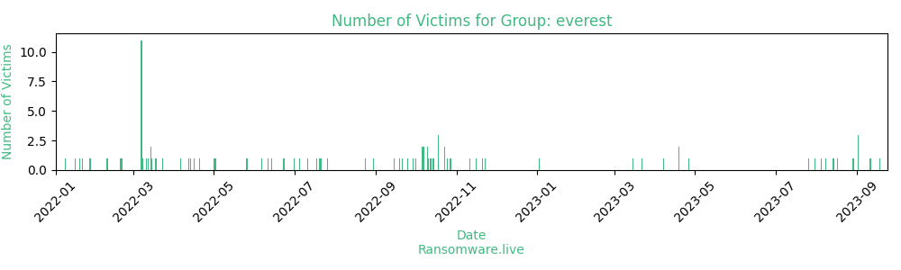

# Profiles for ransomware group : **everest**

> Everest ransom group collects and analyzes information about their victims. They specialize in customer privacy data, financial information, databases, credit card information, and more. The Everest ransom group leaks the victim's data to the darknet and they announced that any victim that will not contact them will suffer from a data leak and they will not delete hist files for future usage.

### External analysis
- https://www.reuters.com/article/us-usa-products-colonial-pipeline-ransom/more-ransomware-websites-disappear-in-aftermath-of-colonial-pipeline-hack-idUSKCN2CX0KT

### URLs
| Title | Available | Last visit | fqdn | Screenshot 
|---|---|---|---|---|
| Everest Ransomware Group | 🟢 | 24/09/2023 13:55 | `http://ransomocmou6mnbquqz44ewosbkjk3o5qjsl3orawojexfook2j7esad.onion` | <a href="https://images.ransomware.live/screenshots/ransomocmou6mnbquqz44ewosbkjk3o5qjsl3orawojexfook2j7esad-onion.png" target=_blank>📸</a> | 

### Total Attacks Over Time

### Victims

> 131 victims found

| victim | date | Description | Screenshot | 
|---|---|---|---|
| [`Agriloja.pt Full Leak`](https://google.com/search?q=Agriloja.pt+Full+Leak) | 18/09/2023 | https://cloud.mail.ru/public/oAe6/ZfPMzZPwehttps://cloud.mail.ru/public/bLE1/ER3UPBi9Uhttps://cloud.mail.ru/public/xm59/WBf27NeNKhttps://cloud.mail.ru/public/AKZg/E5tw3gxhDhttps://cloud.mail.ru/public/CacU/12VBNB24Khttps://cloud.mail.ru/public/MpLj/K5kE7VJZchttps://cloud.mail.ru/public/yF12/XGd6tGSBehttps://cloud.mail.ru/public/GSyK/J6SVDyZxAhttps://cloud.mail.ru/public/1Ew9/m9PUuzTZmhttps://cloud.mail.ru/public/Zgk6/1FGxwV6tPhttps://cloud.mail.ru/public/BUDf/J7udioXHWhttps://cloud.mail.ru/public/7iFf/CnyaBkCmshttps://cloud.mail.ru/public/RUPe/Ubx1DENRQhttps://cloud.mail.ru/public/iN91/pLuzjttZfhttps://cloud.mail.ru/public/7wGE/qhkjwEmw7https://cloud.mail.ru/public/hiYo/jJFAdfV7Jhttps://cloud.mail.ru/public/D5e1/UCjQn5ebNhttps://cloud.mail.ru/public/TQch/zGrk6AHhuhttps://cloud.mail.ru/public/Hw6v/W61TLWzK7https://cloud.mail.ru/public/HC5v/ywcCXabXZhttps://cloud.mail.ru/public/aaDb/vBue6KzoPhttps://cloud.mail.ru/public/zada/pYKKsenJyhttps://cloud.mail.ru/public/Ju7z/ia79hAjdN | <a href="https://images.ransomware.live/screenshots/posts/9a6c068c8afc0e73ea626b19b9849e84.png" target=_blank>📸</a> |
| [`Cmranallolaw.com`](https://google.com/search?q=Cmranallolaw.com) | 11/09/2023 | -Confidential data of a law firm-Tax forms, dl, ssn etc.-Contracts-Personal data of clients-Financial documents-Internal correspondence and emails To fully delete these files, company representatives must contact by September 15, 2023.Otherwise, all this data will be published here and other forums,in the same way, the company’s customers will be notified and receive copies of their files | <a href="https://images.ransomware.live/screenshots/posts/28fcdda205c0ec911513fd9954d19d34.png" target=_blank>📸</a> |
| [`SKF.com`](https://google.com/search?q=SKF.com) | 02/09/2023 | SKF’s network was compromised(by collaboration with Ransomed group) a few days ago. The company continues to be silent about the problem.A representative of the company should contact us immediately and get full picture of what happened, instructions have all been sended in the emails.Otherwise, we will start communicating with your competitors. Revenue : $8.1 Billions […] | <a href="https://images.ransomware.live/screenshots/posts/66d19cc147ec938679e9d3fbab6b63f4.png" target=_blank>📸</a> |
| [`Powersportsmarketing.com`](https://google.com/search?q=Powersportsmarketing.com) | 02/09/2023 | PSM network was compromised(by collaboration with Ransomed group).Our group got 2.2 Tb of intertnal data.Inculduing 43,000 customer records. We already sent a message and there is no jokes. Data Stolen : 2.2 TerabytesData Info : Customer records,Customer InformationTime : Till 4.09.2023 | <a href="https://images.ransomware.live/screenshots/posts/0f5ac4d46641e55e38526969e05d353e.png" target=_blank>📸</a> |
| [`Statefarm.com`](https://google.com/search?q=Statefarm.com) | 02/09/2023 | About 400,000,000 customer insurance records database was stolen from their network.No need to say anything moreWe are will wait for company representative until 05.09.2023 Otherwise all data will be sold to third parties | <a href="https://images.ransomware.live/screenshots/posts/ad26fda2303239e2382990ca6edf9c81.png" target=_blank>📸</a> |
| [`Agriloja pt.3`](https://google.com/search?q=Agriloja+pt.3) | 29/08/2023 | New leakage 3 GB of internal documents .Company must stop ignore our calls and contact us in next 36 hrs.Full package of 1.2 TB uploading and will be published in case of silence.https://dropmefiles.com/******** 69hrZT | <a href="https://images.ransomware.live/screenshots/posts/51f706ef0be718788ef013bede913a88.png" target=_blank>📸</a> |
| [`Agriloja.pt demo-leak`](https://google.com/search?q=Agriloja.pt+demo-leak) | 17/08/2023 | 100 random personal records (from 1400+). Company must contact us in next 24 hrs. Otherwise more personal data will be published in the blog and darknet forums. Download: https://dropmefiles.com/******** 123 | <a href="https://images.ransomware.live/screenshots/posts/ad61aa3e10440a504d0e392ca143a97e.png" target=_blank>📸</a> |
| [`Agriloja.pt`](https://google.com/search?q=Agriloja.pt) | 14/08/2023 | 464574 internal documents and files stolen.1.2 TBSQL DBs, Email Archives, Personal information,employee data,,IDs,various company documents… To restore damaged system and prevent data from publication company’s representative should contact us in next 72 hrs. Full filetree can be provided as a proof. | <a href="https://images.ransomware.live/screenshots/posts/3dd4b7526a4dcb8022a0576d82b019ad.png" target=_blank>📸</a> |
| [`ZESA Holdings`](https://google.com/search?q=ZESA+Holdings) | 08/08/2023 | Today, the servers of the entire infrastructure of ZESA HOLDINGS (90% Country Electricity Manufacture ) were attacked, including divisionsZETDCZENTPowertelICS, IPMP, Smartvend ,various oracle servers, big part of backups were also attacked.Terabytes of internal (and interesting) data has been exfiltrated to our servers Internal financial data (Including WorldBank’s data and Indian Bank transactions and documents) Various […] | <a href="https://images.ransomware.live/screenshots/posts/ed22462c2c793bbd943a15cd9eac110a.png" target=_blank>📸</a> |
| [`Kovair Software Data Leak`](https://google.com/search?q=Kovair+Software+Data+Leak) | 05/08/2023 | The set dates are out, so we post the entire archive Part1 https://dropmefiles.com/******** &#B”a3Arcj}eOfoQ==Fh | <a href="https://images.ransomware.live/screenshots/posts/e53d680d8acf307c7046612aa38bc090.png" target=_blank>📸</a> |
| [`Great Opportunity to monetize your corporate access`](https://google.com/search?q=Great+Opportunity+to+monetize+your+corporate+access) | 31/07/2023 | Team looking for new partners with access to corporate networks.Fast work, good share. The offer will close on August 7. First come first served jabber:everestgroup@exploit.imeverestgroup@thesecure.biz email:everestransomteam@onionmail.orgeverestblog@cock.li | <a href="https://images.ransomware.live/screenshots/posts/e69a9de0b499e2da007f54294967fcf3.png" target=_blank>📸</a> |
| [`Kovair Software`](https://google.com/search?q=Kovair+Software) | 26/07/2023 | 200 GB of internal files (Kovair.com) were stolen from the company’s servers. The files contain:– Project Source Codes– Personal data of employees– Various internal work documents To fully restore the system and delete these files, company representatives must contact by August 3, 2023.Otherwise, all this data will be published here and other forums,in the same […] | <a href="https://images.ransomware.live/screenshots/posts/d85e524c1e77edda3c9fabb7c2602700.png" target=_blank>📸</a> |
| [`US District Court / Law company`](https://google.com/search?q=US+District+Court+%2F+Law+company) | 26/04/2023 | On sale access to the network US District CourtEmployee access,full controlAV: NoNetwork access of a lawyer with tons various confidential documents is included in this sale. Internal correspondence,tax,banks,ssn,dl,court cases. State IL.Price 15,000$Payment: btc,xmrContact email: everestransomteam@onionmail.org or jabber: everestgroup@exploit.im,everestgroup@thesecure.biz | <a href="https://images.ransomware.live/screenshots/posts/7e9314b4d98292d8aa8be759a1601d0c.png" target=_blank>📸</a> |
| [`US District Court IL / On sale`](https://google.com/search?q=US+District+Court+IL+%2F+On+sale) | 19/04/2023 | On sale access to the network US District Court Employee access,full control AV: No Network access of a lawyer with tons various confidential documents is included in this sale Contact email: everestransomteam@onionmail.org or jabber: everestgroup@exploit.im,everestgroup@thesecure.biz | <a href="https://images.ransomware.live/screenshots/posts/1803df0eefaea05b2a4bec54bed61f17.png" target=_blank>📸</a> |
| [`US District Court / On sale`](https://google.com/search?q=US+District+Court+%2F+On+sale) | 19/04/2023 |  |   |
| [`MultiCareInc pt.2`](https://google.com/search?q=MultiCareInc+pt.2) | 07/04/2023 |  | <a href="https://images.ransomware.live/screenshots/posts/db082024813fc9d214f0e3a3f11491ca.png" target=_blank>📸</a> |
| [`US District Court`](https://google.com/search?q=US+District+Court) | 22/03/2023 |  |   |
| [`NRG Innovations DataBase Leak`](https://google.com/search?q=NRG+Innovations+DataBase+Leak) | 15/03/2023 | Includes internal correspondence,financial documents,tax documents,accounting,SSN,DLThe owners of the company were notified of the incident in person and of the time frame.Download:https://dropmefiles.com.ua/ua/Z4aW2https://dropmefiles.com.ua/ua/******* site pwd 868274903rar pwd 8392GLDKLA82@ | <a href="https://images.ransomware.live/screenshots/posts/8ed91a332bdb7fb4d7fb12673f891ee5.png" target=_blank>📸</a> |
| [`Aeronautics company Canada  UTC Aerospace Systems, Bombardier, NASA partners`](https://google.com/search?q=Aeronautics+company+Canada+%7C+UTC+Aerospace+Systems%2C+Bombardier%2C+NASA+partners) | 03/01/2023 |  |   |
| [`Aeronautics company Canada / UTC Aerospace Systems, Bombardier aerospace, NASA partners`](https://google.com/search?q=Aeronautics+company+Canada+%2F+UTC+Aerospace+Systems%2C+Bombardier+aerospace%2C+NASA+partners) | 23/11/2022 |   |   |
| [`Aeronautics company Canada / UTC Aerospace Systems, Bombardier aerospace partners`](https://google.com/search?q=Aeronautics+company+Canada+%2F+UTC+Aerospace+Systems%2C+Bombardier+aerospace+partners) | 21/11/2022 |   |   |
| [`Aeronautics company Canada / Production of parts for aircraft engines`](https://google.com/search?q=Aeronautics+company+Canada+%2F+Production+of+parts+for+aircraft+engines) | 16/11/2022 |   |   |
| [`Aeronautics company Canada`](https://google.com/search?q=Aeronautics+company+Canada) | 11/11/2022 |   |   |
| [`AT&#038;T`](https://google.com/search?q=AT%26%23038%3BT) | 28/10/2022 |   |   |
| [`Stages Pediatric Care DataBase on Sale`](https://google.com/search?q=Stages+Pediatric+Care+DataBase+on+Sale) | 27/10/2022 |   |   |
| [`Rundle Eye Care DataBase Leak`](https://google.com/search?q=Rundle+Eye+Care+DataBase+Leak) | 25/10/2022 |   |   |
| [`Stages Pediatric Care New 40 personal records`](https://google.com/search?q=Stages+Pediatric+Care+New+40+personal+records) | 23/10/2022 |   | <a href="https://images.ransomware.live/screenshots/posts/9685214156a71922c1fd5e600d46b195.png" target=_blank>📸</a> |
| [`Stages Pediatric Care New 250 personal records`](https://google.com/search?q=Stages+Pediatric+Care+New+250+personal+records) | 23/10/2022 |   | <a href="https://images.ransomware.live/screenshots/posts/13473943c82bdb5a09d095788863621f.png" target=_blank>📸</a> |
| [`MultiCareInc pt.3`](https://google.com/search?q=MultiCareInc+pt.3) | 18/10/2022 |   |   |
| [`MultiCareInc DataBase Leak`](https://google.com/search?q=MultiCareInc+DataBase+Leak) | 18/10/2022 |   |   |
| [`Stages Pediatric Care new personal data`](https://google.com/search?q=Stages+Pediatric+Care+new+personal+data) | 18/10/2022 |   |   |
| [`MultiCare DataBase Leak`](https://google.com/search?q=MultiCare+DataBase+Leak) | 15/10/2022 |   |   |
| [`Electricity company / Air Defense Solutions company`](https://google.com/search?q=Electricity+company+%2F+Air+Defense+Solutions+company) | 14/10/2022 |   |   |
| [`Electricity company pt.3`](https://google.com/search?q=Electricity+company+pt.3) | 13/10/2022 |   |   |
| [`MultiCare pt.3`](https://google.com/search?q=MultiCare+pt.3) | 12/10/2022 |   |   |
| [`Stages Pediatric Care Update`](https://google.com/search?q=Stages+Pediatric+Care+Update) | 11/10/2022 |   |   |
| [`Electricity company pt.2`](https://google.com/search?q=Electricity+company+pt.2) | 10/10/2022 |   |   |
| [`RS.GOV.BR/Government Brazil`](https://google.com/search?q=RS.GOV.BR%2FGovernment+Brazil) | 10/10/2022 |   |   |
| [`Electricity company`](https://google.com/search?q=Electricity+company) | 07/10/2022 |   |   |
| [`SPERONI S.P.A / Data Lamborghini, Ferrari, Fiat Group, VAG, Brembo`](https://google.com/search?q=SPERONI+S.P.A+%2F+Data+Lamborghini%2C+Ferrari%2C+Fiat+Group%2C+VAG%2C+Brembo) | 07/10/2022 |   |   |
| [`Rundle Eye Care`](https://google.com/search?q=Rundle+Eye+Care) | 06/10/2022 |   |   |
| [`MultiCare pt.2`](https://google.com/search?q=MultiCare+pt.2) | 06/10/2022 |   |   |
| [`MultiCare Home Health`](https://google.com/search?q=MultiCare+Home+Health) | 01/10/2022 |   |   |
| [`Stages Pediatric Care`](https://google.com/search?q=Stages+Pediatric+Care) | 29/09/2022 |   |   |
| [`FederalBank/Fedfina DataBase Leak`](https://google.com/search?q=FederalBank%2FFedfina+DataBase+Leak) | 25/09/2022 |   |   |
| [`Ministerio de Economía Argentina`](https://google.com/search?q=Ministerio+de+Econom%C3%ADa+Argentina) | 21/09/2022 |   |   |
| [`Government Brazil`](https://google.com/search?q=Government+Brazil) | 19/09/2022 |   |   |
| [`FederalBank/Fedfina.part5`](https://google.com/search?q=FederalBank%2FFedfina.part5) | 15/09/2022 |   |   |
| [`GOV Brazil`](https://google.com/search?q=GOV+Brazil) | 30/08/2022 |   |   |
| [`Olamgroup`](https://google.com/search?q=Olamgroup) | 24/08/2022 |   |   |
| [`FederalBank/Fedfina.part4`](https://google.com/search?q=FederalBank%2FFedfina.part4) | 26/07/2022 |   |   |
| [`FederalBank/Fedfina.part3`](https://google.com/search?q=FederalBank%2FFedfina.part3) | 21/07/2022 |   |   |
| [`FederalBank/Fedfina.part2`](https://google.com/search?q=FederalBank%2FFedfina.part2) | 20/07/2022 |   |   |
| [`FederalBank / Fedfina`](https://google.com/search?q=FederalBank+%2F+Fedfina) | 18/07/2022 |   |   |
| [`Pontal Engineering Constructions and Developments Files Leak`](https://google.com/search?q=Pontal+Engineering+Constructions+and+Developments+Files+Leak) | 11/07/2022 |   |   |
| [`Pontal Engineering Constructions and Developments`](https://google.com/search?q=Pontal+Engineering+Constructions+and+Developments) | 05/07/2022 |   |   |
| [`Amalfitana Gas Srl`](https://google.com/search?q=Amalfitana+Gas+Srl) | 01/07/2022 |   |   |
| [`FAYAT`](https://google.com/search?q=FAYAT) | 23/06/2022 |   |   |
| [`Metek PLC Files Leak`](https://google.com/search?q=Metek+PLC+Files+Leak) | 14/06/2022 |   |   |
| [`Metek Plc`](https://google.com/search?q=Metek+Plc) | 11/06/2022 |   |   |
| [`VTVCAB`](https://google.com/search?q=VTVCAB) | 06/06/2022 |   |   |
| [`Lamborghini, Ferrari, Fiat Group, VAG, Brembo And data from other automobile concerns`](https://google.com/search?q=Lamborghini%2C+Ferrari%2C+Fiat+Group%2C+VAG%2C+Brembo+And+data+from+other+automobile+concerns) | 26/05/2022 |   |   |
| [`Limited May Access Sale`](https://google.com/search?q=Limited+May+Access+Sale) | 02/05/2022 |   |   |
| [`Collegiate sports medicine`](https://google.com/search?q=Collegiate+sports+medicine) | 01/05/2022 |   |   |
| [`Reckitt Benckiser`](https://google.com/search?q=Reckitt+Benckiser) | 20/04/2022 |   |   |
| [`Standard Building Supplies Ltd.`](https://google.com/search?q=Standard+Building+Supplies+Ltd.) | 16/04/2022 |   |   |
| [`Standard Building Supplies Ltd`](https://google.com/search?q=Standard+Building+Supplies+Ltd) | 13/04/2022 |   |   |
| [`Supplies Company Data Leak in British Columbia, Canada`](https://google.com/search?q=Supplies+Company+Data+Leak+in+British+Columbia%2C+Canada) | 12/04/2022 |   |   |
| [`United States of America GOV`](https://google.com/search?q=United+States+of+America+GOV) | 06/04/2022 |   |   |
| [`Ministry of Economy and Finance of Peru`](https://google.com/search?q=Ministry+of+Economy+and+Finance+of+Peru) | 23/03/2022 |   |   |
| [`South Africa Electricity company`](https://google.com/search?q=South+Africa+Electricity+company) | 18/03/2022 |   |   |
| [`Instituto Nacional de Tecnología Agropecuaria`](https://google.com/search?q=Instituto+Nacional+de+Tecnolog%C3%ADa+Agropecuaria) | 15/03/2022 |   |   |
| [`UK GOV`](https://google.com/search?q=UK+GOV) | 14/03/2022 |   |   |
| [`News`](https://google.com/search?q=News) | 14/03/2022 |   |   |
| [`XEFI / Neocyber`](https://google.com/search?q=XEFI+%2F+Neocyber) | 12/03/2022 |   |   |
| [`SPERONI SpA`](https://google.com/search?q=SPERONI+SpA) | 11/03/2022 |   |   |
| [`XEFI`](https://google.com/search?q=XEFI) | 08/03/2022 |   | <a href="https://images.ransomware.live/screenshots/posts/25faeead6d3d0d0cd6351f5debd5c3dd.png" target=_blank>📸</a> |
| [`Turner Construction Company`](https://google.com/search?q=Turner+Construction+Company) | 07/03/2022 |   |   |
| [`IDFC FIRST Bank`](https://google.com/search?q=IDFC+FIRST+Bank) | 07/03/2022 |   |   |
| [`Ledcor`](https://google.com/search?q=Ledcor) | 07/03/2022 |   |   |
| [`BEAUTYWEST, INC.`](https://google.com/search?q=BEAUTYWEST%2C+INC.) | 07/03/2022 |   |   |
| [`Gershon Biegeleisen &#038; Co`](https://google.com/search?q=Gershon+Biegeleisen+%26%23038%3B+Co) | 07/03/2022 |   |   |
| [`Backus, Meyer &#038; Branch, LLP`](https://google.com/search?q=Backus%2C+Meyer+%26%23038%3B+Branch%2C+LLP) | 07/03/2022 |   |   |
| [`Greenberg &#038; Stein New York City Personal Injury Lawyers`](https://google.com/search?q=Greenberg+%26%23038%3B+Stein+New+York+City+Personal+Injury+Lawyers) | 07/03/2022 |   |   |
| [`Law Offices of Brandon Sua &#038; Associates`](https://google.com/search?q=Law+Offices+of+Brandon+Sua+%26%23038%3B+Associates) | 07/03/2022 |   |   |
| [`Campbell Sales and Service, Inc`](https://google.com/search?q=Campbell+Sales+and+Service%2C+Inc) | 07/03/2022 |   |   |
| [`Federal land inc.`](https://google.com/search?q=Federal+land+inc.) | 07/03/2022 |   |   |
| [`Centro Hospitalar de Setúbal`](https://google.com/search?q=Centro+Hospitalar+de+Set%C3%BAbal) | 07/03/2022 |   |   |
| [`Signum`](https://google.com/search?q=Signum) | 20/02/2022 |   |   |
| [`Various accesses on sale`](https://google.com/search?q=Various+accesses+on+sale) | 19/02/2022 |   |   |
| [`Weir & Partners LLP`](https://google.com/search?q=Weir+%26+Partners+LLP) | 09/02/2022 |   |   |
| [`Florida lawyer&#8217;s data leaked`](https://google.com/search?q=Florida+lawyer%26%238217%3Bs+data+leaked) | 27/01/2022 |   |   |
| [`Gardenworks`](https://google.com/search?q=Gardenworks) | 21/01/2022 |   |   |
| [`AFG Canada`](https://google.com/search?q=AFG+Canada) | 19/01/2022 |   |   |
| [`Partnership`](https://google.com/search?q=Partnership) | 16/01/2022 |   |   |
| [`Huhtamaki`](https://google.com/search?q=Huhtamaki) | 08/01/2022 |   |   |
| [`SPERONI SPA`](https://google.com/search?q=SPERONI+SPA) | 21/12/2021 |   |   |
| [`Jeffmoss`](https://google.com/search?q=Jeffmoss) | 09/12/2021 |   |   |
| [`Ktmtriallaw`](https://google.com/search?q=Ktmtriallaw) | 09/12/2021 |   |   |
| [`Saand`](https://google.com/search?q=Saand) | 06/12/2021 |   |   |
| [`Seldin`](https://google.com/search?q=Seldin) | 04/12/2021 |   |   |
| [`Black Friday has arrived`](https://google.com/search?q=Black+Friday+has+arrived) | 27/11/2021 |   |   |
| [`Società Italiana degli Autori ed Editori / Information updated`](https://google.com/search?q=Societ%C3%A0+Italiana+degli+Autori+ed+Editori+%2F+Information+updated) | 23/11/2021 |   |   |
| [`Argentina GOV`](https://google.com/search?q=Argentina+GOV) | 23/11/2021 |   |   |
| [`Charlie Hebdo`](https://google.com/search?q=Charlie+Hebdo) | 22/11/2021 |   |   |
| [`MINISTRY OF ECONOMY AND FINANCE Peru`](https://google.com/search?q=MINISTRY+OF+ECONOMY+AND+FINANCE+Peru) | 20/11/2021 |   |   |
| [`Police Brazil`](https://google.com/search?q=Police+Brazil) | 15/11/2021 |   |   |
| [`Società Italiana degli Autori ed Editori / Data on sale`](https://google.com/search?q=Societ%C3%A0+Italiana+degli+Autori+ed+Editori+%2F+Data+on+sale) | 13/11/2021 |   |   |
| [`Cabinet Remy Le Bonnois / Data on sale / Charlie Hebdo`](https://google.com/search?q=Cabinet+Remy+Le+Bonnois+%2F+Data+on+sale+%2F+Charlie+Hebdo) | 13/11/2021 |   |   |
| [`Cabinet Remy Le Bonnois / Data on sale`](https://google.com/search?q=Cabinet+Remy+Le+Bonnois+%2F+Data+on+sale) | 11/11/2021 |   |   |
| [`Società Italiana degli Autori ed Editori`](https://google.com/search?q=Societ%C3%A0+Italiana+degli+Autori+ed+Editori) | 20/10/2021 |   |   |
| [`U.S. GOV`](https://google.com/search?q=U.S.+GOV) | 05/10/2021 |   |   |
| [`Kes`](https://google.com/search?q=Kes) | 01/10/2021 |   |   |
| [`PRECREDIT`](https://google.com/search?q=PRECREDIT) | 28/09/2021 |   |   |
| [`Steel Projects`](https://google.com/search?q=Steel+Projects) | 17/09/2021 |   |   |
| [`Irish Pioneer works`](https://google.com/search?q=Irish+Pioneer+works) | 13/09/2021 |   |   |
| [`VIVA Formwork and Scaffolding`](https://google.com/search?q=VIVA+Formwork+and+Scaffolding) | 13/09/2021 |   |   |
| [`Hörmanseder Stahlbau GmbH`](https://google.com/search?q=H%C3%B6rmanseder+Stahlbau+GmbH) | 13/09/2021 |   |   |
| [`Southland`](https://google.com/search?q=Southland) | 13/09/2021 |   |   |
| [`Xmedicalpicture`](https://google.com/search?q=Xmedicalpicture) | 13/09/2021 |   |   |
| [`Andel`](https://google.com/search?q=Andel) | 13/09/2021 |   |   |
| [`GROUPE CONFIANCE IMMOBILIER`](https://google.com/search?q=GROUPE+CONFIANCE+IMMOBILIER) | 09/09/2021 |   |   |
| [`Cabinet Remy Le Bonnois`](https://google.com/search?q=Cabinet+Remy+Le+Bonnois) | 09/09/2021 |   |   |
| [`XEFI / Part 2`](https://google.com/search?q=XEFI+%2F+Part+2) | 09/09/2021 |   |   |
| [`Сompilation of lawyers France`](https://google.com/search?q=%D0%A1ompilation+of+lawyers+France) | 09/09/2021 |   |   |
| [`AIC STEEL`](https://google.com/search?q=AIC+STEEL) | 09/09/2021 |   |   |
| [`Weir & Partners LLP / Part 2`](https://google.com/search?q=Weir+%26+Partners+LLP+%2F+Part+2) | 09/09/2021 |   |   |
| [`InfraBuild`](https://google.com/search?q=InfraBuild) | 09/09/2021 |   |   |
| [`Tampa Tank INC`](https://google.com/search?q=Tampa+Tank+INC) | 09/09/2021 |   |   |
| [`Alispharm`](https://google.com/search?q=Alispharm) | 09/09/2021 |   |   |
| [`Orha Muvek`](https://google.com/search?q=Orha+Muvek) | 09/09/2021 |   |   |

Last update : _Sunday 24/09/2023 14.39 (UTC)_
