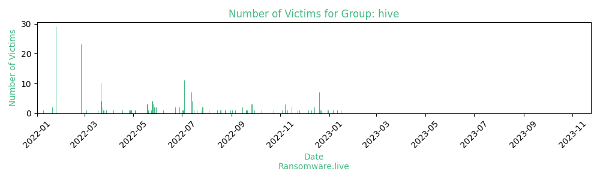

# Profiles for ransomware group : **hive**

> Hive is a strain of ransomware that was first discovered in June 2021. Hive was designed to be used by Ransomware-as-a-service providers, to enable novice cyber-criminals to launch ransomware attacks on healthcare providers, energy providers, charities, and retailers across the globe.In 2022 there was a switch from GoLang to Rust.

_`US announces it seized Hive ransomware gang’s leak sites and decryption keys`_

### External analysis
- https://arxiv.org/pdf/2202.08477.pdf

- https://blog.group-ib.com/hive

- https://blog.talosintelligence.com/2022/05/conti-and-hive-ransomware-operations.html

- https://github.com/reecdeep/HiveV5_file_decryptor

- https://github.com/rivitna/Malware/tree/main/Hive

- https://krebsonsecurity.com/2023/05/russian-hacker-wazawaka-indicted-for-ransomware/

- https://labs.sentinelone.com/hive-attacks-analysis-of-the-human-operated-ransomware-targeting-healthcare/

- https://lifars.com/2022/02/how-to-decrypt-the-files-encrypted-by-the-hive-ransomware/

- https://mandiant.widen.net/s/pkffwrbjlz/m-trends-2023

- https://query.prod.cms.rt.microsoft.com/cms/api/am/binary/RE54L7v

🔎 `ransomware.live`has an active  parser for indexing hive's victims

### URLs
| Title | Available | Last visit | fqdn | Screenshot 
|---|---|---|---|---|
| This domain has been seized | 🔴 | 27/01/2023 04:45 | `http://hiveleakdbtnp76ulyhi52eag6c6tyc3xw7ez7iqy6wc34gd2nekazyd.onion` | <a href="https://images.ransomware.live/screenshots/hiveleakdbtnp76ulyhi52eag6c6tyc3xw7ez7iqy6wc34gd2nekazyd-onion.png" target=_blank>📸</a> | 
| This domain has been seized | 🔴 | 27/01/2023 06:47 | `http://hivecust6vhekztbqgdnkks64ucehqacge3dij3gyrrpdp57zoq3ooqd.onion` | <a href="https://images.ransomware.live/screenshots/hivecust6vhekztbqgdnkks64ucehqacge3dij3gyrrpdp57zoq3ooqd-onion.png" target=_blank>📸</a> | 
| This domain has been seized | 🔴 | 27/01/2023 06:47 | `http://hiveapi4nyabjdfz2hxdsr7otrcv6zq6m4rk5i2w7j64lrtny4b7vjad.onion` | <a href="https://images.ransomware.live/screenshots/hiveapi4nyabjdfz2hxdsr7otrcv6zq6m4rk5i2w7j64lrtny4b7vjad-onion.png" target=_blank>📸</a> | 

### Ransom note
* [📝 2 ransom notes](notes/hive)

### Crypto wallets
* 💰 <a href="/#/crypto/hive.md">Crypto wallet(s) available</a>

### Negotiation chats

| Name | Link |
|---|---|
|20211004|  <a href="/#/negotiation/hive/20211004.html"> 💬 </a> |
|20211005|  <a href="/#/negotiation/hive/20211005.html"> 💬 </a> |
|20211026|  <a href="/#/negotiation/hive/20211026.html"> 💬 </a> |
|20211102|  <a href="/#/negotiation/hive/20211102.html"> 💬 </a> |
|20211113|  <a href="/#/negotiation/hive/20211113.html"> 💬 </a> |
|20211126|  <a href="/#/negotiation/hive/20211126.html"> 💬 </a> |
|20211213|  <a href="/#/negotiation/hive/20211213.html"> 💬 </a> |
|20211220|  <a href="/#/negotiation/hive/20211220.html"> 💬 </a> |

### Total Attacks Over Time

### Victims

> 206 victims found

| victim | date | Description | Screenshot | 
|---|---|---|---|
| [`R C Stevens Construction`](https://rcstevens.com/%20) | 16/01/2023 | As commercial construction specialists in Orlando, we provide new construction and renovation services with an emphasis on design/build. R. C. Stevens is qualified to design and construct any type of commercial construction project in Orlando. We offer all of the necessary resources to meet each client’s specific project needs&nbsp;for design and construction services related to manufacturing/industrial,&nbsp;commercial,&nbsp;healthcare,&nbsp;financial,&nbsp;religious, and&nbsp;renovations.  At. R. C. Stevens, the spirit of innovation can be found in each and every Orlando commercial construction project we do.  Every team member at R.C. Stevens strives daily to uphold the founding principles of quality and integrity as having long been a company tradition since 1926. |   |
| [`G.W. Becker`](https://gwbcrane.com) | 11/01/2023 | ***** DATA IS COMING SOON ****  G.W. Becker, Inc. is a full service, single source, provider of choice for quality overhead crane products and solutions. Family owned since 1980, we have grown from a local overhead crane parts supplier to a recognized industry leader offering a full spectrum of overhead crane related products and services throughout North America.  Proud to be an Executive Member of the Crane Manufacturer’s Association of America, we design and manufacture custom overhead cranes, hoists and components to CMAA Specifications (Class “A” through “F”) or AIST Technical Report #6. We utilize our knowledgeable in-house team of mechanical, structural and electrical engineers to offer application assistance, custom design engineering and manufacturing of overhead crane products with our customers’ needs first and foremost.  Empowered with highly trained and qualified technicians, G.W. Becker, Inc. provides self-performing installations, inspections and field service repairs for all makes and models of overhead cranes; providing compliance with local regulations and ensuring a safe and productive material handling operation.  Staying true to our mission and values, we strive to understand our customers’ needs and deliver specialized expertise and long-term planning solutions for the unique challenges of purchasing and maintaining overhead crane and hoist equipment.  |   |
| [`Consulate Health Care`](https://consulatehc.com/) | 06/01/2023 | Consulate Health Care is a leading provider of senior healthcare services, specializing in post-acute care. We offer services ranging from comprehensive short-term rehabilitation and transitional care to Alzheimer’s and dementia care. Consulate Health Care began as a small provider in Cheswick, PA with a strong focus on patient needs. We haven’t waivered from that focus, which has strengthened our family and allows us to sustain jobs in many communities, create rigorous systems of care and deploy technology that makes it easier to understand patient needs. Even as we’ve grown to provide services across 5 states, it’s the little things we do while fulfilling our mission statement of "Providing Service with Our Hearts and Hands" that really makes the difference. From visiting with our patients while they eat, to pulling up the sheets to just the right height, our employees care for patients like family, not because it’s their job, but because it’s their calling.   |   |
| [`Centro Médico Virgen De La Caridad`](https://cmvcaridad.com) | 31/12/2022 | Grupo Centro Médico Virgen de la Caridad, a private health company with its own identity that was born in 1981 in the city of Cartagena, where it is headquartered, currently has 2 hospitals (Cartagena and Caravaca), 20 polyclinics, 23 physiotherapy clinics and 16 dental clinics , which are distributed throughout different parts of the Region of Murcia and Orihuela Costa. In addition, the group has 1 aesthetic clinic (Cartagena), plus 1 Ophthalmological clinic (Cartagena).  The health entity that is committed to global, close, accessible and highly qualified care, is made up of more than 600 professionals (including health, administrative and patient care personnel) whose purpose is to offer a wide range of services on a daily basis under the better and more complete health care.  All our centers are equipped with the most advanced technology, an essential support, which together with our highly qualified human capital, has made us, over almost 40 years of activity, a benchmark in private medicine in the Region of Murcia.  We welcome you to Grupo Centro Médico Virgen de la Caridad, where new challenges are not a problem but a challenge for growth and improvement in private healthcare . |   |
| [`Camst Group`](https://www.camstgroup.com%20) | 30/12/2022 | Camst Group is a company that specializes in restaurant services. It offers catering & banqueting, restaurant & bars, catering at the fair, and collective cater. |   |
| [`MHMR Authority Of Brazos Valley`](https://www.mhmrabv.org) | 22/12/2022 | The MHMR Authority of Brazos Valley is a public non-profit community MHMR center. Through the Texas Department of State Health Services and Texas Department of |   |
| [`Alvaria`](https://www.alvaria.com) | 21/12/2022 | Alvaria, (pronounced: ahl-vahr-ee-uh), a global leader delivering optimized customer experience and workforce engagement software and cloud services technology solutions. |   |
| [`Interface`](https://www.interface.com) | 20/12/2022 | **** 30% OF THE DATA IS COMING SOON ****  Interface, Inc. is a global flooring company specializing in carbon neutral carpet tile and resilient flooring.  Stocks: NASDAQ: TILE Equity: IF6N.F, IF6N.BE, IF6N.HA |   |
| [`North Idaho College`](https://google.com/search?q=North+Idaho+College) | 20/12/2022 | Founded in 1933, North Idaho College is a community college in Coeur d'Alene, Idaho. |   |
| [`Innovative Education Management`](https://google.com/search?q=Innovative+Education+Management) | 20/12/2022 | Innovative Education Management (IEM) has been successfully developing and operating California charter schools since 1998 |   |
| [`Dixons Allerton Academy`](https://google.com/search?q=Dixons+Allerton+Academy) | 20/12/2022 | Dixons Allerton Academy (formerly Rhodesway Academy) is a coeducational all-through school and sixth form located in Allerton area of the City of Bradford, in the English county of West Yorkshire. |   |
| [`City Of Huntsville, Texas`](https://google.com/search?q=City+Of+Huntsville%2C+Texas) | 20/12/2022 | Huntsville Texas is a city in the Texas Hill Country. |   |
| [`JAKKS Pacific Inc`](https://google.com/search?q=JAKKS+Pacific+Inc) | 20/12/2022 | JAKKS Pacific, Inc. is a multi-brand company that, since 1995, has been designing, developing, producing and marketing toys, leisure products and writing instruments for children and adults around the world. The company has become a top six U.S. player in the toys and leisure products sector through product development, licensing agreements and strategic acquisitions. We believe our growth strategy is unique and built upon a concentrated effort to spread earnings across all four quarters. We have accomplished that by expanding and 'counter-seasonalizing' our product lines, adding new retail outlets and leveraging our product development and merchandising expertise on products with staying power. About JAKKS Pacific, Inc. JAKKS Pacific, Inc. is a leading designer, manufacturer and marketer of toys and consumer products sold throughout the world, with its headquarters in Santa Monica, California. JAKKS Pacific’s popular proprietary brands include: Fly Wheels®, Perfectly Cute®, ReDo Skateboard Co.®, X Power Dozer®, Disguise®, Weee-Do™ and a wide range of entertainment-inspired products featuring premier licensed properties. Through JAKKS Cares, the company’s commitment to philanthropy, JAKKS is helping to make a positive impact on the lives of children. Visit us at www.jakks.com and follow us on Instagram (@jakkstoys), Twitter (@jakkstoys) and Facebook (JAKKS Pacific). |   |
| [`Stolle Machinery`](https://google.com/search?q=Stolle+Machinery) | 20/12/2022 | **** ALL BLUEPRINTS OF ALL PRODUCT LINES WILL BE AVAILABLE SOON **** Stolle is the world's leading supplier of two piece can and end-making machinery for the global canmaking industry. Our high speed machines can be found in can plants around the world performing the value-added functions of the canmaking process. |   |
| [`Mark-Taylor`](https://google.com/search?q=Mark-Taylor) | 14/12/2022 |   |   |
| [`Expand Group`](https://google.com/search?q=Expand+Group) | 14/12/2022 |   |   |
| [`KNOX College`](https://google.com/search?q=KNOX+College) | 10/12/2022 |   |   |
| [`INTERSPORT France`](https://google.com/search?q=INTERSPORT+France) | 06/12/2022 |   |   |
| [`Guilford College`](https://google.com/search?q=Guilford+College) | 25/11/2022 |   |   |
| [`Norman Public Schools`](https://google.com/search?q=Norman+Public+Schools) | 23/11/2022 |   |   |
| [`Hydro-Gear & Agri-Fab`](https://google.com/search?q=Hydro-Gear+%26+Agri-Fab) | 15/11/2022 |   |   |
| [`LCMH`](https://google.com/search?q=LCMH) | 15/11/2022 |   |   |
| [`MCCROSSAN`](https://google.com/search?q=MCCROSSAN) | 10/11/2022 |   |   |
| [`APM Terminals`](https://google.com/search?q=APM+Terminals) | 08/11/2022 |   |   |
| [`TCQ`](https://google.com/search?q=TCQ) | 07/11/2022 |   |   |
| [`ROYAL GATEWAY CO., LTD`](https://google.com/search?q=ROYAL+GATEWAY+CO.%2C+LTD) | 07/11/2022 |   |   |
| [`Cornwell Quality Tools`](https://google.com/search?q=Cornwell+Quality+Tools) | 07/11/2022 |   |   |
| [`Landi Renzo`](https://google.com/search?q=Landi+Renzo) | 03/11/2022 |   |   |
| [`Tata Power`](https://google.com/search?q=Tata+Power) | 24/10/2022 |   |   |
| [`Município De Loures`](https://google.com/search?q=Munic%C3%ADpio+De+Loures) | 09/10/2022 |   |   |
| [`Mansfield Independent School District (MISD)`](https://google.com/search?q=Mansfield+Independent+School+District+%28MISD%29) | 30/09/2022 |   |   |
| [`Southwell, Inc.`](https://google.com/search?q=Southwell%2C+Inc.) | 27/09/2022 |   |   |
| [`Hendry Regional Medical Center`](https://google.com/search?q=Hendry+Regional+Medical+Center) | 27/09/2022 |   |   |
| [`JANMARINI`](https://google.com/search?q=JANMARINI) | 27/09/2022 |   |   |
| [`TAKAO-UK`](https://google.com/search?q=TAKAO-UK) | 26/09/2022 |   |   |
| [`GFG`](https://google.com/search?q=GFG) | 26/09/2022 |   |   |
| [`TSMTU`](https://google.com/search?q=TSMTU) | 26/09/2022 |   |   |
| [`BHARBERT`](https://google.com/search?q=BHARBERT) | 21/09/2022 |   |   |
| [`Sigmund Software`](https://google.com/search?q=Sigmund+Software) | 20/09/2022 |   |   |
| [`New York Racing Association`](https://google.com/search?q=New+York+Racing+Association) | 19/09/2022 |   |   |
| [`Bell Technical Solutions`](https://google.com/search?q=Bell+Technical+Solutions) | 15/09/2022 |   |   |
| [`FONTAINEBLEAU`](https://google.com/search?q=FONTAINEBLEAU) | 15/09/2022 |   |   |
| [`California-Oregon Telecommunications Company`](https://google.com/search?q=California-Oregon+Telecommunications+Company) | 06/09/2022 |   |   |
| [`Eurocell`](https://google.com/search?q=Eurocell) | 02/09/2022 |   |   |
| [`NCG Medical`](https://google.com/search?q=NCG+Medical) | 31/08/2022 |   |   |
| [`Altice International`](https://google.com/search?q=Altice+International) | 25/08/2022 |   |   |
| [`Baton Rouge General`](https://google.com/search?q=Baton+Rouge+General) | 24/08/2022 |   |   |
| [`Reiter Affiliated Companies`](https://google.com/search?q=Reiter+Affiliated+Companies) | 19/08/2022 |   |   |
| [`WOOTTON ACADEMY TRUST`](https://google.com/search?q=WOOTTON+ACADEMY+TRUST) | 18/08/2022 |   |   |
| [`TriState HVAC Equipment`](https://google.com/search?q=TriState+HVAC+Equipment) | 14/08/2022 |   |   |
| [`ENN Group`](https://google.com/search?q=ENN+Group) | 04/08/2022 |   |   |
| [`CIMEX`](https://google.com/search?q=CIMEX) | 27/07/2022 |   |   |
| [`Weidmueller`](https://google.com/search?q=Weidmueller) | 27/07/2022 |   |   |
| [`Empress EMS`](https://google.com/search?q=Empress+EMS) | 26/07/2022 |   |   |
| [`LaVan & Neidenberg`](https://google.com/search?q=LaVan+%26+Neidenberg) | 20/07/2022 |   |   |
| [`Carrolls Irish Gifts`](https://google.com/search?q=Carrolls+Irish+Gifts) | 16/07/2022 |   |   |
| [`Behavioral Health System`](https://google.com/search?q=Behavioral+Health+System) | 14/07/2022 |   |   |
| [`FMT`](https://google.com/search?q=FMT) | 14/07/2022 |   |   |
| [`CITY-FURNITURE`](https://google.com/search?q=CITY-FURNITURE) | 14/07/2022 |   |   |
| [`RALLYE-DOM`](https://google.com/search?q=RALLYE-DOM) | 14/07/2022 |   |   |
| [`SANDO`](https://google.com/search?q=SANDO) | 13/07/2022 |   |   |
| [`RTVCM`](https://google.com/search?q=RTVCM) | 13/07/2022 |   |   |
| [`AdaptIT`](https://google.com/search?q=AdaptIT) | 13/07/2022 |   |   |
| [`Exela Technologies`](https://google.com/search?q=Exela+Technologies) | 13/07/2022 |   |   |
| [`APETITO`](https://google.com/search?q=APETITO) | 13/07/2022 |   |   |
| [`GROUP4 AUSTRALIA`](https://google.com/search?q=GROUP4+AUSTRALIA) | 13/07/2022 |   |   |
| [`Authentic Brands Group`](https://google.com/search?q=Authentic+Brands+Group) | 13/07/2022 |   |   |
| [`Yurtiçi Kargo`](https://google.com/search?q=Yurti%C3%A7i+Kargo) | 04/07/2022 |   |   |
| [`Hamlyns Limited`](https://google.com/search?q=Hamlyns+Limited) | 04/07/2022 |   |   |
| [`DIRECTFERRIES`](https://google.com/search?q=DIRECTFERRIES) | 04/07/2022 |   |   |
| [`MHIRE`](https://google.com/search?q=MHIRE) | 04/07/2022 |   |   |
| [`CAN.COM`](https://google.com/search?q=CAN.COM) | 04/07/2022 |   |   |
| [`AUM`](https://google.com/search?q=AUM) | 04/07/2022 |   |   |
| [`KDE`](https://google.com/search?q=KDE) | 04/07/2022 |   |   |
| [`YURTICIKARGO`](https://google.com/search?q=YURTICIKARGO) | 04/07/2022 |   |   |
| [`Massy Distribution Limited`](https://google.com/search?q=Massy+Distribution+Limited) | 04/07/2022 |   |   |
| [`WWSTEELE`](https://google.com/search?q=WWSTEELE) | 04/07/2022 |   |   |
| [`NETWORK4CARS`](https://google.com/search?q=NETWORK4CARS) | 04/07/2022 |   |   |
| [`AG`](https://google.com/search?q=AG) | 03/07/2022 |   |   |
| [`Rocky`](https://google.com/search?q=Rocky) | 02/07/2022 |   |   |
| [`SuperAlloy Industrial Co., Ltd.`](https://google.com/search?q=SuperAlloy+Industrial+Co.%2C+Ltd.) | 28/06/2022 |   |   |
| [`Diskriter`](https://google.com/search?q=Diskriter) | 28/06/2022 |   |   |
| [`Alphapointe`](https://google.com/search?q=Alphapointe) | 23/06/2022 |   |   |
| [`Arte Radiotelevisivo Argentino (Artear)`](https://google.com/search?q=Arte+Radiotelevisivo+Argentino+%28Artear%29) | 23/06/2022 |   |   |
| [`Goodman Campbell Brain & Spine`](https://google.com/search?q=Goodman+Campbell+Brain+%26+Spine) | 08/06/2022 |   |   |
| [`G&P Projects And Systems S.A.`](https://google.com/search?q=G%26P+Projects+And+Systems+S.A.) | 30/05/2022 |   |   |
| [`Caracol TV`](https://google.com/search?q=Caracol+TV) | 30/05/2022 |   |   |
| [`Travira Air`](https://google.com/search?q=Travira+Air) | 28/05/2022 |   |   |
| [`XEIAD`](https://google.com/search?q=XEIAD) | 28/05/2022 |   |   |
| [`SOUCY`](https://google.com/search?q=SOUCY) | 26/05/2022 |   |   |
| [`Guardian Fueling Technologies`](https://google.com/search?q=Guardian+Fueling+Technologies) | 26/05/2022 |   |   |
| [`ChemStation International`](https://google.com/search?q=ChemStation+International) | 26/05/2022 |   |   |
| [`GUARDFUEL`](https://google.com/search?q=GUARDFUEL) | 25/05/2022 |   |   |
| [`NUAIRE`](https://google.com/search?q=NUAIRE) | 25/05/2022 |   |   |
| [`IGHQ`](https://google.com/search?q=IGHQ) | 25/05/2022 |   |   |
| [`Yachiyo Of America`](https://google.com/search?q=Yachiyo+Of+America) | 25/05/2022 |   |   |
| [`RateGain`](https://google.com/search?q=RateGain) | 24/05/2022 |   |   |
| [`SPORTPLAZA`](https://google.com/search?q=SPORTPLAZA) | 20/05/2022 |   |   |
| [`EIITNET`](https://google.com/search?q=EIITNET) | 19/05/2022 |   |   |
| [`CARTEGRAPH`](https://google.com/search?q=CARTEGRAPH) | 19/05/2022 |   |   |
| [`Tri-Ko`](https://google.com/search?q=Tri-Ko) | 19/05/2022 |   |   |
| [`Faw-Volkswagen Automobile Co., Ltd.`](https://google.com/search?q=Faw-Volkswagen+Automobile+Co.%2C+Ltd.) | 04/05/2022 |   |   |
| [`Monterey Mechanical Co.`](https://google.com/search?q=Monterey+Mechanical+Co.) | 29/04/2022 |   |   |
| [`Attica Group`](https://google.com/search?q=Attica+Group) | 28/04/2022 |   |   |
| [`SSK Ingeniería Y Construcción S.A.C.`](https://google.com/search?q=SSK+Ingenier%C3%ADa+Y+Construcci%C3%B3n+S.A.C.) | 26/04/2022 |   |   |
| [`MILLS GROUP`](https://google.com/search?q=MILLS+GROUP) | 18/04/2022 |   |   |
| [`FCCH`](https://google.com/search?q=FCCH) | 07/04/2022 |   |   |
| [`PHC`](https://google.com/search?q=PHC) | 29/03/2022 |   |   |
| [`Konradin Mediengruppe GmbH`](https://google.com/search?q=Konradin+Mediengruppe+GmbH) | 26/03/2022 |   |   |
| [`Pollmann`](https://google.com/search?q=Pollmann) | 25/03/2022 |   |   |
| [`Passero Associates`](https://google.com/search?q=Passero+Associates) | 24/03/2022 |   |   |
| [`KONECTA SERVICIOS ADMINISTRATIVOS Y TECNOLOGICOS S.L. SUCURSAL ARGENTINA`](https://google.com/search?q=KONECTA+SERVICIOS+ADMINISTRATIVOS+Y+TECNOLOGICOS+S.L.+SUCURSAL+ARGENTINA) | 24/03/2022 |   |   |
| [`Banco Caribe`](https://google.com/search?q=Banco+Caribe) | 23/03/2022 |   |   |
| [`Asphalion`](https://google.com/search?q=Asphalion) | 23/03/2022 |   |   |
| [`Instituto De Gesto Estratégica De Sade Do Distrito Federal`](https://google.com/search?q=Instituto+De+Gesto+Estrat%C3%A9gica+De+Sade+Do+Distrito+Federal) | 23/03/2022 |   |   |
| [`Wibag Bau Ag`](https://google.com/search?q=Wibag+Bau+Ag) | 23/03/2022 |   |   |
| [`Otto Dörner GmbH & Co. KG`](https://google.com/search?q=Otto+D%C3%B6rner+GmbH+%26+Co.+KG) | 22/03/2022 |   |   |
| [`GomeA`](https://google.com/search?q=GomeA) | 22/03/2022 |   |   |
| [`Ministry For Foreign Affairs Of The Republic Of Indonesia`](https://google.com/search?q=Ministry+For+Foreign+Affairs+Of+The+Republic+Of+Indonesia) | 22/03/2022 |   |   |
| [`UCSI University`](https://google.com/search?q=UCSI+University) | 22/03/2022 |   |   |
| [`School District Of Janesville`](https://google.com/search?q=School+District+Of+Janesville) | 22/03/2022 |   |   |
| [`Rotoplas`](https://google.com/search?q=Rotoplas) | 22/03/2022 |   |   |
| [`Centurion Stone`](https://google.com/search?q=Centurion+Stone) | 22/03/2022 |   |   |
| [`Dayton T. Brown, Inc`](https://google.com/search?q=Dayton+T.+Brown%2C+Inc) | 22/03/2022 |   |   |
| [`Centerline Communication Llc`](https://google.com/search?q=Centerline+Communication+Llc) | 22/03/2022 |   |   |
| [`Polynt Group`](https://google.com/search?q=Polynt+Group) | 22/03/2022 |   |   |
| [`NSM Insurance Group`](https://google.com/search?q=NSM+Insurance+Group) | 18/03/2022 |   |   |
| [`PAN AMERICAN ENERGY S.L. SUCURSAL ARGENTINA`](https://google.com/search?q=PAN+AMERICAN+ENERGY+S.L.+SUCURSAL+ARGENTINA) | 04/03/2022 |   |   |
| [`Steven L. Sugarman & Associates`](https://google.com/search?q=Steven+L.+Sugarman+%26+Associates) | 25/02/2022 |   |   |
| [`Palacios & Asociados`](https://google.com/search?q=Palacios+%26+Asociados) | 25/02/2022 |   |   |
| [`Sit'N Sleep`](https://google.com/search?q=Sit%27N+Sleep) | 25/02/2022 |   |   |
| [`MAS & Coronis Health`](https://google.com/search?q=MAS+%26+Coronis+Health) | 25/02/2022 |   |   |
| [`BERMAN SOBIN GROSS & DARBY`](https://google.com/search?q=BERMAN+SOBIN+GROSS+%26+DARBY) | 25/02/2022 |   |   |
| [`Rocky's Ace Hardware`](https://google.com/search?q=Rocky%27s+Ace+Hardware) | 25/02/2022 |   |   |
| [`Guts Superpols Co., Ltd.`](https://google.com/search?q=Guts+Superpols+Co.%2C+Ltd.) | 25/02/2022 |   |   |
| [`Ningbo Dechang Electric Machinery Manufacturing Co., Ltd.`](https://google.com/search?q=Ningbo+Dechang+Electric+Machinery+Manufacturing+Co.%2C+Ltd.) | 25/02/2022 |   |   |
| [`Tite - Live Belgique`](https://google.com/search?q=Tite+-+Live+Belgique) | 25/02/2022 |   |   |
| [`Shanghai Huizhong Automotive Manufacturing Co., Ltd.`](https://google.com/search?q=Shanghai+Huizhong+Automotive+Manufacturing+Co.%2C+Ltd.) | 25/02/2022 |   |   |
| [`Supernus Pharmaceuticals, NASDAQ: SUPN`](https://google.com/search?q=Supernus+Pharmaceuticals%2C+NASDAQ%3A+SUPN) | 25/02/2022 |   |   |
| [`Drake & Scull International PJSC`](https://google.com/search?q=Drake+%26+Scull+International+PJSC) | 25/02/2022 |   |   |
| [`Institute For Systems And Robotics (Isr-Lisboa`](https://google.com/search?q=Institute+For+Systems+And+Robotics+%28Isr-Lisboa) | 25/02/2022 |   |   |
| [`Centre D'Odontologia Integrada Miret-Puig`](https://google.com/search?q=Centre+D%27Odontologia+Integrada+Miret-Puig) | 25/02/2022 |   |   |
| [`Hyundai Samho Heavy Industries Co.,Ltd. (South Korea)`](https://google.com/search?q=Hyundai+Samho+Heavy+Industries+Co.%2CLtd.+%28South+Korea%29) | 25/02/2022 |   |   |
| [`Rodonaves Transportes E Encomendas Ltda`](https://google.com/search?q=Rodonaves+Transportes+E+Encomendas+Ltda) | 25/02/2022 |   |   |
| [`Eurocoin Interactive B.V.`](https://google.com/search?q=Eurocoin+Interactive+B.V.) | 25/02/2022 |   |   |
| [`Emil Frey`](https://google.com/search?q=Emil+Frey) | 25/02/2022 |   |   |
| [`Friedrich`](https://google.com/search?q=Friedrich) | 25/02/2022 |   |   |
| [`Powerhouse1`](https://google.com/search?q=Powerhouse1) | 25/02/2022 |   |   |
| [`Doner`](https://google.com/search?q=Doner) | 25/02/2022 |   |   |
| [`EBM`](https://google.com/search?q=EBM) | 25/02/2022 |   |   |
| [`ITS InfoCom`](https://google.com/search?q=ITS+InfoCom) | 25/02/2022 |   |   |
| [`Vermeer Southeast`](https://google.com/search?q=Vermeer+Southeast) | 25/01/2022 |   |   |
| [`Unita Locale Socio`](https://google.com/search?q=Unita+Locale+Socio) | 25/01/2022 |   |   |
| [`The British Columbia Institute Of Technology`](https://google.com/search?q=The+British+Columbia+Institute+Of+Technology) | 25/01/2022 |   |   |
| [`Sutterfield Financial Group`](https://google.com/search?q=Sutterfield+Financial+Group) | 25/01/2022 |   |   |
| [`Schuldnerberatung Ostfriesland e. V.`](https://google.com/search?q=Schuldnerberatung+Ostfriesland+e.+V.) | 25/01/2022 |   |   |
| [`Sardinha Family Trust`](https://google.com/search?q=Sardinha+Family+Trust) | 25/01/2022 |   |   |
| [`Sadbhav Engineering Limited`](https://google.com/search?q=Sadbhav+Engineering+Limited) | 25/01/2022 |   |   |
| [`Ryan Companies`](https://google.com/search?q=Ryan+Companies) | 25/01/2022 |   |   |
| [`Résidence Les Chtaigniers`](https://google.com/search?q=R%C3%A9sidence+Les+Chtaigniers) | 25/01/2022 |   |   |
| [`Powell Transportation`](https://google.com/search?q=Powell+Transportation) | 25/01/2022 |   |   |
| [`Northern Financial Services`](https://google.com/search?q=Northern+Financial+Services) | 25/01/2022 |   |   |
| [`Montour School District`](https://google.com/search?q=Montour+School+District) | 25/01/2022 |   |   |
| [`Mele Printing`](https://google.com/search?q=Mele+Printing) | 25/01/2022 |   |   |
| [`Marten Transport`](https://google.com/search?q=Marten+Transport) | 25/01/2022 |   |   |
| [`Macquarie Health Corporation`](https://google.com/search?q=Macquarie+Health+Corporation) | 25/01/2022 |   |   |
| [`Johnson Memorial Health`](https://google.com/search?q=Johnson+Memorial+Health) | 25/01/2022 |   |   |
| [`Haselden Construction`](https://google.com/search?q=Haselden+Construction) | 25/01/2022 |   |   |
| [`Greenway Health`](https://google.com/search?q=Greenway+Health) | 25/01/2022 |   |   |
| [`Florida Sugar Cane League`](https://google.com/search?q=Florida+Sugar+Cane+League) | 25/01/2022 |   |   |
| [`Family Christian Health Center`](https://google.com/search?q=Family+Christian+Health+Center) | 25/01/2022 |   |   |
| [`Erik Buell Racing`](https://google.com/search?q=Erik+Buell+Racing) | 25/01/2022 |   |   |
| [`Creative Liquid Coatings INC`](https://google.com/search?q=Creative+Liquid+Coatings+INC) | 25/01/2022 |   |   |
| [`ConForm Automotive`](https://google.com/search?q=ConForm+Automotive) | 25/01/2022 |   |   |
| [`Claro Colombia`](https://google.com/search?q=Claro+Colombia) | 25/01/2022 |   |   |
| [`Brinkman Turkey Farms`](https://google.com/search?q=Brinkman+Turkey+Farms) | 25/01/2022 |   |   |
| [`Brakke Asbestsanering BV`](https://google.com/search?q=Brakke+Asbestsanering+BV) | 25/01/2022 |   |   |
| [`Bohlke International Airways`](https://google.com/search?q=Bohlke+International+Airways) | 25/01/2022 |   |   |
| [`Advanced Geosciences`](https://google.com/search?q=Advanced+Geosciences) | 25/01/2022 |   |   |
| [`ANTHONY CATALFANO INTERIORS`](https://google.com/search?q=ANTHONY+CATALFANO+INTERIORS) | 25/01/2022 |   |   |
| [`UNICRED`](https://google.com/search?q=UNICRED) | 20/01/2022 |   |   |
| [`RIVADIS`](https://google.com/search?q=RIVADIS) | 20/01/2022 |   |   |
| [`Ezz Steel`](https://google.com/search?q=Ezz+Steel) | 09/01/2022 |   |   |
| [`Metro.Us`](https://google.com/search?q=Metro.Us) | 28/12/2021 |   |   |
| [`WOLSEY`](https://google.com/search?q=WOLSEY) | 20/12/2021 |   |   |
| [`Madix Inc`](https://google.com/search?q=Madix+Inc) | 20/12/2021 |   |   |
| [`Altus Group`](https://google.com/search?q=Altus+Group) | 18/12/2021 |   |   |
| [`Mega Vision`](https://google.com/search?q=Mega+Vision) | 18/12/2021 |   |   |
| [`HI FLY`](https://google.com/search?q=HI+FLY) | 18/12/2021 |   |   |
| [`IBC24 News`](https://google.com/search?q=IBC24+News) | 18/12/2021 |   |   |
| [`SS Design`](https://google.com/search?q=SS+Design) | 18/12/2021 |   |   |
| [`GURTEEN`](https://google.com/search?q=GURTEEN) | 18/12/2021 |   |   |
| [`Net Ninjas`](https://google.com/search?q=Net+Ninjas) | 18/12/2021 |   |   |
| [`W.H. Stovall`](https://google.com/search?q=W.H.+Stovall) | 18/12/2021 |   |   |
| [`Ospray Video`](https://google.com/search?q=Ospray+Video) | 18/12/2021 |   |   |
| [`GK.NO`](https://google.com/search?q=GK.NO) | 18/12/2021 |   |   |
| [`KBM UK`](https://google.com/search?q=KBM+UK) | 18/12/2021 |   |   |
| [`EMCO`](https://google.com/search?q=EMCO) | 18/12/2021 |   |   |
| [`Aria Systems`](https://google.com/search?q=Aria+Systems) | 18/12/2021 |   |   |
| [`WAMGROUP`](https://google.com/search?q=WAMGROUP) | 18/12/2021 |   |   |
| [`XacBank`](https://google.com/search?q=XacBank) | 18/12/2021 |   |   |
| [`APR Supply`](https://google.com/search?q=APR+Supply) | 18/12/2021 |   |   |
| [`Grupo5`](https://google.com/search?q=Grupo5) | 18/12/2021 |   |   |
| [`MediaMarkt`](https://google.com/search?q=MediaMarkt) | 18/12/2021 |   |   |
| [`GryphTech`](https://google.com/search?q=GryphTech) | 18/12/2021 |   |   |
| [`Raveco`](https://google.com/search?q=Raveco) | 18/12/2021 |   |   |

Last update : _Friday 24/11/2023 13.15 (UTC)_
