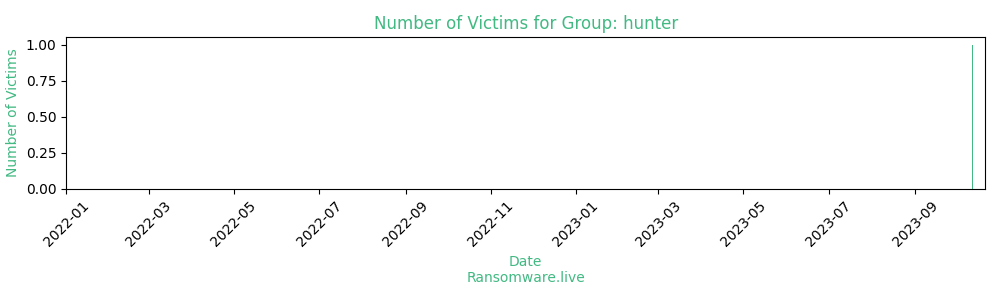

# Profiles for ransomware group : **hunter**

🔎 `ransomware.live`has an active  parser for indexing hunter's victims

### URLs
| Title | Available | Last visit | fqdn | Screenshot 
|---|---|---|---|---|
| HUNTERS INERNATIONAL | 🟢 | 21/10/2023 07:49 | `http://hunters55rdxciehoqzwv7vgyv6nt37tbwax2reroyzxhou7my5ejyid.onion` | <a href="https://images.ransomware.live/screenshots/hunters55rdxciehoqzwv7vgyv6nt37tbwax2reroyzxhou7my5ejyid-onion.png" target=_blank>📸</a> | 

### Total Attacks Over Time

### Victims

> 1 victim found

| victim | date | Description | Screenshot | 
|---|---|---|---|
| [`UK Stratton Primary School`](https://stratton.cornwall.sch.uk) | 12/10/2023 | Country : United Kingdom - Exfiltraded data : yes - Encrypted data : no |   |

Last update : _Saturday 21/10/2023 08.41 (UTC)_
