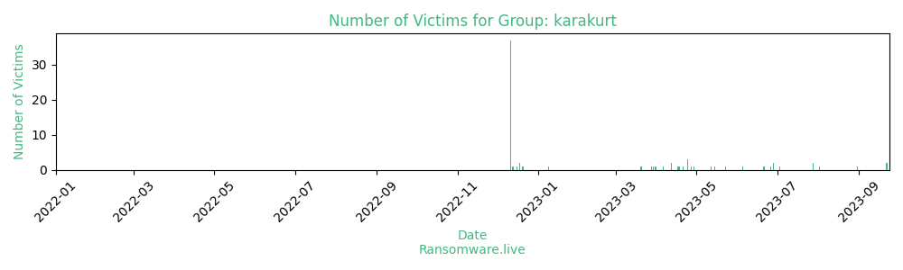

# Profiles for ransomware group : **karakurt**

### External analysis
- https://www.malwarebytes.com/blog/news/2022/06/karakurt-extortion-group-threat-profile

🔎 `ransomware.live`has an active  parser for indexing karakurt's victims

### URLs
| Title | Available | Last visit | fqdn | Screenshot 
|---|---|---|---|---|
| Chat | 🟢 | 07/08/2023 11:26 | `http://omx5iqrdbsoitf3q4xexrqw5r5tfw7vp3vl3li3lfo7saabxazshnead.onion` | <a href="https://images.ransomware.live/screenshots/omx5iqrdbsoitf3q4xexrqw5r5tfw7vp3vl3li3lfo7saabxazshnead-onion.png" target=_blank>📸</a> | 
| Magazine | 🟢 | 07/08/2023 11:26 | `http://3f7nxkjway3d223j27lyad7v5cgmyaifesycvmwq7i7cbs23lb6llryd.onion` | <a href="https://images.ransomware.live/screenshots/3f7nxkjway3d223j27lyad7v5cgmyaifesycvmwq7i7cbs23lb6llryd-onion.png" target=_blank>📸</a> | 
| none | 🔴 | 01/05/2021 00:00 | `http://karaleaks.com` | <a href="https://images.ransomware.live/screenshots/karaleaks-com.png" target=_blank>📸</a> | 

### Ransom note
* [📝 2 ransom notes](notes/karakurt)

### Crypto wallets
* 💰 <a href="/#/crypto/karakurt.md">Crypto wallet(s) available</a>

### Total Attacks Over Time

### Posts

> 71 victims found

| post | date | Description | Screenshot | 
|---|---|---|---|
| [`COSI`](https://google.com/search?q=COSI) | 02/08/2023 | COSI, Columbus, Ohio's dynamic Center of Science and Industry, inspires the scientists, dreamers, and innovators of tomorrow. We've taken about 75GBs of data from this organization. You will find there their projects information, lots of accounting and financial documents, contracts (some of them are confidential), clients contacts, donations information an so on. There are also databases containing clients, partners and employee data, transactions and correspondence. Wait for the release. | <a href="https://images.ransomware.live/screenshots/posts/53e44a522d50181a073c89fc63b2bc17.png" target=_blank>📸</a> |
| [`McAlester Regional Health Center`](https://google.com/search?q=McAlester+Regional+Health+Center) | 28/07/2023 | Founded in 1978, McAlester Regional Health Center is devoted to a continuum of care offering a variety of health care services to the citizens of Southeast Oklahoma. Another one medical center doesn't care about their patients' data. 126gb of this organization data includes medical information, personal documents, financial and accounting data and lots of HR documentation. 40gb of DNA tests of patients is  a bonus! Stay tuned. | <a href="https://images.ransomware.live/screenshots/posts/756eaa444618c022b21542bb6c067a2c.png" target=_blank>📸</a> |
| [`Regional Family Medicine`](https://google.com/search?q=Regional+Family+Medicine) | 28/07/2023 | Regional Family Medicine is a primary care group comprised of two separate clinic locations, eight primary care physicians, four advanced practice nurses, and over fifty other nurses, technicians and support staff. There is some data on medical staff, ss numbers, medical reports, bank statements, invoices, some confidential docs, incidents. +5gb SQL. | <a href="https://images.ransomware.live/screenshots/posts/8b23d528197b61b75900cbd3fbd6f335.png" target=_blank>📸</a> |
| [`Jefferson County Health Center`](https://google.com/search?q=Jefferson+County+Health+Center) | 03/07/2023 | Jefferson County Hospital, Waurika, Oklahoma, is a 25-bed critical access facility providing medical services to residents of Jefferson County and surrounding communities. 1.1 TB from the medical facility: medical records, test results, and personal information of employees and patients. Accounting and financial information is abundant. This data will be uploaded during upcoming summer release. |   |
| [`CentroMed`](https://google.com/search?q=CentroMed) | 28/06/2023 | El Centro del Barrio (CDB), which started doing business as CentroMed in 2001, was founded in 1971 and ran one counseling program for children and adolescents. They lost 25 GB of their data, which contains several thousand ssns and other medical and health information. Accounting, financial, human resources data is also represented. | <a href="https://images.ransomware.live/screenshots/posts/85a461d7575066a7cbf137d22841f0df.png" target=_blank>📸</a> |
| [`Pan Pacific Hotels Group`](https://google.com/search?q=Pan+Pacific+Hotels+Group) | 28/06/2023 | Pan Pacific Hotels Group is a wholly-owned hotel subsidiary of Singapore-listed UOL Group Limited. Pan Pacific Melbourne has lost lots of corporate and personal documents. Contracts, ssns, passports, drivers licenses. 40+GB of data are coming.  | <a href="https://images.ransomware.live/screenshots/posts/f7854eba0d3cfb2dd8d83245609d5049.png" target=_blank>📸</a> |
| [`Reeds Spring School District`](https://google.com/search?q=Reeds+Spring+School+District) | 26/06/2023 | Gibson Technical Center is a career and technical education school that is part of the Reeds Spring School District. 155GB have been stolen from their network. You can find there: HR, detailed finance and accounting, employee information and contracts, confidential students information including medical documents, databases with complete students information. The data will be uploaded during upcoming summer leaks. |   |
| [`Eastside Union School District`](https://google.com/search?q=Eastside+Union+School+District) | 21/06/2023 | Eastside Union School District seeks to provide an inclusive, challenging and innovative education in a safe, positive and rigorous learning environment with dynamic and responsive staff. The size of files we've taken - 18Gb. Accounting, personal information and so on. Everything will be uploaded during upcoming release. |   |
| [`Beacon ABA Services`](https://google.com/search?q=Beacon+ABA+Services) | 05/06/2023 | Beacon ABA Services, Inc. is a private group practice of behavior analysts and behavioral therapists organized to provide intensive behavioral services to individuals with developmental disabilities. The company lost it's data of 80GB. We have their detailed finance and accounting information. Numerous contracts, client data, full employees information. | <a href="https://images.ransomware.live/screenshots/posts/d334917587e7413fc334269d33a44193.png" target=_blank>📸</a> |
| [`Chattanooga Heart Institute`](https://google.com/search?q=Chattanooga+Heart+Institute) | 23/05/2023 | The Chattanooga Heart Institute at Memorial offers a comprehensive multidisciplinary approach to cardiac care. Another medical facility doesn't storage personal information safely. Employees and patients' private data will soon be here available for everyone. Medical records, tests results, diagnoses, social security numbers, passports, addresses, phone numbers, financial data and other documents are going to be uploaded. | <a href="https://images.ransomware.live/screenshots/posts/2a5dba378158ef07f6ad0a23d807f593.png" target=_blank>📸</a> |
| [`York County School of Technology`](https://google.com/search?q=York+County+School+of+Technology) | 15/05/2023 | York County School of Technology offers educational opportunities where every student is guided and encouraged to reach his or her full potential. Nearly 368GB of their data will be shared this week. Students' IDs, State Secure IDs, SSNs, addresses, same employee's information, incidents reports, correspondence with government, accounting documents and many other. Stay in touch! |   |
| [`Peachtree Orthopedics`](https://google.com/search?q=Peachtree+Orthopedics) | 12/05/2023 | Since 1953, Peachtree Orthopedics has been serving the orthopedic needs of the greater Atlanta community. We have from the 194GB of data that includes many lines with SSNs, almost 1000 of credit cards, other detailed personal information, medical records and tons of corporate data. We'll share it soon. | <a href="https://images.ransomware.live/screenshots/posts/8835ca0e90f686e77ada8f51e44fe646.png" target=_blank>📸</a> |
| [`Our Sunday Visitor`](https://google.com/search?q=Our+Sunday+Visitor) | 29/04/2023 | Our Sunday Visitor is a Catholic publisher serving millions of Catholics globally through its publishing, offertory, and communication services. They've lost 130GB of their data that includes full accounting documentation, many HR docs with personal data of employees, financial contracts and invoices, their marketing information and many other document as well. Coming soon. |   |
| [`La Red Health Center`](https://google.com/search?q=La+Red+Health+Center) | 27/04/2023 | La Red Health Center provides an outreach programs help reach undeserved populations and enhance access to quality health care. We have 79GB from them: lots of financial documents, medical records with diagnosis, their employee and students personal information. | <a href="https://images.ransomware.live/screenshots/posts/02cbb13c1e02bc59849ca49117667da8.png" target=_blank>📸</a> |
| [`Lifeline Vascular Access`](https://google.com/search?q=Lifeline+Vascular+Access) | 24/04/2023 | Lifeline Vascular Access provides management services that streamline the delivery of patient care, bringing together all the pieces essential to the operation of an outpatient vascular center. Keeping a patient's personal information in secret is not very popular today. Lifeline thinks the same and has provided us with hundreds of their patients' medical records. Detailed information about the patients, their health, finance state and other info can be published soon and be accessible for everyone. Employees' data is not an exception. Doctors and other staff have lost their personal information thanks to Lifeline Vascular management. Be in touch! |   |
| [`Winona Powder Coating`](https://google.com/search?q=Winona+Powder+Coating) | 24/04/2023 | Winona Powder Coating is the largest provider of finishing services in the Northern Indiana/Southern Michigan region. We specialize in E-Coat and Powder Coat finishes. This is another example of a business that doesn't care about ts employees' personal information. Almost a full set of information for each worker: SSN, DOB, address, phone ... Besides that we have Winona's ongoing project details with contacts and contracts. As well as their financial and accounting documentations. Much to see. You are welcome to check that. | <a href="https://images.ransomware.live/screenshots/posts/cda7e829efca25ae6b10992df9fa9337.png" target=_blank>📸</a> |
| [`TransMedics`](https://google.com/search?q=TransMedics) | 24/04/2023 | TransMedics, Inc., a medical device company, develops and provides portable warm blood perfusion system that allows for living organ transplant. 85 GB of this company data will leak online soon opening all the financial and accounting information to the public. You will find their business contracts, correspondence with BIG executives, detailed employee personal information and other confidential papers uploaded here this week. Seems like we are going to witness another stock fall. |   |
| [`Wynn-Reeth`](https://google.com/search?q=Wynn-Reeth) | 21/04/2023 | Wynn-Reeth provides services to the client which will help the individual meet daily living needs. They claim they can even help people manage their Social Security benefits and in the same time they helped their clients lose personal documents including passports and SSNs (and seem not to be  worried much about that). We have about 30GBs of their corporate information and, as you understand, their clients personal and medical information. You will be able to check it soon by yourselves.  | <a href="https://images.ransomware.live/screenshots/posts/e4592cfff3320b5df784da0a4ce5872a.png" target=_blank>📸</a> |
| [`Ozarks Community Hospital`](https://google.com/search?q=Ozarks+Community+Hospital) | 18/04/2023 | Founded in 1930 the Ozarks Community Hospital (OCH) of Gravette, AR is located in what was previously known as the Gravette Medical Center Hospital Building. They do not care much about their personnel and patients personal information.  We have about 40GB of their internal information including detailed medical data (medical records, tests, diagnosis), employees personal information and accounting/finance documents that are very interesting to explore. They even lost their partners' employee information (ssns, addresses and so on).Coming soon! | <a href="https://images.ransomware.live/screenshots/posts/7e8b273145a4139f5cc134f9c9dd65ab.png" target=_blank>📸</a> |
| [`Pharm-Pacc Corporation`](https://google.com/search?q=Pharm-Pacc+Corporation) | 17/04/2023 | Pharm-Pacc Corporation is a provider of Managed Recovery Services to hundreds of hospitals throughout the United States. As it usually turns out, the services are not managed enough and personal information of US citizens can soon be on public. 40GB of corporate and clients/patients' data will be free to download soon. You can find there patients' passport information, med tests results, prescriptions, diagnosis and other pretty detailed information. Accounting, finance, insurance docs of a great quantity present too. Stay in touch! | <a href="https://images.ransomware.live/screenshots/posts/b0c7ea6d30fdc7beb0fb5028dd32e269.png" target=_blank>📸</a> |
| [`Petaluma Health Center`](https://google.com/search?q=Petaluma+Health+Center) | 12/04/2023 | The Petaluma Health Center is a Federally Qualified Health Center that strives to care for the "whole" individual by providing excellent care for all patients, regardless of one's ability to pay for services. We do not know whether their patients personal and medical information was stored unsafely because of their disability to pay but we have almost 490GB of this Health Center on our servers. Along with that we've obtained a good amount of financial information (numerous declarations, payment docs, tax forms ...) and personal employees information (SSNs, passports, phone numbers, addresses etc).That is going to be interesting. |   |
| [`Medicalodges, Inc`](https://google.com/search?q=Medicalodges%2C+Inc) | 12/04/2023 | Founded in 1961, Medicalodges is a provider of healthcare services. Medicalodges goals is to serve, enhance and care for people. The company shared with us about 170 GB of their data. You can find there lots of personal information (typical for healthcare providers): SSNs, passports, addresses, salaries and much more. Financial and accounting information is also very rich and detailed: balances, budget, tax declarations, client deposits etc. Speaking about their clients, we have NDAs, DBs of their clients addresses, documents, diagnosis and other confidential information.Be ready to check this soon. | <a href="https://images.ransomware.live/screenshots/posts/67117f8395cfe04de3b7d462d7896fa6.png" target=_blank>📸</a> |
| [`Officeworks Inc`](https://google.com/search?q=Officeworks+Inc) | 06/04/2023 | Officeworks Inc, has shared with us some of their employees with addresses, birth certificates, drivers licenses and others. Also we have a pretty detailed accounting, finance information, tax and insurance data. Project and property information along with their internal incidents, penalties and other HR stuff are a bonus.Much to check. You are welcome! |   |
| [`OptionMetrics`](https://google.com/search?q=OptionMetrics) | 31/03/2023 | OptionMetrics provides its customers with databases of various business directions. They have shared some databases with us also. Here is what we got: great amount of financial and accounting data,  business contacts, signed contracts, employees information and that DBs as well, of course. In total you can check 450 GB of sweet data.Have fun! | <a href="https://images.ransomware.live/screenshots/posts/5b32f260746f9ec9503f259c635e583b.png" target=_blank>📸</a> |
| [`FINANCE INSTITUTION AUCTION`](https://google.com/search?q=FINANCE+INSTITUTION+AUCTION) | 29/03/2023 | We're happy to present you a brilliant 4TB stolen from a microfinance institution. We have 2,861,839 SSNs in total. Beside this, we hold other high value databases - for example, a gigantic database with 3 million lines, which contains information about the status of the loan, addresses, last names, phone numbers, mails, and even the characteristics of the debtor - very entertaining reading.Moreover, we have finance, clients data, accounting data, legal data, CRM backups, fully dumped VIP users mailboxes and more.If the company representatives will continue acting non-negotiable, these data will be put up for auction. Stay tuned. You will definitely enjoy it! |   |
| [`MICROFINANCE INSTITUTION`](https://google.com/search?q=MICROFINANCE+INSTITUTION) | 28/03/2023 | We're happy to present you a brilliant 4TB stolen from a microfinance institution. We have 2,861,839 SSNs in total. Beside this, we hold other high value databases - for example, a gigantic database with 3 million lines, which contains information about the status of the loan, addresses, last names, phone numbers, mails, and even the characteristics of the debtor - very entertaining reading.Moreover, we have finance, clients data, accounting data, legal data, CRM backups, fully dumped VIP users mailboxes and more.You will definitely enjoy it! |   |
| [`National Board of Osteopathic Medical Examiners`](https://google.com/search?q=National+Board+of+Osteopathic+Medical+Examiners) | 20/03/2023 | The National Board of Osteopathic Medical Examiners (NBOME) is an independent, nongovernmental, not-for-profit organization. Since their founding in 1934, they have been recognized for excellence in the national and international arenas of osteopathic physician testing and evaluation. NBOME produces a number of osteopathically distinct assessments and partner with other organizations on their assessment programs.  | <a href="https://images.ransomware.live/screenshots/posts/2c3ea79fc201ca8defdc97286874575c.png" target=_blank>📸</a> |
| [`River City Science Academy`](https://google.com/search?q=River+City+Science+Academy) | 09/01/2023 | River City Science Academy (RCSA) is a tuition-free, public charter school located in Duval County in Jacksonville, Florida. RCSA was founded in 2007 and currently serves grades K – 12 through 4 different locations. RCSA offers an emphasis on STEM education. In this release we will show you 63 GB of RCSA's data which include financials, executive and accounting information as well as a great amount of personal student and employee data. | <a href="https://images.ransomware.live/screenshots/posts/db020a1c00fc070b080b7c2f703bee47.png" target=_blank>📸</a> |
| [`Goodwill industries`](https://google.com/search?q=Goodwill+industries) | 21/12/2022 | Centrisys is a USA manufacturer of decanter centrifuges for sludge dewatering and thickening. Since 1987 Centrisys has been a leader in decanter centrifuge service and repair for all brands of centrifuges on the market today. CNP - Technology Water and Biosolids, a subsidiary of Centrifuge-Systems, LLC, designs and supplies innovative nutrient recovery and energy optimization systems for wastewater treatment. In this release we can offer you 403 GB of their corporate data. | <a href="https://images.ransomware.live/screenshots/posts/ddcd95df801d3ed9f46dbc0ef05aa0c5.png" target=_blank>📸</a> |
| [`LIBERTY PULTRUSIONS`](https://google.com/search?q=LIBERTY+PULTRUSIONS) | 20/12/2022 | BauVal was founded in 1954 on the South Shore of Montreal and was first specialized in civil engineering and road systems. Now called Le Groupe Bau-Val inc. and encompassing all affiliated divisions and companies, the enterprise is truly setting itself as the leader in a plethora of sectors, such as managing civil engineering projects and complex structures, transforming aggregates, manufacturing concrete, building material and conventional and low-energy plant mix, as well as transportation and drilling & blasting. In this release we will show you 87 GB of their corporate data. |   |
| [`TLC`](https://google.com/search?q=TLC) | 18/12/2022 | TLC is a global brand available in more than 84 million homes in the US and 270 million households around the world. Viewers can enjoy their favorite shows anytime, anywhere on discovery+, the definitive non-fiction, real-life subscription streaming service. A destination online, TLC offers in-depth fan sites and exclusive original video content. TLC is part of Discovery (NASDAQ: DISCA, DISCB, DISCK), reaching 3 billion cumulative viewers in more than 220 countries and territories to satisfy curiosity and captivate superfans with a portfolio of premium nonfiction, lifestyle, sports and kids content brands. In this case we will provide you with almost 1 TB of their scripts, videos, internal documentation, as well as personal information of employees and much more. | <a href="https://images.ransomware.live/screenshots/posts/fc61cfc7bb3c440a2c4d77ba1048cd54.png" target=_blank>📸</a> |
| [`Bevolution Group`](https://google.com/search?q=Bevolution+Group) | 18/12/2022 | Bevolution Group is among the nation's most diverse and creative foodservice beverage providers. It offers juices, sugar-free beverages, thickened and enhanced waters, sports and energy drinks, iced teas, powder beverages, margaritas and cocktail mixers, frozen drinks and smoothie mixes, and flavor shots under its Refrasia, Lemon-X, Tropics and Dr. Smoothie brands. In this release we will show you 446 GB of their corporate data. | <a href="https://images.ransomware.live/screenshots/posts/b3d4fdaf64c53bcca64b95aaf243dff7.png" target=_blank>📸</a> |
| [`Gage Brothers`](https://google.com/search?q=Gage+Brothers) | 16/12/2022 |   |   |
| [`Batesville Products`](https://google.com/search?q=Batesville+Products) | 13/12/2022 |   |   |
| [`Municipalidad de belen`](https://google.com/search?q=Municipalidad+de+belen) | 11/12/2022 |   |   |
| [`William A. Kibbe & Associates`](https://google.com/search?q=William+A.+Kibbe+%26+Associates) | 11/12/2022 |   |   |
| [`Infinitum`](https://google.com/search?q=Infinitum) | 11/12/2022 |   |   |
| [`Hiersun Jewelry Co Ltd`](https://google.com/search?q=Hiersun+Jewelry+Co+Ltd) | 11/12/2022 |   |   |
| [`Energy Transfer Durafin Tubes`](https://google.com/search?q=Energy+Transfer+Durafin+Tubes) | 11/12/2022 |   |   |
| [`KINSHOFER GmbH`](https://google.com/search?q=KINSHOFER+GmbH) | 11/12/2022 |   |   |
| [`APSM Systems`](https://google.com/search?q=APSM+Systems) | 11/12/2022 |   |   |
| [`Latitude 37`](https://google.com/search?q=Latitude+37) | 11/12/2022 |   |   |
| [`South Jersey Glass & Doors`](https://google.com/search?q=South+Jersey+Glass+%26+Doors) | 11/12/2022 |   |   |
| [`APECQ`](https://google.com/search?q=APECQ) | 11/12/2022 |   |   |
| [`Bergamo Metal`](https://google.com/search?q=Bergamo+Metal) | 11/12/2022 |   |   |
| [`Metroclean`](https://google.com/search?q=Metroclean) | 11/12/2022 |   |   |
| [`Davenport Community School`](https://google.com/search?q=Davenport+Community+School) | 11/12/2022 |   |   |
| [`Qualified Staffing`](https://google.com/search?q=Qualified+Staffing) | 11/12/2022 |   |   |
| [`Özel GözAkademi Hastanesi`](https://google.com/search?q=%C3%96zel+G%C3%B6zAkademi+Hastanesi) | 11/12/2022 |   |   |
| [`Medilife Hastanesi`](https://google.com/search?q=Medilife+Hastanesi) | 11/12/2022 |   |   |
| [`ipb Baggenstos Montagen`](https://google.com/search?q=ipb+Baggenstos+Montagen) | 11/12/2022 |   |   |
| [`The Summit`](https://google.com/search?q=The+Summit) | 11/12/2022 |   |   |
| [`Urban`](https://google.com/search?q=Urban) | 11/12/2022 |   |   |
| [`San Benito Consolidated Independent School District`](https://google.com/search?q=San+Benito+Consolidated+Independent+School+District) | 11/12/2022 |   |   |
| [`Schrader-Pacific International`](https://google.com/search?q=Schrader-Pacific+International) | 11/12/2022 |   |   |
| [`Vercity`](https://google.com/search?q=Vercity) | 11/12/2022 |   |   |
| [`Deerberg`](https://google.com/search?q=Deerberg) | 11/12/2022 |   |   |
| [`Trantor`](https://google.com/search?q=Trantor) | 11/12/2022 |   | <a href="https://images.ransomware.live/screenshots/posts/7abab24a7cb41e7b1b7f009027280427.png" target=_blank>📸</a> |
| [`R1 Group`](https://google.com/search?q=R1+Group) | 11/12/2022 |   | <a href="https://images.ransomware.live/screenshots/posts/ed99c0ab6c2bef224b9da70536d0d9f0.png" target=_blank>📸</a> |
| [`Club Asteria Belek`](https://google.com/search?q=Club+Asteria+Belek) | 11/12/2022 |   | <a href="https://images.ransomware.live/screenshots/posts/a3fe2ed420a5d28e9383c7b32fc31b4d.png" target=_blank>📸</a> |
| [`Cheval Electronic Enclosure`](https://google.com/search?q=Cheval+Electronic+Enclosure) | 11/12/2022 |   | <a href="https://images.ransomware.live/screenshots/posts/1c5255906fa9fa8df0e77e672505508c.png" target=_blank>📸</a> |
| [`Cromwell Management Inc.`](https://google.com/search?q=Cromwell+Management+Inc.) | 11/12/2022 |   | <a href="https://images.ransomware.live/screenshots/posts/34c651b39418b3d3ed405595bb704261.png" target=_blank>📸</a> |
| [`Ethigen Limited`](https://google.com/search?q=Ethigen+Limited) | 11/12/2022 |   | <a href="https://images.ransomware.live/screenshots/posts/8cde8889395de3d3585a35805f469fb6.png" target=_blank>📸</a> |
| [`Abdullah Al-Othaim Markets`](https://google.com/search?q=Abdullah+Al-Othaim+Markets) | 11/12/2022 |   | <a href="https://images.ransomware.live/screenshots/posts/9d4f6687def0f7e58e37477f60f95ffc.png" target=_blank>📸</a> |
| [`Legend Holdings`](https://google.com/search?q=Legend+Holdings) | 11/12/2022 |   | <a href="https://images.ransomware.live/screenshots/posts/3aad18bb0bb4db43a63ff5806c2b85dc.png" target=_blank>📸</a> |
| [`PTSC`](https://google.com/search?q=PTSC) | 11/12/2022 | PTSC, a member of Vietnam Oil & Gas Group (PetroVietnam - PVN), was established on the implementation of Decision No. 458/TTg dated 24 November 1976 for the approval of the master plan to build a petroleum base in Vung Tau city. In this release we can offer you 1,3 TB of their corporate data. You will definitely enjoy! | <a href="https://images.ransomware.live/screenshots/posts/3990be04acd8097d337eaab38f922ba3.png" target=_blank>📸</a> |
| [`Regulatory Authority for Telecommunications and Posts (ARTP)`](https://google.com/search?q=Regulatory+Authority+for+Telecommunications+and+Posts+%28ARTP%29) | 11/12/2022 |   | <a href="https://images.ransomware.live/screenshots/posts/d7f4111ff8758c0c42babc596fbe653b.png" target=_blank>📸</a> |
| [`Roxboro`](https://google.com/search?q=Roxboro) | 11/12/2022 |   | <a href="https://images.ransomware.live/screenshots/posts/9006e726b0fbc903529ce63da68e67d6.png" target=_blank>📸</a> |
| [`Stratus`](https://google.com/search?q=Stratus) | 11/12/2022 |   | <a href="https://images.ransomware.live/screenshots/posts/225a650494b52d4e7a535184df5138db.png" target=_blank>📸</a> |
| [`BauVal`](https://google.com/search?q=BauVal) | 11/12/2022 |   | <a href="https://images.ransomware.live/screenshots/posts/13b60beee0499f038cfa954f02c139cc.png" target=_blank>📸</a> |
| [`Centrisys cnp`](https://google.com/search?q=Centrisys+cnp) | 11/12/2022 |   | <a href="https://images.ransomware.live/screenshots/posts/d79b8e93cf8c794b6b79fb9dcf76b032.png" target=_blank>📸</a> |

Last update : _Monday 07/08/2023 12.13 (UTC)_
