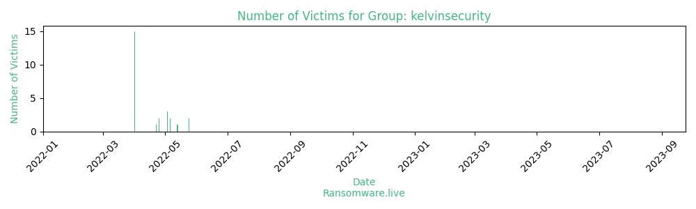

# Profiles for ransomware group : **kelvinsecurity**

_`not a ransomware group`_

### External analysis
- https://twitter.com/Ksecureteamlab

### URLs
| Title | Available | Last visit | fqdn | Screenshot 
|---|---|---|---|---|
| 403 Forbidden | 🟢 | 24/09/2023 13:57 | `http://kelvinsecteamcyber.wixsite.com` | <a href="https://images.ransomware.live/screenshots/kelvinsecteamcyber-wixsite-com.png" target=_blank>📸</a> | 

### Total Attacks Over Time

### Victims

> 26 victims found

| victim | date | Description | Screenshot | 
|---|---|---|---|
| [`TRANSCONTRACT`](https://google.com/search?q=TRANSCONTRACT) | 24/05/2022 |   |   |
| [`Mansfield Energy`](https://google.com/search?q=Mansfield+Energy) | 24/05/2022 |   |   |
| [`Channel Navigator business intelligence IT`](https://google.com/search?q=Channel+Navigator+business+intelligence+IT) | 13/05/2022 |   |   |
| [`Next Leak On Hold`](https://google.com/search?q=Next+Leak+On+Hold) | 06/05/2022 |   |   |
| [`PTC Industries`](https://google.com/search?q=PTC+Industries) | 06/05/2022 |   |   |
| [`Municipality of Posadas`](https://google.com/search?q=Municipality+of+Posadas) | 03/05/2022 |   |   |
| [`bfclcoin`](https://google.com/search?q=bfclcoin) | 03/05/2022 |   |   |
| [`Instance IT Solutions India`](https://google.com/search?q=Instance+IT+Solutions+India) | 03/05/2022 |   |   |
| [`Waiting for next leak`](https://google.com/search?q=Waiting+for+next+leak) | 25/04/2022 |   |   |
| [`NATION Costa Rica`](https://google.com/search?q=NATION+Costa+Rica) | 25/04/2022 |   |   |
| [`PT Pertamina Gas`](https://google.com/search?q=PT+Pertamina+Gas) | 22/04/2022 |   |   |
| [`CARACOL TV COLOMBIA`](https://google.com/search?q=CARACOL+TV+COLOMBIA) | 01/04/2022 |   |   |
| [`caribetours`](https://google.com/search?q=caribetours) | 01/04/2022 |   |   |
| [`ICONIC`](https://google.com/search?q=ICONIC) | 01/04/2022 |   |   |
| [`eGOV`](https://google.com/search?q=eGOV) | 01/04/2022 |   |   |
| [`Equicom SAVINGS BANK`](https://google.com/search?q=Equicom+SAVINGS+BANK) | 01/04/2022 |   |   |
| [`Cellulant Corporation`](https://google.com/search?q=Cellulant+Corporation) | 01/04/2022 |   |   |
| [`BEXIMCO`](https://google.com/search?q=BEXIMCO) | 01/04/2022 |   |   |
| [`BMW CHILE`](https://google.com/search?q=BMW+CHILE) | 01/04/2022 |   |   |
| [`Banco do Brasil`](https://google.com/search?q=Banco+do+Brasil) | 01/04/2022 |   |   |
| [`CORT`](https://google.com/search?q=CORT) | 01/04/2022 |   |   |
| [`Nestle`](https://google.com/search?q=Nestle) | 01/04/2022 |   |   |
| [`Salvadoran Ministry of Foreign Affairs`](https://google.com/search?q=Salvadoran+Ministry+of+Foreign+Affairs) | 01/04/2022 |   |   |
| [`ANTEL`](https://google.com/search?q=ANTEL) | 01/04/2022 |   |   |
| [`Pakistan Human Rights`](https://google.com/search?q=Pakistan+Human+Rights) | 01/04/2022 |   |   |
| [`CR ASIA`](https://google.com/search?q=CR+ASIA) | 01/04/2022 |   |   |

Last update : _Sunday 24/09/2023 14.39 (UTC)_
