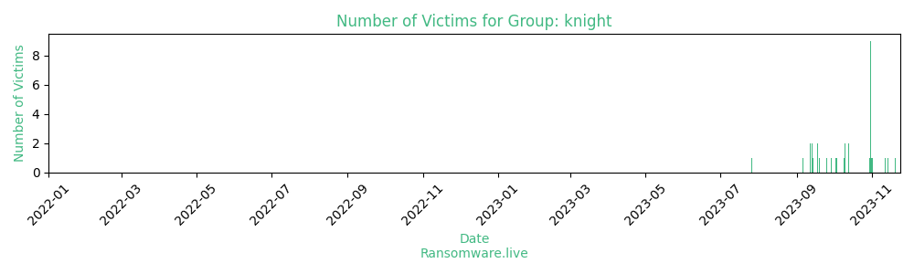

# Profiles for ransomware group : **knight**

> [Cyclops](group/cyclops) rebrand

🔎 `ransomware.live`has an active  parser for indexing knight's victims

### URLs
| Title | Available | Last visit | fqdn | Screenshot 
|---|---|---|---|---|
| Blog - Knight | 🟢 | 07/08/2023 11:27 | `http://knight3xppu263m7g4ag3xlit2qxpryjwueobh7vjdc3zrscqlfu3pqd.onion` | <a href="https://images.ransomware.live/screenshots/knight3xppu263m7g4ag3xlit2qxpryjwueobh7vjdc3zrscqlfu3pqd-onion.png" target=_blank>📸</a> | 

### Total Attacks Over Time

### Posts

> 1 victim found

| post | date | Description | Screenshot | 
|---|---|---|---|
| [`Important Updates`](https://google.com/search?q=Important+Updates) | 26/07/2023 | Knight | <a href="https://images.ransomware.live/screenshots/posts/d8e5261ba91672d91d145f38033d68f5.png" target=_blank>📸</a> |

Last update : _Monday 07/08/2023 12.13 (UTC)_
