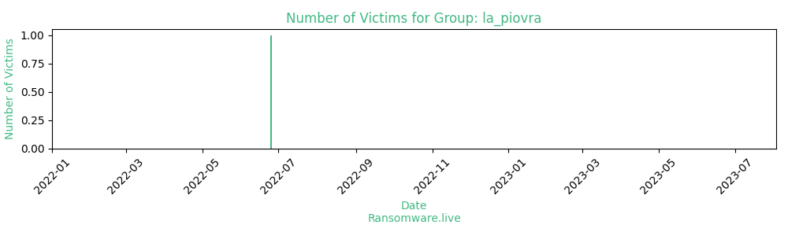

# Profiles for ransomware group : **la_piovra**

> ℹ️  La Piovra Ransomware is an exercise of the company Offensive Security (also known as OffSec)

🔎 `ransomware.live`has an active  parser for indexing la_piovra's victims

### URLs
| Title | Available | Last visit | fqdn | Screenshot 
|---|---|---|---|---|
|  La Piovra Ransomware  | 🔴 | 14/06/2023 10:25 | `http://et22fibzuzfyzgurm35sttm52qbzvdgzy5qhzy46a3gmkrrht3lec5ad.onion` | <a href="https://images.ransomware.live/screenshots/et22fibzuzfyzgurm35sttm52qbzvdgzy5qhzy46a3gmkrrht3lec5ad-onion.png" target=_blank>📸</a> | 
| La Piovra Ransomware – a new cartel | 🔴 | 14/06/2023 10:26 | `http://h3txev6jev7rcm6p2qkxn2vctybi4dvochr3inymzgif53n2j2oqviqd.onion` | <a href="https://images.ransomware.live/screenshots/h3txev6jev7rcm6p2qkxn2vctybi4dvochr3inymzgif53n2j2oqviqd-onion.png" target=_blank>📸</a> | 
| La Piovra Ransomware - Members Only  | 🔴 | 11/08/2023 17:27 | `http://wx3djgl4cacl6y4x7r4e4mbqrrub24ectue7ixyix2du25nfowtvfiyd.onion` | <a href="https://images.ransomware.live/screenshots/wx3djgl4cacl6y4x7r4e4mbqrrub24ectue7ixyix2du25nfowtvfiyd-onion.png" target=_blank>📸</a> | 

### Total Attacks Over Time

### Victims

> 1 victim found

| victim | date | Description | Screenshot | 
|---|---|---|---|
| [`MegaCorp One`](https://google.com/search?q=MegaCorp+One) | 25/06/2022 | In case you were wondering how we did it, your entire website code is on github!!!!  A look on the code, a vuln here and there, and voila, all your files are now encrypted. We will start releasing other proprietary data that we copied. You have 2 days to pay! | <a href="https://images.ransomware.live/screenshots/posts/3513e5be675cd9e409dd6453b23036d7.png" target=_blank>📸</a> |

Last update : _Friday 24/11/2023 13.15 (UTC)_
