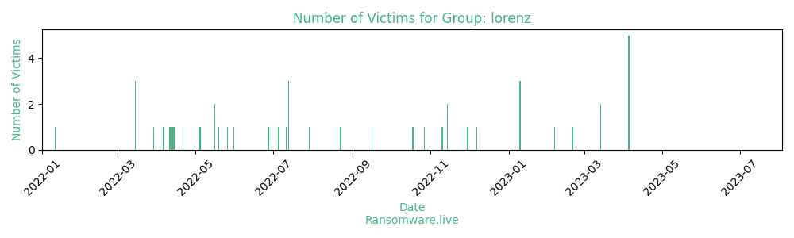

# Profiles for ransomware group : **lorenz**

> Tesorion describes Lorenz as a ransomware with design and implementation flaws, leading to impossible decryption with tools provided by the attackers. A free decryptor for 2021 versions was made available via the NoMoreRansom initiative. A new version of the malware was discovered in March 2022, for which again was provided a free decryptor, while the ransomware operators are not able to provide tools to decrypt affected files.

_`rfi location woe2suafeg6ehxivgvvn4nh6ectbdhdqgc4vzph27mmyn7rjf2c52jid.onion/index.php`_

### External analysis
- https://www.zdnet.com/article/lorenz-ransomware-attack-victims-can-now-retrieve-their-files-for-free-with-this-decryption-tool

- https://www.cybertalk.org/the-worst-outcomes-lorenz-ransomware-a-new-double-extortion-strategy

🔎 `ransomware.live`has an active  parser for indexing lorenz's victims

### URLs
| Title | Available | Last visit | fqdn | Screenshot 
|---|---|---|---|---|
| Lorenz | 🟢 | 07/08/2023 11:44 | `http://lorenzmlwpzgxq736jzseuterytjueszsvznuibanxomlpkyxk6ksoyd.onion` | <a href="https://images.ransomware.live/screenshots/lorenzmlwpzgxq736jzseuterytjueszsvznuibanxomlpkyxk6ksoyd-onion.png" target=_blank>📸</a> | 
| Lorenz | 🟢 | 07/08/2023 11:44 | `http://lorenzmlwpzgxq736jzseuterytjueszsvznuibanxomlpkyxk6ksoyd.onion` | <a href="https://images.ransomware.live/screenshots/lorenzmlwpzgxq736jzseuterytjueszsvznuibanxomlpkyxk6ksoyd-onion.png" target=_blank>📸</a> | 

### Ransom note
* [📝 2 ransom notes](notes/lorenz)

### Total Attacks Over Time

### Posts

> 67 victims found

| post | date | Description | Screenshot | 
|---|---|---|---|
| [`Tarolli, Sundheim, Covell & Tummino LLP`](https://google.com/search?q=Tarolli%2C+Sundheim%2C+Covell+%26+Tummino+LLP) | 05/04/2023 |  |   |
| [`Joy Cone Co, Joy Baking group, BoDeans Baking, Altesa`](https://google.com/search?q=Joy+Cone+Co%2C+Joy+Baking+group%2C+BoDeans+Baking%2C+Altesa) | 05/04/2023 |  |   |
| [`NGS Super`](https://google.com/search?q=NGS+Super) | 05/04/2023 |  |   |
| [`Intrasect Technologies`](https://google.com/search?q=Intrasect+Technologies) | 05/04/2023 |  |   |
| [`Moore Engineering`](https://google.com/search?q=Moore+Engineering) | 05/04/2023 |  |   |
| [`Manning Building Supplies`](https://google.com/search?q=Manning+Building+Supplies) | 14/03/2023 |  |   |
| [`Tarolli`](https://google.com/search?q=Tarolli) | 14/03/2023 |  |   |
| [`Hopsteiner`](https://google.com/search?q=Hopsteiner) | 20/02/2023 |  |   |
| [`AmerisourceBergen/Censora - MWI Animal Health`](https://google.com/search?q=AmerisourceBergen%2FCensora+-+MWI+Animal+Health) | 06/02/2023 |  |   |
| [`Chestertons Inc.`](https://google.com/search?q=Chestertons+Inc.) | 10/01/2023 |  |   |
| [`Thor Specialties, Inc.`](https://google.com/search?q=Thor+Specialties%2C+Inc.) | 10/01/2023 |  |   |
| [`Shelco`](https://google.com/search?q=Shelco) | 10/01/2023 |  |   |
| [`Albina Asphalt`](https://google.com/search?q=Albina+Asphalt) | 07/12/2022 |   |   |
| [`Holler-Classic`](https://google.com/search?q=Holler-Classic) | 30/11/2022 |   |   |
| [`Nissan of Las Cruces`](https://google.com/search?q=Nissan+of+Las+Cruces) | 14/11/2022 |   |   |
| [`Salud Family Health`](https://google.com/search?q=Salud+Family+Health) | 14/11/2022 |   |   |
| [`Main & Main Capital Group`](https://google.com/search?q=Main+%26+Main+Capital+Group) | 10/11/2022 |   |   |
| [`Miracapo pizza company`](https://google.com/search?q=Miracapo+pizza+company) | 27/10/2022 |   |   |
| [`Wes-tec inc.`](https://google.com/search?q=Wes-tec+inc.) | 18/10/2022 |   |   |
| [`Laddawn Inc.`](https://google.com/search?q=Laddawn+Inc.) | 16/09/2022 |   |   |
| [`Engine Power`](https://google.com/search?q=Engine+Power) | 23/08/2022 |   |   |
| [`Northern Contours Inc.`](https://google.com/search?q=Northern+Contours+Inc.) | 22/08/2022 |   |   |
| [`Fandeli`](https://google.com/search?q=Fandeli) | 29/07/2022 |   |   |
| [`Van Ausdall & Farrar, inc`](https://google.com/search?q=Van+Ausdall+%26+Farrar%2C+inc) | 13/07/2022 |   |   |
| [`Biothane usa`](https://google.com/search?q=Biothane+usa) | 13/07/2022 |   |   |
| [`Gresco`](https://google.com/search?q=Gresco) | 13/07/2022 |   |   |
| [`Uppco`](https://google.com/search?q=Uppco) | 11/07/2022 |   |   |
| [`Wis-Pak, Inc`](https://google.com/search?q=Wis-Pak%2C+Inc) | 05/07/2022 |   |   |
| [`Bonneville Collections`](https://google.com/search?q=Bonneville+Collections) | 27/06/2022 |   |   |
| [`Westwood`](https://google.com/search?q=Westwood) | 31/05/2022 |   |   |
| [`Mebulbs`](https://google.com/search?q=Mebulbs) | 26/05/2022 |   |   |
| [`Magtek`](https://google.com/search?q=Magtek) | 19/05/2022 |   |   |
| [`Brunk Industries Inc.`](https://google.com/search?q=Brunk+Industries+Inc.) | 16/05/2022 |   |   |
| [`AmCham Shanghai`](https://google.com/search?q=AmCham+Shanghai) | 16/05/2022 |   |   |
| [`Tosoh Corporation`](https://google.com/search?q=Tosoh+Corporation) | 05/05/2022 |   |   |
| [`Tosoh Bioscience`](https://google.com/search?q=Tosoh+Bioscience) | 04/05/2022 |   |   |
| [`Morrie's Auto Group`](https://google.com/search?q=Morrie%27s+Auto+Group) | 21/04/2022 |   |   |
| [`Musco Sports Lighting`](https://google.com/search?q=Musco+Sports+Lighting) | 14/04/2022 |   |   |
| [`Simply Placed`](https://google.com/search?q=Simply+Placed) | 13/04/2022 |   |   |
| [`DeeZee`](https://google.com/search?q=DeeZee) | 12/04/2022 |   |   |
| [`Advizrs`](https://google.com/search?q=Advizrs) | 11/04/2022 |   |   |
| [`Keicorp(ICPM)`](https://google.com/search?q=Keicorp%28ICPM%29) | 06/04/2022 |   |   |
| [`Biz Retek`](https://google.com/search?q=Biz+Retek) | 29/03/2022 |   |   |
| [`Fuji America Corporation`](https://google.com/search?q=Fuji+America+Corporation) | 15/03/2022 |   |   |
| [`VadaTech`](https://google.com/search?q=VadaTech) | 15/03/2022 |   |   |
| [`Ward Hadaway`](https://google.com/search?q=Ward+Hadaway) | 15/03/2022 |   |   |
| [`Hensoldt`](https://google.com/search?q=Hensoldt) | 11/01/2022 |   | <a href="https://images.ransomware.live/screenshots/posts/056942f8ddcb21edbae71dffe13d9777.png" target=_blank>📸</a> |
| [`Turner Enterprises, Inc.`](https://google.com/search?q=Turner+Enterprises%2C+Inc.) | 23/12/2021 |   |   |
| [`Kenall/Legrand`](https://google.com/search?q=Kenall%2FLegrand) | 14/12/2021 |   |   |
| [`Component Assembly Systems`](https://google.com/search?q=Component+Assembly+Systems) | 15/11/2021 |   |   |
| [`SCREEN Holdings`](https://google.com/search?q=SCREEN+Holdings) | 21/09/2021 |   |   |
| [`Sebastian`](https://google.com/search?q=Sebastian) | 10/08/2021 |   |   |
| [`Miller-Valentine Group`](https://google.com/search?q=Miller-Valentine+Group) | 29/07/2021 |   |   |
| [`MPS Credit Union`](https://google.com/search?q=MPS+Credit+Union) | 27/07/2021 |   |   |
| [`Buchanan Hauling & Rigging`](https://google.com/search?q=Buchanan+Hauling+%26+Rigging) | 24/06/2021 |   |   |
| [`Langs Building Supplies Pty Ltd`](https://google.com/search?q=Langs+Building+Supplies+Pty+Ltd) | 01/06/2021 |   |   |
| [`Challenge Manufacturing Company`](https://google.com/search?q=Challenge+Manufacturing+Company) | 11/05/2021 |   |   |
| [`Airtech Advanced Materials Group`](https://google.com/search?q=Airtech+Advanced+Materials+Group) | 29/04/2021 |   |   |
| [`DNS Toptech`](https://google.com/search?q=DNS+Toptech) | 13/04/2021 |   |   |
| [`Joy Cone`](https://google.com/search?q=Joy+Cone) | 11/04/2021 |   |   |
| [`Wolfe Eye Clinic`](https://google.com/search?q=Wolfe+Eye+Clinic) | 01/04/2021 |   |   |
| [`Bases Conversion and Development Authority (BCDA)`](https://google.com/search?q=Bases+Conversion+and+Development+Authority+%28BCDA%29) | 01/04/2021 |   |   |
| [`Tygavac ltd.`](https://google.com/search?q=Tygavac+ltd.) | 01/04/2021 |   |   |
| [`The managementtrust`](https://google.com/search?q=The+managementtrust) | 11/02/2021 |   |   |
| [`Multifeeder`](https://google.com/search?q=Multifeeder) | 10/01/2021 |   |   |
| [`Commport Communications`](https://google.com/search?q=Commport+Communications) | 20/12/2020 |   |   |
| [`Windemuller`](https://google.com/search?q=Windemuller) | 12/01/2020 |   |   |

Last update : _Monday 07/08/2023 12.13 (UTC)_
