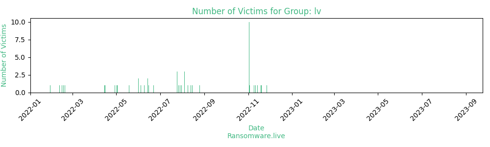

# Profiles for ransomware group : **lv**

> LV ransomware group main message: "Here are companies which didn't meet consumer data protection obligations. They rejected to fix their mistakes, they rejected to protect this data in the case when they could and had to ptotect it. These companies prefered to sell their private information, their employees' and customers' personal data". Security researchers claim that the LV group is utilizing the REvil ransomware group malware. The LV group claim to have compromised the corporate network of Groupe Reorev.

### External analysis
- https://www.secureworks.com/research/lv-ransomware

- https://securityaffairs.co/wordpress/119306/malware/lv-ransomware-repurposed-revil-binary.html

### URLs
| Title | Available | Last visit | fqdn | Screenshot 
|---|---|---|---|---|
| none | 🔴 | 26/12/2022 04:52 | `http://rbvuetuneohce3ouxjlbxtimyyxokb4btncxjbo44fbgxqy7tskinwad.onion` | ❌ | 
| Start-maximized.com | 🔴 | 02/12/2021 13:09 | `http://4qbxi3i2oqmyzxsjg4fwe4aly3xkped52gq5orp6efpkeskvchqe27id.onion` | ❌ | 

### Ransom note
* [📝 1 ransom note](notes/lv)

### Technique Set

* 🛠️ A technique set is [available](https://app.tidalcyber.com/share/techniqueset/0c9cb37a-61de-43e0-a6d4-bab952be530b) from [Tidal Cyber](https://www.tidalcyber.com/)

### Total Attacks Over Time

### Victims

> 63 victims found

| victim | date | Description | Screenshot | 
|---|---|---|---|
| [`GLEN DIMPLEX GROUP UNITS WERE HACKED (DEFOND, DEFONDTECH AND OTHER). MORE THAN 1TB DATA WA`](https://google.com/search?q=GLEN+DIMPLEX+GROUP+UNITS+WERE+HACKED+%28DEFOND%2C+DEFONDTECH+AND+OTHER%29.+MORE+THAN+1TB+DATA+WA) | 27/11/2022 |   |   |
| [`UNITEDAUTO.MX HAVE BEEN HACKED DUE TO MULTIPLE NETWORK VULNERABILITIES. MORE THAN 2TB OF P`](https://google.com/search?q=UNITEDAUTO.MX+HAVE+BEEN+HACKED+DUE+TO+MULTIPLE+NETWORK+VULNERABILITIES.+MORE+THAN+2TB+OF+P) | 19/11/2022 |   |   |
| [`THEW ASSOCIATES HACKED. MORE THEN 50 GB SENSETIVE DATA LEAKED.`](https://google.com/search?q=THEW+ASSOCIATES+HACKED.+MORE+THEN+50+GB+SENSETIVE+DATA+LEAKED.) | 14/11/2022 |   |   |
| [`BRAZILIAN PET FOODS`](https://google.com/search?q=BRAZILIAN+PET+FOODS) | 11/11/2022 |   |   |
| [`LAW OFFICES OF JOHN T ORCUTT WAS HACKED. MORE THEN 2TB SENSETIVE DATA LEAKED.`](https://google.com/search?q=LAW+OFFICES+OF+JOHN+T+ORCUTT+WAS+HACKED.+MORE+THEN+2TB+SENSETIVE+DATA+LEAKED.) | 09/11/2022 |   |   |
| [`CONSUMAX.COM.AR - WAS HACKED AND MORE THEN 2TB SENSETIVE DATA LEAKED`](https://google.com/search?q=CONSUMAX.COM.AR+-+WAS+HACKED+AND+MORE+THEN+2TB+SENSETIVE+DATA+LEAKED) | 03/11/2022 |   |   |
| [`Saint Jean Industries  - MORE THEN 1.5 TB DATA LEAKED`](https://google.com/search?q=Saint+Jean+Industries++-+MORE+THEN+1.5+TB+DATA+LEAKED) | 02/11/2022 |   |   |
| [`AWESOME-DENTAL.COM - HACKED AND MORE THEN 100GB LEAKED`](https://google.com/search?q=AWESOME-DENTAL.COM+-+HACKED+AND+MORE+THEN+100GB+LEAKED) | 02/11/2022 |   |   |
| [`WICKERSHAMCONSTRUCTION.COM - HACKED AND MORE THEN 1000GB DATA LEAKED!`](https://google.com/search?q=WICKERSHAMCONSTRUCTION.COM+-+HACKED+AND+MORE+THEN+1000GB+DATA+LEAKED%21) | 02/11/2022 |   |   |
| [`PARAMOUNT ENTERPRISE INTERNATIONAL HACKED AND MORE THEN 1.5 TB DATA LEAKED`](https://google.com/search?q=PARAMOUNT+ENTERPRISE+INTERNATIONAL+HACKED+AND+MORE+THEN+1.5+TB+DATA+LEAKED) | 02/11/2022 |   |   |
| [`THEHURSTGROUP.CO.UK - HACKED AND MORE THEN 2000GB SENSITIVE DATA LEAKED`](https://google.com/search?q=THEHURSTGROUP.CO.UK+-+HACKED+AND+MORE+THEN+2000GB+SENSITIVE+DATA+LEAKED) | 02/11/2022 |   |   |
| [`ROUGIER HACKED. 1 TB SENSITIVE DATA LEAKED`](https://google.com/search?q=ROUGIER+HACKED.+1+TB+SENSITIVE+DATA+LEAKED) | 02/11/2022 |   |   |
| [`GRUPO SIFU HACKED. MORE THEN 2TB SENSETIVE DATA LEAKED AND READY FOR PUBLICATION`](https://google.com/search?q=GRUPO+SIFU+HACKED.+MORE+THEN+2TB+SENSETIVE+DATA+LEAKED+AND+READY+FOR+PUBLICATION) | 02/11/2022 |   |   |
| [`SUBCARN WAS HACKED AND OVER 200 GB OF SENSETIVE DATA WAS STOLEN`](https://google.com/search?q=SUBCARN+WAS+HACKED+AND+OVER+200+GB+OF+SENSETIVE+DATA+WAS+STOLEN) | 02/11/2022 |   |   |
| [`KINETIC.PH WAS HACKED. 200 GB ENGINEERING AND CONFIDENTIAL DATA LEAKED`](https://google.com/search?q=KINETIC.PH+WAS+HACKED.+200+GB+ENGINEERING+AND+CONFIDENTIAL+DATA+LEAKED) | 02/11/2022 |   |   |
| [`SICOTEC WAS HACKED. 200GB SENSETIVE DATA LEAKED`](https://google.com/search?q=SICOTEC+WAS+HACKED.+200GB+SENSETIVE+DATA+LEAKED) | 02/11/2022 |   |   |
| [`ANGT - HACKED. MORE THEN 700 GB SENSITIVE DATA LEAKED`](https://google.com/search?q=ANGT+-+HACKED.+MORE+THEN+700+GB+SENSITIVE+DATA+LEAKED) | 25/08/2022 |   |   |
| [`ELEFONDATI SRL - WAS HACKED. 20 GB OF SENSITIVE DATA STOLEN`](https://google.com/search?q=ELEFONDATI+SRL+-+WAS+HACKED.+20+GB+OF+SENSITIVE+DATA+STOLEN) | 15/08/2022 |   |   |
| [`STTLK - HACKED AND MORE THEN 200GB DATA LEAKED`](https://google.com/search?q=STTLK+-+HACKED+AND+MORE+THEN+200GB+DATA+LEAKED) | 13/08/2022 |   |   |
| [`valverdehotel.com`](https://google.com/search?q=valverdehotel.com) | 09/08/2022 |   |   |
| [`SEMIKRON - EXTREMELY LOW LEVEL OF CYBERSECURITY. 2 TB OF CORPORATE DATA STOLEN`](https://google.com/search?q=SEMIKRON+-+EXTREMELY+LOW+LEVEL+OF+CYBERSECURITY.+2+TB+OF+CORPORATE+DATA+STOLEN) | 04/08/2022 |   |   |
| [`WARTSILA DATA - ATTENTION !!!`](https://google.com/search?q=WARTSILA+DATA+-+ATTENTION+%21%21%21) | 04/08/2022 |   |   |
| [`STTLK`](https://google.com/search?q=STTLK) | 04/08/2022 |   |   |
| [`BAFNAGROUP.COM - HACKED AND MORE THEN 20 GB DATA LEAKED`](https://google.com/search?q=BAFNAGROUP.COM+-+HACKED+AND+MORE+THEN+20+GB+DATA+LEAKED) | 31/07/2022 |   |   |
| [`Hong Kong Special Care Dentistry Association Limited`](https://google.com/search?q=Hong+Kong+Special+Care+Dentistry+Association+Limited) | 29/07/2022 |   |   |
| [`studioteruzzi.com - HACKED AND MORE THEN 80GB DATA LEAKED`](https://google.com/search?q=studioteruzzi.com+-+HACKED+AND+MORE+THEN+80GB+DATA+LEAKED) | 27/07/2022 |   |   |
| [`ryanhanley.ie - HACKED AND MORE THEN 200GB DATA LEAKED`](https://google.com/search?q=ryanhanley.ie+-+HACKED+AND+MORE+THEN+200GB+DATA+LEAKED) | 25/07/2022 |   |   |
| [`sppc.com.sa - HACKED and more then 900GB data leaked`](https://google.com/search?q=sppc.com.sa+-+HACKED+and+more+then+900GB+data+leaked) | 25/07/2022 |   |   |
| [`WARTSILA.COM - HACKED AND MORE THEN 2000 GB DATA LEAKED`](https://google.com/search?q=WARTSILA.COM+-+HACKED+AND+MORE+THEN+2000+GB+DATA+LEAKED) | 25/07/2022 |   |   |
| [`BAHRA ELECTRIC - HACKED AND MORE THEN 800 GB DATA LEAKED`](https://google.com/search?q=BAHRA+ELECTRIC+-+HACKED+AND+MORE+THEN+800+GB+DATA+LEAKED) | 22/06/2022 |   |   |
| [`MOLTOLUCE - HACKED AND DATA LEAKED`](https://google.com/search?q=MOLTOLUCE+-+HACKED+AND+DATA+LEAKED) | 15/06/2022 |   |   |
| [`SCHIFFMANS - HACKED AND DATA LEAKED`](https://google.com/search?q=SCHIFFMANS+-+HACKED+AND+DATA+LEAKED) | 14/06/2022 |   |   |
| [`MOTOLUCLE.COM - HACKED AND DATA LEAKED`](https://google.com/search?q=MOTOLUCLE.COM+-+HACKED+AND+DATA+LEAKED) | 14/06/2022 |   |   |
| [`CAPECODRTA - HACKED AND DATA LEAKED`](https://google.com/search?q=CAPECODRTA+-+HACKED+AND+DATA+LEAKED) | 09/06/2022 |   |   |
| [`SilTerra - HACKED AND 1 TB DATA LEAKED WITH SOURCES AND NDA`](https://google.com/search?q=SilTerra+-+HACKED+AND+1+TB+DATA+LEAKED+WITH+SOURCES+AND+NDA) | 04/06/2022 |   |   |
| [`XYTECH - HACKED AND 650 GB DATA LEAKED`](https://google.com/search?q=XYTECH+-+HACKED+AND+650+GB+DATA+LEAKED) | 01/06/2022 |   |   |
| [`CICIS.COM- HACKED AND INFORMATION MORE THEN 120,000 CUSTOMERS LEAKED`](https://google.com/search?q=CICIS.COM-+HACKED+AND+INFORMATION+MORE+THEN+120%2C000+CUSTOMERS+LEAKED) | 01/06/2022 |   |   |
| [`Important announcement`](https://google.com/search?q=Important+announcement) | 19/05/2022 |   |   |
| [`CPQD - BANCO CENTRAL OF BRASIL BLOCKHAIN. 1.8TB DATA LEAKED WITH ALL SOURCES.`](https://google.com/search?q=CPQD+-+BANCO+CENTRAL+OF+BRASIL+BLOCKHAIN.+1.8TB+DATA+LEAKED+WITH+ALL+SOURCES.) | 02/05/2022 |   |   |
| [`MOTIVE-ENERGY - HACKED AND 1.5 TB DATA LEAKED`](https://google.com/search?q=MOTIVE-ENERGY+-+HACKED+AND+1.5+TB+DATA+LEAKED) | 29/04/2022 |   |   |
| [`Importador Ferretero Trujillo Cia. Ltda`](https://google.com/search?q=Importador+Ferretero+Trujillo+Cia.+Ltda) | 15/04/2022 |   |   |
| [`OPS omniplussystem.com`](https://google.com/search?q=OPS+omniplussystem.com) | 18/02/2022 |   |   |
| [`gruporoveri.com.br`](https://google.com/search?q=gruporoveri.com.br) | 16/02/2022 |   |   |
| [`www.tikg.co.jp`](https://google.com/search?q=www.tikg.co.jp) | 14/02/2022 |   |   |
| [`ufa.com.lb`](https://google.com/search?q=ufa.com.lb) | 11/02/2022 |   |   |
| [`lhotellerie-restauration.fr`](https://google.com/search?q=lhotellerie-restauration.fr) | 29/01/2022 |   |   |
| [`wagstaff.com - 1.5TB LEAKED`](https://google.com/search?q=wagstaff.com+-+1.5TB+LEAKED) | 31/12/2021 |   |   |
| [`reliancenj.com - HACKED AND MORE THEN 200GB DATA LEAKED`](https://google.com/search?q=reliancenj.com+-+HACKED+AND+MORE+THEN+200GB+DATA+LEAKED) | 21/12/2021 |   |   |
| [`agrofair.nl`](https://google.com/search?q=agrofair.nl) | 16/12/2021 |   |   |
| [`tt-network.dk`](https://google.com/search?q=tt-network.dk) | 13/12/2021 |   |   |
| [`KOBE BUSSAN - HACKED AND MORE THEN 500Gb DATA LEAKED`](https://google.com/search?q=KOBE+BUSSAN+-+HACKED+AND+MORE+THEN+500Gb+DATA+LEAKED) | 10/12/2021 |   |   |
| [`benlineagencies.com`](https://google.com/search?q=benlineagencies.com) | 09/12/2021 |   |   |
| [`tlpterminal.com.my`](https://google.com/search?q=tlpterminal.com.my) | 08/12/2021 |   |   |
| [`serta.com - MORE THEN 500Gb DATA LEAKED`](https://google.com/search?q=serta.com+-+MORE+THEN+500Gb+DATA+LEAKED) | 08/12/2021 |   |   |
| [`jpbdselangor.gov.my`](https://google.com/search?q=jpbdselangor.gov.my) | 06/12/2021 |   |   |
| [`gaben.cz`](https://google.com/search?q=gaben.cz) | 05/12/2021 |   |   |
| [`promhotel.fr`](https://google.com/search?q=promhotel.fr) | 05/12/2021 |   |   |
| [`ALPSRX.COM - MORE THEN 150GB DATA LEAKED`](https://google.com/search?q=ALPSRX.COM+-+MORE+THEN+150GB+DATA+LEAKED) | 23/11/2021 |   |   |
| [`scotttesting.com  - MORE THEN 2.5TB DATA LEAKED`](https://google.com/search?q=scotttesting.com++-+MORE+THEN+2.5TB+DATA+LEAKED) | 23/11/2021 |   |   |
| [`reigroup.com`](https://google.com/search?q=reigroup.com) | 22/11/2021 |   |   |
| [`redsrugby.com.au - more then 300GB data leaked`](https://google.com/search?q=redsrugby.com.au+-+more+then+300GB+data+leaked) | 22/11/2021 |   |   |
| [`docol.com.br - more then 1.5TB data leaked`](https://google.com/search?q=docol.com.br+-+more+then+1.5TB+data+leaked) | 22/11/2021 |   |   |
| [`adhhealth.com - more then 1.2Tb data leaaked`](https://google.com/search?q=adhhealth.com+-+more+then+1.2Tb+data+leaaked) | 22/11/2021 |   |   |

Last update : _Friday 24/11/2023 13.15 (UTC)_
