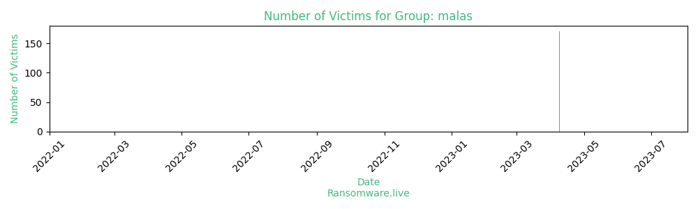

# Profiles for ransomware group : **malas**

🔎 `ransomware.live`has an active  parser for indexing malas's victims

### URLs
| Title | Available | Last visit | fqdn | Screenshot 
|---|---|---|---|---|
| Somos malas... podemos ser peores | 🟢 | 24/11/2023 12:37 | `http://malas2urovbyyavjzaezkt5ohljvyd5lt7vv7mnsgbf2y4bwlh72doqd.onion` | <a href="https://images.ransomware.live/screenshots/malas2urovbyyavjzaezkt5ohljvyd5lt7vv7mnsgbf2y4bwlh72doqd-onion.png" target=_blank>📸</a> | 

### Total Attacks Over Time

### Victims

> 171 victims found

| victim | date | Description | Screenshot | 
|---|---|---|---|
| [`Banco Azzoaglio`](https://google.com/search?q=Banco+Azzoaglio) | 09/04/2023 | using Zimbra vulnerability | <a href="https://images.ransomware.live/screenshots/posts/863238c49a91c1c18ddf1de4908d87eb.png" target=_blank>📸</a> |
| [`Ларина`](https://google.com/search?q=%D0%9B%D0%B0%D1%80%D0%B8%D0%BD%D0%B0) | 09/04/2023 | using Zimbra vulnerability | <a href="https://images.ransomware.live/screenshots/posts/863238c49a91c1c18ddf1de4908d87eb.png" target=_blank>📸</a> |
| [`Utair`](https://google.com/search?q=Utair) | 09/04/2023 | using Zimbra vulnerability | <a href="https://images.ransomware.live/screenshots/posts/863238c49a91c1c18ddf1de4908d87eb.png" target=_blank>📸</a> |
| [`The Sound Organisation`](https://google.com/search?q=The+Sound+Organisation) | 09/04/2023 | using Zimbra vulnerability | <a href="https://images.ransomware.live/screenshots/posts/863238c49a91c1c18ddf1de4908d87eb.png" target=_blank>📸</a> |
| [`Angle Metal Mfg.`](https://google.com/search?q=Angle+Metal+Mfg.) | 09/04/2023 | using Zimbra vulnerability | <a href="https://images.ransomware.live/screenshots/posts/863238c49a91c1c18ddf1de4908d87eb.png" target=_blank>📸</a> |
| [`Красный Восток Агро`](https://google.com/search?q=%D0%9A%D1%80%D0%B0%D1%81%D0%BD%D1%8B%D0%B9+%D0%92%D0%BE%D1%81%D1%82%D0%BE%D0%BA+%D0%90%D0%B3%D1%80%D0%BE) | 09/04/2023 | using Zimbra vulnerability | <a href="https://images.ransomware.live/screenshots/posts/863238c49a91c1c18ddf1de4908d87eb.png" target=_blank>📸</a> |
| [`Petromiralles`](https://google.com/search?q=Petromiralles) | 09/04/2023 | using Zimbra vulnerability | <a href="https://images.ransomware.live/screenshots/posts/863238c49a91c1c18ddf1de4908d87eb.png" target=_blank>📸</a> |
| [`nanoCAD`](https://google.com/search?q=nanoCAD) | 09/04/2023 | using Zimbra vulnerability | <a href="https://images.ransomware.live/screenshots/posts/863238c49a91c1c18ddf1de4908d87eb.png" target=_blank>📸</a> |
| [`Baggio`](https://google.com/search?q=Baggio) | 09/04/2023 | using Zimbra vulnerability | <a href="https://images.ransomware.live/screenshots/posts/863238c49a91c1c18ddf1de4908d87eb.png" target=_blank>📸</a> |
| [`ЖБИ2-Инвест`](https://google.com/search?q=%D0%96%D0%91%D0%982-%D0%98%D0%BD%D0%B2%D0%B5%D1%81%D1%82) | 09/04/2023 | using Zimbra vulnerability | <a href="https://images.ransomware.live/screenshots/posts/863238c49a91c1c18ddf1de4908d87eb.png" target=_blank>📸</a> |
| [`Город Кафе`](https://google.com/search?q=%D0%93%D0%BE%D1%80%D0%BE%D0%B4+%D0%9A%D0%B0%D1%84%D0%B5) | 09/04/2023 | using Zimbra vulnerability | <a href="https://images.ransomware.live/screenshots/posts/863238c49a91c1c18ddf1de4908d87eb.png" target=_blank>📸</a> |
| [`Diete-Siepmann`](https://google.com/search?q=Diete-Siepmann) | 09/04/2023 | using Zimbra vulnerability | <a href="https://images.ransomware.live/screenshots/posts/863238c49a91c1c18ddf1de4908d87eb.png" target=_blank>📸</a> |
| [`Fitser`](https://google.com/search?q=Fitser) | 09/04/2023 | using Zimbra vulnerability | <a href="https://images.ransomware.live/screenshots/posts/863238c49a91c1c18ddf1de4908d87eb.png" target=_blank>📸</a> |
| [`MHWEB`](https://google.com/search?q=MHWEB) | 09/04/2023 | using Zimbra vulnerability | <a href="https://images.ransomware.live/screenshots/posts/863238c49a91c1c18ddf1de4908d87eb.png" target=_blank>📸</a> |
| [`Pergler`](https://google.com/search?q=Pergler) | 09/04/2023 | using Zimbra vulnerability | <a href="https://images.ransomware.live/screenshots/posts/863238c49a91c1c18ddf1de4908d87eb.png" target=_blank>📸</a> |
| [`Имеди`](https://google.com/search?q=%D0%98%D0%BC%D0%B5%D0%B4%D0%B8) | 09/04/2023 | using Zimbra vulnerability | <a href="https://images.ransomware.live/screenshots/posts/863238c49a91c1c18ddf1de4908d87eb.png" target=_blank>📸</a> |
| [`Altia`](https://google.com/search?q=Altia) | 09/04/2023 | using Zimbra vulnerability | <a href="https://images.ransomware.live/screenshots/posts/863238c49a91c1c18ddf1de4908d87eb.png" target=_blank>📸</a> |
| [`Евроэкспо`](https://google.com/search?q=%D0%95%D0%B2%D1%80%D0%BE%D1%8D%D0%BA%D1%81%D0%BF%D0%BE) | 09/04/2023 | using Zimbra vulnerability | <a href="https://images.ransomware.live/screenshots/posts/863238c49a91c1c18ddf1de4908d87eb.png" target=_blank>📸</a> |
| [`Aster Cucine`](https://google.com/search?q=Aster+Cucine) | 09/04/2023 | using Zimbra vulnerability | <a href="https://images.ransomware.live/screenshots/posts/863238c49a91c1c18ddf1de4908d87eb.png" target=_blank>📸</a> |
| [`KondorCS`](https://google.com/search?q=KondorCS) | 09/04/2023 | using Zimbra vulnerability | <a href="https://images.ransomware.live/screenshots/posts/863238c49a91c1c18ddf1de4908d87eb.png" target=_blank>📸</a> |
| [`ФГУП “ЦНИИХМ”`](https://google.com/search?q=%D0%A4%D0%93%D0%A3%D0%9F+%E2%80%9C%D0%A6%D0%9D%D0%98%D0%98%D0%A5%D0%9C%E2%80%9D) | 09/04/2023 | using Zimbra vulnerability | <a href="https://images.ransomware.live/screenshots/posts/863238c49a91c1c18ddf1de4908d87eb.png" target=_blank>📸</a> |
| [`Custom Manufacturing & Engineering, Inc`](https://google.com/search?q=Custom+Manufacturing+%26+Engineering%2C+Inc) | 09/04/2023 | using Zimbra vulnerability | <a href="https://images.ransomware.live/screenshots/posts/863238c49a91c1c18ddf1de4908d87eb.png" target=_blank>📸</a> |
| [`Копчёнов`](https://google.com/search?q=%D0%9A%D0%BE%D0%BF%D1%87%D1%91%D0%BD%D0%BE%D0%B2) | 09/04/2023 | using Zimbra vulnerability | <a href="https://images.ransomware.live/screenshots/posts/863238c49a91c1c18ddf1de4908d87eb.png" target=_blank>📸</a> |
| [`ArCloud`](https://google.com/search?q=ArCloud) | 09/04/2023 | using Zimbra vulnerability | <a href="https://images.ransomware.live/screenshots/posts/863238c49a91c1c18ddf1de4908d87eb.png" target=_blank>📸</a> |
| [`Гласс Фурнитура`](https://google.com/search?q=%D0%93%D0%BB%D0%B0%D1%81%D1%81+%D0%A4%D1%83%D1%80%D0%BD%D0%B8%D1%82%D1%83%D1%80%D0%B0) | 09/04/2023 | using Zimbra vulnerability | <a href="https://images.ransomware.live/screenshots/posts/863238c49a91c1c18ddf1de4908d87eb.png" target=_blank>📸</a> |
| [`LunarWeb`](https://google.com/search?q=LunarWeb) | 09/04/2023 | using Zimbra vulnerability | <a href="https://images.ransomware.live/screenshots/posts/863238c49a91c1c18ddf1de4908d87eb.png" target=_blank>📸</a> |
| [`Oasis Ads Media`](https://google.com/search?q=Oasis+Ads+Media) | 09/04/2023 | using Zimbra vulnerability | <a href="https://images.ransomware.live/screenshots/posts/863238c49a91c1c18ddf1de4908d87eb.png" target=_blank>📸</a> |
| [`Azzurra Group`](https://google.com/search?q=Azzurra+Group) | 09/04/2023 | using Zimbra vulnerability | <a href="https://images.ransomware.live/screenshots/posts/863238c49a91c1c18ddf1de4908d87eb.png" target=_blank>📸</a> |
| [`ConnectTo`](https://google.com/search?q=ConnectTo) | 09/04/2023 | using Zimbra vulnerability | <a href="https://images.ransomware.live/screenshots/posts/863238c49a91c1c18ddf1de4908d87eb.png" target=_blank>📸</a> |
| [`Сервиста`](https://google.com/search?q=%D0%A1%D0%B5%D1%80%D0%B2%D0%B8%D1%81%D1%82%D0%B0) | 09/04/2023 | using Zimbra vulnerability | <a href="https://images.ransomware.live/screenshots/posts/863238c49a91c1c18ddf1de4908d87eb.png" target=_blank>📸</a> |
| [`Amersport`](https://google.com/search?q=Amersport) | 09/04/2023 | using Zimbra vulnerability | <a href="https://images.ransomware.live/screenshots/posts/863238c49a91c1c18ddf1de4908d87eb.png" target=_blank>📸</a> |
| [`Studio Negri e Associati`](https://google.com/search?q=Studio+Negri+e+Associati) | 09/04/2023 | using Zimbra vulnerability | <a href="https://images.ransomware.live/screenshots/posts/863238c49a91c1c18ddf1de4908d87eb.png" target=_blank>📸</a> |
| [`Hoteles Globales`](https://google.com/search?q=Hoteles+Globales) | 09/04/2023 | using Zimbra vulnerability | <a href="https://images.ransomware.live/screenshots/posts/863238c49a91c1c18ddf1de4908d87eb.png" target=_blank>📸</a> |
| [`HostingPerTe`](https://google.com/search?q=HostingPerTe) | 09/04/2023 | using Zimbra vulnerability | <a href="https://images.ransomware.live/screenshots/posts/863238c49a91c1c18ddf1de4908d87eb.png" target=_blank>📸</a> |
| [`Sita Software`](https://google.com/search?q=Sita+Software) | 09/04/2023 | using Zimbra vulnerability | <a href="https://images.ransomware.live/screenshots/posts/863238c49a91c1c18ddf1de4908d87eb.png" target=_blank>📸</a> |
| [`Exset`](https://google.com/search?q=Exset) | 09/04/2023 | using Zimbra vulnerability | <a href="https://images.ransomware.live/screenshots/posts/863238c49a91c1c18ddf1de4908d87eb.png" target=_blank>📸</a> |
| [`Fraport Skyliners`](https://google.com/search?q=Fraport+Skyliners) | 09/04/2023 | using Zimbra vulnerability | <a href="https://images.ransomware.live/screenshots/posts/863238c49a91c1c18ddf1de4908d87eb.png" target=_blank>📸</a> |
| [`D&G impianti elettrici`](https://google.com/search?q=D%26G+impianti+elettrici) | 09/04/2023 | using Zimbra vulnerability | <a href="https://images.ransomware.live/screenshots/posts/863238c49a91c1c18ddf1de4908d87eb.png" target=_blank>📸</a> |
| [`RepcoLite`](https://google.com/search?q=RepcoLite) | 09/04/2023 | using Zimbra vulnerability | <a href="https://images.ransomware.live/screenshots/posts/863238c49a91c1c18ddf1de4908d87eb.png" target=_blank>📸</a> |
| [`Sallemi Carburanti`](https://google.com/search?q=Sallemi+Carburanti) | 09/04/2023 | using Zimbra vulnerability | <a href="https://images.ransomware.live/screenshots/posts/863238c49a91c1c18ddf1de4908d87eb.png" target=_blank>📸</a> |
| [`BEI Srl`](https://google.com/search?q=BEI+Srl) | 09/04/2023 | using Zimbra vulnerability | <a href="https://images.ransomware.live/screenshots/posts/863238c49a91c1c18ddf1de4908d87eb.png" target=_blank>📸</a> |
| [`Bicom`](https://google.com/search?q=Bicom) | 09/04/2023 | using Zimbra vulnerability | <a href="https://images.ransomware.live/screenshots/posts/863238c49a91c1c18ddf1de4908d87eb.png" target=_blank>📸</a> |
| [`Transitus Group`](https://google.com/search?q=Transitus+Group) | 09/04/2023 | using Zimbra vulnerability | <a href="https://images.ransomware.live/screenshots/posts/863238c49a91c1c18ddf1de4908d87eb.png" target=_blank>📸</a> |
| [`spw.ru`](https://google.com/search?q=spw.ru) | 09/04/2023 | using Zimbra vulnerability | <a href="https://images.ransomware.live/screenshots/posts/863238c49a91c1c18ddf1de4908d87eb.png" target=_blank>📸</a> |
| [`Mappy Italia`](https://google.com/search?q=Mappy+Italia) | 09/04/2023 | using Zimbra vulnerability | <a href="https://images.ransomware.live/screenshots/posts/863238c49a91c1c18ddf1de4908d87eb.png" target=_blank>📸</a> |
| [`cashbackAPP`](https://google.com/search?q=cashbackAPP) | 09/04/2023 | using Zimbra vulnerability | <a href="https://images.ransomware.live/screenshots/posts/863238c49a91c1c18ddf1de4908d87eb.png" target=_blank>📸</a> |
| [`Bleu Blanc`](https://google.com/search?q=Bleu+Blanc) | 09/04/2023 | using Zimbra vulnerability | <a href="https://images.ransomware.live/screenshots/posts/863238c49a91c1c18ddf1de4908d87eb.png" target=_blank>📸</a> |
| [`KriaaNet Inc`](https://google.com/search?q=KriaaNet+Inc) | 09/04/2023 | using Zimbra vulnerability | <a href="https://images.ransomware.live/screenshots/posts/863238c49a91c1c18ddf1de4908d87eb.png" target=_blank>📸</a> |
| [`Hardman’s`](https://google.com/search?q=Hardman%E2%80%99s) | 09/04/2023 | using Zimbra vulnerability | <a href="https://images.ransomware.live/screenshots/posts/863238c49a91c1c18ddf1de4908d87eb.png" target=_blank>📸</a> |
| [`Ямалтелеком`](https://google.com/search?q=%D0%AF%D0%BC%D0%B0%D0%BB%D1%82%D0%B5%D0%BB%D0%B5%D0%BA%D0%BE%D0%BC) | 09/04/2023 | using Zimbra vulnerability | <a href="https://images.ransomware.live/screenshots/posts/863238c49a91c1c18ddf1de4908d87eb.png" target=_blank>📸</a> |
| [`Baur Hausverwaltung`](https://google.com/search?q=Baur+Hausverwaltung) | 09/04/2023 | using Zimbra vulnerability | <a href="https://images.ransomware.live/screenshots/posts/863238c49a91c1c18ddf1de4908d87eb.png" target=_blank>📸</a> |
| [`Grupo Fatecsa`](https://google.com/search?q=Grupo+Fatecsa) | 09/04/2023 | using Zimbra vulnerability | <a href="https://images.ransomware.live/screenshots/posts/863238c49a91c1c18ddf1de4908d87eb.png" target=_blank>📸</a> |
| [`InfinCE`](https://google.com/search?q=InfinCE) | 09/04/2023 | using Zimbra vulnerability | <a href="https://images.ransomware.live/screenshots/posts/863238c49a91c1c18ddf1de4908d87eb.png" target=_blank>📸</a> |
| [`SkyFORS`](https://google.com/search?q=SkyFORS) | 09/04/2023 | using Zimbra vulnerability | <a href="https://images.ransomware.live/screenshots/posts/863238c49a91c1c18ddf1de4908d87eb.png" target=_blank>📸</a> |
| [`Balbi Srl`](https://google.com/search?q=Balbi+Srl) | 09/04/2023 | using Zimbra vulnerability | <a href="https://images.ransomware.live/screenshots/posts/863238c49a91c1c18ddf1de4908d87eb.png" target=_blank>📸</a> |
| [`Steelgroup`](https://google.com/search?q=Steelgroup) | 09/04/2023 | using Zimbra vulnerability | <a href="https://images.ransomware.live/screenshots/posts/863238c49a91c1c18ddf1de4908d87eb.png" target=_blank>📸</a> |
| [`СКППК`](https://google.com/search?q=%D0%A1%D0%9A%D0%9F%D0%9F%D0%9A) | 09/04/2023 | using Zimbra vulnerability | <a href="https://images.ransomware.live/screenshots/posts/863238c49a91c1c18ddf1de4908d87eb.png" target=_blank>📸</a> |
| [`DSSL`](https://google.com/search?q=DSSL) | 09/04/2023 | using Zimbra vulnerability | <a href="https://images.ransomware.live/screenshots/posts/863238c49a91c1c18ddf1de4908d87eb.png" target=_blank>📸</a> |
| [`Kouros`](https://google.com/search?q=Kouros) | 09/04/2023 | using Zimbra vulnerability | <a href="https://images.ransomware.live/screenshots/posts/863238c49a91c1c18ddf1de4908d87eb.png" target=_blank>📸</a> |
| [`Johnston Technical Services`](https://google.com/search?q=Johnston+Technical+Services) | 09/04/2023 | using Zimbra vulnerability | <a href="https://images.ransomware.live/screenshots/posts/863238c49a91c1c18ddf1de4908d87eb.png" target=_blank>📸</a> |
| [`BE.iT SA`](https://google.com/search?q=BE.iT+SA) | 09/04/2023 | using Zimbra vulnerability | <a href="https://images.ransomware.live/screenshots/posts/863238c49a91c1c18ddf1de4908d87eb.png" target=_blank>📸</a> |
| [`Horseman Sim`](https://google.com/search?q=Horseman+Sim) | 09/04/2023 | using Zimbra vulnerability | <a href="https://images.ransomware.live/screenshots/posts/863238c49a91c1c18ddf1de4908d87eb.png" target=_blank>📸</a> |
| [`Zite Media`](https://google.com/search?q=Zite+Media) | 09/04/2023 | using Zimbra vulnerability | <a href="https://images.ransomware.live/screenshots/posts/863238c49a91c1c18ddf1de4908d87eb.png" target=_blank>📸</a> |
| [`Трансбалт`](https://google.com/search?q=%D0%A2%D1%80%D0%B0%D0%BD%D1%81%D0%B1%D0%B0%D0%BB%D1%82) | 09/04/2023 | using Zimbra vulnerability | <a href="https://images.ransomware.live/screenshots/posts/863238c49a91c1c18ddf1de4908d87eb.png" target=_blank>📸</a> |
| [`Формекс`](https://google.com/search?q=%D0%A4%D0%BE%D1%80%D0%BC%D0%B5%D0%BA%D1%81) | 09/04/2023 | using Zimbra vulnerability | <a href="https://images.ransomware.live/screenshots/posts/863238c49a91c1c18ddf1de4908d87eb.png" target=_blank>📸</a> |
| [`Pasquetti Sarti & Partners`](https://google.com/search?q=Pasquetti+Sarti+%26+Partners) | 09/04/2023 | using Zimbra vulnerability | <a href="https://images.ransomware.live/screenshots/posts/863238c49a91c1c18ddf1de4908d87eb.png" target=_blank>📸</a> |
| [`Herold Druck`](https://google.com/search?q=Herold+Druck) | 09/04/2023 | using Zimbra vulnerability | <a href="https://images.ransomware.live/screenshots/posts/863238c49a91c1c18ddf1de4908d87eb.png" target=_blank>📸</a> |
| [`paulmitchell.ru`](https://google.com/search?q=paulmitchell.ru) | 09/04/2023 | using Zimbra vulnerability | <a href="https://images.ransomware.live/screenshots/posts/863238c49a91c1c18ddf1de4908d87eb.png" target=_blank>📸</a> |
| [`Nu-Pro Group`](https://google.com/search?q=Nu-Pro+Group) | 09/04/2023 | using Zimbra vulnerability | <a href="https://images.ransomware.live/screenshots/posts/863238c49a91c1c18ddf1de4908d87eb.png" target=_blank>📸</a> |
| [`Studio Eco Perucca`](https://google.com/search?q=Studio+Eco+Perucca) | 09/04/2023 | using Zimbra vulnerability | <a href="https://images.ransomware.live/screenshots/posts/863238c49a91c1c18ddf1de4908d87eb.png" target=_blank>📸</a> |
| [`Axon Certified Auditors`](https://google.com/search?q=Axon+Certified+Auditors) | 09/04/2023 | using Zimbra vulnerability | <a href="https://images.ransomware.live/screenshots/posts/863238c49a91c1c18ddf1de4908d87eb.png" target=_blank>📸</a> |
| [`Studio Rossetti e Partners`](https://google.com/search?q=Studio+Rossetti+e+Partners) | 09/04/2023 | using Zimbra vulnerability | <a href="https://images.ransomware.live/screenshots/posts/863238c49a91c1c18ddf1de4908d87eb.png" target=_blank>📸</a> |
| [`Riboli srl`](https://google.com/search?q=Riboli+srl) | 09/04/2023 | using Zimbra vulnerability | <a href="https://images.ransomware.live/screenshots/posts/863238c49a91c1c18ddf1de4908d87eb.png" target=_blank>📸</a> |
| [`meta-spb`](https://google.com/search?q=meta-spb) | 09/04/2023 | using Zimbra vulnerability | <a href="https://images.ransomware.live/screenshots/posts/863238c49a91c1c18ddf1de4908d87eb.png" target=_blank>📸</a> |
| [`Studio Consulenza`](https://google.com/search?q=Studio+Consulenza) | 09/04/2023 | using Zimbra vulnerability | <a href="https://images.ransomware.live/screenshots/posts/863238c49a91c1c18ddf1de4908d87eb.png" target=_blank>📸</a> |
| [`3Punto6`](https://google.com/search?q=3Punto6) | 09/04/2023 | using Zimbra vulnerability | <a href="https://images.ransomware.live/screenshots/posts/863238c49a91c1c18ddf1de4908d87eb.png" target=_blank>📸</a> |
| [`Gallagher & Co Consultants`](https://google.com/search?q=Gallagher+%26+Co+Consultants) | 09/04/2023 | using Zimbra vulnerability | <a href="https://images.ransomware.live/screenshots/posts/863238c49a91c1c18ddf1de4908d87eb.png" target=_blank>📸</a> |
| [`Evropoly`](https://google.com/search?q=Evropoly) | 09/04/2023 | using Zimbra vulnerability | <a href="https://images.ransomware.live/screenshots/posts/863238c49a91c1c18ddf1de4908d87eb.png" target=_blank>📸</a> |
| [`Псковпассажиравтотранс`](https://google.com/search?q=%D0%9F%D1%81%D0%BA%D0%BE%D0%B2%D0%BF%D0%B0%D1%81%D1%81%D0%B0%D0%B6%D0%B8%D1%80%D0%B0%D0%B2%D1%82%D0%BE%D1%82%D1%80%D0%B0%D0%BD%D1%81) | 09/04/2023 | using Zimbra vulnerability | <a href="https://images.ransomware.live/screenshots/posts/863238c49a91c1c18ddf1de4908d87eb.png" target=_blank>📸</a> |
| [`Cosmos Hotel Group`](https://google.com/search?q=Cosmos+Hotel+Group) | 09/04/2023 | using Zimbra vulnerability | <a href="https://images.ransomware.live/screenshots/posts/863238c49a91c1c18ddf1de4908d87eb.png" target=_blank>📸</a> |
| [`ICT-LabS`](https://google.com/search?q=ICT-LabS) | 09/04/2023 | using Zimbra vulnerability | <a href="https://images.ransomware.live/screenshots/posts/863238c49a91c1c18ddf1de4908d87eb.png" target=_blank>📸</a> |
| [`Mobalpa Biarritz`](https://google.com/search?q=Mobalpa+Biarritz) | 09/04/2023 | using Zimbra vulnerability | <a href="https://images.ransomware.live/screenshots/posts/863238c49a91c1c18ddf1de4908d87eb.png" target=_blank>📸</a> |
| [`FEA srl`](https://google.com/search?q=FEA+srl) | 09/04/2023 | using Zimbra vulnerability | <a href="https://images.ransomware.live/screenshots/posts/863238c49a91c1c18ddf1de4908d87eb.png" target=_blank>📸</a> |
| [`Grassi srl`](https://google.com/search?q=Grassi+srl) | 09/04/2023 | using Zimbra vulnerability | <a href="https://images.ransomware.live/screenshots/posts/863238c49a91c1c18ddf1de4908d87eb.png" target=_blank>📸</a> |
| [`Tycoon Group`](https://google.com/search?q=Tycoon+Group) | 09/04/2023 | using Zimbra vulnerability | <a href="https://images.ransomware.live/screenshots/posts/863238c49a91c1c18ddf1de4908d87eb.png" target=_blank>📸</a> |
| [`Fresh-Heads IT`](https://google.com/search?q=Fresh-Heads+IT) | 09/04/2023 | using Zimbra vulnerability | <a href="https://images.ransomware.live/screenshots/posts/863238c49a91c1c18ddf1de4908d87eb.png" target=_blank>📸</a> |
| [`Vegliolux`](https://google.com/search?q=Vegliolux) | 09/04/2023 | using Zimbra vulnerability | <a href="https://images.ransomware.live/screenshots/posts/863238c49a91c1c18ddf1de4908d87eb.png" target=_blank>📸</a> |
| [`AVM Software & Technology`](https://google.com/search?q=AVM+Software+%26+Technology) | 09/04/2023 | using Zimbra vulnerability | <a href="https://images.ransomware.live/screenshots/posts/863238c49a91c1c18ddf1de4908d87eb.png" target=_blank>📸</a> |
| [`ТрансКом-Авиа`](https://google.com/search?q=%D0%A2%D1%80%D0%B0%D0%BD%D1%81%D0%9A%D0%BE%D0%BC-%D0%90%D0%B2%D0%B8%D0%B0) | 09/04/2023 | using Zimbra vulnerability | <a href="https://images.ransomware.live/screenshots/posts/863238c49a91c1c18ddf1de4908d87eb.png" target=_blank>📸</a> |
| [`Specialinsert`](https://google.com/search?q=Specialinsert) | 09/04/2023 | using Zimbra vulnerability | <a href="https://images.ransomware.live/screenshots/posts/863238c49a91c1c18ddf1de4908d87eb.png" target=_blank>📸</a> |
| [`Totality Solutions`](https://google.com/search?q=Totality+Solutions) | 09/04/2023 | using Zimbra vulnerability | <a href="https://images.ransomware.live/screenshots/posts/863238c49a91c1c18ddf1de4908d87eb.png" target=_blank>📸</a> |
| [`СК БлагоДать`](https://google.com/search?q=%D0%A1%D0%9A+%D0%91%D0%BB%D0%B0%D0%B3%D0%BE%D0%94%D0%B0%D1%82%D1%8C) | 09/04/2023 | using Zimbra vulnerability | <a href="https://images.ransomware.live/screenshots/posts/863238c49a91c1c18ddf1de4908d87eb.png" target=_blank>📸</a> |
| [`Астра`](https://google.com/search?q=%D0%90%D1%81%D1%82%D1%80%D0%B0) | 09/04/2023 | using Zimbra vulnerability | <a href="https://images.ransomware.live/screenshots/posts/863238c49a91c1c18ddf1de4908d87eb.png" target=_blank>📸</a> |
| [`Универсалресурс`](https://google.com/search?q=%D0%A3%D0%BD%D0%B8%D0%B2%D0%B5%D1%80%D1%81%D0%B0%D0%BB%D1%80%D0%B5%D1%81%D1%83%D1%80%D1%81) | 09/04/2023 | using Zimbra vulnerability | <a href="https://images.ransomware.live/screenshots/posts/863238c49a91c1c18ddf1de4908d87eb.png" target=_blank>📸</a> |
| [`TCG`](https://google.com/search?q=TCG) | 09/04/2023 | using Zimbra vulnerability | <a href="https://images.ransomware.live/screenshots/posts/863238c49a91c1c18ddf1de4908d87eb.png" target=_blank>📸</a> |
| [`PMP Meccanica`](https://google.com/search?q=PMP+Meccanica) | 09/04/2023 | using Zimbra vulnerability | <a href="https://images.ransomware.live/screenshots/posts/863238c49a91c1c18ddf1de4908d87eb.png" target=_blank>📸</a> |
| [`Axon`](https://google.com/search?q=Axon) | 09/04/2023 | using Zimbra vulnerability | <a href="https://images.ransomware.live/screenshots/posts/863238c49a91c1c18ddf1de4908d87eb.png" target=_blank>📸</a> |
| [`OPIT Solutions`](https://google.com/search?q=OPIT+Solutions) | 09/04/2023 | using Zimbra vulnerability | <a href="https://images.ransomware.live/screenshots/posts/863238c49a91c1c18ddf1de4908d87eb.png" target=_blank>📸</a> |
| [`ISONA GmbH`](https://google.com/search?q=ISONA+GmbH) | 09/04/2023 | using Zimbra vulnerability | <a href="https://images.ransomware.live/screenshots/posts/863238c49a91c1c18ddf1de4908d87eb.png" target=_blank>📸</a> |
| [`Терра-Минора`](https://google.com/search?q=%D0%A2%D0%B5%D1%80%D1%80%D0%B0-%D0%9C%D0%B8%D0%BD%D0%BE%D1%80%D0%B0) | 09/04/2023 | using Zimbra vulnerability | <a href="https://images.ransomware.live/screenshots/posts/863238c49a91c1c18ddf1de4908d87eb.png" target=_blank>📸</a> |
| [`Азимут НТ`](https://google.com/search?q=%D0%90%D0%B7%D0%B8%D0%BC%D1%83%D1%82+%D0%9D%D0%A2) | 09/04/2023 | using Zimbra vulnerability | <a href="https://images.ransomware.live/screenshots/posts/863238c49a91c1c18ddf1de4908d87eb.png" target=_blank>📸</a> |
| [`BenarIT`](https://google.com/search?q=BenarIT) | 09/04/2023 | using Zimbra vulnerability | <a href="https://images.ransomware.live/screenshots/posts/863238c49a91c1c18ddf1de4908d87eb.png" target=_blank>📸</a> |
| [`Asanger Modellbau`](https://google.com/search?q=Asanger+Modellbau) | 09/04/2023 | using Zimbra vulnerability | <a href="https://images.ransomware.live/screenshots/posts/863238c49a91c1c18ddf1de4908d87eb.png" target=_blank>📸</a> |
| [`Iris Key Solutions`](https://google.com/search?q=Iris+Key+Solutions) | 09/04/2023 | using Zimbra vulnerability | <a href="https://images.ransomware.live/screenshots/posts/863238c49a91c1c18ddf1de4908d87eb.png" target=_blank>📸</a> |
| [`Невский Альянс`](https://google.com/search?q=%D0%9D%D0%B5%D0%B2%D1%81%D0%BA%D0%B8%D0%B9+%D0%90%D0%BB%D1%8C%D1%8F%D0%BD%D1%81) | 09/04/2023 | using Zimbra vulnerability | <a href="https://images.ransomware.live/screenshots/posts/863238c49a91c1c18ddf1de4908d87eb.png" target=_blank>📸</a> |
| [`NTD SA`](https://google.com/search?q=NTD+SA) | 09/04/2023 | using Zimbra vulnerability | <a href="https://images.ransomware.live/screenshots/posts/863238c49a91c1c18ddf1de4908d87eb.png" target=_blank>📸</a> |
| [`ATE Elettronica`](https://google.com/search?q=ATE+Elettronica) | 09/04/2023 | using Zimbra vulnerability | <a href="https://images.ransomware.live/screenshots/posts/863238c49a91c1c18ddf1de4908d87eb.png" target=_blank>📸</a> |
| [`Answerpro`](https://google.com/search?q=Answerpro) | 09/04/2023 | using Zimbra vulnerability | <a href="https://images.ransomware.live/screenshots/posts/863238c49a91c1c18ddf1de4908d87eb.png" target=_blank>📸</a> |
| [`Onubo s.r.l.`](https://google.com/search?q=Onubo+s.r.l.) | 09/04/2023 | using Zimbra vulnerability | <a href="https://images.ransomware.live/screenshots/posts/863238c49a91c1c18ddf1de4908d87eb.png" target=_blank>📸</a> |
| [`Гис Нефтесервис`](https://google.com/search?q=%D0%93%D0%B8%D1%81+%D0%9D%D0%B5%D1%84%D1%82%D0%B5%D1%81%D0%B5%D1%80%D0%B2%D0%B8%D1%81) | 09/04/2023 | using Zimbra vulnerability | <a href="https://images.ransomware.live/screenshots/posts/863238c49a91c1c18ddf1de4908d87eb.png" target=_blank>📸</a> |
| [`Commerciale Ferramenta`](https://google.com/search?q=Commerciale+Ferramenta) | 09/04/2023 | using Zimbra vulnerability | <a href="https://images.ransomware.live/screenshots/posts/863238c49a91c1c18ddf1de4908d87eb.png" target=_blank>📸</a> |
| [`KomGarant`](https://google.com/search?q=KomGarant) | 09/04/2023 | using Zimbra vulnerability | <a href="https://images.ransomware.live/screenshots/posts/863238c49a91c1c18ddf1de4908d87eb.png" target=_blank>📸</a> |
| [`Froese & Partner`](https://google.com/search?q=Froese+%26+Partner) | 09/04/2023 | using Zimbra vulnerability | <a href="https://images.ransomware.live/screenshots/posts/863238c49a91c1c18ddf1de4908d87eb.png" target=_blank>📸</a> |
| [`BMW Алдис`](https://google.com/search?q=BMW+%D0%90%D0%BB%D0%B4%D0%B8%D1%81) | 09/04/2023 | using Zimbra vulnerability | <a href="https://images.ransomware.live/screenshots/posts/863238c49a91c1c18ddf1de4908d87eb.png" target=_blank>📸</a> |
| [`ВК Логистик`](https://google.com/search?q=%D0%92%D0%9A+%D0%9B%D0%BE%D0%B3%D0%B8%D1%81%D1%82%D0%B8%D0%BA) | 09/04/2023 | using Zimbra vulnerability | <a href="https://images.ransomware.live/screenshots/posts/863238c49a91c1c18ddf1de4908d87eb.png" target=_blank>📸</a> |
| [`SBG Global`](https://google.com/search?q=SBG+Global) | 09/04/2023 | using Zimbra vulnerability | <a href="https://images.ransomware.live/screenshots/posts/863238c49a91c1c18ddf1de4908d87eb.png" target=_blank>📸</a> |
| [`Winner Italia`](https://google.com/search?q=Winner+Italia) | 09/04/2023 | using Zimbra vulnerability | <a href="https://images.ransomware.live/screenshots/posts/863238c49a91c1c18ddf1de4908d87eb.png" target=_blank>📸</a> |
| [`SA.FI`](https://google.com/search?q=SA.FI) | 09/04/2023 | using Zimbra vulnerability | <a href="https://images.ransomware.live/screenshots/posts/863238c49a91c1c18ddf1de4908d87eb.png" target=_blank>📸</a> |
| [`Rivas Boquete SL`](https://google.com/search?q=Rivas+Boquete+SL) | 09/04/2023 | using Zimbra vulnerability | <a href="https://images.ransomware.live/screenshots/posts/863238c49a91c1c18ddf1de4908d87eb.png" target=_blank>📸</a> |
| [`TitanPower`](https://google.com/search?q=TitanPower) | 09/04/2023 | using Zimbra vulnerability | <a href="https://images.ransomware.live/screenshots/posts/863238c49a91c1c18ddf1de4908d87eb.png" target=_blank>📸</a> |
| [`Qball Technologies`](https://google.com/search?q=Qball+Technologies) | 09/04/2023 | using Zimbra vulnerability | <a href="https://images.ransomware.live/screenshots/posts/863238c49a91c1c18ddf1de4908d87eb.png" target=_blank>📸</a> |
| [`Villa Grazioli`](https://google.com/search?q=Villa+Grazioli) | 09/04/2023 | using Zimbra vulnerability | <a href="https://images.ransomware.live/screenshots/posts/863238c49a91c1c18ddf1de4908d87eb.png" target=_blank>📸</a> |
| [`Accurate Section Benders`](https://google.com/search?q=Accurate+Section+Benders) | 09/04/2023 | using Zimbra vulnerability | <a href="https://images.ransomware.live/screenshots/posts/863238c49a91c1c18ddf1de4908d87eb.png" target=_blank>📸</a> |
| [`INFINREAL Immobilien GmbH`](https://google.com/search?q=INFINREAL+Immobilien+GmbH) | 09/04/2023 | using Zimbra vulnerability | <a href="https://images.ransomware.live/screenshots/posts/863238c49a91c1c18ddf1de4908d87eb.png" target=_blank>📸</a> |
| [`Evology Manufacturing`](https://google.com/search?q=Evology+Manufacturing) | 09/04/2023 | using Zimbra vulnerability | <a href="https://images.ransomware.live/screenshots/posts/863238c49a91c1c18ddf1de4908d87eb.png" target=_blank>📸</a> |
| [`Omniglobe Business Solutions`](https://google.com/search?q=Omniglobe+Business+Solutions) | 09/04/2023 | using Zimbra vulnerability | <a href="https://images.ransomware.live/screenshots/posts/863238c49a91c1c18ddf1de4908d87eb.png" target=_blank>📸</a> |
| [`happy-snack.ru`](https://google.com/search?q=happy-snack.ru) | 09/04/2023 | using Zimbra vulnerability | <a href="https://images.ransomware.live/screenshots/posts/863238c49a91c1c18ddf1de4908d87eb.png" target=_blank>📸</a> |
| [`Loeje Trust SA`](https://google.com/search?q=Loeje+Trust+SA) | 09/04/2023 | using Zimbra vulnerability | <a href="https://images.ransomware.live/screenshots/posts/863238c49a91c1c18ddf1de4908d87eb.png" target=_blank>📸</a> |
| [`Legato`](https://google.com/search?q=Legato) | 09/04/2023 | using Zimbra vulnerability | <a href="https://images.ransomware.live/screenshots/posts/863238c49a91c1c18ddf1de4908d87eb.png" target=_blank>📸</a> |
| [`Boarding Concept`](https://google.com/search?q=Boarding+Concept) | 09/04/2023 | using Zimbra vulnerability | <a href="https://images.ransomware.live/screenshots/posts/863238c49a91c1c18ddf1de4908d87eb.png" target=_blank>📸</a> |
| [`NEXT OS`](https://google.com/search?q=NEXT+OS) | 09/04/2023 | using Zimbra vulnerability | <a href="https://images.ransomware.live/screenshots/posts/863238c49a91c1c18ddf1de4908d87eb.png" target=_blank>📸</a> |
| [`International Cargo Equipment`](https://google.com/search?q=International+Cargo+Equipment) | 09/04/2023 | using Zimbra vulnerability | <a href="https://images.ransomware.live/screenshots/posts/863238c49a91c1c18ddf1de4908d87eb.png" target=_blank>📸</a> |
| [`NTA srl`](https://google.com/search?q=NTA+srl) | 09/04/2023 | using Zimbra vulnerability | <a href="https://images.ransomware.live/screenshots/posts/863238c49a91c1c18ddf1de4908d87eb.png" target=_blank>📸</a> |
| [`Altarix`](https://google.com/search?q=Altarix) | 09/04/2023 | using Zimbra vulnerability | <a href="https://images.ransomware.live/screenshots/posts/863238c49a91c1c18ddf1de4908d87eb.png" target=_blank>📸</a> |
| [`Confindustria Energia`](https://google.com/search?q=Confindustria+Energia) | 09/04/2023 | using Zimbra vulnerability | <a href="https://images.ransomware.live/screenshots/posts/863238c49a91c1c18ddf1de4908d87eb.png" target=_blank>📸</a> |
| [`TBIT Services`](https://google.com/search?q=TBIT+Services) | 09/04/2023 | using Zimbra vulnerability | <a href="https://images.ransomware.live/screenshots/posts/863238c49a91c1c18ddf1de4908d87eb.png" target=_blank>📸</a> |
| [`JvG Consulting`](https://google.com/search?q=JvG+Consulting) | 09/04/2023 | using Zimbra vulnerability | <a href="https://images.ransomware.live/screenshots/posts/863238c49a91c1c18ddf1de4908d87eb.png" target=_blank>📸</a> |
| [`FinRe Consulting`](https://google.com/search?q=FinRe+Consulting) | 09/04/2023 | using Zimbra vulnerability | <a href="https://images.ransomware.live/screenshots/posts/863238c49a91c1c18ddf1de4908d87eb.png" target=_blank>📸</a> |
| [`RusExport Ltd`](https://google.com/search?q=RusExport+Ltd) | 09/04/2023 | using Zimbra vulnerability | <a href="https://images.ransomware.live/screenshots/posts/863238c49a91c1c18ddf1de4908d87eb.png" target=_blank>📸</a> |
| [`Next Generation Srl`](https://google.com/search?q=Next+Generation+Srl) | 09/04/2023 | using Zimbra vulnerability | <a href="https://images.ransomware.live/screenshots/posts/863238c49a91c1c18ddf1de4908d87eb.png" target=_blank>📸</a> |
| [`Wishmaster`](https://google.com/search?q=Wishmaster) | 09/04/2023 | using Zimbra vulnerability | <a href="https://images.ransomware.live/screenshots/posts/863238c49a91c1c18ddf1de4908d87eb.png" target=_blank>📸</a> |
| [`Business Travel Solutions`](https://google.com/search?q=Business+Travel+Solutions) | 09/04/2023 | using Zimbra vulnerability | <a href="https://images.ransomware.live/screenshots/posts/863238c49a91c1c18ddf1de4908d87eb.png" target=_blank>📸</a> |
| [`Гудвин-Нева`](https://google.com/search?q=%D0%93%D1%83%D0%B4%D0%B2%D0%B8%D0%BD-%D0%9D%D0%B5%D0%B2%D0%B0) | 09/04/2023 | using Zimbra vulnerability | <a href="https://images.ransomware.live/screenshots/posts/863238c49a91c1c18ddf1de4908d87eb.png" target=_blank>📸</a> |
| [`Etanova`](https://google.com/search?q=Etanova) | 09/04/2023 | using Zimbra vulnerability | <a href="https://images.ransomware.live/screenshots/posts/863238c49a91c1c18ddf1de4908d87eb.png" target=_blank>📸</a> |
| [`Studio Papa`](https://google.com/search?q=Studio+Papa) | 09/04/2023 | using Zimbra vulnerability | <a href="https://images.ransomware.live/screenshots/posts/863238c49a91c1c18ddf1de4908d87eb.png" target=_blank>📸</a> |
| [`reg22`](https://google.com/search?q=reg22) | 09/04/2023 | using Zimbra vulnerability | <a href="https://images.ransomware.live/screenshots/posts/863238c49a91c1c18ddf1de4908d87eb.png" target=_blank>📸</a> |
| [`Hotel Smeraldo`](https://google.com/search?q=Hotel+Smeraldo) | 09/04/2023 | using Zimbra vulnerability | <a href="https://images.ransomware.live/screenshots/posts/863238c49a91c1c18ddf1de4908d87eb.png" target=_blank>📸</a> |
| [`Chiltern Networks`](https://google.com/search?q=Chiltern+Networks) | 09/04/2023 | using Zimbra vulnerability | <a href="https://images.ransomware.live/screenshots/posts/863238c49a91c1c18ddf1de4908d87eb.png" target=_blank>📸</a> |
| [`radiosvet`](https://google.com/search?q=radiosvet) | 09/04/2023 | using Zimbra vulnerability | <a href="https://images.ransomware.live/screenshots/posts/863238c49a91c1c18ddf1de4908d87eb.png" target=_blank>📸</a> |
| [`Wpat`](https://google.com/search?q=Wpat) | 09/04/2023 | using Zimbra vulnerability | <a href="https://images.ransomware.live/screenshots/posts/863238c49a91c1c18ddf1de4908d87eb.png" target=_blank>📸</a> |
| [`Spectris Business Systems`](https://google.com/search?q=Spectris+Business+Systems) | 09/04/2023 | using Zimbra vulnerability | <a href="https://images.ransomware.live/screenshots/posts/863238c49a91c1c18ddf1de4908d87eb.png" target=_blank>📸</a> |
| [`Мебельснаб`](https://google.com/search?q=%D0%9C%D0%B5%D0%B1%D0%B5%D0%BB%D1%8C%D1%81%D0%BD%D0%B0%D0%B1) | 09/04/2023 | using Zimbra vulnerability | <a href="https://images.ransomware.live/screenshots/posts/863238c49a91c1c18ddf1de4908d87eb.png" target=_blank>📸</a> |
| [`Orcutt Winslow`](https://google.com/search?q=Orcutt+Winslow) | 09/04/2023 | using Zimbra vulnerability | <a href="https://images.ransomware.live/screenshots/posts/863238c49a91c1c18ddf1de4908d87eb.png" target=_blank>📸</a> |
| [`Mangum Construction`](https://google.com/search?q=Mangum+Construction) | 09/04/2023 | using Zimbra vulnerability | <a href="https://images.ransomware.live/screenshots/posts/863238c49a91c1c18ddf1de4908d87eb.png" target=_blank>📸</a> |
| [`AMET`](https://google.com/search?q=AMET) | 09/04/2023 | using Zimbra vulnerability | <a href="https://images.ransomware.live/screenshots/posts/863238c49a91c1c18ddf1de4908d87eb.png" target=_blank>📸</a> |
| [`Preference Portugal`](https://google.com/search?q=Preference+Portugal) | 09/04/2023 | using Zimbra vulnerability | <a href="https://images.ransomware.live/screenshots/posts/863238c49a91c1c18ddf1de4908d87eb.png" target=_blank>📸</a> |
| [`Км Профиль`](https://google.com/search?q=%D0%9A%D0%BC+%D0%9F%D1%80%D0%BE%D1%84%D0%B8%D0%BB%D1%8C) | 09/04/2023 | using Zimbra vulnerability | <a href="https://images.ransomware.live/screenshots/posts/863238c49a91c1c18ddf1de4908d87eb.png" target=_blank>📸</a> |
| [`Livitek`](https://google.com/search?q=Livitek) | 09/04/2023 | using Zimbra vulnerability | <a href="https://images.ransomware.live/screenshots/posts/863238c49a91c1c18ddf1de4908d87eb.png" target=_blank>📸</a> |
| [`Chernoff Thompson Architects`](https://google.com/search?q=Chernoff+Thompson+Architects) | 09/04/2023 | using Zimbra vulnerability | <a href="https://images.ransomware.live/screenshots/posts/863238c49a91c1c18ddf1de4908d87eb.png" target=_blank>📸</a> |
| [`Dalim Software GmbH`](https://google.com/search?q=Dalim+Software+GmbH) | 09/04/2023 | using Zimbra vulnerability | <a href="https://images.ransomware.live/screenshots/posts/863238c49a91c1c18ddf1de4908d87eb.png" target=_blank>📸</a> |
| [`Bicom`](https://google.com/search?q=Bicom) | 09/04/2023 | using Zimbra vulnerability | <a href="https://images.ransomware.live/screenshots/posts/863238c49a91c1c18ddf1de4908d87eb.png" target=_blank>📸</a> |
| [`Propac S.r.l.`](https://google.com/search?q=Propac+S.r.l.) | 09/04/2023 | using Zimbra vulnerability | <a href="https://images.ransomware.live/screenshots/posts/863238c49a91c1c18ddf1de4908d87eb.png" target=_blank>📸</a> |
| [`MetaContratas`](https://google.com/search?q=MetaContratas) | 09/04/2023 | using Zimbra vulnerability | <a href="https://images.ransomware.live/screenshots/posts/863238c49a91c1c18ddf1de4908d87eb.png" target=_blank>📸</a> |
| [`ISG Software Group`](https://google.com/search?q=ISG+Software+Group) | 09/04/2023 | using Zimbra vulnerability | <a href="https://images.ransomware.live/screenshots/posts/863238c49a91c1c18ddf1de4908d87eb.png" target=_blank>📸</a> |
| [`еКредит`](https://google.com/search?q=%D0%B5%D0%9A%D1%80%D0%B5%D0%B4%D0%B8%D1%82) | 09/04/2023 | using Zimbra vulnerability | <a href="https://images.ransomware.live/screenshots/posts/863238c49a91c1c18ddf1de4908d87eb.png" target=_blank>📸</a> |
| [`IPG Automotive GmbH`](https://google.com/search?q=IPG+Automotive+GmbH) | 09/04/2023 | using Zimbra vulnerability | <a href="https://images.ransomware.live/screenshots/posts/863238c49a91c1c18ddf1de4908d87eb.png" target=_blank>📸</a> |
| [`AViSTO`](https://google.com/search?q=AViSTO) | 09/04/2023 | using Zimbra vulnerability | <a href="https://images.ransomware.live/screenshots/posts/863238c49a91c1c18ddf1de4908d87eb.png" target=_blank>📸</a> |
| [`BeeVoip`](https://google.com/search?q=BeeVoip) | 09/04/2023 | using Zimbra vulnerability | <a href="https://images.ransomware.live/screenshots/posts/863238c49a91c1c18ddf1de4908d87eb.png" target=_blank>📸</a> |
| [`Anstel`](https://google.com/search?q=Anstel) | 09/04/2023 | using Zimbra vulnerability | <a href="https://images.ransomware.live/screenshots/posts/863238c49a91c1c18ddf1de4908d87eb.png" target=_blank>📸</a> |
| [`Compañía Agricola San Felipe`](https://google.com/search?q=Compa%C3%B1%C3%ADa+Agricola+San+Felipe) | 09/04/2023 | &lt;p&gt;Your work is collecting and repossessing from struggling people? Don&amp;rsquo;t complain when we come to repossess your own files | <a href="https://images.ransomware.live/screenshots/posts/4a65f9015da42cf8d38cd538622a097b.png" target=_blank>📸</a> |
| [`Fort Rolins Collection Agency`](https://google.com/search?q=Fort+Rolins+Collection+Agency) | 09/04/2023 | &lt;p&gt;They act like they don&amp;rsquo;t see🙈 our ransom note🗒 , or they just don&amp;rsquo;t negotiate🤝with cyberterrorists💣. They restore their backups and think ignoring us🙉 makes us go away. So now we also restore their backups, for all of you.&lt;/p&gt; &lt;p&gt;Harita Group is dedicated to mining, logging rainforests🐒😭 to plant palm oil monocultures, coal, and anything else that&amp;rsquo;ll make them a profit through destroying their countries&amp;rsquo; environment. Their Swiss🇨🇭🇭  partner Glencore is well documented for it&amp;rsquo;s human rights and environmental abuses in Latin America, including hiring paramilitary killers to drive indigenous off their lands so they can steal it. We think it&amp;rsquo;s likely they operate the same in Indonesia and journalists will like to look through their emails | <a href="https://images.ransomware.live/screenshots/posts/02f201386787553a4d17a1f8123bde80.png" target=_blank>📸</a> |

Last update : _Friday 24/11/2023 13.15 (UTC)_
