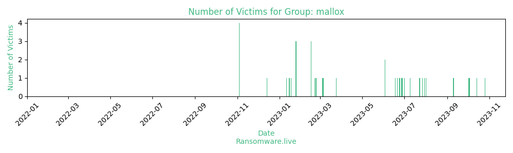

# Profiles for ransomware group : **mallox**

> This ransomware uses a combination of different crypto algorithms (ChaCha20, AES-128, Curve25519). The activity of this malware is dated to mid-June 2021. The extension of the encrypted files are set to the compromised company: .<target_company>

_`wtyafjyhwqrg[...].onion/post?get_listBlog`_

🔎 `ransomware.live`has an active  parser for indexing mallox's victims

### URLs
| Title | Available | Last visit | fqdn | Screenshot 
|---|---|---|---|---|
| Mallox - Blog | 🟢 | 03/08/2023 06:36 | `http://wtyafjyhwqrgo4a45wdvvwhen3cx4euie73qvlhkhvlrexljoyuklaad.onion` | <a href="https://images.ransomware.live/screenshots/wtyafjyhwqrgo4a45wdvvwhen3cx4euie73qvlhkhvlrexljoyuklaad-onion.png" target=_blank>📸</a> | 

### Ransom note
* [📝 1 ransom note](notes/mallox)

### Total Attacks Over Time

### Posts

> 34 victims found

| post | date | Description | Screenshot | 
|---|---|---|---|
| [`Kogetsu`](https://google.com/search?q=Kogetsu) | 01/08/2023 |  |   |
| [`Contec Systems`](https://google.com/search?q=Contec+Systems) | 30/07/2023 |  |   |
| [`West Cargo`](https://google.com/search?q=West+Cargo) | 27/07/2023 |  |   |
| [`Franklins european bathrooms`](https://google.com/search?q=Franklins+european+bathrooms) | 23/07/2023 |  |   |
| [`Garuda Indonesia`](https://google.com/search?q=Garuda+Indonesia) | 09/07/2023 |  |   |
| [`Ashley HomeStore`](https://google.com/search?q=Ashley+HomeStore) | 01/07/2023 | INFO: https://www.zoominfo.com/c/ashley-homestore-ltd/7786767  DATA: https://anonfiles.com/******/Ashley_7z PASSWORD: 597+9Tk?2gtW&&_6SW5#7<);D&81Q5)c​  | <a href="https://images.ransomware.live/screenshots/posts/39ef1b4b842c69cfea56d125c7d46d6c.png" target=_blank>📸</a> |
| [`JBCC Corp`](https://google.com/search?q=JBCC+Corp) | 28/06/2023 | INFO: https://www.zoominfo.com/c/jbcc/431568723 DATA: CISDOM.7z.004: https://anonfiles.com/******/CISDOM_7z_001​  Password: &q.&i_R327:3p1<dBtEK~L02HT(4C3JZ  | <a href="https://images.ransomware.live/screenshots/posts/be6e0759b75a105150a9a705f7b2a8b7.png" target=_blank>📸</a> |
| [`COMPASS INFRASTRUCTURE GROUP`](https://google.com/search?q=COMPASS+INFRASTRUCTURE+GROUP) | 27/06/2023 | DATA: COMPASS.7z.001  https://anonfiles.com/******/COMPASS_7z_003 PASSWORD: he?A!xl_<90!T9O>5a3KC5;h^*$7pjpZ​  | <a href="https://images.ransomware.live/screenshots/posts/0b2eb0fc319e2d7d9ea0c5bf7cee4d99.png" target=_blank>📸</a> |
| [`Tlantic`](https://google.com/search?q=Tlantic) | 24/06/2023 | INFO: https://www.zoominfo.com/c/tlantic/346591091  DATA: https://anonfiles.com/******/tlantic_7z PASSWORD: 77UXD&CNqq@c+2rX$46~Y895rQX7Th7j  | <a href="https://images.ransomware.live/screenshots/posts/4ba37cfac3bab631495231af8d541e67.png" target=_blank>📸</a> |
| [`MICA ENVIRONNEMENT`](https://google.com/search?q=MICA+ENVIRONNEMENT) | 21/06/2023 | ​ DATA PARTS: Mica.7z.001 https://anonfiles.com/******/Mica_7z_015 PASSWORD: 9n?M)YLZ737Fr5ttZ7u$YU01j<4&5ZrW  | <a href="https://images.ransomware.live/screenshots/posts/c42580181dbf7207d28d1898983b4af3.png" target=_blank>📸</a> |
| [`Bangkok Industrial Gas Co., Ltd. (BIG)`](https://google.com/search?q=Bangkok+Industrial+Gas+Co.%2C+Ltd.+%28BIG%29) | 18/06/2023 | DATA:https://anonfiles.com/******/GAS_rar PASSWORD: c2OG7Qx$SNSnz6o5AE2,s<WOgUNIz5&4  | <a href="https://images.ransomware.live/screenshots/posts/b473224824a696b9514e203301f83712.png" target=_blank>📸</a> |
| [`Share and Harris`](https://google.com/search?q=Share+and+Harris) | 03/06/2023 | INFO: https://www.zoominfo.com/c/share-harris-llc/410899856  DATA: https://anonfiles.com/******/ShareHarris_rar PASSWORD:  (Oa+VB;~5k5S1W,LW8!P#6d31v8IZ%Jk  | <a href="https://images.ransomware.live/screenshots/posts/4eec243d938b824f253e2f3783199dc3.png" target=_blank>📸</a> |
| [`Young Homes, Inc`](https://google.com/search?q=Young+Homes%2C+Inc) | 03/06/2023 | INFO: https://www.zoominfo.com/c/young-homes-inc/134103843  DATA: https://anonfiles.com/******/Yhomes_rar PASSWORD: Vzha#FhkRRm=-h&Xw07lmVXPUe5H,K;#  | <a href="https://images.ransomware.live/screenshots/posts/8479c28ef1ce9070df876f464ccc6fa1.png" target=_blank>📸</a> |
| [`CCAA`](https://google.com/search?q=CCAA) | 24/03/2023 | INFO: https://www.zoominfo.com/c/ccaa/372444807?__cf_chl_tk=9kqu5SXzH664NKjerVDLfEaOpLl2.oSyDBUZT_Sx2v8-1679667712-0-gaNycGzNDOU  https://anonfiles.com/******/CCAA_rar Pass: U&YV(C&t6c97tc(&TC97tcdf(V&TC9  | <a href="https://images.ransomware.live/screenshots/posts/5ca0f3ef24cc63c65ca44fb370ffa91f.png" target=_blank>📸</a> |
| [`Circa Jewels`](https://google.com/search?q=Circa+Jewels) | 06/03/2023 | Circa Jewels is the leading international buyer of pre-owned fine jewelry, diamonds and watches. If Circa Jewels fail to take responsibility for their security weakness, all of their and their clients' confidential will be published.  File Tree - https://anonfiles.com/******/tox.chat ) - AE3750EE1BE48D86104E6FB1DADC32469A31242EFC205A3EC47EF7689E3F103472A4DBFFF399  | <a href="https://images.ransomware.live/screenshots/posts/635c9024813aba55baec33760fab5009.png" target=_blank>📸</a> |
| [`AddWeb Solution Pvt`](https://google.com/search?q=AddWeb+Solution+Pvt) | 05/03/2023 | AddWeb Solution Pvt is a leading offshore development company provides a one-stop website, mobile, cloud, and digital marketing solution. If AddWeb Solution Pvt  fail to take responsibility for their security weakness,  all of their and their clients' confidential will be published.  File Tree - https://anonfiles.com/******/tox.chat ) - AE3750EE1BE48D86104E6FB1DADC32469A31242EFC205A3EC47EF7689E3F103472A4DBFFF399  | <a href="https://images.ransomware.live/screenshots/posts/4544609620491f6a3513a9e12189df6f.png" target=_blank>📸</a> |
| [`AICHELIN UNITHERM`](https://google.com/search?q=AICHELIN+UNITHERM) | 04/03/2023 | Two leading manufacturers of heat treatment furnaces Unitherm Engineers Limited (India) and Aichelin Holding GmbH (Austria) formed a new 50:50 Joint Venture Company (JVC) in India in 2010. The newly incorporated JVC Aichelin Unitherm Heat Treatment Systems India Private Limited is headquartered in Talegaon, Pune (Maharashtra).Whatever part you play in the field of industrial heat treatment, AICHELIN UNITHERM has a solution for you. As diverse as the product portfolio may be, certain things apply to every solution: reliability and economic efficiency. AICHELIN UNITHERM in joint venture with AICHELIN Group offers extensive experience and skill guaranteeing the security of a stable and strong group, as your partners and service providers.Industrial heat treatment of metallic parts and components is our skill and passion. AICHELIN UNITHERM is the leading manufacturer of Industrial Heat Treatment Plants technology and services in India.   DATA: https://anonfiles.com/******/AICHELIN_UNITHERM_rar PASSWORD:  n246nm245&TC675tcd^R  |   |
| [`"FICCI"`](https://google.com/search?q=%22FICCI%22) | 23/02/2023 | Established in 1927, FICCI is the largest and oldest apex business organisation in India. Its history is closely interwoven with India's struggle for independence, its industrialization, and its emergence as one of the most rapidly growing global economies.A non-government, not-for-profit organisation, FICCI is the voice of India's business and industry. From influencing policy to encouraging debate, engaging with policy makers and civil society, FICCI articulates the views and concerns of industry. It serves its members from the Indian private and public corporate sectors and multinational companies, drawing its strength from diverse regional chambers of commerce and industry across states, reaching out to over 2,50,000 companies.FICCI provides a platform for networking and consensus building within and across sectors and is the first port of call for Indian industry, policy makers and the international business community.  FILES: https://anonfiles.com/******/FICCI_rar PASSWORD: BUHgv97yt9f7fcv7c-p8  |   |
| [`FICCI`](https://google.com/search?q=FICCI) | 21/02/2023 | Established in 1927, FICCI is the largest and oldest apex business organisation in India. Its history is closely interwoven with India's struggle for independence, its industrialization, and its emergence as one of the most rapidly growing global economies.A non-government, not-for-profit organisation, FICCI is the voice of India's business and industry. From influencing policy to encouraging debate, engaging with policy makers and civil society, FICCI articulates the views and concerns of industry. It serves its members from the Indian private and public corporate sectors and multinational companies, drawing its strength from diverse regional chambers of commerce and industry across states, reaching out to over 2,50,000 companies.FICCI provides a platform for networking and consensus building within and across sectors and is the first port of call for Indian industry, policy makers and the international business community.  FILES: https://anonfiles.com/******/FICCI_rar PASSWORD: BUHgv97yt9f7fcv7c-p8  | <a href="https://images.ransomware.live/screenshots/posts/366fb8bd1f2fb739134ddffd2edc199c.png" target=_blank>📸</a> |
| [`Mecaro Co., Ltd`](https://google.com/search?q=Mecaro+Co.%2C+Ltd) | 16/02/2023 | Company Introduction : Mecaro Co., Ltd is No1 Best Semicon parts company authorized in parts area by producing optimal semiconductor part of equipments through ceaseless technology development and research for about 15 years.  ​MORE INFO: https://www.wsj.com/market-data/quotes/KR/241770/financials  LEAKED DATA: https://anonfiles.com/******/PLM_zip                    PASSWORD FOR ARCHIVE: kPl%l!ttuJ8;1Dxali3u1TzO%gk=7tJh  |   |
| [`Hydrofit Alliance Ltd`](https://google.com/search?q=Hydrofit+Alliance+Ltd) | 16/02/2023 | Hydrofit FZE an ISO 9001, ISO 14001 & 45001 company, pioneering in the field of Fluid Power Transmissions, Mechanical Power Transmissions, Automatic Greasing / Lubrication systems and Oil Recirculation systems  MORE INFO: https://www.zoominfo.com/c/hydrofit-alliance-ltd/346285910?__cf_chl_tk=5mBW2PYNvvqwAbHrTvIe_QmsK7qT8ybeY2RH3Kvmf8w-1676508140-0-gaNycGzND7s  LEAKED DATA: https://anonfiles.com/******/  |   |
| [`Gallier Orléans`](https://google.com/search?q=Gallier+Orl%C3%A9ans) | 16/02/2023 | DATA: https://anonfiles.com/******/GALLIER_zipPASSWORD: ?ie(yD@83,%0HR^t6_#S|VW*L6^cA-B\  |   |
| [`Navnit Group`](https://google.com/search?q=Navnit+Group) | 25/01/2023 |  |   |
| [`BOMCALCADO`](https://google.com/search?q=BOMCALCADO) | 25/01/2023 | DATA PART 1: https://anonfiles.com/******/bomcalcado2_zip PASSWORD: Q|&(A&\?Le($PxD=c,_cj*hLl@+|!,K#  |   |
| [`First International Food co Ltd`](https://google.com/search?q=First+International+Food+co+Ltd) | 25/01/2023 | DATA: https://anonfiles.com/******/fifood_zipPASSWORD: !BJYY-U_;pvuz.dlzbd~*>W;YX;x$?fM  |   |
| [`Alhambra-Eidos`](https://google.com/search?q=Alhambra-Eidos) | 18/01/2023 | https://www.zoominfo.com/c/alhambra--eidos/345908828?__cf_chl_tk=RpuNsHtJ3U8_aY_cJ.nM3xGgTjQUbdlu39sPdA54pLg-1674049852-0-gaNycGzNC-U Leaked data: https://anonfiles.com/******/Alhambra_rar Password: *&YG)*7vc08V()*&YguygoiugO  |   |
| [`Yayla Enerji Uretim Turizm ve Insaat Ticaret`](https://google.com/search?q=Yayla+Enerji+Uretim+Turizm+ve+Insaat+Ticaret) | 16/01/2023 |  |   |
| [`El Seif Development`](https://google.com/search?q=El+Seif+Development) | 15/01/2023 | Data will be published in 24 hours Stay tuned  |   |
| [`ADIVA CO. LTD`](https://google.com/search?q=ADIVA+CO.+LTD) | 11/01/2023 |  |   |
| [`Ban Leong Technologies Ltd`](https://google.com/search?q=Ban+Leong+Technologies+Ltd) | 14/12/2022 |   |   |
| [`Canny Elevator Co Ltd`](https://google.com/search?q=Canny+Elevator+Co+Ltd) | 04/11/2022 |   |   |
| [`API MDC Technical Research Centre Sdn Bhd`](https://google.com/search?q=API+MDC+Technical+Research+Centre+Sdn+Bhd) | 04/11/2022 |   |   |
| [`Aerotech Precision Manufacturing`](https://google.com/search?q=Aerotech+Precision+Manufacturing) | 04/11/2022 |   |   |
| [`CLUB DE TENIS LA PAZ`](https://google.com/search?q=CLUB+DE+TENIS+LA+PAZ) | 04/11/2022 |   |   |

Last update : _Thursday 03/08/2023 07.07 (UTC)_
