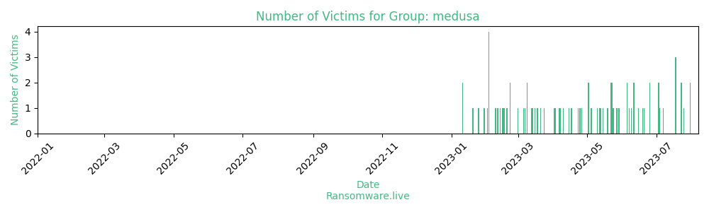

# Profiles for ransomware group : **medusa**

### External analysis
- https://news.drweb.com/show/?i=10302&lng=en

- https://web.archive.org/web/20200509171721/https://raw.githubusercontent.com/fdiskyou/threat-INTel/master/2015/GlobalThreatIntelReport.pdf

- https://www.arbornetworks.com/blog/asert/medusahttp-ddos-slithers-back-spotlight/

- https://zerophagemalware.com/2017/10/13/rig-ek-via-malvertising-drops-a-miner/

🔎 `ransomware.live`has an active  parser for indexing medusa's victims

### URLs
| Title | Available | Last visit | fqdn | Screenshot 
|---|---|---|---|---|
| Medusa Blog | 🟢 | 24/09/2023 14:10 | `http://medusaxko7jxtrojdkxo66j7ck4q5tgktf7uqsqyfry4ebnxlcbkccyd.onion` | <a href="https://images.ransomware.live/screenshots/medusaxko7jxtrojdkxo66j7ck4q5tgktf7uqsqyfry4ebnxlcbkccyd-onion.png" target=_blank>📸</a> | 

### Ransom note
* [📝 1 ransom note](notes/medusa)

### Total Attacks Over Time

### Victims

> 101 victims found

| victim | date | Description | Screenshot | 
|---|---|---|---|
| [`Philippine Health Insurance `](https://google.com/search?q=Philippine+Health+Insurance+) | 23/09/2023 | The Philippine Health Insurance Corporation (PhilHealth) was established in 1995 to provide universal health insurance in the Philippines. It is a tax-exempt, state-owned and controlled corporation (GOGC) of the Philippines, subordinate to the Ministry of Health. Company came to the tor chat but didn't answer for the payment yet. | <a href="https://images.ransomware.live/screenshots/posts/05437676810aa24b68ce8d1054c78903.png" target=_blank>📸</a> |
| [`Franktronics, Inc`](https://google.com/search?q=Franktronics%2C+Inc) | 23/09/2023 | Franktronics, Inc. is an information technology and services company based out of 3618 George Washington Memorial Hwy, Hayes, Virginia, 23072, United States. | <a href="https://images.ransomware.live/screenshots/posts/d9d5e3c9534c01b24c52ce8b93c23ecf.png" target=_blank>📸</a> |
| [`Gulf American Lines`](https://google.com/search?q=Gulf+American+Lines) | 20/09/2023 | Headquartered in Berkeley Heights, New Jersey, Gulf American Line is a leader in freight forwarding, warehousing and logistics provider. The company occupies a leading position in terms of the volume of transported goods in the United States | <a href="https://images.ransomware.live/screenshots/posts/3de21f97ffa05838e201f42a0dc622ca.png" target=_blank>📸</a> |
| [`Chait`](https://google.com/search?q=Chait) | 20/09/2023 | Chait & Company is a Los Angeles—based firm offering a wide range of architectural design, general contracting and construction management services, recognized in 1994. The company's main office is located at 14931 a Celica St Ste A, Van Nuys, California, 91411, United States | <a href="https://images.ransomware.live/screenshots/posts/4ea548e59713b2eb22bb4e8b782347d6.png" target=_blank>📸</a> |
| [`Auckland Transport`](https://google.com/search?q=Auckland+Transport) | 18/09/2023 | Founded in 2010, Auckland Transport is a company that is responsible for the region's transport infrastructure and public transport including roads and footpaths, cycling, parking, and public transportation. Auckland Transport is located in New Zealand | <a href="https://images.ransomware.live/screenshots/posts/9db38d9c911f901b21116cdcfaa9d144.png" target=_blank>📸</a> |
| [`Steripharma `](https://google.com/search?q=Steripharma+) | 11/09/2023 | Steripharma is a Moroccan pharmaceutical laboratory founded in 1999. Cooperates with both public and private clients in Morocco and Africa. The company's head office is located at 429 So. West St, Syracuse, New York 13202, US | <a href="https://images.ransomware.live/screenshots/posts/40bf4510b22c9ff5c995aa6daa712af0.png" target=_blank>📸</a> |
| [`Wave Hill`](https://google.com/search?q=Wave+Hill) | 11/09/2023 | Wave Hill is a community garden and cultural center located in New York City. The company's head office is located at 675 W 252nd St, Bronx, New York, 10471, United States | <a href="https://images.ransomware.live/screenshots/posts/f4839f51c975321c2cf49e364d092c5c.png" target=_blank>📸</a> |
| [`Jules B`](https://google.com/search?q=Jules+B) | 04/09/2023 | Jules B is a chain of designer clothing stores for men and women in England founded for over 30 years. The company's head office is located at Yellow Brick House, Newcastle upon Tyne, Tyne and Wear NE1 2TY, GB | <a href="https://images.ransomware.live/screenshots/posts/92460fd6018ca80d1655854cd9de34e4.png" target=_blank>📸</a> |
| [`Betton France`](https://google.com/search?q=Betton+France) | 04/09/2023 | Administration of the city of Betton (France). The concrete is located in the center of the Rhine agglomeration, 7 km north of Rennes, near the Rennes-Saint-Malo axis and on the Mont Saint-Michel tourist route. Currently, the population of the city is about 11,000 people. | <a href="https://images.ransomware.live/screenshots/posts/f2cb427c772d7ec476a867a9865b79fd.png" target=_blank>📸</a> |
| [`Skynet`](https://google.com/search?q=Skynet) | 30/08/2023 | Skynet (https://www.skynetwisp.com/) provides Internet access services, both for the private segment of the market and for public institutions. The company's main office is located at 6630 Fm 1463 Rd 255 Step 500, Katy, Texas, 77494, United States | <a href="https://images.ransomware.live/screenshots/posts/2b06b130368c77df6960304c78f9f8d7.png" target=_blank>📸</a> |
| [`Aranui Cruises`](https://google.com/search?q=Aranui+Cruises) | 30/08/2023 | Aranui Cruises is the oldest cruise operator in French Polynesia, having been founded 35 years ago. The company has a ship made to order ship "Aranui 5" designed for VIP level cruise holidays. The American office of the company is located at 2028 El Camino Real So Te B, San Mateo, California, 94403, United States | <a href="https://images.ransomware.live/screenshots/posts/ec61ded6fadc3cf25533e90e9f1d3d58.png" target=_blank>📸</a> |
| [`Axis Elevators `](https://google.com/search?q=Axis+Elevators+) | 25/08/2023 | Axis Elevators - is one of the largest elevator companies in the UK and Ireland, engaged in the installation, maintenance and modernization of elevators and escalators, as well as other types of lifts. The company was founded more than 100 years ago. The main office of the company is located at 1, 65 Glass Hill Street, London, Greater London, SE10, United Kingdom | <a href="https://images.ransomware.live/screenshots/posts/f155e0191c9124674a54725569dd8f9b.png" target=_blank>📸</a> |
| [`Durham Fasteners`](https://google.com/search?q=Durham+Fasteners) | 25/08/2023 | Durham Fasteners is a family-owned company whose roots in the business were laid in 1981. The company specializes in solutions for fasteners, packaging, as well as worldwide deliveries. The company's office is located at 757 Mckay Rd, Block 9, Pickering, Ontario, 1 3C8, Canada | <a href="https://images.ransomware.live/screenshots/posts/d1e7c915aa3049c8246659ef654bdef0.png" target=_blank>📸</a> |
| [`LEN Italia`](https://google.com/search?q=LEN+Italia) | 25/08/2023 | LEN Italia– Learning Education Network is a cooperative company that engages in professional training by planning and providing training and consulting activities. Founded in 2005, LEN has a team of more than 70 professionals available to educational institutions, companies, public administrations, non-profit organizations and individuals for any type of training and consultation. | <a href="https://images.ransomware.live/screenshots/posts/861c8528a28ce2de18e1818e670668e1.png" target=_blank>📸</a> |
| [`Sartrouville  France`](https://google.com/search?q=Sartrouville++France) | 19/08/2023 | Sartrouville is a commune in the Yvelines department, Île-de-France, north central France. it is located in the north-western suburbs of Paris, 17.1 km from the center of Paris.  It employs 501-1,000 people and has $100M-$250M of revenue. Is headquartered in Sartrouville, Ile-de-France, 78500, France. | <a href="https://images.ransomware.live/screenshots/posts/00975a6474fd4401da9ce0c2e815e541.png" target=_blank>📸</a> |
| [`The International Civil Defense Organization`](https://google.com/search?q=The+International+Civil+Defense+Organization) | 19/08/2023 | The International Civil Defense Organization (ICDO) is an intergovernmental organization whose goal is to promote the development by States of structures that protect and assist the population, as well as the protection of property and the environment from natural disasters or man-made disasters. It was founded in 1931.It consists of 60 Member States, 16 observer States and 23 associate members. | <a href="https://images.ransomware.live/screenshots/posts/d02022e2d0caafed9dc748d8ef7a2d8f.png" target=_blank>📸</a> |
| [`Novi Pazar put ad`](https://google.com/search?q=Novi+Pazar+put+ad) | 19/08/2023 | Novi Pazar put ad is a company that operates in the Civil Engineering industry. It employs 251-500 people and has $10M-$25M of revenue. The company is headquartered in Novi Pazar, 36300, Serbia | <a href="https://images.ransomware.live/screenshots/posts/124438a285601f09fa94d204b6c350f4.png" target=_blank>📸</a> |
| [`Postel SpA`](https://google.com/search?q=Postel+SpA) | 15/08/2023 | Postel SpA offers computer software for sale. The Company provides software products and management services including document management, direct marketing, and e-procurement software and related services. Postel operates throughout Italy, the company's head office is located at 5 Via Ricerca Scientifica, Padova, Veneto, 35127, Italy | <a href="https://images.ransomware.live/screenshots/posts/fe37ff2075b7f7945cc31e86b33d9ad1.png" target=_blank>📸</a> |
| [`Borets (Levare.com) `](https://google.com/search?q=Borets+%28Levare.com%29+) | 14/08/2023 | Borets (Levare.com) is Headquartered in Houston, Texas, with an international headquarters in Dubai, Borets is a global provider specializing in the engineering, manufacture, sales and service of Electric Submersible Pump systems.  Uploaded Data Size: 1TB | <a href="https://images.ransomware.live/screenshots/posts/294dd5c04a571efa0c5b3072ab0789c6.png" target=_blank>📸</a> |
| [`CB Energy Australlia`](https://google.com/search?q=CB+Energy+Australlia) | 14/08/2023 | CB Group Australia provide a broad range of services across the construction industry in project management, civil, electrical and maintenance disciplines. The company was founded in 1946.  The company's central office is located at 15 Production Ave, Molendinar, Queensland, 4214, Australia | <a href="https://images.ransomware.live/screenshots/posts/9f75f0d166d98c02cfdf715090405d1c.png" target=_blank>📸</a> |
| [`Emerson School District`](https://google.com/search?q=Emerson+School+District) | 08/08/2023 | The Emerson School District is a comprehensive community public school district that serves students in pre-kindergarten through twelfth grade from Emerson, in Bergen County, New Jersey, United States. There are currently about 1,200 students enrolled in the school district. | <a href="https://images.ransomware.live/screenshots/posts/a02a236165d5739bff270de972270ffe.png" target=_blank>📸</a> |
| [`St Landry Parish School Board `](https://google.com/search?q=St+Landry+Parish+School+Board+) | 31/07/2023 | St Landry Parish School Board is a school district based in Opelusas, Louisiana. The area includes primary, secondary and secondary schools. At the moment, more than 14,000 students are studying in them. | <a href="https://images.ransomware.live/screenshots/posts/404eff744e5ff899bce05b22cc97f7be.png" target=_blank>📸</a> |
| [`Ace Micromatic Group`](https://google.com/search?q=Ace+Micromatic+Group) | 31/07/2023 | Ace Micromatic Group is India's largest machine tool conglomerate with a market presence in several countries across Asia, Australia, Middle East, North & South America and Europe. | <a href="https://images.ransomware.live/screenshots/posts/5be95069bfe8780edb42e951027dba01.png" target=_blank>📸</a> |
| [`The Sinbad Club`](https://google.com/search?q=The+Sinbad+Club) | 25/07/2023 | The Sinbad Club company, founded in 1992, offers a wide range of services for recreation on the Red Sea coast in Egypt. The main office of the company is located at 10 Elmenya Street, Cairo, Cairo, HELIOPOLIS, Egypt. | <a href="https://images.ransomware.live/screenshots/posts/cbf4bad4a283e17a8cbafebab2d4b1f7.png" target=_blank>📸</a> |
| [`Cafe Britt`](https://google.com/search?q=Cafe+Britt) | 23/07/2023 | Cafe Britt is a company engaged in processing beans and making coffee in Costa Rica with subsequent export to global markets. The company's product line also includes other products, such as coffee, chocolate and cookies, etc. The head office is located at 2960 NW 72nd Ave, Miami, Florida, 33122, United States | <a href="https://images.ransomware.live/screenshots/posts/9f2042d405a4f21fde53d860e4c47ae6.png" target=_blank>📸</a> |
| [`Sun Pain Management`](https://google.com/search?q=Sun+Pain+Management) | 23/07/2023 | Sun Pain Management and Spine Specialists treats clinic, whose head office is located at 5501 N 19th Ave Ste 103, Phoenix, Arizona, 85015, United States offers a wide range of procedures for patients suffering from chronic pain. In total, there are five centers of this clinic in the United States. | <a href="https://images.ransomware.live/screenshots/posts/3ab2f381d336032680d8c3e908f3a9ee.png" target=_blank>📸</a> |
| [`DTD Express `](https://google.com/search?q=DTD+Express+) | 18/07/2023 | DTD Express provides international parcel delivery services. The company specializes in meeting the import and export needs of Asia (India, Pakistan), the Far East (China, Hong Kong), the USA and Europe. The company's head office is located at 30b Melton Rd, Leicester, Leicester, L4 5 EA, United Kingdom | <a href="https://images.ransomware.live/screenshots/posts/4f852137e8dcc2f99dedb8d322ca29bb.png" target=_blank>📸</a> |
| [`Nini Collection Ltd  (Nini's Jewels)`](https://google.com/search?q=Nini+Collection+Ltd++%28Nini%27s+Jewels%29) | 18/07/2023 | Nini Collection Ltd is a company that operates in the Luxury Goods & Jewelry industry. It employs 6-10 people and has $1M-$5M of revenue. The company is headquartered in Westheimer Rd Ste 330, Houston, Texas, 77056, United States | <a href="https://images.ransomware.live/screenshots/posts/ec3244dcf1baf4b96f3aeaaf62b2be93.png" target=_blank>📸</a> |
| [`Health Springs Medical Center `](https://google.com/search?q=Health+Springs+Medical+Center+) | 18/07/2023 | Health Springs Medical Center is a clinic located at 209 S COLLEGE ST HEATH SPRINGS. Currently, 8 doctors of the Health Springs Medical Center work in 6 specialized fields of medicine, as well as students are trained | <a href="https://images.ransomware.live/screenshots/posts/3cd3334bc5eb10c8aeffb62392c8317b.png" target=_blank>📸</a> |
| [`Tracker de Colombia SAS`](https://google.com/search?q=Tracker+de+Colombia+SAS) | 07/07/2023 | The organization, which was founded in 1994 and working in 9 countries of Latin America, which develops, designs, develops, produces and sells products, specialized software, services and comprehensive solutions in the field of security, monitoring, determination of location, identification, remote management and relational marketing. | <a href="https://images.ransomware.live/screenshots/posts/ef69b14981c2067dd0d4e9e1248ddfe5.png" target=_blank>📸</a> |
| [`Yunus Emre Institute Turkey`](https://google.com/search?q=Yunus+Emre+Institute+Turkey) | 04/07/2023 | The Yunus Emre Institute (Yunus Emre Enstitüsü) is a worldwide non-profit organization established by the Turkish government in 2007. It is aimed at popularizing the Turkish language and culture around the world. It has 62 centers in 52 countries of the world. | <a href="https://images.ransomware.live/screenshots/posts/ab6835c4cf80cf5c5a7fb681293e1e12.png" target=_blank>📸</a> |
| [`Luna Hotels & Resorts `](https://google.com/search?q=Luna+Hotels+%26+Resorts+) | 03/07/2023 | Luna Hotels & Resorts is one of Portugal's most famous hotel brands. The company invests, creates, controls and offers a number of services for the whole family, sports sector and corporate segment. The main office is located at Lote H1 Avenida Da Marina, Vilamoura, Faro, 8125-401, Portugal | <a href="https://images.ransomware.live/screenshots/posts/3a0b9faf4a86a06827eae88db7e8d5b9.png" target=_blank>📸</a> |
| [`Mutuelle LMP`](https://google.com/search?q=Mutuelle+LMP) | 03/07/2023 | Mutuelle LMP is a French company operating in the field of insurance. The company employs 51-100 people, and the revenue is from 10 to 25 million dollars. The company was founded more than 167 years ago, and provides insurance protection of more than 45,000 people. | <a href="https://images.ransomware.live/screenshots/posts/1d38ff110f50e64b60ddc24f518ae034.png" target=_blank>📸</a> |
| [`Universitas Matthiae Belii association`](https://google.com/search?q=Universitas+Matthiae+Belii+association) | 25/06/2023 | Matej Bel University (commonly referred as Matej Bel or UMB), (Slovak: Univerzita Mateja Bela) is a public research university in the central Slovak town of Banská Bystrica. The university was established in 1992. At the moment, more than 6,000 students are studying at the university. | <a href="https://images.ransomware.live/screenshots/posts/5065ed77149d47576453424b1c564c62.png" target=_blank>📸</a> |
| [`Real Estate Systems Integrator`](https://google.com/search?q=Real+Estate+Systems+Integrator) | 25/06/2023 | RESI was established in 1994 with the purpose of providing REALTORS® with the technology necessary to enhance productivity and broaden their reach. The main office of the company is located at: 560 Lincoln Rd Ste 203, Miami Beach, Florida, 33139, United States | <a href="https://images.ransomware.live/screenshots/posts/8a7e194d41c321bcda116ab9403c84fa.png" target=_blank>📸</a> |
| [`Praxis Energy Agents`](https://google.com/search?q=Praxis+Energy+Agents) | 20/06/2023 | Praxis Energy Agents is an international bunkering trading company founded in Greece in 1993 and currently operating through four offices in Singapore, Dubai, Hamburg and New York.  The company's head office is located at 2603 Augusta Dr Ste 1260, Houston, Texas, 77057, United States | <a href="https://images.ransomware.live/screenshots/posts/1a8a3ab9cc5fd28e65bac3e0e71373a1.png" target=_blank>📸</a> |
| [`FHR Electric`](https://google.com/search?q=FHR+Electric) | 19/06/2023 | FHR Electric offers cost-effective electrical repair services in Scottsdale, Arizona. The main office of the company is located at 7720 E Gelding Dr. Scottsdale AZ 85260 | <a href="https://images.ransomware.live/screenshots/posts/ac9b5322bab96cc199be89506fcaee70.png" target=_blank>📸</a> |
| [`Salem Community Schools`](https://google.com/search?q=Salem+Community+Schools) | 15/06/2023 | Salem Community Schools is a public school district located in SALEM, IN. It has 1,762 students in grades PK, K-12 with a student-teacher ratio of 15 to 1. | <a href="https://images.ransomware.live/screenshots/posts/40dbe15b6df14919a259283b275a7cb5.png" target=_blank>📸</a> |
| [`Comisión Nacional de Valores`](https://google.com/search?q=Comisi%C3%B3n+Nacional+de+Valores) | 11/06/2023 | Regulatory agency in charge of authorizing IPOs and securing compliance by market participants with federal securities laws in the Argentine Republic. It supervises brokerage firms, issuers, stock exchanges, mutual funds and credit rating agencies. It is a member of IOSCO. More than 1.5TB of documents & database dumps has been uploaded. | <a href="https://images.ransomware.live/screenshots/posts/91f5703329955a60f37f685d6143fcdb.png" target=_blank>📸</a> |
| [`GAE Construction`](https://google.com/search?q=GAE+Construction) | 11/06/2023 | Website: https://gae-construction.co.uk/ GAE Construction, offers construction services at all levels to both large and small clients in London and the North-East of England. | <a href="https://images.ransomware.live/screenshots/posts/da6011311d7d416659cce532290a1ee4.png" target=_blank>📸</a> |
| [`Kramer Enterprises`](https://google.com/search?q=Kramer+Enterprises) | 09/06/2023 | Kramer Enterprises was founded in 1999, provides services in Southern Wisconsin for the construction of flat surfaces and specializes in stamped and colored decorative concrete. The company's clients include Fort Atkinson, Jefferson, Whitewater, Watertown, Janesville, Cambridge and surrounding areas. | <a href="https://images.ransomware.live/screenshots/posts/9f2159491d08c3aed8bc2ad3c5961357.png" target=_blank>📸</a> |
| [`Tour Partner Group `](https://google.com/search?q=Tour+Partner+Group+) | 07/06/2023 | Tour Partner Group is a holding company dealing with hotels and many others, Irish welcome tours and authentic holidays. The company was founded in 1992, the central office is located at 66-68 College Rd Fl 5, London, Essex, CO1 1BE, United Kingdom | <a href="https://images.ransomware.live/screenshots/posts/16c534cbb09821ae7f1b56ab2ce2a8a0.png" target=_blank>📸</a> |
| [`Concremat constructions`](https://google.com/search?q=Concremat+constructions) | 05/06/2023 | Founded in 1972 and headquartered in Rio de Janeiro, Concremat Companies provides construction and engineering services. The company offers services such as urban and regional development studies, environmental management systems, and a sustainable development plan for territories | <a href="https://images.ransomware.live/screenshots/posts/cbd9dc32a67e82220b19c8bfd8a7be4c.png" target=_blank>📸</a> |
| [`Farmacias Los Hidalgos `](https://google.com/search?q=Farmacias+Los+Hidalgos+) | 05/06/2023 | Farmacias Los Hidalgos is a health, wellness and fitness company founded in 1975, based in the Dominican Republic at Avenue 27 de Febrero No. 241 in Ensanche Popcorn. | <a href="https://images.ransomware.live/screenshots/posts/6f32e52fe61d357630d61a6e15c54ff9.png" target=_blank>📸</a> |
| [`BilgeAdam Software`](https://google.com/search?q=BilgeAdam+Software) | 29/05/2023 | BilgeAdam  operates as one of the subsidiaries of BilgeAdam IT Group, founded in 1997. The headquarters of the company, which includes the sts Research Center, subordinate to the Ministry of Industry and Technology, is located at 4 b3 Sarıyer, Istanbul, 34396, Turkey. The main areas of activity are IOT management, automation, communications, network and security. Leak includes their internal source codes and recent live screenshots of their works. | <a href="https://images.ransomware.live/screenshots/posts/e536ec462b849abc68c1b1dafb0720af.png" target=_blank>📸</a> |
| [`Fiduagraria`](https://google.com/search?q=Fiduagraria) | 27/05/2023 | Fiduagraria is a joint-stock company of a mixed economy, subject to the State regime of an industrial and commercial enterprise, in accordance with the national order, associated with the Ministry of Agriculture and Rural Development, under the control and supervision of the Financial Administration of Colombia and legally registered on the basis of Public Act No. 1199 of February 18, 1992 with the main address in the city of Bogota. | <a href="https://images.ransomware.live/screenshots/posts/df394cc7add0415ff9dadc8e46d238cd.png" target=_blank>📸</a> |
| [`Trabzonspor Football Club`](https://google.com/search?q=Trabzonspor+Football+Club) | 24/05/2023 | Trabzonspor Kulübü ( German Sportklub Trabzon ) is a sports club from the Turkish port city of Trabzon. The club, founded on August 2, 1967, is best known for its football department, which was Turkish champion six times between 1976 and 1984. Trabzonspor is one of Turkey's big four and is regularly ranked as a championship contender. | <a href="https://images.ransomware.live/screenshots/posts/1cfcf3e827abea1483dcdc923cd8bf01.png" target=_blank>📸</a> |
| [`Leland Campbell LLP law firm`](https://google.com/search?q=Leland+Campbell+LLP+law+firm) | 23/05/2023 | Leland Campbell LLP is the largest law firm in Yorkton and the district, employing 8 lawyers and staff. The firm's services include real estate, wills and estate, criminal law, family law, civil litigation and commercial/commercial law, to name just a few. | <a href="https://images.ransomware.live/screenshots/posts/73158e62fd22dbd80a14ce4e61d3f321.png" target=_blank>📸</a> |
| [`Amaszonas S.A.`](https://google.com/search?q=Amaszonas+S.A.) | 23/05/2023 | Lnea Aérea Amaszonas S.A. ("Amaszonas") is a Bolivian regional airline based at the Viru Viru International Airport in Santa Cruz. The operator was founded in 1999 and provides scheduled regional services. Amaszonas is owned by the group of Latin American airlines | <a href="https://images.ransomware.live/screenshots/posts/eee7c9588660cffae34efc21966553fd.png" target=_blank>📸</a> |
| [`SIGMA`](https://google.com/search?q=SIGMA) | 22/05/2023 | SIGMA is a company located at 4915 Ambroise Lafortune Ste 100, Boisbriand, Quebec, J7H 0A4, Canada, providing IT services specializing in the development and implementation of an integrated management system (IMS) for manufacturing (MRP/ERP) and distribution companies. | <a href="https://images.ransomware.live/screenshots/posts/432e28fa7c683267e5dddf53cd1cdabd.png" target=_blank>📸</a> |
| [`Loreto Normanhurst`](https://google.com/search?q=Loreto+Normanhurst) | 22/05/2023 | Loreto Normanhurst is an independent Catholic, primary and secondary day and boarding school for girls, located in Normanhurst, a suburb on the upper North Shore of Sydney, New South Wales, Australia. Established in 1897, Loreto has a current enrolment of approximately 1,175 students from Year 5 to Year 12, including approx. 185 boarders, and is the largest girls' boarding school in New South Wales. | <a href="https://images.ransomware.live/screenshots/posts/5f1905bd7cdd74f637684c0855915e0f.png" target=_blank>📸</a> |
| [`Al Tamimi Law Firm`](https://google.com/search?q=Al+Tamimi+Law+Firm) | 19/05/2023 | Founded by Essam Al Tamimi in 1989, Al Tamimi & Company has become the largest law firm in the Middle East with offices in Bahrain, Egypt, Iraq, Jordan, Kuwait, Oman, Qatar, Saudi Arabia and the United Arab Emirates. The firm employs more than 360 lawyers and has over 720 staff in total. | <a href="https://images.ransomware.live/screenshots/posts/f90b474ec42f362a9a31b11227dad6bf.png" target=_blank>📸</a> |
| [`BAMSI`](https://google.com/search?q=BAMSI) | 15/05/2023 | BAMSI is a private, non-profit social services organization that provides behavioral health and public health services to adults and children with developmental disabilities and mental illnesses. BAMSI was founded in 1975 and is headquartered in Brockton, Massachusetts, with 50,000 patients served annually. | <a href="https://images.ransomware.live/screenshots/posts/89ade25a5973ece9992b4ff5118cb6df.png" target=_blank>📸</a> |
| [`HostAfrica`](https://google.com/search?q=HostAfrica) | 13/05/2023 | HostAfrica was founded in 2015 in Cape Town with the mission to provide high-performance servers and hosting services in South Africa at a reasonable price. HostAfrica is based in Cape Town, South Africa. | <a href="https://images.ransomware.live/screenshots/posts/90bc82fe99a1a7a545f80809db11aba0.png" target=_blank>📸</a> |
| [`Wallick Communities`](https://google.com/search?q=Wallick+Communities) | 12/05/2023 | Wallick Communities provides property management, development, construction, and asset management for affordable housing and senior living communities. The company was founded in 1966 and is headquartered in New Albany, Ohio | <a href="https://images.ransomware.live/screenshots/posts/ba09eccf16382eb1792f0c9fddbb2456.png" target=_blank>📸</a> |
| [`Cooperativa de Ahorro y Crédito Ahorrocoop Ltda`](https://google.com/search?q=Cooperativa+de+Ahorro+y+Cr%C3%A9dito+Ahorrocoop+Ltda) | 10/05/2023 | Cooperativa de Ahorro y Crédito Ahorrocoop Ltda is a financial services company. The company employs 51-100 people, and revenue ranges from $ 10 to $25 million. The company's headquarters are located at 1421 5 Oriente, Talca, Maule, Chile | <a href="https://images.ransomware.live/screenshots/posts/a6225fb88334ba04bcfe717ddfd22413.png" target=_blank>📸</a> |
| [`Sonda (Duplicate with update)`](https://google.com/search?q=Sonda+%28Duplicate+with+update%29) | 05/05/2023 | Sonda, This is a Chilean multinational IT company headquartered in Santiago we hacked last month. But it's network is still vulnerable and we hacked into company again in 2023-05-04. There is proof image below. More than 4TB of data is published on telegram channel today. Everyone can access & download it's data. We recommend companies not to use Sonda IT support. | <a href="https://images.ransomware.live/screenshots/posts/ff589051ab81d549bab8db120d96d285.png" target=_blank>📸</a> |
| [`The Crown Princess Mary Cancer Centre`](https://google.com/search?q=The+Crown+Princess+Mary+Cancer+Centre) | 04/05/2023 | Westmead's service has been operating since 1994 at 75 Railway St, Mount Druitt, New South Wales, 2770, Australia and sees more than 500 families a year. The service is part of the Sydney West Cancer Network and has outreach services to Nepean Blue Mountains and Wagga/Bathurst/Orange (by Telehealth). | <a href="https://images.ransomware.live/screenshots/posts/033577f323b4bcb5485e66d79295e33a.png" target=_blank>📸</a> |
| [`Polat Yol Yap`](https://google.com/search?q=Polat+Yol+Yap) | 02/05/2023 | Polat Yol Yap is a company that operates in the construction industry, founded in 1975. The company employs from 2,001 to 5,000 people, and revenue ranges from $ 500 million to $1 billion. The company's headquarters is located in Cafe, Istanbul, Turkey. | <a href="https://images.ransomware.live/screenshots/posts/8c308ba70b96f6e16bc4633c20ddc545.png" target=_blank>📸</a> |
| [`Alto Calore Servizi S.p.A.`](https://google.com/search?q=Alto+Calore+Servizi+S.p.A.) | 02/05/2023 | Alto Calore Servizi S.p.A., abbreviated ACS, was established on March 13, 2003. Alto Valore Servizi is a joint stock company consisting of 126 shareholders: 125 municipalities in the province of Avellino and Benevento and the administration of the province of Avellino. Alto Calore Servizi works in the field of collection and distribution of drinking water, sewerage and wastewater treatment. | <a href="https://images.ransomware.live/screenshots/posts/139db4392184c4598dc6f1937ecef247.png" target=_blank>📸</a> |
| [`Bevan Group`](https://google.com/search?q=Bevan+Group) | 26/04/2023 | Founded in 1976, the Bevan Group company is a leading British supplier of commercial vehicle bodies, producing more than 60 commercial vehicle bodies every week. Bevan Group consists of five main companies: Busan Car Bodies, A&R Vehicle Services, After care Response, Graphics Depot and Supertruses. | <a href="https://images.ransomware.live/screenshots/posts/73b37a8db1f86a698448f74511904046.png" target=_blank>📸</a> |
| [`Magnolia Care Center`](https://google.com/search?q=Magnolia+Care+Center) | 25/04/2023 | Magnolia Care Center ~ A Veteran's Home~ is a Residential Veterans Personal Care Facility and Adult Day Care Center. Located at 16950 Florida Blvd, Baton Rouge, Louisiana, 70819, United States | <a href="https://images.ransomware.live/screenshots/posts/15e8871cf1f0043040f8aaa2d06dedb9.png" target=_blank>📸</a> |
| [`Bentham & Holroyd Ltd`](https://google.com/search?q=Bentham+%26+Holroyd+Ltd) | 24/04/2023 | Bentham & Holroyd Ltd is an engineering firm founded in 1830, subcontracted, based in Bradford, West Yorkshire, specializing in the production of precision components for the oil and gas industry, as well as offering a variety of services in CNC turning and manual turning, CNC milling, waterjet cutting and welding. | <a href="https://images.ransomware.live/screenshots/posts/8a4434d4f6f7dcdaedb3e2ed0d6d975b.png" target=_blank>📸</a> |
| [`WestcoastSmile Dental Studio`](https://google.com/search?q=WestcoastSmile+Dental+Studio) | 23/04/2023 | WestcoastSmile Kitsilano Dental Studio was established more than 20 years ago at 1-1874 W 1st Ave, Vancouver, British Columbia, V6J 1G5, Canada. The head is Dr. Jeffrey Jordan, who has been specializing in the dental field of medical activity for more than 30 years | <a href="https://images.ransomware.live/screenshots/posts/cd6619584089a74c58fff0dca313e503.png" target=_blank>📸</a> |
| [`Uniondale School District`](https://google.com/search?q=Uniondale+School+District) | 17/04/2023 | Uniondale School District is a district located in Uniondale, NY. They are comprised of 9 different schools around the area: California Avenue School, Grand Avenue School, Northern Parkway School, Smith Street School, Walnut Street School, Lawrence Road Middle School, Turtle Hook Middle School, Uniondale High School and Cornelius Court School. As of the 2023 school year , 6523 students are enrolled in Uniondale School District. | <a href="https://images.ransomware.live/screenshots/posts/b4b752f019d4e51f5bb959d37fe99e9e.png" target=_blank>📸</a> |
| [`Allimand, France`](https://google.com/search?q=Allimand%2C+France) | 15/04/2023 | Founded in 1850 in France, Allimand is a world leader in the development and production of machines for the production of paper, cardboard and fiber mats with high added value.On average, 85% of sales are exported, employees and representatives of Allimand accompany their customers in 40 countries around the world. | <a href="https://images.ransomware.live/screenshots/posts/4d2d866f5bfddaf0abb044789c2ad6d3.png" target=_blank>📸</a> |
| [`Scantibodies Laboratory, Inc.`](https://google.com/search?q=Scantibodies+Laboratory%2C+Inc.) | 10/04/2023 | Scantibodies Laboratory, Inc. (SLI) founded in 1976 and headquartered in Santee, California, develops and manufactures medical diagnostic products. The company offers products such as antigens, antibodies, blockers, calibrators, plasma and diagnostic kits. SLI sells its products worldwide. | <a href="https://images.ransomware.live/screenshots/posts/681026197e8597262d7a5b6a9815b05b.png" target=_blank>📸</a> |
| [`Atlantic International University`](https://google.com/search?q=Atlantic+International+University) | 07/04/2023 | Atlantic International University, V. ("AIA") is a private commercial distance learning university based in Honolulu, Hawaii, was founded in December 1998 as Atlantic University. Despite the fact that the AIA is located in Hawaii, it is not accredited by a recognized accreditation agency of the United States, and therefore was prosecuted for providing false information to its clients about the accreditation of an educational institution. | <a href="https://images.ransomware.live/screenshots/posts/3b104e6170864ee0ccaab695bb9730ec.png" target=_blank>📸</a> |
| [`Open University of Cyprus`](https://google.com/search?q=Open+University+of+Cyprus) | 06/04/2023 | The Open University of Cyprus (OUC) was established in 2002 and, as a public university, specializes in distance education, helping to bring Cyprus closer to achieving its strategic goal: to become a regional educational and research center and a center for international scientists and students in the Eastern Mediterranean basin. At the moment , more than 4,000 students are studying at the university , and the university is also engaged in scientific research activities | <a href="https://images.ransomware.live/screenshots/posts/aa30fcb5f79c6e343445104a87a3121d.png" target=_blank>📸</a> |
| [`Sonda`](https://google.com/search?q=Sonda) | 03/04/2023 | SONDA, a Chilean multinational IT company headquartered in Santiago, is the leader of digital transformation in the region with more than 13,000 employees, presence in 11 countries and implementation of solutions in more than 3,000 cities.It is the biggest in the sector of Information technology in Latin America. | <a href="https://images.ransomware.live/screenshots/posts/8e86ae7b6d492b9bdb1620ef7ac7ff99.png" target=_blank>📸</a> |
| [`Arandell Corp`](https://google.com/search?q=Arandell+Corp) | 02/04/2023 | Founded in 1922, Arandell provides premedia, catalog printing, mailing, distribution, list management, database marketing, mobile solutions, logistics and consulting services to its partners in the retail and direct mail catalog markets. | <a href="https://images.ransomware.live/screenshots/posts/60c2c6c2b770532d274354cc9238ce44.png" target=_blank>📸</a> |
| [`Gujarat Mineral`](https://google.com/search?q=Gujarat+Mineral) | 24/03/2023 | Gujarat Mineral Development Corporation Limited (GMDC) is a large Indian state-owned mining and brown coal company based in Ahmedabad.GMDC was founded in 1963, its product range includes basic energy minerals such as brown coal, base metals and industrial minerals such as bauxite and fluorspar, as well as participates in the business related to oil refining. | <a href="https://images.ransomware.live/screenshots/posts/cd942235f0bae4aa0c8ad84eb2844888.png" target=_blank>📸</a> |
| [`Atlas Security`](https://google.com/search?q=Atlas+Security) | 21/03/2023 | Atlas Security is the leading armed response company in Nelson Mandela Bay and Alexandria . The company has more than 150 qualified armed response officers, the largest fleet of armed response vehicles. Atlas Security's client base includes more than 30,000 controlled secure premises in the Eastern Cape Province, including large corporate clients. | <a href="https://images.ransomware.live/screenshots/posts/d3a86c386970a623ece6aff8a0ba35e4.png" target=_blank>📸</a> |
| [`Law Firm Vazquez Nava Consultores y Abogados, S.C`](https://google.com/search?q=Law+Firm+Vazquez+Nava+Consultores+y+Abogados%2C+S.C) | 18/03/2023 | The Firm Vazquez Nava Consultores y Abogados, S.C. was founded in Mexico City in January 1995 by a group of professionals with a broad experience in fields such as Economics, Law, Administration and Engineering. Since its foundation, the Firm has actively participated in the development and structuring of some of the most important projects in Mexico, playing an important role in implementing the best practices for transparency, accountability and anti-corruption measures. | <a href="https://images.ransomware.live/screenshots/posts/a49054bddb961bd251bdee11b40a35bc.png" target=_blank>📸</a> |
| [`National Institute of Ocean Technology`](https://google.com/search?q=National+Institute+of+Ocean+Technology) | 16/03/2023 | The National Institute of Ocean Technology (NIOT) was established in November 1993 as an autonomous society under the Ministry of Earth Sciences in India. NIOT is managed by a Governing Council and is headed by a director. The institute is based in Chennai. The major aim of starting NIOT was to develop reliable indigenous technologies to solve various engineering problems associated with harvesting of non-living and living resources in India's exclusive economic zone, which is about two-thirds of the land area of India. | <a href="https://images.ransomware.live/screenshots/posts/bad3f1342ac520bf288b11ed2efc085b.png" target=_blank>📸</a> |
| [`LLPGroup`](https://google.com/search?q=LLPGroup) | 14/03/2023 | LLP Group is an international software services group founded in 1992 in the Czech Republic with offices in Western, Central and Eastern Europe, North America and Latin America, providing software consulting services, software development, ERP implementation and business process consulting. The company has 30 years of experience in consulting, developing and implementing systems in more than 70 countries around the world. | <a href="https://images.ransomware.live/screenshots/posts/38e326c16080c5cfbba5a2813c73dab2.png" target=_blank>📸</a> |
| [`Bishop Luffa School`](https://google.com/search?q=Bishop+Luffa+School) | 13/03/2023 | Bishop Luffa School, named after a former Bishop of Chichester, Ralph de Luffa, is a co-educational Church of England secondary school located in Chichester, West Sussex, England. On December 1, 2013, the school successfully received the status of an academy. At the moment, 1517 students aged 11 to 18 are studying. | <a href="https://images.ransomware.live/screenshots/posts/1409223d20b07bbc92fcb73aa0eecbc7.png" target=_blank>📸</a> |
| [`National Business Furniture`](https://google.com/search?q=National+Business+Furniture) | 09/03/2023 | National Business Furniture (NBF), founded in 1975, is an office furniture manufacturer headquartered in Milwaukee, Wisconsin. The company has additional offices in New York, Chicago, Los Angeles, Atlanta, Dallas, Phoenix and Seattle. In 2006, NBF was acquired by TAKKT AG, a leading direct marketing specialist for B2B business equipment in Europe and North America. | <a href="https://images.ransomware.live/screenshots/posts/2fe04af0fd8f3dd3eebceec613d6affc.png" target=_blank>📸</a> |
| [`Garbarino SAICeI`](https://google.com/search?q=Garbarino+SAICeI) | 09/03/2023 | Garbarino, headquartered in Argentina, founded in 1951, is a retail company offering a wide range of products, including technology, appliances, furniture, sportswear, tools. Garbarino offers the most prestigious brands with over 5000 items. | <a href="https://images.ransomware.live/screenshots/posts/96ab1943443193b0b03feb9763a14364.png" target=_blank>📸</a> |
| [`Minneapolis Public Schools`](https://google.com/search?q=Minneapolis+Public+Schools) | 07/03/2023 | Minneapolis Public Schools (MPS) or Special School District Number 1 is a public school district serving students in pre-kindergarten through twelfth grade from Minneapolis, Minnesota. Minneapolis Public Schools enrolls 36,370 students in public primary and secondary schools. The district administers about one hundred public schools including forty-five elementary schools, seven middle schools, seven high schools, eight special education schools, eight alternative schools, nineteen contract alternative schools, and five charter schools. With authority granted by the state legislature, the school board makes policy, selects the superintendent, and oversees the district's budget, curriculum, personnel, and facilities. Students speak ninety different languages at home and most school communications are printed in English, Hmong, Spanish, and Somali. | <a href="https://images.ransomware.live/screenshots/posts/64b713bce7e6cd057acdc84ea6777cd2.png" target=_blank>📸</a> |
| [`The Institute of Space Technology`](https://google.com/search?q=The+Institute+of+Space+Technology) | 06/03/2023 | The Institute of Space Technology (also known as IST) is a public university located in Islamabad, Pakistan. IST space program aims at designing, building, launching and succesfully operating the Pico-Satellite standard CubeSat. The program is led by Communication Systems Engineering (CSE). Established in 2002 under the auspices of the Pakistan National Space Agency. IST offers a wide array of undergraduate and graduate degrees in partnership of Beihang University and University of Surrey. | <a href="https://images.ransomware.live/screenshots/posts/8c8c8567215e52166c2c9546adde6d9c.png" target=_blank>📸</a> |
| [`Kenya Airports Authority`](https://google.com/search?q=Kenya+Airports+Authority) | 01/03/2023 | Kenya Airports Authority (KAA) is the owner and operator of nine civilian airports and airstrips in Kenya. Kenya Airports Authority was established by an act of Parliament in 1992, by the ruling Kenya African National Union government. The KAA Act, Cap 395, provides for the powers and functions of the Authority. Its head office is on the property of Jomo Kenyatta International Airport in Embakasi, Nairobi. | <a href="https://images.ransomware.live/screenshots/posts/8e5222b70c8e6412e1de796ae52fb36e.png" target=_blank>📸</a> |
| [`Moose, Martin, Haynes & Lundy`](https://google.com/search?q=Moose%2C+Martin%2C+Haynes+%26+Lundy) | 22/02/2023 | For years, Moose, Martin, Haynes & Lundy, P.A. has been providing quality, personalized financial guidance to local individuals and businesses. Our expertise ranges from basic tax management and accounting services to more in-depth services such as audits, financia | <a href="https://images.ransomware.live/screenshots/posts/a2de892a4ef98802341db25af5dbc617.png" target=_blank>📸</a> |
| [`RAYAB Consulting Engineers`](https://google.com/search?q=RAYAB+Consulting+Engineers) | 22/02/2023 | RAYAB Consulting Engineers Company was founded in 1984. Taking advantage of hundreds of experienced experts’ cooperation , know – how and scientific experiences, the company has studied , designed and supervised, water and water transmission infrastructural projects, consulting and studying services for potable, agricultural and industrial water consumption, urban and industrial water distribution and wastewater collecting and disposal networks, water and wastewater treatment plants, environmental and health services and water resources conservation as large and small projects throughout Iran In addition to offices in Tehran, it has offices in Isfahan , Ghazvin, Takestan, Gorgan, Karaj, Ghom, Kashan, Delijan, Malayer , Ilaam , Ahwaz, Dezful, Babolsar, Bojnourd, Mashhad, Esfarayen, Kashmar, Birjand, Bandarabbas, Sirjan and Sare – Pole – Zahab | <a href="https://images.ransomware.live/screenshots/posts/4c5ccc451b9e8f063384eff61ae4dfc3.png" target=_blank>📸</a> |
| [`International Center of Photography`](https://google.com/search?q=International+Center+of+Photography) | 19/02/2023 | New York,  374 Employees. The International Center of Photography is the world's leading institution dedicated to photography and visual culture. Cornell Capa founded ICP in 1974 to champion "concerned photography"-socially and politically minded images that can educate and change the world | <a href="https://images.ransomware.live/screenshots/posts/f512b39d062cf34b797fae6100f8ceb8.png" target=_blank>📸</a> |
| [`AP Emissions Technologies`](https://google.com/search?q=AP+Emissions+Technologies) | 17/02/2023 | Automotive Parts · North Carolina, United States AP® Emissions Technologies is one of the leading manufacturers and suppliers of automotive, light truck, and heavy-duty exhaust and emissions products under the AP®, DuraFit®, Eastern Catalytic®, CATCO ®, ANSA®, Cherry Bomb®, DieselTech™, DuraFit™, Maremont®, XLERA and much more. | <a href="https://images.ransomware.live/screenshots/posts/12c3f172f17cddc01f7b3913e73721a2.png" target=_blank>📸</a> |
| [`Foamtec International`](https://google.com/search?q=Foamtec+International) | 16/02/2023 | The best of East and West - that is the strength of Foamtec International. Combining Western cutting edge technology with Eastern traditions of dedicated customer service, Foamex Asia was established in 1997 as a joint venture between Foamex International Inc. | <a href="https://images.ransomware.live/screenshots/posts/7148f6f922d4b65ba1745692711a6f81.png" target=_blank>📸</a> |
| [`PetroChina Indonesia`](https://google.com/search?q=PetroChina+Indonesia) | 15/02/2023 | PetroChina Indonesia is a company that operates in the Oil & Energy industry. It employs 251-500 people and has $25M-$50M of revenue. The company is headquartered in Jakarta, Jakarta, Indonesia | <a href="https://images.ransomware.live/screenshots/posts/94410cc620d9b5593131604c7f632542.png" target=_blank>📸</a> |
| [`Eureka Casino Resort`](https://google.com/search?q=Eureka+Casino+Resort) | 13/02/2023 | Eureka Casinos was founded by the Lee family in Las Vegas, NV. It operates a wide-ranging number of businesses, including Eureka Casino Resort in Mesquite, NV. The Lee Family sold it to the employees in 2015 making it Nevada's first 100% employee owned casino |   |
| [`Tonga Communications`](https://google.com/search?q=Tonga+Communications) | 11/02/2023 | Tonga Communications Corporation is a government-owned telecommunications provider offering mobile, fixed line, and internet services. It is based in Nuku'alofa. Tonga Communications Corporation Is Tonga's NO.1 cellular, fixedline & internet provider. | <a href="https://images.ransomware.live/screenshots/posts/da30c01c29fd1991e6189b025143c449.png" target=_blank>📸</a> |
| [`Diethelm Keller Aviation Pte Ltd`](https://google.com/search?q=Diethelm+Keller+Aviation+Pte+Ltd) | 09/02/2023 | Diethelm Keller Aviation Pte Ltd (DKA), a global leader in galley inserts for the airline industry, is a wholly owned subsidiary of Diethelm Keller Brands Ltd. We are headquartered in Singapore. | <a href="https://images.ransomware.live/screenshots/posts/eeab9922f4bef3fd4d9e6487883b9b17.png" target=_blank>📸</a> |
| [`Elektro Richter`](https://google.com/search?q=Elektro+Richter) | 03/02/2023 | Elektro Richter is a company that operates in the Electrical/Electronic Manufacturing industry. It employs 21-50 people and has $5M-$10M of revenue. The company is headquartered in Hildburghausen, Thuringia, Germany |   |
| [`Elim Clinic`](https://google.com/search?q=Elim+Clinic) | 03/02/2023 | Elim Clinic is a professional treatment centre that offers inpatient treatment to men and women, 18 years and older who suffer from substance use disorders and behaviour addiction. Elim has been in existence for more than six decades and has a wealth of experience |   |
| [`PFA Systems`](https://google.com/search?q=PFA+Systems) | 03/02/2023 | PFA SYSTEMS, Inc. was started over thirty years ago with a single vision in mind, to provide reliable and safety conscientious service to our Suppliers and Drivers.This vision continues to carry on from day one when we were a single operator company, to our current fleet. We currently serve 14 states regionally and continuously work to establish trust between our clients and drivers.We specialize in Hazardous Bulk Liquid transport, but we are not limited to a single product. We integrate cutting edge safety practice and equipment to deliver the peace of mind our customers have come to rely upon and expect. |   |
| [`EnCom`](https://google.com/search?q=EnCom) | 03/02/2023 | Founded in 2001, EnCom Inc is a specialty producer of custom compounded high-performance polymers serving the automotive, transportation, electronic, consumer goods, lawn and garden equipment, medical, material handling, and industrial industries. |   |
| [`European Window`](https://google.com/search?q=European+Window) | 02/02/2023 | European Window Company is an Australian leader in the design and installation of high efficiency thermal break windows, doors and sliding systems. |   |
| [`Bank of Africa`](https://google.com/search?q=Bank+of+Africa) | 30/01/2023 | Headquartered in the city of Dakar, Senegal, the story of Bank of Africa Group began in Mali in 1982, with the first Bank of Africa, which was created with almost no external help. Since 2010, the Bank of Africa Group has been majority-owned by BMCE Bank. | <a href="https://images.ransomware.live/screenshots/posts/98696a21e76eb052401f526853d5a019.png" target=_blank>📸</a> |
| [`EightPixelsSquare`](https://google.com/search?q=EightPixelsSquare) | 25/01/2023 | Founded in December 2012 and based in Derby, United Kingdom, EightPixelsSquare comprises of an elite team of 45 veteran game developers. Over 30 million players worldwide enjoy EightPixelsSquare's catalogue of games across iOS and Android platforms |   |
| [`Aglobis`](https://google.com/search?q=Aglobis) | 20/01/2023 | Resistance shall not prevent us from fulfilling below mission: We connect industries for their sustainable operation and growth! Above services to be provided on a long term basis, i.e. indefinitely which is represented by the similar symbol in our logo Aglobis |   |
| [`Integerity Tax`](https://google.com/search?q=Integerity+Tax) | 11/01/2023 | Small business accounting, tax preparation, bookkeeping, payroll, individual taxes |   |
| [`Grace Church International`](https://google.com/search?q=Grace+Church+International) | 11/01/2023 | We Believe the Bible is God's supreme authority of the church and that prayer builds a relationship with God. We believe that faith empowers one to believe the impossible. That family is the foundation of the church and each person has a uniquely designed purpose |   |

Last update : _Sunday 24/09/2023 14.39 (UTC)_
