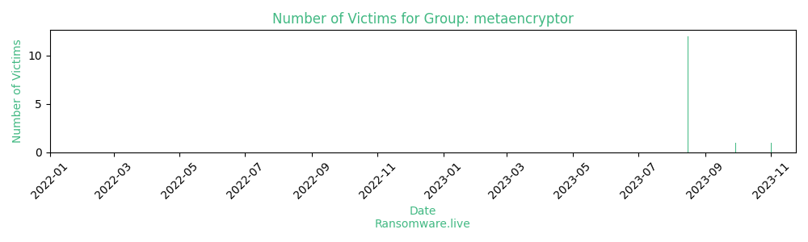

# Profiles for ransomware group : **metaencryptor**

🔎 `ransomware.live`has an active  parser for indexing metaencryptor's victims

### URLs
| Title | Available | Last visit | fqdn | Screenshot 
|---|---|---|---|---|
| Metaencryptor::Home | 🔴 | 24/11/2023 11:09 | `http://metacrptmytukkj7ajwjovdpjqzd7esg5v3sg344uzhigagpezcqlpyd.onion` | <a href="https://images.ransomware.live/screenshots/metacrptmytukkj7ajwjovdpjqzd7esg5v3sg344uzhigagpezcqlpyd-onion.png" target=_blank>📸</a> | 

### Total Attacks Over Time

### Victims

> 14 victims found

| victim | date | Description | Screenshot | 
|---|---|---|---|
| [`TANATEX Chemicals`](https://tanatexchemicals.com) | 01/11/2023 | TANATEX Chemicals is an international organisation that sells, develops, and produces chemicals for the textile industry. The company have been leading innovative solutions for textile processing for almost 60 years. It has worldwide network of offices and distributors, support customers all over the world.Revenue: $117M Year 2022 | <a href="https://images.ransomware.live/screenshots/posts/544d3c4cc9cbbdd7e859d8b509a3f13d.png" target=_blank>📸</a> |
| [`Belzona UK Ltd`](https://www.belzona.co.uk) | 29/09/2023 | Specialising in erosion, corrosion and chemical protection, Belzona is a world leader in the design and manufacture of repair composite materials and protective coatings for machinery, equipment, buildings and structures. | <a href="https://images.ransomware.live/screenshots/posts/5d24da038105aefac064046766b37795.png" target=_blank>📸</a> |
| [`Dillon Supply`](https://dillonsupply.com) | 16/08/2023 | Established in 1914, Dillon Supply distributes industrial products. They are heaquartered in Raleigh, North Carolina. Parent company Descours & Cabaud. D&C is a 200-year old company that is the European leader in MRO, Industrial and Construction Supply with over 650 locations worldwide. Sales: $313,865,000 Year 2021 | <a href="https://images.ransomware.live/screenshots/posts/5520cc37a6ce0beada4c900109e134e0.png" target=_blank>📸</a> |
| [`Epicure`](https://www.epicure.com) | 16/08/2023 | Epicure is a online shop with healthy eating. The company is primarily focused on educating the community on healthy eating. Revenue: $117 M Year 2021 | <a href="https://images.ransomware.live/screenshots/posts/f444289f189db4a4e255635283a84715.png" target=_blank>📸</a> |
| [`Coswell`](http://www.coswell.biz) | 16/08/2023 | The Company Coswell is an italian family run group of companies specialized in manufacturing and distribution of body and oral care products, health foods, masstige and selective fragrances, skin care and cosmetics in the mass market, perfumeries and pharmacies. Revenue: $157M Year 2021 | <a href="https://images.ransomware.live/screenshots/posts/f0f74edb083ccbb0eabd05454bf2772c.png" target=_blank>📸</a> |
| [`BOB Automotive Group`](https://bob-automotive.com) | 16/08/2023 | Die BOB Automotive Group mit Hauptsitz in Essen ist eine Holding für renommierte und starke Automobilunternehmen in Nordrhein-Westfalen. Derzeit ist die BOB-Gruppe mit 20 Autohäusern im Ruhrgebiet, im Rheinland und im Bergischen Land vertreten. 21. Standort ist die Verwaltung, in der die gesamten Querschnittsfunktionen  wie zum Beispiel das Personalwesen, Buchhaltung und Controlling, die IT, die Fahrzeugdisposition oder das Marketing gebündelt sind und die administrative Unterstützung für die operativen Standorte leisten. Revenue: 240 M EUR Year 2022 | <a href="https://images.ransomware.live/screenshots/posts/d9725308c60b256a499c1ac11a01a626.png" target=_blank>📸</a> |
| [`Seoul Semiconductor`](https://www.seoulsemicon.com) | 16/08/2023 | Seoul Semiconductor is the top LED manufacturing company in Korea and No. 3 in the world. Over the past 30 years, Seoul has devoted itself to R&D with a vast patent portfolio and is leading second generation LED technology. Stock: Korea Exchange. Revenue: $842 M Year 2022 | <a href="https://images.ransomware.live/screenshots/posts/db7141193bc085b4cc5253b2e4e3e3a1.png" target=_blank>📸</a> |
| [`Kraiburg Austria GmbH`](https://www.kraiburg-austria.com) | 16/08/2023 | Kraiburg Austria GmbH Lösungen für die Reifenrunderneuerung. Bei KRAIBURG Retreading Materials vereinen wir über 70 Jahre Erfahrung im Umgang mit Compounding mit einer qualitätsorientierten Unternehmenspolitik – unsere Basis für beste Produkte und zufriedene Kunden.Revenue: $76M Year 2021 | <a href="https://images.ransomware.live/screenshots/posts/179fd7046379f4fc11a67661cdcf3ae2.png" target=_blank>📸</a> |
| [`Autohaus Ebert GmbH`](https://www.autohaus-ebert.de) | 16/08/2023 | Autohaus Ebert GmbH & Co.KG has been there for its customers for more than 120 years. At 12 locations around the Weinheim headquarters, the company offers a wide range of new and used cars as well as commercial vehicles. In addition, Autohaus Ebert GmbH & Co.KG offers comprehensive services related to automobiles.Revenue: $200M | <a href="https://images.ransomware.live/screenshots/posts/a03af2bd830a4937bddb7b6218352da6.png" target=_blank>📸</a> |
| [`CVO Antwerpen`](https://www.cvoantwerpen.be) | 16/08/2023 | Education for adults.Revenue: $72M | <a href="https://images.ransomware.live/screenshots/posts/387a3715c929ec9ead331a53c005a8b6.png" target=_blank>📸</a> |
| [`ICON Creative Studio`](https://www.iconcreativestudio.com) | 16/08/2023 | ICON Creative Studio is Canada’s largest independently owned CG Animation Studio, located in the historic Gastown district of Vancouver, BC Canada, housing over 950 talented creatives ranging from design, storyboarding, modeling, rigging, animation, shot finaling, lighting, visual effects and compositing artists alongside creative and management teams.Revenue: $410M | <a href="https://images.ransomware.live/screenshots/posts/f27bb1fe8de5e24839f500a3c6eace8d.png" target=_blank>📸</a> |
| [`Heilmann Gruppe`](https://www.heilmann-ag.de) | 16/08/2023 | Heilmann Gruppe. The purchase and sale of potatoes and onions, as well as all related activities not subject to authorisation. The following companies belong to Heilmann Gruppe: Heilmann AG, Agricola, Heilmann Logistics. Revenue: $134M Year 2021 | <a href="https://images.ransomware.live/screenshots/posts/d8e8d9739055d97332e994817887b3d4.png" target=_blank>📸</a> |
| [`Schwälbchen Molkerei AG`](https://www.schwaelbchen-molkerei.de) | 16/08/2023 | Schwälbchen Molkerei AG is a company that operates in the Consumer Services industry. It is a German manufacturer and wholesaler of dairy products. It operates in two business segments: milk production and merchandise. The Company's range of products includes fresh milk, homogenized milk, cream and yogurt, butter, cheese manufactures as well as curd, among others. The company is headquartered in Bad Schwalbach, Hessen, Germany. Revenue: $211M Year 2022 | <a href="https://images.ransomware.live/screenshots/posts/eed70bc87113f174261e3e7df416ba3b.png" target=_blank>📸</a> |
| [`Münchner Verlagsgruppe GmbH`](https://m-vg.de/) | 16/08/2023 | Münchner Verlagsgruppe GmbH is a company that operates in the Publishing industry. It has $36M of revenue. The company is headquartered in Munich, Bavaria, Germany. | <a href="https://images.ransomware.live/screenshots/posts/db0bc28bf77c0543e7827546cca458df.png" target=_blank>📸</a> |

Last update : _Friday 24/11/2023 13.15 (UTC)_
