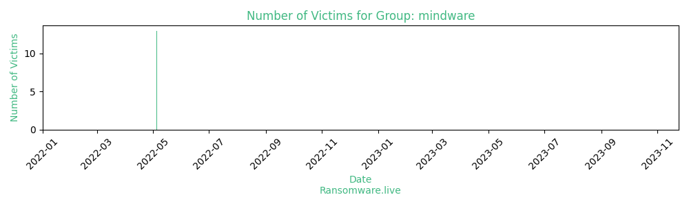

# Profiles for ransomware group : **mindware**

> Ransomware, potential rebranding of win.sfile.

### URLs
| Title | Available | Last visit | fqdn | Screenshot 
|---|---|---|---|---|
| DataLeakBlog | 🔴 | 16/08/2022 10:33 | `http://dfpc7yvle5kxmgg6sbcp5ytggy3oeob676bjgwcwhyr2pwcrmbvoilqd.onion` | ❌ | 

### Total Attacks Over Time

### Posts

> 13 victims found

| post | date | Description | Screenshot | 
|---|---|---|---|
| [`willsent`](https://google.com/search?q=willsent) | 05/05/2022 |   |   |
| [`welplaat`](https://google.com/search?q=welplaat) | 05/05/2022 |   |   |
| [`toshfarms`](https://google.com/search?q=toshfarms) | 05/05/2022 |   |   |
| [`thebureau`](https://google.com/search?q=thebureau) | 05/05/2022 |   |   |
| [`smd`](https://google.com/search?q=smd) | 05/05/2022 |   |   |
| [`simpsonplastering`](https://google.com/search?q=simpsonplastering) | 05/05/2022 |   |   |
| [`nottco`](https://google.com/search?q=nottco) | 05/05/2022 |   |   |
| [`micropakkn`](https://google.com/search?q=micropakkn) | 05/05/2022 |   |   |
| [`mediuscorp`](https://google.com/search?q=mediuscorp) | 05/05/2022 |   |   |
| [`diager`](https://google.com/search?q=diager) | 05/05/2022 |   |   |
| [`callinc`](https://google.com/search?q=callinc) | 05/05/2022 |   |   |
| [`allwell`](https://google.com/search?q=allwell) | 05/05/2022 |   |   |
| [`acorentacar`](https://google.com/search?q=acorentacar) | 05/05/2022 |   |   |

Last update : _Thursday 03/08/2023 07.07 (UTC)_
