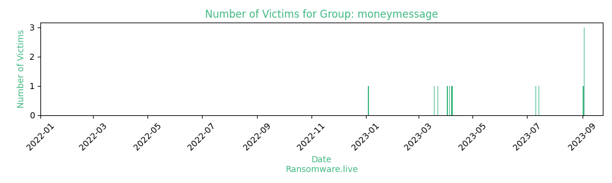

# Profiles for ransomware group : **moneymessage**

_`hash : bbdac308d2b15a4724de7919bf8e9ffa713dea60ae3a482417c44c60012a654b`_

### External analysis
- https://twitter.com/Threatlabz/status/1641113991824158720

🔎 `ransomware.live`has an active  parser for indexing moneymessage's victims

### URLs
| Title | Available | Last visit | fqdn | Screenshot 
|---|---|---|---|---|
| News | 🟢 | 24/11/2023 12:42 | `http://blogvl7tjyjvsfthobttze52w36wwiz34hrfcmorgvdzb6hikucb7aqd.onion` | <a href="https://images.ransomware.live/screenshots/blogvl7tjyjvsfthobttze52w36wwiz34hrfcmorgvdzb6hikucb7aqd-onion.png" target=_blank>📸</a> | 

### Ransom note
* [📝 1 ransom note](notes/moneymessage)

### Total Attacks Over Time

### Victims

> 18 victims found

| victim | date | Description | Screenshot | 
|---|---|---|---|
| [`Tri-Way Manufacturing Technologies`](https://google.com/search?q=Tri-Way+Manufacturing+Technologies) | 12/10/2023 |  | <a href="https://images.ransomware.live/screenshots/posts/4a3bee41e75c432dacd07bb978c8f3cb.png" target=_blank>📸</a> |
| [`Toscana Promozione`](https://google.com/search?q=Toscana+Promozione) | 03/10/2023 |  | <a href="https://images.ransomware.live/screenshots/posts/83f0337aec80152263a7edfb00da372e.png" target=_blank>📸</a> |
| [`MD LOGISTICS`](https://google.com/search?q=MD+LOGISTICS) | 03/10/2023 |  | <a href="https://images.ransomware.live/screenshots/posts/43b8dfa689bb622b42203b0b7f4ca065.png" target=_blank>📸</a> |
| [`Maxco Supply`](https://google.com/search?q=Maxco+Supply) | 03/10/2023 |  | <a href="https://images.ransomware.live/screenshots/posts/4a3bee41e75c432dacd07bb978c8f3cb.png" target=_blank>📸</a> |
| [`Riverside Logistics`](https://google.com/search?q=Riverside+Logistics) | 03/09/2023 |  | <a href="https://images.ransomware.live/screenshots/posts/83f0337aec80152263a7edfb00da372e.png" target=_blank>📸</a> |
| [`Estes Design & Manufacturing`](https://google.com/search?q=Estes+Design+%26+Manufacturing) | 03/09/2023 |  | <a href="https://images.ransomware.live/screenshots/posts/43b8dfa689bb622b42203b0b7f4ca065.png" target=_blank>📸</a> |
| [`Aiphone`](https://google.com/search?q=Aiphone) | 03/09/2023 |  | <a href="https://images.ransomware.live/screenshots/posts/4a3bee41e75c432dacd07bb978c8f3cb.png" target=_blank>📸</a> |
| [`Taylor University`](https://google.com/search?q=Taylor+University) | 02/09/2023 |  | <a href="https://images.ransomware.live/screenshots/posts/9a1d0c90a1241e3e0fb6e4d4ab256e0e.png" target=_blank>📸</a> |
| [`Meteksan Defence Industry`](https://www.meteksan.com) | 14/07/2023 | Meteksan Defence Industries, Inc. is a subsidiary of Bilkent Holding and Bilkent University of Ankara, Turkey. The Company employs 150 personnel, where more than 100 high degree engineers comprise the direct technological workforce. | <a href="https://images.ransomware.live/screenshots/posts/4a3bee41e75c432dacd07bb978c8f3cb.png" target=_blank>📸</a> |
| [`Propper International`](https://www.propper.com) | 11/07/2023 | Founded in 1967, Propper is a manufacturer of clothing and gear for tactical, law enforcement, public safety, and military applications The company is headquartered in St. Louis, Missouri. | <a href="https://images.ransomware.live/screenshots/posts/43b8dfa689bb622b42203b0b7f4ca065.png" target=_blank>📸</a> |
| [`Pharmerica.com & BrightSpring Health Services`](https://google.com/search?q=Pharmerica.com+%26+BrightSpring+Health+Services) | 08/04/2023 | Headquartered in Louisville, Kentucky, PharMerica is one of the largest and fastest-growing institutional pharmacy companies in the United States. Our premier pharmacy services, with more than 180 long-term care pharmacies in almost every state, have a national scope but a local approach.Revenue: $3BBrightSpring Health Services is the leading provider of complementary home- and community-based health services for complex populations in need of specialized and/or chronic care. We focus on providing quality outcomes, through best-in-class service and technology capabilities.Revenue: $5.4B | <a href="https://images.ransomware.live/screenshots/posts/83f0337aec80152263a7edfb00da372e.png" target=_blank>📸</a> |
| [`Micro Star International`](https://google.com/search?q=Micro+Star+International) | 07/04/2023 | Micro-Star International AKA MSI designs, manufactures, and sells motherboards and graphics cards for customers in the United States, Canada, and internationally. MSI is headquartered in Taipei, Taiwan. MSI source code, including framework to develop bios, also we have private keys.We will publish stolen data when timer expires.Databases: wwrlt2, eais, CTMS, ERP.Revenue: $7BWebsite: msi.com |   |
| [`Guess who!`](https://google.com/search?q=Guess+who%21) | 05/04/2023 | One huge trust have lost gigabytes of their's data and now playing with fire trying to hang time. Keep an eye on the stocks, don't lose your money. |   |
| [`midamericanglass.com`](https://google.com/search?q=midamericanglass.com) | 03/04/2023 | Mid-American Glass is a regional distributor / fabricator of flat glass, insulating glass, and architectural metal. While flat glass distribution remains the strength of our company, our fabrication of insulating glass and architectural metal continues to drive our growth.Website www.midamericanglass.comRevenue $11.4M |   |
| [`Goldenbear.com & mjhallandcompany.com`](https://google.com/search?q=Goldenbear.com+%26+mjhallandcompany.com) | 02/04/2023 | GOLDENBEAR.COMGolden Bear is a leading provider of commercial property and casualty, professional liability, and residential earthquake insurance.Revenue: 20.8M$Eployees: 82Website: www.goldenbear.commjhallandcompany.comSince 1973, M.J. Hall and Company has earned a name for dependable Business Insurance, as well as one of California's most experienced general agents.Revenue: 11.1M$Eployees: 55Website:www.mjhallandcompany.com | <a href="https://images.ransomware.live/screenshots/posts/4a3bee41e75c432dacd07bb978c8f3cb.png" target=_blank>📸</a> |
| [`Biman airlines`](https://google.com/search?q=Biman+airlines) | 23/03/2023 | Biman Bangladesh Airlines (Bengali) is the national flag carrier airline of Bangladesh. The airline provides international passenger and cargo services to Asia and Europe, as well as major domestic routes inside Bangladesh. | <a href="https://images.ransomware.live/screenshots/posts/9a1d0c90a1241e3e0fb6e4d4ab256e0e.png" target=_blank>📸</a> |
| [`Hawaii self storage`](https://google.com/search?q=Hawaii+self+storage) | 19/03/2023 | Hawaii Self Storage is a locally owned company, committed to service the people & businesses in Hawaii with exceptional storage services. Data 32GB: | <a href="https://images.ransomware.live/screenshots/posts/43b8dfa689bb622b42203b0b7f4ca065.png" target=_blank>📸</a> |
| [`Lpa-group.com`](https://google.com/search?q=Lpa-group.com) | 04/01/2023 | LPA is a leading UK manufacturer in the design and build of connectors, LED lighting and electrical systems. Founded in the 1800’s, the Company has a long product development history where high reliability, low maintenance and life cycle costs are an intrinsic part of our product design and build ethos. All companies are ISO 9001 certified.Revenue: UK£19.3m  |   |

Last update : _Friday 24/11/2023 13.15 (UTC)_
