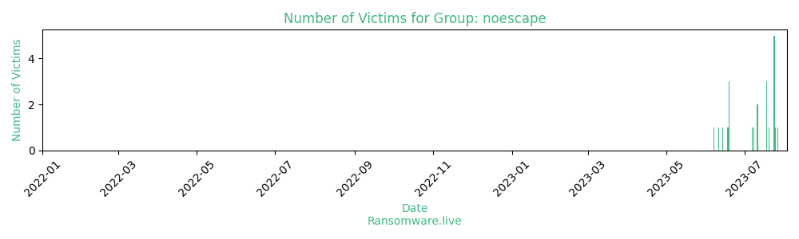

# Profiles for ransomware group : **noescape**

🔎 `ransomware.live`has an active  parser for indexing noescape's victims

### URLs
| Title | Available | Last visit | fqdn | Screenshot 
|---|---|---|---|---|
| NoEscape | 🟢 | 24/09/2023 14:14 | `http://noescapemsqxvizdxyl7f7rmg5cdjwp33pg2wpmiaaibilb4btwzttad.onion` | <a href="https://images.ransomware.live/screenshots/noescapemsqxvizdxyl7f7rmg5cdjwp33pg2wpmiaaibilb4btwzttad-onion.png" target=_blank>📸</a> | 
| Welcome | 🟢 | 24/09/2023 14:14 | `http://noescaperjh3gg6oy7rck57fiefyuzmj7kmvojxgvlmwd5pdzizrb7ad.onion` | <a href="https://images.ransomware.live/screenshots/noescaperjh3gg6oy7rck57fiefyuzmj7kmvojxgvlmwd5pdzizrb7ad-onion.png" target=_blank>📸</a> | 

### Ransom note
* [📝 2 ransom notes](notes/noescape)

### Total Attacks Over Time

### Victims

> 57 victims found

| victim | date | Description | Screenshot | 
|---|---|---|---|
| [`BPR Properties LLC`](https://bpr-properties.com) | 16/09/2023 | BPR Properties was founded in 1983, with the purchase of our first property: a smoke shop in Staten Island, New York. Since our humble beginnings, BPR Properties has acquir... | <a href="https://images.ransomware.live/screenshots/posts/de9b608923ac6f321c8eef6bc971ec1e.png" target=_blank>📸</a> |
| [`Kool-Air Inc`](https://www.kool-air-inc.com) | 14/09/2023 | Kool-Air’s management team is experienced in all phases of manufacturing, sales and marketing of superior quality refrigeration products for commercial, industrial and inst... | <a href="https://images.ransomware.live/screenshots/posts/311cba9c2a182372c1b0bf063b715c06.png" target=_blank>📸</a> |
| [`Küng Ag Bern`](https://www.kuengbern.ch) | 10/09/2023 | Küng Ag Bern handle the wholesale trade and distribution of mineral oil products under the AVIA brand. We have significant storage space in the Bern area. Our customers can... | <a href="https://images.ransomware.live/screenshots/posts/4f8968c7923072e29591e702e41bae8c.png" target=_blank>📸</a> |
| [`IKP`](https://www.ikp.at) | 10/09/2023 | Three letters with a big impact – ikp is one of the leading communications agencies in Austria and has won many awards. From classic media work to digital communication – w... | <a href="https://images.ransomware.live/screenshots/posts/df625e13749d00f64966828da6551658.png" target=_blank>📸</a> |
| [`International Joint Commission`](https://ijc.org) | 07/09/2023 | Canada and the United States created the International Joint Commission because they recognized that each country is affected by the other's actions in lake and river systems along the border. The two countries cooperate... | <a href="https://images.ransomware.live/screenshots/posts/23221fd6bbca33a857caa86697317440.png" target=_blank>📸</a> |
| [`EDUCAL, SA de CV`](https://www.educal.com.mx) | 07/09/2023 | EDUCAL was established on January 29, 1982 as a public limited company with variable capital, with the corporate purpose of designing teaching materials that supported the National Educational System. In 1987 he was assi... | <a href="https://images.ransomware.live/screenshots/posts/e910d1137b579d307073db390eb8585b.png" target=_blank>📸</a> |
| [`Fondation Vincent De Paul`](https://www.fondation-vincent-de-paul.org) | 07/09/2023 | Created by the Congregation of the Sisters of Charity of Strasbourg, the Vincent de Paul Foundation was recognized as a public benefit by a resolution of the Council of State of December 26, 2001.The foundation's network... | <a href="https://images.ransomware.live/screenshots/posts/e2c2b67787b40254b1662e326e69797f.png" target=_blank>📸</a> |
| [`Infinity Construction Company`](https://www.infinityconstruction.com) | 04/09/2023 | Infinity Construction Company provide General Contracting, Construction Management, and Design-Build services throughout the State of Ohio.  Our major markets include Healthcare, Office, Education, Public and Non-Profit,... | <a href="https://images.ransomware.live/screenshots/posts/f6cd57d0e312e433fa57d9c794923ce4.png" target=_blank>📸</a> |
| [`AdSage Technology Co., Ltd.`](https://www.adsage.com) | 03/09/2023 | Beijing AdSage Technology Co., Ltd. (AdSage/adSage) was established in 2007. It is famous for its big data mining and precision marketing. It is the "CNAAⅠ" certification of the China Advertising Association and one of t... | <a href="https://images.ransomware.live/screenshots/posts/de9b608923ac6f321c8eef6bc971ec1e.png" target=_blank>📸</a> |
| [`Mulkay Cardiology Consultants`](https://www.mulkaycardiology.com) | 02/09/2023 | Angel J. Mulkay, MD, cardiac and peripheral interventionalist founded Mulkay Cardiology Consultants more than a decade ago. The network was successfully encrypted and compromised.We have 60GB of confidential and personal... | <a href="https://images.ransomware.live/screenshots/posts/3f1f46886ff185e5acf881937deaf1c7.png" target=_blank>📸</a> |
| [`Altmann Dental GmbH & Co KG`](https://www.altmanndental.de) | 02/09/2023 | Altmann Dental GmbH & Co. KG is one of the leading dental depots in the industry. As a family business, we have been supporting dentists and dental laboratories in their daily challenges for over 100 years, now in the 3r... | <a href="https://images.ransomware.live/screenshots/posts/33fb6a0fd4af03b16ce0c95efbcbbad3.png" target=_blank>📸</a> |
| [`QI Holdings Ltd.`](https://www.qigroup.com) | 28/08/2023 | Today, the QI Group, headquartered in Hong Kong, is a diversified multinational entity with a wide range of subsidiary companies in nearly 30 countries. We keep pace with exponentially-growing technology and expand throug... | <a href="https://images.ransomware.live/screenshots/posts/38b3039a06c0fcc232d18fbe0e5c2dde.png" target=_blank>📸</a> |
| [`Rs Logistics Ltd`](https://www.rslog.com) | 28/08/2023 | RS Logistics Limited is a fast growing customer-oriented firm in the logistic industry. Founded in 2003, we started our business in Hong Kong as corporate headquarter with a vision to provide worldwide logistics services... | <a href="https://images.ransomware.live/screenshots/posts/16eabb4c6b2fba778b72d2effb3f2ecc.png" target=_blank>📸</a> |
| [`GORDON, MUIR & FOLEY LLP`](https://www.gmflaw.com) | 28/08/2023 | Gordon, Muir & Foley represents diverse clients in a broad range of practice areas.  Founded in 1947, we are dedicated to creative and efficient legal solutions tailored to the needs of each client. Open communication is... | <a href="https://images.ransomware.live/screenshots/posts/16eabb4c6b2fba778b72d2effb3f2ecc.png" target=_blank>📸</a> |
| [`Northwave s.r.l.`](https://northwave.it) | 28/08/2023 | At Northwave we pour all our energy into one and one thing only: creating the finest products for sport in the mountains. With a single-minded focus, we create innovative products, unmatched in terms of performance, qual... | <a href="https://images.ransomware.live/screenshots/posts/3f1f46886ff185e5acf881937deaf1c7.png" target=_blank>📸</a> |
| [`HBME LLC`](https://hbme.com) | 28/08/2023 | HBME LLC is an accounting company that provides tax planning, consultation, business accounting and IRS audit representation services. The company has been successfully compromised and we have 25GB of service data from 2... | <a href="https://images.ransomware.live/screenshots/posts/3f1f46886ff185e5acf881937deaf1c7.png" target=_blank>📸</a> |
| [`Omniatel`](https://www.omniatel.it) | 28/08/2023 | The Rome branch was opened in 2004 to satisfy requirements connected with management and planned development of the market inCentral Italy. In April, 2005, just five years after incorporation and in view of the high turn... | <a href="https://images.ransomware.live/screenshots/posts/c76056714d0abd4e18e81b5748186df4.png" target=_blank>📸</a> |
| [`Pasquale Bruni Ltd`](https://www.pasqualebruni.com) | 26/08/2023 | Pasquale Bruni Ltd is a company that operates in the Luxury Goods & Jewelry industry. It employs 51-100 people and has $10M-$25M of revenue.For two generations we have created the most exceptional pieces of jewellery for... | <a href="https://images.ransomware.live/screenshots/posts/3513bb109d2312890b32c54130bd9d05.png" target=_blank>📸</a> |
| [`Iina Ba Inc`](https://www.iinaba.com) | 23/08/2023 | Iina Ba Inc is a company that operates in the Civil Engineering industry. It employs 21-50 people and has $5M-$10M of revenue.Our mission is to provide innovative solutions to environmental demands, designed through a po... | <a href="https://images.ransomware.live/screenshots/posts/5d8cb04198aecca8f77f7e8362260b47.png" target=_blank>📸</a> |
| [`Gujarat Industries Power Company Ltd.`](https://gipcl.com) | 21/08/2023 | Gujarat Industries Power Company Limited generates and sells electricity primarily to power purchasing companies in India. The company generates power through gas, lignite, wind, and solar power plants with combined inst... | <a href="https://images.ransomware.live/screenshots/posts/fc4314b4e32d98e6664a1fa12a441680.png" target=_blank>📸</a> |
| [`Softverg Co., Ltd.`](https://www.softverk.co.kr) | 18/08/2023 | Softverg Co., Ltd. is a young company that transactswith leading domestic companies through domestic and foreign software partnerships (microsoft enterprise partner, Hancom Large partner, erwin master reseller, Ahn Lab d... | <a href="https://images.ransomware.live/screenshots/posts/d81c0f120d897614d5a84612bcceb0ba.png" target=_blank>📸</a> |
| [`Fiocruz`](https://www.fiocruz.br) | 18/08/2023 | The Institute of technology in Immunobiology (Bio-Manguinhos) is the technical-scientific unit of the Oswaldo Cruz Foundation (Fiocruz) that produces and develops immunobiological solutions to meet the demands of public ... | <a href="https://images.ransomware.live/screenshots/posts/ea948d937912d7fe56653ee4b12c5ad0.png" target=_blank>📸</a> |
| [`Ningbo Yinzhou Vocational High School`](https://www.yxzg.net) | 18/08/2023 | Ningbo Yinzhou Vocational High SchoolThe school was founded in 1952. In April 1981, the school was approved by the Zhejiang Provincial People’s Government as one of the first batch of 18 key middle schools in the provinc... | <a href="https://images.ransomware.live/screenshots/posts/7287028fb51c73c6de4b28e5a7cb1adc.png" target=_blank>📸</a> |
| [`Infuance Communication Inc`](https://www.influencecommunication.com) | 13/08/2023 | Founded in 2001, Influence Communication is the largest 100% Quebec news broker. For 18 years, public and parapublic organizations at various levels of government, large Quebec, Canadian and foreign companies as well as ... | <a href="https://images.ransomware.live/screenshots/posts/d7d263415403cdd213c3d485c80982b4.png" target=_blank>📸</a> |
| [`FYTISA Industrial Felts and FabricsSL`](https://www.fytisa.com) | 13/08/2023 | Fytisa produces nowoven fabrics since 1964. Our team works to offer the quality, service and innovation that our clients require.The company was successfully encrypted and compromised.We have 27GB of data, namely:Insuran... | <a href="https://images.ransomware.live/screenshots/posts/4b2fa7a5bb694f78ce3fdb8c704e8ce7.png" target=_blank>📸</a> |
| [`Contact 121 Pty Ltd`](https://www.contact121.com.au) | 11/08/2023 | Contact 1-2-1 is an award-winning company that provides call centre and BPO outsourcing services to some of the largest global companies in Australia and overseas.Some of the largest global brands have entrusted Contact ... | <a href="https://images.ransomware.live/screenshots/posts/44c6203234555f815890ab6c21403dbc.png" target=_blank>📸</a> |
| [`au Domain Administration Ltd`](https://www.auda.org.au) | 11/08/2023 | .au Domain Administration Limited (auDA) is a not-for-profit organisation established by the Australian Internet community. We work with a range of stakeholders including industry, government and the Australian and inter... | <a href="https://images.ransomware.live/screenshots/posts/41b66f0cfbce908aa168e9fbb2f11a7b.png" target=_blank>📸</a> |
| [`FTRIA CO. LTD`](https://www.ftria.co.jp) | 09/08/2023 | FTRIA CO., LTD is a company specializing in the field of electrical equipment, telecommunications equipment, etc. The number of employees of the company as of April 1, 2021 consisted of 134 people. The company was succes... | <a href="https://images.ransomware.live/screenshots/posts/b4f1ff56d52f39c25ef2fb287e92f940.png" target=_blank>📸</a> |
| [`Fondation De Verdeil`](https://www.verdeil.ch) | 08/08/2023 | The Verdeil Foundation provides specialized pedagogy services to children and adolescents with various developmental and learning delays, with disabilities or in difficulty.500 employees cooperate within our various stru... | <a href="https://images.ransomware.live/screenshots/posts/fc4314b4e32d98e6664a1fa12a441680.png" target=_blank>📸</a> |
| [`Federal Bar Association`](https://www.brak.de) | 07/08/2023 | Federal Bar AssociationAs the parent organization of 28 bar associations, it has represented the interests of lawyers at federal, European and international levels for more than 60 years. With the competence and experien... | <a href="https://images.ransomware.live/screenshots/posts/37ad06c8b9389e2499d0595a1ee4595c.png" target=_blank>📸</a> |
| [`John L Lowery & Associates`](https://www.johnllowery.com) | 07/08/2023 | John L. Lowery & Associates, Inc. was organized in 1964 to provide versatile and comprehensive engineering and technical services for the petrochemical industry.  We have grown and now employ all levels of professional a... | <a href="https://images.ransomware.live/screenshots/posts/37ad06c8b9389e2499d0595a1ee4595c.png" target=_blank>📸</a> |
| [`Lower Yukon School District`](https://www.lysd.org) | 05/08/2023 | The ten villages that comprise the Lower Yukon School District are spread across 22,000 square miles. The Yukon River, one of the largest rivers in North America, winds through our yards on its way to the Bering Sea.The ... | <a href="https://images.ransomware.live/screenshots/posts/7183d4632380372b6d790e553a479a60.png" target=_blank>📸</a> |
| [`Kreacta`](https://www.kreacta.com) | 01/08/2023 | Kreacta are specialized in technical consultancy and2D/3D mechanical design of special and automatic machines, equipment, complete production lines, and installations for industrial production in general.We provide high-... | <a href="https://images.ransomware.live/screenshots/posts/f89db49010d6871d9aadab53883afaa0.png" target=_blank>📸</a> |
| [`Republican Vilnius Psychiatric Hospital`](https://rvpl.lt) | 30/07/2023 | Republican Vilnius Psychiatric Hospital (RVPL) is the largest and widest range of mental health care institution in Lithuania. More than 600 employees work in the hospital, and professional assistance is provided to more... | <a href="https://images.ransomware.live/screenshots/posts/f36b4e6c843e79c2165dedffc4b76634.png" target=_blank>📸</a> |
| [`Newton IT Solutions`](https://newtonit.co.uk) | 27/07/2023 | Newton IT Solutions is a managed services provider providing innovative business technology solutions. We pride ourselves on having our advanced, wholly owned and private infrastructure in the cloud, allowing our clients... | <a href="https://images.ransomware.live/screenshots/posts/11a5634b16e5fe5daf495bea1048d309.png" target=_blank>📸</a> |
| [`Avertronics Inc`](https://www.avertronics.com) | 27/07/2023 | Avertronics INC offers the processing of connecting elements, connecting wire modules, wireless application modules, system products, and related technology for the electronic, electrical, mechanic, photonics and health ... | <a href="https://images.ransomware.live/screenshots/posts/9ed11761022f85c6633114e1952ae644.png" target=_blank>📸</a> |
| [`Grupo SCA - Business Information`](https://www.gruposca.com) | 25/07/2023 | Grupo SCA is a national consulting company specializing in solutions and consulting, operating on the market for more than twenty years. Our management team has been trained by multinational firms in the sector and our e... | <a href="https://images.ransomware.live/screenshots/posts/50ed38ef13577560d6534e3687d9ea6e.png" target=_blank>📸</a> |
| [`Addison Electronique`](https://www.addison-electronique.com) | 24/07/2023 | Addison Electronique is a family business founded in 1961 specializing in electronic components.The company was successfully encrypted and compromised. We have data such as passports, credit cards, insurance, agreements,... | <a href="https://images.ransomware.live/screenshots/posts/407b24ce084e23fb14f2f4fd59f3255d.png" target=_blank>📸</a> |
| [`BEIJER REF`](https://www.beijer.es) | 24/07/2023 | Beijer Ref is the European leader in distribution and production of industrial and commercial refrigeration equipment, and components and air conditioning systems. It employs 21-50 people and has $10M-$25M of revenue. Th... | <a href="https://images.ransomware.live/screenshots/posts/4a76443e1f24d3b096b9c769a65f0d45.png" target=_blank>📸</a> |
| [`Ville de Chevilly-Larue`](https://www.ville-chevilly-larue.fr) | 24/07/2023 | Ville de Chevilly-Larue.The network has been successfully encrypted and compromised, the data we will release if the company does not enter into dialogue with us includes: banking, finance, budget, passports, contracts, ... | <a href="https://images.ransomware.live/screenshots/posts/8190ac58a1e8e060f64bf63511d55200.png" target=_blank>📸</a> |
| [`Fushimitsu Gumi Co., Ltd`](https://fushimitsu.com) | 24/07/2023 | In May 1954, the founder founded Fushimitsu Gumi, a civil engineering business, in the peaceful city of Hiroshima. In April 1956, the company was reorganized into Fushimitsu Gumi Co., Ltd. Since then, we have worked dili... | <a href="https://images.ransomware.live/screenshots/posts/c8e8e109ed9576e6ccee1d70827e2794.png" target=_blank>📸</a> |
| [`Garac - Business Information`](https://www.garac.com) | 24/07/2023 | GARAC prepares young people for the technological and commercial challenges of tomorrow and gives them the opportunity to earn a degree with access to jobs in the automotive, motorcycle, heavy duty vehicle and transporta... | <a href="https://images.ransomware.live/screenshots/posts/c8e8e109ed9576e6ccee1d70827e2794.png" target=_blank>📸</a> |
| [`Corinium Carpets`](https://www.coriniumcarpets.co.uk) | 20/07/2023 | Located in Cheltenham, Gloucestershire and established in 1976, Corinium Carpets is a family run carpet company committed to providing first class customer care and high quality flooring services. We have passports, driv... | <a href="https://images.ransomware.live/screenshots/posts/c8e8e109ed9576e6ccee1d70827e2794.png" target=_blank>📸</a> |
| [`Girardini Holding Srl`](https://www.girardini.it) | 18/07/2023 | We are an Italian company, existing since the early 1940s, specialized in the design and construction of moulds, cold stamping and powder coating of technical sheet metal components. We have over 100 GB of data stolen fr... | <a href="https://images.ransomware.live/screenshots/posts/8cdc00f12c08e5ed6518750173e3c6bf.png" target=_blank>📸</a> |
| [`Acomen`](https://www.acomen.fr) | 18/07/2023 | Acomen is a company that operates in the Health, Wellness and Fitness industry. It employs 21-50 people and has $5M-$10M of revenue. | <a href="https://images.ransomware.live/screenshots/posts/4fb8dc47a1682ab9d78f73dcfca6c1f8.png" target=_blank>📸</a> |
| [`Rampi Srl`](https://rampi.com) | 18/07/2023 | Rampi produces and markets professional detergents suitable for both laundries and domestic use. We have over 100 GB of data stolen from the company's servers which include:Banking, commission data from 2016 to March 202... | <a href="https://images.ransomware.live/screenshots/posts/c8e8e109ed9576e6ccee1d70827e2794.png" target=_blank>📸</a> |
| [`Burton & South Derbyshire College`](https://www.bsdc.ac.uk) | 11/07/2023 | A school of science was founded in 1872 and by 1879 had moved to the Burton Institute in Union Street. By 1931 it was known as the Technical Institute. In 1948 it became Burton technical College following the combination... | <a href="https://images.ransomware.live/screenshots/posts/d474b9dca3451f5098a69ee7a811caa5.png" target=_blank>📸</a> |
| [`Jordan Airmotive Ltd`](https://www.jordanairmotive.com) | 11/07/2023 | Jordan Airmotive provides additional services: 1. Contract Evaluation Jordan Airmotive team will evaluate the most suitable contract type for your engine repair, whether it is NTE, FFP, Time & Material or otherwise.  We ... | <a href="https://images.ransomware.live/screenshots/posts/d474b9dca3451f5098a69ee7a811caa5.png" target=_blank>📸</a> |
| [`Protactics`](https://www.protactics.com.co) | 08/07/2023 | Protactics is a Colombian company that provides security and defense solutions for companies and governments in Latin America. We have data such as passports, ID cards/certificates/agreements/contracts/confidential docum... | <a href="https://images.ransomware.live/screenshots/posts/637cd0f6765b5cbd24c909b21da22630.png" target=_blank>📸</a> |
| [`Innodis Group`](https://innodisgroup.com) | 07/07/2023 | Innodis Ltd, a public listed company founded in 1973, averages an annual turnover of almost MUR 4 billion. We are presently one of the largest groups involved in food and non-food production and distribution in Mauritius... | <a href="https://images.ransomware.live/screenshots/posts/637cd0f6765b5cbd24c909b21da22630.png" target=_blank>📸</a> |
| [`University of Hawaii`](https://www.hawaii.edu) | 19/06/2023 | University of Hawaii, founded in 1907 and headquartered in Honolulu, Hawaii, offers degrees in both undergraduate and graduate-level curriculum. The University programs include undergraduate and graduate degree programs ... | <a href="https://images.ransomware.live/screenshots/posts/8fee3bcb12deaac8d9a8709ed1e18070.png" target=_blank>📸</a> |
| [`Promotion Fulfillment Center`](https://www.pfcfulfills.com) | 19/06/2023 | Founded in 1974, Promotion Fulfillment Center provides product fulfillment and promotional services. They offer rebates, sweepstakes/contests, loyalty programs and more. The company is headquartered in Camanche, Iowa. | <a href="https://images.ransomware.live/screenshots/posts/8fee3bcb12deaac8d9a8709ed1e18070.png" target=_blank>📸</a> |
| [`Credit Team`](https://www.creditteam.eu) | 19/06/2023 | Provider of subsidized finance and credit brokerage intended to increase liquidity and company growth. The company's services include obtaining non-repayable grants, tax bonuses and subsidized loans for micro SMEs, start... | <a href="https://images.ransomware.live/screenshots/posts/543f3dd43bae144e2d87a95f473a6c97.png" target=_blank>📸</a> |
| [`Cyril Johnston Hire`](https://www.cjhire.co.uk) | 18/06/2023 | Cyril Johnston Hire commenced trading in April 1988. The original concept was the provision of Agricultural equipment Rental to support the companies burgeoning Agricultural customer base. This concept, Cyril Johnston Hi... | <a href="https://images.ransomware.live/screenshots/posts/8fee3bcb12deaac8d9a8709ed1e18070.png" target=_blank>📸</a> |
| [`Centre Hospitalier Régional de Namur`](https://www.chrn.be) | 14/06/2023 | Centre Hospitalier Régional de Namur is a company that operates in the Hospital & Health Care industry. It employs 1,001-2,000 people and has $100M-$250M of revenue. The company is headquartered in Namur, Wallonia, Belgi... | <a href="https://images.ransomware.live/screenshots/posts/cb9894c1b22bf51fb87bb1b41493a688.png" target=_blank>📸</a> |
| [`CASTEC Inc`](https://www.castec.com) | 11/06/2023 | If the company is not going to cooperate, then soon everyone will be able to see valuable company data in the data leak, such as tax documents and much more. | <a href="https://images.ransomware.live/screenshots/posts/3b77e73430d160c315ddfd70e69c87ea.png" target=_blank>📸</a> |
| [`Doesburg Components`](https://www.doesburg-comp.nl) | 07/06/2023 | If the company does not contact and cooperate by the end of the time counter, then we will leak all their important files and documents, including secret tax documents. | <a href="https://images.ransomware.live/screenshots/posts/c35a5b7e42dfd3d7ab57c100b2087e64.png" target=_blank>📸</a> |

Last update : _Sunday 24/09/2023 14.39 (UTC)_
