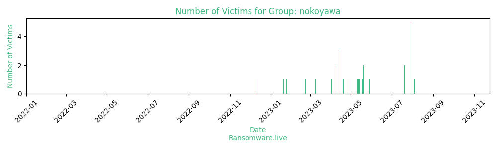

# Profiles for ransomware group : **nokoyawa**

### External analysis
- https://www.trendmicro.com/en_us/research/22/c/nokoyawa-ransomware-possibly-related-to-hive-.html

🔎 `ransomware.live`has an active  parser for indexing nokoyawa's victims

### URLs
| Title | Available | Last visit | fqdn | Screenshot 
|---|---|---|---|---|
| NOKOYAWA Leaks | 🔴 | 11/07/2022 22:26 | `http://lirncvjfmdhv6samxvvlohfqx7jklfxoxj7xn3fh7qeabs3taemdsdqd.onion` | ❌ | 
| NOKOYAWA Leaks | 🔴 | 25/01/2023 21:03 | `http://6yofnrq7evqrtz3tzi3dkbrdovtywd35lx3iqbc5dyh367nrdh4jgfyd.onion` | <a href="https://images.ransomware.live/screenshots/6yofnrq7evqrtz3tzi3dkbrdovtywd35lx3iqbc5dyh367nrdh4jgfyd-onion.png" target=_blank>📸</a> | 
| none | 🟢 | 07/08/2023 11:49 | `http://noko65rmtaiqyt2cw2h4jrxe3u56t2k7ov3nd22hoji4c5vnfib2i4yd.onion` | <a href="https://images.ransomware.live/screenshots/noko65rmtaiqyt2cw2h4jrxe3u56t2k7ov3nd22hoji4c5vnfib2i4yd-onion.png" target=_blank>📸</a> | 
| Wall of Shame | 🟢 | 07/08/2023 11:50 | `http://nokoleakb76znymx443veg4n6fytx6spck6pc7nkr4dvfuygpub6jsid.onion` | <a href="https://images.ransomware.live/screenshots/nokoleakb76znymx443veg4n6fytx6spck6pc7nkr4dvfuygpub6jsid-onion.png" target=_blank>📸</a> | 

### Ransom note
* [📝 2 ransom notes](notes/nokoyawa)

### Total Attacks Over Time

### Posts

> 36 victims found

| post | date | Description | Screenshot | 
|---|---|---|---|
| [`Studio Domaine LLC`](https://www.studiodomaine.com/) | 04/08/2023 | Studio Domaine is an innovative design firm dedicated to creating personalized interiors for residential and model homes. Our custom design services span broad styles and sensibilities providing our clients with their own "signature" style. What began in 1989 as Barbara's Interiors has now... | <a href="https://images.ransomware.live/screenshots/posts/b96ec10fda84f2d64533c671b8b9114a.png" target=_blank>📸</a> |
| [`Roman Catholic Diocese of Albany`](https://www.rcda.org/) | 03/08/2023 | The Roman Catholic Diocese of Albany covers 14 counties in Eastern New York including the south west corner of a 15th county. Its Mother Church is the Cathedral of the Immaculate Conception in the city of Albany. | <a href="https://images.ransomware.live/screenshots/posts/d7e90b70c7f6ae776751c678d0a03c42.png" target=_blank>📸</a> |
| [`Pea River Electric Cooperative`](https://www.peariver.com) | 01/08/2023 | Pea River Electric Cooperative is a service-oriented, distribution electric utility that is owned by the members it serves. Pea River Electric provides electric service to members in portions of Barbour, Dale, Henry and Coffee counties in Alabama. The headquarters office is located at 1311 W. Roy... | <a href="https://images.ransomware.live/screenshots/posts/347db0ad736ed30e4a8aa75b0c26adef.png" target=_blank>📸</a> |
| [`One Health Solutions`](https://www.onehealthsolutions.com/) | 29/07/2023 | ONE HEALTH is a pioneering healthcare platform that is the result of a unique partnership between a group of visionaries from the healthcare and technology industry, spearheaded by professionals from around the world and built by thousands of individuals who sharethe belief that healthcare is truly... | <a href="https://images.ransomware.live/screenshots/posts/6686e20ec7d1e6291ab4417aefa64c1d.png" target=_blank>📸</a> |
| [`Modern Eyez`](https://www.visionsource-moderneyez.com) | 29/07/2023 | Since 2003, Modern Eyez has been the leader and preferred provider of quality vision care products and personalized optometric services to our patients in Rio Rancho and the surrounding areas. Our experienced doctors and staff offer comprehensive vision examinations and specialize in the diagnosis... | <a href="https://images.ransomware.live/screenshots/posts/b1c0bfa468e74deb2df54b35bb2dd2f2.png" target=_blank>📸</a> |
| [`Village Church of Barrington`](https://www.vcbweb.org/) | 29/07/2023 | The Village Church is an religious institution founded in 1977 and is based in Mound, Texas . The village was founded to bring glory to God by making disciples through gospel-centered worship, gospel-centered community, gospel-centered service and gospel-centered multiplication.We will... | <a href="https://images.ransomware.live/screenshots/posts/2c4fe0afd40f55585ec67fe2f3e8a95d.png" target=_blank>📸</a> |
| [`AT&S`](https://www.atssh.com) | 29/07/2023 | AT&S was incorporated in Singapore in 2009 with the goal to provide the entire spectrum of products and services to the Oil & Gas and Marine sectors, bringing AquaTerra and SSH together in a synergistic manner. At formation, we became the only Singapore-based company and one of the largest in the... | <a href="https://images.ransomware.live/screenshots/posts/c11460329a5280215ad635a8bb5c13ed.png" target=_blank>📸</a> |
| [`Muncy Homes`](https://www.muncyhomes.com) | 29/07/2023 | Muncy Homes was founded in 1973 in the stable and skilled labor environment of North Central Pennsylvania. We are recognized as an industry leader of quality modular housing at competitive pricing and sales of over 500 houses annually. Our products are marketed through an independent builder... | <a href="https://images.ransomware.live/screenshots/posts/4f46e0b39b29beca6b53974561f857d0.png" target=_blank>📸</a> |
| [`CANAROPA Inc`](https://www.canaropa.com) | 20/07/2023 | Canaropa, founded in 1954 and headquartered in Quebec, Canada, is a leading provider of quality commercial and residential door locks that are secure, functional, and aesthetic. Canaropa offers a wide variety of exit devices for narrow and wide stiles with... | <a href="https://images.ransomware.live/screenshots/posts/5f7bceba9b3d0cfbc80d37ac402cce3b.png" target=_blank>📸</a> |
| [`Tampa General Hospital`](https://www.tgh.org/) | 20/07/2023 | Tampa General Hospital is a private not-for-profit hospital and one of the most comprehensive medical facilities in West Central Florida serving a dozen counties with a population in excess of 4 million. As one of the largest hospitals in Florida, Tampa General is licensed for 1,040... | <a href="https://images.ransomware.live/screenshots/posts/f42198cb9a625203bea6498b67713071.png" target=_blank>📸</a> |
| [`Roadies`](https://www.roadiesinc.com/) | 29/05/2023 | Roadies, a fast-growing and innovative logistics company that provides comprehensive and outstanding transportation services. Since our inception, we have been providing cutting-edge services, so whatever your truckload need may be, we have got you... | <a href="https://images.ransomware.live/screenshots/posts/761a57a03bcc6926cbc010d1830306b5.png" target=_blank>📸</a> |
| [`Liveaction inc.`](https://www.liveaction.com/) | 22/05/2023 | LiveAction’s Network Intelligence platform transforms complex data into actionable insights, providing organizations with a comprehensive view of their network, from network and application performance to security. Enterprise teams can rapidly take action to resolve network issues at scale... | <a href="https://images.ransomware.live/screenshots/posts/38e717d7691ee9ee2f416e9bd08ad0fe.png" target=_blank>📸</a> |
| [`Global Remote Services`](https://www.globalremoteservices.com/) | 22/05/2023 | GRS provides personalized management services for its clients across a broad range of business sectors, whilst also offering support in an impressive number of European languages. We use our experience in implementing and managing numerous complex projects as a... | <a href="https://images.ransomware.live/screenshots/posts/559485b298a0627e3d3ee046e74009db.png" target=_blank>📸</a> |
| [`Medical University of the Americas`](https://www.mua.edu) | 20/05/2023 | Medical University of the Americas (MUA) is a private for-profit offshore medical school in Charlestown, Nevis. It is owned by R3 Education, Inc. which also owns St. Matthew's University and the Saba University School of Medicine Students at MUA are primarily from the US and Canada and return to... | <a href="https://images.ransomware.live/screenshots/posts/6d2012c6913536ea02a79af961f36e04.png" target=_blank>📸</a> |
| [`Miami University`](https://www.miamioh.edu) | 20/05/2023 | Established in 1809, Miami University is consistently ranked among the top 50 national public universities by the U.S. News & World Report for providing students with an Ivy League-quality education at a public-school price. Located in quintessential college town Oxford, Ohio-with... | <a href="https://images.ransomware.live/screenshots/posts/a63cd0ef162b6394ddeca0bbbee14d51.png" target=_blank>📸</a> |
| [`Chattanooga State Community`](https://chattanoogastate.edu/) | 18/05/2023 | Chattanooga State Community College is a public community college in Chattanooga, Tennessee. The college is a member of the Tennessee Board of Regents System and is accredited by the Southern Association of Colleges and Schools (SACS).Chattanooga State offers a variety of programs... | <a href="https://images.ransomware.live/screenshots/posts/0ef815238e2a745c6937796ce2d357e0.png" target=_blank>📸</a> |
| [`Hyundai Motors Etats-Unis`](https://www.hyundai.ma) | 14/05/2023 | Hyundai Motors Etats-Unis is a company that operates in the Automotive industry. It employs 251-500 people and has %2425M-%2450M of revenue. The company is headquartered in Casablanca%2C Grand Casablanca%2C Morocco. | <a href="https://images.ransomware.live/screenshots/posts/5f75d8867b12af9dc5475fcdcfbab661.png" target=_blank>📸</a> |
| [`ePerformax`](https://www.eperformax.com) | 13/05/2023 | In 1988 the Performance Consulting Group was founded by Teresa Hartsaw in Memphis, TN as a marketing, training, customer contact and customer engagement company focused on providing end-to-end customer contact solutions for clients on an outsourced basis. The company's goal was simple - to maximize... | <a href="https://images.ransomware.live/screenshots/posts/5e50937f4afb1690835eaa071ea75d60.png" target=_blank>📸</a> |
| [`Wyoming County Community Health System`](https://www.wcchs.net/) | 12/05/2023 | Wyoming County Community Health System has been serving Wyoming County and the surrounding area for over 110 years and continues its commitment of providing outstanding healthcare services for our rural community.WCCHS, a full service, County-owned health system comprised of a 62-bed... | <a href="https://images.ransomware.live/screenshots/posts/2168240833e283e82579180722805f58.png" target=_blank>📸</a> |
| [`Canopy Children's Solutions`](https://www.mycanopy.org) | 11/05/2023 | Canopy Children’s Solutions (Canopy), formerly Mississippi Children’s Home Services, is Mississippi’s most comprehensive nonprofit provider of children’s behavioral health, educational, and social service solutions. Founded in 1912 as an adoption agency, Canopy has served the children... | <a href="https://images.ransomware.live/screenshots/posts/79e0f260c61accd937fa7e4772cb4f1d.png" target=_blank>📸</a> |
| [`Fresca`](https://www.frescagroup.co.uk) | 04/05/2023 | Founded in 2004, Fresca is headquartered in Kent, United Kingdom. Fresca Group is a largest privately-owned supplier of fruit and vegetables in the UK.We have successfully downloaded ~100GB of private data. Enjoy... | <a href="https://images.ransomware.live/screenshots/posts/96a8cfb0fd0260c346b23a07405b1459.png" target=_blank>📸</a> |
| [`Rural Workforce Agency`](https://www.rwav.com.au/) | 27/04/2023 | Rural Workforce Agency Victoria (RWAV) is a not-for-profit government funded organization improving health care for rural, regional and Aboriginal communities in Victoria. RWAV provides a range of activities and support to improve the recruitment and retention of health professionals... | <a href="https://images.ransomware.live/screenshots/posts/9b1891687d84e32f2a190bf30aad1ef7.png" target=_blank>📸</a> |
| [`Canadian Nurses Association`](https://www.cna-aiic.ca/) | 24/04/2023 | Canadian Nurses Association is located in Ontario, Canada and was founded in 1908. Canadian Nurses Association represents registered nurses and advances the practice and profession of nursing to improve health outcomes and strengthen Canada's publicly-funded, not-for-profit health... | <a href="https://images.ransomware.live/screenshots/posts/6ef7d14d955cd3b037c7185cac850f4a.png" target=_blank>📸</a> |
| [`Sabin`](https://www.sabin.com.br/) | 20/04/2023 | Sabin Laboratory is one of the leading medical diagnostics companies in Brazil. The company is well-known for its premium customer relationship and high-precision and wide-range lab tests. Sabin's robust and healthy organizational culture has been vastly awarded in Brazil and across... | <a href="https://images.ransomware.live/screenshots/posts/d6afd53904580254c411c368a8ab5021.png" target=_blank>📸</a> |
| [`Snodland C of E Primary School`](https://snodland.kent.sch.uk/) | 15/04/2023 | Snodland Church of England Primary School is a school that we are all very proud of. Everyone who visits our school comments on the calm environment we provide for our children and how much they are loved by all the staff that teach and care for them.Revenue: $6,100,000Employees:... | <a href="https://images.ransomware.live/screenshots/posts/41fc84777988a1a6b29efdf5c189d4fa.png" target=_blank>📸</a> |
| [`Stockmann Natursteine & Fliesen`](https://www.stockmann-natursteine.de/) | 15/04/2023 | Welcome to Stockmann Natursteine & Fliesen - your natural stone and tiler in Laupheim and the surrounding area! With 30 years of professional experience, we bring all our expertise and passion to each of our assignments. We don't want to say many words about our capabilities or our... | <a href="https://images.ransomware.live/screenshots/posts/d34541ab0dc0722cb399f968b145e9af.png" target=_blank>📸</a> |
| [`Accurate Auto Insurance`](https://www.accurateautoins.com) | 15/04/2023 | Accurate Auto Insurance was founded in 1992 in Chicago, Illinois. We have a simple approach to doing business with our auto insurance customers. Accurate provides its customers the most affordable car insurance quotes and the finest customer service. Forming lasting bonds with our... | <a href="https://images.ransomware.live/screenshots/posts/a332ecaf0db40053e8795f170177db33.png" target=_blank>📸</a> |
| [`Guardian Fine Art Services`](https://www.guardianfineart.com/) | 09/04/2023 | GUARDIAN is the premier fine art storage facility in the Chicago-Milwaukee metropolitan region dedicated to the care and storage of fine and decorative art, jewelry, musical instruments, furniture and antiques, firearms, and other tangible assets. GUARDIAN offers a range of wrap-around services... | <a href="https://images.ransomware.live/screenshots/posts/3eadc814a7ff2d61dfed06583ee2549d.png" target=_blank>📸</a> |
| [`comcom-sgc`](https://www.comcom-sgc.fr/) | 09/04/2023 | The community of communes of Grand Couronné is a former French community of communes, located in the department of Meurthe-et-Moselle in the Grand Est region. Created in 2003 this one merged on January 1, 2017 with the Community of Municipalities of Seille et Mauchère, its neighbor to form the... | <a href="https://images.ransomware.live/screenshots/posts/9b5af05d7822eac44d6d25b3cad8eff1.png" target=_blank>📸</a> |
| [`Pueblo Mechanical & Controls`](https://pueblo-mechanical.com/) | 03/04/2023 | Pueblo Mechanical & Controls is a leading provider of commercial HVAC and plumbing repair, replacement, and retrofit services across the Sun Belt and Rocky Mountain regions of the US. Founded in 2001, the company primarily focuses on servicing customers in commercial, industrial, education... | <a href="https://images.ransomware.live/screenshots/posts/9f90d0b8ce6129a15cef39d24821bd91.png" target=_blank>📸</a> |
| [`City of Modesto`](https://modestogov.com/) | 02/04/2023 | Modesto is the county seat and largest city of Stanislaus County, California, United States. With a population of 218,464 at the 2020 census, it is the 19th largest city in the state of California and forms part of the Sacramento-Stockton-Modesto Combined Statistical Area.The city is surrounded by... | <a href="https://images.ransomware.live/screenshots/posts/e11ef342440d358b7298fba6fc62e797.png" target=_blank>📸</a> |
| [`Gaston College`](https://www.gaston.edu/) | 09/03/2023 | Gaston College is a public community college in Dallas, North Carolina. Serving Gaston County and Lincoln County, Gaston College enrolls over 5,000 students each term in curriculum programs and about 16,000 students in continuing education programs. It is part of the North Carolina... | <a href="https://images.ransomware.live/screenshots/posts/dd51115d9389f9e7af07201b661fb69c.png" target=_blank>📸</a> |
| [`MSX International`](https://www.msxi.com/en/) | 22/02/2023 | For more than 25 years, MSX International has been a dedicated partner to leading automotive brands around the world. They support them in transforming their businesses and in managing their operations across the areas of Customer Experience, Repair Optimization, Learning and... | <a href="https://images.ransomware.live/screenshots/posts/3f00c083222633e0a135ae73b435e0b0.png" target=_blank>📸</a> |
| [`Miescor`](https://google.com/search?q=Miescor) | 25/01/2023 | Incorporated in December 1973 as a wholly owned subsidiary of Manila Electric Company (Meralco), the largest electric distribution utility firm in the Philippines, Meralco Industrial Engineering Services Corporation (MIESCOR) has chalked up an exemplary record of engineering performance backed by a... | <a href="https://images.ransomware.live/screenshots/posts/142fe39d00309e7d4fcf1a0bd964f7a7.png" target=_blank>📸</a> |
| [`CONEX`](https://google.com/search?q=CONEX) | 20/01/2023 | CONEX is a customs procedure management software specialist. Our SaaS platform, complete and modular, is dedicated to the treatment of all types of declarations. It’s our core business, and we master all the components of it. We cover all your interconnection needs with customs administrations... | <a href="https://images.ransomware.live/screenshots/posts/e8a00152b86c289dea01eaafaec4bb2d.png" target=_blank>📸</a> |
| [`Nexon Asia Pacific`](https://google.com/search?q=Nexon+Asia+Pacific) | 09/12/2022 | Nexon is headquartered in Sydney, New South Wales. Nexon Asia Pacific is an end-to-end managed IT provider with services ranging from cloud, secure networks, unified communications, managed security, business solutions and digital workspace solutions.Download data: https://mega.nz/folder/****** |   |

Last update : _Monday 07/08/2023 12.13 (UTC)_
