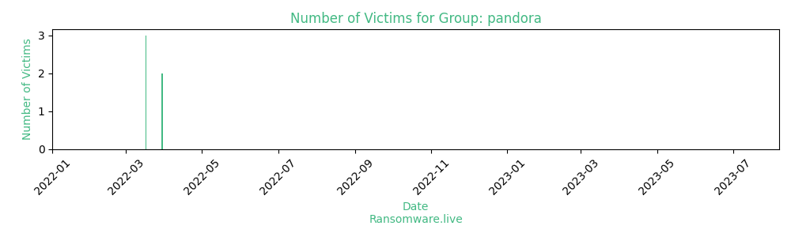

# Profiles for ransomware group : **pandora**

> Pandora ransomware was obtained by vx-underground at 2022-03-14.

### External analysis
- contact@pandoraxyz.xyz

### URLs
| Title | Available | Last visit | fqdn | Screenshot 
|---|---|---|---|---|
| Pandora Data Leak | 🔴 | 03/05/2022 11:24 | `http://vbfqeh5nugm6r2u2qvghsdxm3fotf5wbxb5ltv6vw77vus5frdpuaiid.onion` | ❌ | 
| none | 🔴 | 01/05/2021 00:00 | `http://pandoraxyz.xyz` | ❌ | 

### Total Attacks Over Time

### Posts

> 5 victims found

| post | date | Description | Screenshot | 
|---|---|---|---|
| [`Hearst`](https://google.com/search?q=Hearst) | 30/03/2022 |   |   |
| [`United Cumberland`](https://google.com/search?q=United+Cumberland) | 30/03/2022 |   |   |
| [`Jaffe Raitt Heuer & Weiss, P.C.`](https://google.com/search?q=Jaffe+Raitt+Heuer+%26+Weiss%2C+P.C.) | 17/03/2022 |   |   |
| [`GlobalWafers Japan`](https://google.com/search?q=GlobalWafers+Japan) | 17/03/2022 |   |   |
| [`Rosewd`](https://google.com/search?q=Rosewd) | 17/03/2022 |   |   |

Last update : _Thursday 03/08/2023 07.07 (UTC)_
