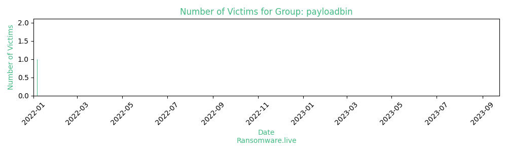

# Profiles for ransomware group : **payloadbin**

> 

### External analysis
- https://www.bleepingcomputer.com/news/security/new-evil-corp-ransomware-mimics-payloadbin-gang-to-evade-us-sanctions/

### URLs
| Title | Available | Last visit | fqdn | Screenshot 
|---|---|---|---|---|
| Payload.bin | 🔴 | 28/08/2022 20:21 | `http://vbmisqjshn4yblehk2vbnil53tlqklxsdaztgphcilto3vdj4geao5qd.onion` | ❌ | 

### Total Attacks Over Time

### Victims

> 29 victims found

| victim | date | Description | Screenshot | 
|---|---|---|---|
| [`aquila.ch`](https://google.com/search?q=aquila.ch) | 06/01/2022 |   |   |
| [`www.paw.eu`](https://google.com/search?q=www.paw.eu) | 01/01/2022 |   |   |
| [`Serenity Homes SWFL`](https://google.com/search?q=Serenity+Homes+SWFL) | 01/01/2022 |   |   |
| [`www.hillsdalefurniture.com`](https://google.com/search?q=www.hillsdalefurniture.com) | 23/12/2021 |   |   |
| [`dawsoncountyne.org`](https://google.com/search?q=dawsoncountyne.org) | 19/10/2021 |   |   |
| [`www.lockslaw.com`](https://google.com/search?q=www.lockslaw.com) | 16/10/2021 |   |   |
| [`calautomotive.com`](https://google.com/search?q=calautomotive.com) | 30/09/2021 |   |   |
| [`calsoft`](https://google.com/search?q=calsoft) | 30/09/2021 |   |   |
| [`calsoft.com`](https://google.com/search?q=calsoft.com) | 30/09/2021 |   |   |
| [`www.myyp.com`](https://google.com/search?q=www.myyp.com) | 25/09/2021 |   |   |
| [`Reconservices.com`](https://google.com/search?q=Reconservices.com) | 09/09/2021 |   |   |
| [`Capstoneins.com`](https://google.com/search?q=Capstoneins.com) | 09/09/2021 |   |   |
| [`neuro-logica.com`](https://google.com/search?q=neuro-logica.com) | 09/09/2021 |   |   |
| [`webstercare.com.au`](https://google.com/search?q=webstercare.com.au) | 09/09/2021 |   |   |
| [`www.crm.com`](https://google.com/search?q=www.crm.com) | 09/09/2021 |   |   |
| [`www.coreslab.com`](https://google.com/search?q=www.coreslab.com) | 09/09/2021 |   |   |
| [`www.emmawillard.org`](https://google.com/search?q=www.emmawillard.org) | 09/09/2021 |   |   |
| [`pdsec.com`](https://google.com/search?q=pdsec.com) | 09/09/2021 |   |   |
| [`conferenceusa.com`](https://google.com/search?q=conferenceusa.com) | 09/09/2021 |   |   |
| [`sklarwilton.com`](https://google.com/search?q=sklarwilton.com) | 09/09/2021 |   |   |
| [`nsuship.co.jp`](https://google.com/search?q=nsuship.co.jp) | 09/09/2021 |   |   |
| [`iRely LLC's Grand Failure`](https://google.com/search?q=iRely+LLC%27s+Grand+Failure) | 09/09/2021 |   |   |
| [`CD Project data`](https://google.com/search?q=CD+Project+data) | 09/09/2021 |   |   |
| [`Victrongroup.com`](https://google.com/search?q=Victrongroup.com) | 09/09/2021 |   |   |
| [`Uptownbakers.com`](https://google.com/search?q=Uptownbakers.com) | 09/09/2021 |   |   |
| [`Truckcentercompanies.com`](https://google.com/search?q=Truckcentercompanies.com) | 09/09/2021 |   |   |
| [`Connelypartners.com`](https://google.com/search?q=Connelypartners.com) | 09/09/2021 |   |   |
| [`Wrgtexas.com`](https://google.com/search?q=Wrgtexas.com) | 09/09/2021 |   |   |
| [`www.webstercare.com.au`](https://google.com/search?q=www.webstercare.com.au) | 09/09/2021 |   |   |

Last update : _Friday 24/11/2023 13.15 (UTC)_
