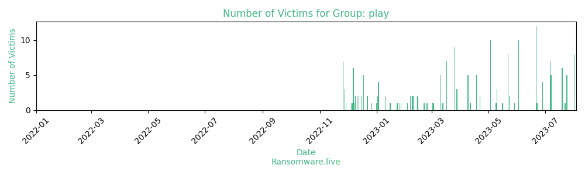

# Profiles for ransomware group : **play**

> Ransomware

### External analysis
- https://socradar.io/dark-web-profile-play-ransomware/

- https://www.trendmicro.com/en_us/research/22/i/play-ransomware-s-attack-playbook-unmasks-it-as-another-hive-aff.html

- https://www.trendmicro.com/vinfo/us/security/news/ransomware-spotlight/ransomware-spotlight-play

🔎 `ransomware.live`has an active  parser for indexing play's victims

### URLs
| Title | Available | Last visit | fqdn | Screenshot 
|---|---|---|---|---|
| PLAY NEWS | 🟢 | 03/08/2023 06:41 | `http://mbrlkbtq5jonaqkurjwmxftytyn2ethqvbxfu4rgjbkkknndqwae6byd.onion` | <a href="https://images.ransomware.live/screenshots/mbrlkbtq5jonaqkurjwmxftytyn2ethqvbxfu4rgjbkkknndqwae6byd-onion.png" target=_blank>📸</a> | 
| PLAY NEWS | 🟢 | 03/08/2023 06:42 | `http://k7kg3jqxang3wh7hnmaiokchk7qoebupfgoik6rha6mjpzwupwtj25yd.onion` | <a href="https://images.ransomware.live/screenshots/k7kg3jqxang3wh7hnmaiokchk7qoebupfgoik6rha6mjpzwupwtj25yd-onion.png" target=_blank>📸</a> | 

### Ransom note
* [📝 2 ransom notes](notes/play)

### Total Attacks Over Time

### Posts

> 187 victims found

| post | date | Description | Screenshot | 
|---|---|---|---|
| [`Garage Living, The Dispenser USA`](https://www.garageliving.com,%20www.dispenser.com) | 01/08/2023 | Ontario, Canada | <a href="https://images.ransomware.live/screenshots/posts/6474c7c7970ee472d14a9e003a4933e0.png" target=_blank>📸</a> |
| [`Aapd`](https://www.aapd.com.au) | 01/08/2023 | Australia | <a href="https://images.ransomware.live/screenshots/posts/d24e6dce624d544d2158c4c56412f114.png" target=_blank>📸</a> |
| [`Birch, Horton, Bittner & Cherot`](https://www.birchhorton.com) | 01/08/2023 | Alaska, United States | <a href="https://images.ransomware.live/screenshots/posts/a2b6a431546a233eb75b20fb86b25587.png" target=_blank>📸</a> |
| [`DAL-TECH Engineering`](https://www.dal-tech.com) | 01/08/2023 | Texas, United States | <a href="https://images.ransomware.live/screenshots/posts/0be523d48cb97accd2a8150fc8934a25.png" target=_blank>📸</a> |
| [`Coral Resort`](https://www.coralresort.com) | 01/08/2023 | Florida, United States | <a href="https://images.ransomware.live/screenshots/posts/e70f9f0e611e5f1984daad0de002c12a.png" target=_blank>📸</a> |
| [`Professionnel France`](https://www.evs-pro.com) | 01/08/2023 | France | <a href="https://images.ransomware.live/screenshots/posts/170ec9831c7dcac22cefd32e1da08eee.png" target=_blank>📸</a> |
| [`ACTIVA Group`](https://www.group-activa.com) | 01/08/2023 | Cameroon | <a href="https://images.ransomware.live/screenshots/posts/642f726e500fd630dda63fdb67e931d3.png" target=_blank>📸</a> |
| [`Aquatlantis`](https://www.aquatlantis.com) | 01/08/2023 | Portugal | <a href="https://images.ransomware.live/screenshots/posts/0afc77cadeb75665a9689d94a6bd3a52.png" target=_blank>📸</a> |
| [`John Mulder Heating & Air Conditioning`](https://www.johnmulderheating.ca) | 24/07/2023 | British Columbia, Canada | <a href="https://images.ransomware.live/screenshots/posts/7332309fe82e0e4c3dfc9319b7057723.png" target=_blank>📸</a> |
| [`Scharco Elektronik`](https://www.scharco.eu) | 24/07/2023 | Nordrhein-Westfalen, Germany | <a href="https://images.ransomware.live/screenshots/posts/ac2d8cbbc9d7ec2f7b9ce1ff8d6389a6.png" target=_blank>📸</a> |
| [`Primoteq`](https://www.primoteq.com) | 24/07/2023 | Overijssel, Netherlands | <a href="https://images.ransomware.live/screenshots/posts/82637114ba4444990fd86b9c46211e92.png" target=_blank>📸</a> |
| [`Grupo MH`](https://www.grupmh.com) | 24/07/2023 | Barcelona, Spain | <a href="https://images.ransomware.live/screenshots/posts/1c4361591c2b754234c327b59ce87e3e.png" target=_blank>📸</a> |
| [`FERRE BARNIEDO`](https://www.ferrebarniedo.com.mx) | 24/07/2023 | Mexico City, Mexico | <a href="https://images.ransomware.live/screenshots/posts/1108958e56dcd2242f2b76a8da454f5b.png" target=_blank>📸</a> |
| [`Samson Electric`](https://www.sei-ak.com) | 22/07/2023 | Anchorage, Alaska, US | <a href="https://images.ransomware.live/screenshots/posts/189cc8ae97a980ed1892a018f64d9cd8.png" target=_blank>📸</a> |
| [`Kensington Publishing`](https://www.kensingtonbooks.com) | 19/07/2023 | New York, United States | <a href="https://images.ransomware.live/screenshots/posts/1ddf3a973c7f89dd044815ce0ab8efc2.png" target=_blank>📸</a> |
| [`Fernmoor Homes`](https://www.fernmoorhomes.com) | 19/07/2023 | New Jersey, United States | <a href="https://images.ransomware.live/screenshots/posts/ba24d312acdcb205d74fc5b4c62d3cc0.png" target=_blank>📸</a> |
| [`ECS Technology Group`](https://www.ecstechgroup.com) | 19/07/2023 | Texas, United States | <a href="https://images.ransomware.live/screenshots/posts/b2b8a09ed82e514fec144b9d10f48568.png" target=_blank>📸</a> |
| [`Woodbine Hospitality`](https://www.woodbinehospitality.com) | 19/07/2023 | New York, United States | <a href="https://images.ransomware.live/screenshots/posts/2973be6c457581eb74332cc861b0422c.png" target=_blank>📸</a> |
| [`Sea Force IX`](https://www.seaforceboats.com) | 19/07/2023 | Florida, United States | <a href="https://images.ransomware.live/screenshots/posts/e709e7ce07b68ecdaf42574fbdfa1ccd.png" target=_blank>📸</a> |
| [`Centennial Management`](https://www.centennialinvestments.com) | 19/07/2023 | Florida, United States | <a href="https://images.ransomware.live/screenshots/posts/5b02c27348f1eed7d428397e7c2ba1f2.png" target=_blank>📸</a> |
| [`Lane Valente Industries`](https://www.canadalvi.com) | 07/07/2023 | Ontario, Canada | <a href="https://images.ransomware.live/screenshots/posts/7d214c52a955cafcf31afa1330615fa5.png" target=_blank>📸</a> |
| [`Lazer Tow`](https://www.lazertow.com) | 07/07/2023 | Missouri, United States | <a href="https://images.ransomware.live/screenshots/posts/c47eef27b877121cd9a1bdeade82fd51.png" target=_blank>📸</a> |
| [`Star Island Resort`](https://www.star-island.com) | 07/07/2023 | Florida, United States | <a href="https://images.ransomware.live/screenshots/posts/a4789357335d02bf354c3d4879d48269.png" target=_blank>📸</a> |
| [`Indiana Dimension`](https://www.indianadimension.com) | 07/07/2023 | Indiana, United States | <a href="https://images.ransomware.live/screenshots/posts/d8a455140303b7a1fa4e272b99d5d4d4.png" target=_blank>📸</a> |
| [`Lawer SpA`](https://www.lawer.com) | 07/07/2023 | Piedmont, Italy | <a href="https://images.ransomware.live/screenshots/posts/c47eef27b877121cd9a1bdeade82fd51.png" target=_blank>📸</a> |
| [`NST Attorneys at Law`](https://www.nstlaw.com) | 06/07/2023 | Tennessee, United States | <a href="https://images.ransomware.live/screenshots/posts/a5f0d33d42948fc04ae7c4aab37f18c3.png" target=_blank>📸</a> |
| [`Uniquify`](https://www.uniquify.com) | 06/07/2023 | California, United States | <a href="https://images.ransomware.live/screenshots/posts/4ed01463f681e16368cf178004ec5176.png" target=_blank>📸</a> |
| [`Geneva Software`](https://www.genevasi.com) | 06/07/2023 | Virginia, United States | <a href="https://images.ransomware.live/screenshots/posts/6c7c5748fd46eb79ad3dac352c774dc9.png" target=_blank>📸</a> |
| [`MUJI Europe Holdings Limited`](https://www.muji.eu) | 06/07/2023 | London, England | <a href="https://images.ransomware.live/screenshots/posts/93e184f87e0b2586eec3472f39c4c6ea.png" target=_blank>📸</a> |
| [`Betty Lou's`](https://www.bettylousinc.com) | 06/07/2023 | Oregon, United States | <a href="https://images.ransomware.live/screenshots/posts/f9623d987c2d504126dfb017b30de55d.png" target=_blank>📸</a> |
| [`Capacity LLC`](https://www.capacityllc.com) | 06/07/2023 | New Jersey, United States | <a href="https://images.ransomware.live/screenshots/posts/5a2577d36f43f82e4bf10f61cee8493e.png" target=_blank>📸</a> |
| [`Safety Network`](https://www.safetynetworkinc.com) | 06/07/2023 | California, United States | <a href="https://images.ransomware.live/screenshots/posts/43d012928c8eff414cd96500cc520c05.png" target=_blank>📸</a> |
| [`Texas Heat Treating`](https://www.texasheattreating.com) | 28/06/2023 | Texas, United States |   |
| [`Intoximeters`](https://www.intox.com) | 28/06/2023 | Missouri, United States |   |
| [`Algotech`](https://www.algotech.cz) | 28/06/2023 | Praha, Czech Republic |   |
| [`Cambridge Group of Clubs`](https://www.cambridgegroupofclubs.com) | 28/06/2023 | Ontario, Canada |   |
| [`Hill International`](https://www.hillintl.com) | 22/06/2023 | Pennsylvania, USA |   |
| [`Peter Mark`](https://www.petermark.ie) | 21/06/2023 | Leinster, Ireland |   |
| [`Dancie Perugini Ware Public Relations`](https://www.dpwpr.com) | 21/06/2023 | Texas, United States |   |
| [`Summit Hut`](https://www.summithut.com) | 21/06/2023 | Arizona, United States |   |
| [`OMNIPOL`](https://www.omnipol.com) | 21/06/2023 | Czech Republic |   |
| [`Hi-tec, Batra Group`](https://www.hi-tec.co.uk,%20www.batragroup.com) | 21/06/2023 | United Kingdom |   |
| [`Barentz North America`](https://www.barentz-na.com) | 21/06/2023 | Ohio, United States |   |
| [`PWI Engineering`](https://www.pwius.com) | 21/06/2023 | New Jersey, United States |   |
| [`Federation Francaise de Rugby`](https://www.ffr.fr) | 21/06/2023 | France |   |
| [`Luís Simoes`](https://www.luis-simoes.com) | 21/06/2023 | Portugal |   |
| [`Allpro Consulting Group`](https://www.allprocgi.com) | 21/06/2023 | Texas, United States |   |
| [`Lorclon`](https://www.lorclon.com) | 21/06/2023 | United Kingdom |   |
| [`wolfs block management limited`](https://www.wolfsproperty.co.uk) | 21/06/2023 | United Kingdom |   |
| [`Globalcaja`](https://www.globalcaja.es) | 02/06/2023 | Spain | <a href="https://images.ransomware.live/screenshots/posts/06188552c6ffab0029cbdc1d56783d73.png" target=_blank>📸</a> |
| [`Fortress Paper`](https://www.fortressge.com) | 02/06/2023 | Canada | <a href="https://images.ransomware.live/screenshots/posts/8999c522abb613de61940cf82633cd91.png" target=_blank>📸</a> |
| [`Unico Data,INSYS Industriesysteme,PathA Suisse,PB Swiss Tools,Boess Gruppe`](https://unico.ch%20insys.ch%20pathe.ch%20pbswisstools.com%20boess.ch) | 02/06/2023 | Switzerland | <a href="https://images.ransomware.live/screenshots/posts/2efa6753623d2ee23397005ff522d7a0.png" target=_blank>📸</a> |
| [`Alberta Newsprint`](https://www.albertanewsprint.com) | 02/06/2023 | Canada | <a href="https://images.ransomware.live/screenshots/posts/63b345f257d8675d47ca1af9de7c251a.png" target=_blank>📸</a> |
| [`CS Cargo Group`](https://www.cscargo.cz) | 02/06/2023 | Czech Republic | <a href="https://images.ransomware.live/screenshots/posts/1bedddc52ab07f0563039ad84b0ae94d.png" target=_blank>📸</a> |
| [`BMD Systemhaus`](https://www.bmd.com) | 02/06/2023 | Austria | <a href="https://images.ransomware.live/screenshots/posts/a71d31a202cc60c1d9c2dc40055754f2.png" target=_blank>📸</a> |
| [`Buffalo Niagara Association`](https://www.bnar.org) | 02/06/2023 | United States | <a href="https://images.ransomware.live/screenshots/posts/82252217134028be4a8323558c35ee69.png" target=_blank>📸</a> |
| [`Abeko`](https://www.abeko.nl) | 02/06/2023 | Netherlands | <a href="https://images.ransomware.live/screenshots/posts/e14234ed746d20f1599f7924bed0e863.png" target=_blank>📸</a> |
| [`NORANET - CZ`](https://www.noranet.cz) | 02/06/2023 | Czech Republic | <a href="https://images.ransomware.live/screenshots/posts/4e38426d7b734ba19ca595ccad6280bb.png" target=_blank>📸</a> |
| [`Shows & Artists`](https://www.shows-artists.com) | 02/06/2023 | Germany | <a href="https://images.ransomware.live/screenshots/posts/d4c12d6eb3990de2cebe7f67aae52dd1.png" target=_blank>📸</a> |
| [`Soroc`](https://www.soroc.com) | 29/05/2023 | Canada | <a href="https://images.ransomware.live/screenshots/posts/e65297208caa1b0a0d80ce7b8b189992.png" target=_blank>📸</a> |
| [`Black Cat Networks`](https://www.blackcat-networks.de) | 23/05/2023 | Germany | <a href="https://images.ransomware.live/screenshots/posts/bddf65b5dc9fc814bec9fb2afa1ac09c.png" target=_blank>📸</a> |
| [`Paragon Software Lanka`](https://www.paragonsoft.net) | 23/05/2023 | Sri Lanka | <a href="https://images.ransomware.live/screenshots/posts/a63a985b02b851dec1c7a54752da5b7d.png" target=_blank>📸</a> |
| [`Royal Centre`](https://www.royalcentre.com) | 22/05/2023 | Canada | <a href="https://images.ransomware.live/screenshots/posts/3158904c34b5ce48c734f22de3d8be6a.png" target=_blank>📸</a> |
| [`Poly`](https://www.poly.com) | 22/05/2023 | California, United States | <a href="https://images.ransomware.live/screenshots/posts/72e167726bc28c3e2993ddc355bb0cce.png" target=_blank>📸</a> |
| [`Mayberry Investments`](https://www.mayberryinv.com) | 22/05/2023 | Jamaica | <a href="https://images.ransomware.live/screenshots/posts/ec1bb790491c98ca388a1f8572578954.png" target=_blank>📸</a> |
| [`Grupo Corporacion Control`](https://www.ccontrol.com.mx) | 22/05/2023 | Mexico | <a href="https://images.ransomware.live/screenshots/posts/ae613680c1be21283a5076b6a719a9f3.png" target=_blank>📸</a> |
| [`Studioline Photography`](https://www.studioline.de) | 22/05/2023 | Germany | <a href="https://images.ransomware.live/screenshots/posts/0f34a275bf2d5ed498ec63e8edb06856.png" target=_blank>📸</a> |
| [`Optimus Steel`](https://www.optimus-steelusa.com) | 22/05/2023 | United States | <a href="https://images.ransomware.live/screenshots/posts/ea6ff212d8158c3bdb8281ede86509cc.png" target=_blank>📸</a> |
| [`Xplain`](https://www.xplain.ch) | 22/05/2023 | Switzerland | <a href="https://images.ransomware.live/screenshots/posts/29cdb23937e60183a2e681954b0f7c45.png" target=_blank>📸</a> |
| [`Aria Online`](https://www.ariaonline.com) | 22/05/2023 | Louisiana, United States | <a href="https://images.ransomware.live/screenshots/posts/dae5b1baa4b390e8482752b41f318ed1.png" target=_blank>📸</a> |
| [`SOWITEC`](https://www.sowitec.com) | 16/05/2023 | Germany | <a href="https://images.ransomware.live/screenshots/posts/98b3972aa44268b53c8770995961e8fd.png" target=_blank>📸</a> |
| [`Sauerbruch Hutton`](https://www.sauerbruchhutton.de) | 10/05/2023 | Berlin, Germany | <a href="https://images.ransomware.live/screenshots/posts/95320ae694a3008a4a3bfa44e02ce090.png" target=_blank>📸</a> |
| [`JP Maguire & Associates`](https://www.jpmaguire.com) | 10/05/2023 | Connecticut, United States | <a href="https://images.ransomware.live/screenshots/posts/330c324b7ada7a918baf174d00b71703.png" target=_blank>📸</a> |
| [`Germany`](https://www.gtai.de) | 10/05/2023 | Berlin, Germany | <a href="https://images.ransomware.live/screenshots/posts/a385de37bedd46e246a79c235344e181.png" target=_blank>📸</a> |
| [`KLC Network Services`](https://www.klcnetworks.com) | 09/05/2023 | Virginia, United States |   |
| [`SIVSA`](https://www.sivsa.com) | 03/05/2023 | Spaini - SIVSA Soluciones Informáticas is a consolidated company dedicated to the provision of services in the area of Information Technology, which with more than 25 years of experience in consulting and development, develops its business activity in Spain. | <a href="https://images.ransomware.live/screenshots/posts/96e999da6a72f5965d4fedfbc1ef34ef.png" target=_blank>📸</a> |
| [`Coremain`](https://www.coremain.com) | 03/05/2023 | Spaini - Coremain is a company that operates in the Financial Services industry. | <a href="https://images.ransomware.live/screenshots/posts/96e999da6a72f5965d4fedfbc1ef34ef.png" target=_blank>📸</a> |
| [`Nova Group`](https://www.novagroup.com.au) | 03/05/2023 | Australia - Nova Group is a leading engineering services and technology solutions partner. Our vision is to solve the complex challenges that really matter to our clients. Nova's businesses include professional services provider Nova Systems, aerospace engineering firm | <a href="https://images.ransomware.live/screenshots/posts/cc167f523b24717419b86d3a38b8089c.png" target=_blank>📸</a> |
| [`City of Lowell`](https://www.lowellma.gov) | 03/05/2023 | Lowell, Massachusetts, United States | <a href="https://images.ransomware.live/screenshots/posts/8f98768a7ab997d1296fcbe564cec1ce.png" target=_blank>📸</a> |
| [`DGC`](https://www.dgc.se) | 03/05/2023 | information: DGC´s business concept is to develop and deliver customized IT services to customers who demand high security, availability and innovation. We deliver our services, from our own infrastructure as well as public clouds, with the highest service levels and a personal commitment to our customers.Our vision is to be recognized as the best supplier of customized IT services to customers who demand high security, availability and innovation. | <a href="https://images.ransomware.live/screenshots/posts/0ae336d457108e5307d12d9933859a27.png" target=_blank>📸</a> |
| [`Libra Virtua`](https://www.libravirtua.hu) | 03/05/2023 | information: LIBRA VIRTUA provides the necessary LIBRA modules, the database manager, server capacity, backup and archiving, and all other related services. The compilation of the LIBRA modules and the service package depends on the needs of the user, who pays a usage-based monthly fee for the parameterized system. | <a href="https://images.ransomware.live/screenshots/posts/fc3886a58eded0864683be9beded032e.png" target=_blank>📸</a> |
| [`Commune de Saxon`](https://www.saxon.ch) | 03/05/2023 | Saxon, Switzerlandi ;  Commune de Saxon is a company that operates in the Government industry. | <a href="https://images.ransomware.live/screenshots/posts/d1a5963627100abedf6d75a3958660c5.png" target=_blank>📸</a> |
| [`Negma Business Solutions`](https://www.negma.net) | 03/05/2023 | Texas, United Statesi - Founded in 1996, Negma Business Solutions, Inc. has been leading the way, providing businesses with expertly designed, secured, and dedicated infrastructures to house company networking and cloud equipment in a state-of-the-art, secured, multi-carrier facility. | <a href="https://images.ransomware.live/screenshots/posts/13960dbbf5e7bf2e8fec38b004959c0a.png" target=_blank>📸</a> |
| [`Vocalcom`](https://www.vocalcom.com) | 03/05/2023 | Francei - Vocalcom is a global provider of cloud technology which helps businesses win more customers, deliver faster, smarter service, and thrive. Loved by 550,000+ users for its innovative design and useful functionality, Vocalcom powers 3,600+ companies worldwide | <a href="https://images.ransomware.live/screenshots/posts/b4f6fa3debd1775a9b2703705cdd153f.png" target=_blank>📸</a> |
| [`Woonkracht10`](https://www.woonkracht10.nl) | 03/05/2023 | Netherlandsi - Woonkracht10 is a housing corporation in the Drechtsteden region and manages more than 11,500 homes, shops and business premises. | <a href="https://images.ransomware.live/screenshots/posts/e580990bcde4167d016f8e3ca9c11a88.png" target=_blank>📸</a> |
| [`Groupe Gambetta`](https://www.groupegambetta.fr) | 22/04/2023 | France | <a href="https://images.ransomware.live/screenshots/posts/44a34313578e440cd5698d44df34695c.png" target=_blank>📸</a> |
| [`UECC`](https://www.uecc.com) | 22/04/2023 | Norway | <a href="https://images.ransomware.live/screenshots/posts/e70d237a3ebc90193fe05b6a9fe43812.png" target=_blank>📸</a> |
| [`Bang IT Solutions`](https://www.bangitsolutions.com) | 18/04/2023 | Australia |   |
| [`Huissiers`](https://www.huissiers-cambron.com) | 18/04/2023 | France | <a href="https://images.ransomware.live/screenshots/posts/9bc7ff91a094514f1bb868a6216b2022.png" target=_blank>📸</a> |
| [`Coldiretti`](https://www.coldiretti.it) | 18/04/2023 | Italy |   |
| [`Corrib Oil`](https://www.corriboil.com) | 18/04/2023 | Ireland |   |
| [`Structab AB (MegTax)`](https://structab.se) | 18/04/2023 | Sweden |   |
| [`CH Media`](https://chmedia.ch) | 12/04/2023 | Switzerland |   |
| [`PESA Bydgoszcz`](https://www.pesa.pl) | 11/04/2023 | Poland |   |
| [`Palo Alto County Sheriff`](https://www.paloaltosheriff.com) | 09/04/2023 | Iowa, United States | <a href="https://images.ransomware.live/screenshots/posts/e13e7d31496ca2aa0d928c11e7f0f9d3.png" target=_blank>📸</a> |
| [`PKF Antares`](https://www.pkfantares.com) | 09/04/2023 | Canada | <a href="https://images.ransomware.live/screenshots/posts/c802c4dfbfd86560903215c012e2910c.png" target=_blank>📸</a> |
| [`Legion Aero`](https://www.legionaero.com) | 09/04/2023 | United States | <a href="https://images.ransomware.live/screenshots/posts/ef9c774d51825d888d5b94a03acf44a9.png" target=_blank>📸</a> |
| [`Vleeswarenfabriek Jac Michiels`](https://www.michiels-vleeswaren.be) | 09/04/2023 | Belgium | <a href="https://images.ransomware.live/screenshots/posts/1ddc08ec794e3f693f1114f9de4eec37.png" target=_blank>📸</a> |
| [`Schirm`](https://www.schirm.com) | 09/04/2023 | Germany | <a href="https://images.ransomware.live/screenshots/posts/353f8eb52932f5b2340844e5691ff3e3.png" target=_blank>📸</a> |
| [`BMW France`](https://www.bmw.fr) | 28/03/2023 | France | <a href="https://images.ransomware.live/screenshots/posts/e5881171f64fb1003dc00f5216b782d0.png" target=_blank>📸</a> |
| [`Oscar Software`](https://www.oscar.fi) | 28/03/2023 | Finland | <a href="https://images.ransomware.live/screenshots/posts/e070701304acd36d158b7fc7117d6d7e.png" target=_blank>📸</a> |
| [`Jablite`](https://www.jablite.co.uk) | 28/03/2023 | United Kingdom | <a href="https://images.ransomware.live/screenshots/posts/c77c051b1f463110c2e2ffe5ebfc6216.png" target=_blank>📸</a> |
| [`Lightcast`](https://www.lightcast.io) | 26/03/2023 | USA | <a href="https://images.ransomware.live/screenshots/posts/117b1e2045c51b2eb40561508e4dbf48.png" target=_blank>📸</a> |
| [`Optica`](https://www.optica.org) | 26/03/2023 | District of Columbia, United States | <a href="https://images.ransomware.live/screenshots/posts/f73e74963a97e22fa9def7c297b1ff42.png" target=_blank>📸</a> |
| [`James, McElroy and Diehl`](https://www.jmdlaw.com) | 26/03/2023 | North Carolina, United States |   |
| [`Lysander Associates`](https://www.lysander.com) | 26/03/2023 | London, United Kingdom | <a href="https://images.ransomware.live/screenshots/posts/4631d1e23b099d2ff1b425fc711baefc.png" target=_blank>📸</a> |
| [`TAC`](https://tac.eu.com) | 26/03/2023 | Styria, Austria | <a href="https://images.ransomware.live/screenshots/posts/567ad2fb3e0376a7642874ca913ae198.png" target=_blank>📸</a> |
| [`Guyana Goldfields`](https://www.guygold.com) | 26/03/2023 | Ontario, Canada | <a href="https://images.ransomware.live/screenshots/posts/77831b5f5c5c83cc632e34917fb2ff64.png" target=_blank>📸</a> |
| [`Picou Builders Supply`](https://www.picoulumber.com) | 26/03/2023 | Louisiana, United States | <a href="https://images.ransomware.live/screenshots/posts/47995e06c2d9027cbb260a75fe7ea501.png" target=_blank>📸</a> |
| [`Kk Mehta Cpa Associates`](https://www.kkmehtacpa.com) | 26/03/2023 | New York, United States | <a href="https://images.ransomware.live/screenshots/posts/c1d7efb0220ac42f0807ffd2ac105128.png" target=_blank>📸</a> |
| [`Pizza 73`](https://www.pizza73.com) | 26/03/2023 | Alberta, Canada | <a href="https://images.ransomware.live/screenshots/posts/d12fb55e4fd3a2047dfd206c810cbd6b.png" target=_blank>📸</a> |
| [`Stanley Steemer`](https://www.stanleysteemer.com) | 17/03/2023 | Ohio, United States | <a href="https://images.ransomware.live/screenshots/posts/f4224da29434611fde7e1ed61cf7656e.png" target=_blank>📸</a> |
| [`A&T group of companies`](https://www.atglobalsolutions.eu) | 17/03/2023 | Poland | <a href="https://images.ransomware.live/screenshots/posts/db3eadbca73040ab721c3257ff7b03b4.png" target=_blank>📸</a> |
| [`Berga Recycling`](https://www.bergarecycling.com) | 17/03/2023 | Quebec, Canada | <a href="https://images.ransomware.live/screenshots/posts/62f2399d69a6959dea21734452686b00.png" target=_blank>📸</a> |
| [`Pine Tree Commercial Realty`](https://www.pinetree.com) | 17/03/2023 | Illinois, United States | <a href="https://images.ransomware.live/screenshots/posts/348bac478b74e9b3b63b2723044ff784.png" target=_blank>📸</a> |
| [`Norman Shutters`](https://www.normanusa.com) | 17/03/2023 | Texas, United States | <a href="https://images.ransomware.live/screenshots/posts/89b10702cfca3bab364528aac40909d9.png" target=_blank>📸</a> |
| [`TaxAssist Accountants`](https://www.taxassist.co.uk) | 17/03/2023 | Norfolk, United Kingdom | <a href="https://images.ransomware.live/screenshots/posts/435943f4cc087ddcaac2b5697be3301d.png" target=_blank>📸</a> |
| [`draftPros`](https://www.draftpros.com) | 17/03/2023 | Florida, United States | <a href="https://images.ransomware.live/screenshots/posts/faec923a8658c07e7fe48aa347a13f88.png" target=_blank>📸</a> |
| [`Royal Dirkzwager`](https://www.dirkzwager.com) | 13/03/2023 | Netherlands | <a href="https://images.ransomware.live/screenshots/posts/852c908f9b8557bd67b2042268c7ab30.png" target=_blank>📸</a> |
| [`Real Pro`](https://www.realpro.com) | 11/03/2023 | United States | <a href="https://images.ransomware.live/screenshots/posts/e33dc622d3383d0b60ef3fcb2120f441.png" target=_blank>📸</a> |
| [`Leemock`](https://www.leemock.com) | 11/03/2023 | United States | <a href="https://images.ransomware.live/screenshots/posts/e2b7c0d521a9817de9b1c0bb4ec34a1e.png" target=_blank>📸</a> |
| [`The M. K. Morse`](https://www.mkmorse.com) | 11/03/2023 | United States | <a href="https://images.ransomware.live/screenshots/posts/c9a37bde0375d116bd4637fad081ca56.png" target=_blank>📸</a> |
| [`Secure Wrap`](https://www.securewrap.com) | 11/03/2023 | United States | <a href="https://images.ransomware.live/screenshots/posts/b148dc217df5737ee02dc8bd4ab993a7.png" target=_blank>📸</a> |
| [`Russell Finex`](https://www.russellfinex.com) | 11/03/2023 | United Kingdom | <a href="https://images.ransomware.live/screenshots/posts/285ee92aef310831a869b29063d731ba.png" target=_blank>📸</a> |
| [`Oakland`](https://www.oaklandca.gov) | 03/03/2023 | United States |   |
| [`O???a??`](https://www.o???a????.???) | 02/03/2023 | USA |   |
| [`InPro electric`](https://www.inpro-electric.de) | 24/02/2023 | Germany |   |
| [`I???o e???t???`](https://www.i?????e???t???.de) | 21/02/2023 | Germany |   |
| [`Microgame SpA`](https://www.microgame.it) | 14/02/2023 | Italy |   |
| [`Energie Pool Schweiz`](https://www.energie-pool.ch) | 14/02/2023 | Zurich, Switzerland |   |
| [`M???????? S??`](https://google.com/search?q=M%3F%3F%3F%3F%3F%3F%3F%3F+S%3F%3F) | 09/02/2023 |  |   |
| [`A10`](https://google.com/search?q=A10) | 09/02/2023 |  |   |
| [`Cave Beblenheim`](https://google.com/search?q=Cave+Beblenheim) | 08/02/2023 |  |   |
| [`ACS`](https://google.com/search?q=ACS) | 08/02/2023 |  |   |
| [`L?? C??e`](https://google.com/search?q=L%3F%3F+C%3F%3Fe) | 06/02/2023 |  |   |
| [`?C?`](https://google.com/search?q=%3FC%3F) | 06/02/2023 |  |   |
| [`Point Dedicated Services`](https://google.com/search?q=Point+Dedicated+Services) | 03/02/2023 |  |   |
| [`Helicar`](https://google.com/search?q=Helicar) | 27/01/2023 |  |   |
| [`ADMIRAL Sportwetten`](https://google.com/search?q=ADMIRAL+Sportwetten) | 26/01/2023 |  |   |
| [`A?????L S?????????? ????`](https://google.com/search?q=A%3F%3F%3F%3F%3FL+S%3F%3F%3F%3F%3F%3F%3F%3F%3F%3F+%3F%3F%3F%3F) | 23/01/2023 | Austria |   |
| [`Arnold Clark`](https://google.com/search?q=Arnold+Clark) | 16/01/2023 |  |   |
| [`DAYTON PROGRESS`](https://google.com/search?q=DAYTON+PROGRESS) | 15/01/2023 |  |   |
| [`D???? P??????s`](https://www.d?????p??????s.de) | 11/01/2023 | United Kingdom |   |
| [`A????? ????k`](https://www.a?????????k.com) | 11/01/2023 | United Kingdom |   |
| [`Tarntank Ship Management`](https://google.com/search?q=Tarntank+Ship+Management) | 03/01/2023 |  |   |
| [`Sirius Shipping`](https://google.com/search?q=Sirius+Shipping) | 03/01/2023 |  |   |
| [`SUNY Polytechnic Institute`](https://google.com/search?q=SUNY+Polytechnic+Institute) | 03/01/2023 |  |   |
| [`Furetank`](https://www.furetank.se) | 03/01/2023 | Donso, Vaestra Goetaland, Sweden |   |
| [`Stratacache`](https://www.stratacache.com) | 02/01/2023 | Dayton, Ohio, United States |   |
| [`S???`](https://google.com/search?q=S%3F%3F%3F) | 02/01/2023 | Utica, New-York |   |
| [`CDER`](https://www.cder.fr) | 01/01/2023 | Fere-Champenoise, France |   |
| [`FURETANK,SIRIUS SHIPPING,VAS,DONSONET`](https://google.com/search?q=FURETANK%2CSIRIUS+SHIPPING%2CVAS%2CDONSONET) | 27/12/2022 | Sweden,EU |   |
| [`Cervecería Regional`](https://google.com/search?q=Cervecer%C3%ADa+Regional) | 22/12/2022 | Maracaibo, Zulia, Venezuela |   |
| [`F???????, ???, D????????, T???????, S?????????????`](https://google.com/search?q=F%3F%3F%3F%3F%3F%3F%3F%2C+%3F%3F%3F%2C+D%3F%3F%3F%3F%3F%3F%3F%3F%2C+T%3F%3F%3F%3F%3F%3F%3F%2C+S%3F%3F%3F%3F%3F%3F%3F%3F%3F%3F%3F%3F%3F) | 22/12/2022 |  |   |
| [`OPUS IT Services`](https://google.com/search?q=OPUS+IT+Services) | 18/12/2022 |   |   |
| [`H-Hotels`](https://google.com/search?q=H-Hotels) | 18/12/2022 |   |   |
| [`C???e????? ?????????????`](https://google.com/search?q=C%3F%3F%3Fe%3F%3F%3F%3F%3F+%3F%3F%3F%3F%3F%3F%3F%3F%3F%3F%3F%3F%3F) | 18/12/2022 |   |   |
| [`Creta Farm`](https://google.com/search?q=Creta+Farm) | 18/12/2022 | Athens, Greece |   |
| [`S??????????`](https://google.com/search?q=S%3F%3F%3F%3F%3F%3F%3F%3F%3F%3F) | 18/12/2022 |   |   |
| [`Arsat`](https://google.com/search?q=Arsat) | 16/12/2022 |   |   |
| [`JMicron`](https://google.com/search?q=JMicron) | 16/12/2022 |   |   |
| [`VFS`](https://google.com/search?q=VFS) | 13/12/2022 |   |   |
| [`Cetrogar`](https://google.com/search?q=Cetrogar) | 13/12/2022 |   |   |
| [`Una Seguros`](https://google.com/search?q=Una+Seguros) | 11/12/2022 |   |   |
| [`Antwerpen`](https://google.com/search?q=Antwerpen) | 11/12/2022 |   |   |
| [`???????`](https://google.com/search?q=%3F%3F%3F%3F%3F%3F%3F) | 09/12/2022 |   |   |
| [`Hilldrup`](https://google.com/search?q=Hilldrup) | 09/12/2022 |   |   |
| [`????`](https://google.com/search?q=%3F%3F%3F%3F) | 08/12/2022 |   |   |
| [`Skoda Praha`](https://google.com/search?q=Skoda+Praha) | 07/12/2022 |   |   |
| [`MME Group`](https://google.com/search?q=MME+Group) | 07/12/2022 |   |   |
| [`Highwater Ethanol`](https://google.com/search?q=Highwater+Ethanol) | 07/12/2022 |   |   |
| [`Wrota Mazowsza`](https://google.com/search?q=Wrota+Mazowsza) | 07/12/2022 |   |   |
| [`UJV Rez`](https://google.com/search?q=UJV+Rez) | 07/12/2022 |   |   |
| [`????????? ???? ?????`](https://google.com/search?q=%3F%3F%3F%3F%3F%3F%3F%3F%3F+%3F%3F%3F%3F+%3F%3F%3F%3F%3F) | 07/12/2022 |   |   |
| [`CIBTvisas`](https://google.com/search?q=CIBTvisas) | 06/12/2022 |   |   |
| [`Austria Presse Agentur`](https://google.com/search?q=Austria+Presse+Agentur) | 05/12/2022 |   |   |
| [`???`](https://google.com/search?q=%3F%3F%3F) | 29/11/2022 |   |   |
| [`Verity cloud`](https://google.com/search?q=Verity+cloud) | 28/11/2022 |   |   |
| [`???????????`](https://google.com/search?q=%3F%3F%3F%3F%3F%3F%3F%3F%3F%3F%3F) | 28/11/2022 |   |   |
| [`???? ?????`](https://google.com/search?q=%3F%3F%3F%3F+%3F%3F%3F%3F%3F) | 28/11/2022 |   |   |
| [`PVFCCo`](https://google.com/search?q=PVFCCo) | 26/11/2022 |   |   |
| [`Leadtek`](https://google.com/search?q=Leadtek) | 26/11/2022 |   |   |
| [`Alcomet`](https://google.com/search?q=Alcomet) | 26/11/2022 |   |   |
| [`Ministry of Transport and Public Works`](https://google.com/search?q=Ministry+of+Transport+and+Public+Works) | 26/11/2022 |   |   |
| [`Itsgroup`](https://google.com/search?q=Itsgroup) | 26/11/2022 |   |   |
| [`Conseil departemental - Alpes-Maritimes`](https://google.com/search?q=Conseil+departemental+-+Alpes-Maritimes) | 26/11/2022 |   |   |
| [`Origin Property Company Limited`](https://google.com/search?q=Origin+Property+Company+Limited) | 26/11/2022 |   |   |

Last update : _Thursday 03/08/2023 07.07 (UTC)_
