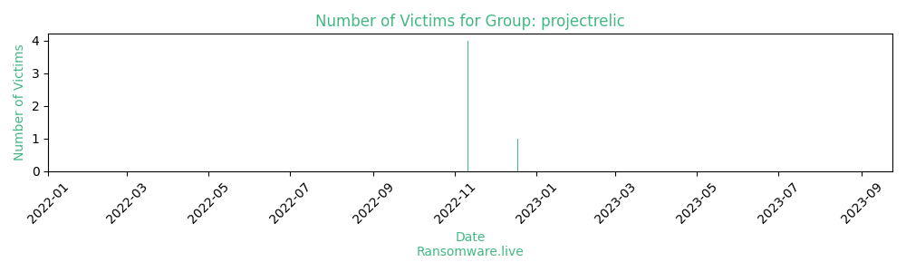

# Profiles for ransomware group : **projectrelic**

🔎 `ransomware.live`has an active  parser for indexing projectrelic's victims

### URLs
| Title | Available | Last visit | fqdn | Screenshot 
|---|---|---|---|---|
| Project Relic. Dumps, leaks, news, announcements | 🔴 | 03/06/2023 09:39 | `http://relic5zqwemjnu4veilml6prgyedj6phs7de3udhicuq53z37klxm6qd.onion` | <a href="https://images.ransomware.live/screenshots/relic5zqwemjnu4veilml6prgyedj6phs7de3udhicuq53z37klxm6qd-onion.png" target=_blank>📸</a> | 

### Total Attacks Over Time

### Posts

> 5 victims found

| post | date | Description | Screenshot | 
|---|---|---|---|
| [`Doctors Center Hospital`](https://google.com/search?q=Doctors+Center+Hospital) | 18/12/2022 | Doctors' Center Hospital is among the leaders in the hospital network of Puerto Rico. |   |
| [`Willis Klein`](https://google.com/search?q=Willis+Klein) | 11/11/2022 | Founded in 1960, Willis Klein has multiple divisions providing decorative plumbing, door hardware, custom bathroom cabinets and furniture, commercial hardware. |   |
| [`BroadMed Holding`](https://google.com/search?q=BroadMed+Holding) | 11/11/2022 | BroadMed Holding (BMH) is a company that specializes in healthcare related businesses. The range of experience stretches to supply the medical field with a wide |   |
| [`Turner & Associates, LLP`](https://google.com/search?q=Turner+%26+Associates%2C+LLP) | 11/11/2022 | Outstanding service to our clients is what makes Turner & Associates, LLP one of the leading CPA firms in the State of Florida. Our combined 75 years of Partner |   |
| [`Sterling Battery`](https://google.com/search?q=Sterling+Battery) | 11/11/2022 | Sterling Battery Co is a company that operates in the Automotive industry. |   |

Last update : _Thursday 03/08/2023 07.07 (UTC)_
