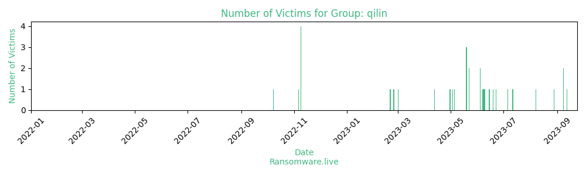

# Profiles for ransomware group : **qilin**

> PYSA ransomware group operates as a ransomware-as-a-service (RaaS) model. PYSA stands for “Protect Your System Amigo”, The PYSA ransomware malware is a variant of the Mespinoza ransomware. It was first seen within open-source documents in December 2019, two months after Mespinoza ransomware was spotted in the wild. PYSA affiliates can customize their malware based on options provided by the RaaS platform, and deploy it as customized. PYSA usually exfiltrates data from its victims before encrypting the files to be ransomed.

🔎 `ransomware.live`has an active  parser for indexing qilin's victims

### URLs
| Title | Available | Last visit | fqdn | Screenshot 
|---|---|---|---|---|
| Qilin | 🔴 | 17/02/2023 11:10 | `http://ozsxj4hwxub7gio347ac7tyqqozvfioty37skqilzo2oqfs4cw2mgtyd.onion` | <a href="https://images.ransomware.live/screenshots/ozsxj4hwxub7gio347ac7tyqqozvfioty37skqilzo2oqfs4cw2mgtyd-onion.png" target=_blank>📸</a> | 
| Qilin blog | 🟢 | 07/08/2023 11:52 | `http://kbsqoivihgdmwczmxkbovk7ss2dcynitwhhfu5yw725dboqo5kthfaad.onion` | <a href="https://images.ransomware.live/screenshots/kbsqoivihgdmwczmxkbovk7ss2dcynitwhhfu5yw725dboqo5kthfaad-onion.png" target=_blank>📸</a> | 

### Ransom note
* [📝 2 ransom notes](notes/qilin)

### Total Attacks Over Time

### Posts

> 30 victims found

| post | date | Description | Screenshot | 
|---|---|---|---|
| [`Better System Co.,Ltd`](https://www.bettersystem.co.th) | 12/07/2023 | Some of the data taken from the servers of this company can be found below | <a href="https://images.ransomware.live/screenshots/posts/25a3b13e5f546e8d08a4130f991c3f73.png" target=_blank>📸</a> |
| [`MicroPort Scientific / LivaNova`](https://microport.com) | 11/07/2023 | Our team has prepared a big announcement for the public to check out some interesting files of this company. In addition to developments ( 1冠脉产品研发部 )  We will publish terabytes of various data from European and Chinese servers            ... | <a href="https://images.ransomware.live/screenshots/posts/97e0673432f4d5385a09f344e9cee6f1.png" target=_blank>📸</a> |
| [`ASIC Soluciones`](https://asicamericas.com/) | 06/07/2023 | ASIC is an IT solutions company that provides data, analytics and artificial intelligence services.  The data dump is provided below for your review. |   |
| [`Daiwa House Industry Co.`](https://medexs.com) | 22/06/2023 | Daiwa House Industry Co., Ltd. is Japan's largest homebuilder, specializing in prefabricated houses. The company is also engaged in the construction of factories, shopping centers, health care facilities, the management and operation of resor            ... |   |
| [`Printmarksolution`](https://printmarksolution.com) | 19/06/2023 | Distributor of production date, expiry date, barcode, lot number, quality products imported from Europe by a team of professionals with more than 15 years of experience in industrial printing. we are committed to providing quality service, at            ... |   |
| [`ASZ GmbH & Co`](https://asz-gmbh.de) | 15/06/2023 | The object of the company is the acquisition and management of shareholdings in service companies on the basis of the Occupational Safety Act and the Occupational Safety Act, as well as the assumption of personal liability and management in t            ... |   |
| [`iECM Company Limited`](https://www.iecm.co.th) | 14/06/2023 | iECM Company Limited is one of the leading firm of Engineering and Consultancy Services in Thailand. Our company is proud of its successful record of the achievements, which bring its stock of experience, know-how, capabilities to bear when f            ... |   |
| [`Del Bono Hotel`](https://delbonohotels.com) | 09/06/2023 | Del Bono Hotels, the most important chain of hotels with function rooms for events, in San Juan Argentina.  The data taken from the company's servers is shown below. |   |
| [`Clarity Water Technologies, LLC`](https://claritywatertech.com) | 08/06/2023 | Clarity Water Technologies specializes in comprehensive industrial and commercial water treatment that includes expert consulting and cutting-edge chemistry, as well as a full service team to support facility needs .   Some of the data take            ... | <a href="https://images.ransomware.live/screenshots/posts/0e9443de9ef600c9a93a177321399d57.png" target=_blank>📸</a> |
| [`AWM Global Advisors`](https://awmga.com/) | 07/06/2023 | AWM offers security backed loans and margin account lending at very competitive rates.   You'll soon see for yourself how much these guys care about the privacy of their customers and employees. | <a href="https://images.ransomware.live/screenshots/posts/c499599ae89d16ebaf5c14c5db423cdc.png" target=_blank>📸</a> |
| [`Ascentia Group Pty Ltd`](https://ascentia.us) | 04/06/2023 | Ascentia is a independent Civil Engineering Contracting company that services the Defence, Civil Infrastructure Construction and the Oil & Gas Industries.   The data taken from the company's servers is shown below. |   |
| [`Conley & Wirick, P.A.`](https://conleywirick.com) | 04/06/2023 | Conley & Wirick, P.A. has served the communities of Bath and Midcoast Maine for more than forty years, and today our attorneys are still committed to serving the people of our community and solving their problems.  Lawyers always like to th            ... | <a href="https://images.ransomware.live/screenshots/posts/295fe7b2f034aba0ae36d30776bfc047.png" target=_blank>📸</a> |
| [`SMDEA`](https://smdea09.fr/) | 22/05/2023 | The SMDEA, a public operator, is an intermunicipal cooperation tool specializing in the areas of water and sanitation; domestic cycle and large cycle.  The company decided to ignore the gigabytes of data taken from their servers. That's wh            ... | <a href="https://images.ransomware.live/screenshots/posts/43581f3a26e145dee5c3d0102a7244f8.png" target=_blank>📸</a> |
| [`Oppida Estates Limited`](https://oppida.com/) | 22/05/2023 | Oppida is a real estate agency that provides a wide range of modern spaces and apartment complexes for rent and sale.  The data of ordinary and wealthy (very) customers you will be able to observe in the very near future. By the way person            ... | <a href="https://images.ransomware.live/screenshots/posts/c4e5e665e7ac1f7c25627fe2c5e653b3.png" target=_blank>📸</a> |
| [`Kannangara Thomson`](https://www.ktlaw.co.nz/) | 19/05/2023 | Christchurch Lawyers, Kannangara Thomson provides advice on the law and a full range of legal services including family law, employment law and conveyancing  Some of this company's data will be uploaded shortly. All the personal data of th            ... |   |
| [`Maier Sanitär-Technik GmbH`](https://www.maier-sanitaer.de) | 19/05/2023 | Maier sanitary technology GmbH is mentioned in public sources in the context of the following products and services. Customer service, hall construction and heating technology are the most common.   Some of this company's data will be uploa            ... |   |
| [`HECTOR MARTINEZ SOSA Y CIA SA`](https://hmsosa.com) | 19/05/2023 | HMSOSA is a group of companies in the insurance industry, responding to all the needs of individuals, companies and organizations, public and private. We have our own offices in CABA, Rio Grande, Ushuaia, Rio Gallegos, Vicente Lopez and Mar d            ... |   |
| [`eyeDOCS Ottawa`](https://eyedocsottawa.com) | 05/05/2023 | The company has decided not to care about its customers' data. Therefore, we are forced to publish their data. You can download the first part at the link below  pass for archive: ys5YHSpkbp;sYT5&^%,FPERLHP | <a href="https://images.ransomware.live/screenshots/posts/9cffdbed6640aeedd01a092875e29338.png" target=_blank>📸</a> |
| [`Gropper & Nejat, PLLC`](https://www.groppernejat.com/) | 03/05/2023 | Another company that decided it was a good idea to ignore our team. We will now post their customer data in pieces. Pass for archive: moR~?HHJ%IqTymMH7XHv$o7fi | <a href="https://images.ransomware.live/screenshots/posts/83bf68fedf007626561a039206ce1ec6.png" target=_blank>📸</a> |
| [`SIIX Corporation`](https://www.siix.co.jp) | 30/04/2023 | In 3 days we will publish all the data taken from their servers. | <a href="https://images.ransomware.live/screenshots/posts/8c228b0b2a895306fd8ac6e97457c7f8.png" target=_blank>📸</a> |
| [`Sippex`](https://www.sippex.com) | 12/04/2023 | Another company that does not care about the data of its employees and customers at all. Publishing another leak | <a href="https://images.ransomware.live/screenshots/posts/b91b2142709212795fdc1a25c6a0363a.png" target=_blank>📸</a> |
| [`Attent Zorg en Behandeling`](https://www.attentzorgenbehandeling.nl/) | 01/03/2023 | Dear friends decided to deceive us and their customers, saying that everything works fine for them and there were no serious leaks in the network. https://www.attentzorgenbehandeling.nl/nieuws/update-ongeautoriseerde-toegang-it-systemen  W            ... | <a href="https://images.ransomware.live/screenshots/posts/663171b6c58fbd5f381100d58ba41b80.png" target=_blank>📸</a> |
| [`fsmsolicitors.co.uk`](https://fsmsolicitors.co.uk/) | 24/02/2023 | DB Backups: FSM_backup Isokon2_backup Isokon2CGT_backup Partner_backup PartnerTCDatabase_backup TCDatabase_backup  Dept_data - internal data including accounts, commercial information, ligitation etc. Isocon documents Client's data             ... | <a href="https://images.ransomware.live/screenshots/posts/c92f8b2a0764f64f4f3c5af45c2075e8.png" target=_blank>📸</a> |
| [`GIGATRON.RS`](https://gigatron.rs/) | 20/02/2023 | Gigatron downloaded data overview:  From 172.31.244.50: DB backups of shops: G1-G69, G88, G89  From 172.31.248.10: DB backups: CTRetail_backup CTRetailWSRepl_backup GigatronWMS_Sync_backup From 192.168.2.144: employee disability             ... | <a href="https://images.ransomware.live/screenshots/posts/6979ca89e019c71c8265627ef6b00e2c.png" target=_blank>📸</a> |
| [`Robert Bernard`](https://robertbernard.com) | 09/11/2022 | Since its founding in 1950, Robert Bernard Pneus et Mécanique has become one of the largest tire retailers in Quebec. Thanks to our solid distribution network, we are able to serve our customers throughout Quebec. It's time to showcase what             ... | <a href="https://images.ransomware.live/screenshots/posts/0e88512c9ea83e510e17e50a8e0957be.png" target=_blank>📸</a> |
| [`Contempo Card`](https://contempocard.com) | 09/11/2022 | Vark Sr worked with his father in the jewelry manufacturing business in Rhode Island. In the 80’s, Providence, RI was the jewelry capital of the world, and everyone wanted a piece of the jewelry pie. Vark Sr noticed something odd: while the            ... | <a href="https://images.ransomware.live/screenshots/posts/958680b70b17136cd29772b398369868.png" target=_blank>📸</a> |
| [`Lojas Torra`](https://lojastorra.com.br) | 09/11/2022 | Lojas Torra is a fashion retailer that provides fashion accessories and products. We have all the data of customers and employees and we are ready to share them with you... | <a href="https://images.ransomware.live/screenshots/posts/f66693c68c554d0b3895939afa822a53.png" target=_blank>📸</a> |
| [`Emtelco`](https://emtelco.com.co) | 09/11/2022 | EMTELCO SA is a company that operates in the Outsourcing/Offshoring industry. It employs 101-250 people and has $25M-$50M of revenue. We also have several hundred gigabytes of data. Data of all large clients (corporate), non-disclosure docume            ... | <a href="https://images.ransomware.live/screenshots/posts/edbdee21bd06aef12bbd3fe65b246074.png" target=_blank>📸</a> |
| [`Dialog Information Technology`](https://dialog.com.au) | 06/11/2022 | Dialog Information Technology is one of Australia's leading technology services organisations trading nationally from offices in Brisbane, Sydney, Canberra, Melbourne, Adelaide, Perth and Darwin. Established in 1979, Dialog employs over 1,200            ... | <a href="https://images.ransomware.live/screenshots/posts/3cc573553f9c1d37093f453d1ae91906.png" target=_blank>📸</a> |
| [`scinopharm.com`](https://google.com/search?q=scinopharm.com) | 08/10/2022 |   |   |

Last update : _Monday 07/08/2023 12.13 (UTC)_
