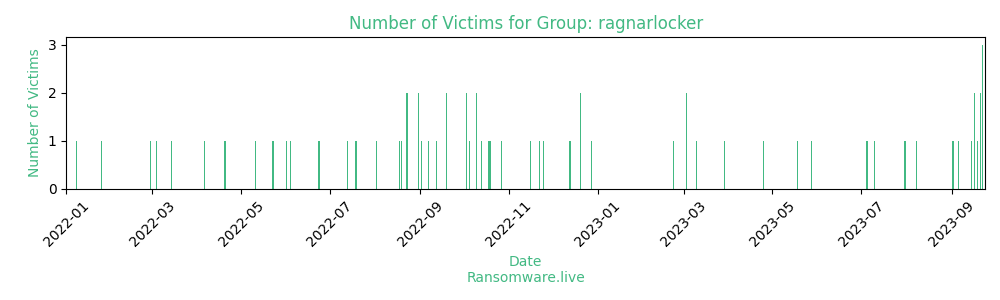

# Profiles for ransomware group : **ragnarlocker**

> 

### External analysis
- https://news.sophos.com/en-us/2020/05/21/ragnar-locker-ransomware-deploys-virtual-machine-to-dodge-security

- https://www.bleepingcomputer.com/news/security/ransomware-gang-threatens-to-leak-data-if-victim-contacts-fbi-police

🔎 `ransomware.live`has an active  parser for indexing ragnarlocker's victims

### URLs
| Title | Available | Last visit | fqdn | Screenshot 
|---|---|---|---|---|
| none | 🔴 | 01/05/2021 00:00 | `http://rgleak7op734elep.onion` | ❌ | 
| Home Page of Ragnar_Locker Leaks site | 🟢 | 03/08/2023 06:44 | `http://rgleaktxuey67yrgspmhvtnrqtgogur35lwdrup4d3igtbm3pupc4lyd.onion` | <a href="https://images.ransomware.live/screenshots/rgleaktxuey67yrgspmhvtnrqtgogur35lwdrup4d3igtbm3pupc4lyd-onion.png" target=_blank>📸</a> | 
| none | 🔴 | 01/05/2021 00:00 | `http://p6o7m73ujalhgkiv.onion` | ❌ | 

### Ransom note
* [📝 2 ransom notes](notes/ragnarlocker)

### Crypto wallets
* 💰 <a href="/#/crypto/ragnarlocker.md">Crypto wallet(s) available</a>

### Total Attacks Over Time

### Posts

> 104 victims found

| post | date | Description | Screenshot | 
|---|---|---|---|
| [`Announcement: Batesville Tool & Die, Inc will be leaked in 3 Days`](https://google.com/search?q=Announcement%3A+Batesville+Tool+%26+Die%2C+Inc+will+be+leaked+in+3+Days) | 31/07/2023 |  | <a href="https://images.ransomware.live/screenshots/posts/a68024cf5f09ca7bf0096e9f94b8d1d2.png" target=_blank>📸</a> |
| [`Belize Electricity Limited - Leaked`](https://google.com/search?q=Belize+Electricity+Limited+-+Leaked) | 10/07/2023 |  | <a href="https://images.ransomware.live/screenshots/posts/29b72a69de8915b92ef3a72fbf83a1f5.png" target=_blank>📸</a> |
| [`Portugal Scotturb Data Leaked`](https://google.com/search?q=Portugal+Scotturb+Data+Leaked) | 05/07/2023 |  | <a href="https://images.ransomware.live/screenshots/posts/36c3d8130b066e346ce3ceadec318f57.png" target=_blank>📸</a> |
| [`Australian Universal Crane Leak`](https://google.com/search?q=Australian+Universal+Crane+Leak) | 28/05/2023 |  | <a href="https://images.ransomware.live/screenshots/posts/d94e66f0f0cef3fc09df2e518f50d0f9.png" target=_blank>📸</a> |
| [`Autlan Metallorum, Mexican Miner Leak`](https://google.com/search?q=Autlan+Metallorum%2C+Mexican+Miner+Leak) | 18/05/2023 |  | <a href="https://images.ransomware.live/screenshots/posts/bf58a3f12aeb46aa81237b063533ff98.png" target=_blank>📸</a> |
| [`CANTALK, Canadian translation services - Leak`](https://google.com/search?q=CANTALK%2C+Canadian+translation+services+-+Leak) | 25/04/2023 |  | <a href="https://images.ransomware.live/screenshots/posts/da7ce277b9e5250f4e79a9d67cbfc7bf.png" target=_blank>📸</a> |
| [`Public Appeal to the CANTALK management`](https://google.com/search?q=Public+Appeal+to+the+CANTALK+management) | 29/03/2023 |  | <a href="https://images.ransomware.live/screenshots/posts/162529105cdc247b46352c83f5e2048b.png" target=_blank>📸</a> |
| [`Temporary Leak Page #0013995NTa`](https://google.com/search?q=Temporary+Leak+Page+%230013995NTa) | 10/03/2023 |  | <a href="https://images.ransomware.live/screenshots/posts/aab7f553164504a4743dcc7e10470ef4.png" target=_blank>📸</a> |
| [`New Leak in lawyers company AASP.`](https://google.com/search?q=New+Leak+in+lawyers+company+AASP.) | 03/03/2023 |  | <a href="https://images.ransomware.live/screenshots/posts/d08e572f64851a91e904d4fcd6a19ab0.png" target=_blank>📸</a> |
| [`New Leak in lawyers company.`](https://google.com/search?q=New+Leak+in+lawyers+company.) | 03/03/2023 |  |   |
| [`AASP claim there was no data leakage!`](https://google.com/search?q=AASP+claim+there+was+no+data+leakage%21) | 22/02/2023 |  | <a href="https://images.ransomware.live/screenshots/posts/5b22ca1ee5b32e4d497bbed86115504f.png" target=_blank>📸</a> |
| [`Hundred thousands of personal data, leak preview`](https://google.com/search?q=Hundred+thousands+of+personal+data%2C+leak+preview) | 28/12/2022 | AOAL - Azienda Ospedaliera di Alessandria | <a href="https://images.ransomware.live/screenshots/posts/098637fc8c5ea9b4141fe4dfe1ee6df2.png" target=_blank>📸</a> |
| [`Wrapex Industrial - Leaked`](https://google.com/search?q=Wrapex+Industrial+-+Leaked) | 20/12/2022 |  | <a href="https://images.ransomware.live/screenshots/posts/c82f148efbe82b81856682c2889a3d62.png" target=_blank>📸</a> |
| [`Serena Hotels - Leaked`](https://google.com/search?q=Serena+Hotels+-+Leaked) | 20/12/2022 |  | <a href="https://images.ransomware.live/screenshots/posts/e09cfee3413fa7c9f7f300b604980339.png" target=_blank>📸</a> |
| [`ITONCLOUD - LEAKED`](https://google.com/search?q=ITONCLOUD+-+LEAKED) | 13/12/2022 |   | <a href="https://images.ransomware.live/screenshots/posts/2b1d1ca0069817856b648f86d8609e33.png" target=_blank>📸</a> |
| [`Essent company - Leaked`](https://google.com/search?q=Essent+company+-+Leaked) | 25/11/2022 |   | <a href="https://images.ransomware.live/screenshots/posts/b758faa63e5095204c36ebbb05f7dda4.png" target=_blank>📸</a> |
| [`Leak Announcement - IT company ITonCLOUD`](https://google.com/search?q=Leak+Announcement+-+IT+company+ITonCLOUD) | 22/11/2022 |   | <a href="https://images.ransomware.live/screenshots/posts/0ac0ea0d2cb25a683da5e07aa1bcc5f5.png" target=_blank>📸</a> |
| [`Belgium company Zwijndrecht - Leaked`](https://google.com/search?q=Belgium+company+Zwijndrecht+-+Leaked) | 16/11/2022 |   | <a href="https://images.ransomware.live/screenshots/posts/238c9c43531c1a50753c3ae22ed6a196.png" target=_blank>📸</a> |
| [`DURAVIT A.G. - Announcement before publishing data`](https://google.com/search?q=DURAVIT+A.G.+-+Announcement+before+publishing+data) | 27/10/2022 |   |   |
| [`Dollmar SpA - Leaked`](https://google.com/search?q=Dollmar+SpA+-+Leaked) | 19/10/2022 |   | <a href="https://images.ransomware.live/screenshots/posts/7ab0b0a302a0ab80ed1ed1d1846148e8.png" target=_blank>📸</a> |
| [`DIPF-INTERN - Leaked`](https://google.com/search?q=DIPF-INTERN+-+Leaked) | 18/10/2022 |   | <a href="https://images.ransomware.live/screenshots/posts/49793d0062064ab0a1f88ca86aa1fe23.png" target=_blank>📸</a> |
| [`Fashion company ZIGI NY - Leaked`](https://google.com/search?q=Fashion+company+ZIGI+NY+-+Leaked) | 13/10/2022 |   | <a href="https://images.ransomware.live/screenshots/posts/7db686d8265aaffec8b45a3b5c2427b1.png" target=_blank>📸</a> |
| [`DMCI Holding Leaked`](https://google.com/search?q=DMCI+Holding+Leaked) | 10/10/2022 |   | <a href="https://images.ransomware.live/screenshots/posts/1255e8bdc36e382f3deb9f73dcb25e9b.png" target=_blank>📸</a> |
| [`TANG CAPITAL LEAKED`](https://google.com/search?q=TANG+CAPITAL+LEAKED) | 10/10/2022 |   | <a href="https://images.ransomware.live/screenshots/posts/86c00715093e1b6877f7487492c779c4.png" target=_blank>📸</a> |
| [`Avalon luxury transport company - Leaked`](https://google.com/search?q=Avalon+luxury+transport+company+-+Leaked) | 05/10/2022 |   | <a href="https://images.ransomware.live/screenshots/posts/fd8afbcb3211e913b0610c24ed385fda.png" target=_blank>📸</a> |
| [`AudioQuest Data Leaked`](https://google.com/search?q=AudioQuest+Data+Leaked) | 03/10/2022 |   |   |
| [`Malayan Flour Mills Bhd. Data Leak`](https://google.com/search?q=Malayan+Flour+Mills+Bhd.+Data+Leak) | 03/10/2022 |   |   |
| [`Who is the real Bad Guys here? Or what recovery experts prefer to keep silent.`](https://google.com/search?q=Who+is+the+real+Bad+Guys+here%3F%C2%A0Or+what+recovery+experts+prefer+to+keep+silent.) | 19/09/2022 |   |   |
| [`TAP Air Leak of more than 1.5 million of customers and many other.`](https://google.com/search?q=TAP+Air+Leak+of+more+than+1.5+million+of+customers+and+many+other.) | 19/09/2022 |   |   |
| [`TAP AIR PORTUGAL - 115k personal data leak`](https://google.com/search?q=TAP+AIR+PORTUGAL+-+115k+personal+data+leak) | 12/09/2022 |   |   |
| [`DDoS instead of the Discuss - Nice try TAP Air`](https://google.com/search?q=DDoS+instead+of+the+Discuss+-+Nice+try+TAP+Air) | 07/09/2022 |   |   |
| [`TAP Air - First Facts`](https://google.com/search?q=TAP+Air+-+First+Facts) | 02/09/2022 |   |   |
| [`USA Insurance company - Smith brothers File tree and some proofs`](https://google.com/search?q=USA+Insurance+company+-+Smith+brothers+File+tree+and+some+proofs) | 31/08/2022 |   |   |
| [`Huge drama for Tap Air Portugal`](https://google.com/search?q=Huge+drama+for+Tap+Air+Portugal) | 31/08/2022 |   |   |
| [`Announcement. Action Lab File-tree`](https://google.com/search?q=Announcement.+Action+Lab+File-tree) | 23/08/2022 |   |   |
| [`DESFA - Pipeline company LEAK`](https://google.com/search?q=DESFA+-+Pipeline+company+LEAK) | 23/08/2022 |   |   |
| [`Greece pipeline company breached - DESFA`](https://google.com/search?q=Greece+pipeline+company+breached+-+DESFA) | 19/08/2022 |   |   |
| [`File-tree of Tang Capital`](https://google.com/search?q=File-tree+of+Tang+Capital) | 18/08/2022 |   |   |
| [`Puma Biotechnology - decided to allow Leaks`](https://google.com/search?q=Puma+Biotechnology+-+decided+to+allow+Leaks) | 02/08/2022 |   |   |
| [`GENSCO Inc. - allows Leak`](https://google.com/search?q=GENSCO+Inc.+-+allows+Leak) | 19/07/2022 |   |   |
| [`Epec.PL - Lied about the absence of Leak`](https://google.com/search?q=Epec.PL+-+Lied+about+the+absence+of+Leak) | 13/07/2022 |   |   |
| [`New Leak: Prudential LTG.`](https://google.com/search?q=New+Leak%3A+Prudential+LTG.) | 24/06/2022 |   |   |
| [`New Leak: Northern Data Systems`](https://google.com/search?q=New+Leak%3A+Northern+Data+Systems) | 23/06/2022 |   |   |
| [`Sierra Packaging Leaked`](https://google.com/search?q=Sierra+Packaging+Leaked) | 04/06/2022 |   |   |
| [`Jonathan Adler Leaks`](https://google.com/search?q=Jonathan+Adler+Leaks) | 01/06/2022 |   |   |
| [`Germany Corporation "VMT-GmbH" Leaked`](https://google.com/search?q=Germany+Corporation+%22VMT-GmbH%22+Leaked) | 23/05/2022 |   |   |
| [`Simonson-Lumber decided to be Leaked`](https://google.com/search?q=Simonson-Lumber+decided+to+be+Leaked) | 11/05/2022 |   |   |
| [`Simonson-Lumber Inc. First batch of Data.`](https://google.com/search?q=Simonson-Lumber+Inc.+First+batch+of+Data.) | 20/04/2022 |   |   |
| [`International Centre Leaked`](https://google.com/search?q=International+Centre+Leaked) | 06/04/2022 |   |   |
| [`Smith Transport Full Leak`](https://google.com/search?q=Smith+Transport+Full+Leak) | 14/03/2022 |   |   |
| [`GHI Hornos Industriales Fully Leaked`](https://google.com/search?q=GHI+Hornos+Industriales+Fully+Leaked) | 04/03/2022 |   |   |
| [`GHI Hornos Industriales  first batch of Data (0,1%)`](https://google.com/search?q=GHI+Hornos+Industriales++first+batch+of+Data+%280%2C1%25%29) | 28/02/2022 |   |   |
| [`Airspan Networks got Leaked`](https://google.com/search?q=Airspan+Networks+got+Leaked) | 25/01/2022 |   |   |
| [`IT-companies Subex & Sectrio Leaked`](https://google.com/search?q=IT-companies+Subex+%26+Sectrio+Leaked) | 08/01/2022 |   |   |
| [`Company Group LDLC`](https://google.com/search?q=Company+Group+LDLC) | 15/12/2021 |   |   |
| [`Leak of IT company Saksoft`](https://google.com/search?q=Leak+of+IT+company+Saksoft) | 10/12/2021 |   |   |
| [`Full Data Leak Linical`](https://google.com/search?q=Full+Data+Leak+Linical) | 09/12/2021 |   |   |
| [`Update: Linicals Data`](https://google.com/search?q=Update%3A+Linicals+Data) | 04/12/2021 |   |   |
| [`Groupe LDLC is going to be Leaked`](https://google.com/search?q=Groupe+LDLC+is+going+to+be+Leaked) | 02/12/2021 |   |   |
| [`Team Computers Ltd. - Leak`](https://google.com/search?q=Team+Computers+Ltd.+-+Leak) | 23/11/2021 |   |   |
| [`LINICAL doesn't care about digital hygiene`](https://google.com/search?q=LINICAL+doesn%27t+care+about+digital+hygiene) | 30/10/2021 |   |   |
| [`Atlas Financial Holdings, Inc. - Leaked`](https://google.com/search?q=Atlas+Financial+Holdings%2C+Inc.+-+Leaked) | 06/10/2021 |   |   |
| [`FULL DATA LEAK of Primary Residential Mortgage, Inc. //`](https://google.com/search?q=FULL+DATA+LEAK+of+Primary+Residential+Mortgage%2C+Inc.+%2F%2F) | 14/09/2021 |   |   |
| [`Primary Residential Mortgage inc. - Leaked`](https://google.com/search?q=Primary+Residential+Mortgage+inc.+-+Leaked) | 11/09/2021 |   |   |
| [`Who is the real Bad Guys here? Or what recovery experts prefer to keep silent.`](https://google.com/search?q=Who+is+the+real+Bad+Guys+here%3F+Or+what+recovery+experts+prefer+to+keep+silent.) | 09/09/2021 |   |   |
| [`Announcement: FTP`](https://google.com/search?q=Announcement%3A+FTP) | 01/07/2021 |   |   |
| [`GATEWAY Property Management`](https://google.com/search?q=GATEWAY+Property+Management) | 23/06/2021 |   |   |
| [`Software company Xoriant`](https://google.com/search?q=Software+company+Xoriant) | 06/06/2021 |   |   |
| [`New Leak GatewayPM`](https://google.com/search?q=New+Leak+GatewayPM) | 05/06/2021 |   |   |
| [`NEW Links for ADATA`](https://google.com/search?q=NEW+Links+for+ADATA) | 26/05/2021 |   |   |
| [`ADATA LEAKED`](https://google.com/search?q=ADATA+LEAKED) | 25/05/2021 |   |   |
| [`Webhelp's company - XtraSource`](https://google.com/search?q=Webhelp%27s+company+-+XtraSource) | 08/02/2021 |   |   |
| [`Ludwig Pfeiffer Leaked`](https://google.com/search?q=Ludwig+Pfeiffer+Leaked) | 26/01/2021 |   |   |
| [`Grupo SADA Leak`](https://google.com/search?q=Grupo+SADA+Leak) | 24/12/2020 |   |   |
| [`New Data Leak post from Chemical company`](https://google.com/search?q=New+Data+Leak+post+from+Chemical+company) | 23/12/2020 |   |   |
| [`Kaye/Bassman International - New "Wall of Shamer"`](https://google.com/search?q=Kaye%2FBassman+International+-+New+%22Wall+of+Shamer%22) | 18/12/2020 |   |   |
| [`Cornerstone-BB Group Leaked`](https://google.com/search?q=Cornerstone-BB+Group+Leaked) | 14/12/2020 |   |   |
| [`Attention, Dassault Falcon Jet updated`](https://google.com/search?q=Attention%2C+Dassault+Falcon+Jet+updated) | 13/12/2020 |   |   |
| [`Advertising Material: Forest Construction Leaked`](https://google.com/search?q=Advertising+Material%3A+Forest+Construction+Leaked) | 12/12/2020 |   |   |
| [`LEAK Post Campari Group`](https://google.com/search?q=LEAK+Post+Campari+Group) | 10/12/2020 |   |   |
| [`Updates with files in EastCoastSeafood Inc.`](https://google.com/search?q=Updates+with+files+in+EastCoastSeafood+Inc.) | 10/12/2020 |   |   |
| [`New "WallofShamer" - East Coast Seafood Inc.`](https://google.com/search?q=New+%22WallofShamer%22+-+East+Coast+Seafood+Inc.) | 10/12/2020 |   |   |
| [`Shasun Chemicals & Drugs Ltd. LEAK`](https://google.com/search?q=Shasun+Chemicals+%26+Drugs+Ltd.+LEAK) | 06/12/2020 |   |   |
| [`JMA Energy LEAK`](https://google.com/search?q=JMA+Energy+LEAK) | 05/12/2020 |   |   |
| [`New Files For Leak Campari Post`](https://google.com/search?q=New+Files+For+Leak+Campari+Post) | 30/11/2020 |   |   |
| [`Ragnar_Team Announce of Potential "WallofShamer"`](https://google.com/search?q=Ragnar_Team+Announce+of+Potential+%22WallofShamer%22) | 10/11/2020 |   |   |
| [`LEAK Post CAPCOM`](https://google.com/search?q=LEAK+Post+CAPCOM) | 08/11/2020 |   |   |
| [`LEAK post FINSA`](https://google.com/search?q=LEAK+post+FINSA) | 08/11/2020 |   |   |
| [`Official appeal to DASSAULT FALCON JET`](https://google.com/search?q=Official+appeal+to+DASSAULT+FALCON+JET) | 01/11/2020 |   |   |
| [`DASSAULT FALCON JET`](https://google.com/search?q=DASSAULT+FALCON+JET) | 30/10/2020 |   |   |
| [`Security breach of CAPCOM network`](https://google.com/search?q=Security+breach+of+CAPCOM+network) | 20/10/2020 |   |   |
| [`Security breach of Campari Group network`](https://google.com/search?q=Security+breach+of+Campari+Group+network) | 08/10/2020 |   |   |
| [`BIOLOGICAL E. Ltd. (BE) LEAK POST`](https://google.com/search?q=BIOLOGICAL+E.+Ltd.+%28BE%29+LEAK+POST) | 27/09/2020 |   |   |
| [`Insignia Environmental company.`](https://google.com/search?q=Insignia+Environmental+company.) | 13/07/2020 |   |   |
| [`Astro Industries, Inc.`](https://google.com/search?q=Astro+Industries%2C+Inc.) | 22/06/2020 |   |   |
| [`Bailey&Galyen Attorney at Law`](https://google.com/search?q=Bailey%26Galyen+Attorney+at+Law) | 22/06/2020 |   |   |
| [`New leaks from SOLTEK PACIFIC`](https://google.com/search?q=New+leaks+from+SOLTEK+PACIFIC) | 22/06/2020 |   |   |
| [`GST Autoleather Company !`](https://google.com/search?q=GST+Autoleather+Company+%21) | 22/06/2020 |   |   |
| [`ST Engineering`](https://google.com/search?q=ST+Engineering) | 22/06/2020 |   |   |
| [`Leaks from company EDP Group`](https://google.com/search?q=Leaks+from+company+EDP+Group) | 19/06/2020 |   |   |
| [`Leaks from company Omniga GmbH & Co.`](https://google.com/search?q=Leaks+from+company+Omniga+GmbH+%26+Co.) | 19/06/2020 |   |   |
| [`Leakage from company Catania, Mahon & Rider, PLLC`](https://google.com/search?q=Leakage+from+company+Catania%2C+Mahon+%26+Rider%2C+PLLC) | 11/06/2020 |   |   |
| [`Brunner Announce – Hello World !`](https://google.com/search?q=Brunner+Announce+%E2%80%93+Hello+World+%21) | 11/06/2020 |   | <a href="https://images.ransomware.live/screenshots/posts/bf25e464b1c5579070e2e43fff1d5220.png" target=_blank>📸</a> |
| [`Leaks Company Birch Communications inc.`](https://google.com/search?q=Leaks+Company+Birch+Communications+inc.) | 10/06/2020 |   |   |

Last update : _Thursday 03/08/2023 07.07 (UTC)_
