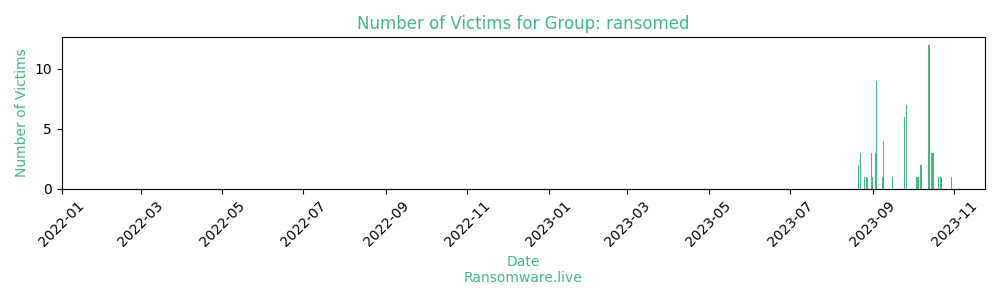

# Profiles for ransomware group : **ransomed**

### URLs
| Title | Available | Last visit | fqdn | Screenshot 
|---|---|---|---|---|
| none | 🔴 | 07/09/2023 12:50 | `http://ransomed.vc` | <a href="https://images.ransomware.live/screenshots/ransomed-vc.png" target=_blank>📸</a> | 
| 404 Not Found | 🔴 | 01/09/2023 10:54 | `http://k63fo4qmdnl4cbt54sso3g6s5ycw7gf7i6nvxl3wcf3u6la2mlawt5qd.onion` | ❌ | 
| none | 🔴 | 01/09/2023 10:55 | `http://f6amq3izzsgtna4vw24rpyhy3ofwazlgex2zqdssavevvkklmtudxjad.onion` | ❌ | 

### Total Attacks Over Time

### Victims

> 29 victims found

| victim | date | Description | Screenshot | 
|---|---|---|---|
| [`airelec.bg`](https://google.com/search?q=airelec.bg) | 09/09/2023 | All of your customer data,records and private documents are mine now, if you pay you wiWe require a ransom of $8,000 |   |
| [`pilini.bg`](https://google.com/search?q=pilini.bg) | 09/09/2023 | You have been hacked, all your data is now mine, if you want to get your backups back you will have to pay us.We require a ransom of $8,000 |   |
| [`kasida.bg`](https://google.com/search?q=kasida.bg) | 09/09/2023 | We have been able to access all of linktera critical infrastructure including her database, we dumped and then deleted all backups from the serversWe require a ransom of $8,000 |   |
| [`proxy-sale.com`](https://google.com/search?q=proxy-sale.com) | 09/09/2023 | We have been able to access all of linktera critical infrastructure including the database, we dumped and then deleted all backups from the serversWe require a ransom of $12,000 |   |
| [`Linktera`](https://google.com/search?q=Linktera) | 08/09/2023 | We have been able to access all of linktera critical infrastructure including her database, we dumped and then deleted all backups from the serversWe require a ransom of $23,000 |   |
| [`easydentalcare.us`](https://google.com/search?q=easydentalcare.us) | 04/09/2023 | We Have accessed all of the critical infrasrtucture of the company, we are on our way to publish all of the data, if not paidArchive SnapshotWe require a ransom of $18,000 |   |
| [`quantinuum.com`](https://google.com/search?q=quantinuum.com) | 04/09/2023 | we have access everything on their servers, including the Database, and other non public documents. |   |
| [`laasr.eu`](https://google.com/search?q=laasr.eu) | 04/09/2023 | we have access everything on their servers, including the Database, and other non public documents.We require a ransom of$11,000$10,000 |   |
| [`medcenter-tambov.ru`](https://google.com/search?q=medcenter-tambov.ru) | 04/09/2023 | we have access everything on their servers, including the Database, and other non public documents.We are not going to make them public unless we get paid.We require a ransom of $25,000 |   |
| [`makflix.eu`](https://google.com/search?q=makflix.eu) | 04/09/2023 | we have access everything on their servers, including the Database,Customers Chats, and other non public documents.We require a ransom of$10,000$9,000 |   |
| [`nucleus.live`](https://google.com/search?q=nucleus.live) | 04/09/2023 | we have access everything on their servers, including the Database,Customers Chats, Bank Transfer DocumentsArchive SnapshotWe require a ransom of $18,000 |   |
| [`wantager.com`](https://google.com/search?q=wantager.com) | 04/09/2023 | we have access everything on their servers, including the Database,Customers Chats, Bank Transfer DocumentsArchive SnapshotWe require a ransom of $10,000 |   |
| [`Swipe.bg`](https://google.com/search?q=Swipe.bg) | 04/09/2023 | We have successfuly obtained all data from Swipe.bg A online marketplace known for its cheap prices. Data we obtained: Userdata,Customer chats,SSNs,Numbers,Addresses and moreWe require a ransom of $50,000. |   |
| [`Balmit Bulgaria`](https://google.com/search?q=Balmit+Bulgaria) | 04/09/2023 | We have successfuly obtained all data from Balmit.bg. We have got all of their data + source + private data from their servers.We require a ransom of$100,000$80,000 |   |
| [`phms.com.au`](https://google.com/search?q=phms.com.au) | 03/09/2023 | We have hacked and exported the database of phms.com.au. We have gathered root access and access to their mysqlWe require a ransom of $10,000 |   |
| [`paynesvilleareainsurance.com`](https://google.com/search?q=paynesvilleareainsurance.com) | 03/09/2023 | We have compromissed the servers of paynesvilleareainsurance.com. We decided to make sure they remember us so we have also defaced them.Archive SnapshopWe require a ransom of $10,000 |   |
| [`SKF.com`](https://google.com/search?q=SKF.com) | 03/09/2023 | SKF�s network was compromised(by collaboration withEverest Ransomware Group) a few days ago. The company continues to be silent about the problem.A representative of the company should contact us immediately, instructions have all been sended in the emails.Otherwise, we will start communicating with your competitors.Data stolen : 2.19 TerabytesData Info : Internal Documents, Data Bases, Customer [�]We require a ransom of $100,000 |   |
| [`Hawaii Health System`](https://google.com/search?q=Hawaii+Health+System) | 01/09/2023 | We were able to dump and deface the official site of the hawaii health system. We demand a ransom not in the form of money      but in the form of public Excuse. We want Joe Biden to come with a russian flag in hands and Excuse himselfs for what he did until      now.Wayback Archive Snapshot |   |
| [`MetroCLub DC`](https://google.com/search?q=MetroCLub+DC) | 31/08/2023 | We were able to dump the entire metroclub.org site. Metroclub is a privte club from DC.     There is 2.1TB of data. This screenshot show most of important info but still gathering a lot of data.     We have their entire members list and employee data.     Source and costumers data. |   |
| [`S&P`](https://google.com/search?q=S%26P) | 31/08/2023 | Affected nearly 6tb of data. Because of the size of the data I require a payment to the following address only. We demand 200,000 euro. bc1qqc7nla44te4wxyvf9j7zxtc5q296sxn94k6v00 |   |
| [`Powersports Marketing`](https://google.com/search?q=Powersports+Marketing) | 31/08/2023 | We are in hold of Everything any of their employes ever downloaded or used on their systems. whole cloud has been accessed. We are in hold of 2.1tb of data from their cloud.file tree:download(https://cdn.bunkr.ru/directory_tree-UvBawJCp.txt) |   |
| [`PSM`](https://google.com/search?q=PSM) | 28/08/2023 |  | <a href="https://images.ransomware.live/screenshots/posts/f827cfdb5bcbf5c0508325a357fba301.png" target=_blank>📸</a> |
| [`Metropolitan Club DC`](https://google.com/search?q=Metropolitan+Club+DC) | 27/08/2023 | We were able to dump the entire metroclub.org site. Metroclub is a privte club from DC. There is 2.1TB of data. This screenshot show most of important info but still gathering a lot of data. We have their entire members list and employee data. Source and costumers data. | <a href="https://images.ransomware.live/screenshots/posts/4a456126604a02f65681572f677b9f06.png" target=_blank>📸</a> |
| [`State Farm`](https://google.com/search?q=State+Farm) | 26/08/2023 |  | <a href="https://images.ransomware.live/screenshots/posts/5e6351286b099ba74fdbd9eac38f854d.png" target=_blank>📸</a> |
| [`Transunion`](https://google.com/search?q=Transunion) | 23/08/2023 |  | <a href="https://images.ransomware.live/screenshots/posts/d15fa9d87364f196833d46069af8c126.png" target=_blank>📸</a> |
| [`Jhooker`](https://google.com/search?q=Jhooker) | 23/08/2023 |  | <a href="https://images.ransomware.live/screenshots/posts/2f4d1b7a6fa4a93903d62852e1b2fb7a.png" target=_blank>📸</a> |
| [`Optimity.co.uk`](https://Optimity.co.uk) | 23/08/2023 | Their whole azure cloud was exported and is now in our hands. luckly and sadly for them we have taken access to more than 1000 companies data they have stored on their cloud. if optimity does not pay we will start ransoming them, one by one.Size of the leak is 5tb | <a href="https://images.ransomware.live/screenshots/posts/df9e81383b2bc01909f991939c59e48c.png" target=_blank>📸</a> |
| [`I&G Brokers`](https://google.com/search?q=I%26G+Brokers) | 21/08/2023 | I&G brokers are top top favourite Bulgarian Broker houses.First Payment Due, leaking dataDownload Sample(https://pomf2.lain.la/f/XXXXXX.7z) | <a href="https://images.ransomware.live/screenshots/posts/8afc3bb6e07fbe503fc867bf2b4a266d.png" target=_blank>📸</a> |
| [`A1`](https://www.a1.group) | 21/08/2023 | A1 Data Provider (1/4 partial payments have been paid on 2023-08-23) | <a href="https://images.ransomware.live/screenshots/posts/f10b27779be949508f6b2a61433b19f9.png" target=_blank>📸</a> |

Last update : _Sunday 24/09/2023 14.39 (UTC)_
