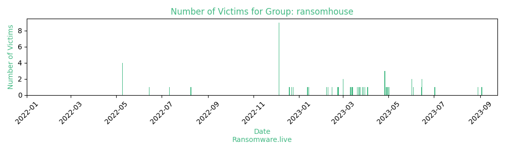

# Profiles for ransomware group : **ransomhouse**

### External analysis
- https://t.me/ransom_house

🔎 `ransomware.live`has an active  parser for indexing ransomhouse's victims

### URLs
| Title | Available | Last visit | fqdn | Screenshot 
|---|---|---|---|---|
| ©RansomHouse | 🔴 | 01/10/2022 13:32 | `http://xw7au5pnwtl6lozbsudkmyd32n6gnqdngitjdppybudan3x3pjgpmpid.onion` | ❌ | 
| none | 🟢 | 07/08/2023 11:56 | `http://zohlm7ahjwegcedoz7lrdrti7bvpofymcayotp744qhx6gjmxbuo2yid.onion` | <a href="https://images.ransomware.live/screenshots/zohlm7ahjwegcedoz7lrdrti7bvpofymcayotp744qhx6gjmxbuo2yid-onion.png" target=_blank>📸</a> | 
| Ransomhouse © | 🔴 | 14/01/2023 21:31 | `http://secxrosqawaefsio3biv2dmi2c5yunf3t7ilwf54czq3v4bi7w6mbfad.onion` | ❌ | 

### Ransom note
* [📝 2 ransom notes](notes/ransomhouse)

### Total Attacks Over Time

### Posts

> 51 victims found

| post | date | Description | Screenshot | 
|---|---|---|---|
| [`Roberto Verino Difusion`](https://www.robertoverino.com/) | 15/06/2023 | Discover the new Roberto Verino collection. Fashion, accessories and trends for men and women: coats, trench coats, dresses, sweaters, pants, accessories and more... | <a href="https://images.ransomware.live/screenshots/posts/5caa8ae81ff4ddf76d060aa0c8fb1bc3.png" target=_blank>📸</a> |
| [`Prada Gayoso`](https://www.pradagayoso.com/) | 15/06/2023 |  We’ve been helping companies prevent, manage and overcome financial crises since 1979. Our economists and attorneys have successfully intervened in the main restructuring processes that have been undertaken in Spain. | <a href="https://images.ransomware.live/screenshots/posts/8366ec2f350ccf961a6009c81be98303.png" target=_blank>📸</a> |
| [`Wison Engineering`](https://www.wison-engineering.com/) | 14/06/2023 | Wison Engineering, headquartered in Shanghai, was established in 1997. Wison Engineering is a chemical EPC service and technology providers in China. Wison Engineering specializes in serving petrochemicals, coal-to-chemical and oil refining industries. | <a href="https://images.ransomware.live/screenshots/posts/b71568d75fe67e489b2f277d2abe3fe3.png" target=_blank>📸</a> |
| [`Mission Community Hospital`](https://www.mchonline.org/) | 01/06/2023 | Mission Community Hospital (MCH) is a two-campus acute care hospital located in the San Fernando Valley. Licensed for 85 medical/surgical beds and 60 acute psychiatric beds, we provide a full range of medical, surgical, psychiatric and emergency care. MISSION COMMUNITY HOSPITAL IS PROUDLY JOINT COMMISSION ACCREDITED AND EARNS FIVE STARS FROM CMS. | <a href="https://images.ransomware.live/screenshots/posts/b3505d1a50d125e9bbb45e3d559edcd3.png" target=_blank>📸</a> |
| [`Customer Elation - Business Information`](https://www.customerelation.com/) | 01/06/2023 | Customer Elation provides call center services to clients who want the capabilities of a large call center with the attention and care of a small business. | <a href="https://images.ransomware.live/screenshots/posts/62624e50653d3b39db4a15d52cdc8d48.png" target=_blank>📸</a> |
| [`AvidXchange`](https://www.avidxchange.com/) | 02/05/2023 | We’re the ones who believe there’s a faster, more efficient way for middle-market businesses to process invoices and make payments; and who, as your ally, want to liberate your AP from all that paperwork that’s slowing down your business and costing you money. | <a href="https://images.ransomware.live/screenshots/posts/1bb7050f2db705e846bb4e07c67dcb4c.png" target=_blank>📸</a> |
| [`100X and ALL Clients`](https://www.100x.com/) | 30/04/2023 | Established in 2009, 100X is a Miami headquartered, full-service Information Technology Consulting and Software Development Firm, specializing in “Anytime/Everywhere” Cloud Workspace and the Aviation Industry. While we are located in South Florida, we have clients all over the world in various industries. We genuinely care about our customers and take our service and performance very seriously. We are looking for long-term relationships where both parties are investing in and benefiting from the outcome. At 100X, it’s all about the growth and success of our clients, our friends. | <a href="https://images.ransomware.live/screenshots/posts/d41d7b103e60865e2f2b5cda6f49b2c6.png" target=_blank>📸</a> |
| [`Albany ENT & Allergy Services`](https://www.albanyentandallergy.com/) | 28/04/2023 | At Albany ENT & Allergy Services, our mission is to provide the highest quality care rooted in compassion and state-of-the-art treatment for our adult and pediatric patients in the Capital Region. Our team of clinical experts collaborate across multiple areas of expertise, allowing us to serve our patients comprehensively and seamlessly. Through trust and collaboration, we ensure that our patients are active participants in their healthcare decisions. At Albany ENT & Allergy Services, we are proud members of our community, fully invested in your health. | <a href="https://images.ransomware.live/screenshots/posts/e9800b362ce3aa0348b8ed65c3c8febb.png" target=_blank>📸</a> |
| [`OMT Officine Meccaniche Torino S.p.A.`](https://omt-torino.com/) | 26/04/2023 | Founded more than 85 years ago, OMT has served engine builders with dependable, high precision fuel injection equipment since the early days of large diesel engine development. In the intervening years, OMT has established long term customer relationships as a reliable partner of engine builders serving the global markets for marine propulsion, power generation and rail traction. | <a href="https://images.ransomware.live/screenshots/posts/c4d9c5133b7fd3809f3cee494ec44507.png" target=_blank>📸</a> |
| [`Tranztec Solutions`](https://www.tranztec.com/) | 26/04/2023 | The Tranztec Platform uses best in class technology to Connect valuable data assets across the supply chain to drive efficiency in your business. The Tranztec Platform is the only standard platform connecting TMS, telematics and transportation services with prebuilt integrations. Featuring a comprehensive set of prebuilt integrations that as well as a robust set of load dispatch functionality that Extends legacy TMS applications and can provide a single cloud-based view of your enterprise. | <a href="https://images.ransomware.live/screenshots/posts/b1a11a1e2114a27c87a0ca7029e04241.png" target=_blank>📸</a> |
| [`HOT NEWS`](https://google.com/search?q=HOT+NEWS) | 26/04/2023 | Tanbridge House School Status: DISCLOSED,  Delaware Life Insurance Company Status: DISCLOSED, OMT Officine Meccaniche Torino S.p.A. Status: EVIDENCE, Tranztec Solutions Status: EVIDENCE | <a href="https://images.ransomware.live/screenshots/posts/364b5af6df6ae3f5da3662789273c6c5.png" target=_blank>📸</a> |
| [`Aero Engine Solution INC`](https://www.aeroenginesolutions.com) | 03/04/2023 | POur experience includes Aeronautical Engineering, Engine and Airframe Heavy Maintenance, Whole Asset Leasing, Aircraft Trading, Surplus Parts Distribution, Warehouse and Inventory Management, Portfolio Management, and Finance | <a href="https://images.ransomware.live/screenshots/posts/f5d620e965b743dc1de16fd9a6dd8037.png" target=_blank>📸</a> |
| [`Hospital Clinic de Barcelona`](https://www.clinicbarcelona.org/) | 30/03/2023 | Hospital Clínic de Barcelona, officially Hospital Clínic i Provincial de Barcelona, is a university hospital founded in 1906 and based in Barcelona. It opened its doors on December 23, 1906, with a capacity of 400 patients, some of which were moved from Hospital de la Santa Creu. It is currently part of the Catalan Health Service. | <a href="https://images.ransomware.live/screenshots/posts/f843fc3fe9fd4d8d7d710b6453dc3931.png" target=_blank>📸</a> |
| [`AV Industries`](https://www.avindustriesinc.com/) | 28/03/2023 | PAV Industries is dedicated to providing premium equipment and services to the airline industry. Whether your objective is to reduce maintenance downtimes, or obtain technical support, seasoned and skilled professionals stand ready to assist you. | <a href="https://images.ransomware.live/screenshots/posts/7ac15beff2d3aae1076af040e8658146.png" target=_blank>📸</a> |
| [`Tanbridge House School`](http://www.tanbridge-house-sch.co.uk) | 27/03/2023 | Tanbridge House School is an inspiring place.  This is true from the viewpoints of both students and adults.  We all share the same goals and continue to strive to be ‘exceptional every day’.  | <a href="https://images.ransomware.live/screenshots/posts/9a33dc0d9684d7a9d47eb3d6b6e7e4ce.png" target=_blank>📸</a> |
| [`Cospec Srl`](https://www.cospec.it/) | 24/03/2023 | Cospec Srl is a company that operates in the Construction industry. | <a href="https://images.ransomware.live/screenshots/posts/fd8d55e8c27c5efacb9dbb6b9093f6f1.png" target=_blank>📸</a> |
| [`Comune Taggia`](https://www.comune.taggia.im.it/) | 23/03/2023 | Taggia is a comune (municipality) in the Province of Imperia in the Italian region Liguria, located about 110 kilometres (68 miles) southwest of Genoa and about 15 km (9 mi) west of Imperia. It has around 13,000 inhabitants. Taggia borders the following municipalities: Badalucco, Castellaro, Ceriana, Dolcedo, Pietrabruna, Riva Ligure, and Sanremo | <a href="https://images.ransomware.live/screenshots/posts/e7aacad98152adc360a1e92be631f757.png" target=_blank>📸</a> |
| [`Design CATAPULT`](https://www.designcatapult.com/) | 22/03/2023 | Design CATAPULT offers a unique approach to obtaining quality design  services. We have streamlined the design process to provide the maximum  return on your investment. Our development team consists of highly  skilled Industrial  Designers, Mechanical Engineers, Electrical  Engineers, and Manufacturing  Technicians. The DC team concentrates on  what matters: innovating great design  & engineering solutions while  providing you with the best results at an  affordable price. | <a href="https://images.ransomware.live/screenshots/posts/18cee8efadead13bb542b2a19f3474e6.png" target=_blank>📸</a> |
| [`Indonesia Power`](https://www.indonesiapower.co.id/) | 20/03/2023 | Established in 1995, Indonesia Power, formerly known as PT Pembangkitan Jawa Bali I, operates through its 127 power plants, with a total capacity of 8.888 MW. Indonesia Power is headquartered in South Jakarta and is the largest electricity Power Generating Company | <a href="https://images.ransomware.live/screenshots/posts/646b3a80fe951a6937957f4672dc6f25.png" target=_blank>📸</a> |
| [`Faraday Technology`](https://www.faraday-tech.com/) | 14/03/2023 | Faraday Technology Corporation is a leading fabless ASIC design and silicon IP (intellectual property) provider established in 1993 as the first Asian ASIC vendor. Headquartered in Hsinchu Science Park, Taiwan, Faraday has services and technical support offices around the world, including in US, Japan, China, India and Vietnam to provide customers real-time support. Faraday is listed on the Taiwan Stock Exchange (TWSE) under ticker number 3035. | <a href="https://images.ransomware.live/screenshots/posts/1fb144bc2fa3867723b3c840a0f04af5.png" target=_blank>📸</a> |
| [`St. Kitts & Nevis`](https://www.gov.kn) | 13/03/2023 | Saint Kitts and Nevis, officially Federation of Saint Kitts and Nevis, also called Saint Christopher and Nevis, state composed of two islands of the Lesser Antilles in the eastern Caribbean Sea. Their combined area is 104 square miles (269 square km). The capital is Basseterre on the island of Saint Kitts. | <a href="https://images.ransomware.live/screenshots/posts/4182e045edbfd6042fdad1f09eebf387.png" target=_blank>📸</a> |
| [`Delaware Life Insurance Company`](https://www.delawarelife.com/) | 11/03/2023 | Founded in 2013, Delaware Life Insurance Company is a subsidiary of Group 1001 Insurance Holdings,LLC (Group 1001) a dynamic network of businesses making insurance more useful, logical, and accessible for everyone. As of June 30, 2022, the company had assets of $41.8 billion and liabilities of $39.7 billion (does not include Delaware Life Insurance Company of New York) with more than 320,000  active annuity and life insurance policies. | <a href="https://images.ransomware.live/screenshots/posts/0ec975e98308a41d599e2fc8e7227373.png" target=_blank>📸</a> |
| [`Audio Video`](https://www.audiovideocorp.com/) | 01/03/2023 | Established in 1946 by WWII Veteran Milton A. Klarsfeld, Audio-Video Corporation was initially named The Albany Television Headquarters and was located on Hudson Avenue in Albany, NY. In 1954 the company changed its name to Audio-Video Corporation to better identify with current technology and services. Audio-Video Corporation headquarters is located in Albany, NY with a full service branch office in Syracuse, NY. Additionally, there are three satellite offices spread across NY and New England. Locations include Syracuse NY, Rochester NY, and Burlington VT. |   |
| [`E&S Heating & Ventilation Ltd`](https:/www.esgroup.co.uk) | 01/03/2023 | E&S Heating & Ventilation Ltd has been at the forefront of ductwork manufacturing technology and investment since 1972. We offer all forms of ductwork manufacture, galvanised, Flameshield fire rated and stainless steel, associated equipment selection along with procurement, installation, insulation, testing and commissioning for air handling systems. |   |
| [`AESCULAPIUS Farmaceutici`](https://www.aesculapius.it/) | 23/02/2023 | The Research and Development Division is the heart of the company, which invests significant resources in innovation to develop new pharmaceutical products and new formulations with high technological content. |   |
| [`Bond It`](https://www.bond-it.co.uk/) | 22/02/2023 | For almost two decades, Bond It has been a manufacturer of high performance, high quality building chemicals such as sealants, adhesives, grouts, cleaners, expanding foams, fillers, decorating sundries, landscaping products and other similar products. |   |
| [`Hospital Service SpA`](https://www.hshospitalservice.com/) | 14/02/2023 | HS was founded in 1980 with the objective to promote and distribute throughout Italy new methods of minimally invasive interventional diagnostic technologies, introducing on the National market a new generation of echo-guided biopsy products. |   |
| [`Jeffries Morris`](https://www.thejeffriescompanies.com/jeffries-morris) | 09/02/2023 | Jeffries Morris, Inc. provides acquisition, advisory and asset management services for real estate companies with investments in Metropolitan New York. |   |
| [`The DGCX`](https://www.dgcx.ae/) | 07/02/2023 | Dubai has historically been an international hub for the physical trade of not only gold, but also many other commodities and so the establishment of the Dubai Gold & Commodities Exchange (DGCX) was the next logical step for the region and the local economy. DGCX commenced trading in November 2005 as the regions first commodity derivatives exchange and has become today, the leading derivatives exchange in the Middle East |   |
| [`Holovis`](https://www.holovis.com/) | 14/01/2023 | Holovis design and install world-class experiential solutions for global themed entertainment, visitor attractions and enterprise clients. |   |
| [`Trans Maldivian Airways`](https://www.transmaldivian.com/) | 13/01/2023 | Trans Maldivian Airways is your getaway to the stunning Maldives. With the world’s largest seaplane fleet, Trans Maldivian Airways takes you from Velana International Airport in Malé to your island holiday destination. Life is about the journey, and this will likely be the most scenic one in your life. Trans Maldivian Airways currently offers transfer services to more than 80 Maldives resorts, flying over 1,000,000 passengers per year to their holiday hideaways. |   |
| [`IMI Hydronic Engineering`](https://www.imi-hydronic.com/) | 12/01/2023 | IMI plc is a global engineering group that focuses on precision fluid engineering. IMI plc incorporates three divisions, each working to make its vision come to life – IMI Hydronic, Norgren and IMI Critical. |   |
| [`Republic of Vanuatu`](https://www.gov.vu/) | 24/12/2022 | We are a leading multinational health group committed to keeping communities healthy through our own Comprehensive Health Model, which is based on prevention, identification and management of health risks, and control and management of the disease and the dependency. |   |
| [`Strem Chemicals`](https://www.strem.com/) | 22/12/2022 | Strem established in 1964, is a company that manufactures and markets specialty chemicals of high purity. Strem was acquired by Ascensus Specialties in 2021. Its clients include academic, industrial and government research and development laboratories as well as commercial scale businesses in the pharmaceutical, microelectronic and chemical / petrochemical industries. Strem also provides custom synthesis (including high pressure synthesis) and cGMP manufacturing services. |   |
| [`Keralty`](https://google.com/search?q=Keralty) | 19/12/2022 | We are a leading multinational health group committed to keeping communities healthy through our own Comprehensive Health Model, which is based on prevention, identification and management of health risks, and control and management of the disease and the dependency. |   |
| [`Advanced Micro Devices, Inc`](https://google.com/search?q=Advanced+Micro+Devices%2C+Inc) | 05/12/2022 |   |   |
| [`Fairfax - Crum & Forster`](https://google.com/search?q=Fairfax+-+Crum+%26+Forster) | 05/12/2022 |   |   |
| [`Ipca Laboratories`](https://google.com/search?q=Ipca+Laboratories) | 05/12/2022 |   |   |
| [`Carmen Copper Corporation`](https://google.com/search?q=Carmen+Copper+Corporation) | 05/12/2022 |   |   |
| [`ROFA INDUSTRIAL AUTOMATION`](https://google.com/search?q=ROFA+INDUSTRIAL+AUTOMATION) | 05/12/2022 |   |   |
| [`ADATA Technology`](https://google.com/search?q=ADATA+Technology) | 05/12/2022 |   |   |
| [`Severn Glocon Group`](https://google.com/search?q=Severn+Glocon+Group) | 05/12/2022 |   |   |
| [`SMB Solutions`](https://google.com/search?q=SMB+Solutions) | 05/12/2022 |   |   |
| [`BRYCON Construction`](https://google.com/search?q=BRYCON+Construction) | 05/12/2022 |   |   |
| [`8 Italy Districts`](https://google.com/search?q=8+Italy+Districts) | 09/08/2022 |   |   |
| [`Summit Care`](https://google.com/search?q=Summit+Care) | 11/07/2022 |   |   |
| [`SHOPRITE HOLDINGS LTD`](https://google.com/search?q=SHOPRITE+HOLDINGS+LTD) | 14/06/2022 |   |   |
| [`Saskatchewan Liquor and Gaming Authority`](https://google.com/search?q=Saskatchewan+Liquor+and+Gaming+Authority) | 09/05/2022 |   |   |
| [`Jefferson Credit Union`](https://google.com/search?q=Jefferson+Credit+Union) | 09/05/2022 |   |   |
| [`Dellner Couplers AB`](https://google.com/search?q=Dellner+Couplers+AB) | 09/05/2022 |   |   |
| [`AHS Aviation Handling Services GmbH`](https://google.com/search?q=AHS+Aviation+Handling+Services+GmbH) | 09/05/2022 |   |   |

Last update : _Monday 07/08/2023 12.13 (UTC)_
