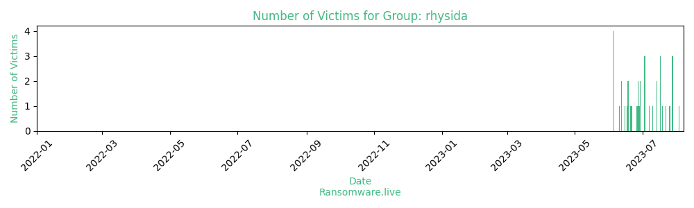

# Profiles for ransomware group : **rhysida**

### External analysis
- https://blog.talosintelligence.com/rhysida-ransomware/

- https://research.checkpoint.com/2023/the-rhysida-ransomware-activity-analysis-and-ties-to-vice-society/

- https://www.linkedin.com/posts/prodaft_organic-relationship-between-rhysida-vice-activity-7091777236663427072-NQEs

- https://www.secplicity.org/2023/05/23/scratching-the-surface-of-rhysida-ransomware/

- https://www.sentinelone.com/blog/rhysida-ransomware-raas-crawls-out-of-crimeware-undergrowth-to-attack-chilean-army/

- https://www.trendmicro.com/en_us/research/23/h/an-overview-of-the-new-rhysida-ransomware.html

🔎 `ransomware.live`has an active  parser for indexing rhysida's victims

### URLs
| Title | Available | Last visit | fqdn | Screenshot 
|---|---|---|---|---|
| Rhysida | 🟢 | 24/11/2023 12:52 | `http://rhysidafohrhyy2aszi7bm32tnjat5xri65fopcxkdfxhi4tidsg7cad.onion` | <a href="https://images.ransomware.live/screenshots/rhysidafohrhyy2aszi7bm32tnjat5xri65fopcxkdfxhi4tidsg7cad-onion.png" target=_blank>📸</a> | 
| none | 🟢 | 24/11/2023 12:52 | `http://rhysidafohrhyy2aszi7bm32tnjat5xri65fopcxkdfxhi4tidsg7cad.onion` | <a href="https://images.ransomware.live/screenshots/rhysidafohrhyy2aszi7bm32tnjat5xri65fopcxkdfxhi4tidsg7cad-onion.png" target=_blank>📸</a> | 
| none | 🟢 | 24/11/2023 12:53 | `http://rhysidafohrhyy2aszi7bm32tnjat5xri65fopcxkdfxhi4tidsg7cad.onion` | <a href="https://images.ransomware.live/screenshots/rhysidafohrhyy2aszi7bm32tnjat5xri65fopcxkdfxhi4tidsg7cad-onion.png" target=_blank>📸</a> | 
| Rhysida | 🟢 | 24/11/2023 12:53 | `http://rhysidafc6lm7qa2mkiukbezh7zuth3i4wof4mh2audkymscjm6yegad.onion` | <a href="https://images.ransomware.live/screenshots/rhysidafc6lm7qa2mkiukbezh7zuth3i4wof4mh2audkymscjm6yegad-onion.png" target=_blank>📸</a> | 

### Ransom note
* [📝 1 ransom note](notes/rhysida)

### Technique Set

* 🛠️ A technique set is [available](https://app.tidalcyber.com/share/techniqueset/b53e1952-b3c9-4eb4-9110-fdd2424abf2c) from [Tidal Cyber](https://www.tidalcyber.com/)

### Total Attacks Over Time

### Victims

> 64 victims found

| victim | date | Description | Screenshot | 
|---|---|---|---|
| [`St Edmund's College & Prep School`](https://google.com/search?q=St+Edmund%27s+College+%26+Prep+School) | 21/11/2023 | St Edmund's College & Prep School Located in 400 acres of beautiful Hertfordshire countryside, St Edmund's College and Prep School is a safe, stimulating environment for students aged 3-18, with boarding available from age 11. |   |
| [`British Library`](https://google.com/search?q=British+Library) | 20/11/2023 | British Library The British Library is a research library in London that is the national library of the United Kingdom. It is one of the largest libraries in the worl. |   |
| [`MHM Health`](https://google.com/search?q=MHM+Health) | 11/11/2023 | MHM Health MHM Health is dedicated to help our partner Independent Physician Associations remain independent as the healthcare industry transitions to value-based care. |   |
| [`Azienda Ospedaliera Universitaria Integrata di Verona`](https://google.com/search?q=Azienda+Ospedaliera+Universitaria+Integrata+di+Verona) | 10/11/2023 | Azienda Ospedaliera Universitaria Integrata di Verona The Verona Integrated University Hospital Company is a hospital facility that is part of the Veneto Health Service, based in the city of Verona and is one of the largest hospitals in Italy. |   |
| [`Indah Water Konsortium`](https://google.com/search?q=Indah+Water+Konsortium) | 07/11/2023 | Indah Water Konsortium Indah Water Konsortium, a company owned by Minister of Finance Incorporated, is Malaysia's national sewerage company which has been entrusted with the tasks of developing and maintaining a modern and efficient sewerage system for all Malaysians. | <a href="https://images.ransomware.live/screenshots/posts/51354d74fbc4a708ee70d46d70dbefa1.png" target=_blank>📸</a> |
| [`Mount St. Mary's Seminary`](https://google.com/search?q=Mount+St.+Mary%27s+Seminary) | 06/11/2023 | Mount St. Mary's Seminary Mount St. Mary's Seminary is the oldest division of the Athenaeum. The seminary has as its mission the preparation of candidates for the Catholic priesthood�a gift of God and the fruit of an integrated approach to formation. |   |
| [`SMH Group`](https://google.com/search?q=SMH+Group) | 05/11/2023 | SMH Group In 2022, the SMH Group was born, with all the individual offices having their original names prefixed with 'SMH'. |   |
| [`GO! Handelsschool Aalst`](https://google.com/search?q=GO%21+Handelsschool+Aalst) | 02/11/2023 | GO! Handelsschool Aalst GO! Handelsschool Aalst is een milieubewuste school in het centrum van Aalst en streeft naar hoogstaand onderwijs op maat in een open sfeer. | <a href="https://images.ransomware.live/screenshots/posts/93c65116e528978541dfb5226ddcfe2c.png" target=_blank>📸</a> |
| [`Northwest Eye Care Professionals`](https://google.com/search?q=Northwest+Eye+Care+Professionals) | 14/10/2023 | Northwest Eye Care Professionals Serving Clackamas and the surrounding communities in Vancouver and Beaverton, we offer comprehensive eye health services for all members of your family as well as specialty services. |   |
| [`Southern Arkansas University`](http://rhysidafohrhyy2aszi7bm32tnjat5xri65fopcxkdfxhi4tidsg7cad.onion/archive.php?company=52) | 09/10/2023 | Southern Arkansas University Southern Arkansas University offers personalized tour visits, faculty and staff who invest in student success, and a caring campus community.    More |   |
| [`Camara Municipal de Gondomar`](https://google.com/search?q=Camara+Municipal+de+Gondomar) | 06/10/2023 | Camara Municipal de Gondomar Discover Gondomar, a land of historical echoes, where the long history of generations attests to the identity of this Municipality. |   |
| [`General Directorate of Migration of the Dominican Republic`](https://google.com/search?q=General+Directorate+of+Migration+of+the+Dominican+Republic) | 04/10/2023 | General Directorate of Migration of the Dominican Republic |   |
| [`Federal University of Mato Grosso do Sul`](https://google.com/search?q=Federal+University+of+Mato+Grosso+do+Sul) | 02/10/2023 | Federal University of Mato Grosso do Sul The Federal University of Mato Grosso do Sul, is a public university located in the state of Mato Grosso do Sul in Brazil. |   |
| [`Istituto Prosperius`](https://www.prosperius.it/) | 26/09/2023 | Istituto Prosperius Villa Cherubini reopens with a new facility within the Prosperius Institute health complex, established founded by Prof. Mario Bigazzi back in 1973. |   |
| [`Ministry Of Finance (Kuwait)`](https://google.com/search?q=Ministry+Of+Finance+%28Kuwait%29) | 25/09/2023 | Ministry Of Finance (Kuwait) Ministry of Finance is one of the governmental bodies of Kuwait and part of the cabinet. |   |
| [`Ort Harmelin College of Engineering`](https://google.com/search?q=Ort+Harmelin+College+of+Engineering) | 23/09/2023 | Ort Harmelin College of Engineering Ort Harmelin College of Engineering is an innovative technological college located in the heart of the hi-tech area, Sapir in Netanya. |   |
| [`Holon Institute of Technology`](https://google.com/search?q=Holon+Institute+of+Technology) | 22/09/2023 | Holon Institute of Technology HIT Holon Institute of Technology, is a well-established unique and multidisciplinary academic institution, which manages to maintain its young spirit as well as its dynamic and contemporary nature. |   |
| [`Singing River Health System`](https://www.singingriverhealthsystem.com/) | 10/09/2023 | Singing River Health System Singing River Health System is both a mission-driven provider of health services and one of the largest employers on the Mississippi Gulf Coast. | <a href="https://images.ransomware.live/screenshots/posts/1b9457b13b9714e81e67d9783a98a939.png" target=_blank>📸</a> |
| [`Core Desktop`](https://www.coredesktop.com.au/) | 10/09/2023 | Core Desktop Core Desktop is a Microsoft Tier 1 CSP Partner delivering key IT managed solutions that merge legacy technology with innovative cloud solutions. | <a href="https://images.ransomware.live/screenshots/posts/51c962f95e0c8d8b83dc428fab5d2266.png" target=_blank>📸</a> |
| [`IT-Center Syd`](https://www.itcsyd.dk/) | 09/09/2023 | IT-Center Syd IT Center South is an operations center for an administrative IT service community consisting of several state-owned educational institutions spread over 11 land registers around the region of Southern Denmark.    More |   |
| [`Prince George's County Public Schools`](https://www.pgcps.org/) | 25/08/2023 | Prince George's County Public Schools Prince George's County Public Schools (PGCPS), one of the nation's 20th largest school districts, has 201 schools and centers, more than 133,000 students and nearly 20,000 employees. |   |
| [`Prospect Medical Holdings`](https://www.pmh.com/) | 24/08/2023 | Prospect Medical Holdings |   |
| [`Pierce College`](https://www.pierce.ctc.edu/) | 21/08/2023 | Pierce College Pierce College creates quality educational opportunities for a diverse community of learners to thrive in an evolving world. |   |
| [`Municipality of Ferrara`](https://www.comune.fe.it/) | 16/08/2023 | Municipality of Ferrara Ferrara is a city and comune in Emilia-Romagna, northern Italy, capital city of the Province of Ferrara. |   |
| [`National Institute of Social Services for Retirees and Pensioners`](https://www.pami.org.ar/) | 12/08/2023 | National Institute of Social Services for Retirees and Pensioners |   |
| [`Optimum Health Solutions`](https://www.opt.net.au/) | 09/08/2023 | Optimum Health Solutions Optimum Health Solutions is Australia's leading preventative health company. |   |
| [`Ramtha`](https://www.ramtha.com/) | 09/08/2023 | Ramtha The teachings of Ramtha are a unique science. |   |
| [`United Tractors`](https://www.unitedtractors.com/) | 03/08/2023 | United Tractors United Tractors is a heavy equipment distribution company headquartered in Jakarta, Indonesia. |   |
| [`ESMOD`](https://www.esmod.com/) | 28/07/2023 | ESMOD ESMOD, founded by master tailor Alexis Lavigne, has been one of the most prestigious fashion universities in the world since the first students crossed its threshold in 1841. |   |
| [`ESKA Erich Schweizer`](https://www.eska-fuses.de/) | 28/07/2023 | ESKA Erich Schweizer ESKA is a leading German manufacturer of all types of fuses and passive components. |   |
| [`Rouzbeh Educational Complex`](https://www.rouzbeh.info/) | 28/07/2023 | Rouzbeh Educational Complex The industry in which Rouzbeh Educational Complex operates is educational institution. The country where Rouzbeh Educational Complex is located is Iran, while the company's headquarters is in Tehran. | <a href="https://images.ransomware.live/screenshots/posts/62f0be742820300993a64d5fc9bb6ce4.png" target=_blank>📸</a> |
| [`University of Salerno`](https://www.unisa.it/) | 26/07/2023 | University of Salerno The University of Salerno is a university located in Fisciano and in Baronissi, Italy. Its main campus is located in Fisciano while the Faculty of Medicine is located in Baronissi. |   |
| [`University of the West of Scotland`](https://www.uws.ac.uk/) | 25/07/2023 | University of the West of Scotland |   |
| [`Axity`](https://www.axity.com/) | 22/07/2023 | Axity Axity is one of the leading IT companies in Latin America and home to the best talent. |   |
| [`Lumberton Independent School District`](https://www.lumbertonisd.org/) | 19/07/2023 | Lumberton Independent School District Lumberton Independent School District is a public school district based in Lumberton, Texas. In addition to Lumberton, the district serves the city of Rose Hill Acres. |   |
| [`Stephen F. Austin State University`](https://www.sfasu.edu/) | 17/07/2023 | Stephen F. Austin State University Stephen F. Austin State University is a public university in Nacogdoches, Texas.    More |   |
| [`IRIS Informatique`](https://www.iris-info.com/) | 17/07/2023 | IRIS Informatique IRIS Informatique is a team of experts with many areas of expertise: Helpdesk, IT Logistics, IT Repair and Recycling, delegation of IT resources, etc.    More |   |
| [`ICT-College`](https://www.ict-college.net/) | 17/07/2023 | ICT-College ICT-College's experienced staff are always available to help and answer questions.    More |   |
| [`Caterham High School`](https://www.ecaterham.net/) | 14/07/2023 | Caterham High School Caterham High is a community school that serves a richly diverse area of East London, with many ethnic groups and languages represented.    More |   |
| [`The Big Life group`](https://www.thebiglifegroup.com/) | 14/07/2023 | The Big Life group Big Life is in the business of changing lives. We fight inequality by working with people and places to create opportunities and inspire change.    More |   |
| [`Citta Nuova`](https://www.cittanuova.it/) | 10/07/2023 | Citta Nuova Citta Nuova is an Italian publishing house established in Rome in 1959.    More |   |
| [`Kenya Bureau Of Standards`](https://www.kebs.org/) | 07/07/2023 | Kenya Bureau Of Standards The Kenya Bureau of Standards (KEBS) has remained the premier government agency for the provision of Standards, Metrology and Conformity Assessment (SMCA) services since its inception in 1974.    More |   |
| [`Ayuntamiento de Arganda City Council`](https://www.ayto-arganda.es/) | 03/07/2023 | Ayuntamiento de Arganda City Council Located in the southeast of the Community of Madrid, 25 kilometers from Madrid capital, Arganda del Rey can boast of having an extremely interesting natural environment, since part of its municipal district is included in the 'Parque Regional del Sureste', as well as having large green areas and particular ecosystems of remarkable environmental richness.    More |   |
| [`Hollywood Forever`](https://www.hollywoodforever.com/) | 03/07/2023 | Hollywood Forever Hollywood Forever is a full-service funeral home, crematory, cemetery, and cultural events center in the heart of Hollywood.    More |   |
| [`BM GROUP POLYTEC S.p.A.`](https://www.polytec.bmgroup.com/) | 03/07/2023 | BM GROUP POLYTEC S.p.A. Polytec is the merger of two leading companies in automation, robotics , renewable energy and plant engineering, an internationally renowned company operating in the field of system integration, specializing in solutions and platforms that combine robotics, artificial intelligence, process automation and software to help manufacturing companies achieve the technological transformation they need to become smart factories.    More |   |
| [`Enfield Grammar School`](https://www.enfieldgrammar.org/) | 29/06/2023 | Enfield Grammar School Enfield Grammar School is a boys' Comprehensive school and sixth form with academy status, founded in 1558, situated in Enfield Town in the London Borough of Enfield in North London.  Documents Data Catalog: 18 GB, 76 Files  20%   																					Not sold data was uploaded, data hunters, enjoy 																			  More | <a href="https://images.ransomware.live/screenshots/posts/035fcbf8a340d5ff2f257dc4c1e75da2.png" target=_blank>📸</a> |
| [`Western National Group`](https://www.wng.com/) | 29/06/2023 | Western National Group Experts in the Western US multifamily real estate industry, Western National Group is an outstanding curator of investment opportunities, a team of industry-leading builders, and an accredited property management company.    More |   |
| [`Alberta Newsprint`](https://www.albertanewsprint.com/) | 28/06/2023 | Alberta Newsprint Founded in 1989, Alberta Newsprint is a manufacturer of premium newsprint and high bright paper.  Documents Data Catalog: 28 GB, 45 785 Files  40%   																					Not sold data was uploaded, data hunters, enjoy  More | <a href="https://images.ransomware.live/screenshots/posts/4ab49fa4f212a49d27be2cb97098866c.png" target=_blank>📸</a> |
| [`iMatica`](https://www.imatica.com/) | 27/06/2023 | iMatica iMatica was born in 2001 in Girona and we have expanded throughout the peninsula to provide more and better service. The specialty of the house is the implementation of business management software, also called ERP or billing and accounting program.  Documents Data Catalog: 717 GB, 568 473 Files  90%   																					Not sold data was uploaded, data hunters, enjoy 																			  More | <a href="https://images.ransomware.live/screenshots/posts/fb07c8d59b8f88683c4db4eec9d5ba46.png" target=_blank>📸</a> |
| [`Hochschule Kaiserslautern`](https://www.hs-kl.de/) | 27/06/2023 | Hochschule Kaiserslautern The Kaiserslautern University of Applied Sciences is a Hochschule (University of Applied Sciences) with 3 campuses located in Kaiserslautern, Germany, in Pirmasens, Germany and in Zweibrucken, Germany.  Documents Data Catalog: 241 GB, 294 254 Files  40%   																					Not sold data was uploaded, data hunters, enjoy 																			  More | <a href="https://images.ransomware.live/screenshots/posts/1715d24058f3945e79fb030c95126092.png" target=_blank>📸</a> |
| [`Fassi Gru S.p.A.`](https://www.fassi.com/) | 26/06/2023 | Fassi Gru S.p.A. Fassi Gru S.p.A. - Loader cranes manufacturer since 1965. Fassi Gru is the market leader among Italian producers. Its product range and sales numbers place it among the top producers of hydraulic cranes in the world.  Documents Data Catalog: 490 GB, 1 120 626 Files  100%   																					All files was uploaded to public access, data hunters, enjoy 																			  More |   |
| [`Avannubo`](https://www.avannubo.com/) | 21/06/2023 | Avannubo Global provider of technological services with an official license for IP telephony, mobile phones and Internet access.  Documents Data Catalog: 165Gb, 198760 Files  100%   																					All files was uploaded to public access, data hunters, enjoy 																			  More | <a href="https://images.ransomware.live/screenshots/posts/7898821f5027a5a02e2af20daa90ee8d.png" target=_blank>📸</a> |
| [`SAPROS`](https://www.sapros.de/) | 20/06/2023 | SAPROS Sapros is a manufacturer, and supplier of food products like salads, vegetables, fruit and high-quality antipasti.  Documents  100%   																					All files was uploaded to public access, data hunters, enjoy 																			  More | <a href="https://images.ransomware.live/screenshots/posts/caaffa7f7e7c5a043bf4b0c3ad885f30.png" target=_blank>📸</a> |
| [`EDER`](https://www.eder.co.at/) | 18/06/2023 | EDER The EDER group of companies includes the brick plants in Peuerbach and Weibern, four ready-mixed concrete plants in Upper Austria, Systembau Eder with prefabricated stairs, constructive concrete components and double-wall systems for industrial building construction and its own vehicle fleet.  Documents  100%   																					All files was uploaded to public access, data hunters, enjoy 																			  More | <a href="https://images.ransomware.live/screenshots/posts/0b7bbaeb482da29bfdbb0fb2c7131839.png" target=_blank>📸</a> |
| [`Tyconz`](https://www.tyconz.com/) | 18/06/2023 | Tyconz Founded in 2011, TYCONZ has become one of the most experienced SAP-certified consultancy firms.  Documents  100%   																					All files was uploaded to public access, data hunters, enjoy 																			  More | <a href="https://images.ransomware.live/screenshots/posts/7984d2366b96a78326f23495c552373c.png" target=_blank>📸</a> |
| [`Ziegelwerk Eder`](https://www.ziegel-eder.de/) | 17/06/2023 | Ziegelwerk Eder In 1996, the Upper Austrian family company EDER built a state-of-the-art brick factory in Freital near Dresden.  Documents  100%   																					All files was uploaded to public access, data hunters, enjoy 																			  More | <a href="https://images.ransomware.live/screenshots/posts/a394e34bc51905b6fef2309936cb6b9b.png" target=_blank>📸</a> |
| [`Koper Automatisering`](https://www.koper-it.nl/) | 15/06/2023 | Koper Automatisering Koper Automatisering specializes in the development of specialized software for the food industry and floriculture.  Documents  100%   																			All files was uploaded to public access, data hunters, enjoy 																	  More |   |
| [`Paris High School`](https://www.pchs.k12.il.us/) | 12/06/2023 | Paris High School Paris High School is a learning community dedicated to developing well-rounded, productive, engaged citizens in a safe and supportive environment.    More |   |
| [`Northeastern State University`](https://www.nsuok.edu/) | 12/06/2023 | Northeastern State University Northeastern State University is a public university with its main campus in Tahlequah, Oklahoma.    More |   |
| [`Ejercito de Chile`](https://www.ejercito.cl/) | 10/06/2023 | Ejercito de Chile The Army of Chile is the branch of the Armed Forces of Chile in charge of the land defense of Chile, whose mission is to maintain the external security, sovereignty and territorial integrity of the Republic.    More |   |
| [`Haemokinesis`](https://www.haemokinesis.com/) | 05/06/2023 | Haemokinesis Haemokinesis specializes in research and development, laboratory systems, sales and distribution of immunohematology products.  Documents  100%  all files was uploaded to public access, data hunters, enjoy  More | <a href="https://images.ransomware.live/screenshots/posts/1e1c83c062ae7bc5e1ae1be9277b165c.png" target=_blank>📸</a> |
| [`Amstutz Produkte`](https://www.amstutz.ch/) | 05/06/2023 | Amstutz Produkte AMSTUTZ PRODUKTE AG is a leading Swiss manufacturer of chemicals and technical equipment for chemical applications.  Documents  100%  all files was uploaded to public access, data hunters, enjoy  More | <a href="https://images.ransomware.live/screenshots/posts/c1dd7384c334c8c8882f266a15e72fb6.png" target=_blank>📸</a> |
| [`The Thomas Hardye School`](https://www.thomas-hardye.net/) | 05/06/2023 | The Thomas Hardye School The Thomas Hardye School is a secondary academy school in Dorchester, Dorset, England. It is also part of the DASP group.  Documents  100%  all files was uploaded to public access, data hunters, enjoy  More | <a href="https://images.ransomware.live/screenshots/posts/a22fefeabfa27f23b253cbac3a59f700.png" target=_blank>📸</a> |
| [`Collectivite Territoriale de Martinique`](https://www.collectivitedemartinique.mq/) | 05/06/2023 | Collectivite Territoriale de Martinique The territorial collectivity of Martinique is a single French territorial collectivity that succeeds the overseas department and region of Martinique in all their rights and obligations on January 1, 2016.  Documents  100%  all files was uploaded to public access, data hunters, enjoy  More | <a href="https://images.ransomware.live/screenshots/posts/ffc40b74e49fa0f2b6fcd4ab711364e2.png" target=_blank>📸</a> |

Last update : _Friday 24/11/2023 13.15 (UTC)_
