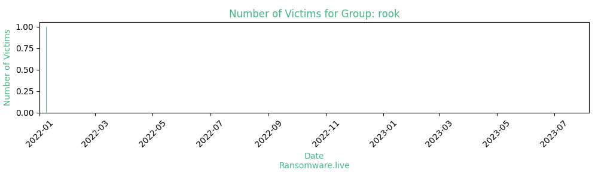

# Profiles for ransomware group : **rook**

> According to PCrisk, Rook is ransomware (an updated variant of Babuk) that prevents victims from accessing/opening files by encrypting them. It also modifies filenames and creates a text file/ransom note (HowToRestoreYourFiles.txt). Rook renames files by appending the .Rook extension. For example, it renames 1.jpg to 1.jpg.Rook, 2.jpg to 2.jpg.Rook.

### External analysis
- https://blog.cyble.com/2022/03/15/deep-dive-analysis-pandora-ransomware/

- https://chuongdong.com/reverse%20engineering/2022/01/06/RookRansomware/

- https://github.com/Dump-GUY/Malware-analysis-and-Reverse-engineering/blob/main/NightSky_Ransomware%E2%80%93just_a_Rook_RW_fork_in_VMProtect_suit/NightSky_Ransomware%E2%80%93just_a_Rook_RW_fork_in_VMProtect_suit.md

- https://seguranca-informatica.pt/rook-ransomware-analysis/

- https://www.microsoft.com/security/blog/2022/05/09/ransomware-as-a-service-understanding-the-cybercrime-gig-economy-and-how-to-protect-yourself

- https://www.microsoft.com/security/blog/2022/05/09/ransomware-as-a-service-understanding-the-cybercrime-gig-economy-and-how-to-protect-yourself/

- https://www.secureworks.com/research/bronze-starlight-ransomware-operations-use-hui-loader

- https://www.sentinelone.com/labs/new-rook-ransomware-feeds-off-the-code-of-babuk/

### URLs
| Title | Available | Last visit | fqdn | Screenshot 
|---|---|---|---|---|
| We Are Rook!!! | 🔴 | 26/01/2022 15:24 | `http://gamol6n6p2p4c3ad7gxmx3ur7wwdwlywebo2azv3vv5qlmjmole2zbyd.onion` | ❌ | 

### Ransom note
* [📝 1 ransom note](notes/rook)

### Total Attacks Over Time

### Victims

> 9 victims found

| victim | date | Description | Screenshot | 
|---|---|---|---|
| [`Abdi ibrahim`](https://google.com/search?q=Abdi+ibrahim) | 08/01/2022 |   |   |
| [`Evalueserve`](https://google.com/search?q=Evalueserve) | 28/12/2021 |   |   |
| [`DENSO`](https://google.com/search?q=DENSO) | 28/12/2021 |   |   |
| [`Data breach summary`](https://google.com/search?q=Data+breach+summary) | 26/12/2021 |   |   |
| [`Rossell Techsys(Data will be given tomorrow)`](https://google.com/search?q=Rossell+Techsys%28Data+will+be+given+tomorrow%29) | 18/12/2021 |   |   |
| [`KMG Prestige, Inc. (Data will be given tomorrow)`](https://google.com/search?q=KMG+Prestige%2C+Inc.+%28Data+will+be+given+tomorrow%29) | 18/12/2021 |   |   |
| [`Rosendahl Design Group`](https://google.com/search?q=Rosendahl+Design+Group) | 14/12/2021 |   |   |
| [`Rossell Techsys`](https://google.com/search?q=Rossell+Techsys) | 14/12/2021 |   |   |
| [`KMG Prestige, Inc.`](https://google.com/search?q=KMG+Prestige%2C+Inc.) | 07/12/2021 |   |   |

Last update : _Friday 24/11/2023 13.15 (UTC)_
