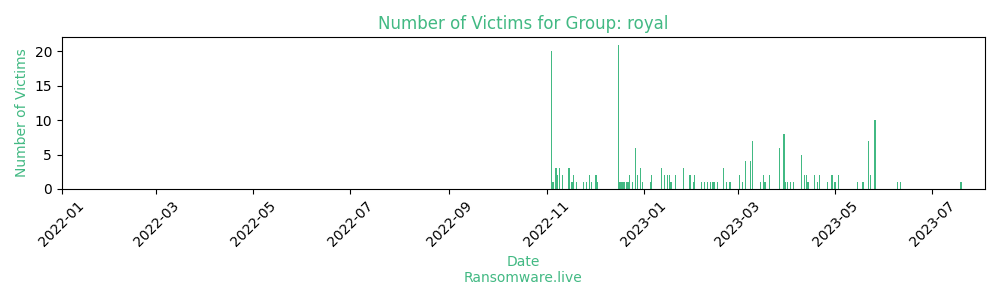

# Profiles for ransomware group : **royal**

> According to Trendmicro, Royal ransomware was first observed in September 2022, and the threat actors behind it are believed to be seasoned cybercriminals who used to be part of Conti Team One.

### External analysis
- https://blog.talosintelligence.com/talos-ir-q2-2023-quarterly-recap/

- https://unit42.paloaltonetworks.com/royal-ransomware/

- https://www.trendmicro.com/en_us/research/23/b/royal-ransomware-expands-attacks-by-targeting-linux-esxi-servers.html

🔎 `ransomware.live`has an active  parser for indexing royal's victims

### URLs
| Title | Available | Last visit | fqdn | Screenshot 
|---|---|---|---|---|
| Royal | 🔴 | 16/10/2023 12:57 | `http://royal2xthig3ou5hd7zsliqagy6yygk2cdelaxtni2fyad6dpmpxedid.onion` | <a href="https://images.ransomware.live/screenshots/royal2xthig3ou5hd7zsliqagy6yygk2cdelaxtni2fyad6dpmpxedid-onion.png" target=_blank>📸</a> | 
| none | 🔴 | 16/10/2023 14:20 | `http://royal4ezp7xrbakkus3oofjw6gszrohpodmdnfbe5e4w3og5sm7vb3qd.onion` | <a href="https://images.ransomware.live/screenshots/royal4ezp7xrbakkus3oofjw6gszrohpodmdnfbe5e4w3og5sm7vb3qd-onion.png" target=_blank>📸</a> | 

### Ransom note
* [📝 1 ransom note](notes/royal)

### Technique Set

* 🛠️ A technique set is [available](https://app.tidalcyber.com/software/221e24cb-910f-5988-9473-578ef350870c-Royal) from [Tidal Cyber](https://www.tidalcyber.com/)

### Total Attacks Over Time

### Victims

> 211 victims found

| victim | date | Description | Screenshot | 
|---|---|---|---|
| [`Braintree Public Schools`](http://www.braintreema.gov) | 19/07/2023 | Braintree Public Schools is an independent public school district which serves the kindergarten through high school educational needs of the city of Braintree, Massachusetts and the surrounding areas.  | <a href="https://images.ransomware.live/screenshots/posts/053bc6171e423aa533b27fa413c94030.png" target=_blank>📸</a> |
| [`Tachi-S Engineering USA`](http://www.tachi-s.com) | 11/06/2023 | Global Seat System CreatorAt Tachi-S, we help automotive manufacturers launch their cars, trucks and SUVs by designing, developing, testing and manufacturing high-quality automotive seats that are functional, safe, stylish and most importantly comfortable.Each year, Tachi-S delivers over 3 million complete automotive seats and over 4 million seat components to the global automotive market. Our success is based on being responsive, flexible and easy to work with to help assure that every automotive seating program is completed on-time, on-budget and delivered with high quality. That’s how we do business…and that’s why we have been a continuously selected company in the automotive industry. | <a href="https://images.ransomware.live/screenshots/posts/603b4bf4279cf9273074819e9837ee0a.png" target=_blank>📸</a> |
| [`PENNCREST School District`](http://www.penncrest.org) | 09/06/2023 | PENNCREST School District provides resources and opportunities that challenge students, assess their educational progress, provide a system of support and empower all to become confident lifelong learners. This organization like many other does not hold student information in safe. We are going to upload everything we got from them here soon. Personal information of students and employees as well as schools' financial data are pretty detailed. Everything is of 164GB.Stay in touch! | <a href="https://images.ransomware.live/screenshots/posts/b5ec2dc5e49ce32c2a4c21798faad7b9.png" target=_blank>📸</a> |
| [`Grange Packing Solutions`](http://www.co-pack.co.uk) | 26/05/2023 | In April 2021 Speciality consortium completed the final stage of the takeover of Grange packing solutions. Speciality consortium group was developed as an off shore consortium of manufacturing companies producing plastic packaging goods and machinery, based in a nu.Total downloaded data - 3gb | <a href="https://images.ransomware.live/screenshots/posts/25b48523c24ebee84ba2d6ba558fa515.png" target=_blank>📸</a> |
| [`Haworth Tompkins`](http://www.haworthtompkins.com) | 26/05/2023 | Haworth Tompkins is a Stirling Prize-winning architectural studio with an international reputation for intelligent, purposeful design.Total downloaded data - 100gb | <a href="https://images.ransomware.live/screenshots/posts/ede3f8b3d1aae24d7a5426228b2439a8.png" target=_blank>📸</a> |
| [`Colrich`](http://www.colrich.com) | 26/05/2023 | From South Africa to Southern California, the ColRich story is a decades-long journey of growth, continuous reinvention and a culture of caring.Through generations of family ownership, the ColRich brand has evolved, but the company’s foundation remains the same today as in the beginning – build lasting communities through a culture centered around innovation, humility, perseverance, and a commitment to helping others.In 1977, business colleagues and friends Richard Gabriel, Barry Galgut and Colin Seid moved from Johannesburg to San Diego, leaving the unrest of apartheid-era South Africa for a more stable environment to raise their families. The trio quickly formed a San Diego-based partnership to pursue development and investment opportunities in Southern California. The business achieved notable success over more than two decades – largely due to continual reinvention and the team’s ability to leverage the peaks and troughs of the cyclical real estate industry.Gabriel’s sons, Graeme and Danny, took the helm in 2003 to build the next iteration of ColRich, creating a diverse residential platform that leverages a unique homebuilding background, renovation expertise, sophisticated in-house construction and design teams brought together in private capital partnerships. Today, ColRich is recognized as an industry leader for integrating design and value into both for-sale and multifamily rental properties.Total downloaded data  -  560gb | <a href="https://images.ransomware.live/screenshots/posts/8effb79e05035290e33be79d1df63dc8.png" target=_blank>📸</a> |
| [`Volt`](http://www.volt.com) | 26/05/2023 | Volt Information Sciences, Inc. provides staffing and information technology (IT) infrastructure services in the United States and internationally.Total downloaded data  -  249gb | <a href="https://images.ransomware.live/screenshots/posts/0ca1cd67be96bd24bed92d096e20e293.png" target=_blank>📸</a> |
| [`AFG Holdings`](http://www.afgholdings.com) | 26/05/2023 | AFG Holdings, Inc. is a fully integrated OEM providing differentiated technology, products, and services. The Company maintains a market-leading position in many of its businesses, including aerospace, general industrial, oil and gas, and power generation.Total downloaded data - 319gb | <a href="https://images.ransomware.live/screenshots/posts/fefdadeb2945267d1d578d16c3279d98.png" target=_blank>📸</a> |
| [`Mitutoyo`](http://www.mitutoyo.ch) | 26/05/2023 | Mitutoyo is one of the world's leading manufacturers of high-quality precision length measurement technology. The portfolio of the full-service provider includes a wide range of products from micrometers, calipers and dial gauges to hardness testers, measuring microscopes and much more.Total downloaded data  -  254gb | <a href="https://images.ransomware.live/screenshots/posts/6d5178014fe72dcdcf726818546cf590.png" target=_blank>📸</a> |
| [`The Best Connection`](http://www.thebestconnection.co.uk) | 26/05/2023 | Headquartered in Bromsgrove, United Kingdom, The Best Connection is a independent provider of flexible workforce solutions to the driving, industrial, warehouse & distribution and retail sectors.Total downloaded data - 1.4tb | <a href="https://images.ransomware.live/screenshots/posts/a6be8d7fbbfa56ae4a6b48b3b74f5020.png" target=_blank>📸</a> |
| [`DirectViz Solutions`](http://www.directviz.com) | 26/05/2023 | Directviz Solutions (DVS) provides the information technology and services IRM needs to successfully carry out its foreign policy mission. DVS provides state of the art Information Technology End-user Support Services (ITESS).Total downloaded data - 246gb | <a href="https://images.ransomware.live/screenshots/posts/918015e672300eced83c42c2250cf2b7.png" target=_blank>📸</a> |
| [`BM Precision`](http://www.bmprecision.com) | 26/05/2023 | B & M Precision, Inc. is capable of producing any part made from stainless steel or similar metals with an emphasis on medical devices. With over 40 years of experience in the machining industry and 275 employees, we have the proven track record to get the job done on time and on budget.Total downloaded data - 26gb | <a href="https://images.ransomware.live/screenshots/posts/e835f375f65b7ab9efced0643e268efd.png" target=_blank>📸</a> |
| [`Groupe Sovitrat Interim and Recrutement`](http://www.sovitrat.fr) | 26/05/2023 | Groupe Sovitrat Interim & Recrutement is a company that operates in the Human Resources industry. It employs 101-250 people and has $10M-$25M of revenue. The company is headquartered in Lyon, Auvergne-Rhone-Alpes, France.Total downloaded data - 158gb | <a href="https://images.ransomware.live/screenshots/posts/359eb7b6fc6667422e075c4f3400f55b.png" target=_blank>📸</a> |
| [`Dotcom Distribution`](http://www.dotcomdist.com) | 23/05/2023 | Dotcom Distribution is a fulfillment and logistics services provider for emerging and established B2C and B2B eCommerce brands.Total downloaded data - 40gb | <a href="https://images.ransomware.live/screenshots/posts/f9b3c09648a12eb9c33222fd9b10ffcc.png" target=_blank>📸</a> |
| [`Coos Bay`](http://www.co.coos.or.us) | 23/05/2023 | Coos Bay is a city located in Coos County, Oregon, where the Coos River enters Coos Bay on the Pacific Ocean. 248GB of confidential documents, contracts, workers salaries, medical information, forensic examinations, insurance and tax information and much more. Everything flew away from this city government to our blog. Soon you will be able to catch something! | <a href="https://images.ransomware.live/screenshots/posts/3bf0db2decbeadef0724d45150f6e7a9.png" target=_blank>📸</a> |
| [`Utah-Yamas Controls`](http://www.utahyamas.com) | 22/05/2023 | Reports \ Drawings \ Users Folders | <a href="https://images.ransomware.live/screenshots/posts/2ab2643d15b8fa4d272ac8ac20289863.png" target=_blank>📸</a> |
| [`Morris Hospital`](http://morrishospital.org) | 22/05/2023 |  | <a href="https://images.ransomware.live/screenshots/posts/32d17eeae532ab4fe8d3ae19dbaf8fba.png" target=_blank>📸</a> |
| [`Atlas Commodities`](http://www.atlascommodities.com) | 22/05/2023 | HR \ Accounting \ Banking | <a href="https://images.ransomware.live/screenshots/posts/1a9def968e8beca72724a6d5e98f00af.png" target=_blank>📸</a> |
| [`Agostini Insurance Brokers`](http://www.agostini.com) | 22/05/2023 | Agostini Insurance Brokers Limited is the longest standing private sector firm of Insurance Brokers within Trinidad and Tobago, having previously been incorporated in the name Agostini Brothers Insurance Limited on the 29th of December 1950.Total downloaded data - 24gb | <a href="https://images.ransomware.live/screenshots/posts/adf179c1c1fe0d2fa768d8d70991cdbf.png" target=_blank>📸</a> |
| [`Trinity Exploration and Production`](http://www.trinityexploration.com) | 22/05/2023 | Trinity Exploration & Production plc, an independent oil company, engages in the exploration, development, production, and sale of crude oil in Trinidad & Tobago. Total downloaded data - 54gb | <a href="https://images.ransomware.live/screenshots/posts/45fde1215cf0d96d67d43ed56d168099.png" target=_blank>📸</a> |
| [`TA Supply`](http://www.tasupply.com) | 22/05/2023 | T&A Supply Company, Inc. distributes various flooring products in the United States. It offers commercial and residential flooring products, such as carpets and carpet cushions, ceramic and porcelain tiles, wood flooring products, and laminate flooring productsTotal downloaded data - 1tb | <a href="https://images.ransomware.live/screenshots/posts/4a13797e80cd56c5eedfbc0abb80ca79.png" target=_blank>📸</a> |
| [`Westside`](http://westside-health.org) | 22/05/2023 |  | <a href="https://images.ransomware.live/screenshots/posts/8f15586f96b90745651d8576d8b0bf85.png" target=_blank>📸</a> |
| [`City of Dallas`](http://www.dallascityhall.com) | 19/05/2023 | “There is still no indication that data from residents, vendors or employees has been leaked,” Dallas said Monday in a statement. So, we are going to indicate that the data will be leaked soon. We will share here in our blog tons of personal information of employees (phones, addresses, credit cards, SSNs, passports), detailed court cases, prisoners, medical information, clients' information and thousands and thousands of governmental documents. | <a href="https://images.ransomware.live/screenshots/posts/04186046e39802c0643bd2a9042a9edd.png" target=_blank>📸</a> |
| [`NASHUA SCHOOL DISTRICT`](http://www.nashua.edu) | 18/05/2023 | The Nashua, New Hampshire School District is a city of 88,000 residents with much to offer. Most notably, the City has a long tradition of supporting public education, both with resources and volunteers. The School District doesn't need it's 728GB of data containing SSNs, passports, forms with personal data both of employees and students. Confidential document and a crazy amount of databases will be uploaded here as well. Stay in touch.  | <a href="https://images.ransomware.live/screenshots/posts/45ad9341ab57b6716003463b39b5bdb5.png" target=_blank>📸</a> |
| [`Parker Drilling`](http://www.parkerdrilling.comwww.parkerwellbore.com) | 15/05/2023 | Parker Drilling is a drilling solutions company that provides support services to the oil and gas industries. We have spent some time in Parker's network and obtained 675GB of their interesting papers. Their accounting and human resources work well. So detailed data. Almost full set of personal documents of employees, numerous contracts and projects. You will be able to download everything soon as always.Enjoy! | <a href="https://images.ransomware.live/screenshots/posts/a92202ed65d33319e3af72a58255f791.png" target=_blank>📸</a> |
| [`ZBW News`](http://zbw.eu) | 03/05/2023 | ZBW's disciplinary repository EconStor provides a large collection of more than 187,000 articles and working papers in Open Access. We are more than sure you understand what this organization had in open access. Personal information of their employees and customers, contracts, NDAs and even Ukraine conflict predictions and reviews.You can find here soon. | <a href="https://images.ransomware.live/screenshots/posts/96ac7177cd8116e360e9f9b995e0b105.png" target=_blank>📸</a> |
| [`Southern West Virginia Community and Technical College`](http://www.southernwv.edu) | 03/05/2023 | Southern West Virginia Community and Technical College is a public community college with its main campus in Mount Gay, West Virginia. There are many sweets inside their 14,5GB data we have: personal information of students and personnel (hundreds of SSNs, medical information and etc.), confidential documents, NDAs and many other. We will soon share it with you here in our blog. | <a href="https://images.ransomware.live/screenshots/posts/18efffc6a9fd04d0e28f466baf623a27.png" target=_blank>📸</a> |
| [`Midwest Truck`](http://www.midwesttruck.com) | 01/05/2023 | Midwest Truck and Auto Parts, Inc. sources and supplies various components to the heavy duty, light duty, and hi-performance aftermarkets worldwide. Someone thinks that if a business is small, that means that it needs nothing to do with clients and employees data to secure them. Same happened to Midwest Truck. Lack of cyber protection has led to upcoming uploading their corporate data with all the personal (drivers licenses, addresses, phones, passports, SSNs) and business (financial docs, bank statements, incident, contract) information  to our blog. Stay in touch. | <a href="https://images.ransomware.live/screenshots/posts/49c24a1f20dfcb8444a02bd289c49156.png" target=_blank>📸</a> |
| [`Montana State University`](http://www.montana.edu) | 29/04/2023 | Montana State University, located in the city of Bozeman, is an educational institution that offers a variety of academic programs and activities for students as well as a variety of personal document of the same student for everyone interested. They failed to storage personal data in a right way and lost 105GB. You can find there money flow of a big University as it represented in numerous financial and administrative documents. Students' personal and medical information is also available like in our previous post about their affiliated college. We will share it soon. | <a href="https://images.ransomware.live/screenshots/posts/d191abbf7031d787282d3ca8aaf7013c.png" target=_blank>📸</a> |
| [`Great Falls College of Technology`](http://www.gfcmsu.edu) | 29/04/2023 | Great Falls College Montana State University is a public community college in Great Falls, Montana. It is affiliated with the Montana State University System. Internal information of this college is interested as a detailed description of inner operations with lost of students and management's data and as a part of a bigger institution with obvious greater quantity of information. Not much but sweet! | <a href="https://images.ransomware.live/screenshots/posts/21074cfdde50c2ed74aeffa2f4eb4c58.png" target=_blank>📸</a> |
| [`EdisonLearning`](http://www.edisonlearning.com) | 26/04/2023 | EdisonLearning provides education management solutions, alternative education, personal learning plans, and turnaround services for underperforming schools. 20GB of their organization data including personal information of employees and students will be uploaded here early next week. Looks like knowledge providers missed some lessons of cyber security. Recently we gave one to EdisonLearning and they have failed. | <a href="https://images.ransomware.live/screenshots/posts/2e210b6459fc54e14f1e488ed77ca459.png" target=_blank>📸</a> |
| [`GKS Hydraulik`](http://www.gks-hydraulik.com) | 21/04/2023 | GKS Hydraulik is a company that operates in the Wholesale industry. It employs 11-20 people and has $1M-$5M of revenue. The company is headquartered in Kressbronn Am Bodensee, Baden-Wuerttemberg, Germany. | <a href="https://images.ransomware.live/screenshots/posts/94663a142de7b74e83cc60ec208bcd37.png" target=_blank>📸</a> |
| [`Encompass Group`](http://www.encompassgroup.com) | 21/04/2023 | Encompass was founded in 1999 and headquartered in McDonough, Georgia, a company that manufacturers and marketers of reusable textiles, professional apparel, and disposable and single-use medical products. The 47 GBs we obtained from this company encompasses valuable information such as employee passports, social security numbers, good number of NDAs, contract and confidential agreements. Surely, there is a great amount of other interesting docs to explore.We will share it soon. | <a href="https://images.ransomware.live/screenshots/posts/834b0f35c7ff94064b12647d5e38bcf3.png" target=_blank>📸</a> |
| [`Clarke County Hospital`](http://clarkehosp.org) | 20/04/2023 |  | <a href="https://images.ransomware.live/screenshots/posts/4f0a4f71c24f0d45547eecdb96df26e6.png" target=_blank>📸</a> |
| [`MW Components`](http://www.mwcomponents.com) | 18/04/2023 | MW Components is focused on accelerating the entire process of delivering custom, stock, and standard parts to virtually any volume and against demanding deadlines. This time MW Components hasn't coped with deadlines and soon you will be able to download their data and see how they accelerate their their processes in their documents. Files of 274GB size that we obtained contain SSNs, passport data, detailed accounting and finance documents. Stay online! | <a href="https://images.ransomware.live/screenshots/posts/c814a926238368aa8a1b61b18ca95da3.png" target=_blank>📸</a> |
| [`Lake Dallas Independent School District`](http://www.ldisd.net) | 18/04/2023 | Lake Dallas Independent School District has a vibrant, growing student population, an excellent array of programs, a strong curriculum, and a progressive, innovative atmosphere. Seems like everything is on the best level but its not. Gygabytes of students' and their staff personal information is not a thing to worry about. A few hundreds of SSNs and array of passport information will be available here on Monday. This is the result of being non-progressive in cybersecurity.Enjoy! | <a href="https://images.ransomware.live/screenshots/posts/a22ec7a080963382f297deafe4ed4d79.png" target=_blank>📸</a> |
| [`City of Ballwin`](http://ballwin.mo.us) | 14/04/2023 |  | <a href="https://images.ransomware.live/screenshots/posts/1c4c22fc4eaa920381c0194f440cc7e7.png" target=_blank>📸</a> |
| [`Moon Capital`](http://www.mooncapital.com) | 13/04/2023 | Moon Capital Management is a company that specializes in global investment management solutions. While searching for a global solution they forgot to invest in their own cybersecurity. As a result we have almost 2TBs of their corporate and personal data: confidential finance and accounting data, reports etc. Employee information, medical insurance and other docs (even tests), passports, drivers licenses, interesting violations, salaries, securities and many other data.We are ready to share it with you! Stay in touch. | <a href="https://images.ransomware.live/screenshots/posts/a7d30e18723fc78459626c5c2c7f5495.png" target=_blank>📸</a> |
| [`Swanson Group`](http://www.swansongroup.biz) | 13/04/2023 | Founded in 1951, Swanson Group sells and manufactures wood products and other building products from timber logs, such as plywood panels, concrete forming panels, studs, veneers, residual products, sign making panels, and safety data sheets. At this moment Swanson's corporate data is not in safety anymore and will be soon posted and free to download. You can find there their financial and accounting information, employees personal information and interesting docs, projects detailed info and some confidential data.Upload soon.  | <a href="https://images.ransomware.live/screenshots/posts/cb6dbdccbe807fc862bcce714a47f1e8.png" target=_blank>📸</a> |
| [`Dataram`](http://dataram.com) | 12/04/2023 | Founded in 1967 and backed by more than 50 years of technology leadership and innovation, Dataram provides technology solutions that help customers simplify, consolidate, automate and scale their enterprise computing and data center environments. But data security issues are not very easy for them. As always employees personal infos, NDAs, clients' contacts and correspondence are almost freely accessible. There are also different marketing researches, projects information, financial and accounting data (tax, sales and other docs).Find it uploaded soon! | <a href="https://images.ransomware.live/screenshots/posts/bffb881c2876015a63a7bddb670c1e9e.png" target=_blank>📸</a> |
| [`Talon Outdoor`](http://www.talonoutdoor.com) | 12/04/2023 | Talon Outdoor is the leading global independent Out of Home (OOH) media specialist and technology services company focused on delivering smarter, creative, data-driven integrated OOH communications. Much of financial information here, contacts of business partners, correspondence, detailed projects information - everything is in a pack of 113GB size.Release soon! | <a href="https://images.ransomware.live/screenshots/posts/32bc2f02ede95635528f24b10a0bb0ce.png" target=_blank>📸</a> |
| [`Tom Duffy Company`](http://www.tomduffy.com) | 10/04/2023 | Commercial & Residential ConstructionFounded in 1956, Tom Duffy Company specializes in floor covering and supplies offering flooring installation, Ceramic Tile & Stone Setting, and floor heating systems. Tom Duffy Company is located in CaliforniaHeadquarters400 E Ball Rd, Anaheim, California, 92805, United StatesPhone Number(562) 404-7900 | <a href="https://images.ransomware.live/screenshots/posts/d5f32b9cea97b3751bb80a5a2508ec8a.png" target=_blank>📸</a> |
| [`Big Ass Fans`](http://www.bigassfans.com) | 10/04/2023 | Big Ass Fans is a fans, light and controls manufacturer for different business directions. These guys have nothing against holding their employees personal information almost open-sourced. They've lost 246 gygabytes of data interested for its details. Tons of accounting and finance information, projects, contracts, payment docs, employees' salaries, passports, medical insurance policies, phones, emails - everything you want. | <a href="https://images.ransomware.live/screenshots/posts/2a44662f88ebc3e1a177a6fbcbe7044e.png" target=_blank>📸</a> |
| [`Alvaria`](http://www.alvaria.com) | 10/04/2023 | Business Intelligence (BI) SoftwareAlvaria was founded through the merger of Aspect Software and Noble Systems, technology leaders in Customer Experience (CX) and Workforce Engagement solutions. Our name is derived from Latin for "hives" - nature's perfect form for millions of yearsHeadquarters5 Technology Park Dr Ste 9, Westford, Massachusetts, 01886, United StatesPhone Number(877) 258-0268 | <a href="https://images.ransomware.live/screenshots/posts/aae8ad4319f0bff39438a56e895d7b75.png" target=_blank>📸</a> |
| [`Nature Path Foods`](http://www.naturespath.com) | 10/04/2023 | Nature's Path Foods was founded in 1985 in Richmond, Canada. It is a family-run, fiercely independent, sustainably-driven, and delightfully nutritious organic breakfast and snack food company. Among almost 40GB of accounting and financial data we've found interesting employees' docs such as work permissions, resumes with addresses, emails, phones ect. There are also lots of agreements, contracts, invoices and other documents that worth to see.Feel free checking the data. | <a href="https://images.ransomware.live/screenshots/posts/5d796924d777864ba1722338ddf93c5a.png" target=_blank>📸</a> |
| [`Stanley Electric U.S.`](http://www.stanleyelectricus.com) | 10/04/2023 | Stanley Electric US is a manufacturer of motorcycle and automotive lighting equipment for Honda and Nissan. This real big fish is going to lose it's internal data of a great size - more than 2TBs. We have not only interesting details about their cooperation with big business names like JP Morgan, Nissan, Honda and others, but also their employees' personal information: thousands of SSNs, passports, medical information, vaccination information. And there are more: incidents, violations, confidential info, tons of contracts and so on and so forth.Priceless data for you soon. | <a href="https://images.ransomware.live/screenshots/posts/b542ba47431fd03f9d70c39cc85300ec.png" target=_blank>📸</a> |
| [`Kretek International`](http://www.kretek.com) | 05/04/2023 | Kretek International, Inc is a number one importer, marketer, and distributor of specialty tobacco products to convenience, mass, and national retailers in the US. We are going to distribute the data of 70GB size we got from them. We have accounting, finance data, payment information, contracts, personal information (employees' info, addresses etc.), information about their projects and so on.Release coming soon. | <a href="https://images.ransomware.live/screenshots/posts/11bcf0cc4254fc4072fbd2ff935867aa.png" target=_blank>📸</a> |
| [`Beghelli USA`](http://www.beghelliusa.com) | 03/04/2023 | Beghelli USA is a provider of emergency lighting products. We have worked with them a little and we are going to light some of their data. This pack includes accounting and finance data, personal information of their employees (passports and others), results of medical analysis, inner confidential data etc. Enjoy! | <a href="https://images.ransomware.live/screenshots/posts/b9624ffa2fe047450cf31455ca73814f.png" target=_blank>📸</a> |
| [`Meade Tractor`](http://meadetractor.com) | 01/04/2023 |  | <a href="https://images.ransomware.live/screenshots/posts/4998e1e6f924809d3f96459e4fb89379.png" target=_blank>📸</a> |
| [`Armstrong Watson`](http://armstrongwatson.co.uk) | 31/03/2023 | ### Accounting Services ###Armstrong Watson LLP is a limited liability partnership registered in England and Wales, number OC415608. The registered office is 15 Victoria Place, Carlisle, CA1 1EW where a list of members is kept. | <a href="https://images.ransomware.live/screenshots/posts/112dd9212b1102816a66432746617441.png" target=_blank>📸</a> |
| [`Benning Construction`](http://www.benningnet.com) | 30/03/2023 | Benning Construction Company is a construction manager and contractor operating in cinema and grocery markets. The information we've taken from them is of 71GB and it contains such as accounting, medical insurance, credit cards, projects information and many other interesting things.Do not hesitate to check it! | <a href="https://images.ransomware.live/screenshots/posts/cfdbfc442e386864148578e5cceb2eab.png" target=_blank>📸</a> |
| [`Vending Group`](http://www.vendinggroup.com) | 30/03/2023 | Vending Group company provides vending services (obviously). They are partnering with big names in beverage business so there are a bunch of interesting docs in the pack. We have from them 61GB of internal data concerning accounting, financial, employee information. And they seem to be not very interested in protection of it.Please take a look! | <a href="https://images.ransomware.live/screenshots/posts/c2a0a378befcb4e6716196ad8d460d2b.png" target=_blank>📸</a> |
| [`Steve Silver furniture`](http://stevesilver.com) | 30/03/2023 | Steve Silver furniture company provides its costumers with different kinds of residential furniture for more than 30 years. Recently they provided us with the information about their customers, their contact data, contracts and payment information and so on. In total we have 17GB of Steve Silver's internal data interesting to look at.You are welcome to see it in details. | <a href="https://images.ransomware.live/screenshots/posts/f814c3434e0e9bcc5948da33332e1e16.png" target=_blank>📸</a> |
| [`Toho Tenax America`](http://www.teijincarbon.com) | 30/03/2023 | Toho Tenax America is a US branch of Japanese technology giant Teijin. They are a carbon manufacturer with facilities around the world. So, Teijin's American partners have lost their data and we obtained lots of corporate, financial, accounting information, employee information including photos.Much interesting is open to check! | <a href="https://images.ransomware.live/screenshots/posts/4e86b9cdf5b6e1967731ce77c4269b5c.png" target=_blank>📸</a> |
| [`5Design`](http://5design.net) | 30/03/2023 | 5Desing is a Californian design company that lost to our side lots of personal and corporate financial information, personal docs, many contracts, NDAs and similar documentation.We suppose you can find much interesting inside. Check it out! | <a href="https://images.ransomware.live/screenshots/posts/2ba4a3bb37ebc20334ffb1d8c59982af.png" target=_blank>📸</a> |
| [`Sunstar Americas`](http://sunstar.com) | 30/03/2023 | Sunstar Americas is a part of the Sunstar Corporation is famous for its dental products. They lost about 118GB of their data including their customers' personal information and other internal corporate data.Soon you will be able to take a look by your self. | <a href="https://images.ransomware.live/screenshots/posts/b652dcfe2ea1f63585933ea11ec3c2d4.png" target=_blank>📸</a> |
| [`Corizon Healthcare`](http://corizonhealth.com) | 30/03/2023 | Corizon Health (CMS and PHS in the past) is a private prison healthcare provider with a very interesting history. The data we took from them is not less interesting. Tons of law docs and other stuff about prisoners' health and their treatment in the institution.You are welcome! | <a href="https://images.ransomware.live/screenshots/posts/efccf9c132b7cbbad881718cb0157e8e.png" target=_blank>📸</a> |
| [`einhaus-gruppe`](http://einhaus-gruppe.de) | 30/03/2023 | Services from a single source - since 2003The Einhaus Group GmbH is one of the first to offer its sales partners individual solutions in the field of electronics insurance. You receive up-to-date insurance products that ensure the satisfaction of your customers. You operate an attractive additional business and generate additional sales. The Einhaus Group takes care of all processes for you, from contract management and customer care to handling damage claims, including repair management and logistics. | <a href="https://images.ransomware.live/screenshots/posts/24d9980db9bb36bca3f0d47d77dcab3e.png" target=_blank>📸</a> |
| [`Ville de Lille`](https://www.lille.fr) | 27/03/2023 | AddressPlace Augustin Laurent CS 30667 59033 Lille Cedex | <a href="https://images.ransomware.live/screenshots/posts/d3b94a3a5b797792b837e33b50e29163.png" target=_blank>📸</a> |
| [`MERS Missouri Goodwill Industries`](http://mersgooldwill.com) | 27/03/2023 | MERS Industries are known for their will to help people. We suppose they need to improve their consumers data security if they really work to help people. If you are interested to take a closer look at their business, we are ready to share some info with you.You can find much interesting in the files! | <a href="https://images.ransomware.live/screenshots/posts/c9e465001f463b177809b049509cae49.png" target=_blank>📸</a> |
| [`The Ultra-met`](http://www.ultra-met.com) | 27/03/2023 | The Ultra-met Carbide Technologies is a premium-quality blanks supplier for fabrications. We have stolen 128GB from their network.Here you will find the following: credit card information, passports, stocks, employee information (including salaries), financial balance and the info of defects while manufacturing.Take a look at the catch! | <a href="https://images.ransomware.live/screenshots/posts/02f98f5a885099156c2c9256a55ff224.png" target=_blank>📸</a> |
| [`Savanna Technical College`](http://savannahtech.edu) | 27/03/2023 | Savannah Technical College provides dynamic education and variable services to its students in many locations. They've lost almost 100GB of their internal information. We are ready to share it with you.You can find there tons of personal data of their employees, financial documents, auto park information, insurance, passports, and even a note from sheriff.You are welcome! | <a href="https://images.ransomware.live/screenshots/posts/1715dd0e2e82fac1da0fa2fbbca62968.png" target=_blank>📸</a> |
| [`Helmholtz Zentrum Munchen`](http://www.helmholtz.de) | 27/03/2023 | Helmholtz Zentrum Museum is interested for its top-level scientific achievements in different areas. The most interested ones were open by us for people who are interested in opening new horizons of digital illiterate of this institution.Here you can find the following data: employees information from HR, projects information (science, medical), financial information along with the confidential files.Take a look. | <a href="https://images.ransomware.live/screenshots/posts/8e9b8e2c99aa5b0dc3b6e3f0b12d23de.png" target=_blank>📸</a> |
| [`Wymondham College`](http://www.wymondhamcollege.org) | 27/03/2023 | Wymondham College - is a beautiful place for living and studying. They even have some awards for education care. But it seems like their students' personal info is not a thing they really care about.What we acquired from them: students' passports, medical vaccination info, children behavior notifications for parents, nonpayment notifications, confidential protocols and much more info of 492GB.Just a piece of cake! | <a href="https://images.ransomware.live/screenshots/posts/06b8e466865b54c9d984c98904e5a346.png" target=_blank>📸</a> |
| [`Yaskawa Motoman`](http://www.motoman.com) | 21/03/2023 | Founded in 1989, Yaskawa Motoman is the Robotics Division of Yaskawa America, Inc. It provides automation products and solutions for virtually every industry and robotic application; including arc welding, assembly, coating, dispensing, material handling and so on.You will see their projects, finance, agreements, employee's information and so on and so on.Feel free to check!Archive password: 8gD2$2!^qSs@ | <a href="https://images.ransomware.live/screenshots/posts/946dc8594f969d0d0db5305ee04f6d39.png" target=_blank>📸</a> |
| [`Graceworks Lutheran Services`](http://www.graceworks.org) | 21/03/2023 | Founded in 1929, Graceworks Lutheran Services is a lutheran social services organization that operates assisted living facilities. Do not be surprised that the company is engaged in charity - it's just a front. Maybe they are involved in money laundering - who knows...We have at our disposal the contents of all email addresses of the top management, full financial audits from 1995 to the present, 45GB or 486,880 Files of personal patients information (clinical) and even documents related to President Biden - very entertaining. Beside this, we have finance, employee documents, accounting, HR and much more others.Enjoy! | <a href="https://images.ransomware.live/screenshots/posts/1fc672543f46970c3ea40d7091c9b342.png" target=_blank>📸</a> |
| [`Sutton and Jacobs`](https://www.sutton-jacobs.com) | 18/03/2023 | Sutton & Jacobs, LLP is located at the corner of College and Park streets in downtown Beaumont, Texas. Originally a cluster of several buildings that, through the years, included a warehouse, auto parts supply house, blacksmith shop and from the days of cobblestone. | <a href="https://images.ransomware.live/screenshots/posts/7811acdf2f86f730f53b18b993df2e56.png" target=_blank>📸</a> |
| [`AAA Energy Service`](https://www.aaaenergy.com) | 17/03/2023 | AAA Energy Service Co. provides services in a multitude of market sectors to a wide variety of clients, small and large. When it comes to its experience, AAA Energy Service Co. has a diverse resume. We have developed, designed, constructed, and serviced HVAC systems throughout the commercial, industrial, and institutional marketplaces. To be successful, it takes a dedicated staff of professionals that perform at a high level of customer service and have the expertise to design and build various types of systems. | <a href="https://images.ransomware.live/screenshots/posts/7fda34b027569d68e759e133c56a8b2d.png" target=_blank>📸</a> |
| [`DGM Industrie`](https://www.dgm-industrie.fr) | 17/03/2023 | DGM Industrie is a company that operates in the Mechanical or Industrial Engineering industry. It employs 21-50 people and has $1M-$5M of revenue.  | <a href="https://images.ransomware.live/screenshots/posts/483d22c0300914c300ac57f9337cd051.png" target=_blank>📸</a> |
| [`Liberty Lines`](http://www.libertylines.com) | 15/03/2023 | For over 60 years Liberty Lines has been privileged to develop and operate one of the most effective and efficient Transit systems in the country. Today Liberty operates over 300 vehicles on 60 routes and carries almost 30 million passenger over 10 million miles annually. We believe our 700 union and non-union employees are the best transit workers in America. Our employees are our greatest asset and earn excellent wages, health and pension benefits. The Liberty workforce is foundational to the local economy.Since its meager beginnings in 1953 as a 4 vehicle operation, Liberty Lines has grown through merger and acquisition to become one of the largest privately owned transportation companies in New York State. Today, the company, which is headquarted in Yonkers, operates out of 2 state of the art facilities, employing approximately 610 union and 140 non-union employees and operating a fleet of 350 vehicles from 25 foot passenger vans, to 60 foot articulated and hybrid buses. | <a href="https://images.ransomware.live/screenshots/posts/0318edcb11debb5173409dcea563d087.png" target=_blank>📸</a> |
| [`Little Mountain Residential Care and Housing Society`](https://www.littlemountaincare.org) | 10/03/2023 | Little Mountain Residential Care and Housing Society (the Society) is a non-profit society created in July 1983. The Society operates 3 sites. Adanac Park Lodge (APL) and Little Mountain Place (LMP) are residential care homes for adults requiring 24-hour. | <a href="https://images.ransomware.live/screenshots/posts/30f8cc8a03429c76d6e702cb6bb0e9aa.png" target=_blank>📸</a> |
| [`Materialogic`](https://www.materialogic.com) | 10/03/2023 | Materialogic offers services in eCommerce fulfillment, marketing logistics, warehousing and distribution, technology, and client and support services. | <a href="https://images.ransomware.live/screenshots/posts/c70b3234552fb7e77cc08992a46eb1fe.png" target=_blank>📸</a> |
| [`Hard Manufacturing`](https://www.hardmfg.com) | 10/03/2023 | HARD Manufacturing, headquartered in Buffalo, NY, designs, manufactures and sells the broadest range of pediatric beds and cribs for hospitals, other healthcare facilities, home care and day care use. | <a href="https://images.ransomware.live/screenshots/posts/b61be44ce67d15a282067ef0cfc959f6.png" target=_blank>📸</a> |
| [`Jackson Dean Construction`](https://www.jacksondean.com) | 10/03/2023 | Jackson Dean Construction offers a challenging and rewarding work experience to college students and graduates in order to build a foundation for your future career path in construction management.  | <a href="https://images.ransomware.live/screenshots/posts/5478c6038ac5684d6be7632952d06439.png" target=_blank>📸</a> |
| [`Gottschol Alcuilux`](https://www.alcuilux.lu) | 10/03/2023 | Gottschol Alcuilux mit den Unternehmensbereichen Desox-Aluminium, Feinblechbearbeitung und Zerspanungstechnik ist ihr Partner für Aluminium zur Stahldesoxidation, Lamellen für die Reifenindustrie und andere Feinblechprodukte sowie alle Arten spanender Metallbearbei | <a href="https://images.ransomware.live/screenshots/posts/aa761efd72c456ffc945c7ff871971a1.png" target=_blank>📸</a> |
| [`KMVP`](https://kmwp.de) | 10/03/2023 |  | <a href="https://images.ransomware.live/screenshots/posts/abaf7ca18f45ffcbdc929f4275298ba5.png" target=_blank>📸</a> |
| [`Highway Equipment`](https://www.highway-equipment.com) | 10/03/2023 | Highway Equipment is a rental and leasing company of construction equipment and related parts. The company was founded in 1933 and is headquartered in Pennsylvania. | <a href="https://images.ransomware.live/screenshots/posts/bd1762bf793213330dba2d46c3b69ddf.png" target=_blank>📸</a> |
| [`Thomaston Mills`](https://thomastonmills.com) | 09/03/2023 | Thomaston Mills was founded in 1899 by R.E. Hightower and is the oldest domestic sheet mill in the USA. We were owned by the Hightower family until 2001, and have been owned by the Zaslow family since that time. Combined the two families have over 200 years of textile experience. Thomaston Mills continues to operate as a family business that puts the customer first.We currently specialize in manufacturing and distribution of the highest quality bed and bath linens to the hospitality, healthcare and institutional markets. We finish millions of yards of fabric each year at our bleachery in Easley, South Carolina and cut and sew this fabric in our 250,000 square foot manufacturing and warehousing facility located in Thomaston, GA. | <a href="https://images.ransomware.live/screenshots/posts/ccd727b5d298c05c0fef5e76cf443d67.png" target=_blank>📸</a> |
| [`Brauerei Schimpf`](http://www.brauerei-schimpf.de) | 09/03/2023 | Headquarters: 1 Hauptstraße, Neustetten, Baden-Wuerttemberg, 72149, GermanyPhone Number: +49 747298940 | <a href="https://images.ransomware.live/screenshots/posts/5b8730d14fb6839c233f2fde78b93b77.png" target=_blank>📸</a> |
| [`Wellington Power Corporation`](https://www.wellingtonpower.com) | 09/03/2023 | At Wellington Power, success is based upon diversified excellence in electrical construction, automated metering infrastructure, telecommunications, and general construction services for utility, industrial, and public sector clients. The company has been developed to handle projects ranging from simple service calls to multimillion dollar installations. | <a href="https://images.ransomware.live/screenshots/posts/15593ab9b38cd544c15961ab1b83d494.png" target=_blank>📸</a> |
| [`Mainstream Engineering`](http://mainstream-engr.com) | 09/03/2023 |  | <a href="https://images.ransomware.live/screenshots/posts/10cea9b45e2baa665df7cbc50277fc0d.png" target=_blank>📸</a> |
| [`PROTEKTOR`](https://www.protektor.co.uk) | 06/03/2023 | The Protektor brand of profiles for plaster, render and drywall has been established for over 100 years. The first to introduce the manufacture of plaster bead and drywall steel profiles for partitions and ceiling constructions in Europe we have continued to develop and innovation solutions to meet the needs of system partners and the construction industry alike. | <a href="https://images.ransomware.live/screenshots/posts/3095ba2dd71e4f4d651d1529dd8fac3c.png" target=_blank>📸</a> |
| [`Wilhelm`](https://www.e-wilhelm-gmbh.de) | 06/03/2023 | Egmont Wilhelm GmbHWilly-Messerschmitt-Straße 1473457 EssingenDeutschland | <a href="https://images.ransomware.live/screenshots/posts/c2023a17f430c3f54da8fce113776683.png" target=_blank>📸</a> |
| [`Krinos Foods`](https://www.krinos.com) | 06/03/2023 | Krinos Foods LLC is one of the largest importers and manufacturers of specialty foods in North America. Krinos imports over 3,000 frozen, refrigerated and dry food products from over 25 countries. These products include cheeses, olives, olive oils, pasta and etc. | <a href="https://images.ransomware.live/screenshots/posts/8421a9d554fdb7e2059c16ae927c9bd9.png" target=_blank>📸</a> |
| [`Richard Sanders`](https://www.richardsanders.co.uk) | 06/03/2023 | Headquarters: Brunel Close, Northampton, Northamptonshire, NN16 9HU, United KingdomPhone: +44 1536512221 | <a href="https://images.ransomware.live/screenshots/posts/4143a283dc0a755185fb9f92bf1b0c83.png" target=_blank>📸</a> |
| [`The WorkPlace`](http://www.workplace.org) | 04/03/2023 | The WorkPlace was originally incorporated as the Private Industry Council of Southern Connecticut on August 11, 1983. Today, we conduct comprehensive planning, and coordinate regional and state-wide workforce development programs to prepare people for careers while strengthening the workforce for employers.We do this chiefly by administering workforce development funds and coordinating providers of job training and education programs. But our role is actually much larger. We believe in the power of ideas to affect great change – so we act as convener, catalyst, collaborator and advocate for workforce development throughout the region, state and nation. | <a href="https://images.ransomware.live/screenshots/posts/ae76339e63e4d753a8f0f603e9ee3d11.png" target=_blank>📸</a> |
| [`FIMM`](http://FIMM.FR) | 02/03/2023 | Industry: Chemicals and allied products, nec |   |
| [`Ferretería EPA`](https://www.epaenlinea.com) | 02/03/2023 | Ferretería EPA is a company that operates in the Environmental Services industry. It employs 2,001-5,000 people and has $500M-$1B of revenue. The company is headquartered in Valencia, Carabobo, Venezuela. | <a href="https://images.ransomware.live/screenshots/posts/c277e863baada0f1a1fba792e08f8a4b.png" target=_blank>📸</a> |
| [`Schwartz Hautmont Port Shop`](https://www.shcm.es) | 24/02/2023 | Schwartz Hautmont is a private Spanish corporation established in 1963 in Tarragona, South of Barcelona, Spain. The company is in the steel construction business, offering a wide range of products and related services |   |
| [`Stone and Electrical Contractors`](https://stoneandsons.com) | 22/02/2023 | Stone & Sons Electrical Contractors, Inc offers a wide range of electrical services in the Transportation, Industrial and Municipal Markets including new construction, custom designs/installations, repairs, maintenance and systems upgrades.First established in 1994, our business now has more than 85 field employees as well as a large support staff. Our support staff includes a team of project managers, estimators, and electrical engineers. Together, our team offers our clients over 160 years of combined experience. |   |
| [`Ancora - Sistemas de Fixacao`](https://www.ancora.com.br) | 20/02/2023 |  |   |
| [`DALLAS SCHOOL DISTRICT`](http://www.dallas.k12.or.us) | 20/02/2023 | Dallas School District is centered on students, powered by collaboration, built on equity and driven by excellence.Headquarters: 111 SW Ash St, Dallas, Oregon, 97338, United StatesPhone: (503) 623-5594 |   |
| [`UNIS`](https://www.unisco.com) | 20/02/2023 | Founded in 1989, Unis LLC has grown into a majority, nationally recognized Third-Party Logistics Provider (3PL). From humble beginnings with just a few trucks operating in Southern California, Unis has expanded into all major US markets, impacting the successful flow of commerce with superior technology, smarter supply chains, and faster execution.We credit our growth to an agile, customer-driven mindset, and strategic investments in technologies that give our clients the visibility and operational insights they require in today’s dynamic supply chain environment |   |
| [`Evans Consoles`](http://www.evansonline.com) | 16/02/2023 | For over four decades, Evans has been the global leader in providing innovative solutions for mission-critical operations. We serve a diverse client base, including public safety, aviation, process control, utilities, and technology, as well as numerous government agencies. With the industry’s largest portfolio of projects worldwide, serving 15 industries, it’s our proven methodology, strict quality standards, and experience that make the difference for our customers. Looking for current openings? Jump on over to our careers page.Our executive team is the most experienced in the industry and provides the thought leadership that positions Evans as the Global Leader in mission-critical operations, console design and manufacturing. |   |
| [`Delallo`](https://www.delallo.com) | 14/02/2023 | Founded in 1950, Delallo is a Company that offers Italian food products such as pasta and grains, sauces, tomatoes, olives, oils, vinegar, cured meats, and pickled vegetables.Headquarters: 1 Delallo Way, Mount Pleasant, Pennsylvania, 15666, United States |   |
| [`Reventics`](http://www.reventics.com) | 13/02/2023 |  |   |
| [`Alexandercity`](http://www.alexandercityal.gov) | 12/02/2023 | Your travel and local community guide to Alex City, Alabama. Explore the Alexander City AL directory for hotels, restaurants, shopping, real estate, churches, government, schools, attractions and recreation.City department data.Data of contractors and subcontractors |   |
| [`Tucson Unified School District`](http://www.tusd1.org) | 10/02/2023 | Education · Arizona, United States · 6,208 EmployeesFounded in 1867, the Tucson Unified School District is headquartered in Tucson, Arizona. |   |
| [`Trendsetter Engineering`](http://www.trendsetterengineering.com) | 08/02/2023 | Trendsetter is a premier provider of specialized subsea solutions for oil and gas companies across the globe. We have stolen from their network 1TB in total, including: 1) personal data, HR, Finance, Projects etc.;2) CEO's and Top Management Mailboxes - 340 GB3) SQL Databases - 150 GBEmployee/client/dealers DB (Name, address, phone number, mail address etc.)Feel free to check!Archive password: Aknn234)@$9skod_09@#$FS@2D |   |
| [`INNOVATION COLLABORATION SYNERGY`](https://www.ics-nett.com/) | 06/02/2023 | ICS Nett delivers innovative solutions to critical challenges facing the nation and the world. As a premier provider of integrated services and solutions for the U. S. Government, it supports the Department of Defense, Cyber & Intelligence community.Pass archive: UwxKnTbZ5LsrPSxqSPKNsTjVKWWU9jRzgTS |   |
| [`MESSER CUTTING SYSTEMS`](https://us.messer-cutting.com/) | 02/02/2023 | Messer Cutting Systems is a global supplier of cutting solutions for the metal-working industry. We have stolen from their network 600 GB in total, including:1) personal data, HR, Finance, Projects etc.;2) Mailboxes - 37 GBMary Svitak - AccountingDebbie Richter - Accounting Manager / ControllerLinda Sierszynski - HR ManagerJulie Wolf - AccountingMark Ringgenberg - Director Global Product PortfolioBeth Rouse - Accounting;3) SQL Databases - 10 GBEmployee/client/dealers DB (Name, address, phone number, mail address etc.)Feel free to check!Archive password: gEs1S!g#hH |   |
| [`Casa Ley`](https://www.casaley.com.mx/) | 02/02/2023 | Casa Ley is a grocery store. It provides food and general merchandise. It was founded in 1954 and is headquartered in Culiacán, Mexico.Headquarters: Carretera Internacional Y Km1434 Col. Infonavlt Humaya, Culiacan, Sinaloa, 80020, MexicoPhone Number: +52 6677591000 |   |
| [`TK Elevator`](https://www.tkelevator.com) | 01/02/2023 | We are moved by what moves people. By what moves the world. In ever-growing cities. We provide better access. And new ways to travel longer distances. With clear solutions for increasingly complex infrastructures. We define service by always putting our knowledge to our customers’ advantage. We are always dedicated to doing better. Day by day. This is who we are. This is TK Elevator.Engineering that keeps the world moving. |   |
| [`municipality of Torre del Greco`](http://comune.torredelgreco.na.it) | 30/01/2023 | Torre del Greco (Italian pronunciation: Neapolitan: Torre d' 'o Grieco; "Greek man's Tower") is a comune in the Metropolitan City of Naples in Italy, with a population of c. 85,000 as of 2016. The locals are sometimes called Corallini because of the once plentiful coral in the nearby sea, and because the city has been a major producer of coral jewellery and cameo brooches since the seventeenth century. |   |
| [`Walker SCM`](http://www.walkerscm.com) | 30/01/2023 | Walker SCM, LLC provides Global Supply Chain Services ranging from Transportation (Air and Ocean Freight Forwarding) to Warehousing Solutions that also include specialized value added services. We have stolen from their network 20GB in total, including: HR;Work files;Finance;Clients and others.Feel free to check!Archive password: 4+"JdvDyH[a4:o@9D,b$wy!'~W]~jrk/z_"yiz<r | <a href="https://images.ransomware.live/screenshots/posts/7b23071def5db6b5cf15a8222b771ed3.png" target=_blank>📸</a> |
| [`Travis County Sheriffs Officers Association`](https://www.traviscountytx.gov) | 26/01/2023 | Travis County Sheriff's Officers Association is a company that operates in the Government industry. |   |
| [`IOC`](http://www.ioccompany.com) | 26/01/2023 | IOC Company, LLC is a full service heavy civil contractor. Our primary market is the highway and road industryFounded in 2005, IOC Company, L.L.C. is a heavy civil contractor with a history of top performance in various markets. We are best known for transportation infrastructure projects. We have built our reputation on our core values: integrity, honesty, and dedication to providing superior quality to our clients. IOC Company, L.L.C. has successfully completed projects ranging from small site developments to multimillion dollar road infrastructure projects. IOC Company, L.L.C. develops and perfects each project's individual critical path in order to carefully manage every aspect of the project and avoid potential conflicts. Using the latest technology in the industry has led IOC Company, L.L.C. to produce high quality projects in an efficient manner. IOC Company, L.L.C. also produces sand, gravel, flex base (caliche) and other construction materials. |   |
| [`ServiceMaster`](https://www.servicemasterclr.com) | 26/01/2023 | ServiceMaster is a national company that has been a leader in the cleaning industry for more than 50 years. The local franchise in Minneapolis were founded in 1993 by people in the community who wanted to provide the best possible cleaning services to their neighbors. Since then, ServiceMaster of Minneapolis has grown to employee more than 70 people, and has encouraged a culture where your satisfaction comes first.The excellent service we are committed to providing has helped us continue to be leaders in the field of cleaning and disaster restoration for residential and commercial properties.When we come into your home or business, you can rest assured your possessions will be treated with the best care and the cleaning your property receives will be of the highest quality. We can help you get the job done – no matter how big or small, we do it all! |   |
| [`Pillar Resource Services`](https://www.pillar.ca) | 21/01/2023 | Pillar FabricatorsFabrication Facility, Module Yard & Field Service Center4155-84th AvenueEdmonton, Alberta, Canada T6B 2Z3Phone: 780-440-2212Fax:   780-440-2262Shipping/Receiving Fax: 780-440-0749OrderDesk@pillar.caOther Inquiries: info@pillar.ca |   |
| [`Cadmet`](https://cadmet.com/) | 21/01/2023 | At Cadmet, when we look at our customers, we don’t see job titles. We see the people behind the titles. Our business is built on human connections and strong relationships. Building them. Growing them. Sustaining them. Never taking a single relationship for granted. Ever.We are pleased to say that our approach to business – and people – has paid off. 2017 marked our 30th Anniversary as one of the first Sony Medical Dealers in the nation. Today we are one of Sony Medical’s largest nationwide dealers, with a reputation for excellent service and fair prices. And we enjoy great recognition in the medical community through our decade-long participation at regional and national trade shows that support the following industry groups:AORN – Association of periOperative Registered NursesASCA – Ambulatory Surgery Center AssociationSGNA – Society of Gastroenterology Nurses and AssociatesBiomedical Engineering Societies |   |
| [`K Azarosian Costello`](https://www.kazcolaw.com) | 18/01/2023 | At KAZAROSIAN COSTELLO,we combine experience, knowledge and a record of success that is hard to find in other firms. In addition to our vast legal experience, the attorneys in our firm are committed to leadership at state and county bar associations. Boasting current and past presidents of bar associations including the Massachusetts Bar Association, Massachusetts Academy of Trial Attorneys, the Essex County Bar Association, and the Haverhill Bar Association, the firm has developed strong relationships in the legal community with both bench and bar.Licensed to practice in Massachusetts, New Hampshire, Maine, and California, our team provides the skilled, individualized representation our clients deserve. |   |
| [`Livingston`](http://www.livingstonintl.com) | 17/01/2023 | PROOFPACK - Employee documents \ Finance \  Network structure |   |
| [`carinya`](http://www.carinya.nsw.edu.au) | 17/01/2023 | Carinya Christian School Tamworth commenced in May 1984, with six students in Kindergarten to Year Three. It was started by concerned Christian parents The school was founded by the Tamworth Christian Education Association, renamed to Carinya Christian Education Ltd in 2022, as an initiative of Trinity Church. The school is one of the church's ministries, in partnership with parents and other school supporters. |   |
| [`Autodelta`](https://www.autodelta.pt/) | 16/01/2023 | Auto Delta is a company that operates in the Automotive industry.The company is headquartered in Leira, Leiria District, Portugal. |   |
| [`Westsächsische Hochschule Zwickau`](https://www.fh-zwickau.de) | 16/01/2023 | Pure theory - not with us. Internships, laboratory work and a strong focus on application are a matter of course in our degree programmes. We offer a well-structured course of studies that prepares you optimally for your career in a manageable time. Take a look around: More than 50 courses of study in various subject areas are waiting for you! |   |
| [`Hills Salvage and Recycling`](http://www.hills-motors.co.uk) | 14/01/2023 | Hills started as a bodyshop with a garage forecourt over 50 years ago. Our operation has grown rapidly in recent years, initially at our site in Burscough and now at our new home in East Gillibrands, Skelmersdale, conveniently located just off the M58.We began delivering parts in 1997 and a mail order service began the following year. We are now one of the largest and most specialised services of our type in the UK. Our move to a giant 11 acre site in Skelmersdale confirms this and redifines the professionalism of salvage and recycling business in Britain today. |   |
| [`Samuels and Son Seafood`](https://www.samuelsseafood.com) | 14/01/2023 | Founded in 1989 and headquartered in Philadelphia, Pennsylvania, Samuels and Son Seafood produces seafood based on sustainability. |   |
| [`Chinery and Douglas`](http://www.lvcdlaw.com) | 12/01/2023 | PROOFPACK - working documents |   |
| [`T A Supply`](http://www.tasupply.com) | 12/01/2023 | PROOFPACK - W-9 / internal documents |   |
| [`Ruhrpumpen`](http://www.ruhrpumpen.com) | 12/01/2023 | PROOF PACK - Passports \ Finance \ Internal documents |   |
| [`LEK / HABO`](https://lekhabo.nl) | 06/01/2023 | Lek/Habo realiseert al tientallen jaren met succes innovatieve en toonaangevende energie- en installatietechnische projecten in binnen- en buitenland.Onze vestigingen in Ter Aar (voorheen Lek Installatietechniek) en in Bodegraven (voorheen Habo) hebben hun krachten gebundeld om nog beter complexe turnkey projecten te ontwerpen, produceren, installeren en onderhouden.Met Lek/Habo bouwen we samen aan een duurzame toekomst. |   |
| [`Bevolution Group`](http://bevolutiongroup.com) | 06/01/2023 | Food & Beverage · Illinois, United StatesBevolution Group produces shelf-stable and frozen beverage products, and cocktail mixes. |   |
| [`DSBJ DATA LEAK`](http://www.dsbj.com/) | 05/01/2023 | Suzhou Dongshan Precision Manufacturing Co., Ltd. produces and sells critical components for IoT intelligence, telecommunication equipment, metal precision,8 Fenghuangshan Rd, Suzhou, Jiangsu, 215107, China+86 51266281215Suzhou Dongshan Precision Manufacturing Co LtdFrom specialized production to outstanding accomplishments, we are always advancing forwards. From a small factory to an international enterprise, our roots spread wider with each passing day. From insightful vision to leading the future, we continue to build on our legacy.DSBJ is a leading worldwide technology partner providing critical components for IoT intelligence, with a special focus on Telecommunication Equipment and Metal Precision, LED technologies and Interconnect solutions. With a vision focused on technological breakthroughs, we constantly bring new innovative solutions, high-tech products and high-quality services that propel our customers to success.DSBJ takes surefooted steps forward and takes them quickly. In April 2010, 30 years after our inception, we were listed on the Shenzhen Stock Exchange. We?ve continually evolved over three decades, perpetually innovating and strategically transforming ourselves time and time again. From a small manufacturing company to a prestigious global player, our successful journey is testament to our vision, innovative spirit and determined belief in technology. As we embrace future challenges, we will remain steadfast in our pursuit to benefit both stakeholders and the wider society.Technological innovation is in our DNA and is the cornerstone of DSBJ. With cutting-edge production facilities and advanced technology, we constantly deliver state-of-the-art products and quality services. Our global network of research bases and offices keeps us abreast of the latest tech breakthroughs, so we can effectively allocate resources wherever they're needed. With an established presence in mainland China, Taiwan, South Korea, Finland, India, Sweden, Germany, Poland, Estonia, the US and Mexico, we meet customer needs quickly and competently, providing sales locally in addition to customer service and warehousing capabilities.While deeply proud of our past, we never lose focus of the future. We believe that each and every step is a starting point. Through investments, acquisitions and new facilities, we?ve streamlined our business and expanded frontiers. In 2016 we boosted our revenue by acquiring NASDAQ-listed MFLEX, a top 5 player globally in the FPC industry, operating from the US. In July 2018 we acquired another world-renowned company from the US: PCB solution specialists Multek.At DSBJ, we embrace every opportunity while keeping up to speed with the changing landscape. We consistently explore new avenues and seek next-generation breakthroughs. Looking forward, we have the unwavering determination to deliver critical components and innovative solutions that advance IoT development and build a smarter, more connected world. DSBJ, building a better-connected world for tomorrow. |   |
| [`QUT`](http://www.qut.edu.au) | 31/12/2022 | The Queensland University of Technology was founded in 1989 and is a research and course-based university which has schools and faculties in business |   |
| [`AONTTAGL`](http://www.agostini.com) | 30/12/2022 | Proof Packemployee driver's licenses \ Finance \ budget |   |
| [`Iowa Public Television`](http://www.iowapbs.org) | 30/12/2022 | Iowa PBS is Iowa’s statewide public broadcasting network. Iowa PBS provides quality, innovative media and services that educate, inform, enrich and inspire Iowans.Our noncommercial, public-service mission enables us to bring you locally produced programs of lasting value regardless of where you live or what you can afford. Our educational media and resources help prepare Iowa’s children for success in school and opens up the world to them in age-appropriate ways. Nearly half the households in our viewing area tune to Iowa PBS each month for programming that reflects a range of interests for Iowans in all demographic categories. |   |
| [`Waterloo Wellington Flight Centre`](https://www.wwfc.ca) | 30/12/2022 | Founded in 1932, at Lexington field in North Waterloo, Waterloo Wellington Flight Centre (WWFC) is deeply rooted in the Waterloo region. |   |
| [`Emoney`](http://www.emoneyfinance.com.au) | 28/12/2022 | Australian First Mortgage Pty Ltd is a company that operates in the Financial Services industry. It employs 21-50 people and has $5M-$10M of revenue. |   |
| [`www.buildersmutual.com`](http://www.buildersmutual.com) | 28/12/2022 | pBCz04K51g,0+t2:U\mg57Kc|wq222 - pass |   |
| [`INTRADO`](http://www.intrado.com) | 27/12/2022 | internal documents \ passports \ employee driver's licenses |   |
| [`Inforlandia`](https://www.inforlandia.com) | 27/12/2022 | Inforlandia is a leading European Original Equipment Manufacturer of computer hardware, mobile devices and consumer electronics.Celebrating 30 years, Inforlandia presents itself with a deep knowledge and experience in the technological sector, at local and international level, with successes that speak for themselves. Today it is the largest manufacturer of computer equipment in Portugal, with an offer adjusted and developed to the needs of customers and with a strong weight in exports. The ambition that dictated its path continues to outline its growth and consolidation strategies. With the aim of making technology increasingly accessible, both for Education and for the business and public sectors, it has been developing production methods and strategies that ensure unmatched flexibility and high levels of quality, with the utmost efficiency. The commitment to quality has been rewarded with certifications at the highest level, and Inforlandia’s objective is to continue to be one of the national companies with the highest number of product, process and business-level certifications. |   |
| [`HELMA Eigenheimbau AG`](https://www.helma.de/) | 27/12/2022 | HELMA Eigenheimbau AGHeadquarters: 4 Zum Meersefeld, Lehrte, Lower Saxony, 31275, GermanyPhone Number: +49 49513288500Website: www.helma.deRevenue: $352MStock Symbol: H5EHELMA Eigenheimbau AG is a Germany-based company that specializes in design and construction of new private residential buildings and houses. The Company diversifies its activities into three business segments: building services business; property development business, and Other. The main area of operations of the building services business encompasses the planning and construction management of detached and semi-detached houses on the basis of customer orders. In the property development business, constructions are realized and marketed on the Company's own land. The Other business segment comprises the broking business for building-related financing and insurance. As of December 31, 2011, the Company had three wholly-owned subsidiaries: Hausbau Finanz GmbH, HELMA LUX SA, and HELMA Ferienimmobilien GmbH. It also held a 93.95-stake in HELMA Wohnungsbau GmbH. |   |
| [`Grupo Ibiapina Ltda`](https://www.grupoibiapina.com.br) | 27/12/2022 | Grupo Ibiapina Ltda is a company that operates in the Business Supplies and Equipment industry. It employs 251-500 people and has $50M-$100M of revenue. |   |
| [`Robinson Pharma`](https://www.robinsonpharma.com) | 27/12/2022 | Robinson Pharma, Inc. is a full-service contract manufacturer of softgels, tablets, capsules, powders, and liquids for the dietary supplements and personal health care industries. Currently, we have the largest softgel capacity in the United States. We are a leading vitamin manufacturer with multiple third-party certifications for GMP Compliance. We search the globe for the best raw materials and guarantee that all your products will be manufactured in the USA. Robinson Pharma, Inc. also guarantees one of the shortest order lead times in the industry, as well as packaging services. |   |
| [`Fantasy Springs Resort Casino`](https://www.fantasyspringsresort.com) | 27/12/2022 | Walk through the doors of Fantasy Springs Resort Casino and you’re immediately transported to a world of elegance, exciting ambience and good luck. This award-winning casino in the Palm Springs area is home to 1,800 of the hottest slots and video poker, 40 table games, the action-packed casino-floor Springs bar, friendly hosts and dealers, and the Fantasy Rewards Club – offering guests the best perks and rewards of any desert casino. Fantasy Springs offers world-class gaming at a desert oasis setting, close to anywhere in southern California. Here you’ll find the newest and hottest games, low table minimums and best odds in the Valley.These are just a few of the things that make Fantasy Springs Resort Casino a premier gaming destination in Southern California. Must be 21 or over to gamble in the casino. |   |
| [`Atlatec SA de CV`](https://www.atlatec.com) | 25/12/2022 | We are the most important company in Mexico that integrates water infrastructure projects, with more than 60 years of experience, having developed more than 90 public and private projects. We provide solutions with the highest technology and innovation for water and wastewater treatment. |   |
| [`Aegea Group companies`](https://www.aegea.com.br) | 23/12/2022 | Founded in 2010, Aegea is one of Brazil’s largest private sanitation companies. In each town it operates, it takes more health and quality of life to the population, always respecting the environment and local culture. Today, more than 21 million people are served in 154 cities across Brazil.Aegea manages sanitation assets through full or partial common concessions, sub-concessions and public-private partnerships (PPPs) and manages public concessions in the entire water cycle, i.e., supply, collection and treatment of sewage according to the profile and needs of each town. |   |
| [`Rech Informatica Ltda`](https://www.rech.com.br) | 23/12/2022 | Rech Informática Ltda is a company that operates in the Staffing and Recruiting industry. It employs 51-100 people and has $10M-$25M of revenue. Headquarters: 460 Rua Tupanciretã, Novo Hamburgo, Rs, 93334-480, Brazil |   |
| [`Pinnacle Communications`](http://www.pinnaclecommunications.com) | 22/12/2022 | Pinnacle Communications merged with Justin Hannesson and Pinnacle West LLC to become the company that we are today. This dynamic strength exhibited within both companies merging into one has positioned Pinnacle as one of the most valued brands in the hospitality industry. Through all of 30-plus years, we continue to grow and our reputation for quality service and a robust product line keeps us in the forefront of the niche hospitality market. Pinnacle’s employees have always been the core and heartbeat of the company since the day we started. Along with an unmatched work-ethic, talent and ingenuity, Pinnacle’s all-star staff has survived the many economic and turbulent challenges of the past 30 years. Through it all our proven leadership team and staff have shown great determination and passion for our company, and we look forward to a bright future. |   |
| [`ATLAS`](http://www.atlascommodities.com) | 21/12/2022 | Passports / SSN / Confidential Docs  |   |
| [`Zehnders of Frankenmuth`](https://google.com/search?q=Zehnders+of+Frankenmuth) | 20/12/2022 | ZEHNDER'S OF FRANKENMUTH - A FOUR-SEASON FAMILY VACATION DESTINATION - HOTEL, WATERPARK, DINING, SHOPPING & GOLFWelcome to Zehnder's and make yourself at home. This is your web window to our world famous, flagship restaurant Zehnder's of Frankenmuth, our championship golf course The Fortress, our unique shopping experience Zehnder's Marketplace and the aquatic excitement of Zehnder's Splash Village Hotel and Indoor waterpark. Eat, sleep, shop, and play in the Bavarian themed village of Frankenmuth, Michigan. Just 90 miles north of Detroit and voted best day trip in Michigan by Detroit News readers, Zehnder's and Frankenmuth is enjoyed by millions of people each year. |   |
| [`MARK-TAYLOR`](https://google.com/search?q=MARK-TAYLOR) | 19/12/2022 | Mark-Taylor Companies is the leading developer, owner, and investment manager of Arizona's premier rental communities. Our mission is to create exceptional communities that invite, inspire, and feel like home. Because we function as a private developer, owner, and operator, our in-house team is able to maintain our high standards throughout every aspect of our business. Today, our diverse business lines as both a principal and service provider allow us to successfully adapt to trends within the real estate industry. |   |
| [`Conform`](https://google.com/search?q=Conform) | 18/12/2022 |   |   |
| [`All Seasons Global Solutions`](https://google.com/search?q=All+Seasons+Global+Solutions) | 17/12/2022 |   |   |
| [`Mol`](https://google.com/search?q=Mol) | 16/12/2022 |   |   |
| [`Q.E.P`](https://google.com/search?q=Q.E.P) | 16/12/2022 | QEP Co., Inc. was founded in 1979. The first QEP branded tiling product was a “Do-It-Yourself” Bathtub Edging Kit. In 1981, this Bathtub Edging Kit was picked up by a small 6 store “home improvement” chain called The Home Depot, quickly opening the doors of opportunity for QEP in the tile tool market. Over 30 years later, QEP has become an established and recognized brand, specializing in installation tools and accessories for tile, porcelain and natural stone. Today, QEP products could be found in all 50 of the States and in over 80 countries worldwide. We continually introduce new and innovative products that address the challenges of today’s market including our 900XT 10” Pro Tile Saw that won the Surfaces 2014 Best New Product Award. |   |
| [`The Keenan Agency Inc`](https://google.com/search?q=The+Keenan+Agency+Inc) | 16/12/2022 | The Keenan Agency IncHeadquarters:6805 Avery-muirfield Dr Ste 200, Dublin, Ohio, 43016, United StatesPhone Number:(614) 764-7000Revenue: $5 MillionThe Keenan Agency Inc is a leading independent insurance agency in Central Ohio, founded in 1938. As a leader, The Keenan Agency insures thousands of clients nationwide. We provide each client a comprehensive insurance and risk management program tailored to their unique needs.We take pride in our consultative approach; at The Keenan Agency we take the time to understand your changing insurance needs, and will put a personal insurance or business insurance program in place that will deliver economy, superior protection, and risk management assistance. |   |
| [`Lamtec`](https://google.com/search?q=Lamtec) | 16/12/2022 | Lamtec Corporation is a global supplier of insulation vapor retarders and facings to the leading manufacturers, laminators and fabricators of fiberglass, rockwool, foam board and tape. Our focus is the building products market, specifically the Metal Building, Duct Wrap, Duct Board, Pipe, Foam Board / Panel, Tape and OEM insulation segments.Lamtec's insulation vapor retarders and facings are engineered to protect insulation from physical abuse and the damaging effects of moisture. In addition, our facings are designed with proprietary flame retardant chemistry to assist you in meeting demanding fire codes and standards.Our technical resources are available to leverage their decades of insulation industry experience to assist you in solving your product and process challenges.For over 40 years, our philosophy has been simple, Design and manufacture the very best in laminated insulation facing / vapor retarders, offer them at competitive pricing, deliver them on time and follow-up with comprehensive technical support. Lamtec's 260,000 square foot facility is situated on a 45 acre site in Northeastern Pennsylvania, convenient to all New York metropolitan area ports and major North-South and East-West interstate highways. |   |
| [`Naulty, Scaricamazza and McDevitt, LLC`](https://google.com/search?q=Naulty%2C+Scaricamazza+and+McDevitt%2C+LLC) | 16/12/2022 | NaultyPennsylvania, United States · 56 Employees Headquarters: 1617 Jfk Blvd Ste 750, Philadelphia, Pennsylvania, 19103, United StatesPhone Number: (215) 568-5116Website: www.naulty.comRevenue: $14 MillionNaulty, Scaricamazza & McDevitt was founded in 1952 by the late John F. Naulty following his service as house counsel for two national insurance companies. He was then joined by Angelo L. Scaricamazza and Francis T. McDevitt. Angelo continued to practice law and lead the firm until his untimely passing on December 2, 2020. Francis remains a prominent attorney and leader. The firm has grown from small beginnings to being considered among the most active and respected firms in Pennsylvania, New Jersey and Delaware.Since it’s founding, our firm’s mission continues to be providing the highest level of representation while focusing on the individual needs of our clients. By thoroughly understanding and analyzing clients’ needs, we deliver tangible results that exceed their expectations. Our philosophy has earned us a strong reputation for superior counsel, cost-conscious litigation strategies and loyal clients.Our attorneys are all committed to providing our clients with diligent, aggressive and professionally responsible representation. Our firm’s self-insured clients consist of retail stores, shopping centers, manufacturing companies, trucking companies, and related governmental entities. On the insurance side, the firm has represented almost every type of business in existence. |   |
| [`Cristal Controls`](https://google.com/search?q=Cristal+Controls) | 16/12/2022 | Cristal Controls manufactures energy management systems, low voltage lighting control systems, temperature controls, humidity controls, and automation electronic products for manufacturers, specialized distributors, and integrators. We design all our systems and provide the necessary product training.One of our main objectives is to ensure continued growth by delivering high-quality products within the specified deadline. We maintain close business relations with our customers by bringing them the appropriate solutions that truly fulfill their needs.Cristal Controls, manufacturer of SCR and SSR power controllers, and of lighting control systems and energy management systems, was founded in Québec City in 1991. Since its creation, the company has maintained a solid and steady growth. Starting with only two employees and limited production capabilities, Cristal Controls’ team is now made up of almost 30 members, all working together for the success of your projects.With the years, we have gained a solid and considerable expertise in many lines of products, such as SCR and Triac modulating energy controllers, linear step controllers, BACnet’s energy management systems, low voltage lighting control systems, and automation systems.Cristal Controls collaborates with many major companies by providing them with high quality products as well as by developping for them customized solutions that meet their specific needs. |   |
| [`M2S Electronics`](https://google.com/search?q=M2S+Electronics) | 16/12/2022 | At M2S Electronics, we are committed to improving the world around us and doing business the right way.The right way for our employees, for our suppliers and partners, for our customers and for the communities in which we live and work.M2S is partnering with manufacturers located in North America, offering electronic value-added subcontracting, designed to meet the customer’s expectations.In accordance with our values: Progress, Control and Harmony. |   |
| [`Los Angeles Business Journal`](https://google.com/search?q=Los+Angeles+Business+Journal) | 16/12/2022 | The Los Angeles Business Journal, established in 1979, is a weekly newspaper and online news source in Los Angeles, California, which provides coverage of local business news. According to the Journal's website, it has a weekly print circulation of 24,000 and over 40,000 unique monthly website visitors. It is published each Monday. |   |
| [`Virginia Farm Bureau`](https://google.com/search?q=Virginia+Farm+Bureau) | 16/12/2022 | Virginia Farm Bureau is the largest non-profit agricultural advocacy organization in Virginia. With the support of our members, we help protect farming, agriculture, and the Virginia way of life.Virginia Farm Bureau Mutual Insurance Company was founded to protect the lives and livelihoods of Virginia's farmers. But today, we continue to offer the same reliable coverage to all Virginians. |   |
| [`McAndrews Law Offices`](https://google.com/search?q=McAndrews+Law+Offices) | 16/12/2022 | McAndrews Law Offices   Founded in 1983 and headquartered in Berwyn, Pennsylvania, McAndrews Law Firm is a legal representation firm. McAndrews Law Offices is a nationally recognized firm that is committed to providing families of Pennsylvania, Delaware, Maryland, the Metropolitan Washington, D.C. Area, and New Jersey with exceptional legal representation.   Since 1982, McAndrews Law Offices has provided exceptional representation on matters involving probate, estate planning, planning when a family member has a disability, special needs trusts, personal injury, guardianship, special education, public benefits for seniors, long-term medical care and elder law. |   |
| [`Law Firm of Friedman + Bartoumian`](https://google.com/search?q=Law+Firm+of+Friedman+%2B+Bartoumian) | 16/12/2022 | Friedman & BartoumianCalifornia, United States · 43 EmployeesHeadquarters: 30401 Agoura Rd Ste 200, Agoura Hills, California, 91301, United States(818) 707-1488Facsimile: (818) 707-0490Tax Identification No. 95-4304462https://www.friedmanlawoffices.com/$10 MillionThe Law Firm of Friedman + Bartoumian offers a broad range of legal expertise. Our attorneys have earned the respect of other attorneys, judges and clients throughout California and the nation. In recognition of our legal ability and ethical standards, we have received a high rating from the Martindale-Hubbell organization, the most respected source of authoritative biographical information about members of the legal community worldwide. |   |
| [`Tubular Steel Inc`](https://google.com/search?q=Tubular+Steel+Inc) | 16/12/2022 | Tubular Steel Inc is a company that operates in the Mining & Metals industry. It employs 21-50 people and has $10M-$25M of revenue.Headquarters:285 Raleigh Ave, Scarborough, Ontario, M1K 1A5, Canada: (416) 261-9571: www.tubularsteel.ca: $19 MillionTubular Steel Inc. is a North American leader in precision welded steel tube production. Our culture of continuous improvement helps to maintain our leadership role as one of the most forward-thinking carbon steel tube manufacturers in North America. |   |
| [`RMCLAW`](https://google.com/search?q=RMCLAW) | 16/12/2022 |   |   |
| [`Cates Control Systems`](https://google.com/search?q=Cates+Control+Systems) | 16/12/2022 |   |   |
| [`Trussbilt LLC`](https://google.com/search?q=Trussbilt+LLC) | 16/12/2022 |   |   |
| [`Duplicator Sales & Service`](https://google.com/search?q=Duplicator+Sales+%26+Service) | 16/12/2022 |   |   |
| [`PGT Innovations`](https://google.com/search?q=PGT+Innovations) | 16/12/2022 |   |   |
| [`Summit`](https://google.com/search?q=Summit) | 16/12/2022 |   |   |
| [`Adams-Friendship Area School District`](https://google.com/search?q=Adams-Friendship+Area+School+District) | 16/12/2022 |   |   |
| [`Vincent Fister`](https://google.com/search?q=Vincent+Fister) | 16/12/2022 |   |   |
| [`Leo Hamel Fine Jewelers`](https://google.com/search?q=Leo+Hamel+Fine+Jewelers) | 16/12/2022 |   |   |
| [`https://allseasonmovers.com`](https://google.com/search?q=https%3A%2F%2Fallseasonmovers.com) | 03/12/2022 |   |   |
| [`http://www.pgtinnovations.com`](https://google.com/search?q=http%3A%2F%2Fwww.pgtinnovations.com) | 02/12/2022 |   |   |
| [`http://www.yoursummit.com`](https://google.com/search?q=http%3A%2F%2Fwww.yoursummit.com) | 02/12/2022 |   |   |
| [`https://www.rmclaw.net/`](https://google.com/search?q=https%3A%2F%2Fwww.rmclaw.net%2F) | 29/11/2022 |   |   |
| [`https://www.cates.com`](https://google.com/search?q=https%3A%2F%2Fwww.cates.com) | 28/11/2022 |   |   |
| [`https://tubularsteel.ca`](https://google.com/search?q=https%3A%2F%2Ftubularsteel.ca) | 28/11/2022 |   |   |
| [`https://www.friedmanlawoffices.com/`](https://google.com/search?q=https%3A%2F%2Fwww.friedmanlawoffices.com%2F) | 26/11/2022 |   |   |
| [`https://www.labusinessjournal.com`](https://google.com/search?q=https%3A%2F%2Fwww.labusinessjournal.com) | 24/11/2022 |   |   |
| [`https://mcandrewslaw.com/`](https://google.com/search?q=https%3A%2F%2Fmcandrewslaw.com%2F) | 20/11/2022 |   |   |
| [`https://www.vafb.com`](https://google.com/search?q=https%3A%2F%2Fwww.vafb.com) | 18/11/2022 |   |   |
| [`https://naulty.com/`](https://google.com/search?q=https%3A%2F%2Fnaulty.com%2F) | 18/11/2022 |   |   |
| [`https://www.m2selectronics.com`](https://google.com/search?q=https%3A%2F%2Fwww.m2selectronics.com) | 17/11/2022 |   |   |
| [`https://www.cristalcontrols.com`](https://google.com/search?q=https%3A%2F%2Fwww.cristalcontrols.com) | 15/11/2022 |   |   |
| [`http://www.lamtec.com`](https://google.com/search?q=http%3A%2F%2Fwww.lamtec.com) | 15/11/2022 |   |   |
| [`https://www.keenanins.com`](https://google.com/search?q=https%3A%2F%2Fwww.keenanins.com) | 15/11/2022 |   |   |
| [`https://www.qep.com`](https://google.com/search?q=https%3A%2F%2Fwww.qep.com) | 11/11/2022 |   |   |
| [`http://bfernandez.com`](https://google.com/search?q=http%3A%2F%2Fbfernandez.com) | 11/11/2022 |   |   |
| [`http://www.adven.com`](https://google.com/search?q=http%3A%2F%2Fwww.adven.com) | 09/11/2022 |   |   |
| [`http://www.silverstone.co.uk`](https://google.com/search?q=http%3A%2F%2Fwww.silverstone.co.uk) | 09/11/2022 |   |   |
| [`http://www.zender.de`](https://google.com/search?q=http%3A%2F%2Fwww.zender.de) | 09/11/2022 |   |   |
| [`http://www.h-ortmeier.de`](https://google.com/search?q=http%3A%2F%2Fwww.h-ortmeier.de) | 08/11/2022 |   |   |
| [`http://aviso.ci`](https://google.com/search?q=http%3A%2F%2Faviso.ci) | 08/11/2022 |   |   |
| [`https://www.sohnen.com/`](https://google.com/search?q=https%3A%2F%2Fwww.sohnen.com%2F) | 07/11/2022 |   |   |
| [`http://ivacorm.com`](https://google.com/search?q=http%3A%2F%2Fivacorm.com) | 07/11/2022 |   |   |
| [`http://www.sheehanfamilycompanies.com`](https://google.com/search?q=http%3A%2F%2Fwww.sheehanfamilycompanies.com) | 07/11/2022 |   |   |
| [`https://www.zoominfo.com/c/maynards-industries-ltd/24117794`](https://google.com/search?q=https%3A%2F%2Fwww.zoominfo.com%2Fc%2Fmaynards-industries-ltd%2F24117794) | 05/11/2022 |   |   |
| [`https://nmhsi.org`](https://google.com/search?q=https%3A%2F%2Fnmhsi.org) | 04/11/2022 |   |   |
| [`https://www.prioritypower.net`](https://google.com/search?q=https%3A%2F%2Fwww.prioritypower.net) | 04/11/2022 |   |   |
| [`https://happysapiensdental.com`](https://google.com/search?q=https%3A%2F%2Fhappysapiensdental.com) | 04/11/2022 |   |   |
| [`https://www.caminorealkitchens.com`](https://google.com/search?q=https%3A%2F%2Fwww.caminorealkitchens.com) | 04/11/2022 |   |   |
| [`https://www.benbrooklibrary.org`](https://google.com/search?q=https%3A%2F%2Fwww.benbrooklibrary.org) | 04/11/2022 |   |   |
| [`https://millermilling.com`](https://google.com/search?q=https%3A%2F%2Fmillermilling.com) | 04/11/2022 |   |   |
| [`https://www.sunwell.com`](https://google.com/search?q=https%3A%2F%2Fwww.sunwell.com) | 04/11/2022 |   |   |
| [`http://www.power-soft.com`](https://google.com/search?q=http%3A%2F%2Fwww.power-soft.com) | 04/11/2022 |   |   |
| [`https://orthoexperts.com/`](https://google.com/search?q=https%3A%2F%2Forthoexperts.com%2F) | 04/11/2022 |   |   |
| [`https://www.mmemed.com`](https://google.com/search?q=https%3A%2F%2Fwww.mmemed.com) | 04/11/2022 |   |   |
| [`https://www.infocision.com`](https://google.com/search?q=https%3A%2F%2Fwww.infocision.com) | 04/11/2022 |   |   |
| [`http://www.wiseyes.net`](https://google.com/search?q=http%3A%2F%2Fwww.wiseyes.net) | 04/11/2022 |   |   |
| [`http://www.royalimaging.com`](https://google.com/search?q=http%3A%2F%2Fwww.royalimaging.com) | 04/11/2022 |   |   |
| [`https://www.whitneyoilco.com`](https://google.com/search?q=https%3A%2F%2Fwww.whitneyoilco.com) | 04/11/2022 |   |   |
| [`http://www.pandafunds.com`](https://google.com/search?q=http%3A%2F%2Fwww.pandafunds.com) | 04/11/2022 |   |   |
| [`http://www.veroni.it`](https://google.com/search?q=http%3A%2F%2Fwww.veroni.it) | 04/11/2022 |   |   |
| [`http://www.pressco.com`](https://google.com/search?q=http%3A%2F%2Fwww.pressco.com) | 04/11/2022 |   |   |
| [`http://www.cymax.com`](https://google.com/search?q=http%3A%2F%2Fwww.cymax.com) | 04/11/2022 |   |   |
| [`https://fishmans.ca`](https://google.com/search?q=https%3A%2F%2Ffishmans.ca) | 04/11/2022 |   |   |
| [`https://quantumplastics.com`](https://google.com/search?q=https%3A%2F%2Fquantumplastics.com) | 04/11/2022 |   |   |

Last update : _Friday 24/11/2023 13.15 (UTC)_
