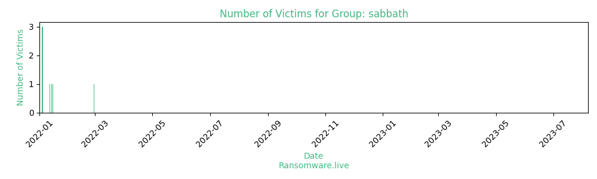

# Profiles for ransomware group : **sabbath**

### External analysis
- https://www.mandiant.com/resources/sabbath-ransomware-affiliate

### URLs
| Title | Available | Last visit | fqdn | Screenshot 
|---|---|---|---|---|
| BLOG | 🔴 | 13/11/2021 03:45 | `http://54bb47h5qu4k7l4d7v5ix3i6ak6elysn3net4by4ihmvrhu7cvbskoqd.onion` | ❌ | 
| none | 🔴 | 13/04/2022 03:32 | `http://54bb47h.blog` | <a href="https://images.ransomware.live/screenshots/54bb47h-blog.png" target=_blank>📸</a> | 

### Total Attacks Over Time

### Victims

> 17 victims found

| victim | date | Description | Screenshot | 
|---|---|---|---|
| [`aria-label=Google>`](https://google.com/search?q=aria-label%3DGoogle%3E) | 28/02/2022 |   |   |
| [`JALEEL TRADERS LLC`](https://google.com/search?q=JALEEL+TRADERS+LLC) | 15/01/2022 |   |   |
| [`ASL Napoli 3 Sud Network Seized`](https://google.com/search?q=ASL+Napoli+3+Sud+Network+Seized) | 14/01/2022 |   |   |
| [`Protected: PRIVATE POST  ITALY`](https://google.com/search?q=Protected%3A+PRIVATE+POST++ITALY) | 12/01/2022 |   |   |
| [`Summit College`](https://google.com/search?q=Summit+College) | 04/01/2022 |   |   |
| [`Close drawer`](https://google.com/search?q=Close+drawer) | 04/01/2022 |   |   |
| [`Close search modal`](https://google.com/search?q=Close+search+modal) | 04/01/2022 |   |   |
| [`TRIGYN 2 0  Data Leak`](https://google.com/search?q=TRIGYN+2+0+%7C+Data+Leak) | 28/12/2021 |   |   |
| [`Prenax`](https://google.com/search?q=Prenax) | 20/12/2021 |   |   |
| [`Social Enterprise (SEC)`](https://google.com/search?q=Social+Enterprise+%28SEC%29) | 12/12/2021 |   |   |
| [`Trigyn Technologies Ltd`](https://google.com/search?q=Trigyn+Technologies+Ltd) | 10/12/2021 |   |   |
| [`Flagship`](https://google.com/search?q=Flagship) | 22/11/2021 |   |   |
| [`Stoningtonschools`](https://google.com/search?q=Stoningtonschools) | 22/11/2021 |   |   |
| [`AISD`](https://google.com/search?q=AISD) | 22/11/2021 |   |   |
| [`Starline`](https://google.com/search?q=Starline) | 22/11/2021 |   |   |
| [`RocTechnologies`](https://google.com/search?q=RocTechnologies) | 22/11/2021 |   |   |
| [`MCP Services LLC`](https://google.com/search?q=MCP+Services+LLC) | 22/11/2021 |   |   |

Last update : _Sunday 24/09/2023 14.39 (UTC)_
