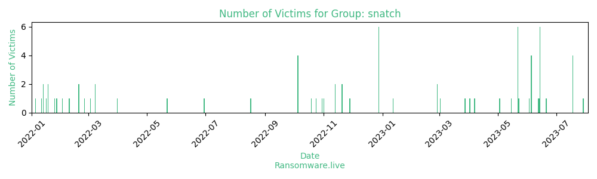

# Profiles for ransomware group : **snatch**

> Snatch is a ransomware which infects victims by rebooting the PC into Safe Mode. Most of the existing security protections do not run in Safe Mode so that it the malware can act without expected countermeasures and it can encrypt as many files as it finds. It uses common packers such as UPX to hide its payload.

### External analysis
- https://blog.intel471.com/2020/05/21/a-brief-history-of-ta505/

- https://github.com/albertzsigovits/malware-notes/blob/master/Snatch.md

- https://intel471.com/blog/a-brief-history-of-ta505

- https://news.sophos.com/en-us/2019/12/09/snatch-ransomware-reboots-pcs-into-safe-mode-to-bypass-protection/

- https://news.sophos.com/en-us/2022/03/17/the-ransomware-threat-intelligence-center/

- https://thedfirreport.com/2020/06/21/snatch-ransomware/

- https://ti.qianxin.com/uploads/2020/02/13/cb78386a082f465f259b37dae5df4884.pdf

- https://twitter.com/VK_Intel/status/1191414501297528832

- https://www.bleepingcomputer.com/news/security/snatch-ransomware-reboots-to-windows-safe-mode-to-bypass-av-tools/

- https://www.crowdstrike.com/blog/financial-motivation-drives-golang-malware-adoption/

🔎 `ransomware.live`has an active  parser for indexing snatch's victims

### URLs
| Title | Available | Last visit | fqdn | Screenshot 
|---|---|---|---|---|
| News | 🔴 | 02/11/2023 06:54 | `http://hl66646wtlp2naoqnhattngigjp5palgqmbwixepcjyq5i534acgqyad.onion` | <a href="https://images.ransomware.live/screenshots/hl66646wtlp2naoqnhattngigjp5palgqmbwixepcjyq5i534acgqyad-onion.png" target=_blank>📸</a> | 
| Access Denied | 🔴 | 29/01/2023 17:17 | `http://snatch.press` | <a href="https://images.ransomware.live/screenshots/snatch-press.png" target=_blank>📸</a> | 
| News | 🔴 | 13/09/2023 02:27 | `http://snatchteam.top` | <a href="https://images.ransomware.live/screenshots/snatchteam-top.png" target=_blank>📸</a> | 

### Ransom note
* [📝 1 ransom note](notes/snatch)

### Total Attacks Over Time

### Victims

> 115 victims found

| victim | date | Description | Screenshot | 
|---|---|---|---|
| [`Detroit Symphony Orchestra`](https://google.com/search?q=Detroit+Symphony+Orchestra) | 01/11/2023 | The Detroit Symphony Orchestra, America’s fourth-oldest, has a history as varied and exciting as that of its hometown. The DSO has been at the center of Detroit’s musical heartbeat for more than 130 years, but it has faced plenty of challenges – including finding stages | <a href="https://images.ransomware.live/screenshots/posts/db7490b651b7512df5a0532ee09b751b.png" target=_blank>📸</a> |
| [`Ancillae-Assumpta Academy`](https://google.com/search?q=Ancillae-Assumpta+Academy) | 25/10/2023 | As a private Catholic elementary school, Ancillae-Assumpta Academy has a clearly articulated and rigorous curriculum rooted in Gospel values and focused on 21st century skills. Since 1945, the Handmaids of the Sacred Heart of Jesus have provided a unique educational program for students in pre-school | <a href="https://images.ransomware.live/screenshots/posts/8ea9ffeaa05f2ba3251b4d22e8ca3ed0.png" target=_blank>📸</a> |
| [`M&n Management`](https://google.com/search?q=M%26n+Management) | 25/10/2023 | M&N Management has been in business for greater than 25 years. What makes M&N Management unique is our attention to detail. This detail is achieved through not only our commitment to maintenance and service but our long term ownership and familiarity with the property and | <a href="https://images.ransomware.live/screenshots/posts/9007fd0f5f3e019eebc60a17d798210b.png" target=_blank>📸</a> |
| [`Cogal Industry`](https://google.com/search?q=Cogal+Industry) | 16/10/2023 | Dal 1949 COGAL INDUSTRY® produce una vasta gamma di biancheria per la casa in Italia. L'azienda si è specializzata nella produzione di tessile per la casa sin dalla fondazione, costruendo il proprio successo di generazione in generazione, frutto dell'entusiasmo e del duro lavoro quotidiano. Da | <a href="https://images.ransomware.live/screenshots/posts/58c1ad82f1016f8073be53b8548e0bae.png" target=_blank>📸</a> |
| [`Intech`](https://google.com/search?q=Intech) | 14/10/2023 | More information in our telegram channel https://t.me/snatch_team Persons responsible for data leakage: Antonio Hernandez:CEOantoniohernandez@intech.com.mxantoniohernandez@usa-intech.com+12147127327https://www.linkedin.com/in/antoniohernandezintechhttps://www.facebook.com/tonylaviada;Jerry Pickett:Senior Program Managerjerrypickett@intech.com.mxjerrypickett@usa-intech.comjerry.pickett@hanes.comhttps://www.linkedin.com/in/jerrypickett;Dino Gonzalez:Sr. Technical Director+12142061411+14697341493+19724085738+19725529787dinogonzalez@intech.com.mxdinogonzalez@usa-intech.comuugonzalez@yahoo.comdgonzalez6@netzero.netdinog12000@yahoo.comhttps://www.linkedin.com/in/dino-gonzalez-5a0a71bhttps://facebook.com/uugonzalez;Jorge Lopez-Cepero:F and A Directorjorgelopezcepero@intech.com.mxjorgelopezcepero@usa-intech.comhttps://www.linkedin.com/in/jorgelc;Nora Cabello:Operations Directionnoracabello@intech.com.mxnoracabello@usa-intech.comhttps://www.linkedin.com/in/nora-cabello-48773331;Ninfa Barajas:General Accountantninfabarajas@usa-intech.comninfabarajas@intech.com.mxhttps://www.linkedin.com/in/ninfa-barajas-trabajo-42551352;Delsy Verenice Hernandez Garcia:Tester Srdelsygarcia@usa-intech.comdelsygarcia@intech.com.mxhttps://www.linkedin.com/in/delsy-verenice-hernandez-garcia-0849424a;Patti Pickett:VPpattipickett@usa-intech.compattipickett@intech.com.mxpattipickett@coldwellbankerhomes.comncjpickett@aol.com+17042364727+17048448232+17049079360https://www.linkedin.com/in/patti-pickett-185b8014https://www.linkedin.com/in/patti-pickett-20667612;Juani Sanchez:Bilingual Executive Assistantjuanisanchez@usa-intech.comjuanisanchez@intech.com.mxjnymacias@hotmail.comhttps://www.linkedin.com/in/juani-sanchez-516a6740;Cesar Moscol De La Cruz:Jefatura de Talleres and | <a href="https://images.ransomware.live/screenshots/posts/7ed910e8e676a45ee24d56f24765d185.png" target=_blank>📸</a> |
| [`Alliance Virgil Roberts Leadership Academy`](https://google.com/search?q=Alliance+Virgil+Roberts+Leadership+Academy) | 10/10/2023 | Alliance College-Ready Public Schools is committed to building an anti-racist, pro-Black community to improve equitable outcomes for all Black and Brown scholars, ensuring our scholars graduate “college ready” with pride in their racial, cultural, and personal identities. | <a href="https://images.ransomware.live/screenshots/posts/4d9f5495a588eb1172ab522aededa59b.png" target=_blank>📸</a> |
| [`Florida Department of Veterans' Affairs`](https://google.com/search?q=Florida+Department+of+Veterans%27+Affairs) | 19/09/2023 | Watching over and advocating for our state’s veterans and their families are the more than 1,100 men and women of the Florida Department of Veterans’ Affairs.Florida has earned a reputation as the most veteran-friendly state in the nation. Our state’s veterans bring more than $18.4 | <a href="https://images.ransomware.live/screenshots/posts/93a3ddf973887ffb23b47d744f7e87de.png" target=_blank>📸</a> |
| [`ZILLI`](https://google.com/search?q=ZILLI) | 19/09/2023 | ZILLI works with ultra-fine calfskin suede and glazed lambskin, but also with exotic animal skins such as peccary, python, crocodile, ostrich and kangaroo, all requiring specific expertise. Jackets are made entirely by hand and decorative stitching and finishing touches are also completed by hand. In | <a href="https://images.ransomware.live/screenshots/posts/89c60947a03c041f761ddf4bc1b845e6.png" target=_blank>📸</a> |
| [`CEFCO`](https://google.com/search?q=CEFCO) | 19/09/2023 | We have been in the fuel business a long time – since 1952, in fact. During that time, we have learned more than a thing or two about gasoline and diesel fuel. Most importantly, we have learned the importance of delivering quality fuel at a | <a href="https://images.ransomware.live/screenshots/posts/63bcc6c29fe4376fac864e8c264ef891.png" target=_blank>📸</a> |
| [`Knight Barry Title`](https://google.com/search?q=Knight+Barry+Title) | 04/09/2023 | We are produly present over 10TB ofcommercial data (customer data, finance) for Knight Barry Title Insurance company represeting 10y data. It has over 500 employees in 5 states and executes over 120K service orders annualy which makes over 1M of unique customer data available. Ready | <a href="https://images.ransomware.live/screenshots/posts/0674b6bd7b0e4b7d44c36390db13a3d1.png" target=_blank>📸</a> |
| [`Fullerton India (SMFG India Credit)`](https://google.com/search?q=Fullerton+India+%28SMFG+India+Credit%29) | 27/08/2023 | More information in our telegram channel https://t.me/snatch_info Persons responsible for data leakage:Pankaj Malik:Executivepankaj.malik@fullertonindia.com;Nitin Nimbalkar:Executivenitin.nimbalkar@fullertonindia.com;Manvinder Singh:VPmanvinder.singh@fullertonindia.com;Tarun Raina:VPtarun.raina@fullertonindia.com;Maithreyi Srikanth:VPmaithreyi.srikanth@fullertonindia.com;Shailesh Chandak:Manager, VPshailesh.chandak@fullertonindia.com;Kasturi Chodankar:Manager, VPkasturi.chodankar@fullertonindia.com;Pratik Thakkar:VPpratik.thakkar@tatacapital.compratik.thakkar@fullertonindia.com;Sukanta Dawn:VPsukanta.dawn@fullertonindia.com;Kartik Bhati:VPkartik.bhati@fullertonindia.com;Stephen Williams:VPstephen.williams@fullertonindia.com;Pankaj Jain:VPpankaj.jain@fullertonindia.com;Abhijeet Shintre:Manager, VPabhijeet.shintre@fullertonindia.com;Amol Bhalerao:VPamol.bhalerao@fullertonindia.com;Sunderraman Subramanian:Director, VPsunderraman.subramanian@fullertonindia.com;Sonal Satyendra:Non-Management, VPsonal.satyendra@fullertonindia.com;Abhijit Dey:VPabhijit.dey@fullertonindia.com;Suman Deb:Manager, Directorsuman.deb@fullertonindia.com;Sagar Sankhe:Non-Management, Managersagar.sankhe@fullertonindia.com;Nikhil Makwana:Non-Management, Managernikhil.makwana@bajajfinserv.innikhil.makwana@fullertonindia.com;Kapil Mishra:Managerkapil.mishra@fullertonindia.com;Bhushan Manapure:Non-Management, Managerbhushan.manapure@religarefinvest.combhushan.manapure@fullertonindia.com;Anshul | <a href="https://images.ransomware.live/screenshots/posts/2265f08173337cf13ffd9a4fbb0e60d3.png" target=_blank>📸</a> |
| [`Department of Defence South African (DARPA)`](https://google.com/search?q=Department+of+Defence+South+African+%28DARPA%29) | 21/08/2023 | Military contracts, internal call signs and personal data | <a href="https://images.ransomware.live/screenshots/posts/5fb9f423d336a5ee69affab8e22b475c.png" target=_blank>📸</a> |
| [`Department of Defence South African`](https://google.com/search?q=Department+of+Defence+South+African) | 21/08/2023 |  | <a href="https://images.ransomware.live/screenshots/posts/5fb9f423d336a5ee69affab8e22b475c.png" target=_blank>📸</a> |
| [`Alinabal`](https://google.com/search?q=Alinabal) | 29/07/2023 | Alinabal is a broadly diversified manufacturer with history reaching as far back as 1913 when it supplied laminated materials for the Model T Ford. Today, through its four distinct business units, Alinabal is a leading manufacturer of a diverse span of products from precision stampings and | <a href="https://images.ransomware.live/screenshots/posts/315d2dc7eaa489de02c43a6372a8a78f.png" target=_blank>📸</a> |
| [`Tampa general hospital`](https://google.com/search?q=Tampa+general+hospital) | 18/07/2023 | Tampa General Hospital is a private not-for-profit hospital and one of the most comprehensive medical facilities in West Central Florida serving a dozen counties with a population in excess of 4 million. As one of the largest hospitals in Florida, Tampa General is licensed for | <a href="https://images.ransomware.live/screenshots/posts/58e8b467fc37d0113e7dc06c56ec5526.png" target=_blank>📸</a> |
| [`Wasserstrom`](https://google.com/search?q=Wasserstrom) | 18/07/2023 | The Wasserstrom Company, which began as a local, family-run business, has steadily grown to become one of the largest restaurant suppliers and distributors of foodservice products. With more than a century of experience and a team of over 1200 dedicated associates, Wasserstrom remains a family-owned | <a href="https://images.ransomware.live/screenshots/posts/0408560977fd636415b9cbd205508802.png" target=_blank>📸</a> |
| [`Ningbo Joyson Electronic Corp.`](https://google.com/search?q=Ningbo+Joyson+Electronic+Corp.) | 18/07/2023 | Ningbo Joyson Electronic Corp. is one of the best automotive suppliers for the world's leading automobile manufacturers, owned the Automotive Safety BU, Automotive Electronics BU, and Joyson Intelligent Automotive Research Institute, Joyson New Energy Research Institute, etc. It is committed to the R&D and manufacture | <a href="https://images.ransomware.live/screenshots/posts/c4af9efcd06c27283c1b166c21bdfd9b.png" target=_blank>📸</a> |
| [`Seasia Infotech`](https://google.com/search?q=Seasia+Infotech) | 18/07/2023 | Seasia has established itself as an industry-leader when it comes to offering efficient, tailor-made, and comprehensive digital transformation services. From enterprise development and application development to marketing and outsourcing technologies, we work with the aim of creating value for our prospects across the globe. | <a href="https://images.ransomware.live/screenshots/posts/dea2d09bdacdd859e6c15028b255e0aa.png" target=_blank>📸</a> |
| [`Medical University of the Americas`](https://google.com/search?q=Medical+University+of+the+Americas) | 21/06/2023 | Newly Reduced Tuition Makes MUA Accessible and Affordable. It is a great time to get started on your medical education! At MUA we recently lowered our tuition, which made us MUA the most affordable Caribbean medical school that is approved to participate in U.S. Federal | <a href="https://images.ransomware.live/screenshots/posts/71286713e440f60c2d4cff4a7b7be1c8.png" target=_blank>📸</a> |
| [`Telcoset`](https://google.com/search?q=Telcoset) | 20/06/2023 | Why Choose Telcoset? Having an experienced staff, providing project management methodologies compatible with international standards, and using manufacturer-independent technologies, Telcoset is specialized in end-to-end, proven solutions and services for its customers. Customized End-to-End Solutions Widespread Business Partnership Network. | <a href="https://images.ransomware.live/screenshots/posts/6c3f3eca33cc3d811d64f35119186420.png" target=_blank>📸</a> |
| [`Bunker Hill Community College`](https://google.com/search?q=Bunker+Hill+Community+College) | 14/06/2023 | Bunker Hill Community College (BHCC), located in Boston, Massachusetts, is the largest community college in Massachusetts, with 13,000 students enrolled per semester. | <a href="https://images.ransomware.live/screenshots/posts/f012660b41c680f904abc4a96d2c4b3c.png" target=_blank>📸</a> |
| [`James Briggs Limited`](https://google.com/search?q=James+Briggs+Limited) | 14/06/2023 | We are a British manufacturer, committed to the continuous innovation of our extensive range of specialised brands. Through ongoing research and development, we continue to develop market-changing formulations, packaging and product design. | <a href="https://images.ransomware.live/screenshots/posts/cb58d0899e095bf98bb356a3eb82be09.png" target=_blank>📸</a> |
| [`Tetrosyl Group`](https://google.com/search?q=Tetrosyl+Group) | 14/06/2023 | Tetrosyl Limited is the largest manufacturer and supplier of car care products in Europe and is the UK's biggest independent oil blender extending its global reach to 100 countries. Tetrosyl leads the way in brand management with a fine blend of innovation, technology and design | <a href="https://images.ransomware.live/screenshots/posts/0728ec33533772fce35fada77648e027.png" target=_blank>📸</a> |
| [`TF AMD Microelectronics`](https://google.com/search?q=TF+AMD+Microelectronics) | 14/06/2023 | Die Prep Services Final Test Wafer Sort Flip Chip TF AMD Penang is Flip Chip power house that offers various packages of Assembly and Test including FCBGA, FCPGA & FCLGA. We are advanced technology factory with world class team, advanced infrastructure and automation capabilities. | <a href="https://images.ransomware.live/screenshots/posts/e0eeae0f1d2b7429983ade0e9dd7000b.png" target=_blank>📸</a> |
| [`MCNA Dental`](https://google.com/search?q=MCNA+Dental) | 14/06/2023 | MCNA is dedicated to promoting high-quality and cost-effective oral health by increasing access to dental care for the public. Our network of dentists and oral health specialists is comprised of fully credentialed independent providers dedicated to superb clinical outcomes.. | <a href="https://images.ransomware.live/screenshots/posts/86193d7f5674ecb83654f0a2d44a8515.png" target=_blank>📸</a> |
| [`Hemenway Financial Services`](https://google.com/search?q=Hemenway+Financial+Services) | 14/06/2023 | Since 1986, Hemenway Associates, Inc. has provided a comprehensive offering of wealth management, tax, and accounting services to clients throughout Omaha, Nebraska and its surrounding cities. Our firm was founded by Joseph Hemenway with the desire to serve the extensive tax and accounting needs of | <a href="https://images.ransomware.live/screenshots/posts/956dfad3195b4e015f0e8c792f449a41.png" target=_blank>📸</a> |
| [`Fullerton India`](https://google.com/search?q=Fullerton+India) | 13/06/2023 | Fullerton India offers a range of calculators to help you make an informed decision regarding the best possible solution to serve your financials needs. Access these free of cost, to get a quick estimates of loan amount you are eligible for. You can also access | <a href="https://images.ransomware.live/screenshots/posts/2265f08173337cf13ffd9a4fbb0e60d3.png" target=_blank>📸</a> |
| [`Global Remote Services`](https://google.com/search?q=Global+Remote+Services) | 12/06/2023 | GRS provides personalized management services for its clients across a broad range of business sectors, whilst also offering support in an impressive number of European languages. | <a href="https://images.ransomware.live/screenshots/posts/16d65741998996b13c982c09701d4131.png" target=_blank>📸</a> |
| [`Avant Grup`](https://google.com/search?q=Avant+Grup) | 05/06/2023 | Avant Grup, has a wide network of operational bases distributed in different cities in order to cover the demand in mobility services that be generated. This extensive offer of service coverage provides our clients with a global solution throughout the national territory. Our centralized reservation | <a href="https://images.ransomware.live/screenshots/posts/82b0e24040bb3bf8e9c20ce1d2262eee.png" target=_blank>📸</a> |
| [`The Briars Group`](https://google.com/search?q=The+Briars+Group) | 05/06/2023 | We help ambitious businesses land and expand in record time without huge set up costs, compliance headaches or unnecessary business risk. Briars is an international back office consultancy company, providing support services for the full lifecycle of your business, no matter the location, for over 30 | <a href="https://images.ransomware.live/screenshots/posts/80c02526041e456c11de94cc5e27e878.png" target=_blank>📸</a> |
| [`Mount Desert Island Hospital`](https://google.com/search?q=Mount+Desert+Island+Hospital) | 05/06/2023 | Mount Desert Island Hospital serves a close-knit island and surrounding communities through a 25-bed critical access facility in Bar Harbor and a network of area health centers—all designed to provide comprehensive healthcare for residents and visitors. | <a href="https://images.ransomware.live/screenshots/posts/1b41852d99d97e4eb9fb92e779900742.png" target=_blank>📸</a> |
| [`ELITechGroup`](https://google.com/search?q=ELITechGroup) | 05/06/2023 | ELITech Group is an integrated in-vitro diagnostics company that serves hospitals and diagnostic laboratories in more than 100 countries through a direct sales organization and through third party distribution partners. The company develops, manufactures and markets a wide range of diagnostic products and solutions – | <a href="https://images.ransomware.live/screenshots/posts/6b5e21508458aba61d7bea4418c02546.png" target=_blank>📸</a> |
| [`SsangYong Motor`](https://google.com/search?q=SsangYong+Motor) | 03/06/2023 | The company was named SsangYong Motor Company in 1988, following its acquisition by the chaebol SsangYong Group in 1986. SsangYong Motor was then acquired by Daewoo Motors, SAIC Motor, and then Mahindra & Mahindra. In 2022, the company was acquired by the KG Group and | <a href="https://images.ransomware.live/screenshots/posts/ded19993434d96d46a0d6e9afccb4157.png" target=_blank>📸</a> |
| [`Chattanooga State Community College`](https://google.com/search?q=Chattanooga+State+Community+College) | 23/05/2023 | Chattanooga State is a special place designed to give you an inviting setting to learn and gather with friends. Our beautiful campus is located on the Tennessee River, just 10 minutes northeast of downtown and serves as the center of the ChattState community. It features | <a href="https://images.ransomware.live/screenshots/posts/e846d9c9be6efd818d7846950488039a.png" target=_blank>📸</a> |
| [`Asia Vital Components`](https://google.com/search?q=Asia+Vital+Components) | 22/05/2023 | Asia Vital Components Co., Ltd. (AVC) was founded in 1991. We are a listed company in the Taiwan Stock Exchange (Stock code: 3017), and a stock in the Russell Global Index. The Company ranked at No. 95 in the Top 2000 Manufacturers in Taiwan list | <a href="https://images.ransomware.live/screenshots/posts/2040a24bd9343a92a90f6cee9b6fb4c7.png" target=_blank>📸</a> |
| [`LiveAction`](https://google.com/search?q=LiveAction) | 22/05/2023 | LiveAction’s Network Intelligence platform transforms complex data into actionable insights, providing organizations with a comprehensive view of their network, from network and application performance to security. Enterprise teams can rapidly take action to resolve network issues at scale, accelerate threat response, increase employee productivity, and | <a href="https://images.ransomware.live/screenshots/posts/4862d179ae3f0c88f9543c6f396ad924.png" target=_blank>📸</a> |
| [`MSSNY`](https://google.com/search?q=MSSNY) | 22/05/2023 | The Medical Society of the State of New York (MSSNY) is an organization of approximately 30,000 licensed physicians, medical residents, and medical students in New York State. Members participate in both the state society and in their local county medical societies. | <a href="https://images.ransomware.live/screenshots/posts/e55a81fbc45021405be7bee222de67c5.png" target=_blank>📸</a> |
| [`FRESCA`](https://google.com/search?q=FRESCA) | 22/05/2023 | Fresca is a grapefruit-flavored citrus soft drink created by The Coca-Cola Company.Borrowing the word Fresca (meaning "fresh") from Italian, Spanish and Portuguese, it was introduced in the United States in 1966. Originally a bottled sugar-free diet soda, sugar sweetened versions were introduced in some markets. | <a href="https://images.ransomware.live/screenshots/posts/c95304c1751585ad31e09385eebf374d.png" target=_blank>📸</a> |
| [`Canadian Nurses Association`](https://google.com/search?q=Canadian+Nurses+Association) | 22/05/2023 | CNA is a powerhouse nursing organization leading the development of health policy across Canada. Representing Canada's 460,000 regulated nurses, across all 13 provinces and territories, we're the only focal point for the profession on the national stage — and have been since 1908. | <a href="https://images.ransomware.live/screenshots/posts/d3519eb11cc90fef7a1595337244ee45.png" target=_blank>📸</a> |
| [`Comoli Ferrari`](https://google.com/search?q=Comoli+Ferrari) | 22/05/2023 | Comoli Ferrari è uno dei maggiori distributori di soluzioni per l’impiantistica elettrica e idrotermosanitaria completamente italiano, da anni il benchmark di clienti e fornitori di un ampio mercato impiantistico che ricerca prodotti, soluzioni e competenza per quadri elettrici, automazione, domotica, sicurezza, illuminazione, climatizzazione, antenne, cavi, | <a href="https://images.ransomware.live/screenshots/posts/48454e4bf5ac62134d2129c1e67fb94c.png" target=_blank>📸</a> |
| [`IXPERTA`](https://google.com/search?q=IXPERTA) | 15/05/2023 | We first get to know each customer thoroughly so that we can design exactly the solution they need. Nothing less and nothing more. That is why we achieve top results in both public administration and companies of all sizes and industries. Whether they are from | <a href="https://images.ransomware.live/screenshots/posts/9ad192afed84ab734e7b6bd60b120723.png" target=_blank>📸</a> |
| [`Lawrence Family Development Charter School`](https://google.com/search?q=Lawrence+Family+Development+Charter+School) | 03/05/2023 | The history of Lawrence Family Development, Inc. (LFD, Inc.) begins with the founding of the Lawrence Youth Commission (LYC). In 1988 the electorate of the City of Lawrence passed an ordinance creating the LYC under the City’s Charter. This new organization was charged with the | <a href="https://images.ransomware.live/screenshots/posts/d36ca6a85e54f2b8664685fbcc263b6b.png" target=_blank>📸</a> |
| [`Americana Restaurants`](https://google.com/search?q=Americana+Restaurants) | 07/04/2023 | Americana Restaurants is a trailblazer in the MENA region and Kazakhstan’s Out of Home Dining industry, and among the world’s leading operators of QSR and casual dining restaurants. With a diverse portfolio of iconic global brands and a dominant regional footprint, we have delivered consistent | <a href="https://images.ransomware.live/screenshots/posts/cfbc70153190e369b68318b62e2e790b.png" target=_blank>📸</a> |
| [`Gaston College`](https://google.com/search?q=Gaston+College) | 02/04/2023 | Beginning with just two buildings in 1964, by the end of the 1970s a total of 10 buildings graced the Dallas, or main, Campus. Throughout the 1980s and 1990s, 11 more buildings were added. It was during the mid-1990s that the College’s Lincoln Campus was | <a href="https://images.ransomware.live/screenshots/posts/90677c0589e36e2bd4c49208c58f57e6.png" target=_blank>📸</a> |
| [`City of Modesto, CA`](https://google.com/search?q=City+of+Modesto%2C+CA) | 28/03/2023 | Proudly serving, protecting and partnering with our community for a safer Modesto. | <a href="https://images.ransomware.live/screenshots/posts/5eac024cb8dfa55afa380085fece0e61.png" target=_blank>📸</a> |
| [`The Metropolitan Opera`](https://google.com/search?q=The+Metropolitan+Opera) | 02/03/2023 | The Metropolitan Opera is a vibrant home for the most creative and talented singers, conductors, composers, musicians, stage directors, designers, visual artists, choreographers, and dancers from around the world. | <a href="https://images.ransomware.live/screenshots/posts/f392fbce80940a2127bf2ff2b863ade1.png" target=_blank>📸</a> |
| [`Ingenico`](https://google.com/search?q=Ingenico) | 27/02/2023 | We help you navigate a new world of commerce, in which verticalisation, expanded services, and digital players are transforming the payments landscape. We are the trusted partner of financial institutions, retail chains and small merchants alike, supplying them with simple and reliable payments solutions. | <a href="https://images.ransomware.live/screenshots/posts/4aa2e774f4a803537127749637b0aed0.png" target=_blank>📸</a> |
| [`MSX International`](https://google.com/search?q=MSX+International) | 27/02/2023 | For more than 25 years, we’ve been a dedicated partner to leading automotive brands around the world. We support them in transforming their businesses and in managing their operations across the areas of Customer Experience, Repair Optimization, Learning and Insights. | <a href="https://images.ransomware.live/screenshots/posts/487c05943470d58c8302434dce9a5a98.png" target=_blank>📸</a> |
| [`Physician Partners of America`](https://google.com/search?q=Physician+Partners+of+America) | 12/01/2023 | Founded in 2013 by a physician-turned-entrepreneur, Physician Partners of America aims to offer patients a safe, seamless healthcare experience and doctors who can totally focus on patients. Physician Partners of America offers pain management, orthopedics, minimally invasive laser spine surgery, mental health counseling. We are | <a href="https://images.ransomware.live/screenshots/posts/27face176c675ed0e24e87a257acbeb9.png" target=_blank>📸</a> |
| [`Centro Turistico Giovanile`](https://google.com/search?q=Centro+Turistico+Giovanile) | 28/12/2022 | Il CTG è un' associazione nazionale senza scopo di lucro che promuove e realizza un progetto educativo e di formazione integrale della persona, attraverso momenti di crescita, di impegno e di aggregazione sociale, ispirandosi alla concezione cristiana dell'uomo e della vita, nel servizio alle persone |   |
| [`ET GLOBAL`](https://google.com/search?q=ET+GLOBAL) | 28/12/2022 | We showcase your brands worldwide – with precision and great attention to detail. Therefore, you will find us in major cities around the world. |   |
| [`Square Yards`](https://google.com/search?q=Square+Yards) | 28/12/2022 | Square Yards is India’s largest integrated platform for Real Estate & Mortgages and one of the fastest growing Proptech platform in UAE, Rest of Middle East, Australia & Canada. Square Yards platform offers an integrated consumer experience & covers the full real-estate journey from search |   |
| [`TCL Chinese Theatres`](https://google.com/search?q=TCL+Chinese+Theatres) | 28/12/2022 | The TCL Chinese Theatre is the most iconic movie palace in the world. With over 50 events a year, including movie premieres, imprint ceremonies, and film festivals, the theatre continues to make Hollywood history every day. |   |
| [`Trubee, Collins & Co`](https://google.com/search?q=Trubee%2C+Collins+%26+Co) | 28/12/2022 | Trubee, Collins & Co., Inc. is one of the oldest, independently-owned Financial Services in Western New York. Established in 1940, Trubee, Collins & Co., Inc. has earned the respect of our clients by demonstrating competence, integrity and a solid long term investment philosophy. The company |   |
| [`Einatec`](https://google.com/search?q=Einatec) | 28/12/2022 | Nuestros equipos han desarrollado desde aplicaciones multiplataforma hasta grandes infraestructuras IT. Y nuestras mentes creativas se encargan del branding, diseño y el marketing de nuestros clientes. |   |
| [`STGi`](https://google.com/search?q=STGi) | 28/11/2022 |   | <a href="https://images.ransomware.live/screenshots/posts/eef65b649c4a3eef0861c1e40a270936.png" target=_blank>📸</a> |
| [`McGRATH`](https://google.com/search?q=McGRATH) | 20/11/2022 |   | <a href="https://images.ransomware.live/screenshots/posts/2fab45ffaf724606010af89f267cc3b0.png" target=_blank>📸</a> |
| [`SAIPRESS`](https://google.com/search?q=SAIPRESS) | 20/11/2022 |   | <a href="https://images.ransomware.live/screenshots/posts/664f7e11fe407ba9f7437fe8288de7fe.png" target=_blank>📸</a> |
| [`YASH Technologies`](https://google.com/search?q=YASH+Technologies) | 13/11/2022 |   |   |
| [`Saurer`](https://google.com/search?q=Saurer) | 13/11/2022 |   |   |
| [`Grandview, MO`](https://google.com/search?q=Grandview%2C+MO) | 01/11/2022 |   | <a href="https://images.ransomware.live/screenshots/posts/a761889da09a6f576d88910c461dc517.png" target=_blank>📸</a> |
| [`HENSOLDT France`](https://google.com/search?q=HENSOLDT+France) | 30/10/2022 |   |   |
| [`Kenosha Unified School District`](https://google.com/search?q=Kenosha+Unified+School+District) | 24/10/2022 |   |   |
| [`Weidmuller`](https://google.com/search?q=Weidmuller) | 19/10/2022 |   |   |
| [`OPPLE Lighting`](https://google.com/search?q=OPPLE+Lighting) | 05/10/2022 |   |   |
| [`Empower Insurance`](https://google.com/search?q=Empower+Insurance) | 05/10/2022 |   |   |
| [`Unicity`](https://google.com/search?q=Unicity) | 05/10/2022 |   |   |
| [`Oil India Limited`](https://google.com/search?q=Oil+India+Limited) | 05/10/2022 |   |   |
| [`Stratford University`](https://google.com/search?q=Stratford+University) | 17/08/2022 |   |   |
| [`Atlantic Dialysis Management Services`](https://google.com/search?q=Atlantic+Dialysis+Management+Services) | 30/06/2022 | Atlantic Dialysis Management Services, LLC (“ADMS”) was established to provide new dialysis site development, day to day administration and management of dialysis services and related business development activities. The business strategy is to maximize individual site results through consolidated activities. Central to the ADMS approach is the long term control of these clinical services by nephrologists. |   |
| [`Apex`](https://google.com/search?q=Apex) | 29/06/2022 |   |   |
| [`HEMERIA`](https://google.com/search?q=HEMERIA) | 22/05/2022 |   |   |
| [`Yip in Tsoi`](https://google.com/search?q=Yip+in+Tsoi) | 31/03/2022 |   |   |
| [`Xtera`](https://google.com/search?q=Xtera) | 08/03/2022 |   |   |
| [`Warren Resources`](https://google.com/search?q=Warren+Resources) | 08/03/2022 |   |   |
| [`Private company #2`](https://google.com/search?q=Private+company+%232) | 03/03/2022 |   |   |
| [`McDonald's`](https://google.com/search?q=McDonald%27s) | 25/02/2022 |   | <a href="https://images.ransomware.live/screenshots/posts/d26d717c29b94f577a7940bc2334c4d1.png" target=_blank>📸</a> |
| [`CIELD`](https://google.com/search?q=CIELD) | 19/02/2022 |   |   |
| [`PFEIFER Drako`](https://google.com/search?q=PFEIFER+Drako) | 19/02/2022 |   |   |
| [`PetroVietnam`](https://google.com/search?q=PetroVietnam) | 09/02/2022 |   |   |
| [`Overseas Travel Agency`](https://google.com/search?q=Overseas+Travel+Agency) | 02/02/2022 |   |   |
| [`Mab Group`](https://google.com/search?q=Mab+Group) | 27/01/2022 |   |   |
| [`Thomson Broadbent`](https://google.com/search?q=Thomson+Broadbent) | 25/01/2022 |   |   |
| [`Vehicle Service Group`](https://google.com/search?q=Vehicle+Service+Group) | 18/01/2022 |   |   |
| [`Hall Cross Academy`](https://google.com/search?q=Hall+Cross+Academy) | 18/01/2022 |   |   |
| [`Private Company`](https://google.com/search?q=Private+Company) | 16/01/2022 |   |   |
| [`Hanon Systems`](https://google.com/search?q=Hanon+Systems) | 13/01/2022 |   |   |
| [`HAPOLO`](https://google.com/search?q=HAPOLO) | 13/01/2022 |   |   |
| [`TaxNetUSA`](https://google.com/search?q=TaxNetUSA) | 11/01/2022 |   |   |
| [`Premium Transportation Group`](https://google.com/search?q=Premium+Transportation+Group) | 05/01/2022 |   |   |
| [`TUI UK`](https://google.com/search?q=TUI+UK) | 26/12/2021 |   |   |
| [`LAVA`](https://google.com/search?q=LAVA) | 26/12/2021 |   |   |
| [`Leuze`](https://google.com/search?q=Leuze) | 21/12/2021 |   |   |
| [`InTown Suites`](https://google.com/search?q=InTown+Suites) | 21/12/2021 |   | <a href="https://images.ransomware.live/screenshots/posts/ce8f132158cb49088849b742b6636a46.png" target=_blank>📸</a> |
| [`leuzeusa.com`](https://google.com/search?q=leuzeusa.com) | 21/12/2021 |   |   |
| [`Skyxe Saskatoon Airport`](https://google.com/search?q=Skyxe+Saskatoon+Airport) | 20/12/2021 |   |   |
| [`The ExecuSearch Group`](https://google.com/search?q=The+Execu%7CSearch+Group) | 14/12/2021 |   |   |
| [`ABC Seamless`](https://google.com/search?q=ABC+Seamless) | 14/12/2021 |   |   |
| [`Medical Pharmacies`](https://google.com/search?q=Medical+Pharmacies) | 10/12/2021 |   |   |
| [`Altrux Medical`](https://google.com/search?q=Altrux+Medical) | 07/12/2021 | Altrux Medical was established in 2006 and is headquartered in Atlanta, Georgia. We are a family owned and operated business. I enjoyed my early career in information technologies as an Apple Macintosh expert in the executive office suite industry, then home educated our three children. |   |
| [`Fittingbox`](https://google.com/search?q=Fittingbox) | 07/12/2021 |   |   |
| [`Lootah Group`](https://google.com/search?q=Lootah+Group) | 02/12/2021 |   |   |
| [`CareFirst CHPDC`](https://google.com/search?q=CareFirst+CHPDC) | 02/12/2021 |   |   |
| [`Volvo Car Corporation`](https://google.com/search?q=Volvo+Car+Corporation) | 30/11/2021 |   |   |
| [`QRS Healthcare Solutions`](https://google.com/search?q=QRS+Healthcare+Solutions) | 30/11/2021 |   |   |
| [`Amtech Corporation`](https://google.com/search?q=Amtech+Corporation) | 29/11/2021 |   |   |
| [`APG Neuros`](https://google.com/search?q=APG+Neuros) | 29/11/2021 |   |   |
| [`Salinen Austria`](https://google.com/search?q=Salinen+Austria) | 29/11/2021 |   |   |
| [`Ishida`](https://google.com/search?q=Ishida) | 29/11/2021 |   |   |
| [`Arbitech`](https://google.com/search?q=Arbitech) | 29/11/2021 |   |   |
| [`Daylesford Organic`](https://google.com/search?q=Daylesford+Organic) | 29/11/2021 |   |   |
| [`Bock, Hatch, Lewis & Oppenheim, LLC`](https://google.com/search?q=Bock%2C+Hatch%2C+Lewis+%26+Oppenheim%2C+LLC) | 29/11/2021 |   |   |
| [`Landmark Builders`](https://google.com/search?q=Landmark+Builders) | 29/11/2021 |   |   |
| [`Match MG`](https://google.com/search?q=Match+MG) | 29/11/2021 |   |   |
| [`Cadence Aerospace`](https://google.com/search?q=Cadence+Aerospace) | 29/11/2021 |   |   |

Last update : _Friday 24/11/2023 13.15 (UTC)_
