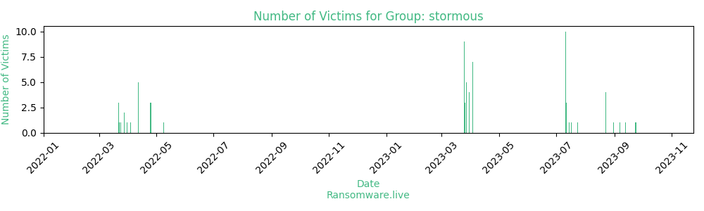

# Profiles for ransomware group : **stormous**

### External analysis
- stormouss21@dnmx.org

🔎 `ransomware.live`has an active  parser for indexing stormous's victims

### URLs
| Title | Available | Last visit | fqdn | Screenshot 
|---|---|---|---|---|
| Database Shop | 🔴 | 09/05/2022 22:27 | `http://3slz4povugieoi3tw7sblxoowxhbzxeju427cffsst5fo2tizepwatid.onion` | ❌ | 
| STORMOUS blog | 🔴 | 25/07/2023 22:50 | `http://h3reihqb2y7woqdary2g3bmk3apgtxuyhx4j2ftovbhe3l5svev7bdyd.onion` | <a href="https://images.ransomware.live/screenshots/h3reihqb2y7woqdary2g3bmk3apgtxuyhx4j2ftovbhe3l5svev7bdyd-onion.png" target=_blank>📸</a> | 

### Total Attacks Over Time

### Posts

> 62 victims found

| post | date | Description | Screenshot | 
|---|---|---|---|
| [`dynamite`](https://google.com/search?q=dynamite) | 24/07/2023 | DYNAMITE was founded in 2004 and is home to many best-selling properties, including The Boys, The Shadow, Warlord of Mars, Game of Thrones, SEAL Team Six and more! Dynamite owns and controls an extensive library with over 3,000 characters (which includes Warren, Harris Comics, Charlton, and Chaos Comics properties), such as Vampirella, Pantha, Evil Ernie, and Peter Cannon: Thunderbolt | <a href="https://images.ransomware.live/screenshots/posts/e88184d902ed137e28d1a0243bc748aa.png" target=_blank>📸</a> |
| [`Senior`](https://google.com/search?q=Senior) | 17/07/2023 | Senior develops and delivers enterprise resource planning, logistics, access and security management, and human capital management solutions. It also offers corporate performance, infrastructure, and business consulting solutions as well as various support services. | <a href="https://images.ransomware.live/screenshots/posts/233f7d833ff373ae89d612989d208208.png" target=_blank>📸</a> |
| [`jasperpictures`](https://google.com/search?q=jasperpictures) | 15/07/2023 | The Jasper Picture Company is an ideal choice for creating corporate video production content for all industries, including government, not-for-profit, and businesses. Our expert team consists of talented and experienced professionals who are passionate about creating high-quality engaging video content that meets our clients needs | <a href="https://images.ransomware.live/screenshots/posts/e46e5ee808c7f1e2d3227902f8874336.png" target=_blank>📸</a> |
| [`Ministerio de Cultura de la Republica de Cuba " STORMOUS + GhostSec "`](https://google.com/search?q=Ministerio+de+Cultura+de+la+Republica+de+Cuba+%22+STORMOUS+%2B+GhostSec+%22) | 12/07/2023 | Ministerio de Cultura de la Republica de Cuba - The triumph of the Cuban Revolution, government cultural functions were performed by the Department of Culture, Ministry of Education and the weight of cultural management lay with the management of private institutions and voluntary associations In 1961 the National Council for Culture was founded as the first independent government institution responsible for cultural policy development | <a href="https://images.ransomware.live/screenshots/posts/ae6cdcbbcadc6644e5e94dba814d3e05.png" target=_blank>📸</a> |
| [`Ministry of Foreign Trade " STORMOUS + GhostSec "`](https://google.com/search?q=Ministry+of+Foreign+Trade+%22+STORMOUS+%2B+GhostSec+%22) | 12/07/2023 | It is the body of the Central State Administration in charge of proposing, and once approved, directing, executing and controlling State and Government policies in matters of foreign trade, foreign investment and international economic collaboration | <a href="https://images.ransomware.live/screenshots/posts/09b55cfc5b716f080f119e0453985255.png" target=_blank>📸</a> |
| [`Ministry of Energy and Mines (Cuba) " STORMOUS +  GhostSec "`](https://google.com/search?q=Ministry+of+Energy+and+Mines+%28Cuba%29+%22+STORMOUS+%2B++GhostSec+%22) | 12/07/2023 | Ministry of Energy and Mines . Ministry created on December 3 , 2012 as an agreement of a meeting of the Council of Ministers of the Republic of Cuba [1] . It is the result of the transformation of the former Ministry of Basic Industry and its main objective is to respond to the problems identified in the sector of its competence - oil, electricity and mining - as well as to advance in the separation of state and business functions | <a href="https://images.ransomware.live/screenshots/posts/daac36e8afe39ed82868a55bb087f26f.png" target=_blank>📸</a> |
| [`berjaya`](https://google.com/search?q=berjaya) | 11/07/2023 | For years, the name Berjaya Clubs has been sparking visions of scenic surroundings, great golfing experiences, wonderful activities, excellent food, memorable events or simply a good time. Today, we bring you the same inspiring experiences, but with a brand new touch of higher quality, class and elegance. |   |
| [`Ingersoll Rand`](https://google.com/search?q=Ingersoll+Rand) | 11/07/2023 | ngersoll Rand is a global market leader with a broad range of innovative and mission-critical air, fluid, energy and medical technologies, providing services and solutions to increase industrial productivity and efficiency. Since merging with Gardner Denver in early 2020, we have more than 300 years of combined experience and innovative expertise |   |
| [`Arrowall`](https://google.com/search?q=Arrowall) | 11/07/2023 | Arrowall Co. is curtainwall designer, manufacturer, and installer with over 30 years’ experience in the central Texas market. The company is selective about the amount and type of work it pursues and focuses on “Getting It Right” in every step of the process from estimating to installation in as safe of a manner as possible |   |
| [`OKS`](https://google.com/search?q=OKS) | 11/07/2023 | Delivering business and legal process outsourcing solutions to some of the world’s largest and most demanding organizations |   |
| [`Matrix`](https://google.com/search?q=Matrix) | 11/07/2023 | Company of the ICCNET group, created in 1997, MATRIX TELECOMS is a Networks and Telecoms operator with a state-of-the-art infrastructure for all types of telecommunications solution needs |   |
| [`treenovum.es`](https://google.com/search?q=treenovum.es) | 11/07/2023 | creative software agency that specializes in making customized software solutions |   |
| [`archiplusinter.com`](https://google.com/search?q=archiplusinter.com) | 11/07/2023 | The Sage Partner Network is a vibrant, close-knit partner community focused on winning together. Partner with a strong brand that can attract and retain customers. Sage provides attractive sales models and margins to help you maximize your investment in your business. |   |
| [`marehotels`](https://google.com/search?q=marehotels) | 11/07/2023 | In 2013, Mare expanded its business and opened the Mare Hotel complex within the same compound. The hotel features modern and meticulous decor, and is equipped with all the necessary amenities for a unique stay. Additionally, it offers a delightful culinary experience with the Mare Asian Food restaurant |   |
| [`mamboafricaadventure`](https://google.com/search?q=mamboafricaadventure) | 11/07/2023 | safari travel company in Tanzania, offering unique and adventurous experiences. We are committed to providing exceptional service to you through a wide range of wildlife tours in the country's natural beauty. We have limitless options of luxury you desire in your trips. Whether it's witnessing the wildlife migration, honeymoon getaways, family safaris, or any other type of safari trips, we have the suitable itinerary for you. Allow us to assist you in fulfilling your safari travel dreams by providing the best amazing experiences |   |
| [`Nipun Consultancy`](https://google.com/search?q=Nipun+Consultancy) | 11/07/2023 | We at Nipun impart training and the skill-set that is required to succeed in the Pharma Industry. We are certain that the benefits acquired from Nipun will contribute positively to the growth and development of the individual and the org |   |
| [`CAMERONMCH`](https://google.com/search?q=CAMERONMCH) | 03/04/2023 | Cameron Memorial Community Hospital is a 40-bed, critical-access hospital located in Angola, Indiana. |   |
| [`TWHOUSE`](https://www.twhouse.com) | 03/04/2023 | The Wholesale House is a company founded in 1978 by Steven and Mary Hite. Starting from humble beginnings with two people working from their home to multiple warehouses today, one thing has never changed: their commitment to exceeding customer expectations. Through a combination of hard work and dedication, the company has become one of the largest distributors of consumer products in the United States, specializing in the mobile audio and video market  | <a href="https://images.ransomware.live/screenshots/posts/db197203d04813b5cad2a4d1677bd25c.png" target=_blank>📸</a> |
| [`METALWORK`](https://www.metalwork.it) | 03/04/2023 | Metal Work is an Italian company specialised in the production of pneumatic components for automation systems  | <a href="https://images.ransomware.live/screenshots/posts/fbbcd60f8ce36f1aa687cb8538c81158.png" target=_blank>📸</a> |
| [`OCEAN`](https://www.ocean.itb.ac.id/) | 03/04/2023 | The Marine Engineering Study Program was established to prepare its graduates to master competence and be able to compete at the national, regional  | <a href="https://images.ransomware.live/screenshots/posts/e36dd0e5c2435b32527e2055bfbdfc3c.png" target=_blank>📸</a> |
| [`TREENOVUM`](https://www.treenovum.es/) | 03/04/2023 | creative software agency that specializes in making customized software solutions  | <a href="https://images.ransomware.live/screenshots/posts/fa723e41405ca40c0febac4f24068f5e.png" target=_blank>📸</a> |
| [`ARCHI+`](https://www.archiplusinter.com) | 03/04/2023 | Archiplus principal office is in Hong Kong, its wholly owned subsidiary company in the same name is registered in Beijing with offices in the United Kingdom, New York and Sydney. Our associate companies consist of Archiplus International (HK) Limited and Zhong Tian Yuan Architects & Engineers Limited which is a Class A architectural firm based in Beijing and qualified to practice in all cities in China  | <a href="https://images.ransomware.live/screenshots/posts/fa723e41405ca40c0febac4f24068f5e.png" target=_blank>📸</a> |
| [`SAGE`](https://www.sage.com) | 03/04/2023 | The Sage Partner Network is a vibrant, close-knit partner community focused on winning together. Partner with a strong brand that can attract and retain customers. Sage provides attractive sales models and margins to help you maximize your investment in your business.  | <a href="https://images.ransomware.live/screenshots/posts/fa723e41405ca40c0febac4f24068f5e.png" target=_blank>📸</a> |
| [`GOV.PL`](https://google.com/search?q=GOV.PL) | 30/03/2023 |  |   |
| [`matrixtelecoms`](https://google.com/search?q=matrixtelecoms) | 30/03/2023 |  |   |
| [`ieseco`](https://google.com/search?q=ieseco) | 30/03/2023 |  |   |
| [`MELCO`](https://google.com/search?q=MELCO) | 30/03/2023 |  |   |
| [`LINX`](https://www.linx.com.br) | 27/03/2023 | A company of the Stone Co group, Linx is a specialist in retail technology and leader in the management software market, with a 45.6% retail market share, as attested by the IDC. All of our expertise is focused on retailing for and for people, connecting the individual to the ease, intelligence and desired experience from the online to the offline world.  |   |
| [`IRCO`](https://www.irco.com/) | 27/03/2023 | Ingersoll Rand is a global market leader with a broad range of innovative and mission-critical air, fluid, energy and medical technologies, providing services and solutions to increase industrial productivity and efficiency. Since merging with Gardner Denver in early 2020, we have more than 300 years of combined experience and innovative expertise  | <a href="https://images.ransomware.live/screenshots/posts/cafc8497115784bd736a5d030cec0cd0.png" target=_blank>📸</a> |
| [`ARROWAL`](https://arrowall.com) | 27/03/2023 | Arrowall Co. is curtainwall designer, manufacturer, and installer with over 30 years experience in the central Texas market. The company is selective about the amount and type of work it pursues and focuses on “Getting It Right in every step of the process from estimating to installation in as safe of a manner as possible. | <a href="https://images.ransomware.live/screenshots/posts/2553a4016ab4728639b14c2ee3003e76.png" target=_blank>📸</a> |
| [`OKSGROUP`](https://www.oksgroup.com/) | 27/03/2023 | Delivering business and legal process outsourcing solutions to some of the worlds largest and most demanding organizations  | <a href="https://images.ransomware.live/screenshots/posts/a3d43ee3ac0bb9c91b0f54d7b77d8a45.png" target=_blank>📸</a> |
| [`FURUNO`](https://furuno.es) | 27/03/2023 | Furuno Spain S.A. is a subsidiary company of Furuno Electric Co., a world leader in marine electronics, headquartered in Nishinomiya - Japan. Since it began with the commercialization of the first fishing probe in 1948, Furuno strives to increase the security and peace of mind of its users, by being able to visualize what was previously invisible. Its capacity for innovation and development has earned it numerous international recognitions and awards. Furuno España S.A., established in Madrid - Spain in 1992, is in charge, through its extensive network of authorized distributors, of commercial promotion and after-sales service, in Spain and Portugal, of products and services related to marine electronics in all maritime sectors.  | <a href="https://images.ransomware.live/screenshots/posts/6ea13f037518d1e1d5f7922137820895.png" target=_blank>📸</a> |
| [`turvatehnika`](https://www.turvatehnika.eu) | 26/03/2023 | Turvatehnika As is a security and protection company established in Tallinn, Estonia in 1995. Since then, the company has grown into a leading supplier of security equipment and a provider of security system solutions in Estonia. The company's services are represented in the supply, installation and maintenance of security systems, surveillance, access and exit control and other related products. The company is distinguished by providing customized solutions to its customers that are in line with their specific needs and requirements. The company also includes a team of highly experienced specialists and technicians in the field of security and protection, who work hard to provide customers with the best possible solutions and services.  | <a href="https://images.ransomware.live/screenshots/posts/e0822ae27a4c0340dbfe3310293436ba.png" target=_blank>📸</a> |
| [`KONICA`](https://www.konicaminolta.com) | 26/03/2023 | Konica Minolta Co Ltd. is a Japanese printing solutions and IT services company headquartered in Tokyo. It results from the merger of two companies, Minolta and Konica. Its CEO is Mr. Shoei Yamana. The group's subsidiaries are based in around fifty countries. It has 43,299 employees. Its products and services are distributed in 150 countries  |   |
| [`SOCOMEC`](https://www.socomec.com) | 26/03/2023 | Socomec is a global energy company that specializes in providing integrated and advanced electrical solutions to medium enterprises. Its products and services include systems design of electric power conversion systems, renewable energy, automatic steering and control systems, protection systems, rides, batteries. The company is characterized by high technology and high quality in its products, and also provides distinguished services in technical maintenance.  | <a href="https://images.ransomware.live/screenshots/posts/1a4d3485780efe473260489027d98b0a.png" target=_blank>📸</a> |
| [`FICHTNER`](http://fichtner-wt.de/) | 25/03/2023 | Fichtner Water & Transportation is a renowned global engineering company specializing in infrastructure projects. The company operates in multiple fields such as water, sewage, waste, transportation, environment, mining, geotechnology, and offshore wind. energy.The company is distinguished by providing high-quality consulting and engineering services for national and international projects |   |
| [`DAVINCI`](https://davinci.edu.ar/) | 25/03/2023 | Da Vinci School has one of the largest educational technological infrastructures in Argentina: fully equipped classrooms, chroma rooms for special effects, sound recording studio, unique motion capture equipment, and study spaces for you to learn. and apply state-of-the-art criteria  | <a href="https://images.ransomware.live/screenshots/posts/bb880f6a2e487e64456e16e60c2f1f26.png" target=_blank>📸</a> |
| [`ALKF+`](https://www.alkf.com/) | 25/03/2023 | Li Jingxun and Lei Huanting Architects is an innovative and diverse architectural company that was founded in 1962 and became a limited company in 1998. The company has experienced and professional design team consisting of six directors, six assistant directors, technical managers, and over 200 technical staff. The company has extensive experience in design and construction in infrastructure, hospitals, schools, commercial, retail, residential, hotels, and industrial fields. | <a href="https://images.ransomware.live/screenshots/posts/542cb8142aca87ece4f8cad659936fb7.png" target=_blank>📸</a> |
| [`berjayaClubs`](http://www.berjayaclubs.com/) | 25/03/2023 | For years, the name Berjaya Clubs has been sparking visions of scenic surroundings, great golfing experiences, wonderful activities, excellent food, memorable events or simply a good time. Today, we bring you the same inspiring experiences, but with a brand new touch of higher quality, class and elegance. | <a href="https://images.ransomware.live/screenshots/posts/0d65f457d90abb48dcebfd2182c3140c.png" target=_blank>📸</a> |
| [`NOVELIS`](https://www.novelis.com/) | 25/03/2023 | Novelis is an aluminum company created by Alcan's spin-off Alcan in 2005. It was acquired by Hindalco in 2007. In 2007, Hindalco announced through Novelis its intention to acquire Aleris, an American aluminum company for $2.6 billion | <a href="https://images.ransomware.live/screenshots/posts/525241030252945b26d8d78c5f8f1708.png" target=_blank>📸</a> |
| [`CONFIDO`](https://www.confido.ae) | 25/03/2023 | Confido Technical Services LLC is a Control Systems Consultancy and Systems Integrator with particular strengths in open systems integration and legacy systems adaptation, whilst retaining the option for future development. Our flexible approach to customer requirements has resulted in a successful delivery of a diverse portfolio of solutions. Our services span a wide spectrum from Controls construction and strategy through bespoke application design and hardware development to enterprise-wide deployment and subsequent training, support and maintenance. Customer satisfaction is our first priority and we ensure our deliverables are consistent with our customers | <a href="https://images.ransomware.live/screenshots/posts/2eee7409c56f1f1a3dec7b24011ffaee.png" target=_blank>📸</a> |
| [`CESCE`](https://www.cesce.com.br) | 25/03/2023 | CESCEBRASIL, the guarantee insurance specialist, implements digital certificates to speed up the entire process of approval, issuance and transmission of policies, now digitally signed, to policyholders, brokers and customers |   |
| [`la providence`](https://laprovidence-blois.fr/) | 25/03/2023 | Catholic educational establishment located in Blois, Campus La Providence is organized around a vocational high school, a technological high school, a higher education center, a CFA and a continuing education center .In contract with the Ministry of National Education, Youth and Sports, as well as declared to the Ministry of Labor and partner of the Center Val de Loire Regional Council, the establishment has evolved over the years into a Campus of trades services to organizations and the CFA-CFC obtained QUALIOPI certification in October 2021 for the CFA and the CFC for training actions and apprenticeship training | <a href="https://images.ransomware.live/screenshots/posts/92a0806de1aa9b9be493cfd6e51ad773.png" target=_blank>📸</a> |
| [`DGCX`](https://www.dgcx.ae) | 25/03/2023 | DGCX is a subsidiary of Dubai Multi Commodities Centre (DMCC), a strategic initiative of the Government of Dubai, with a mandate to enhance commodity trade flows through the Emirate by providing the appropriate physical, market, financial infrastructure and services required.  | <a href="https://images.ransomware.live/screenshots/posts/c096e14951b5fc09d8b7686fce5533fb.png" target=_blank>📸</a> |
| [`ioi`](https://google.com/search?q=ioi) | 09/05/2022 |   |   |
| [`Danaher`](https://google.com/search?q=Danaher) | 25/04/2022 |   |   |
| [`Mattele`](https://google.com/search?q=Mattele) | 25/04/2022 |   |   |
| [`Coca-Cola`](https://google.com/search?q=Coca-Cola) | 25/04/2022 |   |   |
| [`Epic Games Data Breach`](https://google.com/search?q=Epic+Games+Data+Breach) | 12/04/2022 |   |   |
| [`National Rehabilitation Training Center`](https://google.com/search?q=National+Rehabilitation+Training+Center) | 12/04/2022 |   |   |
| [`ALAM LMS`](https://google.com/search?q=ALAM+LMS) | 12/04/2022 |   |   |
| [`Delhi Heights School`](https://google.com/search?q=Delhi+Heights+School) | 12/04/2022 |   |   |
| [`Success Neeti`](https://google.com/search?q=Success+Neeti) | 12/04/2022 |   |   |
| [`A message to France`](https://google.com/search?q=A+message+to+France) | 04/04/2022 |   |   |
| [`infotech ua`](https://google.com/search?q=infotech+ua) | 31/03/2022 |   |   |
| [`Smith Transport company`](https://google.com/search?q=Smith+Transport+company) | 28/03/2022 |   |   |
| [`MIGROS`](https://google.com/search?q=MIGROS) | 28/03/2022 |   |   |
| [`3S Standard Sharing Software`](https://google.com/search?q=3S+Standard+Sharing+Software) | 24/03/2022 |   |   |
| [`Satz Kontor GmbH data`](https://google.com/search?q=Satz+Kontor+GmbH+data) | 23/03/2022 |   |   |
| [`Aurora hacked data`](https://google.com/search?q=Aurora+hacked+data) | 22/03/2022 |   |   |
| [`Core Design`](https://google.com/search?q=Core+Design) | 22/03/2022 |   |   |
| [`Company ENOS PROPERTIES`](https://google.com/search?q=Company+ENOS+PROPERTIES) | 22/03/2022 |   |   |

Last update : _Thursday 03/08/2023 07.07 (UTC)_
