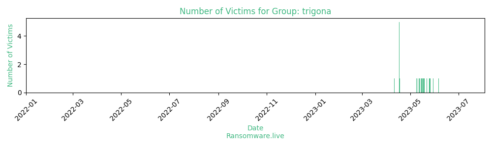

# Profiles for ransomware group : **trigona**

> According to PCrisk, Trigona is ransomware that encrypts files and appends the ._locked extension to filenames. Also, it drops the how_to_decrypt.hta file that opens a ransom note. An example of how Trigona renames files: it renames 1.jpg to 1.jpg._locked, 2.png to 2.png._locked, and so forth.It embeds the encrypted decryption key, the campaign ID, and the victim ID in the encrypted files.

### External analysis
- https://asec.ahnlab.com/en/51343/

- https://unit42.paloaltonetworks.com/trigona-ransomware-update/

- https://www.fortinet.com/blog/threat-research/ransomware-roundup-trigona-ransomware

- https://www.trendmicro.com/en_us/research/23/f/an-overview-of-the-trigona-ransomware.html

🔎 `ransomware.live`has an active  parser for indexing trigona's victims

### URLs
| Title | Available | Last visit | fqdn | Screenshot 
|---|---|---|---|---|
| Trigona is Gone | 🔴 | 18/10/2023 06:56 | `http://3x55o3u2b7cjs54eifja5m3ottxntlubhjzt6k6htp5nrocjmsxxh7ad.onion` | <a href="https://images.ransomware.live/screenshots/3x55o3u2b7cjs54eifja5m3ottxntlubhjzt6k6htp5nrocjmsxxh7ad-onion.png" target=_blank>📸</a> | 
| Blog | 🔴 | 26/06/2023 10:51 | `http://6n5tfadusp4sarzuxntz34q4ohspiaya2mc6aw6uhlusfqfsdomavyyd.onion` | <a href="https://images.ransomware.live/screenshots/6n5tfadusp4sarzuxntz34q4ohspiaya2mc6aw6uhlusfqfsdomavyyd-onion.png" target=_blank>📸</a> | 
| Trigona is Gone | 🔴 | 18/10/2023 06:57 | `http://trigonax2zb3fw34rbaap4cqep76zofxs53zakrdgcxzq6xzt24l5lqd.onion` | <a href="https://images.ransomware.live/screenshots/trigonax2zb3fw34rbaap4cqep76zofxs53zakrdgcxzq6xzt24l5lqd-onion.png" target=_blank>📸</a> | 

### Ransom note
* [📝 1 ransom note](notes/trigona)

### Technique Set

* 🛠️ A technique set is [available](https://app.tidalcyber.com/share/techniqueset/46adb11c-89b4-47e8-aa08-7d5bbb8dc909) from [Tidal Cyber](https://www.tidalcyber.com/)

### Total Attacks Over Time

### Victims

> 30 victims found

| victim | date | Description | Screenshot | 
|---|---|---|---|
| [`Alconex Specialty Products`](https://google.com/search?q=Alconex+Specialty+Products) | 13/10/2023 |  | <a href="https://images.ransomware.live/screenshots/posts/5f545441bd798c56bdfcdc3a4a09e48e.png" target=_blank>📸</a> |
| [`FPZ`](https://google.com/search?q=FPZ) | 12/10/2023 |  | <a href="https://images.ransomware.live/screenshots/posts/8d78442c00a978b9c395ac717c08095c.png" target=_blank>📸</a> |
| [`Flamingo Holland`](https://google.com/search?q=Flamingo+Holland) | 01/10/2023 | Flamingo Holland is a Dutch-based flower company that specializes in growing, exporting, and wholesaling high-quality cut flowers, specifically, roses, peonies, tulips, and other seasonal flowers globally. The company was founded in 1985 and has since then become one of the leading flower companies in the Netherlands. | <a href="https://images.ransomware.live/screenshots/posts/769a32a2869399f50f2f162a161dd11a.png" target=_blank>📸</a> |
| [`Aria Care Partners`](https://google.com/search?q=Aria+Care+Partners) | 01/10/2023 | Aria Care Partners is a healthcare provider that offers post-acute care services to patients in Kansas. It was founded in 2016 and is headquartered in Overland Park, KS. Company specializes in post-acute care services such as transitional care, home health, and hospice care. It aims to provide customized care plans to help patients recover, regain independence, and improve their quality of life. | <a href="https://images.ransomware.live/screenshots/posts/98caf06aca3c86b1a51a446119818014.png" target=_blank>📸</a> |
| [`Portesa`](https://google.com/search?q=Portesa) | 01/10/2023 | Portesa is a forward-thinking livestock company with a strong commitment to innovation, sustainability, and the circular economy. Company is dedicated to transforming raw materials into high-quality products directly at the source. The company operates in collaboration with Cartesa and Aire Sano, forming an integrated production process that sets the industry benchmark for product traceability throughout Europe. | <a href="https://images.ransomware.live/screenshots/posts/cace0abf7412256feb750bb264dc480b.png" target=_blank>📸</a> |
| [`Grupo Boreal`](https://google.com/search?q=Grupo+Boreal) | 01/10/2023 | Grupo Boreal plays a pivotal role in the healthcare industry, extending medical care to over 250,000 beneficiaries across thirteen provinces in the nation. Company is entrusted with the healthcare needs of over 11,000 residents in San Juan. It offers comprehensive coverage at competitive rates. | <a href="https://images.ransomware.live/screenshots/posts/d83efe2038ca8a3144e4214128f1f45a.png" target=_blank>📸</a> |
| [`Quest International`](https://google.com/search?q=Quest+International) | 01/10/2023 | Quest International is a leading global post-sales service support partner for original equipment manufacturers (OEMs) across various industries, founded in 1982. Company offers services supporting OEM customers through depot repairs, field services, supply-chain logistics, and other professional services.  | <a href="https://images.ransomware.live/screenshots/posts/5d15fcb350ca4caee8fc206d2f67e0df.png" target=_blank>📸</a> |
| [`Steelforce`](https://google.com/search?q=Steelforce) | 15/09/2023 |  | <a href="https://images.ransomware.live/screenshots/posts/ea984e4d3c4790170b61582e28aee867.png" target=_blank>📸</a> |
| [`Cedar Holdings`](https://google.com/search?q=Cedar+Holdings) | 13/09/2023 |  | <a href="https://images.ransomware.live/screenshots/posts/5486d786ce822d88404e93d5cf020916.png" target=_blank>📸</a> |
| [`Unimed`](https://google.com/search?q=Unimed) | 05/09/2023 |  | <a href="https://images.ransomware.live/screenshots/posts/448da647d24ca2010b7663160e37c52d.png" target=_blank>📸</a> |
| [`Cyberport`](https://google.com/search?q=Cyberport) | 05/09/2023 |  | <a href="https://images.ransomware.live/screenshots/posts/911cef8b27f4f54a780597ae285b24e1.png" target=_blank>📸</a> |
| [`Public Health Management Corporation`](https://google.com/search?q=Public+Health+Management+Corporation) | 06/06/2023 | Public Health Management Corporation (PHMC) is a non-profit organisation providing public health services in Philadelphia, Pennsylvania. It was established in 1972 and has since served as a leading provider of comprehensive health and human services to individuals, families, and communities in the area. |   |
| [`Pacific Union College`](https://google.com/search?q=Pacific+Union+College) | 30/05/2023 | Pacific Union College (PUC) is a private, Seventh-day Adventist college located in Angwin, California. It was established in 1882 and is accredited by the WASC Senior College and University Commission. |   |
| [`Marshall Construction Ltd`](https://google.com/search?q=Marshall+Construction+Ltd) | 26/05/2023 | Marshall Construction Ltd is a construction company established in 1995. The company is committed to providing high-quality and innovative construction services to its clients. At Marshall Construction Ltd, the emphasis is on building relationships and delivering quality projects. | <a href="https://images.ransomware.live/screenshots/posts/2b6bce20f2500a8b7ac036d61d0b18af.png" target=_blank>📸</a> |
| [`Leidos`](https://google.com/search?q=Leidos) | 25/05/2023 | Leidos Holdings, Inc. is an American defense, aviation, information technology, biomedical research, and engineering company. |   |
| [`Technology and Telecommunications Consultants Inc`](https://google.com/search?q=Technology+and+Telecommunications+Consultants+Inc) | 22/05/2023 | Technology and Telecommunications Consultants Inc (TTC) is a US-based consulting firm that specializes in providing technology and telecommunications solutions to businesses across different industries. |   |
| [`Rolser`](https://google.com/search?q=Rolser) | 19/05/2023 | Rolser is a Spanish company that manufactures and sells a wide range of shopping trolleys, bags, and accessories. The company was founded in 1965 and has since then become a popular brand among customers who prioritize functionality, convenience, and style. |   |
| [`Lolaico Impianti`](https://google.com/search?q=Lolaico+Impianti) | 18/05/2023 | Lolaico Impianti is a leading engineering and construction company based in Italy. It was founded in 1975 by Pietro Lolaico |   |
| [`Feit Electric`](https://google.com/search?q=Feit+Electric) | 16/05/2023 | Feit Electric is a leading lighting manufacturer and distributor in California, United States known for its energy-efficient and high-quality LED lighting solutions. |   |
| [`Accudo Investments LTD`](https://google.com/search?q=Accudo+Investments+LTD) | 15/05/2023 | Accudo Investments LTD is a private limited company registered in the United Kingdom. It specializes in providing financial and investment services to its clients. |   |
| [`TTCCPA`](https://google.com/search?q=TTCCPA) | 13/05/2023 | Treadwell Tamplin is an accounting firm that provides a range of financial services to individuals and businesses in the San Francisco Bay area. The company's team of accounting and tax professionals has extensive knowledge in their respective fields and is committed to delivering personalized services to their clients. |   |
| [`Axiom Professional Solutions`](https://google.com/search?q=Axiom+Professional+Solutions) | 11/05/2023 | Axiom Professional Solutions providing comprehensive recruiting, placement and staffing services for a variety of positions within the automotive industry and light industrial sectors. | <a href="https://images.ransomware.live/screenshots/posts/f2658a7ae8c41d27ac7aed2f9a2fb6f9.png" target=_blank>📸</a> |
| [`Fresh Insurance IT Services`](https://google.com/search?q=Fresh+Insurance+IT+Services) | 09/05/2023 | Fresh Insurance IT Services is a UK-based company that specializes in providing innovative technology solutions for the insurance industry. The company’s portfolio of services includes insurance software development, web and mobile application development, IT consulting and outsourcing, and digital marketing services. |   |
| [`Treadwell, Tamplin & Company, Certified Public Accountants, Madison, GA`](https://google.com/search?q=Treadwell%2C+Tamplin+%26+Company%2C+Certified+Public+Accountants%2C+Madison%2C+GA) | 18/04/2023 | Treadwell Tamplin is an accounting firm that provides a range of financial services to individuals and businesses in the San Francisco Bay area. The company's team of accounting and tax professionals has extensive knowledge in their respective fields and is committed to delivering personalized services to their clients. With their expertise and dedication, Treadwell Tamplin helps businesses and individuals achieve their financial goals. By acquiring this company's confidential data, you will get access to valuable information that can help you grow your business. You will learn about the company's strategies, strengths, weaknesses, opportunities and threats. You will also discover the needs, pain points, motivations and behaviors of its customers. You will be able to use this information to create better products and services, target the right prospects, craft compelling sales pitches and close more deals. | <a href="https://images.ransomware.live/screenshots/posts/161f893c67347fba0cfb3708e478d02d.png" target=_blank>📸</a> |
| [`McKinney Trailers`](https://google.com/search?q=McKinney+Trailers) | 17/04/2023 | McKinney Trailers is a leading transportation equipment and trailer manufacturer in the United States. The company operates several manufacturing plants and retail locations across the United States, providing customers with easy access to their products and services. Their diverse range of products includes dry and refrigerated trailers, flatbed and drop-deck trailers, intermodal chassis, and specialty trailers. | <a href="https://images.ransomware.live/screenshots/posts/b8a829839d152e741e05068fdb43a0f9.png" target=_blank>📸</a> |
| [`Office Notarial de Baillargues`](https://google.com/search?q=Office+Notarial+de+Baillargues) | 17/04/2023 | L’Office Notarial de Baillargues is a notarial office that provides legal advice and services in various fields of law, such as family and inheritance law, urban planning and construction law, rural and agricultural law, etc. It was founded in 1976 and is located in Baillargues, a commune in the Montpellier Métropole in southern France.  | <a href="https://images.ransomware.live/screenshots/posts/aa469bda053b872844c84af296fbd9c7.png" target=_blank>📸</a> |
| [`Winter Park Construction`](https://google.com/search?q=Winter+Park+Construction) | 17/04/2023 | Winter Park Construction (WPC) is a well-established company that has been providing general contractor, pre-construction, construction management and renovation services to Central Florida and the southeast United States since 1974. With over $200M in projects set for completion in 2020 and employment for 140+ full-time employees, WPC has established itself as a leader in the construction industry.  | <a href="https://images.ransomware.live/screenshots/posts/c8f95c1e04f7adaeb64233c59aaea32a.png" target=_blank>📸</a> |
| [`Amouage`](https://google.com/search?q=Amouage) | 17/04/2023 | Amouage is a High Perfumery House renowned for creating some of the most finely crafted perfumes in the world. Founded in the Sultanate of Oman in 1983 to be ‘The Gift of Kings’, the House has redefined the Arabian art of perfumery and garnered a global reputation for bringing innovative modernity and true artistry to all its creations. Masterfully paying tribute to its heritage, Amouage is a unique fusion of East meets West that defines avant-garde opulence. It expresses the contemporary majesty of Oman - a historic trading center for incense and myrrh - around the globe, with arresting and alluring collections that speak to a sophisticated, confident and well-traveled discerning clientele who seek something compellingly precious, extraordinary and personal, every day. | <a href="https://images.ransomware.live/screenshots/posts/9cc67be3e0421fad27580704b147860b.png" target=_blank>📸</a> |
| [`Unique Imaging`](https://google.com/search?q=Unique+Imaging) | 17/04/2023 | Unique Technology, Unique Care. We are proud to offer the latest and greatest in innovative medical imaging services, delivering the fastest and most convenient imaging results, unmatched in South Florida, Latin America and the Caribbean. Our new medical diagnostic imaging equipment can detect pathology and track the effectiveness of treatment that your physician has prescribed. When looking for the right medical imaging or radiology services, look no further than Unique Imaging. 2 Medical imaging centers in Miami conveniently located in Aventura and Miami Beach. Unique Imaging focuses on advance radiology including MRI, CT, US, PET/CT, MRA, CTA, & Echo. Our advanced medical imaging equipment and talented team make us the preferred center for referring physicians.  | <a href="https://images.ransomware.live/screenshots/posts/9e57d4ff117014125caab508a789678e.png" target=_blank>📸</a> |
| [`Albany Clinic`](https://google.com/search?q=Albany+Clinic) | 11/04/2023 | Albany Clinic is a medical center that provides family doctors, specialists, speciality services, diagnostic services and walk-in clinic in Australia. It offers a range of services such as general practice, skin cancer checks, travel medicine, immunisations and more. It has been serving the community for 30 years and prides itself on providing medical care with experience, empathy, understanding and consistency. | <a href="https://images.ransomware.live/screenshots/posts/d2d33cccb62ba4b8954352145057e5f2.png" target=_blank>📸</a> |

Last update : _Friday 24/11/2023 13.15 (UTC)_
